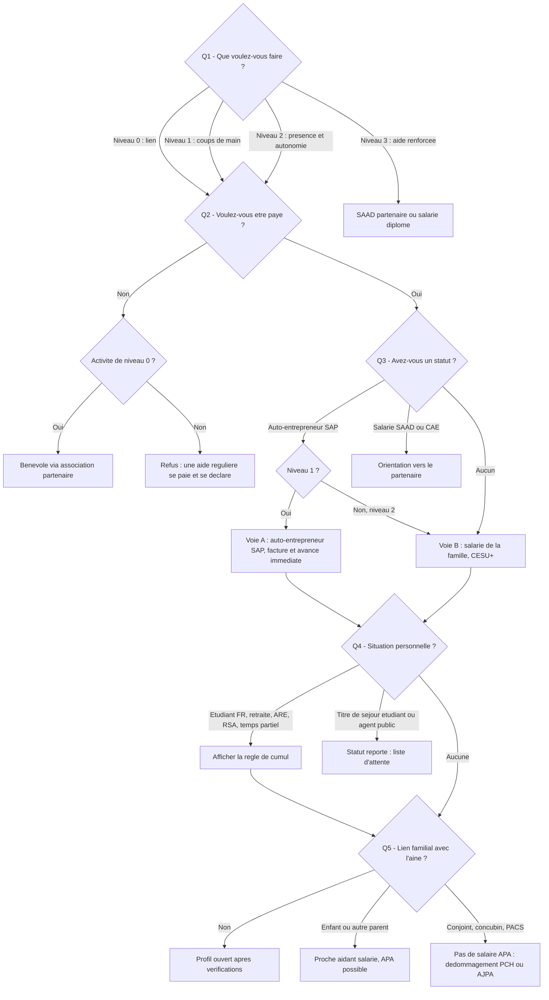

# 08 — Ouvrir Koudmen aux particuliers : l'architecture multi-statuts

> Demande du fondateur : « ajouter des particuliers qui souhaiteraient faire le job, un peu dans le style Yoojo, pas forcément des auto-entrepreneurs mais aussi d'autres ».
> Version 1 — octobre 2026. Complète `00` (synthèse) et `01` (juridique, voies A et B).
> Statut : **analyse avant validation par l'avocat**. Les points marqués [À VÉRIFIER] ne doivent pas servir à une décision sans contrôle.
> Méthode : recherches web en octobre 2026. Les sites yoojo.fr et help.yoojo.com n'étaient pas lisibles en direct depuis notre environnement. Les informations Yoojo viennent donc des extraits indexés de ces pages et de sources secondaires. Chaque affirmation non confirmée par une source primaire est signalée.

---

## 0. La réponse courte

1. **Oui, Koudmen peut accueillir des particuliers.** Ce n'est pas un nouveau modèle. C'est la **voie B** de `01` : le particulier devient **salarié de la famille** (emploi direct, CESU+).
2. **Un « particulier » n'est pas un statut.** Toute personne payée doit avoir un statut : salarié de la famille, auto-entrepreneur, entrepreneur-salarié de CAE, ou salarié d'un SAAD. Sinon, c'est du **travail dissimulé**.
3. **Le statut dépend de l'activité, pas de la personne.** Un étudiant, un retraité ou un voisin peut faire de la compagnie. Mais il doit le faire **comme salarié de la famille**, jamais comme auto-entrepreneur.
4. **Yoojo fait exactement cela** : ses « jobbers » particuliers sont payés comme salariés du client, avec une déclaration CESU faite par un partenaire. Ses auto-entrepreneurs facturent. Ses pros portent un badge.
5. **Deux découvertes changent le parcours diaspora :**
   - l'enfant qui emploie un salarié chez son parent n'a le crédit d'impôt **que si le parent remplit les conditions de l'APA** (60 ans et plus, perte d'autonomie GIR 1 à 4) ;
   - l'exonération de cotisations patronales passe de **70 à 80 ans** depuis juillet 2026 (décret n° 2026-261), sauf pour les bénéficiaires de l'APA ou de la PCH.
6. **En phase 0, Koudmen ne peut pas déclarer à la place de la famille** pour un aîné. Préparer et transmettre les déclarations CESU pour un employeur âgé, c'est une activité de **mandataire**, soumise à **agrément** (`01` § 1.2). Koudmen prépare. La famille valide.
7. **Recommandation :** ouvrir au pilote 4 statuts (salarié de la famille, proche aidant salarié via l'APA, auto-entrepreneur SAP pour les coups de main, SAAD partenaire). Ouvrir les bénévoles **seulement via une association partenaire**. Reporter la CAE et quelques profils sensibles. Interdire 6 schémas (§ 5).

---

## 1. Comment fonctionnent Yoojo et les plateformes comparables

### 1.1 Yoojo (ex-Youpijob) en 2025-2026

| Sujet | Ce que nous avons trouvé | Niveau de fiabilité |
|---|---|---|
| **Qui sont les « jobbers »** | Trois profils : **particuliers** (étudiants, salariés à temps partiel, retraités), **auto-entrepreneurs**, et **professionnels** (badge « PRO », numéro d'immatriculation et assurance pro) | Moyen. Confirmé par la page « Confiance & sécurité » de Yoojo (extrait indexé) et par des guides tiers |
| **Le client devient employeur** | Quand le client réserve un particulier, il devient **particulier employeur**. Le jobber est son salarié | Bon. Pages Yoojo « Déclarer une femme de ménage » et « CESU employeur » (extraits indexés) |
| **Qui déclare** | Le client choisit l'option **« déclaratif »**. Chaque fin de **trimestre**, Yoojo (via son partenaire **Declaradom**, présenté comme « mandataire tiers déclarant ») déclare les heures à l'URSSAF. Le partenaire prend en charge « l'ensemble des obligations d'employeur particulier, de la déclaration à l'attestation fiscale » | Moyen. Extraits du centre d'aide Yoojo. **Non vérifié** : le statut exact de Declaradom (mandataire agréé ou simple tiers de déclaration) |
| **Mécanisme utilisé** | **CESU déclaratif** (URSSAF), avec déclaration trimestrielle. Pas de **Pajemploi** (réservé à la garde d'enfants par une assistante maternelle ou une garde à domicile) | Moyen pour le CESU. Pajemploi : déduction logique, hors champ des seniors |
| **Avance immédiate** | **Aucune source** ne montre que Yoojo utilise l'avance immédiate. La déclaration est trimestrielle. Le crédit d'impôt passe donc, en apparence, par la **déclaration annuelle de revenus** (case 7DB préremplie) | **Non vérifié.** À confirmer auprès de Yoojo |
| **Crédit d'impôt 50 %** | Pour un jobber particulier : crédit d'impôt de l'**employeur** sur salaire et cotisations déclarés. Pour un auto-entrepreneur : seulement s'il est **déclaré SAP**. Yoojo l'écrit lui-même : « un auto-entrepreneur sans déclaration services à la personne n'ouvre pas droit au crédit d'impôt » | Bon (extrait indexé de l'aide Yoojo) |
| **Statut revendiqué** | Yoojo se présente comme « **Mandataire officiel de Service à la Personne** dans le cadre du dispositif CESU » | **Non vérifié.** Aucun numéro d'agrément trouvé. Yoojo semble s'appuyer sur un partenaire |
| **Facturation des auto-entrepreneurs** | L'auto-entrepreneur donne un **mandat de facturation** à Yoojo, qui émet la facture en son nom | Moyen |
| **Frais côté client** | **20 % de frais de service** sur chaque transaction, **minimum 5 €**. Affichés en plus du tarif du jobber. Non remboursés en cas d'annulation selon des avis clients | Moyen. Plusieurs sources secondaires concordent |
| **Frais de déclaration** | **3 € par déclaration** (1,50 € après crédit d'impôt), gratuits avec l'abonnement **Yoojo+** | Moyen (extraits Yoojo). Prix de Yoojo+ **non trouvé** |
| **Frais côté jobber** | Sources **contradictoires** : « commission de 15 à 20 % », « 20 à 30 % », « 6 % sur les tickets CESU ». Inscription gratuite | **Non vérifié.** Il est possible que Yoojo prélève des deux côtés |
| **Assurance** | Responsabilité civile **AXA France IARD**, jusqu'à **2 M€** par prestation. **Yoojo Cover** inclus (jusqu'à 250 € de dommage), **Cover Plus** en option (jusqu'à 1 500 €) | Bon. Communiqué AXA hébergé par Yoojo et page Yoojo Cover |
| **Vérification des jobbers** | Pièce d'identité, photo, compte bancaire au nom du jobber, numéro de sécurité sociale, numéro fiscal. Pour les pros : immatriculation et assurance. **Aucune mention** de casier judiciaire, d'entretien ou de formation | Bon pour la liste. L'absence de casier est un constat, pas une preuve |
| **Catégories seniors** | Oui. « Aide à domicile », « maintien à domicile », « aide aux courses ». Tarifs constatés : dame de compagnie **13 €/h**, accompagnement extérieur **12 €/h**, auxiliaire de vie **15 €/h**, courses **dès 13 €/h**. Tarif libre, fixé par le jobber | Moyen (pages Yoojo indexées). Tarifs affichés « crédit d'impôt inclus » [À VÉRIFIER] |
| **Avis** | Yoojo annonce **4,5/5 sur 33 655 avis** Trustpilot. Une autre page Trustpilot régionale affiche **1,3/5 sur 309 avis** | Contradictoire. Les deux pages existent |

**Ce qu'il faut retenir de Yoojo pour Koudmen**

- Le modèle « particulier = salarié du client + déclaration CESU gérée » **fonctionne à grande échelle**.
- Yoojo **ne traite pas** les seniors comme un public à part. Aucune vérification renforcée n'est visible. C'est notre espace.
- Yoojo se rémunère par des **frais client** (20 %) qui ne sont probablement **pas** éligibles au crédit d'impôt, sauf statut de mandataire agréé. Koudmen choisit l'abonnement (`00` § 3).
- Yoojo déclare chaque trimestre. **Koudmen peut faire mieux** avec le **CESU+ et l'avance immédiate** : la famille paie 50 % tout de suite.

### 1.2 Les autres plateformes, en bref

| Plateforme | Qui fait le job | Comment la plateforme gagne de l'argent | Crédit d'impôt | Point utile pour Koudmen |
|---|---|---|---|---|
| **Wecasa** | Auto-entrepreneurs | Commission d'environ **25 %** (beauté, massage ; ménage [À VÉRIFIER]) | Oui, avec **avance immédiate** : l'URSSAF paie directement le pro après chaque séance | Wecasa fait partie des **8 plateformes pilotes du précompte URSSAF** depuis avril 2026. La plateforme déclare et retient les cotisations de l'auto-entrepreneur. **Obligatoire pour toutes les plateformes au 1er janvier 2027** |
| **AlloVoisins** | Particuliers et pros | **Abonnement** payé par le membre qui répond aux demandes. Pas de commission | Non organisé par la plateforme | Modèle sans commission. Mais le paiement pèse sur le travailleur, ce que Koudmen refuse |
| **Yoopies** (volet seniors) | Particuliers salariés et auto-entrepreneurs | **Abonnement famille** (montants observés de 7 à 35 €/mois selon les sources [À VÉRIFIER]). Pas de commission sur les heures | Oui, via CESU (emploi direct) | Yoopies automatise contrat, déclarations et aides pour la garde d'enfants. C'est le modèle le plus proche de notre abonnement |
| **StarOfService** | Pros et auto-entrepreneurs | Le pro **paie pour contacter** le client (crédits, puis 14 € par réponse, selon des forums) | Non | Contre-modèle. Fortes plaintes des pros |
| **Frizbiz** | Jobbers (bricolage) | Commission | Non trouvé | Rachetée par le belge **Ring Twice** en avril 2024. Toujours active |
| **Smiile (ex-Mon P'ti Voisinage)** | Voisins | Gratuit, financé par des partenaires (bailleurs, collectivités) | Non | Entraide non rémunérée, identité vérifiée. Modèle pour le **niveau « Lien »** et les bénévoles |

**Non vérifié faute d'accès aux CGU :** les taux exacts de commission de Wecasa sur le ménage, le prix de Yoopies Premium seniors, le modèle actuel de Frizbiz.

---

## 2. Tous les statuts possibles pour faire le job sur Koudmen

### 2.1 Principe de base

- **Une personne payée = un statut déclaré.** Il n'existe pas de « job entre particuliers » non déclaré pour un service régulier à domicile.
- **Une activité = un régime** (`01` § 1.3). La compagnie, l'aide aux actes quotidiens et l'accompagnement aux rendez-vous d'un aîné (activités n° 25 à 27) exigent un **agrément ou une autorisation**. Seul l'**emploi direct** par la famille y échappe.
- **Les situations personnelles** (étudiant, retraité, chômeur…) ne sont pas des statuts. Ce sont des **règles de cumul** qui s'ajoutent au statut.

### 2.2 Fiche a — Particulier salarié de la famille (emploi direct, CESU / CESU+)

| Rubrique | Contenu |
|---|---|
| **Conditions** | La famille (ou l'aîné) est **particulier employeur**. Contrat écrit conseillé, obligatoire au-delà de certains seuils [À VÉRIFIER : seuil de 8 h/semaine ou 4 semaines consécutives]. Convention collective **IDCC 3239**. Salaire au moins égal au **SMIC** et au minimum conventionnel du niveau du poste |
| **Activités permises** | **Toutes** les activités SAP, y compris n° 25 à 27 (compagnie, actes quotidiens, accompagnement). Hors soins |
| **Plafonds** | Aucun plafond de revenus. Durée maximale : **10 h/jour et 48 h/semaine**, tous employeurs confondus [À VÉRIFIER pour l'IDCC 3239] |
| **Cotisations** | Calculées et prélevées par l'URSSAF (CESU). Déduction forfaitaire patronale par heure, **majorée en Outre-mer** [À VÉRIFIER : 3,70 €/h dans les DROM contre 2 €/h en Hexagone]. **Exonération patronale** si l'employeur a **80 ans ou plus** (au lieu de 70 ans depuis juillet 2026), ou s'il touche l'**APA** ou la **PCH** |
| **Fiscalité du salarié** | Salaire imposable. Prélèvement à la source géré par le CESU+ |
| **Crédit d'impôt famille** | **Oui, 50 %** du salaire et des cotisations, plafond 12 000 €/an (majoré de 1 500 € par ascendant de plus de 65 ans remplissant les conditions de l'APA, dans la limite de 15 000 €). **Avance immédiate** avec CESU+ si le salarié l'accepte |
| **APA / PCH** | **Oui.** L'emploi direct est un mode normal de l'APA et de la PCH. Mais **les bénéficiaires de l'APA ou de la PCH n'ont pas l'avance immédiate avant le 1er juillet 2027**. Ils gardent le crédit d'impôt classique, l'année suivante |
| **Ordre de grandeur** | Environ **11 à 12 €/h** pour la famille après crédit d'impôt (`00`). Pour un employeur autonome de 70 à 79 ans sans APA, le reste à charge passe de **10,62 € à 12,21 €/h** avec le décret 2026-261 |
| **Risques** | Responsabilités d'employeur (congés, maladie, rupture, accident du travail). Erreurs de déclaration. Si Koudmen fait les déclarations à la place d'un employeur âgé : **mandataire sans agrément** |

#### Le cas de l'enfant de la diaspora : qui est l'employeur ?

C'est le cas le plus fréquent pour Koudmen. Deux montages sont possibles.

| | **Montage 1 — Le parent est l'employeur** | **Montage 2 — L'enfant est l'employeur** |
|---|---|---|
| Employeur juridique | Le parent (l'aîné) | L'enfant, au domicile du parent |
| Condition fiscale | Aucune condition d'âge ou d'autonomie | Le parent doit **remplir les conditions de l'APA** (60 ans et plus, GIR 1 à 4). L'enfant **renonce à déduire une pension alimentaire** pour ce parent (art. 199 sexdecies CGI, BOI-IR-RICI-150-10) |
| Qui a le crédit d'impôt | Le parent. C'est un **crédit** : il est remboursé même si le parent n'est pas imposable | L'enfant |
| Avance immédiate | Oui si le parent a un compte bancaire en France et a déjà déposé une déclaration de revenus. **Non** s'il touche l'APA (avant juillet 2027) | Oui, sauf si le parent touche l'APA [À VÉRIFIER : l'exclusion vise-t-elle l'employeur ou le bénéficiaire ?] |
| Exonération patronale | Si le parent a 80 ans ou plus, ou touche l'APA ou la PCH | [À VÉRIFIER : l'exonération suit-elle l'âge de l'employeur (l'enfant) ou de la personne aidée ?] |
| Utilisation de l'APA | Simple : l'APA est versée au parent pour son plan d'aide | Complexe [À VÉRIFIER avec le Département de la Guadeloupe, puis la CTM] |
| Qui paie | L'enfant peut verser une aide au parent, déductible comme pension alimentaire sous conditions [À VÉRIFIER : plafond et état de besoin] | L'enfant paie directement |
| Recommandation | **Montage par défaut pour un parent autonome** | **Montage pour un parent en GIR 1 à 4** qui ne touche pas encore l'APA, ou quand le parent ne peut plus gérer |

**Conséquence produit :** le parcours Lakou doit poser **une question sur l'autonomie du parent** avant de proposer le montage. Un enfant employeur pour un parent autonome **perd le crédit d'impôt**. C'est un piège que la famille ne voit pas.

### 2.3 Fiche b — Auto-entrepreneur déclaré SAP (voie A)

| Rubrique | Contenu |
|---|---|
| **Conditions** | Micro-entreprise immatriculée. **Déclaration SAP sur NOVA** pour chaque activité facturée. Suivi trimestriel sur NOVA. Attestation fiscale annuelle aux clients |
| **Activités permises** | **Seulement les activités à simple déclaration** : courses livrées (offre globale), repas à domicile avec commissions, assistance administrative **à domicile**, numérique, petit entretien, petit bricolage. **Interdit : compagnie, aide aux actes quotidiens et accompagnement d'un aîné (n° 25 à 27)** |
| **Plafonds** | Chiffre d'affaires de **83 600 €** par an pour les prestations de services en 2026 [À VÉRIFIER sur urssaf.fr] |
| **Cotisations** | **21,2 %** du chiffre d'affaires (BIC prestations de services). Précompte par la plateforme **obligatoire au 1er janvier 2027** pour toutes les plateformes numériques |
| **Crédit d'impôt famille** | **Oui, 50 %**, avec **avance immédiate** (API Tiers de prestation) |
| **APA / PCH** | **Non** |
| **Risques** | Requalification en salariat si Koudmen fixe les prix ou sanctionne. Fraude si une activité n° 25 est déguisée en « assistance administrative ». Risque politique sur l'avance immédiate « plateforme + micro-entrepreneurs » (PLF et PLFSS 2027) |

### 2.4 Fiche c — Les situations personnelles (règles de cumul)

Ces personnes deviennent en pratique **salariées de la famille** (fiche a) ou **auto-entrepreneurs SAP** (fiche b). Le tableau donne les règles qui s'ajoutent.

| Situation | Règle principale | Plafond ou limite | Alerte à afficher dans le parcours |
|---|---|---|---|
| **Étudiant français ou européen** | Pas de limite légale d'heures propre aux étudiants. Durées maximales du droit du travail | 10 h/jour, 48 h/semaine. Âge minimum Koudmen : **18 ans** | Un salaire peut réduire certaines aides (APL, bourse sur critères d'assiduité) [À VÉRIFIER] |
| **Étudiant étranger** (titre de séjour étudiant) | Travail accessoire autorisé | **964 h par an**. L'employeur fait une **déclaration nominative à la préfecture** au moins 2 jours ouvrables avant l'embauche | Une famille employeur ne le sait pas. **Statut reporté** (§ 5) |
| **Retraité** | **Cumul emploi-retraite** | **Intégral** si âge légal atteint, taux plein et toutes les pensions liquidées. **Plafonné** sinon (160 % du SMIC ou moyenne des 3 derniers salaires). Les salaires CESU comptent | La LFSS 2026 modifie le cumul pour les départs à partir du 1er janvier 2027 [À VÉRIFIER] |
| **Demandeur d'emploi (ARE)** | Cumul partiel | ARE du mois = ARE mensuelle − **70 % du salaire brut** repris. Total plafonné au salaire de référence | Déclarer chaque mois à France Travail |
| **Allocataire RSA** | Cumul intégral pendant **3 mois**, puis prise en compte dans la déclaration trimestrielle. **Prime d'activité** possible | Les revenus réduisent le RSA après le premier trimestre | Proposer une simulation sur mes-droits-sociaux.gouv.fr |
| **Salarié à temps partiel** | Cumul libre | 48 h/semaine au total. Obligation de **loyauté** envers l'employeur principal | Interdit de démarcher les clients de son employeur (par exemple un SAAD) |
| **Agent public** | **Activité accessoire** avec autorisation de l'employeur public (décret n° 2020-69). Les services à la personne figurent dans la liste [À VÉRIFIER art. 11] | Hors temps de service. Réponse de l'administration sous 1 mois, silence = refus | Fréquent aux Antilles. **Statut reporté** jusqu'à une fiche dédiée |

### 2.5 Fiche d — Bénévole ou voisin solidaire

| Rubrique | Contenu |
|---|---|
| **Conditions** | **Aucune rémunération.** Seulement le **remboursement des frais réels**, sur justificatifs originaux (ticket de bus, carburant), au nom d'une **association** |
| **Activités permises** | **Niveau « Lien » uniquement** : visite de convivialité, appel, promenade, lecture. Pas d'aide physique, pas d'argent, pas de courses avec l'argent de l'aîné |
| **Plafonds** | Aucun plafond, car aucune rémunération |
| **Fiscalité** | Rien à déclarer. Le bénévole peut renoncer au remboursement et obtenir une **réduction d'impôt pour don** à l'association [À VÉRIFIER : 66 % sur les frais abandonnés] |
| **Crédit d'impôt famille** | **Non** (aucune dépense). Un « don » de la famille en échange des visites n'est **pas** un don : il a une contrepartie |
| **APA / PCH** | Non |
| **Risque n° 1** | **Travail dissimulé.** Le bénévolat est requalifié en salariat quand deux conditions se cumulent : un **lien de subordination** et une somme **supérieure aux frais réels**. Un « défraiement forfaitaire » de 10 €/visite est un **salaire déguisé** |
| **Risque n° 2** | Honorabilité. Le décret n° 2026-324 étend l'attestation d'honorabilité aux **bénévoles** des établissements et services pour personnes âgées au **1er janvier 2028** |
| **Partenaires naturels** | **Monalisa** (équipes citoyennes, coopérations départementales soutenues par la CNSA depuis 2025), Petits Frères des Pauvres (formation « Se former pour agir »), Croix-Rouge, paroisses, CCAS. Présence de Monalisa en Martinique [À VÉRIFIER] |
| **Règle Koudmen** | Koudmen **ne gère pas** de bénévoles en direct au pilote. L'**association** recrute, assure et rembourse. Koudmen fournit l'outil (Kayé, preuve de visite) gratuitement ou via un financement B2G |

### 2.6 Fiche e — Entrepreneur-salarié de CAE, et portage salarial

| Rubrique | CAE (coopérative d'activité et d'emploi) | Portage salarial |
|---|---|---|
| **Principe** | La personne développe sa propre activité sous le numéro de la coopérative. Elle signe un **CDI d'entrepreneur-salarié** (CESA). Elle devient associée après 3 ans | Une entreprise de portage salarie un consultant qui travaille pour des clients |
| **Activités permises** | Les activités pour lesquelles **la CAE** est déclarée SAP. Pour les n° 25 à 27, la CAE devrait être **agréée ou autorisée**, comme tout prestataire. Des coopératives SAP existent (exemple : Accès SAP, depuis 2011) | **Interdit pour les services à la personne** [À VÉRIFIER art. L1254-5 C. trav. ; le client doit aussi être une entreprise] |
| **Cotisations** | Régime salarié (chômage, retraite, prévoyance). Contribution à la CAE en % du chiffre d'affaires [À VÉRIFIER : 8 à 12 % selon les CAE] | — |
| **Crédit d'impôt famille** | Oui, si la CAE est déclarée SAP pour l'activité. Facture et attestation émises par la CAE | — |
| **APA / PCH** | Seulement si la CAE est un service autorisé | — |
| **Intérêt pour Koudmen** | Fort à moyen terme. C'est l'**innovation n° 6** de `00` (coopérative et passeport de confiance). Protection sociale réelle pour les accompagnants | Aucun |
| **Risques** | Coût de la contribution. Peu de CAE SAP aux Antilles [À VÉRIFIER]. Même limite d'activités que l'auto-entrepreneur | — |

### 2.7 Fiche f — Proche aidant familial rémunéré

| Rubrique | Contenu |
|---|---|
| **APA** | L'aîné bénéficiaire de l'APA peut **salarier un membre de sa famille**, **sauf** son conjoint, son concubin ou son partenaire de PACS (art. L232-7 CASF). Un **enfant** ou un **petit-enfant** peut donc être salarié de son parent |
| **PCH** | Deux options : **salarier** un proche (règles plus strictes, notamment pour le conjoint et les obligés alimentaires du premier degré [À VÉRIFIER]) ou **dédommager** l'aidant familial. Dédommagement 2026 : **4,78 €/h** si l'aidant garde son activité, **7,16 €/h** s'il l'a réduite [À VÉRIFIER sur source officielle]. Le dédommagement **n'est pas un salaire** |
| **Statut** | Salarié de l'aîné, en emploi direct CESU (fiche a). Mêmes droits et obligations |
| **Crédit d'impôt** | **Oui** pour l'aîné, sur le reste à charge après APA. **Exclusion** : le salarié ne doit pas être **membre du foyer fiscal** de l'employeur. Un enfant majeur non rattaché qui vit à côté est éligible [À VÉRIFIER pour l'enfant qui vit sous le même toit] |
| **Contrôle** | L'aîné doit justifier au Département (Département de la Guadeloupe ; CTM en Martinique) l'usage de l'APA : heures, type d'aide |
| **Intérêt pour Koudmen** | **Très fort aux Antilles.** Beaucoup d'aidants familiaux aident déjà sans être payés. Koudmen leur donne un statut, une fiche de paie, et un remplaçant pour le répit |
| **Risques** | Conflits dans la fratrie (« pourquoi lui est payé ? »). Abus de faiblesse intrafamilial. Confusion entre aide familiale et travail. Le **Lakou** doit rendre les heures visibles à toute la fratrie, sauf si l'aîné active son « droit au secret » |
| **Alternatives à signaler** | Congé de proche aidant et **AJPA** (allocation journalière du proche aidant), versée par la CAF ou la CGSS. Ce n'est pas un revenu payé par Koudmen |

### 2.8 Fiche g — Professionnels structurés (SAAD ou SAD partenaires)

| Rubrique | Contenu |
|---|---|
| **Statut** | Le SAAD (ou SAD) **autorisé** est prestataire. Ses intervenants sont ses salariés |
| **Activités permises** | Toutes, y compris l'**aide renforcée** (toilette, lever, transferts, GIR 1 et 2) |
| **Crédit d'impôt famille** | Oui, avec avance immédiate (sauf bénéficiaires APA ou PCH avant juillet 2027) |
| **APA / PCH** | **Oui**, au tarif départemental |
| **Rôle sur Koudmen** | **Renfort** et **remplacement garanti** : quand un accompagnant salarié est absent, le SAAD prend le relais. Le SAAD reçoit aussi les cas trop lourds pour un particulier |
| **Rémunération de Koudmen** | Contrat B2B avec le SAAD (outil Kayé et preuve de visite en marque blanche, ou frais d'apport) [À VÉRIFIER : licéité des frais d'apport vis-à-vis du Département de la Guadeloupe et de la CTM] |
| **Risques** | Concurrence perçue. Tarif plus élevé pour la famille. Le SAAD peut capter le client |

### 2.9 Tableau de synthèse des statuts

| Statut | Activités n° 25-27 (compagnie, actes quotidiens, accompagnement) | Activités à déclaration (courses, repas, admin, numérique) | Crédit d'impôt 50 % | Avance immédiate | APA / PCH | Cotisations | Charge pour l'accompagnant |
|---|---|---|---|---|---|---|---|
| **a. Salarié de la famille (CESU+)** | **Oui** | Oui | Oui | Oui (sauf APA/PCH avant 07/2027) | **Oui** | URSSAF, payées par l'employeur | Aucune |
| **b. Auto-entrepreneur SAP** | **Non** | **Oui** | Oui | Oui | Non | 21,2 % du CA | Factures, NOVA, déclarations (Koudmen peut aider) |
| **c. Étudiant, retraité, chômeur, RSA, temps partiel** | Comme a ou b | Comme a ou b | Comme a ou b | Comme a ou b | Comme a ou b | Comme a ou b | Règles de cumul |
| **d. Bénévole** | Niveau « Lien » seulement | Non | Non | — | Non | Aucune | Aucune |
| **e. CAE** | Seulement si la CAE est agréée ou autorisée | Oui si la CAE est déclarée SAP | Oui | Oui [À VÉRIFIER] | Rarement | Régime salarié | Contribution à la CAE |
| **e'. Portage salarial** | **Interdit** | **Interdit** | — | — | — | — | — |
| **f. Proche aidant salarié** | **Oui** | Oui | Oui (hors foyer fiscal) | Non avec l'APA avant 07/2027 | **Oui** (hors conjoint) | URSSAF | Aucune |
| **g. SAAD partenaire** | **Oui** | Oui | Oui | Oui | **Oui** | Employeur SAAD | Aucune |

---

## 3. L'architecture multi-statuts proposée

### 3.1 Les quatre niveaux d'activité

Koudmen classe chaque mission dans **un niveau**. Le niveau décide des statuts autorisés. La personne ne choisit pas un statut au hasard.

| Niveau | Activités | Statuts autorisés | Formation minimale |
|---|---|---|---|
| **0 — Lien** | Appel de convivialité, visite de courtoisie, promenade, lecture | Tous **sauf l'auto-entrepreneur**, y compris **bénévole** (via association). Voir la note ci-dessous | Module « Bientraitance et alerte » (3 h en ligne) + charte |
| **1 — Coups de main** | Courses livrées, repas à domicile avec commissions, démarches administratives **à domicile**, numérique, petit entretien | **Salarié de la famille**, **auto-entrepreneur SAP**, CAE déclarée SAP, SAAD | 7 h (niveau 0 + gestion de l'argent des courses + protection des données) |
| **2 — Présence et autonomie** | Compagnie régulière, aide au repas, aide au lever **sans transfert**, accompagnement aux rendez-vous, sorties | **Salarié de la famille** (dont proche aidant), SAAD | **21 h + PSC1** (`00` § 5) |
| **3 — Aide renforcée** | Toilette, transferts, nuits, personne en GIR 1 ou 2 | **SAAD autorisé** ou salarié **diplômé** (DEAES, titre ADVF) | Diplôme d'État ou titre professionnel |
| **Jamais** | Soins infirmiers, préparation de médicaments, gestion du compte bancaire, procuration | Aucun statut | — |

> **Correction S1b (décision D11, `revues/S1-arbitrage.md`).** L'auto-entrepreneur est **exclu** du niveau 0 « Lien ». La visite de courtoisie et la promenade auprès d'un aîné relèvent des activités n° 25 et n° 27 (agrément ou autorisation), pas de la simple déclaration. L'ancienne mention « Tous » contredisait la fiche b et la règle « Ne jamais ouvrir n° 3 ». L'aide au téléphone ou au numérique relève du n° 11 : elle passe au niveau 1 « Coups de main ». Au niveau 1, « courses » veut dire **courses sans l'aîné** (commissions, livraison) ; accompagner l'aîné aux courses relève du niveau 2. Le MVP applique déjà cette règle (`status-levels.ts`). [À VÉRIFIER AVEC UN AVOCAT]
>
> **Formation (décision D9).** La formation Koudmen est **obligatoire pour tous les statuts** : la sécurité des aînés passe avant la fluidité de l'inscription. Le risque d'indice de subordination pour l'auto-entrepreneur (`docs/01` § 3.3) reste une question pour l'avocat.

### 3.2 Le parcours d'inscription en 5 questions

Chaque question a une réponse simple. Le parcours donne un **statut recommandé** et une **liste de pièces**.

1. **Que voulez-vous faire ?**
   - Rendre visite, appeler, tenir compagnie de temps en temps (niveau 0).
   - Rendre des services : courses, repas, papiers, numérique (niveau 1).
   - Accompagner un aîné régulièrement : présence, repas, rendez-vous (niveau 2).
   - Je suis diplômé(e) ou je travaille dans un SAAD (niveau 3).
2. **Voulez-vous être payé(e) ?**
   - Non → parcours **bénévole**, renvoyé vers une association partenaire.
   - Oui → question 3.
3. **Avez-vous déjà un statut professionnel ?**
   - Auto-entrepreneur déclaré SAP → vérification du SIRET et du numéro NOVA.
   - Salarié d'un SAAD ou d'une CAE → orientation vers le partenaire.
   - Aucun → statut **salarié de la famille** (CESU+). C'est le choix par défaut.
4. **Quelle est votre situation aujourd'hui ?** (plusieurs réponses possibles)
   - Étudiant(e), retraité(e), demandeur d'emploi, RSA, salarié(e) à temps partiel, agent public, titre de séjour étudiant.
   - Koudmen affiche **la règle de cumul** et une alerte. Il ne bloque que les cas reportés (§ 5).
5. **Avez-vous un lien familial avec la personne aidée ?**
   - Non → profil ouvert à toutes les familles.
   - Oui, je suis son enfant, petit-enfant ou un autre parent → parcours **proche aidant** (APA possible).
   - Oui, je suis son conjoint, concubin ou partenaire de PACS → **pas de salaire via l'APA**. Orientation vers le dédommagement PCH ou l'AJPA.

### 3.3 L'arbre de décision

### 3.4 Les badges de confiance

Les badges décrivent **des faits vérifiés**. Ils ne notent pas la personne. Ils ne servent **jamais** à sanctionner ou à classer les profils (directive (UE) 2024/2831).

| Badge | Ce qui est vérifié | Pour qui |
|---|---|---|
| **Identité vérifiée** | Pièce d'identité avec contrôle de vivacité, adresse | Tous |
| **Honorabilité** | Extrait de casier **B3** consulté sans copie (moins de 3 mois), 2 références appelées, entretien vidéo. Attestation d'honorabilité officielle dès qu'elle est accessible | Tous les niveaux 1 à 3. Bénévoles : vérifié par l'association |
| **Formé Koudmen 0 / 1 / 2** | Modules suivis et réussis (§ 3.1) | Selon le niveau |
| **Secourisme PSC1** | Certificat de moins de 2 ans [À VÉRIFIER : durée de validité retenue] | Niveau 2 et plus |
| **Statut vérifié** | SIRET et numéro NOVA (auto-entrepreneur), contrat CAE, convention SAAD | Statuts b, e, g |
| **Diplômé** | DEAES, titre ADVF, aide-soignant | Niveau 3 |
| **Proche de la famille** | Lien déclaré, confirmé par l'aîné | Statut f. Visible seulement dans le Lakou concerné |
| **Bénévole partenaire** | Nom de l'association | Statut d |

### 3.5 Ce que Koudmen fait automatiquement, statut par statut

| Tâche | a. Salarié de la famille | b. Auto-entrepreneur SAP | d. Bénévole | f. Proche aidant | g. SAAD |
|---|---|---|---|---|---|
| **Contrat** | Modèle IDCC 3239 prérempli. La famille le signe | Conditions générales de vente de l'auto-entrepreneur | Charte du bénévole (association) | Modèle IDCC 3239 + rappel de l'exclusion du conjoint | Convention SAAD |
| **Déclarations** | **Phase 0** : Koudmen calcule les heures à partir des preuves de visite et **prépare** la déclaration. La famille la **valide elle-même** sur cesu.urssaf.fr. **Phase 1** (agrément mandataire) : Koudmen transmet via l'**API Tierce déclaration CESU** | Facture émise au nom de l'auto-entrepreneur (mandat de facturation). Demande d'avance immédiate via l'**API Tiers de prestation**. Précompte des cotisations à partir de 2027 | Aucune | Comme a, + export du relevé d'heures pour la CTM (justification APA) | Aucune (le SAAD facture) |
| **Paiement** | **CESU+** : l'URSSAF prélève la famille et paie le salarié. Koudmen ne touche pas l'argent | **URSSAF** (avance immédiate) : 100 % versés à l'auto-entrepreneur | Remboursement des frais par l'association | CESU+ (sans avance immédiate si APA, avant 07/2027) | Facture du SAAD |
| **Attestation fiscale** | Émise par l'URSSAF (« Mon avantage fiscal ») | Générée par Koudmen au nom de l'auto-entrepreneur | — | URSSAF | SAAD |
| **Relevé pour la famille** | Tableau mensuel : heures, coût, crédit d'impôt, reste à charge | Idem | Journal des visites | Idem + vue fratrie | Idem |
| **Alertes de cumul** | Rappels selon la situation (ARE, RSA, retraite) | Alerte à 80 % du plafond de chiffre d'affaires | — | — | — |

### 3.6 Les règles anti-requalification, appliquées à chaque statut

Les six règles de `00` § 3 s'appliquent à **tous** les statuts. Trois précisions s'ajoutent.

1. **Salarié de la famille.** L'employeur est la famille. Koudmen **ne donne aucun ordre** au salarié. Le planning est fixé par la famille et le salarié. Le salaire est négocié entre eux. Koudmen affiche seulement le **minimum légal** (SMIC et niveau IDCC 3239).
2. **Auto-entrepreneur.** Tarif libre, refus sans pénalité, pas d'exclusivité. Koudmen ne crée pas de « tarif Koudmen ».
3. **Remplacement garanti.** Koudmen **propose** des remplaçants. Le contrat se forme entre la famille et le remplaçant. Une **garantie de résultat** ferait de Koudmen un prestataire (`01` § 1.2). En phase 0, le remplacement garanti passe par un **SAAD partenaire**.

---

## 4. Impact sur le modèle économique et sur la sécurité

### 4.1 Qui paie quoi

| Statut | La famille paie | L'accompagnant paie | Koudmen reçoit | Éligible au crédit d'impôt |
|---|---|---|---|---|
| **a. Salarié de la famille** | Salaire + cotisations (via CESU+), puis **abonnement Koudmen** | **0 €** | Abonnement famille | Salaire et cotisations : oui. Abonnement : **non** (sauf frais de gestion d'un mandataire agréé, phase 1) |
| **b. Auto-entrepreneur SAP** | Facture de l'auto-entrepreneur + abonnement Koudmen | **0 €** | Abonnement famille | Facture : oui. Abonnement : non |
| **d. Bénévole** | Rien | 0 € | **Financement B2G** (CFPPA, Département de la Guadeloupe, CTM, CCAS) ou association | — |
| **f. Proche aidant salarié** | Comme a, financé en partie par l'APA | 0 € | Abonnement famille (offre « Lakou » à prix réduit) | Oui, sur le reste à charge |
| **g. SAAD** | Facture du SAAD + abonnement Koudmen éventuel | — | Contrat B2B avec le SAAD | Facture SAAD : oui |

**Pourquoi 0 € sur l'accompagnant est aussi une obligation légale :**
- En **placement** (phase 0), aucun frais ne peut être facturé au travailleur (art. L5321-3 C. trav.).
- Un prélèvement sur le salaire d'un salarié CESU serait impossible : Koudmen ne touche pas le salaire.

**Comparaison avec Yoojo :**
- Yoojo prend **20 % de frais côté client** (minimum 5 €) et **3 € par déclaration** (gratuit avec Yoojo+).
- Yoojo prélève peut-être aussi **une commission côté jobber**. Les sources se contredisent (de 6 % à 30 %). **Non vérifié.**
- Koudmen prend **0 € côté accompagnant** et un **abonnement côté famille**. Son argument : à service égal, l'accompagnant gagne plus chez Koudmen.

**Effet sur les chiffres de `03` :**
- Les particuliers salariés élargissent l'offre d'accompagnants. C'est le premier goulot d'étranglement du pilote.
- Le revenu par famille ne change pas : l'abonnement reste la seule source.
- **Risque nouveau** : l'exonération à 80 ans renchérit l'heure pour les employeurs autonomes de 70 à 79 ans (+15 % environ). Il faut **mettre à jour `01` et `03`**, qui retiennent encore 70 ans.

### 4.2 La sécurité avec des particuliers non professionnels

Un particulier non formé auprès d'une personne vulnérable est **le risque n° 1** de `07`. Les règles suivantes s'appliquent à tous les statuts.

**Vérifications minimales avant la première mission**

| Vérification | Niveau 0 (bénévole) | Niveau 1 | Niveau 2 | Niveau 3 |
|---|---|---|---|---|
| Identité avec vivacité | Par l'association | Oui | Oui | Oui |
| Casier B3 (consulté, non conservé) | Par l'association | Oui | Oui | Oui |
| 2 références appelées | Recommandé | Oui | Oui | Oui |
| Entretien vidéo | Non | Oui | Oui | Oui |
| Formation | 3 h | 7 h | 21 h + PSC1 | Diplôme |
| Mission d'essai en binôme | Non | Non | **Oui** (1 visite avec une accompagnante confirmée) | Selon le SAAD |
| Âge minimum | 18 ans | 18 ans | **21 ans** (proposition) | 18 ans |

**Contenu de la formation obligatoire (niveau 2, 21 h)**
- Bientraitance, repérage de la maltraitance, numéro **3977**.
- Abus financier : ce qui est interdit (dons, prêts, carte bancaire, procuration).
- Gestes de base : prévention des chutes, hydratation, aide au repas.
- Communication avec un aîné (troubles cognitifs légers, créole, malentendance).
- Utilisation de la preuve de visite, du Kayé et du bouton SOS.
- Limites du rôle : pas de soins, pas de médicaments, quand appeler la famille ou le 15.
- **PSC1** (7 h, organisme agréé).

**Limites d'activité pour les particuliers**
- Pas d'**aide renforcée** (toilette, transferts) sans diplôme.
- Pas de **manipulation d'argent** sans ticket photographié et rapproché.
- Pas de **transport** de l'aîné dans le véhicule de l'accompagnant au pilote [À VÉRIFIER : couverture d'assurance du véhicule personnel].
- Pas de **nuit** au pilote.
- Pas plus de **3 familles** par accompagnant débutant le premier mois, pour garder la qualité.

**Assurance**
- Salarié de la famille : accident du travail couvert par le régime général via le CESU. La famille doit avoir une **RC vie privée** qui couvre les dommages causés par son salarié. Koudmen le vérifie à l'inscription.
- Auto-entrepreneur : **RC professionnelle** exigée.
- Bénévole : assurance de l'association.
- Koudmen : **RC plateforme** et contrat groupe optionnel (`01` § 6.4).

---

## 5. Recommandation finale

### Ouvrir au pilote (Guadeloupe, semaines 1 à 12)

| Statut | Pour quoi | Pourquoi |
|---|---|---|
| **a. Salarié de la famille (CESU+)** | Niveaux 1 et 2 | Seul statut légal pour la compagnie et l'accompagnement. Crédit d'impôt et APA. Aucun prélèvement sur l'accompagnant |
| **c. Étudiants français, retraités, demandeurs d'emploi, allocataires RSA, salariés à temps partiel** | Comme salariés de la famille | Élargit le vivier. Règles de cumul simples à afficher |
| **f. Proche aidant salarié via l'APA** (hors conjoint) | Niveau 2 | Cas fréquent aux Antilles. Argument fort pour le Département de la Guadeloupe (puis la CTM). Peu de risques juridiques |
| **b. Auto-entrepreneur SAP** | **Niveau 1 seulement** | Avance immédiate. Utile pour les courses, repas, papiers et numérique |
| **g. SAAD partenaire** | Niveau 3 et remplacement | Sécurité et continuité de service |
| **d. Bénévole, via une association partenaire** | **Niveau 0 seulement** | Lien social et preuve d'impact. L'association porte le bénévole, pas Koudmen |

### Ouvrir plus tard

| Statut | Quand | Condition |
|---|---|---|
| **Déclarations CESU faites par Koudmen** | Phase 1 (mois 9 à 12) | **Agrément mandataire** obtenu auprès de la DEETS |
| **e. CAE / coopérative Koudmen** | Mois 12 à 24 | Partenariat avec une CAE déclarée SAP, puis SCIC ou CAE propre |
| **Étudiants étrangers** | Après le pilote | Automatiser la déclaration en préfecture et le suivi des 964 h |
| **Agents publics** | Après le pilote | Fiche dédiée et modèle de demande d'autorisation |
| **Bénévoles gérés par Koudmen** | Phase 2 | Accès à l'attestation d'honorabilité et assurance dédiée |
| **Koud, la banque de temps** | Phase 3 | Montage juridique validé (`00`, innovation n° 7) |

### Ne jamais ouvrir

1. **Le particulier payé sans statut** (« de la main à la main », « petit job entre voisins »). C'est du travail dissimulé.
2. **Le « bénévole » défrayé au forfait.** C'est un salaire déguisé.
3. **L'auto-entrepreneur pour la compagnie, l'aide aux actes quotidiens ou l'accompagnement d'un aîné** (n° 25 à 27). C'est une activité soumise à autorisation.
4. **Le portage salarial** pour des services à la personne.
5. **Le conjoint, le concubin ou le partenaire de PACS salarié via l'APA.** La loi l'interdit.
6. **Toute personne sans vérification d'honorabilité**, ou mineure, auprès d'un aîné.

---

## 6. Points à vérifier et questions à ajouter pour l'avocat

À ajouter aux 17 questions de `01` § 12 :

1. Koudmen peut-il **préparer** une déclaration CESU que la famille valide, sans être qualifié de mandataire ?
2. Quel est le statut exact de **Declaradom** et de Yoojo (agrément, tiers de déclaration) ? Peut-on s'associer à un mandataire agréé pour le pilote ?
3. Enfant employeur au domicile du parent : l'**exonération patronale** et l'**exclusion de l'avance immédiate** suivent-elles l'employeur ou la personne aidée ?
4. Enfant employeur : comment utiliser l'**APA** du parent ? Faut-il une procuration ou un tiers sur le compte CESU ?
5. Proche aidant qui **vit sous le même toit** : est-il membre du foyer fiscal, donc exclu du crédit d'impôt ?
6. **PCH** : règles exactes pour salarier un enfant ou un parent. Montants 2026 du dédommagement.
7. **Portage salarial** : confirmer l'exclusion des services à la personne (art. L1254-5).
8. **Agents publics** : les services à la personne figurent-ils bien dans l'art. 11 du décret n° 2020-69 ?
9. **Déduction forfaitaire** patronale dans les DROM en 2026.
10. **Mettre à jour `01` et `03`** : l'exonération patronale passe de 70 à 80 ans (décret n° 2026-261, période de juillet 2026).

---

## Sources (consultées en octobre 2026)

**Yoojo**
- [Yoojo – Confiance & sécurité](https://yoojo.fr/confiance-securite)
- [Yoojo – Yoojo Cover](https://yoojo.fr/yoojo-cover)
- [Yoojo – Communiqué AXA France IARD](https://yoojo.fr/CP_YOUPIJOB_AXA.pdf)
- [Yoojo – Déclarer une femme de ménage : CESU et crédit d'impôt](https://yoojo.fr/menage/guides/declarer-femme-de-menage-780)
- [Yoojo – Utilisez vos tickets CESU](https://yoojo.fr/cesu)
- [Yoojo – CESU employeur](https://yoojo.fr/cesu/cesu-employeur)
- [Yoojo – Crédit d'impôt](https://yoojo.fr/credit-impot)
- [Yoojo aide – Comment recevoir le crédit d'impôt ?](https://help.yoojo.com/hc/fr/articles/360010778520-Comment-recevoir-le-cr%C3%A9dit-d-imp%C3%B4t)
- [Yoojo aide – Comment déclarer mon prestataire ?](https://help.yoojo.com/hc/fr/articles/360010901199-Comment-d%C3%A9clarer-mon-prestataire)
- [Yoojo – Aide à domicile, maintien à domicile](https://yoojo.fr/aide-a-domicile/maintien-a-domicile)
- [Yoojo – Aide aux courses](https://yoojo.fr/aide-a-domicile/accompagnement-en-course)
- [Yoojo – Tarifs aide à domicile](https://yoojo.fr/aide-a-domicile/guides/tarif-aide-maintien-domicile-cocrke3-668)
- [Silvereco – Yoojo Direct](https://www.silvereco.fr/yoojo-direct-la-plateforme-de-gestion-administrative-des-prestations-a-domicile/)
- [Parrain du web – Yoojo comment ça marche](https://parrainduweb.fr/blog/yoojo-comment-ca-marche) ; [Yoojo tarif](https://parrainduweb.fr/blog/yoojo-tarif) ; [Yoojo jobber](https://parrainduweb.fr/blog/yoojo-jobber)
- [Akodom – Youpijob (Yoojo) guide complet](https://akodom.fr/youpijob-yoojo-guide-complet/)
- [Touslescashbacks – Avis Yoojo 2026](https://touslescashbacks.com/articles/avis-yoojo-services-domicile)
- [CB Insights – Yoojo](https://www.cbinsights.com/company/yoojo)
- [Trustpilot – Yoojo](https://www.trustpilot.com/review/yoojo.fr) ; [Trustpilot Canada – Yoojo](https://ca.trustpilot.com/review/yoojo.fr)

**Autres plateformes**
- [Wecasa – Avance immédiate](https://www.wecasa.fr/femme-menage-domicile/articles/avance-immediate-credit-impot-services-domicile) ; [Wecasa aide – fonctionnement](https://help.wecasa.fr/fr/articles/6049905-avance-immediate-de-credit-d-impot-menage-fonctionnement-global)
- [Microchrono – Travailler avec Wecasa en auto-entrepreneur](https://microchrono.fr/blog/devenir-auto-entrepreneur-wecasa/)
- [Adie – Prélèvement à la source des cotisations, 2026](https://www.adie.org/a-la-une/actualite/prelevement-a-la-source-des-cotisations-ce-qui-change-pour-les-micro-entrepreneurs/) ; [URSSAF – précompte plateformes](https://www.urssaf.fr/en/accueil/actualites/ae-prelevement-source-plateforme.html)
- [Le Journal des entreprises – AlloVoisins supprime les commissions](https://www.lejournaldesentreprises.com/article/allovoisins-supprime-les-commissions-pour-ses-4-millions-de-membres-1889375) ; [AlloVoisins – CGU avril 2026](https://www.allovoisins.com/pdf/conditions_generales_utilisation/ALLOVOISINS_CGU_20260417.pdf)
- [Yoopies – Aide à domicile](https://yoopies.fr/aide-a-domicile) ; [Emploi-senior – Yoopies](https://www.emploi-senior.net/yoopies/)
- [Frenchweb – StarOfService](https://www.frenchweb.fr/starofservices-leve-10-millions-de-dollars-pour-devenir-lamazon-des-services/256944) ; [Forum Que Choisir – StarOfService](https://forum.quechoisir.org/starofservice-t121276.html)
- [Aladom – Frizbiz racheté par Ring Twice](https://www.aladom.fr/actualites/secteur-service/10425/frizbiz-rachete-par-le-belge-ring-twice/)
- [Le Journal des entreprises – Smiile, ex-Mon P'ti Voisinage](https://www.lejournaldesentreprises.com/article/smiile-le-nom-plus-international-de-mon-pti-voisinage-95700)

**Droit social et fiscal**
- [BOFiP – BOI-IR-RICI-150-10 (champ d'application, résidence d'un ascendant)](https://bofip.impots.gouv.fr/bofip/3971-PGP.html/identifiant=BOI-IR-RICI-150-10-20140625)
- [BOFiP – BOI-IR-RICI-150-20 (modalités)](https://bofip.impots.gouv.fr/bofip/3968-PGP.html/identifiant%3DBOI-IR-RICI-150-20-20170920)
- [Compta-online – Crédit d'impôt emploi à domicile 2026](https://www.compta-online.com/reduction-credit-impot-pour-emploi-un-salarie-domicile-ao2048) ; [CFDT – Emploi d'un salarié à domicile](https://www.cfdt.fr/sinformer/dossier-impots/emploi-dun-salarie-a-domicile)
- [CESU URSSAF – Avance immédiate](https://www.cesu.urssaf.fr/info/accueil/beneficier-d-avantages/lavantage-fiscal/cesu-avance-immediate-quest-ce-q.html) ; [FAQ AICI](https://www.cesu.urssaf.fr/info/files/pdf/FAQ_Aici.pdf)
- [Pour les personnes âgées – Avance immédiate et aide à domicile](https://www.pour-les-personnes-agees.gouv.fr/actualites/l-avance-immediate-de-credit-d-impot-si-vous-avez-recours-a-une-aide-a-domicile) ; [AN QE 2597](https://questions.assemblee-nationale.fr/dyn/17/questions/QANR5L17QE2597.pdf)
- [Previssima – Exonération patronale relevée à 80 ans (juillet 2026)](https://www.previssima.fr/actualite/cesu-et-emploi-a-domicile-qui-perd-lexoneration-de-cotisations-patronales-a-partir-de-juillet-2026.html) ; [AN QE 15701](https://questions.assemblee-nationale.fr/q17/17-15701QE.htm)
- [Code du travail numérique – IDCC 3239, salaire minimum](https://code.travail.gouv.fr/contribution/3239-quel-est-le-salaire-minimum)
- [Pour les personnes âgées – Être rémunéré pour l'aide apportée à son proche](https://www.pour-les-personnes-agees.gouv.fr/solutions-pour-les-aidants/soutien-financier/etre-remunere-pour-l-aide-apportee-a-son-proche) ; [Service-public – Proche aidant](https://www.service-public.gouv.fr/particuliers/vosdroits/F32794?lang=en) ; [Previssima – Un proche aidant peut-il être rémunéré ?](https://www.previssima.fr/question-pratique/un-proche-aidant-peut-il-etre-remunere.html)
- [Capretraite – PCH aidant familial 2026](https://www.capretraite.fr/blog/maintien-a-domicile/pch-aidant-familial-combien-pouvez-vous-toucher-concretement-pour-aider-un-proche/)
- [Mondedutravail – Cumul emploi-retraite 2026](https://mondedutravail.fr/cumul-emploi-retraite-2026/) ; [Cumuler pension et CESU](https://mondedutravail.fr/cumuler-pension-retraite-cesu)
- [Unédic – Cumul ARE et rémunération](https://s3.eusc-de-east-1.amazonaws.eu/unedic-eks-prod-cms/2025/06/10/Cumul-ARE-Rmunration_uid_6847e370cbf01.pdf) ; [Travail-industrie – règle des 70 %](https://travail-industrie.com/outils/chomage/cumul-are-salaire)
- [Aide-sociale – Cumul salaire et RSA](https://www.aide-sociale.fr/cumul-salaire-rsa/) ; [Cumul RSA et prime d'activité](https://www.aide-sociale.fr/cumul-rsa-prime-activite/)
- [Voltaire avocats – Étudiants étrangers, 964 h](https://www.voltaire-avocats.com/fr/carte-de-sejour-etudiant-quel-volume-dactivite-salariee-autorisee/) ; [Info droits étrangers](https://www.info-droits-etrangers.org/le-droit-au-travail-des-etudiants-etrangers/)
- [Emploipublic – Fonctionnaire et auto-entrepreneur](https://infos.emploipublic.fr/article/devenir-auto-entrepreneur-tout-en-restant-fonctionnaire-eea-2219)
- [Legalstart – Plafonds micro-entrepreneur](https://www.legalstart.fr/fiches-pratiques/autoentrepreneur/plafond-micro-entrepreneur/) ; [Le coin des entrepreneurs – taux 2026](https://www.lecoindesentrepreneurs.fr/taux-cotisations-sociales-2026-micro-entrepreneur/)
- [Accès SAP – coopérative de services à la personne](https://www.acces-sap.com/actualites/professionnels/creer-une-entreprise-de-services-a-la-personne/)
- [Associathèque – Frais des bénévoles](https://www.associatheque.fr/fr/publication-frais-benevoles-mode-emploi.html) ; [Associathèque – publication mars 2024](https://www.associatheque.fr/fr/fichiers/publication/publication-mars-2024.pdf)
- [CNSA – Monalisa et Petits Frères des Pauvres, mars 2025](https://cnsa.fr/sites/default/files/2025-03/CP-24-03-2025-CNSA-Monalisa-Petits-Freres-des-Pauvres.pdf) ; [Banque des territoires – Monalisa](https://www.banquedesterritoires.fr/lutte-contre-lisolement-la-demarche-monalisa-engagee-dans-45-departements)
- [Service-public – Payer un auto-entrepreneur en CESU préfinancé](https://www.service-public.gouv.fr/particuliers/vosdroits/F843?lang=en)

---

## Résumé (8 lignes)

1. Un « particulier » sur Koudmen devient **salarié de la famille** (CESU+). C'est la voie B, déjà retenue.
2. Yoojo fait pareil : jobbers particuliers déclarés en CESU par un partenaire, 20 % de frais client, RC AXA 2 M€, pas de casier vérifié.
3. Le statut suit l'activité : compagnie et accompagnement = **salarié** ; courses, repas, papiers = salarié **ou** auto-entrepreneur SAP.
4. L'enfant employeur n'a le crédit d'impôt que si le parent remplit les conditions de l'APA. Par défaut, **le parent est l'employeur**.
5. L'exonération patronale passe de 70 à 80 ans (juillet 2026) : `01` et `03` sont à mettre à jour.
6. En phase 0, Koudmen **prépare** les déclarations. La famille les valide. Il déclarera lui-même après l'agrément mandataire.
7. Pilote : salarié de la famille (étudiants, retraités, chômeurs inclus), proche aidant APA, auto-entrepreneur SAP (niveau 1), SAAD, bénévoles via association.
8. Jamais : paiement sans statut, défraiement forfaitaire, auto-entrepreneur pour la compagnie, portage, conjoint salarié via l'APA.
