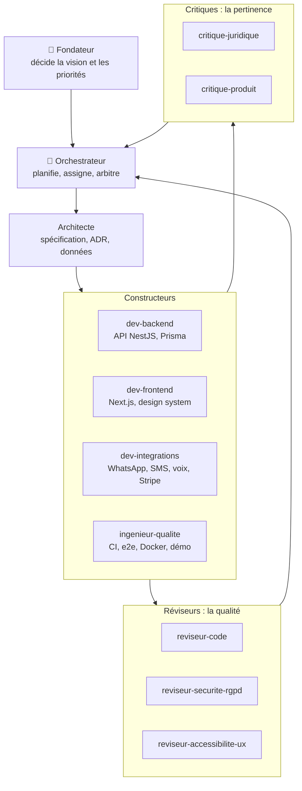
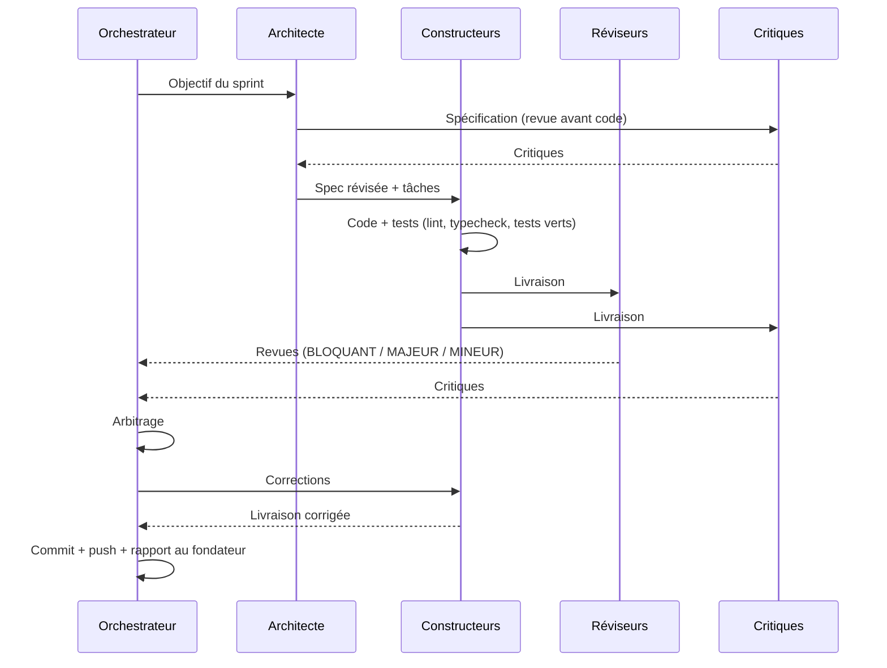

# 09 — Équipe d'agents et processus de construction

> But : construire la plateforme Koudmen avec une équipe d'agents spécialisés. Chaque livraison passe par des réviseurs et des critiques avant d'être acceptée.

## 1. L'organisation

## 2. Les rôles

| Agent | Famille | Rôle | Il produit |
|---|---|---|---|
| `architecte` | Conception | Spécification, ADR, modèle de données, découpage | `docs/tech/` |
| `dev-backend` | Construction | API, modules métier, auth, tests | `apps/api` |
| `dev-frontend` | Construction | Web app famille / accompagnant / back-office, design system | `apps/web`, `packages/ui` |
| `dev-integrations` | Construction | Messagerie, voix, paiements, URSSAF (simulés d'abord) | `packages/integrations` |
| `ingenieur-qualite` | Construction | CI, Docker, e2e, données de démo, lancement réel | `.github/`, `e2e/` |
| `reviseur-code` | Révision | Bugs, conformité à la spec, simplicité, tests | `docs/revues/*-code.md` |
| `reviseur-securite-rgpd` | Révision | OWASP, autorisations, RGPD, abus | `docs/revues/*-securite.md` |
| `reviseur-accessibilite-ux` | Révision | WCAG 2.2, mobile, textes STE, parcours | `docs/revues/*-ux.md` |
| `critique-juridique` | Critique | SAP, CESU, requalification, DSA, RGPD | `docs/revues/*-juridique.md` |
| `critique-produit` | Critique | Valeur, simplicité, business, pilote | `docs/revues/*-produit.md` |

Les définitions complètes sont dans `.claude/agents/`.

**Réviseur ou critique ?**
- Un **réviseur** répond à : « Est-ce bien construit ? »
- Un **critique** répond à : « Est-ce la bonne chose à construire ? »

## 3. Le cycle d'un sprint

## 4. Règles d'arbitrage (orchestrateur)

1. Un point **BLOQUANT** (sécurité, juridique, bug grave) est corrigé avant la livraison. Toujours.
2. Un point **MAJEUR** est corrigé dans le sprint, ou noté au backlog avec une justification.
3. Un point **MINEUR** est traité si le coût est faible.
4. Si un critique et un réviseur se contredisent, l'orchestrateur tranche et écrit la raison dans `docs/revues/<sprint>-arbitrage.md`.
5. Rien n'est déclaré « fini » sans tests exécutés et application lancée.

## 5. Les sprints prévus (MVP)

| Sprint | Objectif | Livrable vérifiable |
|---|---|---|
| **S0** | Spécification MVP + socle technique | Spec critiquée, monorepo qui démarre, CI verte |
| **S1** | Comptes et cercle Lakou | Inscription famille, ajout de l'aîné (consentement), cercle familial |
| **S2** | Accompagnants multi-statuts | Parcours d'inscription en 5 questions, vérifications, badges |
| **S3** | Missions et preuve de visite | Création de mission, check-in, preuve 2/3 (voix simulée) |
| **S4** | Journal Kayé + notifications | Compte-rendu de visite envoyé à la famille (WhatsApp simulé) |
| **S5** | Paiements + back-office | Abonnement, Stripe Connect (test), tableau de bord opérateur |
| **S6** | Durcissement | Pentest interne, accessibilité, mode dégradé SMS, démo pilote |
