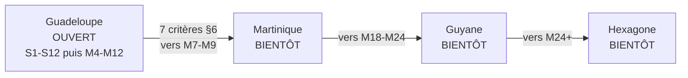
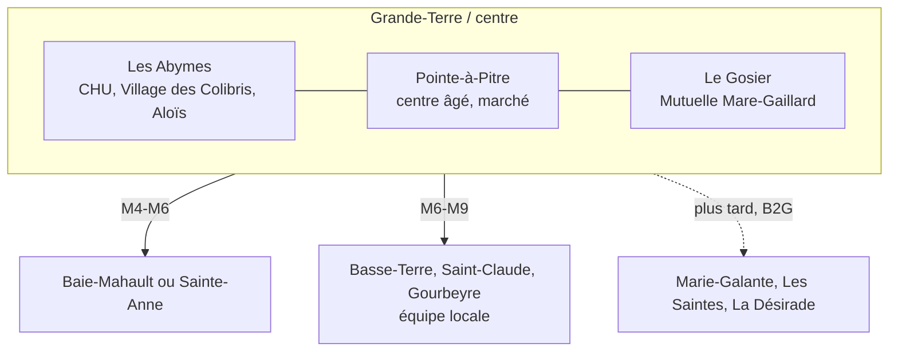
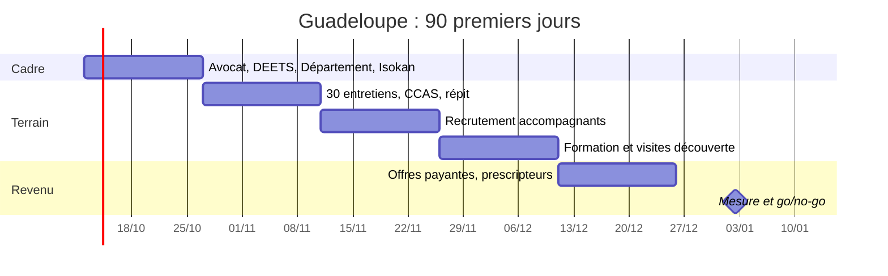
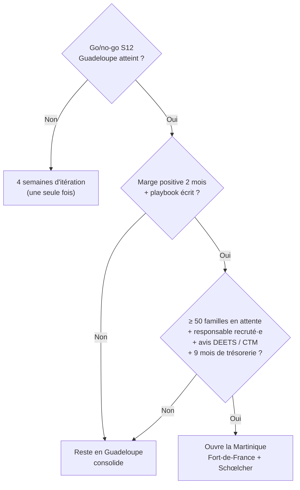

# 10 — Lancement en Guadeloupe

> Note courte. Version 1 — 9 octobre 2026 (lot T1).
> Décision du fondateur : **la Guadeloupe ouvre en premier**. Ensuite : Martinique, Guyane, Hexagone.
> Sources détaillées : `02` §1.4. Les chiffres marqués [À VÉRIFIER] ne servent pas à une décision avant contrôle.

---

## 1. Les chiffres clés

| Indicateur | Guadeloupe | Source |
|---|---|---|
| Population | **380 400** (1ᵉʳ janvier 2025), en baisse | [Insee Flash 8557247](https://www.insee.fr/fr/statistiques/8557247) |
| 60 ans et plus | **30 %** en 2023 (21 % en 2013) ; ~34 % en 2026 [À VÉRIFIER] | [Outremers360 / Insee](https://outremers360.com/bassin-atlantique-appli/la-martinique-devient-la-region-la-plus-agee-de-france-naissances-et-deces-sont-en-baisse-en-guadeloupe-et-la-fecondite-reste-elevee-en-guyane-insee) |
| 75 ans et plus | **9,7 %** en 2021, soit ~37 000 personnes [EST.] | [IEDOM 2021](https://www.iedom.fr/IMG/rapport_annuel_iedom_guadeloupe_2021/index-35.html) |
| Rang | **2ᵉ région la plus âgée de France** (après la Martinique) | [Insee Flash 8904519](https://www.insee.fr/fr/statistiques/8904519) |
| Projection | 313 500 hab. en 2042 ; 241 500 en 2070 ; 65 ans et plus = 39 % en 2070 | [Insee Flash 6664271](https://www.insee.fr/fr/statistiques/6664271) |
| Seniors dépendants | 28 000 en 2030 (+ 8 000 depuis 2017) | [Insee Analyses 49](https://www.insee.fr/fr/statistiques/5359577) |
| Aînés seuls (Antilles, 2021) | 37,8 % des 75-84 ans ; 44,6 % des 85 ans et plus | [Insee Analyses 78](https://www.insee.fr/fr/statistiques/7728543) |
| Natifs en Hexagone | ~114 000-115 000 (1 sur 4), 2/3 en Île-de-France | [Insee Première 1389](https://www.insee.fr/fr/statistiques/1281122) |
| APA | 26,4 % des 75 ans et plus (2013) ; ~8 200 bénéficiaires (2022) [À VÉRIFIER] | [Insee 2513082](https://www.insee.fr/fr/statistiques/2513082) |
| SAAD | 88 services référencés ; tarif APA du Département [À VÉRIFIER] ; plancher national 24,58 €/h (2025) | [Annuaire national](https://www.pour-les-personnes-agees.gouv.fr/annuaire-service-aide-accompagnement-domicile/guadeloupe-971) · [CNSA](https://www.cnsa.fr/sites/default/files/2025-01/Tarifs-APA-1er-janvier-2025.pdf) |
| Revenus | Niveau de vie médian 15 770 €/an (France : 23 000 €) ; pauvreté 34 % (2017) ; ASPA 21,9 % des retraités | [Insee 4481456](https://www.insee.fr/fr/statistiques/4481456) · [Insee 4623253](https://www.insee.fr/fr/statistiques/4623253) |
| Mobile et fibre | 4 opérateurs ; obligation 4G 99,8 % de la population (Orange, 2026) ; 5G depuis 2025 ; fibre en cours | [Arcep](https://www.arcep.fr/fileadmin/reprise/faq/faq-territoires-ultramarins-01.pdf) |
| Communes les plus âgées | Marie-Galante (âge médian 48 ans en 2018), Capesterre-de-Marie-Galante, Terre-de-Bas, La Désirade [À VÉRIFIER] | [Insee Analyses 61](https://www.insee.fr/fr/statistiques/6676047) |

**Martinique (2ᵉ territoire), pour comparaison :** 355 500 habitants (2025), 33 % de 60 ans et plus (2023), 1ʳᵉ région la plus âgée, ASPA 9 %, une seule collectivité (CTM).

---

## 2. Pourquoi la Guadeloupe d'abord

### Avantages

1. **L'ancrage du fondateur.** C'est le critère n°1 de toutes les études (`00`, `06`). Un fondateur fait 25 à 30 rencontres par semaine là où il a un réseau.
2. **Le besoin est fort.** 2ᵉ région la plus âgée. La perte d'autonomie y est la plus précoce de France.
3. **La diaspora est grande.** Environ 115 000 natifs vivent en Hexagone. La campagne en Île-de-France sert aussi pour la Martinique plus tard.
4. **L'écosystème existe.** ZEBOX Caraïbes (Jarry), plateformes de répit (Village des Colibris, Aloïs), conférence des financeurs active (CGSS, Département, ARS), 88 SAAD.
5. **La crise de l'eau crée un usage clair.** « Est-ce que Manman a de l'eau aujourd'hui ? » Le Kayé et Veyé Siklòn y répondent.

### Points d'attention

| Point | Ce qu'on fait |
|---|---|
| Solvabilité locale plus faible (ASPA 21,9 %) | Payeur diaspora d'abord. Familles locales via APA, CESU (voie B) et financeurs |
| Deux collectivités (Département + Région) | Département pour l'APA et les SAAD. Région pour le FEDER et l'innovation |
| Concurrent local : Isokan | Rencontre avant S2. Partenariat ou différence claire |
| Eau, cyclones, séismes | Veyé Siklòn étendu à l'eau ; plan de crise avant la 1ʳᵉ mission |
| Mobilité (Jarry, ponts de la Rivière Salée) | 3 communes contiguës, moins de 20 min de trajet |
| Archipel (Marie-Galante, Les Saintes, La Désirade) | Plus tard, avec un financeur public et des accompagnants sur place |
| Vocabulaire créole | Vérifie Koudmen, Lakou, Kayé, Kozé avec des locuteurs guadeloupéens [À VÉRIFIER] |

---

## 3. La zone pilote

Règle de passage à la commune suivante : plus de 70 % des demandes servies en moins de 48 h, et des accompagnantes occupées à plus de 60 %, pendant 4 semaines.

---

## 4. Plan des 90 premiers jours

| Période | Objectif | Actions |
|---|---|---|
| **J1-J15** | Cadrer et sécuriser | Consulte l'avocat SAP. Envoie la demande d'avis écrit à la DEETS Guadeloupe et au Département (direction de l'autonomie). Rencontre les fondateurs d'Isokan. Ouvre le numéro WhatsApp Business local (+590 690). Publie la page « Koudmen ouvre en Guadeloupe » avec liste d'attente par territoire |
| **J15-J30** | Écouter | Fais 30 entretiens : 10 enfants de la diaspora, 10 aînés ou aidants des 3 communes, 10 accompagnants potentiels. Rencontre 3 CCAS (Les Abymes, Pointe-à-Pitre, Le Gosier) et 2 plateformes de répit |
| **J30-J45** | Recruter l'offre | Lance les annonces : France Travail, Université des Antilles (Fouillole), IFSI du CHU, paroisses, RCI. Signe l'assurance de groupe. Écris le plan de crise (cyclone, eau, séisme) |
| **J45-J60** | Former et démarrer | Forme 10 à 12 accompagnantes (21 h + PSC1). Fais les 10 premières visites découverte. Lance la campagne Meta en Île-de-France (« Guadeloupéens, 35-60 ans ») |
| **J60-J75** | Faire payer | Ouvre les offres payantes (Kozé, Sérénité). Dépose les kits chez 10 pharmacies et 15 IDEL. Passe à la radio pour la Journée des aidants ou la Toussaint |
| **J75-J90** | Décider | Mesure les 7 expériences (`06` §5.3). Comité go/no-go : 25 familles payantes récurrentes, 60 missions, fuite < 30 %, marge positive, 0 incident grave |

ATTENTION : aucune mission avant l'avis de l'avocat et l'assurance de groupe signée. Sans cela, la famille et Koudmen portent le risque juridique.

---

## 5. Partenaires à contacter

| Priorité | Partenaire | Ce qu'on demande |
|---|---|---|
| ★★★ | **DEETS Guadeloupe** | Avis écrit sur le montage (voie A / voie B) ; plus tard, agrément mandataire |
| ★★★ | **Département de la Guadeloupe** (direction de l'autonomie) | Tarif APA ; avis sur le niveau 3 ; conférence des financeurs ; MONALISA |
| ★★★ | **Isokan / Izokan** | Partenariat ou répartition claire des rôles |
| ★★★ | **CCAS** des Abymes, de Pointe-à-Pitre, du Gosier | Orientation de 10 aînés isolés ; visites de démonstration |
| ★★★ | **Plateformes de répit** (Village des Colibris, Aloïs / Assistance 2000) ; A3A (dispositif ANAAIS) | Répit court à domicile ; orientation d'aidants |
| ★★★ | **SAAD partenaire** (parmi les 88 ; ex. Domidom Jarry) | Portage du niveau 4 ; renvoi croisé des demandes |
| ★★ | **CGSS Guadeloupe** (action sociale retraite) | Orientation de retraités fragiles ; questions AICI et précompte |
| ★★ | **ARS Guadeloupe** | Présentation des données d'impact ; appels à projets « aidants » |
| ★★ | **CHU de la Guadeloupe** (gériatrie, service social) | Sorties d'hospitalisation |
| ★★ | **Agirc-Arrco** (délégation Antilles-Guyane) | « Sortir Plus », aide à domicile momentanée |
| ★★ | **Mutuelle Mare-Gaillard** (Le Gosier) | Pilote « retour d'hospitalisation » |
| ★★ | **France Travail Guadeloupe**, Mission locale, **Université des Antilles**, IFSI | Recrutement des accompagnants |
| ★★ | **ZEBOX Caraïbes**, French Tech Guadeloupe, **Région Guadeloupe** | Incubation, FEDER, prêts d'honneur |
| ★ | **Préfecture** (protection civile), communes | Veyé Siklòn relié aux registres des personnes vulnérables |
| ★ | **RCI**, **Guadeloupe La 1ère**, France-Antilles | Passages invités, histoires vraies |

---

## 6. Critères pour ouvrir la Martinique

Ouvre la Martinique seulement si **les 7 critères** sont vrais :

1. Le go/no-go de S12 est atteint en Guadeloupe.
2. La marge contributive est positive 2 mois de suite.
3. Le playbook est écrit : recrutement, matching, incident, remplacement, crise.
4. Au moins **50 familles** de la liste d'attente ont un parent en Martinique.
5. Un ou une responsable terrain créolophone est recruté·e en Martinique.
6. Les avis écrits de la DEETS Martinique et de la CTM sont reçus.
7. La trésorerie couvre au moins 9 mois.

La Guyane (CTG, population jeune) et l'Hexagone (aidants à distance, diaspora inverse) suivent avec la même grille.
