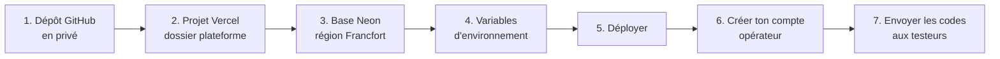

# Mettre Koudmen en ligne (Vercel + Neon) : guide pas à pas

> Durée : environ 15 minutes. Aucun code à écrire.
> ⚠️ Ne copie **jamais** un secret dans le dépôt GitHub. Les secrets vont **seulement** dans Vercel.

## 1. Passe le dépôt en privé
GitHub → `abbo-benhamid/Jarvis` → **Settings** → **Danger Zone** → **Change visibility** → **Private**.

## 2. Crée le projet Vercel
1. Va sur vercel.com, puis **Add New → Project**.
2. Importe `abbo-benhamid/Jarvis`.
3. Règle **Root Directory** sur `plateforme`. Le framework détecté doit être **Next.js**.
4. **Ne clique pas encore sur Deploy.** Passe d'abord aux étapes 3 et 4.

## 3. Crée la base Neon
1. Dans le projet Vercel, ouvre **Storage**, puis **Create Database** et choisis **Neon**.
2. Choisis la région **Europe (Frankfurt)**, puis relie la base au projet.
3. Vercel ajoute les variables de connexion. Vérifie qu'il y a :
   - `DATABASE_URL` (connexion **poolée**) ;
   - `DIRECT_URL` (connexion **directe**, sans pooler). Si cette variable a un autre nom chez Neon (par exemple `DATABASE_URL_UNPOOLED`), crée `DIRECT_URL` avec la même valeur.

## 4. Ajoute les variables d'environnement
Dans **Settings → Environment Variables**, cible **Production** :

| Variable | Valeur |
|---|---|
| `SESSION_SECRET` | Secret aléatoire de 48 caractères (fourni par Claude dans la conversation) |
| `CRON_SECRET` | Autre secret aléatoire, **différent** du premier |
| `TESTER_INVITE_CODES` | Codes testeurs séparés par des virgules (format `T-XXXX-XXXX-XXXX`) |
| `DEMO_MODE` | `false` |
| `NEXT_PUBLIC_TEST_MODE` | `true` |
| `TEST_END_DATE` | Date de fin du test, au format `AAAA-MM-JJ` |
| `APP_URL` | L'adresse du site, par exemple `https://koudmen.vercel.app` |
| `EDITEUR_NOM` | Ton nom, ou celui de ta société |
| `EDITEUR_ADRESSE` | Ton adresse postale |
| `EDITEUR_EMAIL` | L'e-mail de contact des testeurs |
| `DIRECTEUR_PUBLICATION` | En général, ton nom |

Ne mets **pas** `RATE_LIMIT_DISABLED`, `DEMO_PASSWORD` ni `SEED_OPERATOR_*` en production.

## 5. Déploie
Clique sur **Deploy**. Le build applique les migrations de la base, puis compile le site.
Si le build échoue, copie le message d'erreur à Claude.

## 6. Crée ton compte opérateur
Sur ton ordinateur, dans le dossier `plateforme` :
1. Mets dans ton terminal `DATABASE_URL` et `DIRECT_URL` avec les valeurs de Neon.
2. Lance `pnpm install`.
3. Lance `pnpm ops:create-operator --email <ton e-mail> --prenom <prénom> --nom <nom>`.

Le mot de passe s'affiche **une seule fois**. Garde-le dans un gestionnaire de mots de passe.
Tu peux aussi demander à Claude de le faire, si tu lui donnes l'accès à la base.

## 7. Envoie les codes aux testeurs
- Donne **un code par groupe** de testeurs (diaspora, aidants locaux, accompagnants). Un code accepte 200 tests au plus.
- Le testeur ouvre le site, clique sur **Tester Koudmen** et saisit son code.
- Tu suis les résultats dans l'espace opérateur, rubrique **Mesure du test**.

## Après le test
- La purge efface les tests de plus de 30 jours chaque nuit.
- Les avis et les statistiques sont effacés 6 mois après `TEST_END_DATE`.
