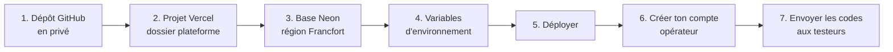
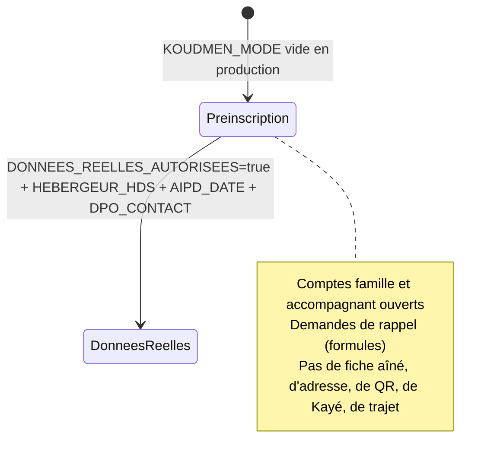
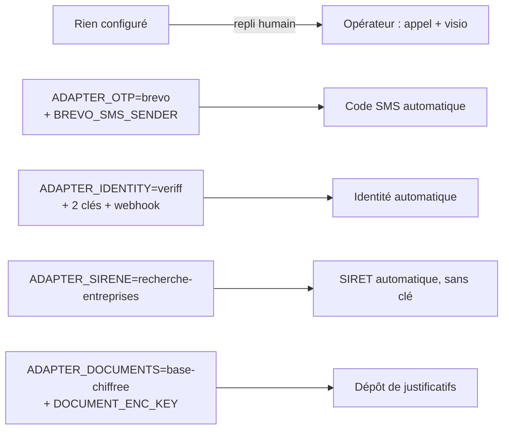

# Mettre Koudmen en ligne (Vercel + Neon) : guide pas à pas

> Durée : environ 15 minutes. Aucun code à écrire.
> ⚠️ Ne copie **jamais** un secret dans le dépôt GitHub. Les secrets vont **seulement** dans Vercel.

## 1. Passe le dépôt en privé
GitHub → `abbo-benhamid/Jarvis` → **Settings** → **Danger Zone** → **Change visibility** → **Private**.

## 2. Crée le projet Vercel
1. Va sur vercel.com, puis **Add New → Project**.
2. Importe `abbo-benhamid/Jarvis`.
3. Règle **Root Directory** sur `plateforme`. Le framework détecté doit être **Next.js**.
4. **Ne clique pas encore sur Deploy.** Passe d'abord aux étapes 3 et 4.

## 3. Crée la base Neon
1. Dans le projet Vercel, ouvre **Storage**, puis **Create Database** et choisis **Neon**.
2. Choisis la région **Europe (Frankfurt)**, puis relie la base au projet.
3. Vercel ajoute les variables de connexion. Vérifie qu'il y a :
   - `DATABASE_URL` (connexion **poolée**) ;
   - `DIRECT_URL` (connexion **directe**, sans pooler). Si cette variable a un autre nom chez Neon (par exemple `DATABASE_URL_UNPOOLED`), crée `DIRECT_URL` avec la même valeur.

## 4. Ajoute les variables d'environnement
Dans **Settings → Environment Variables**, cible **Production** :

| Variable | Valeur |
|---|---|
| `SESSION_SECRET` | Secret aléatoire de 48 caractères (fourni par Claude dans la conversation) |
| `CRON_SECRET` | Autre secret aléatoire, **différent** du premier |
| `TESTER_INVITE_CODES` | Codes testeurs séparés par des virgules (format `T-XXXX-XXXX-XXXX`) |
| `DEMO_MODE` | `false` |
| `NEXT_PUBLIC_TEST_MODE` | `true` |
| `TEST_END_DATE` | Date de fin du test, au format `AAAA-MM-JJ` |
| `APP_URL` | L'adresse du site, par exemple `https://koudmen.vercel.app` |
| `EDITEUR_NOM` | Ton nom, ou celui de ta société |
| `EDITEUR_ADRESSE` | Ton adresse postale |
| `EDITEUR_EMAIL` | L'e-mail de contact des testeurs |
| `DIRECTEUR_PUBLICATION` | En général, ton nom |

Ne mets **pas** `RATE_LIMIT_DISABLED`, `DEMO_PASSWORD` ni `SEED_OPERATOR_*` en production.

### 4 bis. Mode lancement (lot L1-A)

En production, le site démarre en **mode lancement** : pas de démo, pas de bac à sable, pas de paiement simulé. L'inscription est ouverte.

| Variable | Valeur | Obligatoire ? |
|---|---|---|
| `KOUDMEN_MODE` | Vide (= `lancement` en production) ou `lancement`. **`essai` est refusé en production** (page « Configuration incomplète », L1d D1) | Non |
| `DEMO_MODE`, `KOUDMEN_OPERATEUR_CONFIRME` | `false` ou vide. **`true` est refusé en production** (L1d D1) | Non |
| `QR_SIGNING_KEY`, `ADDRESS_ENC_KEY` | 32 octets aléatoires en base64, différents : `openssl rand -base64 32` (deux fois). Gardez une copie hors de Vercel (coffre) : sans `ADDRESS_ENC_KEY`, les adresses sont illisibles | **Oui si** `DONNEES_REELLES_AUTORISEES=true`, aussi en Preview et sur Clever Cloud (L1d D2). La clé de développement du dépôt et une clé trop régulière sont refusées |
| `EDITEUR_NOM`, `EDITEUR_ADRESSE`, `EDITEUR_EMAIL`, `DIRECTEUR_PUBLICATION` | Identité de l'éditeur | **Oui** : sans elles, le site affiche « Configuration incomplète » |
| `BREVO_API_KEY` | Clé API Brevo (transactionnel) | Non. Sans elle, aucun e-mail ne part : `/api/sante` l'indique, et tu valides les e-mails à la main (opérateur → **Comptes**), après un appel |
| `MAIL_FROM` | `Koudmen <ne-pas-repondre@ton-domaine>` (domaine vérifié dans Brevo : SPF et DKIM) | Non |
| `DONNEES_REELLES_AUTORISEES` | Vide ou `false` = **préinscription** (aucune fiche aîné réelle) | Non |
| `HEBERGEUR_HDS`, `AIPD_DATE`, `DPO_CONTACT` | Hébergeur certifié HDS, date de l'AIPD (`AAAA-MM-JJ`), contact du DPO | **Oui si** `DONNEES_REELLES_AUTORISEES=true` (sinon le démarrage est refusé) |
| `TESTER_INVITE_CODES`, `TEST_END_DATE` | Inutiles en lancement (mode essai seulement) | Non |

**Vérifie après le déploiement :** ouvre `https://<ton-site>/api/sante`.
- `"mode": "lancement"`, `"configuration": "ok"`.
- `"avertissements"` : lis chaque ligne (Brevo absent, préinscription, comptes démo restants). Un avertissement ne bloque pas le site.

**Base sans données de démo.** Le seed (`pnpm db:seed`) refuse de tourner en lancement. Si la base a servi au test (comptes démo, bacs à sable) :
- recommandé : crée une **nouvelle branche Neon vide** (ou une nouvelle base) pour le lancement, puis relie-la au projet ;
- sinon : les bacs à sable sont effacés par la purge de la nuit ; les comptes démo sont refusés à la connexion, et `/api/sante` les compte. Demande à Claude de les effacer avec toi.

### 4 quater. Vérification des accompagnants (lot L2, ADR 0009)

Tous les services sont **simulés par défaut**. En lancement, un service simulé est **fermé** : l'équipe vérifie par appel ou en visio (écran opérateur **Vérifications à revoir**). Une clé absente donne un **avertissement** dans `/api/sante`, jamais la page « Configuration incomplète » en préinscription.

| Variable | Valeur | Obligatoire ? |
|---|---|---|
| `ADAPTER_OTP` | `simule` (défaut) ou `brevo` | Non. `brevo` exige `BREVO_API_KEY` (déjà là) et `BREVO_SMS_SENDER` |
| `BREVO_SMS_SENDER` | Expéditeur SMS, 11 caractères au plus (ex. `Koudmen`) [À VÉRIFIER acceptation aux Antilles] | Oui si `ADAPTER_OTP=brevo` |
| `SMS_DAILY_BUDGET_CENTS` | Plafond quotidien SMS + appels en centimes (défaut `1000` = 10 €) | Non (recommandé) |
| `ADAPTER_OTP_APPEL` | `simule` (défaut) ou `twilio` | Non |
| `TWILIO_ACCOUNT_SID`, `TWILIO_AUTH_TOKEN`, `TWILIO_FROM_NUMBER` | Compte Twilio, numéro qui appelle (E.164) | Oui si `ADAPTER_OTP_APPEL=twilio` |
| `ADAPTER_IDENTITY` | `simule` (défaut), `veriff` (principal) ou `stripe` (repli, décision humaine) | Non |
| `VERIFF_API_KEY`, `VERIFF_SHARED_SECRET` | Clé d'intégration et clé partagée Veriff | Oui si `ADAPTER_IDENTITY=veriff`. Déclare le webhook `https://<ton-site>/api/webhooks/identite/veriff` dans Veriff |
| `STRIPE_SECRET_KEY`, `STRIPE_IDENTITY_WEBHOOK_SECRET` | Clé secrète Stripe et secret du webhook Identity | Oui si `ADAPTER_IDENTITY=stripe`. Webhook : `https://<ton-site>/api/webhooks/identite/stripe` (événements `identity.verification_session.*`) |
| `ADAPTER_SIRENE` | `simule` (défaut), `recherche-entreprises` (sans clé) ou `insee` | Non. **Conseil : `recherche-entreprises` dès le lancement** |
| `INSEE_API_KEY` | Clé du portail API INSEE (gratuite) | Oui si `ADAPTER_SIRENE=insee` (sinon repli sur Recherche d'entreprises) |
| `COMPANY_DOC_REQUIRED` | `si_doute` (défaut) ou `toujours` | Non |
| `ADDRESS_PROOF_REQUIRED` | Vide ou `true` (défaut) ; `false` seulement après l'avis de l'avocat | Non |
| `ADAPTER_DOCUMENTS` | `simule` (défaut) ou `base-chiffree` | Non |
| `DOCUMENT_ENC_KEY` | 32 octets aléatoires : `openssl rand -base64 32`. **Différente** de `ADDRESS_ENC_KEY`. Copie dans un coffre | Oui si `ADAPTER_DOCUMENTS=base-chiffree`. Avec les données réelles ouvertes, une clé mal formée bloque le démarrage |
| `VERIFICATION_HMAC_KEY` | L2b (M6) : clé HMAC DÉDIÉE des empreintes (numéros, pièces, codes) : `openssl rand -base64 32`. **Différente** de `SESSION_SECRET`, `CRON_SECRET`, `DOCUMENT_ENC_KEY`, `ADDRESS_ENC_KEY`. Copie dans un coffre. Rotation : `VERIFICATION_HMAC_KEY_VERSION`, `VERIFICATION_HMAC_KEY_PREVIOUS`, `VERIFICATION_HMAC_KEY_PREVIOUS_VERSION` | **Oui** dès qu'un adaptateur réel est actif (`ADAPTER_OTP`, `ADAPTER_OTP_APPEL`, `ADAPTER_IDENTITY`, `ADAPTER_DOCUMENTS`) ou que les données réelles sont ouvertes : sinon page 503. En lancement sans elle, l'opérateur ne valide pas un numéro |
| `SMS_ACCOUNT_DAILY_BUDGET_CENTS` | L2b (m2) : plafond quotidien SMS + appels PAR COMPTE (défaut `60`) | Non |
| `PHONE_ALLOWED_PREFIXES`, `VERIFF_BASE_URL`, `SIMULATED_WEBHOOK_SECRET` | Réglages fins (voir `.env.example`) | Non |

**Vérifie après le déploiement :** `https://<ton-site>/api/sante` → bloc `"verifications"` : chaque service dit son adaptateur et `ouvert: true/false`. Lis les avertissements `ADAPTER_…`.

> **ATTENTION** — Avant toute vérification d'identité réelle : DPA Veriff signé, AIPD à jour (biométrie chez un sous-traitant), registre des traitements complété (ADR 0009, porte G2).

### 4 ter. Sauvegarde et restauration (Neon)

Neon garde l'historique de la base : la **restauration à un instant** (point-in-time restore) est possible pendant la fenêtre d'historique de ton offre (offre gratuite : 24 heures ; offres payantes : jusqu'à 7 à 30 jours [À VÉRIFIER] sur neon.tech/pricing).

1. Avant chaque opération risquée (migration, nettoyage) : Neon → **Branches** → **Create branch** depuis `main` (copie instantanée).
2. Pour restaurer : Neon → **Restore** → choisis la date et l'heure → **Restore**. Neon garde l'état d'avant dans une branche de sauvegarde.
3. Pour une copie hors de Neon (chaque semaine) : `pg_dump "$DIRECT_URL" -Fc -f koudmen-AAAA-MM-JJ.dump`, puis range le fichier chiffré hors du dépôt. Restauration : `pg_restore -d "<url d'une base vide>" --no-owner koudmen-AAAA-MM-JJ.dump`.
4. Teste une restauration une fois par trimestre, sur une branche de test.

⚠️ Les données d'aînés réels ne vont **pas** sur Neon : elles attendent l'hébergeur HDS (voir `DONNEES_REELLES_AUTORISEES`).

## 5. Déploie
Clique sur **Deploy**. Le build applique les migrations de la base, puis compile le site.
Si le build échoue, copie le message d'erreur à Claude.

## 6. Crée ton compte opérateur
Sur ton ordinateur, dans le dossier `plateforme` :
1. Mets dans ton terminal `DATABASE_URL` et `DIRECT_URL` avec les valeurs de Neon.
2. Lance `pnpm install`.
3. Lance `pnpm ops:create-operator --email <ton e-mail> --prenom <prénom> --nom <nom>`.

Le mot de passe s'affiche **une seule fois**. Garde-le dans un gestionnaire de mots de passe.
Tu peux aussi demander à Claude de le faire, si tu lui donnes l'accès à la base.

## 7. Envoie les codes aux testeurs
- Donne **un code par groupe** de testeurs (diaspora, aidants locaux, accompagnants). Un code accepte 200 tests au plus.
- Le testeur ouvre le site, clique sur **Tester Koudmen** et saisit son code.
- Tu suis les résultats dans l'espace opérateur, rubrique **Mesure du test**.

## Après le test
- La purge efface les tests de plus de 30 jours chaque nuit.
- Les avis et les statistiques sont effacés 6 mois après `TEST_END_DATE`.
