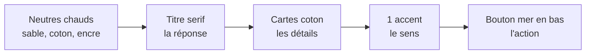

# Koudmen — Direction artistique v1

> Référence visuelle : `site/maquette-conso.html` (5 écrans, clair et sombre).
> Cible technique : Next.js (App Router) + Tailwind 4. Ce document donne les **valeurs exactes**.
> Statut : proposition du directeur artistique, à valider par le fondateur.

## 1. L'idée forte

**« Le calme d'une bonne nouvelle. »**

L'écran répond d'abord à une seule question : *est-ce qu'elle va bien ?*
La réponse est en grand, en serif, avec un seul mot en couleur (« bien. »).
Tout le reste est calme, neutre et précis.

- **Revolut / Qonto** : cartes nettes, chiffres tabulaires, sombre soigné.
- **Calm / Airbnb** : espace, belle typographie, chaleur humaine.
- **Caraïbe discrète** : un filet madras de 2 à 3 px, des mots créoles bien placés, des illustrations au trait (case, giraumon, hibiscus).

## 2. Principes (dans cet ordre)

1. **Une réponse par écran.** Un titre serif dit l'essentiel. Le reste se lit en 3 secondes.
2. **90 % neutres, 10 % accents.** Les couleurs de la palette sont rares. Elles portent un sens.
3. **La couleur a un rôle unique** (un terme = un sens) :
   - mer = agir (bouton principal, lien, onglet actif) ;
   - feuille = va bien, preuve validée ;
   - soleil = chaleur, créole, conseil ;
   - hibiscus = alerte seulement (et le jour dans la date).
4. **Le madras est réservé** à ce qui compte : l'aîné (anneau d'avatar) et la preuve (haut du reçu). Jamais en fond.
5. **Le pouce d'abord.** L'action principale est en bas, pleine largeur, 56 px de haut.
6. **Le chiffre est un texte.** Chiffres tabulaires, grands, sans décor.



## 3. Palette

### 3.1 Tokens CSS (à copier dans `globals.css`)

Les noms existants de `plateforme/src/app/globals.css` sont gardés quand c'est possible. Les valeurs changent : neutres verts froids → neutres sable chauds.

```css
:root {
  /* Neutres */
  --bg: #F6F2EA;          /* sable : fond d'app */
  --surface: #FFFDF8;     /* coton : cartes */
  --surface-2: #EFE9DE;   /* sable creusé : puces, champs, piste */
  --fg: #1A2321;          /* encre : texte */
  --muted: #5A645F;       /* texte secondaire */
  --line: #E3DBCD;        /* filet décoratif (non porteur d'info) */
  --line-strong: #8A877D; /* bord des contrôles (≥ 3:1) */

  /* Accents */
  --mer: #0D5F58;   --mer-strong: #0A4C46; --mer-soft: #E2EEEA; --on-mer: #FFFFFF;
  --soleil: #E0A21B;      /* décor uniquement, jamais du texte */
  --soleil-ink: #7E5300;  /* texte « soleil » */
  --soleil-soft: #F8EDD3; --on-soleil: #1A2321;
  --hibiscus: #A8283F;    --hibiscus-soft: #F6E1E3; --on-hibiscus: #FFFFFF;
  --feuille: #2B6A30;     --feuille-soft: #E4EFE1;

  /* Focus */
  --focus: #1A2321;       --focus-halo: #E0A21B;

  /* Effets */
  --shadow: 0 1px 2px rgb(40 32 20 / .05), 0 10px 30px -14px rgb(40 32 20 / .18);
  --shadow-lg: 0 2px 4px rgb(40 32 20 / .04), 0 30px 60px -30px rgb(40 32 20 / .35);
  --madras: linear-gradient(90deg, var(--hibiscus) 0 28%, var(--soleil) 28% 52%, var(--mer) 52% 82%, var(--feuille) 82% 100%);
  color-scheme: light;
}

@media (prefers-color-scheme: dark) {
  :root:not([data-theme="light"]) { /* mêmes valeurs que [data-theme="dark"] */ }
}
:root[data-theme="dark"] {
  --bg: #0F1413;          --surface: #171D1C;   --surface-2: #212927;
  --fg: #EEE9E0;          --muted: #A3ABA6;
  --line: #262F2D;        --line-strong: #6E7975;
  --mer: #6CC9BB;  --mer-strong: #8AD6CA; --mer-soft: #18302C; --on-mer: #0B1110;
  --soleil: #F0BD4F;      --soleil-ink: #F0BD4F; --soleil-soft: #2E2614; --on-soleil: #0B1110;
  --hibiscus: #F2879A;    --hibiscus-soft: #33191F; --on-hibiscus: #0B1110;
  --feuille: #8BCB8E;     --feuille-soft: #1A2A1C;
  --focus: #F0BD4F;       --focus-halo: #0F1413;
  --shadow: 0 0 0 1px rgb(255 255 255 / .04);           /* en sombre : un filet, pas d'ombre */
  --shadow-lg: 0 30px 60px -30px rgb(0 0 0 / .8);
  color-scheme: dark;
}
```

Règle : le sombre est un **noir vert très doux** (pas de noir pur #000). La hiérarchie vient des surfaces (`bg` < `surface` < `surface-2`), pas des ombres.

### 3.2 Pont Tailwind 4

```css
@theme inline {
  --color-bg: var(--bg);           --color-surface: var(--surface);   --color-surface-2: var(--surface-2);
  --color-fg: var(--fg);           --color-muted: var(--muted);
  --color-line: var(--line);       --color-line-strong: var(--line-strong);
  --color-mer: var(--mer);         --color-mer-strong: var(--mer-strong); --color-mer-soft: var(--mer-soft); --color-on-mer: var(--on-mer);
  --color-soleil: var(--soleil);   --color-soleil-ink: var(--soleil-ink); --color-soleil-soft: var(--soleil-soft);
  --color-hibiscus: var(--hibiscus); --color-hibiscus-soft: var(--hibiscus-soft); --color-on-hibiscus: var(--on-hibiscus);
  --color-feuille: var(--feuille); --color-feuille-soft: var(--feuille-soft);
  --font-sans: "Figtree", ui-sans-serif, system-ui, sans-serif;
  --font-display: "Fraunces", ui-serif, Georgia, serif;
  --radius-sm: 12px; --radius-md: 16px; --radius-lg: 20px; --radius-xl: 24px; --radius-2xl: 28px;
  --shadow-card: var(--shadow); --shadow-float: var(--shadow-lg);
}
@custom-variant dark (&:where([data-theme="dark"], [data-theme="dark"] *));
```

Note : `@custom-variant dark` ne couvre que le choix manuel. Les tokens gèrent déjà la préférence système ; préférez donc les tokens aux classes `dark:`.

### 3.3 Contrastes vérifiés (WCAG 2.2, calcul relatif de luminance)

| Paire (texte / fond) | Clair | Sombre | Usage |
|---|---|---|---|
| fg / bg | 14,4 | 15,4 | texte courant |
| fg / surface | 15,8 | 14,1 | texte en carte |
| muted / bg | 5,5 | 7,9 | texte secondaire |
| muted / surface-2 | 5,1 | 6,3 | texte dans une puce |
| mer / surface | 7,4 | 8,7 | lien, prix, onglet |
| on-mer / mer | 7,5 | 9,7 | bouton principal |
| mer / mer-soft | 6,3 | 7,2 | onglet actif |
| soleil-ink / soleil-soft | 5,8 | 8,6 | badge « conseillé », créole |
| hibiscus / hibiscus-soft | 5,5 | 6,7 | alerte |
| feuille / feuille-soft | 5,5 | 7,9 | badge « Prouvée » |
| line-strong / surface | 3,5 | 3,8 | bord de contrôle (≥ 3:1, non-texte) |

Interdits :
- `--soleil` en texte sur clair (2,1:1). Utilisez `--soleil-ink`.
- `--line` pour un bord de champ ou de bouton (< 3:1). Utilisez `--line-strong`.
- Information portée par la couleur seule : toujours une icône ou un mot en plus (ex. coche + « Prouvée »).

### 3.4 Proportions sur un écran

Sable 60 % · coton 22 % · encre 8 % · mer ≈ 5 % · feuille, soleil, hibiscus < 2 % chacun.
Si un écran semble « coloré », retirez un accent.

## 4. Typographie

Deux familles Google Fonts, pas plus.

| Rôle | Famille | Pourquoi |
|---|---|---|
| Titres, réponse clé, citations | **Fraunces** (serif à axe optique, 400/500 + italique) | Chaleur, côté « lettre de famille ». L'italique donne une voix aux mots créoles et au mot clé (« *bien.* »). |
| Interface, texte, chiffres | **Figtree** (sans géométrique, 400/500/600/700) | Très lisible en petit, formes rondes et amicales, chiffres tabulaires propres (Revolut/Qonto). |

Chargement (`next/font/google`) :

```ts
import { Figtree, Fraunces } from "next/font/google";
export const sans = Figtree({ subsets: ["latin"], weight: ["400","500","600","700"], variable: "--font-sans", display: "swap" });
export const display = Fraunces({ subsets: ["latin"], weight: ["400","500"], style: ["normal","italic"], axes: ["opsz"], variable: "--font-display", display: "swap" });
```

`JetBrains Mono` et `Bricolage Grotesque` (actuels) sont retirés. Pour un code de reçu, utilisez `ui-monospace` système.

### Échelle (mobile ; px / interligne)

| Token | Famille | Taille / interligne | Graisse | Usage |
|---|---|---|---|---|
| `display` | Fraunces | 42 / 1.02, lettrage -0,025em | 400 | titre d'accueil public |
| `h1` | Fraunces | 36 / 1.05, -0,02em | 400 | « Elle va *bien.* » |
| `h2` | Fraunces | 28–30 / 1.1, -0,02em | 400 | « Bonjou, Sandrine », titre de Kayé |
| `quote` | Fraunces italique | 18–21 / 1.3 | 400 | parole de l'aîné (Kayé) |
| `title` | Figtree | 17 / 1.3 | 600 | titre de carte, barre du haut |
| `body` | Figtree | 17 / 1.55 | 400 | texte courant (jamais < 16 px) |
| `small` | Figtree | 15 / 1.4 | 400 | texte secondaire (`muted`) |
| `caption` | Figtree | 13,5 / 1.3 | 500 | légende de chiffre |
| `eyebrow` | Figtree | 13, majuscules, +0,12em | 600 | sur-titre (`muted`) |
| `figure` | Figtree tabulaire | 20–24 / 1.1 | 600 | 2/3, 10:04, 49,67 € |

Règles :
- `font-variant-numeric: tabular-nums lining-nums` sur tout chiffre (classe `.num` / `tabular-nums`).
- `text-wrap: balance` sur les titres (pas de mot seul en dernière ligne).
- Typographie française : espace fine insécable (U+202F) avant `? ! ; :` et dans « ». Espace insécable entre nombre et unité (`39 €`, `12 h`).
- Un seul mot en italique couleur par titre, au maximum.

## 5. Grille et espacements

- Base **4 px**. Pas utilisés : 4, 8, 12, 16, 20, 24, 28, 32, 40, 48, 56.
- Mobile : gouttière **20 px** (16 px minimum sous 360 px). Une colonne.
- Entre cartes d'une même section : **12 px**. Entre sections : **24 px** (titre de section 15 px `muted`, 10 px au-dessus de la carte).
- Padding de carte : **20 px** (16 px pour une carte dense, 22 px pour la carte d'état).
- Bureau (≥ 1024 px) : contenu max **1120 px**, grille 12 colonnes, gouttière 24 px. Les écrans « app » restent en colonne de **440 px max**, centrée.
- Zone basse : réserver **120 px** sous le contenu si une barre basse ou un pied d'action est présent.

## 6. Rayons, ombres, filets

| Élément | Rayon |
|---|---|
| Puce, badge, interrupteur | 999 px |
| Bouton icône 44 × 44 | 14 px |
| Champ, date, petit bloc | 16 px |
| Bouton principal | 18 px |
| Image, carte de formule | 20 px |
| Carte standard | 24 px |
| Carte d'état (héros) | 28 px |

- Ombre **unique** `--shadow` pour toutes les cartes. `--shadow-lg` seulement pour un élément flottant (feuille modale, maquette).
- En sombre : pas d'ombre portée, un filet de 1 px blanc à 4 %.
- Filet madras : 2 px (séparateur de page) ou 3 px (haut du reçu). Jamais plus.

## 7. Iconographie

- **lucide-react**, `strokeWidth={1.6}` (1.8 à 16 px), `stroke-linecap/linejoin: round`.
- Tailles : 24 px (navigation, actions), 18 px (dans un bouton ou une liste), 16 px (dans un badge).
- Couleur : `currentColor`. Une icône prend l'accent seulement si elle porte le sens (coche feuille, cœur hibiscus).
- Icônes utilisées : `Home, BookOpen, Users, Calendar, User, Check, ChevronRight, ChevronLeft, MapPin, ScanLine, Phone, Play, ShieldCheck, Sun, Moon, Heart, Share, Lock, Sparkles, Clock, Bell, Minus, Navigation, Info, ArrowRight`.
- Une icône seule a toujours un `aria-label` sur son bouton. Une icône à côté d'un texte est `aria-hidden`.

## 8. Illustrations et photos

- **Illustration** : trait fin (1,2–1,6 px) + aplats doux tirés des tokens (ciel sable, mer, morne, giraumon, hibiscus). Thèmes : case créole, cocotier, jardin, marché, chapeau bakoua. Pas de personnage dessiné (pas de caricature des aînés).
- Les couleurs d'illustration passent par des variables pour suivre le thème sombre (ciel et mer s'assombrissent, trait passe en clair).
- **Photo réelle** (Kayé) : prise par l'accompagnante, avec consentement. Cadrage serré sur un geste, un objet, un lieu ; visage seulement si l'aîné a accepté. Rayon 20 px. En sombre : `filter: brightness(.92) saturate(.9)`.
- Pas de photo de banque d'images « senior souriant ». Pas d'images externes dans les maquettes.
- Avatar sans photo : initiale en Fraunces sur un fond `*-soft`.

## 9. Motion

- Durées : 120 ms (survol, pression), 200 ms (apparition de carte), 320 ms (changement d'écran, feuille).
- Courbe : `cubic-bezier(.2, .8, .2, 1)` (entrée), `ease-in` (sortie).
- Mouvements autorisés : fondu + translation de 8 px max ; respiration du point « va bien » (3,2 s).
- `prefers-reduced-motion: reduce` : aucune animation en boucle, transitions en fondu seul.
- Pas de confettis, pas de rebond.

## 10. Composants clés

### Bouton
| Variante | Fond / texte | Hauteur | Usage |
|---|---|---|---|
| Principal | `mer` / `on-mer`, survol `mer-strong` | 56 px (60 px côté accompagnante) | 1 seul par écran |
| Encre | `fg` / `bg` | 56 px | action forte non commerciale |
| Discret | `surface-2` / `fg` | 52 px | action secondaire |
| Lien | texte `mer` 600 | zone 44 px | navigation |

Pleine largeur sur mobile, rayon 18 px, Figtree 600 17 px, icône 18 px à gauche ou flèche à droite. Désactivé : opacité 0,45 + `aria-disabled`.

### Carte
`bg-surface rounded-[24px] shadow-card p-5`. Pas de bord en clair. Titre `title`, texte `small muted`. Carte cliquable : chevron 18 px `muted` à droite, toute la carte est le lien.

### Carte d'état (« Elle va bien »)
Carte 28 px, avatar de l'aîné 48–56 px à anneau madras, phrase en `h1` Fraunces avec le mot d'état en italique (`feuille` si bien, `soleil-ink` si à surveiller, `hibiscus` si alerte), ligne créole en italique `soleil-ink`, puis 3 chiffres séparés par des filets `line`.

### Carte Kayé
- **Aperçu (liste, accueil)** : vignette 76 × 76 rayon 16 + nom de l'accompagnante + jour + badge de preuve + citation Fraunces italique 18 px + traduction `small muted`.
- **Détail** : photo pleine largeur rayon 20, badge d'humeur flottant (verre dépoli), titre `h2`, texte `body`, mémo vocal (pilule `surface-2`, bouton lecture encre 44 px, onde `muted`/`mer`), puis **reçu de visite** : filet madras 3 px en haut, code en mono, 3 heures en chiffres, perforation pointillée (encoches de 20 px couleur `bg`), liste des 3 preuves, verdict sur `feuille-soft`.

### Badge de preuve
Pilule 28 px, `feuille-soft` / `feuille`, icône `ShieldCheck` 16 px + « Prouvée ». Variantes : `soleil-soft`/`soleil-ink` (« À faire », « Conseillé »), `surface-2`/`fg` (neutre). Le mot est obligatoire, la couleur seule ne suffit pas.

Lignes de preuve : pastille 28 px (coche sur `feuille-soft` = obtenue ; tiret sur `surface-2` = manquante), libellé + détail + heure tabulaire. Verdict : « 2 preuves sur 3 · visite validée ».

### Navigation basse mobile
5 onglets max : Accueil, Kayé, Lakou, Agenda, Compte. Fond `surface` à 88 % + flou 18 px, filet haut `line`. Onglet : zone 52 px, icône 24 px dans une pilule 56 × 30, libellé 12,5 px. Actif : pilule `mer-soft`, icône `mer`, libellé `fg` 600, `aria-current="page"`. Côté accompagnante : pas de barre basse, un **pied d'action** (dégradé vers `bg` sur 32 px + bouton principal).

### Avatar
Rond, 32 / 44 / 56 px. Initiale Fraunces 42 % de la taille. Teinte par rôle : aîné `soleil`, accompagnante `mer`, proches `hibiscus`/`feuille`. **L'aîné porte l'anneau madras** (2 px, à 5 px du bord) : c'est la personne au centre du lakou. Pile : chevauchement 8 px, anneau 3 px couleur `surface`.

### État vide
Illustration au trait 120 px (ex. case + soleil), titre Fraunces 22 px, une phrase `muted`, un bouton. Ton rassurant, jamais culpabilisant. Exemple : « Pas encore de Kayé. Le premier arrive après la première visite. » + « Planifier une visite ».

### Autres
- **Choix de formule** : carte radio 20 px, bord 1,5 px `mer` quand choisie, radio pleine `mer`, prix tabulaire à droite, badge « Conseillé » `soleil` à cheval sur le bord haut. Mention « Offre en test, non commercialisée » à chaque affichage de prix.
- **Interrupteur** : 52 × 32, `mer` actif, `role="switch"`.
- **Champ** : 56 px, rayon 16, bord intérieur 1,5 px `line-strong`, focus = anneau.

## 11. Ton et mots

- ~80 % ASD-STE100 : phrases courtes, voix active, un terme = un sens.
- Vouvoiement. Chaleureux sans familiarité.
- **Créole** : un mot ou une phrase par écran, en Fraunces italique `soleil-ink`, toujours compréhensible par le contexte ou traduit (« Bonjou, Sandrine », « *Sa ka maché* », « *Di Sandrine pa enkyèt kò'y.* »). [À VÉRIFIER] graphie avec un locuteur martiniquais.
- Vocabulaire fixe : **Kayé** (journal de visite), **Lakou** (cercle familial / formule gratuite), **Kozé** (appel), **Sérénité** (visites), **Veyé Siklòn** (mode cyclone uniquement).
- Jamais de jargon médical. Résumé automatique toujours suivi de « Ce n'est pas un avis médical. »

## 12. Accessibilité (WCAG 2.2 AA minimum)

- Contrastes : tableau 3.3. Texte ≥ 4,5:1, grands textes et contrôles ≥ 3:1.
- Cibles tactiles ≥ **44 × 44 px** (boutons principaux 56 px).
- Texte courant ≥ 16 px ; zoom 200 % sans perte ; pas de texte dans une image.
- Focus visible : contour 3 px `--focus` + halo 5 px `--focus-halo`, décalé de 2 px.
- Thème : suit le système, bascule manuelle mémorisée (`data-theme` sur `<html>`).
- Lecteurs d'écran : `aria-label` sur les boutons-icônes, `aria-current` sur l'onglet actif, `role="radiogroup"` pour les formules, `role="switch"` pour les interrupteurs, alternative texte pour chaque photo de Kayé (écrite par l'accompagnante, suggérée par l'IA).
- L'aîné n'a pas d'app : voix et SMS. Ce design concerne la famille et l'accompagnante.

## 13. Passage au code (ordre conseillé)

1. Remplacer les tokens de `globals.css` par la section 3.1 (garder les noms existants, ajouter `surface-2`, `soleil-ink`).
2. Remplacer les polices (section 4).
3. Créer dans `packages/ui` : `Button`, `Card`, `StatusCard`, `KayeCard`, `VisitReceipt`, `ProofBadge`, `Avatar`, `BottomNav`, `ActionDock`, `EmptyState`, `PlanRadio`.
4. Vérifier chaque écran en 390 px, clair et sombre, contre `site/maquette-conso.html`.
