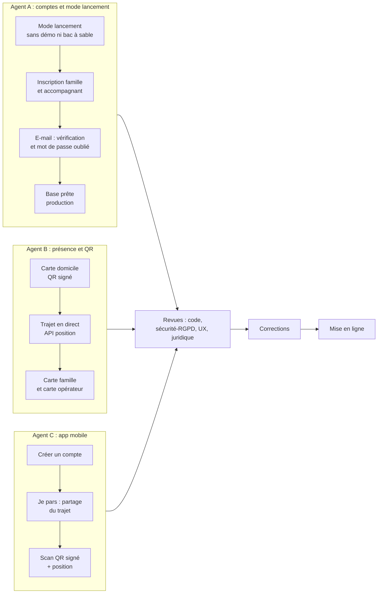

# L1 — Passage en mode lancement : décisions de l'orchestrateur

> Demande du fondateur (2026-10-07) : retirer la démo, permettre de créer un compte, carte en direct de l'accompagnant, QR code opérationnel, base de données et sécurité prêtes pour un usage normal.
> Ce document fixe les décisions et les **contrats** entre les 3 agents de développement. Les agents travaillent en parallèle. Ils respectent ces contrats.

## 1. Décisions

| # | Sujet | Décision |
|---|---|---|
| L1 | Mode | Une seule fonction `isLaunchMode()` (serveur) décide. En **lancement** : pas de `/tester`, pas de bac à sable, pas de compte démo, pas de robots, pas de bouton « Essayer avec le compte de démonstration ». Le code du bac à sable reste pour le développement et les tests, mais il est inaccessible en lancement. Lancement = défaut en production |
| L2 | Inscription | `/inscription` est **ouverte** en lancement. Deux parcours : **famille** et **accompagnant**. L'accompagnant peut se connecter tout de suite, mais il voit « Profil en cours de validation » jusqu'à la validation de l'opérateur (flux `VerificationItem` existant) |
| L3 | E-mail | Port `MailPort` : adaptateur `console` (développement) et `brevo` (production, `BREVO_API_KEY`). Vérification de l'e-mail par lien (jeton aléatoire, empreinte en base, 24 h, usage unique). Mot de passe oublié par lien (1 h). Sans clé Brevo en production : **pas de page 503**, mais un avertissement dans `/api/sante` et l'opérateur peut valider un e-mail à la main |
| L4 | Paiement | Pas de paiement simulé visible en lancement. Une formule payante affiche « Activation par un conseiller Koudmen » et crée une demande d'activation pour l'opérateur. Stripe viendra avec le compte du fondateur |
| L5 | App mobile | L'app reste **accompagnant** (ADR 0008). L'écran de connexion propose « Créer un compte accompagnant ». Une famille est envoyée vers le site web (installable). [À VÉRIFIER] avec le fondateur : app famille plus tard |
| L6 | Trajet en direct | L'accompagnant **démarre lui-même** le partage (« Je pars chez … »). Le partage s'arrête seul au check-in, à l'arrêt manuel, ou après 90 min. **Aucun historique** : une seule ligne par visite (dernière position), effacée au check-in ou à la fin du trajet. La famille du cercle Lakou de l'aîné et l'opérateur voient la carte. Jamais en dehors d'un trajet. Ceci modifie la règle « une seule position au check-in » : [À VÉRIFIER] critique juridique (subordination, directive 2024/2831, CNIL géolocalisation des travailleurs) |
| L7 | Carte | Web : MapLibre GL JS et tuiles OpenFreeMap (sans clé) [À VÉRIFIER conditions d'usage]. App : `react-native-maps` (Apple Plans sur iOS ; Android demande une clé Google, sinon repli « Ouvrir dans Plans/Maps »). Rafraîchissement par interrogation toutes les 10 s (Vercel, pas de WebSocket) |
| L8 | Adresse du domicile | Champ adresse réelle de l'aîné, géocodé par l'API Adresse (`api-adresse.data.gouv.fr`, couvre la Martinique) [À VÉRIFIER]. Repli : centre de la commune et indication « position approximative » |
| L9 | QR domicile | **Carte domicile imprimée** avec un QR **signé** : `koudmen:domicile:s1:<jeton>`. Jeton = JWS EdDSA (clé privée `QR_SIGNING_KEY` côté serveur), charge `{ a: aineId, v: version }`. La famille ou l'opérateur peut **régénérer** la carte (version +1, l'ancienne est refusée). Page imprimable dans l'espace famille et l'espace opérateur. Le code à 6 caractères reste en saisie de secours |
| L10 | Contrôle du check-in | Le serveur vérifie le jeton, la version, l'aîné de la visite, la fenêtre de la visite (début − 2 h à fin + 2 h), la distance au domicile (≤ 150 m, précision prise en compte), et refuse une position simulée (`mocked` sur Android). Un échec de position ne bloque pas : la preuve passe « À vérifier ». Un jeton faux ou révoqué est refusé |
| L11 | Base | Neon en production. Migrations au build (déjà en place). Aucune donnée de démo en production. Purge des restes de bac à sable en lancement. Index pour les nouvelles requêtes. Sauvegarde : restauration à un instant (Neon) documentée |
| L12 | Données réelles | Les données des aînés sont des données sensibles. Tant que l'hébergement HDS et l'analyse d'impact ne sont pas faits, le pilote réel reste limité [À VÉRIFIER] avocat/DPO. Le code ne bloque pas, mais `/api/sante` le signale |

## 2. Contrats API (font foi entre les agents)

Contrats Zod dans `plateforme/src/contracts/v1/` (copiés dans l'app par `mobile/scripts/sync-contracts.mjs`).

### 2.1 Inscription (agent A)

| Méthode | Route | Auth | Corps | Réponse |
|---|---|---|---|---|
| POST | `/api/v1/auth/inscription` | — | `{ role: "ACCOMPAGNANT", prenom, nom, email, telephone, motDePasse, commune, accepteCgu: true, accepteConfidentialite: true }` | `201 { etat: "VERIFICATION_EMAIL_ENVOYEE" }` (même réponse si l'e-mail existe déjà, sans fuite) |
| POST | `/api/v1/auth/mot-de-passe-oublie` | — | `{ email }` | `202 {}` toujours |

- Mot de passe : 10 caractères au moins, refus des mots de passe trop courants.
- Limites de débit : 5 inscriptions / h / IP, 3 « mot de passe oublié » / h / e-mail.
- `/auth/code` en `methode: "demo"` : refusé en lancement (`ACCES_REFUSE`).
- `GET /me` ajoute `emailVerifie: boolean` et `profilValide: boolean`.

### 2.2 Trajet et position (agent B)

| Méthode | Route | Auth | Corps | Réponse |
|---|---|---|---|---|
| POST | `/api/v1/visites/{id}/trajet` | Bearer accompagnant | `{ action: "DEMARRER" \| "ARRETER" }` | `200 { trajet: { etat: "EN_COURS" \| "ARRETE", expireA } }` |
| POST | `/api/v1/visites/{id}/position` | Bearer accompagnant | `{ latitude, longitude, precisionMetres, survenuA, simulee?: boolean }` | `204` ; `409 CONFLIT` si aucun trajet en cours |
| GET | `/api/famille/visites/{id}/trajet` | cookie famille (cercle Lakou) | — | `200 { etat, position?: { latitude, longitude, precisionMetres, majA }, domicile: { latitude, longitude, approximatif }, distanceMetres?, minutesEstimees? }` |
| GET | `/api/operateur/trajets` | cookie opérateur | — | `200 { trajets: [...] }` (trajets en cours) |

- Position : 1 envoi / 10 s / visite au plus (`429` sinon). Refus si la visite n'est pas à cet accompagnant ou pas du jour.
- Fin automatique : au check-in, à `ARRETER`, ou à `expireA` (90 min).

### 2.3 Check-in par QR (agents B et C)

Route existante des événements de l'app (`CHECK_IN`). La charge accepte en plus `{ qr?: string, codeDomicile?: string, position?: { latitude, longitude, precisionMetres, simulee } }`. Le serveur applique L10. Réponse : statut de la preuve `VALIDE | A_VERIFIER | REFUSE` et une raison en français simple.

## 3. Répartition

| Agent | Rôle | Périmètre (fichiers) |
|---|---|---|
| A | `dev-backend` | `src/server/auth/**`, `src/server/env.ts`, `config-check.ts`, `src/app/(public)/inscription/**`, pages mot de passe et vérification, `MailPort`, retrait démo/bac à sable de l'interface web, offre/paiement (L4), migrations `*_l1a_*` |
| B | `dev-integrations` | QR signé (`src/server/visits/**` preuve), trajet et position, carte famille et carte opérateur, page carte domicile imprimable, adresse et géocodage de l'aîné, migrations `*_l1b_*` |
| C | `dev-frontend` (app) | `mobile/**` seulement : inscription, retrait démo, « Je pars », carte itinéraire, scan QR `s1`, position au check-in, mode simulé à jour |

Règles communes : chaque agent commite après chaque étape, garde les suites vertes (lint, typecheck, tests unitaires, tests base, e2e touchés), écrit ses notes dans `docs/tech/L1-<lettre>-notes.md`, et ne touche pas au périmètre d'un autre agent.

## 4. Hors périmètre L1 (attend les comptes du fondateur)

Stripe (paiement réel), Twilio (appel « tapez 1 », SMS), push Expo réel (DPA + DPO), domaine `koudmen.fr` [À VÉRIFIER], hébergement HDS.
