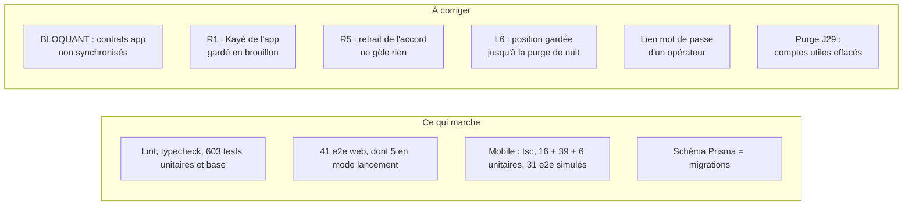
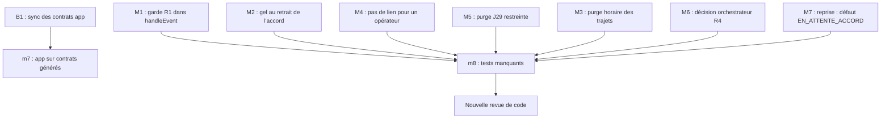

# Revue de code — lot L1 (passage en mode lancement)

> Réviseur : revue de code senior. Date : 2026-10-08.
> Périmètre : `git diff 6d4414f..HEAD` sur `plateforme/` et `mobile/` (lots L1-A, L1-B, L1-C et fusion `68f6259`).
> Références : `docs/revues/L1-arbitrage-lancement.md` (L1 à L12, § 2, § 5 R1 à R8), `docs/revues/L1-juridique.md`,
> `docs/tech/L1-A-notes.md`, `L1-B-notes.md`, `L1-C-notes.md`, `docs/tech/api-v1.md` § 11 et § 12.
> Règle : je ne corrige pas le code. Chaque remarque a un scénario d'échec concret.

## 1. Synthèse

| Gravité | Nombre | Sujets |
|---|---|---|
| BLOQUANT | 1 | Copie des contrats de l'app pas à jour : la CI échoue |
| MAJEUR | 7 | Garde R1 contournée par l'app (Kayé) ; retrait de l'accord sans effet ; dernière position gardée ~24 h ; lien « mot de passe » envoyé à un opérateur ; purge J29 trop large ; personne désignée par le payeur ; reprise des aînés |
| MINEUR | 8 | Migration renommée ; courses (inscription, position) ; code de démo encore joignable ; textes ; doublon des contrats ; tests manquants |

**Verdict : REFUSÉ** (voir § 6). Le BLOQUANT et les MAJEURS M1 à M5 doivent être corrigés avant la mise en ligne.

## 2. Exécution des suites

| Suite | Commande | Résultat |
|---|---|---|
| Lint web | `pnpm lint` | 0 erreur |
| Typecheck web | `pnpm typecheck` | **Échec avant `pnpm install`** (`maplibre-gl` absent de `node_modules` après la fusion) ; 0 erreur après `pnpm install --frozen-lockfile`. Environnement, pas code |
| Unitaires + base | `KOUDMEN_DB_TESTS=1 pnpm vitest run` (base `koudmen_rev_code`, migrations appliquées à neuf) | 64 fichiers, **603 tests verts** |
| Dérive schéma | `prisma migrate diff --from-migrations … --to-schema-datamodel …` | « No difference detected » |
| E2E web | `pnpm build:local` puis `RATE_LIMIT_DISABLED=true E2E_PORT=3480 pnpm e2e` | **41 verts** (projets `chromium` et `lancement`) |
| Mobile typecheck | `npx tsc --noEmit` | 0 erreur (après `npm ci` : `react-native-maps` absent avant) |
| Mobile unitaires | `test:l1`, `test:hors-ligne`, `test:natif` | 16, 39, 6 verts |
| Mobile e2e simulé | `e2e:simule` | 18 échecs avec l'ancien export `dist-simule` (5 oct.) ; **31 verts** après un nouvel export |
| Contrats app | `node scripts/sync-contracts.mjs --check` | **Échec** : `index.ts`, `inscription.ts`, `moi.ts`, `trajet.ts`, `visits.ts` pas à jour (voir B1) |
| E2E app ↔ serveur réel | — | Pas lancé par L1-C, pas lancé ici (voir m8) |

## 3. Constats

### 3.1 BLOQUANT

| Gravité | Fichier:ligne | Problème | Scénario d'échec | Correction proposée |
|---|---|---|---|---|
| **BLOQUANT** | `mobile/src/contracts/*` ; `.github/workflows/ci.yml:124` | La copie générée des contrats serveur dans l'app n'est pas à jour. Les contrats L1 (`inscription.ts`, `trajet.ts`, champs de `moi.ts` et `visits.ts`) manquent dans `mobile/src/contracts/`. | Le job CI exécute `node scripts/sync-contracts.mjs --check`. Ce contrôle sort en code 1. La CI est rouge : la branche ne respecte pas la règle commune « suites vertes » (§ 3 de l'arbitrage). | Lancer `npm run sync:contracts` dans `mobile/` et commiter la copie. Puis faire m7 (brancher l'app sur la copie générée). |

### 3.2 MAJEUR

| Gravité | Fichier:ligne | Problème | Scénario d'échec | Correction proposée |
|---|---|---|---|---|
| **MAJEUR** (M1, R1) | `plateforme/src/server/visits/app-service.ts:227-228`, `:241-249`, `:264-274`, `:350-367` ; aussi `:50`, `:68`, `:283` | La garde R1 (`realDataAllowed()`) est seulement dans `createKaye()`. Le chemin de l'app la contourne : (1) `KAYE_BROUILLON` appelle `saveDraft()` sans garde ; (2) un `KAYE_PUBLICATION` refusé pour préinscription (`INTERDIT`) passe dans `keepRefusedKayeAsDraft()`, qui **écrit le Kayé complet** en brouillon. Le check-in (QR, code, position) et `GET /visites` n'ont pas de garde non plus. | Mode lancement, `DONNEES_REELLES_AUTORISEES=false` (préinscription, ou retour à `false` après la fin d'un contrat HDS). Une visite réelle existe (reprise M7, ou données d'avant la fermeture). L'app envoie `KAYE_PUBLICATION`. Le serveur répond « Koudmen ouvre bientôt… Votre Kayé est gardé en brouillon » et garde en base l'humeur, l'appétit, la note et la `noteSurveillance` (donnée de santé) hors HDS. | En tête de `handleEvent()` (sauf `SOS`) : si `user.sandboxId === null && !realDataAllowed()`, refuser avec un motif dédié. Donner à l'erreur de préinscription un code distinct de `INTERDIT`, et ne jamais la garder en brouillon. Ajouter la même garde dans `listAppVisits()` et `getAppVisit()`. Ajouter un test base en `KOUDMEN_MODE=lancement` (brouillon, publication, check-in refusés ; aucune ligne `KayeDraft`). |
| **MAJEUR** (M2, R5) | `plateforme/src/server/operateur/accord.ts:54-91` ; `accompagnant/service.ts:581`, `:605`, `:654` ; `presence/home-card.ts:146-154` | Le retrait (`ACCORD_RETIRE`) ou le refus change seulement `accordEtat`. Il ne gèle rien : missions actives, visites prévues, demandes ouvertes et carte domicile restent valables. `createKaye()`, `checkInWithQr()`, `checkInWithCode()` et `resolveHomeCardToken()` ne lisent pas l'accord. Le matching opérateur non plus. | Un conseiller enregistre « Retrait » le lundi. Le mardi, l'accompagnant scanne l'ancienne carte imprimée (le QR reste valable) ou tape le code de secours. Le check-in passe, le Kayé est publié et le cercle Lakou est notifié. J5 et R5 (« adresse, QR et trajet seulement après l'accord ») ne sont pas respectés. Les notes L1-A § 4 le disent « à coder ». | Dans la transaction de `recordElderAccord()` (RETRAIT, REFUS) : suspendre les missions, annuler les visites futures, clore les demandes `OUVERTE`, mettre `homeCardId` à `null` (QR révoqué) et changer `homeCode`. Ajouter `aineConsentRecorded()` dans `loadOwnedVisit()` (preuves) et `createKaye()`. Test base : retrait puis check-in QR, code et Kayé refusés. |
| **MAJEUR** (M3, L6, R4) | `plateforme/src/server/presence/trajet.ts:98-121`, `:132-135`, `:207-209`, `:280-283` ; `plateforme/vercel.json` (cron `17 4 * * *`) | Un trajet expiré (60 min) n'est effacé qu'au prochain appel (position, vue famille, DEMARRER) ou à la purge de nuit (une fois par jour). La ligne garde la dernière position et le point de départ. | L'accompagnant démarre à 08:00. Le système tue l'app (l'`ARRETER` ne part jamais). Pas de check-in (visite annulée). La ligne `VisitTrip` avec latitude et longitude reste jusqu'à 04:17 UTC le lendemain, soit ~20 h. L6 dit « effacée à la fin du trajet ». La page `/confidentialite` (ligne 25) dit « 3 heures au plus ». | Effacer les trajets expirés à chaque appel des routes trajet et position (`deleteMany({ where: { expiresAt: { lte: now } } })`, index `expiresAt` déjà là), et ajouter une purge horaire (ou vider les coordonnées à l'expiration). Aligner le texte de `/confidentialite`. Test : trajet expiré sans appel → ligne absente après la purge horaire. |
| **MAJEUR** (M4, sécurité L3) | `plateforme/src/server/auth/registration.ts:92-101` (comparer `:162-167`) ; `resetPassword()` `:185-216` | Inscription avec un e-mail connu : le serveur envoie un e-mail avec un **lien « nouveau mot de passe » valable 1 h**, même pour un compte `OPERATEUR`. `requestPasswordReset()` exclut pourtant les opérateurs (TOTP prévu), et `api-v1.md` § 12.2 dit « opérateur : même réponse ». `resetPassword()` ne vérifie pas le rôle. Ce chemin n'applique pas la limite `mdp-oublie:compte` (3/h/e-mail). | (a) Quelqu'un poste `/api/v1/auth/inscription` avec l'e-mail d'un opérateur. L'opérateur reçoit un lien qui change son mot de passe : la règle « pas de lien pour un opérateur » est contournée (boîte mail compromise = compte opérateur pris). (b) Avec plusieurs IP (5/h/IP), un tiers envoie des dizaines d'e-mails à une victime ; chaque envoi annule le lien que la victime vient de demander (`issueAccountToken` annule les jetons précédents). | Dans la branche « e-mail connu » : pas de lien pour `OPERATEUR` (lien de connexion seulement), et appliquer `hitRateLimit("mdp-oublie:compte", email)` avant d'émettre un jeton. Dans `resetPassword()` : refuser un compte `OPERATEUR`. Test base : inscription avec l'e-mail d'un opérateur → aucun `AccountToken`. |
| **MAJEUR** (M5, J29, L3) | `plateforme/src/server/launch-retention.ts:22-38` | La purge efface tout compte non confirmé de plus de 7 jours, sans aîné, demande ni mission. Elle ne regarde pas la validation de l'accompagnant, les demandes de rappel (`PlanActivationRequest`, effacées en cascade) ni le rattachement « proche aidant » (`linkedAineId`). La validation opérateur n'exige pas l'e-mail confirmé (L1-A notes § 4). | Lancement **sans `BREVO_API_KEY`** (autorisé par L3 : avertissement seulement). Aucun e-mail ne part. (a) Une famille se préinscrit et demande un rappel ; 7 jours après, le compte et la demande sont effacés : la promesse « Nous vous contactons dès l'ouverture » est perdue. (b) L'opérateur valide un accompagnant (`VALIDE`) mais oublie « e-mail confirmé » ; sans mission, le compte est effacé. | Exclure de la purge : `caregiverProfile.validation` ∈ {`EN_ATTENTE`, `VALIDE`}, `linkedAineId` non nul, comptes avec `activationRequests`. Ou ne pas purger tant qu'aucun adaptateur e-mail réel n'est configuré. Ou exiger l'e-mail confirmé avant la validation. Tests base pour chaque cas. |
| **MAJEUR** (M6, R4) | `plateforme/src/server/presence/actions.ts:19-31` ; `docs/tech/api-v1.md` § 11.2 règle 5 | R4 dit : vue réservée à l'employeur et à **une personne désignée par l'aîné**. Le code laisse le **payeur** choisir cette personne, sans trace de l'avis de l'aîné. | Le payeur désigne un frère sans en parler à l'aîné. Ce frère voit la position en direct de l'accompagnant. Le choix ne vient pas de l'aîné : écart à R4 et au point de la critique juridique (J4). | Enregistrer la personne désignée pendant l'appel d'accord du conseiller (`accord.ts`, formulaire `accord-form.tsx`), avec la date et l'auteur ; ou faire confirmer le choix du payeur par le conseiller. Sinon, faire trancher l'orchestrateur [À VÉRIFIER] et corriger le texte de R4. |
| **MAJEUR** (M7, R5, reprise) | `plateforme/prisma/migrations/20261007190000_l1a_comptes_lancement/migration.sql:101`, `:104` | La reprise passe **tous** les aînés en `ACCORD_RECUEILLI`, même ceux du monde réel (`sandboxId IS NULL`) et même avec `consentGiven = false`. Elle marque aussi tous les e-mails comme confirmés. | La base Neon de production a servi pendant la phase de test (aînés de démo seedés dans le monde réel, essais manuels). Après le déploiement, ces aînés ont l'accord « recueilli » sans appel de conseiller. Le jour où `DONNEES_REELLES_AUTORISEES=true`, adresse, QR et trajet s'ouvrent pour eux. Le `[À VÉRIFIER]` de la migration demande une action manuelle facile à oublier. | Défaut sûr : `ACCORD_RECUEILLI` seulement pour `"sandboxId" IS NOT NULL` ; le monde réel reste `EN_ATTENTE_ACCORD`. Ajouter une étape à `docs/deploiement-vercel.md` (base Neon neuve recommandée, ou requête de contrôle avant l'ouverture). |

### 3.3 MINEUR

| Gravité | Fichier:ligne | Problème | Scénario d'échec | Correction proposée |
|---|---|---|---|---|
| MINEUR (m1) | `plateforme/prisma/migrations/20261007190000_l1a_comptes_lancement/` ; `docs/tech/L1-B-notes.md:84` | La fusion `68f6259` renomme la migration `20261007120000_l1a…` en `20261007190000_l1a…` (ordre l1b puis l1a correct sur une base neuve). Une base qui a déjà appliqué l'ancien nom garde une migration « inconnue » et rejoue l1a. | Base `koudmen_l1a` de l'agent A, ou branche Neon de préproduction déployée avec L1-A seul : `prisma migrate deploy` échoue (`type "AccountTokenPurpose" already exists`). | Vérifier qu'aucune base partagée n'a appliqué `20261007120000` [À VÉRIFIER] ; sinon `prisma migrate resolve`. Mettre à jour la note L1-B (§ 6.1). |
| MINEUR (m2) | `plateforme/src/server/auth/registration.ts:92-129` | Course : lecture de l'e-mail, puis création. Deux requêtes simultanées avec le même e-mail : la seconde lève `P2002`. | Double appui sur « Créer mon compte » dans l'app : la seconde réponse est une 500, pas le `201` attendu (réponse différente selon l'existence du compte). | Attraper `P2002` sur `user.create` et suivre la branche « e-mail connu ». |
| MINEUR (m3) | `plateforme/src/server/presence/trajet.ts:129-155` | Course avec le check-in : la ligne est lue, puis effacée par le check-in, puis `updateMany` compte 0. Le code renvoie `TROP_DE_REQUETES` (429), pas `CONFLIT` (409). Aucune garde de mission, de validation ni d'accord pendant le trajet. | L'app reçoit 429 : elle garde l'état « en cours » jusqu'au prochain envoi (30 s). Si la mission est suspendue ou l'accord retiré pendant le trajet, les positions sont encore écrites (pas montrées, mais gardées). | Si `count === 0`, relire la ligne : absente → `CONFLIT`. Reprendre les contrôles de `DEMARRER` (mission `ACTIVE`, profil `VALIDE`, `presenceRefusal`). |
| MINEUR (m4, L1) | `plateforme/src/server/famille/actions.ts:438-458` ; `plateforme/src/server/operateur/actions.ts:229-242` | Code de démo encore présent en lancement : `confirmVisitAction` (appel « tapez 1 » simulé, facteur `CONFIRMATION_AINE` simulé) n'a plus de bouton mais pas de garde `requireTrialMode()`. Côté opérateur, `KOUDMEN_OPERATEUR_CONFIRME=true` rouvre la confirmation simulée, et `config-check` ne refuse pas cette variable en lancement. | Un administrateur met `KOUDMEN_OPERATEUR_CONFIRME=true` en production « pour débloquer » : l'opérateur valide des visites avec un faux appel de l'aîné, contre R7. | Supprimer `confirmVisitAction` (code mort) ou le garder derrière `isLaunchMode()`. Refuser `KOUDMEN_OPERATEUR_CONFIRME` dans `productionConfigProblems()` en lancement. |
| MINEUR (m5) | `plateforme/src/app/(public)/confidentialite/page.tsx:25` ; `docs/deploiement-vercel.md:90` | Le texte dit « Consentement à chaque trajet » ; l'app demande l'accord une fois, avant le premier partage (L1-C § 2). Le texte dit « sauvegardes 7 jours au plus » ; la procédure propose un `pg_dump` chaque semaine, sans durée. | Une personne lit la page et croit qu'on lui demande son accord à chaque départ. Une copie `pg_dump` garde positions et Kayé au-delà de 7 jours. | Aligner le texte sur le code (accord unique, révocable). Fixer la durée des copies `pg_dump` et la faire figurer dans la page. Revue juridique [À VÉRIFIER AVEC UN AVOCAT]. |
| MINEUR (m6) | `plateforme/src/contracts/v1/trajet.ts:38-41` ; `plateforme/src/server/presence/trajet.ts:85-99` | Le contrat dit « `domicile` absent si l'accord n'est pas enregistré ». Le service lève une erreur avant : `domicile` est toujours présent dans une réponse `DEMARRER`. | Un développeur de l'app ajoute un cas « pas d'accord → pas de carte » qui n'arrive jamais. Faible effet. | Corriger le commentaire du contrat (`domicile` présent pour `DEMARRER`, absent pour `ARRETER`). |
| MINEUR (m7) | `mobile/src/contrats-l1/index.ts` ; `mobile/src/api/http.ts:18-24` ; `mobile/src/offline/cache.ts:4` | L'app utilise encore ses contrats **provisoires**, pas la copie générée. Écarts relevés (compatibles aujourd'hui) : `commune` `max(40)` contre `^[A-Z_]+$` 2-60 côté serveur ; `telephone` 10 chiffres contre 6 ; `prenom` 60 contre 80 ; schémas de réponse non stricts. Les 34 codes de commune sont identiques des deux côtés (vérifié). | Le serveur change un champ (ex. `controle`). `sync-contracts --check` met à jour la copie, mais l'app lit toujours `contrats-l1` : la CI reste verte et l'app casse en production. | Après B1 : importer `demandeInscriptionSchema`, `reponseTrajetSchema`, `demandePositionSchema`, `controleCheckInSchema` depuis `src/contracts/`. Garder seulement les ajouts propres à l'app (`lireControle`, constantes d'écran). Supprimer `src/contrats-l1/`. |
| MINEUR (m8) | Tests | Cas importants sans test : (1) R1 sur le chemin de l'app (brouillon, Kayé refusé, check-in) ; (2) `ACCORD_RETIRE` puis QR, code, trajet, Kayé ; (3) inscription avec l'e-mail d'un opérateur ; (4) purge J29 avec accompagnant validé, demande de rappel, proche aidant rattaché ; (5) trajet expiré sans appel (durée réelle de la ligne) ; (6) e2e app ↔ serveur réel pour L1 (L1-C notes § 5 : « Non lancé »). | Les MAJEURS M1, M2, M4, M5 et M3 passent tous les tests actuels : aucun test ne les aurait vus. | Ajouter ces tests avec les corrections. Lancer `mobile` `npm run e2e` contre un `plateforme` en mode essai, avec les parcours L1 (inscription, trajet, QR `s1`). |

## 4. Points vérifiés sans remarque

- **Mode unique (L1)** : `siteMode()` / `isLaunchMode()` dans `config-check.ts` ; le middleware redirige `/tester`, `/cgu-test`, `/famille/visite-decouverte`, `/operateur/test` ; les actions du bac à sable refusent ; `getCurrentUser()` et `apiAccessProblem()` refusent les comptes de bac à sable ; `isTestMode()` est faux en lancement (pas de « Simuler ma position ») ; `methode: "demo"` refusé.
- **Paiement (L4, R8)** : `changePlanAction` passe par la demande de rappel en lancement ; aucun `SimulatedPayment`.
- **Jetons d'e-mail (L3)** : 256 bits, empreinte SHA-256, usage unique par mise à jour conditionnelle, 24 h / 1 h, sessions fermées au nouveau mot de passe.
- **QR signé (L9, R7)** : JWS EdDSA, charge `{ c, v }` sans `aineId`, version et identifiant de carte contrôlés, jeton jamais journalisé, essais comptés avec le code.
- **Check-in (L10, R7)** : fenêtre − 2 h, 150 m + min(précision, 50 m), précision > 150 m refusée, `mocked` refusé, domicile approximatif non comparé, **aucune coordonnée brute** dans `VisitProof`, distance arrondie.
- **Trajet (R3, R4)** : une ligne par visite, coordonnées arrondies avant l'écriture, 30 s atomique, départ masqué 500 m, arrêt à 150 m, jamais « non partagé », pas de carte opérateur hors SOS (accès journalisé), aucune coordonnée au journal.
- **Contrats** : formes serveur et app compatibles pour l'inscription, `/me`, le trajet, la position et `controle` (le serveur accepte tout ce que l'app envoie).
- **Migrations** : ordre l1b (`180000`) puis l1a (`190000`) correct sur une base neuve ; schéma = migrations.

## 5. Ordre de correction proposé

## 6. Verdict

**REFUSÉ.**

- Le BLOQUANT B1 rend la CI rouge.
- M1 et M2 laissent passer des données réelles d'aînés là où R1 et R5 les ferment.
- M3, M4 et M5 touchent la sécurité ou la conservation des données dès le premier jour du lancement.
- La base du lot est solide : architecture claire, tests nombreux et verts, contrats respectés. Les corrections sont locales. Après B1, M1 à M5 et les tests de m8, je propose « APPROUVÉ AVEC RÉSERVES » (M6, M7 et MINEURS à suivre).
