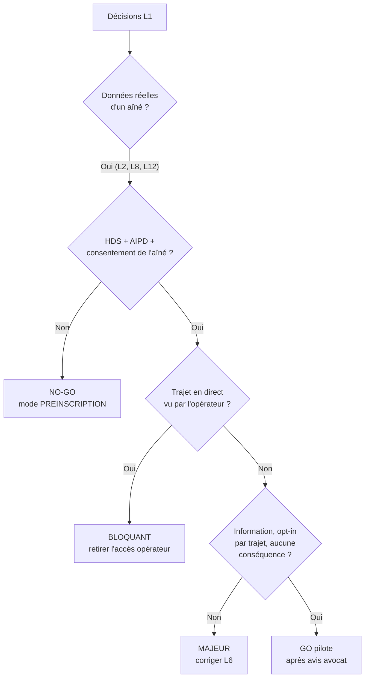
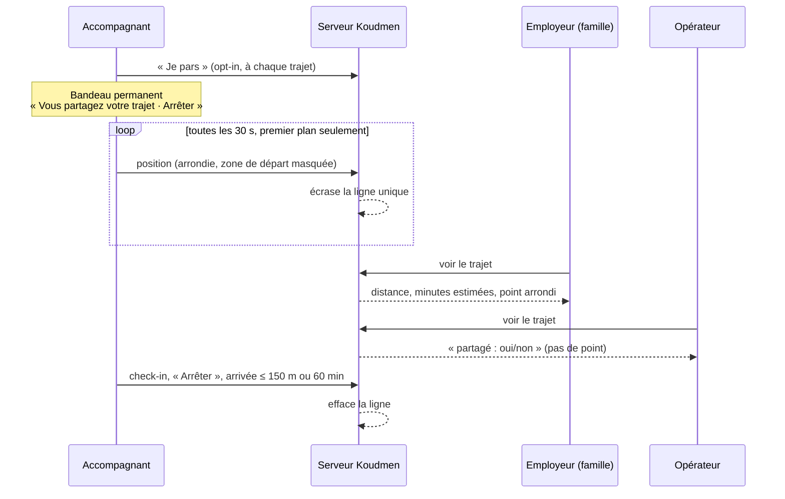
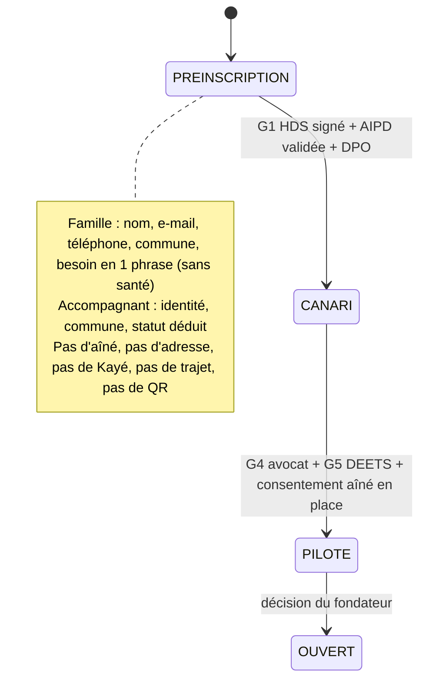

# Revue L1 — critique juridique du passage en mode lancement

> **Rôle :** critique juridique (droit du numérique, droit social, services à la personne).
> **Objet :** décisions L1 à L12 de `L1-arbitrage-lancement.md`, contrats API § 2, état du code utile (`prisma/schema.prisma`, pages `/confidentialite` et `/mentions-legales`, commit `de39f29` « langage de lancement »).
> **Références :** `docs/01` (§ 3, § 5, § 8, § 11), `docs/05` (§ 7), `docs/08`, `S1-juridique.md`, `S1-arbitrage.md`, `backlog-pilote.md`, ADR 0004 et 0007.
> **Date :** 2026-10-07. **Statut :** avis critique, pas une consultation juridique. Un point `[À VÉRIFIER AVEC UN AVOCAT]` ne sert pas de base à une décision sans contrôle.

---

## 0. Verdict en bref

| Étape | Verdict | Condition |
|---|---|---|
| **Mise en ligne L1 telle que décrite** (inscription ouverte, vrais aînés, trajet en direct, sur Vercel + Neon) | **NO-GO** | 6 points BLOQUANTS (§ 2) |
| **« Lancement fermé »** : pré-inscription des familles et candidatures d'accompagnants, **sans donnée sur l'aîné**, sans visite réelle | **GO SOUS CONDITIONS** | Mode `PREINSCRIPTION` (§ 4), politique de confidentialité réécrite, CGU de lancement, mentions légales remplies |
| **Pilote réel** (vrais aînés, vraies visites) | **NO-GO tant que** | HDS + AIPD + consentement réel de l'aîné + avis avocat (portes G1 à G5 de l'ADR 0007) |

Les trois risques principaux :

1. **ATTENTION — Des données réelles d'aînés arrivent hors HDS, sans AIPD.** L11 met Neon en production. L12 dit « le code ne bloque pas ». Le verrou de l'ADR 0007 n'existe pas dans `config-check.ts`. Le commit `de39f29` a retiré le bandeau « test » et « données fictives ». Une vraie famille peut donc saisir la vraie adresse et le vrai Kayé de sa mère sur un hébergement non conforme.
2. **ATTENTION — L'opérateur Koudmen voit la position en direct de l'accompagnant.** C'est l'indice de subordination de l'arrêt Take Eat Easy (Cass. soc., 28 nov. 2018). `docs/01` § 3.3 l'interdit en toutes lettres (« suivi en temps réel »).
3. **ATTENTION — La politique de confidentialité ment.** Elle dit : « une seule lecture, au check-in. Jamais en arrière-plan, jamais au départ ». L6 fait l'inverse. Elle décrit aussi une démo qui n'existe plus en lancement.

---

## 1. Ce qui est déjà bon (à garder)

- L1 : plus de compte démo ni de bac à sable en lancement. Le risque T1 de S1 disparaît.
- L3 : jeton aléatoire, empreinte en base, durée courte, usage unique. Réponse identique si l'e-mail existe. Conforme à l'art. 32 RGPD.
- L4 : aucun paiement réel. Les heures restent hors plateforme (ADR 0004). Aucun prélèvement sur l'accompagnant (art. L5321-3 C. trav.).
- L6 : l'accompagnant démarre lui-même. Arrêt automatique. Aucun historique voulu. Jamais hors trajet.
- L10 : un échec de position ne bloque pas la visite. Le refus du GPS n'a pas d'effet.
- L2 : l'accompagnant n'accède à rien d'opérationnel avant la validation humaine.

---

## 2. Points BLOQUANTS

| # | Risque | Gravité | Décision | Pourquoi | Alternative conforme |
|---|---|---|---|---|---|
| **J1** | Données réelles hors HDS, sans AIPD | **BLOQUANT** | L11 (« Neon en production »), L12 (« le code ne bloque pas »), L2 | Le Kayé (humeur, appétit, « à surveiller »), les besoins et l'adresse d'une personne âgée vulnérable sont des données de santé ou très sensibles (art. 9 RGPD). Leur hébergement pour notre compte exige un hébergeur **certifié HDS** (art. L1111-8 CSP, `docs/01` § 5.2). L'AIPD est **obligatoire** avant le traitement (art. 35 RGPD ; personnes vulnérables, santé, géolocalisation, usage innovant). L11 contredit l'ADR 0007 (« Neon ne part jamais en production »). Un avertissement dans `/api/sante` ne protège personne | 1. **Le code bloque.** Ajoute `DONNEES_REELLES_AUTORISEES` (défaut `false`). Le serveur refuse la création d'un aîné, d'une adresse, d'un Kayé et d'un trajet si la variable est `false`. 2. La variable ne passe à `true` que si `HOSTING_PROVIDER=clever-cloud-hds` **et** `AIPD_VALIDEE=<date>` **et** `DPO_DESIGNE=<nom>` existent (vérifiés par `config-check.ts`). 3. Tant que c'est `false` : mode `PREINSCRIPTION` (§ 4). 4. Corrige L11 : « Neon pour `staging` fictif seulement » |
| **J2** | Interface de lancement sans cadre juridique | **BLOQUANT** | Commit `de39f29` (bandeau et « données fictives » retirés), L1, L2 | La politique de confidentialité décrit une **démo** (« code testeur », « 30 jours », « n'écrivez jamais de donnée réelle »). Elle ne couvre ni l'inscription réelle, ni l'adresse, ni le trajet, ni le QR, ni les demandes d'activation. Art. 13 et 14 RGPD : information incomplète. Les CGU de test (S1, T4) ne valent plus. Les champs de l'éditeur (`EDITEUR_NOM`…) sont peut-être encore vides : LCEN art. 6 `[À VÉRIFIER AVEC UN AVOCAT : numérotation après la loi SREN]` | 1. Réécris `/confidentialite` pour le lancement (plan au § 5.6). 2. Publie des **CGU de lancement**, des **conditions accompagnants** (P2B : motifs de suspension, réexamen) et des **conditions familles**. 3. Bloque le démarrage en lancement si `EDITEUR_NOM`, `EDITEUR_ADRESSE`, `EDITEUR_EMAIL`, `DIRECTEUR_PUBLICATION` sont vides (`config-check.ts`). 4. Garde en pied de page : « Koudmen met en relation. Koudmen n'est pas un service d'aide à domicile autorisé. Les visites ne sont pas encore proposées. » |
| **J3** | Suivi en temps réel par l'opérateur | **BLOQUANT** | L6 (« l'opérateur voit la carte »), `GET /api/operateur/trajets` | Koudmen voit où se trouve, en direct, une personne qui travaille pour un tiers (la famille) ou pour elle-même (AE). La géolocalisation en temps réel **par la plateforme** est l'indice central de subordination (Take Eat Easy, 2018). La directive (UE) 2024/2831 crée une **présomption** de salariat quand des faits montrent un contrôle (art. 5) et limite la surveillance (art. 7). Si Koudmen contrôle le trajet du salarié de la famille, Koudmen apparaît comme l'employeur réel ou comme un prestataire sans autorisation | 1. **Supprime** la carte opérateur des trajets et la route `GET /api/operateur/trajets` en lancement. 2. L'opérateur voit seulement un **état** : « trajet partagé : oui / non », sans coordonnées et sans heure. 3. **Exception unique : SOS.** Si l'accompagnant déclenche un SOS, l'opérateur voit la dernière position. Accès journalisé (qui, quand, motif). 4. Écris dans les conditions accompagnants : « Koudmen ne regarde jamais votre trajet. Koudmen n'utilise jamais votre position pour vous évaluer, vous classer ou vous sanctionner. » |
| **J4** | Information contraire à la réalité sur la position | **BLOQUANT** | L6 face à `/confidentialite` (« jamais au départ ») et au commentaire `VisitProof` (« jamais de suivi continu ») | Information **fausse** sur un traitement de localisation : manquement aux art. 5.1.a (loyauté) et 13. Pour un salarié de la famille, art. L1222-4 C. trav. : aucune information ne peut être collectée par un dispositif **non porté préalablement à sa connaissance** | Texte à jour avant la mise en ligne du trajet (textes au § 5.1 et § 5.6). Écran d'information **avant le premier partage** (opt-in actif, pas de case pré-cochée). Mets à jour le commentaire du schéma et la page de l'app « À propos et confidentialité » |
| **J5** | Consentement de l'aîné donné par un tiers | **BLOQUANT** | L2 (parcours famille), modèle `Aine` (`consentGiven`, `consentByName` saisis par la famille), L8, L9 | Inchangé depuis S1 (P3). La famille n'a **aucun pouvoir propre** sur les données de l'aîné (`docs/01` § 5.4). En lancement, la case n'est plus fictive : elle devient une fausse preuve. Pour les données de santé, il faut un **consentement explicite** de l'aîné (art. 9.2.a) ou d'un représentant légal **prouvé**. L8 ajoute l'adresse réelle et L9 pose une carte **chez lui** : il doit le savoir | 1. La famille crée un aîné à l'état `EN_ATTENTE_ACCORD` : prénom, commune, téléphone. **Rien d'autre.** 2. Un conseiller Koudmen **appelle l'aîné** (en créole si besoin). Il lit la notice FALC (§ 5.4). Il enregistre l'accord (date, heure, conseiller, langue, version de la notice). 3. Champ `situationJuridique` (autonome, curatelle, tutelle, habilitation familiale, mandat de protection future) + justificatif vu (« jugement vu le … », sans copie). 4. Adresse, besoins, Kayé, QR et trajet seulement après `ACCORD_RECUEILLI`. 5. Retrait de l'accord par téléphone ou par la famille : gel du profil sous 24 h, effacement sous 30 jours |
| **J6** | Données d'infraction et données sociales réelles des accompagnants | **BLOQUANT** | L2 (parcours accompagnant), orientation (Q4 : RSA, chômage, titre de séjour), vérification `CASIER_B3` en texte libre | En test, S1 (T7) avait mis « Répondez avec un profil imaginaire ». En lancement, ces réponses sont **réelles**. Un acteur privé ne peut pas tenir de données sur les condamnations (art. 10 RGPD, art. 46 loi Informatique et Libertés). Le statut de séjour et la situation sociale sont des données sensibles au sens courant, sans finalité prouvée pour chaque réponse | 1. `CASIER_B3` : **aucun texte libre**, aucune copie. Seul champ : « B3 vu par [opérateur] le [date] : conforme / non conforme ». 2. Orientation : stocke **le statut déduit** (ex. `SALARIE_PARTICULIER`), pas les réponses brutes. Efface `orientationAnswers` à la validation du profil. 3. Mention sous chaque question : « Pourquoi cette question : pour vous proposer seulement les activités permises par votre statut. » |

---

## 3. Points MAJEURS et MINEURS, décision par décision

### 3.1 L6 — Trajet en direct (analyse détaillée)

#### a) Qualification

| Statut de l'accompagnant | Qui est « employeur » ou « client » | Cadre de la géolocalisation | Risque principal |
|---|---|---|---|
| Salarié de la famille (CESU, IDCC 3239) | L'aîné ou l'enfant (employeur) | Code du travail : L1121-1 (proportionnalité), L1222-4 (information préalable). Référentiel CNIL sur la géolocalisation des salariés `[À VÉRIFIER AVEC UN AVOCAT : applicabilité au particulier employeur]` | Koudmen fournit l'outil de contrôle : Koudmen ressemble à l'employeur ou au mandataire. Trajet domicile → lieu de travail = **hors temps de travail** (L3121-4) : la CNIL interdit de géolocaliser hors du temps de travail |
| Auto-entrepreneur (niveau 2) | Le client | RGPD seul. Directive 2024/2831 chap. III (s'applique aussi aux vrais indépendants) | Le client suit le trajet d'un indépendant : indice de subordination envers le client. La plateforme fournit l'outil : indice envers Koudmen |
| Proche aidant APA, bénévole | Aucun | RGPD seul | Faible, si l'opt-in est réel |

**Directive 2024/2831, art. 7.1.d :** une plateforme ne traite **aucune** donnée personnelle collectée quand la personne n'exécute pas ou ne propose pas un travail via la plateforme. Le trajet vers l'aîné est-il du « travail via plateforme » ? `[À VÉRIFIER AVEC UN AVOCAT]`. Prudence : traiter le trajet comme une période où la collecte n'est permise que **sur demande de la personne**, sans aucun effet sur elle.

**Base légale proposée :** consentement (art. 6.1.a), spécifique, **à chaque trajet**, retirable d'un geste (« Arrêter »). Le consentement d'une personne en position de dépendance est fragile. Il reste valable ici si **refuser n'a aucune conséquence** (lignes directrices CEPD 05/2020 sur le consentement, § 21 à 24) `[À VÉRIFIER AVEC UN AVOCAT]`. L'intérêt légitime de la famille ne suffit pas : le besoin (« savoir quand il arrive ») est couvert par un SMS « je pars ».

**Responsable de traitement :** Koudmen (il conçoit le moyen et la finalité). La famille-employeur est peut-être **responsable conjointe** pour sa propre consultation `[À VÉRIFIER AVEC UN AVOCAT, question S1 n° 4]`.

#### b) Tableau des risques L6

| # | Risque | Gravité | Fonctionnalité | Pourquoi | Alternative conforme |
|---|---|---|---|---|---|
| J3 | Opérateur voit le trajet | **BLOQUANT** | Carte opérateur | Voir § 2 | Voir § 2 |
| J4 | Information fausse | **BLOQUANT** | `/confidentialite` | Voir § 2 | Voir § 2 et § 5.1 |
| **J7** | Opt-in sous pression | **MAJEUR** | Carte famille : état « non partagé » | Si la famille voit « Il n'a pas partagé son trajet » à chaque visite, elle met une pression. Le partage devient une condition implicite pour être choisi. Le consentement n'est plus libre. Un employeur qui l'exige crée un dispositif de contrôle | 1. La famille ne voit **jamais** un état « refusé » ou « non partagé ». Elle voit soit le trajet, soit « Visite prévue à 14 h ». 2. **Aucune donnée** sur le partage n'entre dans le profil, le tri, les propositions ou un tableau opérateur. 3. Pas de rappel « Pensez à partager ». 4. Test automatique : le tri des profils ne lit aucune table liée au trajet |
| **J8** | Collecte trop fine et trop fréquente | **MAJEUR** | Position toutes les 10 s, coordonnées exactes | Art. 5.1.c (minimisation). Pour annoncer « il arrive dans 8 min », un point toutes les 30 s et une précision de 100 à 200 m suffisent. Le point exact du départ révèle **le domicile de l'accompagnant** | 1. Envoi toutes les **30 s** (refus `429` en dessous de 25 s). 2. Coordonnées **arrondies à 3 décimales** (≈ 110 m) dans la réponse famille. 3. **Zone de départ masquée** : rien n'est affiché tant que l'accompagnant est à moins de **500 m** de son premier point. 4. Affichage par défaut : distance et minutes estimées ; le point sur la carte est secondaire |
| **J9** | Collecte en arrière-plan | **MAJEUR** | App mobile, `react-native-maps` | Une permission « Toujours » permet une collecte invisible. CNIL : la personne doit pouvoir désactiver à tout moment | Permission **« Pendant l'utilisation »** seulement. Android : service de premier plan avec notification fixe « Koudmen partage votre trajet · Arrêter ». iOS : indicateur bleu système. Jamais de demande « Toujours » |
| **J10** | « Aucun historique » faux dans les faits | **MAJEUR** | L6, L11 (Neon, restauration à un instant) | La restauration à un instant de Neon garde **chaque version** de la ligne pendant la fenêtre de rétention. Les journaux d'accès (Vercel, proxy) peuvent garder le corps ou l'URL des requêtes. Promettre « aucun historique » est alors inexact | 1. Table `TrajetPosition` à part, purge au check-in **et** tâche de nuit qui efface toute ligne de plus de 3 h. 2. Ne jamais journaliser latitude et longitude (filtre des logs, test unitaire). 3. Écris la vérité : « Votre dernière position est effacée à l'arrivée. Une copie technique peut rester dans les sauvegardes chiffrées pendant 7 jours au plus, puis disparaît. » `[À VÉRIFIER : fenêtre réelle de l'hébergeur HDS]` |
| **J11** | Trop de personnes voient le trajet | **MAJEUR** | « La famille du cercle Lakou voit la carte » | Tout le cercle (cousins, voisine) n'a pas besoin de suivre un trajet. S1 (P7) limitait déjà `VISITE_COMMENCEE` à l'employeur | Seuls **l'employeur** (ou le client de l'AE) et **une personne désignée par l'aîné** voient le trajet. Les autres membres voient « Visite en cours » après le check-in |
| **J12** | Durée trop longue | **MINEUR** | Arrêt après 90 min | En Martinique, un trajet d'une commune à l'autre dépasse rarement 60 min. 90 min élargit la fenêtre de collecte sans besoin | **60 min**, puis arrêt. L'accompagnant peut relancer un trajet (nouvel opt-in). Arrêt automatique aussi à **≤ 150 m** du domicile (arrivée), même sans check-in |
| **J13** | Accompagnant AE suivi par son client | **MINEUR** | Carte famille pour un AE | Indice de subordination envers le client. Faible si l'AE décide seul | Même règles. Dans les conditions AE : « Le partage de trajet est un service que vous offrez si vous le voulez. Ce n'est pas une obligation de votre contrat. » |
| **J14** | Trajet sans AIPD | **MAJEUR** | L6 entière | Géolocalisation + personnes en dépendance économique + nouveauté : critères CEPD réunis. Art. 8 de la directive 2024/2831 | Le trajet entre dans l'AIPD (J1). La fonction reste désactivée (`TRAJET_DIRECT_ACTIF=false`) jusqu'à la validation de l'AIPD et l'avis de l'avocat |

**Recommandation de produit (moins de risque, même bénéfice) :** livrer d'abord un bouton **« Je pars »** sans position. La famille reçoit « Marc est parti. Arrivée prévue vers 14 h 10. » L'heure vient de l'accompagnant. La carte en direct reste une **option** activable après l'AIPD.

### 3.2 L8 — Adresse réelle de l'aîné

| # | Risque | Gravité | Pourquoi | Alternative conforme |
|---|---|---|---|---|
| **J15** | Adresse saisie sans l'accord de l'aîné | **MAJEUR** (BLOQUANT tant que J5 n'est pas fait) | Adresse + âge + isolement = cible pour le vol, l'abus de faiblesse, le démarchage. La famille n'a pas de pouvoir propre | Champ disponible seulement après `ACCORD_RECUEILLI` (J5). L'aîné peut refuser l'adresse exacte : repli « centre de la commune » + code du domicile |
| **J16** | Adresse visible trop tôt | **MAJEUR** | Un accompagnant qui reçoit une proposition n'a pas besoin de l'adresse. S'il refuse, il la garde | Avant l'accord : **commune** seulement. Après l'accord accepté : adresse visible **le jour de la visite** (de J−1 à 20 h jusqu'à la fin de la visite + 2 h). Fin de l'accord : plus d'accès. Chaque lecture est journalisée |
| **J17** | Envoi à un service tiers | **MINEUR** | `api-adresse.data.gouv.fr` reçoit le texte de l'adresse et l'IP du serveur | Envoie **l'adresse seule**, jamais le nom. Appel depuis le serveur, pas depuis le navigateur. Cite le service dans la politique de confidentialité. `[À VÉRIFIER : conditions d'usage et journalisation de l'API]` |
| **J18** | Stockage en clair | **MINEUR** | `docs/05` classe l'adresse en donnée sensible (🟠) | Chiffrement par champ (adresse, latitude, longitude du domicile). Accès restreint et tracé |

### 3.3 L9 — QR domicile signé

| # | Risque | Gravité | Pourquoi | Alternative conforme |
|---|---|---|---|---|
| **J19** | Le QR révèle un identifiant lisible | **MINEUR** | La charge d'un JWS est en base64, **lisible par tous**. `aineId` est un identifiant de personne. Toute personne qui photographie la carte le lit | Charge **opaque** : `{ k: <identifiant aléatoire de carte>, v }`. La table `CarteDomicile` relie `k` à l'aîné côté serveur. Aucun nom, aucune adresse, aucune donnée lisible |
| **J20** | Carte chez l'aîné sans qu'il le sache | **MAJEUR** | Un objet de contrôle est posé dans son domicile. L'aîné doit être informé (art. 13) et doit pouvoir la retirer | La carte n'est imprimée qu'après `ACCORD_RECUEILLI`. Texte sur la carte (§ 5.3). L'aîné peut demander une nouvelle carte ou l'arrêt **par téléphone** |
| **J21** | Preuve copiable : attestation de service fait | **MAJEUR** | Un QR fixe se photographie. Un check-in faux crée des heures fausses, donc un crédit d'impôt faux (fraude). Si l'opérateur « valide », Koudmen atteste le service fait (S1, P6) | 1. Le QR seul ne suffit pas : « 2 preuves sur 3 » reste la règle. 2. Un écart de position > 150 m **ou** une position absente → « À vérifier » : la **famille** décide, pas l'opérateur. 3. Le relevé d'heures affiche l'état de chaque preuve. 4. Mention sur le relevé : « Relevé indicatif. L'employeur vérifie et déclare lui-même. » |

### 3.4 L10 — Position au check-in

| # | Risque | Gravité | Pourquoi | Alternative conforme |
|---|---|---|---|---|
| **J22** | Coordonnées brutes gardées | **MAJEUR** | `VisitProof.latitude/longitude` stockés. S1 (P7) demandait déjà de ne garder que le résultat | Stocke : `valid`, `distanceMeters` **arrondie à 50 m**, `accuracyMeters`, `simulated`. **Efface latitude et longitude** juste après le calcul (dans la même requête) |
| **J23** | Durée de conservation non fixée | **MAJEUR** | Art. 5.1.e | Preuve de visite (résultat seulement) : **durée de l'accord + 1 an**, puis effacement `[À VÉRIFIER AVEC UN AVOCAT : délai de reprise de l'administration fiscale pour le crédit d'impôt]`. Coordonnées brutes : **0 jour** (non stockées) |
| **J24** | « À vérifier » vu comme une sanction | **MINEUR** | Une preuve « À vérifier » ne doit pas toucher l'accompagnant (indice de pouvoir disciplinaire) | Aucun effet sur le profil, le tri ou les propositions. Texte neutre : « Une preuve n'a pas pu être lue. La famille confirme la visite. » |
| — | Refus des positions simulées | Conforme | Lutte contre la fraude, proportionnée | Garder. Ne garder que le booléen `simulated` |

### 3.5 L2 et L3 — Inscription ouverte, consentements, vérification

| # | Risque | Gravité | Pourquoi | Alternative conforme |
|---|---|---|---|---|
| J5, J6 | Voir § 2 | **BLOQUANT** | — | — |
| **J25** | Consentement « paquet » | **MAJEUR** | Le contrat demande `accepteCgu` et `accepteConfidentialite`. On n'« accepte » pas une politique de confidentialité : on la lit. Le traitement du compte repose sur le **contrat** (art. 6.1.b), pas sur le consentement | Remplace par : case 1 « J'accepte les conditions d'utilisation » (obligatoire) ; texte « J'ai lu la politique de confidentialité » avec lien (pas une case de consentement). Cases **séparées et facultatives** pour : e-mails d'information, appel d'un conseiller |
| **J26** | Âge non contrôlé | **MAJEUR** | `docs/08` § 4.2 : 18 ans minimum, 21 ans au niveau 3 | Champ date de naissance (accompagnant). Refus sous 18 ans. Niveau 3 bloqué sous 21 ans (règle serveur) |
| **J27** | Placement : frais demandés à l'accompagnant | **MAJEUR** (si cela arrive) | Art. L5321-3 C. trav. : le placement est gratuit pour la personne qui cherche un emploi | Test automatique : aucune route de paiement n'accepte un compte accompagnant. Mention dans les conditions accompagnants : « L'inscription et l'usage de Koudmen sont gratuits pour vous. Toujours. » |
| **J28** | Validation de l'opérateur sans règles publiées | **MAJEUR** | Refuser un profil = décision significative (P2B, directive chap. III) | Liste fermée des critères de validation dans les conditions accompagnants. Motif écrit en cas de refus. Bouton « Demander un réexamen ». Délai de réponse affiché (ex. 7 jours) |
| **J29** | Données des inscrits sans fin | **MINEUR** | Art. 5.1.e | Compte non vérifié (e-mail) : effacement après **7 jours**. Compte inactif : rappel à 24 mois, effacement à **36 mois**. Candidature refusée : effacement à **6 mois** |
| **J30** | Envoi d'e-mails par Brevo | **MINEUR** | Sous-traitant (art. 28). Brevo est une société française, hébergement UE `[À VÉRIFIER]` | DPA Brevo signé. Brevo dans la liste des sous-traitants. Contenu des e-mails sans donnée de santé ni prénom de l'aîné |
| **J31** | Validation manuelle de l'e-mail par l'opérateur | **MINEUR** | Risque d'usurpation (compte au nom d'un tiers) | Validation manuelle seulement après un appel au numéro du compte. Journal : qui, quand, comment |

### 3.6 L4 — Paiement et « activation par un conseiller »

| # | Risque | Gravité | Pourquoi | Alternative conforme |
|---|---|---|---|---|
| **J32** | Vente à distance sans cadre | **MAJEUR** (BLOQUANT si un euro est encaissé) | Si le conseiller active une formule payante (virement, lien de paiement, espèces), c'est un **contrat à distance** : information précontractuelle (L221-5 C. conso), rétractation de 14 jours (L221-18), CGV, médiateur (L612-1), facture. Sans Stripe ni CGV, rien de cela n'existe | En lancement, la demande d'activation est **une demande de rappel**, pas une commande. Texte : « Aucun paiement n'est demandé aujourd'hui. Un conseiller vous appelle pour vous expliquer. Vous ne vous engagez à rien. » Le conseiller **n'encaisse rien** tant que les CGV ne sont pas publiées |
| **J33** | Prix non loyaux | **MAJEUR** | Commit `de39f29` : « Tarifs de lancement · ouverture prochaine ». La mention « Non commercialisé » a disparu. L111-7 II C. conso : information loyale sur les droits **civils et fiscaux** (S1, P2) | Chaque formule affiche deux lignes : « Abonnement Koudmen : X € TTC/mois. Services numériques. **Non éligible au crédit d'impôt.** » `[À VÉRIFIER par rescrit]` et « Heures d'accompagnement : payées à part à l'accompagnant. Crédit d'impôt de 50 % **si** les conditions sont remplies. » |
| **J34** | Sérénité vend encore une visite | **MAJEUR** | Si Sérénité inclut « 1 visite par semaine » ou un « remplacement », Koudmen vend une prestation de compagnie (n° 25, autorisation CTM ; S1, P1) | Retire tout volume de visites et toute garantie de remplacement du texte des formules. Écris « Aide pour trouver un remplaçant (sans garantie) » |
| **J35** | Données des demandes d'activation | **MINEUR** | Données de contact et de projet | Effacement à **3 mois** sans suite. Cité dans `/confidentialite` |

### 3.7 L12 — Données de santé, HDS, AIPD

| # | Risque | Gravité | Pourquoi | Alternative conforme |
|---|---|---|---|---|
| J1 | Voir § 2 | **BLOQUANT** | — | — |
| **J36** | Kayé et texte libre | **MAJEUR** | Le champ `consignes` et les notes du Kayé reçoivent des diagnostics en texte libre (« Alzheimer », « diabète ») | Aide à la saisie : « N'écrivez pas de diagnostic ni de traitement. » Choix fermés pour l'humeur et l'appétit. Détection simple de mots médicaux → avertissement avant envoi |
| **J37** | DPO, registre, procédure de violation | **MAJEUR** | `docs/01` § 5.3, art. 30, 33, 37 RGPD | DPO désigné (externe possible). Registre à jour (traitements L1 inclus). Procédure de violation de 72 h écrite et testée une fois |
| **J38** | Sous-traitants hors UE | **MAJEUR** | Vercel, Neon, Expo, Google (Android Maps) : sociétés américaines | En production HDS : Clever Cloud (France). Expo : DPA + transfert encadré (P2 du backlog). Carte Android : voir J39 |

### 3.8 L7 — Fonds de carte (point ajouté)

| # | Risque | Gravité | Pourquoi | Alternative conforme |
|---|---|---|---|---|
| **J39** | Google reçoit la zone du domicile | **MINEUR** | Sur Android, `react-native-maps` avec Google Maps envoie l'IP et la zone affichée à Google (États-Unis). La zone = quartier de l'aîné | Préfère MapLibre Native (même fond OpenFreeMap que le web), ou le repli « Ouvrir dans Plans/Maps » (choix de l'utilisateur). Cite le fournisseur de tuiles dans `/confidentialite` `[À VÉRIFIER : conditions d'usage OpenFreeMap]` |

---

## 4. Le mode `PREINSCRIPTION` (alternative pour lancer tout de suite)

But : ouvrir le site **maintenant**, sans donnée d'aîné ni visite réelle, en attendant HDS, AIPD et avocat.

| Élément | `PREINSCRIPTION` | `PILOTE` |
|---|---|---|
| Compte famille | Oui | Oui |
| Fiche aîné | **Non** (prénom et commune dans la demande de rappel, au plus) | Oui, après `ACCORD_RECUEILLI` |
| Adresse (L8) | Non | Oui (règles J15 à J18) |
| QR domicile (L9) | Non | Oui (J19 à J21) |
| Trajet en direct (L6) | Non | Option, après AIPD (J3, J7 à J14) |
| Compte accompagnant | Oui, candidature | Oui |
| Vérification B3 | Rendez-vous, sans stockage | « B3 vu le … » |
| Paiement | Demande de rappel | Stripe + CGV |
| Hébergement | Vercel + Neon acceptable **sans donnée d'aîné** `[À VÉRIFIER AVEC UN AVOCAT : transferts DPF]` | Clever Cloud HDS |

Implémentation : une seule fonction serveur `etatLancement()` qui lit `LAUNCH_MAX_STATE` (ADR 0007). Chaque route sensible appelle `exigerEtat("PILOTE")`. Tests e2e : en `PREINSCRIPTION`, `POST /aines`, `POST /trajet`, `POST /position` et la page « carte domicile » répondent `403`.

---

## 5. Textes à afficher (prêts à intégrer)

### 5.1 Trajet en direct (app accompagnant)

**Écran avant le premier partage (une fois, puis lien « En savoir plus »)**

> **Partager mon trajet : c'est vous qui choisissez**
> - Vous pouvez montrer votre trajet à [prénom de l'employeur], **seulement** pendant ce trajet.
> - Le partage commence quand vous appuyez sur « Je pars ». Il s'arrête à votre arrivée, quand vous appuyez sur « Arrêter », ou après 60 minutes.
> - [Prénom] voit une position **approchée** et l'heure d'arrivée estimée. Votre point de départ n'est pas montré.
> - **L'équipe Koudmen ne voit pas votre trajet.** Elle ne l'utilise jamais pour vous évaluer, vous classer ou vous sanctionner.
> - Si vous ne partagez pas, **rien ne change** pour vous. Personne ne le sait.
> - Votre dernière position est effacée à l'arrivée. Aucun historique n'est gardé.
> - Responsable : Koudmen. Questions : [e-mail du DPO]. Vos droits : page Confidentialité.
>
> [Partager ce trajet] [Pas cette fois]

**Bandeau pendant le partage :** « Vous partagez votre trajet avec [prénom]. [Arrêter] »

**Notification Android fixe :** « Koudmen · Partage du trajet en cours · Arrêter »

### 5.2 Carte famille

> **[Prénom de l'accompagnant] est en route.** Arrivée estimée : 14 h 10 (environ 8 min).
> Position approchée, mise à jour toutes les 30 s. Elle disparaît à l'arrivée.
> Le partage est un choix de l'accompagnant. Merci de ne pas le lui demander.

Sans partage : « Visite prévue à 14 h. » (Jamais « non partagé ».)

### 5.3 Carte domicile (imprimée)

> **Koudmen · Carte de visite du domicile**
> Les personnes qui vous rendent visite par Koudmen scannent ce code à leur arrivée. Cela prouve leur passage.
> Ce code ne contient ni votre nom ni votre adresse.
> Vous pouvez demander une nouvelle carte ou arrêter : appelez le [numéro].

### 5.4 Notice FALC pour l'aîné (lue au téléphone)

> 1. Votre famille veut utiliser Koudmen pour organiser des visites chez vous.
> 2. Koudmen garde votre prénom, votre commune, votre adresse et les nouvelles écrites après chaque visite.
> 3. Ces nouvelles peuvent parler de votre humeur et de votre appétit.
> 4. Vous choisissez qui lit ces nouvelles dans votre famille.
> 5. Vous pouvez dire non. Vous pouvez arrêter quand vous voulez, par téléphone.
> 6. Êtes-vous d'accord ? [Oui / Non / Je veux en parler à quelqu'un]

### 5.5 Formules

> **Aucun paiement n'est demandé aujourd'hui.** Un conseiller vous appelle pour vous expliquer. Vous ne vous engagez à rien.
> Abonnement Koudmen : services numériques. Non éligible au crédit d'impôt.
> Heures d'accompagnement : payées à part à l'accompagnant. Crédit d'impôt de 50 % si les conditions sont remplies. [Voir les conditions]

### 5.6 Plan de la politique de confidentialité de lancement

| Traitement | Données | Base légale | Durée |
|---|---|---|---|
| Compte | Nom, e-mail, téléphone, commune, mot de passe (empreinte) | Contrat (6.1.b) | Vie du compte ; inactif : 36 mois |
| Vérification de l'e-mail, mot de passe oublié | Empreinte du jeton | Contrat | 24 h / 1 h |
| Candidature accompagnant | Identité, statut déduit, « B3 vu le » | Mesures précontractuelles (6.1.b) ; intérêt légitime (sécurité des aînés) | Refus : 6 mois ; accepté : vie du compte |
| Fiche aîné (PILOTE) | Prénom, initiale, commune, adresse, besoins fonctionnels | Consentement explicite de l'aîné (9.2.a) | Fin de l'accord + 1 an `[À VÉRIFIER]` |
| Kayé (PILOTE) | Humeur, appétit, texte court | Consentement explicite de l'aîné (9.2.a) | Fin de l'accord + 1 an `[À VÉRIFIER]` |
| Preuve de visite | Résultat, distance arrondie, heure | Intérêt légitime de l'employeur (preuve des heures) `[À VÉRIFIER AVEC UN AVOCAT]` | Fin de l'accord + 1 an |
| Trajet en direct (option) | Dernière position approchée | Consentement à chaque trajet (6.1.a) | Effacée à l'arrivée ; 3 h au plus ; sauvegardes 7 j au plus |
| Demande d'activation | Contact, formule visée | Mesures précontractuelles | 3 mois sans suite |
| Journal de sécurité | Connexions, IP, actions sensibles | Obligation de sécurité (6.1.c / 6.1.f) | 12 mois |

Ajoute : responsable de traitement (éditeur), DPO, sous-traitants (hébergeur, Brevo, géocodage, tuiles, Expo), transferts, droits, droit de plainte à la CNIL, et la phrase « La personne aidée peut exclure un proche du cercle ».

---

## 6. Avant le premier vrai utilisateur (liste d'actions)

### 6.1 Avant d'ouvrir la `PREINSCRIPTION`

- [ ] `etatLancement()` et `exigerEtat()` en place ; routes aîné, adresse, QR, trajet, position fermées (J1).
- [ ] Mentions légales remplies ; démarrage refusé si un champ éditeur est vide (J2).
- [ ] `/confidentialite` réécrite pour le lancement, sans texte de démo (J2, § 5.6).
- [ ] CGU de lancement, conditions accompagnants (motifs, réexamen, gratuité), conditions familles publiées (J2, J27, J28).
- [ ] Formulaire d'inscription : CGU en case, confidentialité en lien, options séparées (J25) ; date de naissance accompagnant (J26).
- [ ] B3 sans texte libre ; `orientationAnswers` effacées à la validation (J6).
- [ ] Formules : « Aucun paiement aujourd'hui », deux lignes de prix, plus de volume de visites (J32 à J34).
- [ ] Durées de conservation codées (purges nocturnes) : J29, J35.
- [ ] DPA signés : Vercel, Neon, Brevo. Registre des traitements à jour.
- [ ] Carte opérateur des trajets retirée du code de lancement (J3).

### 6.2 Avant le premier vrai aîné (`PILOTE`)

- [ ] Hébergement Clever Cloud HDS signé ; verrou `config-check.ts` (ADR 0007) actif (J1).
- [ ] AIPD validée (inclut adresse, QR, check-in, trajet, Kayé) ; DPO désigné ; procédure de violation 72 h (J1, J14, J37).
- [ ] Procédure d'accord de l'aîné par appel + notice FALC + `situationJuridique` (J5).
- [ ] Règles d'accès à l'adresse (jour de la visite, journal) ; chiffrement par champ (J16, J18).
- [ ] QR à charge opaque ; texte de la carte (J19, J20).
- [ ] `VisitProof` sans coordonnées brutes ; durées fixées (J22, J23).
- [ ] Trajet : 30 s, arrondi, zone de départ masquée, 60 min, premier plan, cercle restreint, aucune trace dans le tri, logs filtrés (J7 à J12).
- [ ] Avis écrit de l'avocat sur les questions du § 7.
- [ ] Réponse de la DEETS sur le statut de placement (porte G5).

---

## 7. Questions nouvelles pour l'avocat

À ajouter à `docs/01` § 12 :

1. Le partage de trajet **à l'initiative de l'accompagnant**, sans accès de la plateforme, reste-t-il un indice de subordination envers Koudmen ? Envers la famille-employeur ?
2. Directive 2024/2831, art. 7.1.d : le trajet vers le domicile de l'aîné est-il une période de « travail via plateforme » ?
3. Le référentiel CNIL sur la géolocalisation des salariés s'applique-t-il au **particulier employeur** ? Qui informe le salarié : la famille ou Koudmen ?
4. Le consentement à chaque trajet est-il une base valable pour un salarié de la famille, si le refus n'a aucun effet ?
5. Durée de conservation de la preuve de visite au regard du contrôle du crédit d'impôt (délai de reprise).
6. Le mode `PREINSCRIPTION` sur Vercel + Neon (sans donnée d'aîné) est-il acceptable avec le DPF ?
7. Une « demande d'activation » rappelée par un conseiller est-elle un démarchage téléphonique soumis à Bloctel (L223-1 C. conso) ? `[À VÉRIFIER : la personne a demandé le rappel, donc probablement non]`

---

## 8. Verdict final

- **L1 telle que décrite : NO-GO.** Six BLOQUANTS : données réelles hors HDS sans AIPD (J1), cadre juridique de lancement absent (J2), suivi en direct par l'opérateur (J3), information fausse sur la position (J4), consentement de l'aîné donné par un tiers (J5), données d'infraction et sociales réelles (J6).
- **Lancement fermé en `PREINSCRIPTION` : GO SOUS CONDITIONS** (§ 6.1). C'est la voie la plus rapide et la plus sûre.
- **Trajet en direct (L6) :** acceptable au pilote **seulement** sans l'opérateur, avec opt-in libre à chaque trajet, position approchée, zone de départ masquée, 30 s, 60 min, cercle restreint, après AIPD. Option plus sûre : « Je pars » avec heure estimée, sans position.
- **Pilote réel : NO-GO** tant que la liste § 6.2 n'est pas faite et que l'avocat n'a pas répondu.

---

## Résumé

1. NO-GO pour L1 telle quelle. GO pour un lancement en pré-inscription, sans donnée d'aîné.
2. J1 BLOQUANT : Neon en production + « le code ne bloque pas » = données de santé réelles hors HDS, sans AIPD. Le code doit bloquer.
3. J2 BLOQUANT : politique de confidentialité et CGU écrites pour la démo ; à réécrire pour le lancement.
4. J3 BLOQUANT : l'opérateur ne voit jamais le trajet en direct (Take Eat Easy, directive 2024/2831). Exception : SOS.
5. J4 BLOQUANT : la politique dit « jamais au départ » ; L6 fait l'inverse. Information préalable obligatoire (L1222-4).
6. J5 et J6 BLOQUANTS : accord de l'aîné recueilli par Koudmen auprès de lui ; B3 sans texte libre, réponses d'orientation effacées.
7. MAJEURS L6 : pas d'état « non partagé » visible, 30 s, position arrondie, départ masqué, premier plan, 60 min, cercle restreint, logs et sauvegardes maîtrisés.
8. MAJEURS L8 à L10 et L4 : adresse visible le jour de la visite seulement, QR opaque, pas de coordonnées brutes, aucun encaissement sans CGV, prix sur deux lignes.
