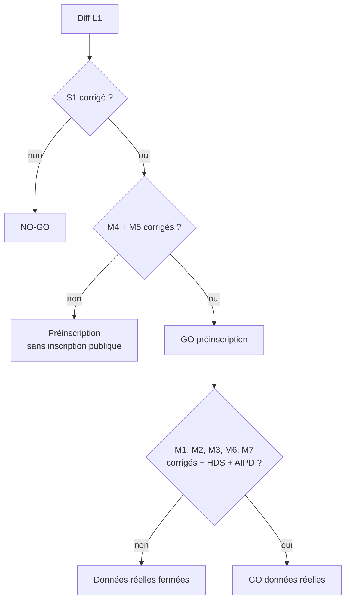

# Revue L1 (mode lancement) : sécurité et RGPD

> **Rôle :** RSSI et DPO.
> **Objet :** diff `6d4414f..HEAD` (lots L1-A, L1-B, L1-C) : inscription ouverte, e-mails, jetons de vérification et de réinitialisation, préinscription (`realDataAllowed()`), carte domicile à QR signé EdDSA, check-in L10, adresse chiffrée AES-GCM, trajet en direct, cartes MapLibre / OpenFreeMap et CSP, géocodage API Adresse, app mobile (accord trajet, stockage local, position).
> **Références :** `docs/revues/L1-arbitrage-lancement.md` (§ 1, § 5), `docs/revues/L1-juridique.md`, `docs/tech/L1-A-notes.md`, `L1-B-notes.md`, `L1-C-notes.md`, `docs/tech/api-v1.md`, `docs/deploiement-vercel.md`.
> **Date :** 2026-10-08.
> **Méthode :** lecture du code ; tests réels sur une base PostgreSQL dédiée (`koudmen_rev_secu`, migrations appliquées) avec un fichier de test **temporaire** (supprimé après l'exécution) ; appel direct des fonctions pures de `config-check.ts`. Aucun fichier de code modifié.

---

## 0. Verdict

| Étape | Verdict | Condition |
|---|---|---|
| **Mise en ligne en préinscription** (Vercel, `DONNEES_REELLES_AUTORISEES` vide) | **NO-GO tant que S1 reste ouvert** | Corriger S1 (BLOQUANT). Corriger aussi M4 et M5 avant d'ouvrir l'inscription au public |
| **Données réelles des aînés** (`DONNEES_REELLES_AUTORISEES=true`, hébergeur HDS) | **NO-GO** | Corriger M1, M2, M3, M6, M7 en plus. M1 devient BLOQUANT sur un hébergeur autre que Vercel (Clever Cloud HDS) |

Ce qui tient bien :

- les jetons d'e-mail (256 bits, empreinte SHA-256, usage unique atomique, 24 h / 1 h) ;
- aucune fuite d'existence de compte dans les réponses de `/inscription` et de `/mot-de-passe-oublie` ;
- les contrôles d'accès du trajet, de la carte domicile et de la décision « À vérifier » (pas d'IDOR trouvé) ;
- aucune coordonnée brute dans les preuves ni dans le journal d'audit.

Les failles sont ailleurs :

- **un seul réglage** (`KOUDMEN_MODE=essai`) annule R1 et R5 en production ;
- **des clés publiques de développement** servent hors de la production Vercel ;
- **la preuve de présence** repose sur deux facteurs que l'accompagnant contrôle seul ;
- **la position exacte du domicile** reste en clair, à côté de l'adresse chiffrée.

---

## 1. Constats

### 1.1 BLOQUANT

| # | Vulnérabilité | Fichier:ligne | Exploitation | Correction |
|---|---|---|---|---|
| **S1** | **Le mode préinscription se contourne par un réglage.** `KOUDMEN_MODE=essai` est accepté en production stricte. En mode essai, `realDataAllowedFrom()` renvoie toujours `true`, sans HDS, sans AIPD, sans DPO. Le contrôle de configuration émet seulement un avertissement | `plateforme/src/server/config-check.ts:31-35`, `:69`, `:103`, `:185` | Testé : `VERCEL_ENV=production` + `KOUDMEN_MODE=essai` → `productionConfigProblems()` = `[]`, `realDataAllowedFrom()` = `true`. Effets en production : fiche aîné réelle avec accord **déclaré par la famille** (`famille/actions.ts:94`, R5 contourné), adresse, QR, Kayé, trajet, comptes démo, bac à sable, position simulée acceptée (`accompagnant/service.ts:66` : `isTestMode()` vrai hors lancement). L'inscription reste ouverte : de vrais utilisateurs arrivent sur un site en mode essai. `docs/deploiement-vercel.md:57` présente `essai` comme une option normale | 1. Dans `productionConfigProblems()` : refuser `KOUDMEN_MODE=essai` quand `isStrictProduction()` est vrai (ou exiger une variable explicite `ESSAI_EN_PRODUCTION_ACCEPTE=<date>`, et alors fermer l'inscription réelle). 2. `realDataAllowedFrom()` : en mode essai, permettre seulement les aînés de bac à sable (`sandboxId != null`), jamais le monde réel. 3. Corriger la ligne 57 du guide de déploiement |

### 1.2 MAJEUR

| # | Vulnérabilité | Fichier:ligne | Exploitation | Correction |
|---|---|---|---|---|
| **M1** | **Clés publiques de développement hors de la production Vercel.** La « production stricte » est seulement `VERCEL_ENV=production` ou `KOUDMEN_STRICT_CONFIG=true`. Ailleurs, `QR_SIGNING_KEY` et `ADDRESS_ENC_KEY` absentes prennent la clé de développement écrite dans le dépôt public, sans erreur. Aucun contrôle de configuration ne tourne. Une clé faible (32 octets nuls) est aussi acceptée en production | `plateforme/src/server/presence/config.ts:24-26`, `:91-105`, `:79`, `:86` ; `config-check.ts:18-20` | Testé : `VERCEL_ENV=preview`, `NODE_ENV=production` → aucune erreur, clé QR = graine de développement. Cas réels : déploiement Preview (l'intégration Neon crée une branche **copie** de la base), `next start` sur Clever Cloud HDS (cible de J1 ; `TRUST_PROXY=clevercloud` existe déjà). Toute adresse écrite là est chiffrée avec une clé publique : une copie de la base suffit pour lire les adresses | 1. Prendre la clé de développement seulement si `NODE_ENV !== "production"` ET mode essai. Sinon : erreur. 2. Rendre la production stricte par défaut quand `NODE_ENV=production` (opt-out explicite pour la CI). 3. Refuser une clé à faible entropie (même test que `secretProblem`, `config-check.ts:147`). 4. Ajouter les deux clés au guide de déploiement (absentes aujourd'hui) |
| **M2** | **Position exacte du domicile en clair.** L'adresse est chiffrée, mais la latitude et la longitude géocodées (point « numéro de rue ») restent en clair dans `Aine`. Un géocodage inverse redonne l'adresse | `plateforme/prisma/schema.prisma:304-305` ; `plateforme/src/server/presence/address.ts:38` | Fuite de la base, d'une branche Neon, d'un `pg_dump` hebdomadaire (`deploiement-vercel.md:90`) ou d'une restauration → adresse des aînés retrouvée en une requête. Le chiffrement R7 / J18 ne protège donc rien. J18 demandait le chiffrement de la latitude et de la longitude | 1. Chiffrer `latitude`/`longitude` exactes avec l'adresse (même enveloppe `a1`, ou colonne `homeEnc`). 2. Garder en clair seulement le centre de la commune (ou un arrondi à 2 décimales) pour les calculs non sensibles. 3. Déchiffrer au check-in et au trajet seulement |
| **M3** | **Preuve de présence falsifiable par l'accompagnant seul (rejeu du QR).** Le jeton de la carte n'a pas de date et il est déterministe (même carte, même version → même texte). La position et l'indicateur `simulee` viennent du client. QR + position = 2 facteurs = visite `VALIDEE`, sans la famille ni l'aîné | `plateforme/src/server/presence/qr-token.ts:7`, `:51` ; `plateforme/src/server/visits/app-service.ts:328` ; `plateforme/src/server/visits/proof.ts:111` ; `plateforme/src/contracts/v1/visits.ts:191` | Testé : l'accompagnant photographie le QR à la 1re visite. Pour une visite suivante, il envoie à l'API ce QR + une position fabriquée à 10 m du domicile (il connaît l'adresse), `simulee: false` → `controle.statut = VALIDE`, visite `VALIDEE`, score 2. Fraude possible : visites facturées et attestées (crédit d'impôt) sans présence, aîné seul. Le code de 6 caractères a la même faiblesse (déjà présente avant L1) | 1. Ne pas compter QR + position comme deux facteurs indépendants : les deux viennent du même appareil. Exiger le 3e facteur (confirmation de l'aîné ou de la famille) pour `VALIDEE`, ou ne garder que « À vérifier » sans lui. 2. Option forte : défi par visite (code affiché sur un appareil du domicile, ou appel « tapez 1 »). 3. Détecter le rejeu : même QR présenté sans scan réel (pas de preuve caméra), heures impossibles, accompagnant loin au dernier trajet. 4. Documenter dans l'AIPD que `simulee` est une déclaration du client |
| **M4** | **Le compte OPÉRATEUR se réinitialise par e-mail via l'inscription.** `requestPasswordReset()` refuse l'opérateur. Mais `registerAccount()`, pour un e-mail déjà connu, crée un jeton `MOT_DE_PASSE` et envoie le lien **sans vérifier le rôle**. `resetPassword()` ne vérifie pas le rôle non plus | `plateforme/src/server/auth/registration.ts:96-98` (comparer avec `:164`) ; `:185` | Un attaquant inscrit l'e-mail d'un opérateur → l'opérateur reçoit un lien « nouveau mot de passe » valable 1 h. Si la boîte de l'opérateur est compromise (ou si l'opérateur clique par erreur dans un e-mail piégé qui suit), l'attaquant prend le back-office : téléphones des aînés et des familles, adresses, accords, SOS. C'est le contraire de la règle « pas de lien pour un opérateur (TOTP prévu) » | 1. Dans `registerAccount()`, branche « compte existant » : si `role === "OPERATEUR"`, ne rien émettre (même réponse). 2. Dans `resetPassword()` : refuser un jeton dont l'utilisateur est opérateur. 3. Test unitaire des deux chemins |
| **M5** | **L'inscription sert de relais d'e-mails avec texte libre.** Le prénom (80 caractères, aucun filtre de caractères) est copié dans l'e-mail de vérification envoyé à **n'importe quelle adresse**. Limite : 5 par heure et par IP, aucune limite par adresse visée. Chaque essai sur un e-mail connu annule aussi le lien « mot de passe » en cours de la victime | `plateforme/src/server/mail/templates.ts:30` ; `plateforme/src/server/auth/validation.ts:22` ; `plateforme/src/contracts/v1/inscription.ts:34` ; `plateforme/src/server/auth/account-tokens.ts` (`issueAccountToken`, annulation) ; `plateforme/src/app/api/v1/auth/inscription/route.ts:18` | Prénom = « Votre accès est bloqué, appelez le 0696 xx xx xx » ou une URL. L'e-mail part du domaine Koudmen (SPF et DKIM valides) vers des familles d'aînés : hameçonnage crédible. Avec des IP tournantes : bombardement, plaintes, suspension du compte Brevo (plus aucun e-mail de compte) | 1. Prénom et nom : lettres, espaces, tirets, apostrophes seulement (pas de chiffres, de `/`, de `:` ni de `@`), 40 caractères. 2. Ne pas mettre le prénom saisi dans l'e-mail de vérification (« Bonjour, »). 3. Limite par adresse visée (ex. 3 par 24 h) en plus de l'IP, et défi anti-robot après 2 essais. 4. Branche « compte existant » : ne pas annuler un lien « mot de passe » encore valable ; réutiliser l'envoi au plus une fois par heure |
| **M6** | **La durée de conservation de la position est fausse dans la politique publiée.** Un trajet expiré garde sa dernière position jusqu'à la purge de la nuit (04 h 17 UTC), ou jusqu'à une lecture de la famille. La politique dit « 3 heures au plus ; sauvegardes 7 jours au plus ». Le point de départ (près du domicile de l'accompagnant) est gardé aussi | `plateforme/src/server/presence/trajet.ts:280-282`, `:150` ; `plateforme/vercel.json` (une purge par jour) ; `plateforme/src/app/(public)/confidentialite/page.tsx:25` ; `docs/deploiement-vercel.md:86-90` | Testé : trajet expiré depuis 5 h → ligne et coordonnées encore en base. Durée réelle : jusqu'à ~25 h en base. Neon garde l'historique jusqu'à 7 à 30 jours selon l'offre, et le `pg_dump` hebdomadaire n'a pas de durée. J10 (MAJEUR juridique) reste ouvert | 1. Effacer les trajets expirés à chaque écriture de position et à chaque démarrage (`deleteMany` global, peu coûteux), et ajouter une purge horaire (cron toutes les heures, ou requête planifiée côté base). 2. Écrire la fenêtre réelle des sauvegardes (offre Neon choisie) dans la politique. 3. Exclure `VisitTrip` du `pg_dump` hebdomadaire (`--exclude-table-data`) |
| **M7** | **Données d'un aîné qui refuse, retire son accord ou n'est jamais appelé : gardées sans fin.** Après `ACCORD_REFUSE` ou `ACCORD_RETIRE`, la fiche (prénom, téléphone, adresse chiffrée, coordonnées) reste. Une fiche `EN_ATTENTE_ACCORD` n'a pas de délai. Un compte jamais vérifié qui a créé une fiche n'est jamais purgé | `plateforme/src/server/operateur/accord.ts:63-79` ; `plateforme/src/server/launch-retention.ts:31` | Une famille saisit le téléphone d'un tiers. L'aîné refuse au téléphone. Koudmen garde quand même ses données, sans base légale (art. 5.1.e, 17, 21 RGPD). Personne vulnérable : risque de démarchage en cas de fuite | 1. Refus ou retrait : effacer adresse, coordonnées exactes et téléphone tout de suite ; garder seulement la preuve de la réponse (date, conseiller, résultat), puis effacer la fiche après une durée fixée par le DPO. 2. `EN_ATTENTE_ACCORD` sans appel réussi après 30 jours : effacement. 3. Purge des comptes non vérifiés : inclure les fiches en attente qu'ils ont créées |

### 1.3 MINEUR

| # | Vulnérabilité | Fichier:ligne | Exploitation | Correction |
|---|---|---|---|---|
| m1 | `/api/sante` est public et donne trop de détails : mode, état des données réelles, nombre de comptes démo, liste des problèmes de configuration, absence de Brevo (« l'opérateur valide les e-mails à la main ») | `plateforme/src/app/api/sante/route.ts:24-38` | Repérage : un attaquant sait que les e-mails ne sont pas vérifiés et que des comptes démo existent | Réponse publique : `ok` seulement. Détails derrière `CRON_SECRET` ou session opérateur |
| m2 | Jetons d'e-mail dans la chaîne de requête (`?jeton=`) | `plateforme/src/server/auth/registration.ts:72`, `:76` | L'URL complète arrive dans les journaux Vercel (et l'historique du navigateur). Jeton 1 h / 24 h, usage unique : risque faible | Mettre le jeton dans le fragment (`#jeton=`) lu par le formulaire, ou filtrer le paramètre des journaux. Ajouter `Referrer-Policy: no-referrer` sur ces deux pages, comme pour les autres pages à jeton (`next.config.ts`) |
| m3 | L'accord de l'accompagnant pour le trajet existe seulement sur son téléphone. Le serveur ne garde aucune preuve (art. 7.1 RGPD) | `mobile/src/trajet/accord.ts:46-50` ; `plateforme/src/server/presence/trajet.ts:77` | En cas de litige (CNIL, prud'hommes), Koudmen ne prouve pas l'accord | `DEMARRER` porte la version de l'écran d'information ; le serveur journalise « accord v1 vu le … » (sans position) |
| m4 | La « personne désignée » est choisie par le payeur, pas par l'aîné (R4, J11). Pas de contrôle `sameScope`, pas d'information de l'accompagnant | `plateforme/src/server/presence/actions.ts:19-27` | Le payeur ouvre la vue du trajet à un autre membre sans l'avis de l'aîné | Enregistrer ce choix par le conseiller (appel R5), ou le soumettre à l'aîné. Journaliser qui voit le trajet et l'afficher à l'accompagnant |
| m5 | Départ masqué à rayon fixe (500 m) | `plateforme/src/server/presence/trajet-rules.ts:12` | La première position visible se trouve sur un cercle de 500 m autour du domicile de l'accompagnant. Sur plusieurs visites, la famille peut trianguler son domicile | Rayon aléatoire par trajet (500 à 1 500 m), ou masquer tant que l'accompagnant est à plus de N km du domicile de l'aîné |
| m6 | Tuiles OpenFreeMap chargées par le navigateur de la famille et de l'opérateur | `plateforme/src/components/presence/trip-map.tsx:14` ; `plateforme/next.config.ts` (`connect-src`) | Le service tiers reçoit l'IP et les tuiles autour du domicile et de la position de l'accompagnant. Pas de contrat ni de DPA | Servir les tuiles par un proxy Koudmen (ou un hébergement propre) ; citer le destinataire dans le registre. [À VÉRIFIER] conditions d'usage OpenFreeMap |
| m7 | Gestion des clés : pas d'identifiant de clé (`kid`, préfixe `a1` unique), pas de procédure de rotation. AAD fixe : un texte chiffré se copie d'un aîné à un autre. Aucune consigne pour sauvegarder `ADDRESS_ENC_KEY` hors de Vercel | `plateforme/src/server/presence/address-crypto.ts:9-10` ; `plateforme/src/server/presence/qr-token.ts:51` | Changer `QR_SIGNING_KEY` casse toutes les cartes imprimées. Perdre `ADDRESS_ENC_KEY` rend toutes les adresses illisibles | AAD = `koudmen:adresse:v1:<aineId>`. Préfixe avec numéro de clé (`a2:`) et liste de clés de lecture. `kid` dans l'en-tête JWS et deux clés publiques acceptées pendant la rotation. Procédure écrite (coffre hors ligne) |
| m8 | Reprise L1 : tous les aînés existants passent `ACCORD_RECUEILLI` ; tous les comptes existants passent « e-mail confirmé » | `plateforme/prisma/migrations/20261007190000_l1a_comptes_lancement/migration.sql:101`, `:104` | Sur une base qui contient de vrais aînés (pilote), R5 est contourné | Partir d'une base vide (recommandé par le guide). Sinon, repasser les aînés du monde réel à `EN_ATTENTE_ACCORD` avant l'ouverture. [À VÉRIFIER] état de la base de production |
| m9 | Lecture de l'adresse par l'accompagnant : pas de contrôle de la validation du profil (suspendu) ni du statut de la visite (annulée). Fenêtre = jour civil, pas celle de J16 (J−1 20 h à fin + 2 h) | `plateforme/src/server/presence/address.ts:68-72` | Un accompagnant suspendu le matin lit encore l'adresse le jour d'une visite annulée | Ajouter `caregiver.validation === "VALIDE"` et `status` non annulé ; appliquer la fenêtre J16 |
| m10 | Carte domicile (QR + code de secours) lisible par tout le cercle Lakou | `plateforme/src/server/presence/home-card.ts:53-57` | Un membre (cousin, voisine) peut transmettre le QR à un accompagnant : aggrave M3 | Lecture réservée au payeur, au gestionnaire du profil et à l'opérateur |
| m11 | Oracle d'arrivée : une position à moins de 150 m du domicile renvoie `ARRIVEE`. Le domicile arrondi est aussi renvoyé dès 2 h avant la visite | `plateforme/src/server/presence/trajet.ts:92-96`, `:158-160` | Testé : position fabriquée à 120 m → `ARRIVEE`. L'accompagnant localise le domicile à 150 m près sans lire l'adresse (lecture journalisée). Faible, car il reçoit l'adresse le jour même | Ne pas distinguer `ARRIVEE` dans la réponse de l'API (toujours 204) ; garder l'arrêt côté serveur |
| m12 | Un e-mail non vérifié n'empêche aucune action (fiche aîné, invitation, demande de rappel) | `plateforme/src/server/famille/actions.ts:49` (aucun contrôle de `emailVerifiedAt`) | Compte au nom d'un tiers (J31), fiche créée, compte jamais purgé (voir M7) | Exiger un e-mail vérifié avant de créer une fiche ou d'inviter |

---

## 2. Points vérifiés et conformes

| Sujet | Résultat |
|---|---|
| Énumération de comptes (`/inscription`, `/mot-de-passe-oublie`, web et API) | Même réponse, même calcul bcrypt, même nombre d'e-mails. Pas de fuite trouvée |
| Jetons d'e-mail | 256 bits, empreinte SHA-256 en base, comparaison à temps constant, usage unique par mise à jour conditionnelle, purge nocturne. Vérification par bouton (un robot de messagerie ne consomme pas le lien) |
| Réinitialisation | `sessionVersion + 1`, jetons de l'app révoqués, autres liens annulés, e-mail « mot de passe changé » |
| Limites de débit | Inscription 5/h/IP, « oublié » 3/h/e-mail et 20/h/IP, jetons 30/h/IP, position 1 / 30 s (décision atomique en base) |
| IDOR trajet | Accompagnant : `caregiver.userId` obligatoire. Famille : payeur ou personne désignée membre du cercle, sinon 404. Opérateur : SOS actif seulement, accès journalisé |
| IDOR carte domicile, décision « À vérifier », accord, comptes | `sameScope` + membre du cercle / payeur / rôle opérateur. Rien trouvé |
| QR | EdDSA, algorithme imposé, taille bornée, charge sans `aineId`, carte régénérée → ancienne refusée (testé par la suite L1-B) |
| Coordonnées dans les journaux et les preuves | Aucune (preuve GPS : distance arrondie seulement ; test de la suite L1-B) |
| Cache | Route famille du trajet en `no-store` |
| En-têtes, CSP | CSP sans tiers sauf `tiles.openfreemap.org` (`connect-src`) et `worker-src blob:` ; `frame-ancestors 'none'` ; HSTS ; `Permissions-Policy` |
| XSS | Aucun `innerHTML` avec une donnée utilisateur (marqueurs de carte : SVG fixe, `title` en texte) ; e-mails HTML échappés |
| Comptes démo et bac à sable | Refusés en lancement (web, API, sessions déjà ouvertes) ; seed refusé ; `/api/sante` les compte |
| App mobile | Jeton, file hors ligne et accord trajet dans `expo-secure-store` (`AFTER_FIRST_UNLOCK_THIS_DEVICE_ONLY`) ; partage arrêté en arrière-plan ; aucune file de positions |
| Géocodage | Appel serveur vers une URL fixe (pas de SSRF), adresse seule, aucune adresse dans les journaux |
| Brevo | Clé côté serveur, pas de suivi des clics ni des ouvertures, adresse masquée dans les journaux |

---

## 3. Tests exécutés

| Test | Résultat |
|---|---|
| `productionConfigProblems()` avec `VERCEL_ENV=production`, `KOUDMEN_MODE=essai` | `[]` et `realDataAllowedFrom()` = `true` → **S1** |
| Même appel avec `VERCEL_ENV=preview` | `[]` ; clé QR = graine de développement → **M1** |
| Clés QR et adresse de 32 octets nuls en production | Acceptées → **M1** |
| Check-in : QR d'une visite précédente + position fabriquée, `simulee: false` | `VALIDE`, visite `VALIDEE` → **M3** |
| Trajet : position à 120 m du domicile | `ARRIVEE` → **m11** |
| Trajet expiré depuis 5 h | Coordonnées encore en base → **M6** |
| `pnpm vitest run` (unitaires) | 513 réussis. Un échec hors sujet : `accord.db.test.ts` lancé sur la base locale `koudmen` non migrée |

---

## 4. Ordre de correction proposé

1. **S1** (une ligne dans `productionConfigProblems()` + garde dans `realDataAllowedFrom()`).
2. **M4** et **M5** (avant l'ouverture publique de l'inscription).
3. **M1** (avant tout hébergement hors de Vercel production, donc avant l'hébergeur HDS).
4. **M2**, **M3**, **M6**, **M7** (avant `DONNEES_REELLES_AUTORISEES=true`), avec mise à jour de l'AIPD.
5. MINEURS dans le sprint suivant.
