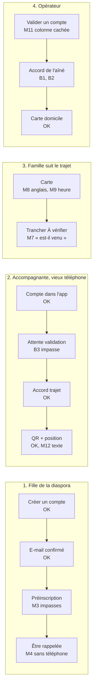
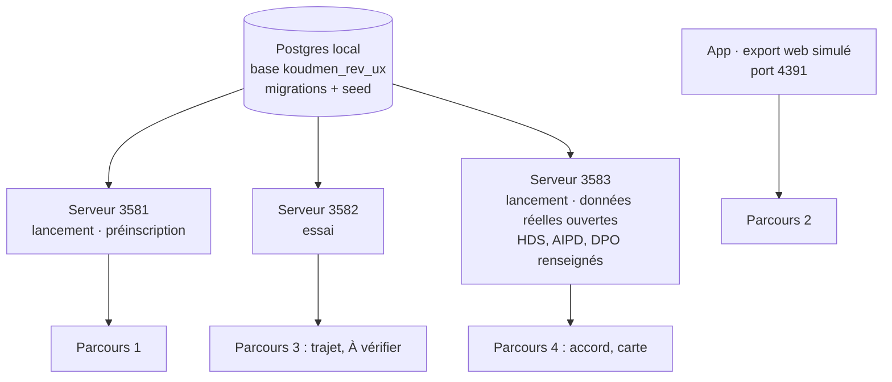
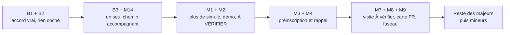

# Revue UX et accessibilité L1 — Passage en mode lancement

> **Rôle :** expert accessibilité et UX (publics seniors, faible littératie numérique).
> **Objet :** le lot L1 « dans des conditions normales de lancement » : comptes, préinscription, accord de l'aîné, trajet partagé, QR signé, carte domicile.
> **Références :** [`L1-arbitrage-lancement.md`](L1-arbitrage-lancement.md), [`direction-artistique.md`](../design/direction-artistique.md), [`L1-A-notes.md`](../tech/L1-A-notes.md), [`L1-B-notes.md`](../tech/L1-B-notes.md), [`L1-C-notes.md`](../tech/L1-C-notes.md).
> **Date :** 8 octobre 2026. **Pas de code modifié.**

---

## 0. Verdict

**NO-GO pour ouvrir le service réel (données réelles). GO pour la préinscription, après les majeurs M1 à M4.**

La base est bonne. Le design reste premium et calme, en clair et en sombre. Les formulaires guident bien. L'écran d'accord du trajet, dans l'app, est exemplaire. Mais **3 points bloquent** le service réel :

1. La fiche d'un aîné **sans accord** affiche « Accord de l'aîné : donné ». C'est faux.
2. Le formulaire de l'opérateur coche **« Oui, d'accord » par défaut**. Un clic de trop enregistre un accord.
3. Un accompagnant inscrit **dans l'app** reste « Profil incomplet » pour toujours. L'app lui dit « Nous vous appelons ». L'opérateur ne le voit pas dans sa file.

En préinscription, ces 3 points ne se voient pas encore (pas de fiche aîné, pas de visite). Mais il reste des **textes « simulé », « démo », « testeurs »** et des **[À VÉRIFIER]** visibles par le public.

| Gravité | Nombre | Sens |
|---|---|---|
| BLOQUANT | **3** | Faux, dangereux ou impasse dans un parcours clé. |
| MAJEUR | **14** | La personne hésite, se trompe, ou perd confiance. |
| MINEUR | **16** | Gêne, finition, conformité partielle. |

### Ce qui marche bien

- **Inscription web** : erreurs groupées en haut (« Corrigez les 5 champs signalés »), focus sur le résumé, message près de chaque champ, valeurs gardées. Mot de passe courant refusé avec une phrase claire.
- **E-mail** : page « Vérifiez votre boîte mail » simple ; lien consommé par un bouton ; retour « Votre adresse e-mail est confirmée. Connectez-vous. » ; mot de passe oublié sans fuite (« Si un compte existe… »).
- **App, écran d'accord du trajet** : 6 blocs courts (quoi, qui, quand, arrêt, historique, choix), « Refuser n'a aucun effet sur vos missions », « Non merci, je viens sans partager ». Modèle à garder (`ux-09`).
- **App, résultat du check-in** : « Arrivée validée. Carte domicile reconnue et position à moins de 150 m. » ; refus de carte révoquée clair, code de secours ensuite (`ux-10`).
- **Carte domicile imprimable** : propre, code épelé « V R A W X F », 4 consignes numérotées, version et date (`ux-11`).
- **Trajet côté famille** : phrase en tête « Josiane est en route. Arrivée dans 8 min environ. », puis une liste texte (heure, distance, précision). Lisible même sans carte.
- **Sombre** : propre sur le web et l'app (bandeau trajet : texte foncé sur menthe, contraste correct).
- **Clavier** : lien d'évitement en premier, contour 3 px + halo sur chaque élément (web et app).
- **Mobile** : aucun défilement horizontal à 360 et 390 px (34 écrans mesurés).
- **Réseau lent** (400 kb/s, 400 ms, processeur ÷ 4) : texte du site visible en ~2 s (rendu serveur), page complète en ~8 s ; page trajet : résumé texte visible en 2 s.
- **Démo fermée** en lancement : `/tester` → `/inscription`, aucun bouton démo, compte démo refusé.

---

## 1. Méthode

| Élément | Détail |
|---|---|
| Build | `next build` de `plateforme/` (copie de travail, HEAD `6234f16`), `NEXT_PUBLIC_TEST_MODE=false` |
| Serveurs | 3 `next start` (voir schéma). E-mails capturés (`MAIL_CAPTURE_FILE`), géocodage simulé, pas de clé Brevo |
| App | `EXPO_PUBLIC_API_MODE=simule expo export -p web`, servi par `scripts/proxy-dev.mjs` |
| Navigateur | Playwright, Chromium `/opt/pw-browsers`, 390 × 844 (et 360 px, 1280 px), clair et sombre, `fr-FR` |
| Audit | axe-core 4.10 (WCAG 2.0/2.1/2.2 A et AA) sur chaque écran ; script maison : cibles < 44 px, textes < 16 px, débordement horizontal, ordre du clavier |
| Trajet réel | API v1 avec le jeton de Josiane (essai) : `DEMARRER`, 2 positions, `CHECK_IN` à 2,5 km → `A_VERIFIER` |
| Préparation | Une visite de Léonie déplacée à aujourd'hui (SQL) ; domicile de Léonie marqué « précis » |
| Limites | Tuiles OpenFreeMap bloquées par le bac de travail (carte grise) ; l'app n'a pas parlé au vrai serveur (mode simulé, comme demandé) |

Comptes créés pendant la revue : Nadia et Line (familles, préinscription), Mireille (accompagnante web), Ginette (accompagnante par l'API de l'app), Céline + aînées Odette et Rosette (service ouvert).

---

## 2. BLOQUANTS

| # | Écran | Problème | Correction |
|---|---|---|---|
| **B1** | Famille · fiche de l'aîné en attente d'accord (3583) | Le bandeau dit « En attente de l'accord de l'aîné ». Plus bas, la carte « **Accord de l'aîné : Donné par (l'aîné lui-même). Enregistré le 8 octobre 2026.** » Le nom est vide. L'accord n'existe pas. La famille croit l'accord donné ; un auditeur lit une fausse preuve (`ux-03`). | Lire `accordEtat`. `EN_ATTENTE_ACCORD` : « Pas encore d'accord. Un conseiller appelle {prénom}. » `ACCORD_REFUSE` / `ACCORD_RETIRE` : le dire. `ACCORD_RECUEILLI` : « Accord donné par {nom}, au téléphone, le {date}. » Jamais de nom vide. |
| **B2** | Opérateur · Accord des aînés · « Enregistrer la réponse après l'appel » | « **Oui, d'accord** » est coché par défaut. « L'aîné lui-même » et « Aucune mesure » aussi. Un conseiller pressé enregistre un accord d'une personne âgée sans le vouloir (`ux-05`). | Aucune réponse cochée. Ajouter « Il veut en parler à quelqu'un : rappeler » (la notice l'annonce, le formulaire ne l'a pas). Exiger le choix « Qui a répondu » et la mesure de protection. Écran de confirmation : « Vous enregistrez : Odette dit OUI. » |
| **B3** | App · « Profil en cours de validation » ; Opérateur · Accompagnants | Un compte créé dans l'app reste `BROUILLON` (« Profil incomplet »). L'orientation, le profil et « demander la vérification » existent **seulement sur le site**. L'app ne le dit pas. Elle annonce « Échange avec l'équipe Koudmen : nous vous appelons » (`ux-08`). Le tableau de bord de l'opérateur montre seulement `EN_ATTENTE`. L'accompagnante attend sans fin. Le site dit l'inverse : « Complétez votre profil, puis demandez la vérification. » | Choisir un seul chemin. Option simple : l'app montre l'étape « Complétez votre profil sur le site » avec un bouton (lien vers `/accompagnant/orientation`). Et l'opérateur voit aussi les comptes « profil incomplet » de plus de 48 h dans une file « À relancer ». |

---

## 3. MAJEURS

| # | Écran | Problème | Correction |
|---|---|---|---|
| **M1** | Plusieurs écrans **en lancement** | Restes de test visibles : famille, demandes : « Cette personne reçoit un message (**simulé**) » ; opérateur : « L'accompagnant reçoit un message (**simulé**) », « Messages **simulés** (24 h) », « Retours **testeurs** non lus », « Réponses non disponibles (**profil de démonstration**…) », « Aucune pièce n'est stockée **dans cette version** » ; formulaires : « **Données d'exemple seulement** » (indication du domicile, SIRET) ; bouton « Donner mon avis » : « N'écrivez pas de donnée personnelle **réelle** ». | Textes selon `isLaunchMode()`. Lancement : « Koudmen prévient cette personne », « Messages (24 h) », « Avis reçus », supprimer les mentions d'exemple. Fichiers : `famille/demandes/page.tsx:84`, `operateur/demandes/[requestId]/page.tsx:169`, `server/operateur/actions.ts:132`, `operateur/page.tsx:68-75`, `components/famille/aine-form.tsx:108`, `components/accompagnant/profile-form.tsx:204`. |
| **M2** | `/confidentialite`, `/mentions-legales` (public) | « **[À VÉRIFIER]** » et « **[À VÉRIFIER AVEC UN AVOCAT]** » s'affichent 6 fois au public. Cela casse la confiance d'une famille qui lit avant de s'inscrire. | Garder ces marques dans le dépôt, pas à l'écran. Valider les textes avec l'avocat avant l'ouverture. |
| **M3** | Famille · préinscription (Kayé, Visites, Demandes, Formule) | La barre du bas propose Kayé, Visites, Demandes. Chaque page vide dit « **Ajouter un aîné** ». Ce bouton ouvre… le message « Koudmen ouvre bientôt ». Boucle sans fin (`ux-02`). La formule Libre dit « Elle s'active seule avec le profil de l'aîné » : impossible en préinscription. | En préinscription : barre réduite à Accueil et Formule, ou pages vides avec « Ces pages s'ouvrent au lancement. » Pas de bouton « Ajouter un aîné ». Libre : « Gratuite. Elle s'ouvre au lancement. » |
| **M4** | Famille · Formule · « Être appelé pour … » | Le téléphone est **facultatif** à l'inscription famille. Line (sans téléphone) demande un rappel : « Un conseiller vous appelle. » L'opérateur voit « pas de téléphone ». Pas de choix d'heure ni de fuseau (Paris : +6 h l'été, +5 h l'hiver). Pour être rappelée, il faut choisir une formule **payante**. L'accueil ne change pas après la demande (« Choisissez une formule »). | Au clic, demander ou confirmer le numéro et un créneau « heure de Paris / heure de Martinique ». Ajouter un bouton neutre « Être rappelée pour poser une question » (sans formule). Accueil : « Demande envoyée le … Un conseiller vous appelle. » |
| **M5** | Famille · fiche d'un aîné en attente d'accord | Les liens « Demander un accompagnement » et « Carte domicile » restent actifs. Le formulaire de demande (4 étapes) se remplit en entier, puis refuse à l'envoi : « Un conseiller doit d'abord appeler l'aîné… ». | Avant l'accord : liens grisés avec la raison, ou page courte « Disponible après l'accord de {prénom} ». Ne jamais laisser remplir un formulaire refusé d'avance. |
| **M6** | Famille · « Modifier le profil » (ajout de l'adresse) | La création (lancement) demande prénom, commune, téléphone. Pour ajouter l'adresse ensuite, le formulaire exige « Choisissez au moins un besoin ». La famille veut seulement l'adresse ; l'erreur la surprend. L'accueil dit aussi « Prénom, commune, besoins et son accord. 2 minutes. » | Rendre les besoins facultatifs à la modification, ou une carte séparée « Adresse du domicile » avec son propre bouton. Aligner le texte de l'accueil sur le formulaire minimal. |
| **M7** | Famille · Visites · « À vérifier » | « Une preuve manque. Vous êtes l'employeur : **Josiane est-il venu** chez Léonie ? » Faute d'accord sur une question clé ; et « une preuve manque » avec 0 preuve sur 3 (`ux-07`). Le choix part en un geste, sans confirmation. Après « Non, je signale un problème », un rechargement remontre la question : aucune trace. | « Josiane est-elle venue chez Léonie ? » (ou forme neutre : « La visite de Josiane a-t-elle eu lieu ? »). Nombre exact : « 2 preuves manquent ». Confirmation courte ou « Annuler » pendant 10 s. Après le choix : « Signalé le … L'équipe vous appelle. » |
| **M8** | Famille · « Où en est la visite ? » (carte) | Textes de MapLibre **en anglais** : « Use two fingers to move the map », « Zoom in », « Zoom out », « Map marker ». Boutons + / − de 29 px. axe : `aria-hidden-focus`. Si les tuiles ne chargent pas (3G, OpenFreeMap sans garantie), le cadre reste gris, sans message, et le point de l'accompagnante n'apparaît pas (ajouté seulement après `load`) (`ux-06`). | Passer `locale` à MapLibre (textes français). Boutons ≥ 44 px. Retirer le focus des éléments cachés. Si `load` n'arrive pas en 8 s : masquer la carte et garder la liste texte, « Carte indisponible. Les informations sont ci-dessous. » Ajouter le marqueur sans attendre les tuiles. |
| **M9** | Famille (diaspora) · trajet, accueil, visites | Les heures sont en heure de Martinique, **sans le dire** : la fille à Paris lit « Visite prévue à 01:39 », « Position mise à jour à 01:16 » alors qu'il est 07:16 chez elle. | Écrire le fuseau : « 9 h (heure de Martinique) ». Pour une famille dans l'Hexagone, ajouter l'heure de Paris : « 9 h en Martinique · 15 h à Paris ». |
| **M10** | Opérateur · tableau de bord | Les files du lancement manquent : accords à recueillir, demandes de rappel, e-mails à confirmer. L'opérateur voit d'abord « Retours testeurs » et « Messages simulés ». | Tuiles « Aînés à appeler (accord) », « Familles à rappeler », « E-mails à confirmer », en premier. |
| **M11** | Opérateur · Comptes, Demandes de rappel (390 px) | Tableau tronqué : la colonne **Action** (case + « Valider l'adresse ») est hors écran, sans signe de défilement (`ux-04`). Case « J'ai appelé la personne » de **13 × 16 px**. Validation manuelle proposée même sans téléphone (« pas de téléphone »). | Sous 640 px : une carte par ligne, action en bas. Case 24 px dans une zone de 44 px. Sans téléphone : « Écrire à la personne » à la place de « Valider après appel ». |
| **M12** | App · fiche visite, trajet en cours | Le bandeau dit « Trajet partagé · vers Léonie ». Plus bas : « Partager ma position, une fois. Une seule lecture, maintenant. **Koudmen ne vous suit pas.** » Contradiction pour une lectrice peu à l'aise. Deux accords de position différents sur le même écran. | Pendant un trajet : « La lecture d'arrivée remplace le partage du trajet, qui s'arrête. » Hors trajet : garder le texte actuel. |
| **M13** | Famille · toutes les pages (barre du bas) | La barre du bas recouvre le pied de page : « Conditions des accompagnants » est caché (axe `target-size`, zone de 12 px). La DA demande 120 px réservés sous le contenu. | `padding-bottom` ≥ 120 px + `env(safe-area-inset-bottom)` sur les pages avec la barre. |
| **M14** | App · « Profil en cours de validation » / Préinscription | En lancement (préinscription), l'app montre « Koudmen ouvre bientôt » ; le site montre « Profil en cours de validation : complétez votre profil ». Deux histoires pour la même personne. | Un seul message, le même sur le site et dans l'app, avec la prochaine action concrète (lié à B3). |

---

## 4. MINEURS

| # | Écran | Problème | Correction |
|---|---|---|---|
| m1 | Site · indications de champ, pied de page, barre du bas | Textes de 13 à 15 px (indices 14 px, barre 13 px, pied 15 px). DA : courant ≥ 16 px, `small` 15 px. | Indices et pied à 15–16 px ; libellés de barre à 13,5 px minimum (DA `caption`). |
| m2 | Site · Kayé, Visites, accueil | Bouton « ? » d'aide de 24 × 24 px. | Zone tactile 44 × 44 px. |
| m3 | Site · pages famille | Deux sélecteurs « Clair / Sombre » sur la même page (milieu et pied). | Un seul, dans le pied (ou Profil). |
| m4 | Site · formulaires | « Email » (libellé) et « e-mail » (textes) : un terme = un sens. Champ e-mail vide : « Adresse email invalide. » | « Adresse e-mail » partout. Vide : « Entrez votre adresse e-mail. » |
| m5 | Famille · création de l'aîné | Indice « Sans adresse exacte, Koudmen place le domicile au centre de la commune » sur un formulaire **sans** champ adresse. | Retirer l'indice à la création. |
| m6 | Famille · fiche | « Le profil **de Odette** » (puis « d'Odette » ailleurs) ; « l'aîné lui-même » pour une femme ; « Choisie avec Odette » avant tout appel. | Élision « d'Odette » ; « l'aînée elle-même » selon le cas, ou « la personne elle-même » ; « Personne désignée » après l'accord seulement. |
| m7 | Site et app · heures | Formats mélangés : « 01:39 » (trajet), « 1 h 39 » (accueil, liste). « 1 h 39 · avec Josiane » se lit comme une durée. | Un seul format : « 1 h 39 » partout, avec « à » : « à 9 h 30 ». |
| m8 | App · bouton « Scanner » | `aria-label` « Scanner le QR de la **feuille** du domicile » ; l'écran dit « carte domicile ». | « Scanner le QR de la carte domicile ». |
| m9 | App · trajet | « Vous êtes presque **arrivé** » pour Josiane. | « Vous êtes presque chez Léonie. » (neutre). |
| m10 | App · résultat du check-in | Deux encadrés disent la même chose (« Arrivée validée… à moins de 150 m » puis « Position à l'arrivée : position lue à moins de 150 m »). | Garder un seul encadré. |
| m11 | App · étapes (validation, « Vérifiez votre e-mail ») | axe critique `aria-required-children` : `ul` avec des `div` ; `scrollable-region-focusable` (accord trajet, fiche) ; `autocomplete` invalide sur la date de naissance. | `role="list"`/`listitem` cohérents ; `tabIndex` sur la zone défilante ; `autoComplete="bday"`. |
| m12 | Famille · visite du jour « À vérifier » | L'app dit à l'accompagnante « La famille employeur confirmera la visite ». La famille voit « En cours · position non obtenue », sans la raison (« trop loin du domicile ») ni bouton. | Montrer la raison simple dès le check-in ; le bouton de décision à la fin de la visite, avec l'heure prévue. |
| m13 | Opérateur · Comptes | « Aucun e-mail ne part (BREVO_API_KEY absente) » : jargon technique. | « Les e-mails ne partent pas encore. Appelez la personne. » (détail technique dans `/api/sante`). |
| m14 | Opérateur · Accord des aînés | Pas de lien vers la carte domicile depuis la fiche d'accord (lien seulement dans Visites). Notice lue seulement en français alors que « Créole » est une langue d'appel. | Lien « Carte domicile » après un accord. Ajouter la notice en créole martiniquais (validée par un locuteur) [À VÉRIFIER]. |
| m15 | Famille · Formule | Après « Être appelé pour Kozé », le bouton reste actif quelques instants (double demande possible) ; message de confirmation au milieu de la page. | Bouton désactivé pendant l'envoi ; message annoncé (`role="status"`) et rendu visible (défilement). |
| m16 | Site · accueil public | Promesse « Deux preuves sur trois : la position, le **code affiché** chez votre parent, son appel de confirmation ». L1 introduit la carte domicile avec QR et l'appel « tapez 1 » n'existe pas au lancement (Twilio hors L1). | « La carte Koudmen chez votre parent (QR) » ; retirer l'appel tant qu'il n'est pas réel. |

---

## 5. Contrôles WCAG 2.2 AA (synthèse)

| Critère | Résultat |
|---|---|
| 1.4.3 Contraste | Conforme sur les écrans stables (clair et sombre). Les alertes axe de l'accueil viennent des animations d'entrée (mesure pendant le fondu). |
| 1.4.10 Redistribution | Conforme à 360 et 390 px, sauf tableaux opérateur (M11). |
| 2.4.7 Focus visible | Conforme (contour 3 px + halo). |
| 2.5.8 Taille de cible (24 px mini AA) | Non conforme : case opérateur 13 × 16 px (M11) ; lien du pied caché par la barre (M13). Cible projet 44 px : boutons de carte 29 px (M8), « ? » 24 px (m2). |
| 3.1.2 Langue des parties | Non conforme : textes anglais de la carte (M8). |
| 3.3.1 / 3.3.3 Erreurs | Bon : résumé + message par champ, web et app. Écart : M5 (refus après le formulaire). |
| 4.1.2 Nom, rôle, valeur | App : listes mal formées (m11) ; carte : élément focusable caché (M8). |

---

## 6. Ordre conseillé

1. **Avant la préinscription publique** : M1, M2, M3, M4, M13 (textes et pages, peu de code).
2. **Avant d'ouvrir les données réelles** : B1, B2, B3, M5, M6, M7, M8, M9, M10, M11, M12, M14.
3. **Ensuite** : mineurs.

---

## 7. Captures (`docs/revues/captures-L1/`)

| Fichier | Montre |
|---|---|
| `ux-01-famille-preinscription.png` | Accueil famille en préinscription |
| `ux-02-kaye-impasse-ajouter-aine.png` | M3 : page vide avec « Ajouter un aîné » |
| `ux-03-accord-affiche-avant-appel.png` | B1 : « Donné par (l'aîné lui-même) » avant l'appel |
| `ux-04-operateur-comptes-390.png` | M11 : colonne Action hors écran |
| `ux-05-operateur-accord-oui-par-defaut.png` | B2 : « Oui, d'accord » coché par défaut |
| `ux-06-trajet-famille-sombre.png` | M8, M9 : carte sans tuiles, heure sans fuseau |
| `ux-07-visite-a-verifier.png` | M7 : « Josiane est-il venu » |
| `ux-08-app-profil-en-validation.png` | B3 : « Nous vous appelons » |
| `ux-09-app-trajet-partage.png` | Bandeau trajet, Arrêter (bon) |
| `ux-10-app-arrivee-validee.png` | Résultat du check-in QR (bon, m10) |
| `ux-11-carte-domicile-impression.png` | Carte domicile en impression (bon) |
