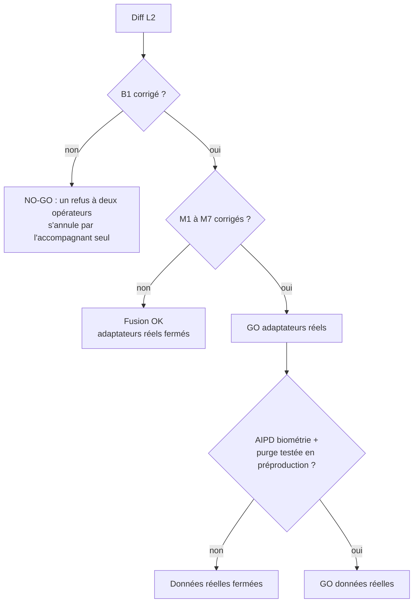

# Revue L2 (vérification de l'accompagnant) : sécurité et RGPD

> **Rôle :** RSSI et DPO.
> **Objet :** diff `ee14760..HEAD` (`plateforme/`, `mobile/`) : code SMS (Brevo) et appel vocal (Twilio), identité (Veriff, Stripe Identity, simulé), SIRET (Recherche d'entreprises, INSEE), dépôt chiffré de justificatifs, revue opérateur, webhooks signés, API v1 § 14, écrans web et app.
> **Références :** `docs/tech/L2-verification-identite.md` (étude), `docs/tech/adr/0009-verification-identite.md`, `docs/tech/L2-I-notes.md`, `docs/tech/L2-A-notes.md`, `docs/tech/api-v1.md` § 14.
> **Date :** 2026-10-08.
> **Méthode :** lecture du code ; tests réels sur une base PostgreSQL dédiée (`koudmen_rev_l2`, migrations appliquées). Les tests L2 existants passent (73 sur 73). Un fichier de test **temporaire** a joué 6 scénarios d'attaque (S1 à S6), puis il a été supprimé. Aucun fichier de code modifié.

---

## 0. Verdict

| Étape | Verdict | Condition |
|---|---|---|
| **Fusion du lot L2** (adaptateurs simulés, mode essai) | **NO-GO tant que B1 reste ouvert** | Corriger B1 (BLOQUANT) |
| **Ouverture des adaptateurs réels** (Brevo, Veriff, `base-chiffree`) en lancement | **NO-GO** | Corriger aussi M1 à M7 |
| **Données réelles des aînés** (`DONNEES_REELLES_AUTORISEES=true`) | **NO-GO** | Tout ce qui précède + AIPD à jour (biométrie, durées de conservation) |

### Ce qui tient bien

- **Code SMS :** code tiré par `randomInt`, gardé en empreinte HMAC liée au challenge, 10 minutes, 5 essais, usage unique atomique. Le code n'est jamais renvoyé ni journalisé.
- **Numéros surtaxés :** liste blanche de préfixes (Antilles, Guyane, Réunion, Mayotte, Hexagone). SMS vers mobiles seulement. Plafond quotidien de dépense.
- **Un numéro = un compte :** contrôle à l'envoi et contrainte `@unique` sur `phoneHash` à la confirmation.
- **Webhooks :** signature contrôlée sur le corps BRUT, comparaison à temps constant, horodatage de 5 minutes (Stripe, simulé), idempotence `WebhookEvent`, corps limité à 64 Ko, erreur 500 sans détail.
- **Mode simulé :** fermé en lancement à trois niveaux (adaptateur `available()`, route webhook 404, page `/verification/simulee` avec `requireTrialMode()`).
- **Art. 22 RGPD :** une machine ne met jamais `REFUSE`. Un refus du prestataire, un mineur, un doublon donnent `A_REVOIR`.
- **Fichiers :** type réel lu dans les octets, 5 Mo, EXIF retiré des JPEG et PNG, chiffrement par enveloppe (AES-256-GCM, une clé par fichier, identifiant en données associées), aucune URL publique, `no-store`, `nosniff`.
- **Contrôle d'accès :** toutes les routes API v1 passent par `verifActor` ; toutes les pages et Server Actions appellent `requireRole` ; un opérateur de bac à sable ou de démo est refusé. Pas d'IDOR trouvé (challenge, document, dossier).
- **Journaux :** aucune image, aucun numéro de pièce, aucun code dans `AuditLog` ni dans `console.error`.

---

## 1. Tableau des constats

| # | Gravité | Vulnérabilité | Fichier:ligne |
|---|---|---|---|
| B1 | **BLOQUANT** | L'accompagnant annule seul un refus confirmé par deux opérateurs (téléphone, adresse) | `src/server/verifications/service.ts:251-277`, `:345-365`, `:584-586`, `:678` |
| M1 | MAJEUR | Un seul opérateur passe outre un refus proposé par un collègue | `src/server/verifications/review.ts:248-255`, `src/server/operateur/actions.ts:74-77` |
| M2 | MAJEUR | Un webhook tardif écrase une décision humaine (complément, recours) | `src/server/verifications/service.ts:482` |
| M3 | MAJEUR | Rejeu d'une décision Veriff signée après 90 jours | `src/server/verifications/review.ts:339`, `src/server/adapters/identity/veriff.ts:146-170` |
| M4 | MAJEUR | Biométrie jamais effacée chez le prestataire dans 4 cas | `src/server/verifications/review.ts:326-337`, `service.ts:497`, `prisma/schema.prisma:618`, `src/server/launch-retention.ts:33` |
| M5 | MAJEUR | Justificatif jamais décidé : jamais effacé | `src/server/verifications/review.ts:322`, `src/server/adapters/documents/index.ts:46-59` |
| M6 | MAJEUR | Clé HMAC facultative, repli sur `SESSION_SECRET` puis sur une constante publique | `src/server/verifications/crypto.ts:18` |
| M7 | MAJEUR | Une validation obtenue en mode essai (code `000000`, page simulée) reste valable en lancement | `src/server/verifications/review.ts:262-270`, `service.ts:358-362` |
| m1 | MINEUR | Énumération et blocage d'un numéro ou d'un SIRET par un tiers | `service.ts:263-275`, `:613-614` |
| m2 | MINEUR | Plafond SMS global : un attaquant coupe le SMS pour tous | `service.ts:286-292` |
| m3 | MINEUR | PDF non nettoyé, pas d'antivirus ; JPEG mal formé gardé avec EXIF | `src/server/verifications/files.ts:229`, `:242`, `apercu/route.ts:34` |
| m4 | MINEUR | Accès opérateur : pas de « besoin d'en connaître », fiche non journalisée, GET avec effet | `review.ts:142-146`, `operateur/verifications/[itemId]/page.tsx:73-84`, `apercu/route.ts:17-24` |
| m5 | MINEUR | Journal inondable par des webhooks non signés | `service.ts:447` |
| m6 | MINEUR | App : la copie du justificatif reste dans le cache du téléphone | `mobile/src/compte/choixFichier.ts:33-38` |
| m7 | MINEUR | Clé maîtresse sans version ; adresse chiffrée avec `DOCUMENT_ENC_KEY` | `src/server/verifications/crypto.ts:127-130`, `:152-161`, `service.ts:141`, `:578-588` |
| m8 | MINEUR | Téléphone en clair (`User.phone`, `PhoneChallenge.phoneE164`) : écart avec l'étude § 7.1 | `service.ts:302`, `:350` |
| m9 | MINEUR | Stripe : pas d'empreinte de pièce, donc pas de détection de compte en double | `src/server/adapters/identity/stripe.ts:128-146` |
| m10 | MINEUR | Profil suspendu : la confirmation du code reste possible | `service.ts:329-376` |
| m11 | MINEUR | Confirmation de refus non conditionnelle (concurrence) | `review.ts:241` |
| m12 | MINEUR | Recours : « l'accompagnant est prévenu », mais aucune notification ne part | `review.ts:299-316` |
| m13 | MINEUR | Dépôt API : corps lu en entier sans `content-length` | `src/app/api/v1/accompagnant/documents/route.ts:63-68` |

---

## 2. Détail des constats

### B1 — BLOQUANT : un refus à deux opérateurs s'annule par l'accompagnant seul

**Règle violée :** ADR 0009 § 9 et étude § 6.5 : `REFUSE` exige deux opérateurs. `canTransition` interdit `REFUSE → VALIDE` (`rules.ts:67`, `:77`). Les services ne l'appellent pas.

**Scénario 1 (téléphone, testé S6) :**

1. L'élément TELEPHONE est `A_REVOIR`. L'opérateur A propose un refus `COMPTE_EN_DOUBLE`. L'opérateur B confirme. L'élément est `REFUSE`.
2. L'accompagnant appelle `POST /verifications/telephone/code` avec un autre numéro. `sendPhoneCode` ne contrôle pas l'état de l'élément (`service.ts:258-262`).
3. Il confirme le code. `confirmPhoneCode` met `VALIDE` sans condition (`service.ts:355-364`).
4. Résultat mesuré : `REFUSE → VALIDE`. Le refus confirmé disparaît. Le même chemin efface aussi un `A_REVOIR` pendant une enquête.

**Scénario 2 (adresse, lecture du code) :**

1. Deux opérateurs refusent le justificatif d'adresse (document falsifié). L'élément ADRESSE est `REFUSE`.
2. L'auto-entrepreneur saisit une adresse égale au siège Sirene de son entreprise. `saveDeclaredAddress` met `VALIDE` si le siège correspond, quel que soit l'état (`service.ts:584-585`).
3. Même effet par `checkCompany` : `seatValidatesAddress` accepte tout état sauf `VALIDE` (`service.ts:678`), donc aussi `REFUSE` et `A_REVOIR`.

**Impact :** un fraudeur repéré par deux opérateurs rend ses éléments `VALIDE`. Un seul opérateur suffit ensuite pour valider le dossier. Des aînés vulnérables reçoivent alors ses propositions.

**Correction :**

1. Dans CHAQUE écriture d'état d'un élément (service et revue), appeler `canTransition(from, to, acteur)` et refuser sinon.
2. `sendPhoneCode`, `confirmPhoneCode`, `saveDeclaredAddress`, `checkCompany` : refuser si l'élément est `A_REVOIR` ou `REFUSE` (même message que `uploadDocument`, `service.ts:719`).
3. Faire la mise à jour sous condition d'état (`updateMany where: { id, status: { in: [...] } }`), pour fermer la course.
4. Test de non-régression : élément `REFUSE` → code SMS, adresse siège, SIRET : l'état reste `REFUSE`.

### M1 — MAJEUR : un seul opérateur passe outre un refus proposé

**Scénario (testé S2) :**

1. L'opérateur A voit une pièce suspecte. Il propose `REFUSE` (`DOCUMENT_FRAUDULEUX`).
2. L'opérateur B choisit `ANNULER_REFUS`. Aucun contrôle de qui annule (`review.ts:248-255`).
3. L'opérateur B choisit `VALIDE` et coche les 3 cases. Résultat mesuré : `VALIDE`.
4. Au niveau du dossier : `decideCaregiverAction` (`operateur/actions.ts:74-77`) accepte `VALIDER` pendant qu'un refus de dossier est proposé (`refusalProposedAt` non nul). La proposition reste en suspens sur un profil validé.

**Impact :** le second avis protège le fraudeur mais pas les aînés. Un opérateur complice ou pressé annule l'alerte d'un collègue.

**Correction :**

1. `ANNULER_REFUS` : seulement par l'opérateur qui a proposé, OU par un second opérateur avec un motif fermé journalisé et une alerte au fondateur.
2. `VALIDE` d'un élément, `VALIDER` d'un dossier : refusés si un refus est proposé (élément OU dossier). Ajouter cette règle à `blockersFor`.
3. [À VÉRIFIER avec le fondateur] Pour un élément passé par `A_REVOIR` avec un code de risque (`RISQUE`, `COMPTE_EN_DOUBLE`, `MINEUR`), exiger aussi deux opérateurs pour `VALIDE`.

### M2 — MAJEUR : un webhook tardif écrase une décision humaine

**Scénario (testé S1) :**

1. Session d'identité. Décision « nom différent » → `A_REVOIR`.
2. L'opérateur demande un complément (`REPRENDRE_PHOTO`) → `A_FOURNIR`.
3. Une décision `APPROUVE` arrive plus tard pour la MÊME session (rejeu, ordre inversé, nouvelle décision du prestataire). `applies` accepte `A_FOURNIR` (`service.ts:482`). Résultat mesuré : `VALIDE`.
4. Même effet après un recours accepté (`REFUSE → A_FOURNIR`, `review.ts:311`), puis une vieille décision.

Le commentaire de `service.ts:481` dit « une décision humaine n'est jamais écrasée ». Le code ne tient pas cette promesse.

**Correction :**

1. Appliquer une décision seulement si : `item.status === "EN_COURS"` ET la session est la DERNIÈRE session de l'élément ET `check.outcome` est vide ou `EN_REVUE`.
2. Une décision pour une session déjà décidée : la garder dans `IdentityCheck` pour l'historique, ne pas toucher à l'élément, journaliser `identity.decision_ignoree`.

### M3 — MAJEUR : rejeu d'une décision Veriff après 90 jours

**Scénario (testé S4) :**

1. Veriff n'envoie pas d'horodatage signé (`veriff.ts:10-11`). La seule défense est l'idempotence `WebhookEvent`.
2. La purge nocturne efface `WebhookEvent` après 90 jours (`review.ts:339`).
3. Une personne qui a gardé un corps signé `approved` (journal d'un proxy, outil de débogage, ancien prestataire) le renvoie après 90 jours. Résultat mesuré : 1er envoi `IDENTITE:VALIDE`, 2e `DOUBLON`, 3e (après purge) `IDENTITE:VALIDE`.

**Correction :**

1. Correction M2 (session déjà décidée = élément inchangé). Elle suffit à neutraliser le rejeu.
2. Garder les `WebhookEvent` d'identité aussi longtemps que l'`IdentityCheck` (relation + 5 ans), OU refuser un `decisionTime` plus vieux que la session + 7 jours.
3. [À VÉRIFIER] Veriff propose un en-tête d'horodatage signé dans l'API récente. Si oui, l'exiger.

### M4 — MAJEUR : biométrie jamais effacée chez le prestataire

**Règle :** étude § 7.1 : images et biométrie effacées chez Veriff 30 jours après la décision. RGPD art. 5.1.e et art. 9.

La purge demande la suppression seulement si `decidedAt <= J-30` (`review.ts:326`). Quatre cas y échappent :

| Cas | Cause | Preuve |
|---|---|---|
| Session ouverte puis abandonnée, sans webhook | `decidedAt` reste nul | Testé S3 : aucune demande à J+400 |
| Événement `EN_REVUE` (Veriff `review`, Stripe `processing`) reçu APRÈS la décision | `decidedAt: final ? now : null` remet nul (`service.ts:497`) | Testé S5 : `outcome = EN_REVUE`, `decidedAt = null` |
| Compte supprimé (purge des comptes non vérifiés, futur droit à l'effacement) | `onDelete: Cascade` efface `IdentityCheck` (`schema.prisma:618`) ; `purgeUnverifiedAccounts` supprime des accompagnants (`launch-retention.ts:33`) | Lecture du code |
| Prestataire muet | `catch {}` sans journal ni alerte (`review.ts:334-336`) | Lecture du code |

**Impact :** selfie, vidéo et image de la pièce restent chez Veriff ou Stripe sans limite connue. Stripe garde la biométrie 1 an par défaut et transfère hors UE.

**Correction :**

1. Demander la suppression à `max(decidedAt, expiresAt, createdAt + 7 j) + 30 j`, même sans décision.
2. Ne jamais remettre `decidedAt` à nul. Ignorer un `EN_REVUE` sur une session décidée.
3. Avant toute suppression de compte : demander la suppression chez le prestataire (ou garder une ligne « suppression due » hors cascade). Passer la relation en `onDelete: Restrict` et traiter la suppression dans un service.
4. Compter les échecs. Après 3 nuits : alerte opérateur et ligne `identity.redact_failed` dans le journal.
5. Contrat Veriff : durée de conservation la plus courte possible [À VÉRIFIER].

### M5 — MAJEUR : justificatif jamais décidé, jamais effacé

**Scénario (testé S3) :**

1. L'accompagnant dépose un justificatif de domicile, puis abandonne.
2. `deleteAfter` reste nul (il est fixé seulement à la décision, `review.ts:152-154`).
3. La purge filtre `deleteAfter <= now` (`review.ts:322`). Résultat mesuré : fichier chiffré encore présent à J+400.

La règle de l'étude § 6.6 « BROUILLON sans action pendant 90 jours : fichiers supprimés » n'est pas codée.

**Correction :** fixer `deleteAfter = uploadedAt + 90 j` au dépôt ; à la décision, le ramener à `decidedAt + 30 j`. Coder la fermeture `DOSSIER_INCOMPLET_90J` (refus à deux opérateurs, ou fermeture sans refus).

### M6 — MAJEUR : clé HMAC facultative

`hmacKey` prend `VERIFICATION_HMAC_KEY`, sinon `SESSION_SECRET`, sinon la constante publique `"koudmen-dev-session"` (`crypto.ts:18`). `config-check.ts` ne contrôle pas `VERIFICATION_HMAC_KEY`.

**Scénarios :**

1. **Rotation après incident :** l'équipe change `SESSION_SECRET` (fuite de cookie). Toutes les empreintes changent. « Un numéro = un compte » et « une pièce = un compte » ne trouvent plus les anciennes lignes. Un fraudeur refusé revient avec la même pièce et le même numéro.
2. **Fuite de `SESSION_SECRET` :** le secret le plus exposé de l'application (cookies, middleware) ouvre aussi les empreintes. Un numéro mobile a peu de valeurs possibles (préfixe connu, 6 chiffres) : la base volée donne tous les numéros en quelques secondes.

**Correction :**

1. `VERIFICATION_HMAC_KEY` OBLIGATOIRE en lancement (problème bloquant de `productionConfigProblems`), distincte de `SESSION_SECRET`, 32 octets aléatoires.
2. Aucun repli. Préfixer les empreintes d'une version (`h1:`) pour une rotation future (double calcul pendant la migration).

### M7 — MAJEUR : une validation simulée survit au passage en lancement

**Scénario :**

1. En mode essai, un compte du monde réel (`sandboxId` nul, pas démo) valide son téléphone avec `000000` et son identité avec le bouton « Pièce et visage conformes ».
2. La même base passe en lancement. `blockersFor` voit `VALIDE` et laisse valider le dossier (`review.ts:262-270`).
3. Pour le téléphone, rien ne garde l'adaptateur dans l'élément (`evidence` sans `adaptateur`, `service.ts:362`) ; la ligne `PhoneChallenge` part après 24 h. La trace disparaît.

[À VÉRIFIER] La base de l'essai est-elle la base du lancement (Vercel, préversions) ? Si oui, ce constat devient BLOQUANT.

**Correction :**

1. Écrire l'adaptateur dans `evidence` de chaque élément (`adaptateur: "simule" | "brevo" | ...`).
2. `blockersFor` : en lancement, un élément validé par un adaptateur simulé compte comme NON validé.
3. Au passage en lancement : script qui remet ces éléments à `A_FOURNIR` et journalise.

### m1 à m13 — MINEURS

| # | Scénario | Correction |
|---|---|---|
| m1 | « Ce numéro sert déjà à un autre compte accompagnant » dit à un compte quelconque qu'un numéro appartient à un accompagnant Koudmen (10 essais par jour et par compte). Un tiers bloque aussi le numéro d'une victime : 5 envois par jour vers ce numéro depuis d'autres comptes (`service.ts:268-275`). Un SIRET public, saisi en premier par un faux compte, bloque l'entrepreneur légitime (`service.ts:613`). | Message neutre (« Ce numéro ne peut pas être utilisé. Contactez l'équipe »). Compter les envois par numéro ET par compte. File opérateur pour les conflits de SIRET. |
| m2 | Le plafond SMS est global (`service.ts:288`). 20 comptes et 20 adresses IP épuisent 10 € par jour : le SMS s'arrête pour tous. | Plafond par compte et par jour en plus ; alerte dès 50 % ; le repli humain reste. |
| m3 | Un PDF garde ses métadonnées, son JavaScript et ses pièces jointes. Pas d'antivirus. La CSP du PDF n'a pas `sandbox` (`apercu/route.ts:34`). Un JPEG de structure inattendue repart tel quel, GPS compris (`files.ts:229`, `:242`). | Aplatir le PDF (rendu en images côté serveur) ou le refuser s'il contient `/JS`, `/JavaScript`, `/EmbeddedFile`, `/Launch`. JPEG non analysable : refuser (pas « garder tel quel »). ClamAV avant les données réelles. |
| m4 | Tout opérateur ouvre tout document, avec le motif de son choix (`review.ts:142-146`). La fiche affiche adresse, téléphone et e-mail sans journal. L'aperçu est un GET : un lien piégé ouvert par un opérateur écrit une fausse ligne d'accès. | Ouvrir un document seulement si l'élément est dans la file ou en recours. Journaliser l'ouverture de la fiche. Aperçu en POST avec jeton anti-CSRF, ou page intermédiaire. 2FA opérateur (déjà [À VÉRIFIER]). |
| m5 | Chaque webhook non signé écrit une ligne `AuditLog` (`service.ts:447`) : 300 lignes par minute et par IP. | Compteur agrégé par minute, pas une ligne par requête. |
| m6 | `copyToCacheDirectory: true` et la photo de la caméra laissent une copie du justificatif dans le cache de l'app. Le commentaire de `choixFichier.ts` dit « l'app oublie le fichier ». | `FileSystem.deleteAsync(uri, { idempotent: true })` après l'envoi, l'échec et l'annulation. |
| m7 | `wrappedKey` porte `k1` mais aucun identifiant de clé maîtresse : la rotation annuelle (étude § 7.2.2) est impossible. L'adresse de l'accompagnant est chiffrée avec `DOCUMENT_ENC_KEY` (usage mélangé). Les adresses saisies en essai (clé publique) deviennent illisibles en silence. | Format `k<version>:<idClé>:...` et liste de clés actives. Clé dédiée à l'adresse de l'accompagnant (ou `ADDRESS_ENC_KEY` existante). |
| m8 | L'étude § 7.1 prévoit `phoneEnc` ; le code garde `User.phone` en clair et `PhoneChallenge.phoneE164` en clair 24 h. | Chiffrer, ou corriger l'étude et l'AIPD. |
| m9 | Stripe ne fournit pas le numéro de pièce : la règle « une pièce = un compte » ne joue pas avec Stripe. | Avec Stripe : élément `A_REVOIR` (décision humaine), comme l'en-tête de `stripe.ts` le dit déjà. |
| m10 | `confirmPhoneCode` n'appelle pas `assertOpenDossier` : un profil SUSPENDU confirme un nouveau numéro. | Ajouter le contrôle. |
| m11 | `CONFIRMER_REFUS` écrit sans condition sur `refusalProposedById` (`review.ts:241`). Deux actions simultanées (annulation et confirmation) donnent un état incohérent. | `updateMany where: { id, refusalProposedById: <lu>, status: "A_REVOIR" }`. |
| m12 | `decideAppeal` répond « L'accompagnant est prévenu » mais n'appelle pas `notifyUser`. Le refus confirmé d'un élément ne prévient pas non plus. Transparence (art. 12 à 15). | Notification avec motif fermé et voie de recours. |
| m13 | Sans `content-length` (envoi par morceaux), `req.formData()` lit tout le corps en mémoire (`documents/route.ts:63-68`). Vercel coupe à 4,5 Mo ; un autre hébergeur (HDS) ne coupe pas. | Lire le flux avec un compteur et couper à 5 Mo + marge. |

---

## 3. RGPD : synthèse DPO

| Point | État | Action |
|---|---|---|
| Base légale identité (intérêt légitime + précontractuel) | Conforme à l'étude | [À VÉRIFIER avocat] |
| Consentement biométrique (art. 9.2.a) | Case obligatoire (web), `z.literal(true)` (API), journalisé avec l'heure | Ajouter le RETRAIT : suppression anticipée chez le prestataire sur demande |
| Alternative sans biométrie | Visio, toujours proposée | Conforme |
| Art. 22 (décision automatique) | Aucun refus automatique | Conforme. B1 et M1 touchent la garantie humaine inverse |
| Minimisation | Résultat seulement, 4 derniers caractères, empreinte | Conforme ; M6 fragilise l'empreinte |
| Durées de conservation | 30 jours après décision prévus | **Non tenu** : M4, M5 |
| Droit à l'effacement | Cascade en base | **Non tenu chez le prestataire** : M4 |
| Journal des accès | `DocumentAccessLog` + `AuditLog` | Compléter : m4 |
| Sous-traitants | Veriff (UE), Stripe (hors UE), Brevo, Twilio (hors UE) | AIPD : transferts Stripe et Twilio, clauses types [À VÉRIFIER] |

---

## 4. Scénarios de test joués (base `koudmen_rev_l2`)

| Id | Scénario | Résultat mesuré | Constat |
|---|---|---|---|
| S1 | Complément opérateur, puis `APPROUVE` tardif de la même session | `VALIDE` | M2 |
| S2 | A propose un refus ; B annule puis valide seul | `VALIDE` | M1 |
| S3 | Justificatif déposé, session ouverte, purge à J+400 | Fichier présent ; aucune demande de suppression | M4, M5 |
| S4 | Webhook Veriff signé : 1er envoi, 2e envoi, 3e après purge 90 j | `VALIDE`, `DOUBLON`, `VALIDE` | M3 |
| S5 | `approved` puis `review` (ordre inversé) | `decidedAt = null` | M4 |
| S6 | Téléphone `REFUSE` (deux opérateurs), puis nouveau code | `VALIDE` | B1 |

Les tests existants du lot (`src/server/verifications`, `src/server/adapters`, contrats, routes API) passent : 73 sur 73.
