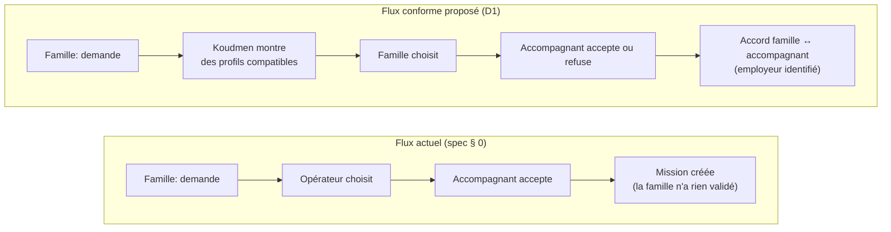
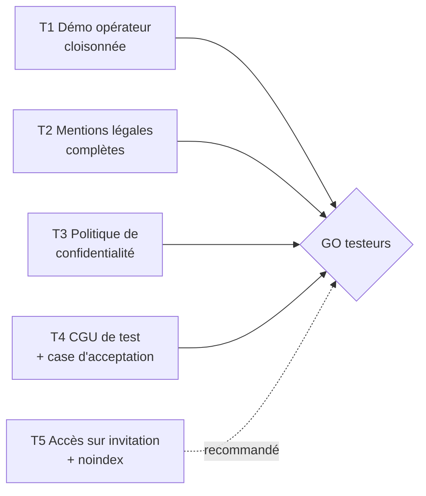

# Revue S1 — critique juridique de la spécification MVP

> **Rôle :** critique juridique (`.claude/agents/critique-juridique.md`).
> **Objet :** `docs/tech/specification-mvp.md`, ADR 0001 et 0002, `plateforme/prisma/schema.prisma`, `src/server/rules/`, `src/server/visits/`, pages publiques (`/`, `/inscription`, `/mentions`), `src/lib/plans.ts`, `src/server/auth/demo.ts`.
> **Références :** `docs/01` (juridique), `docs/08` (multi-statuts), `docs/00` (synthèse).
> **Date :** 2026-10-04. **Statut :** avis critique, pas une consultation juridique. Les points `[À VÉRIFIER AVEC UN AVOCAT]` ne servent pas à une décision sans contrôle.

---

## 0. Verdict en bref

| Étape | Verdict | Condition |
|---|---|---|
| **Mise en ligne pour des testeurs** (données fictives) | **GO SOUS CONDITIONS** | Corriger les 4 BLOQUANTS de la partie 1 (T1 à T4). Traiter les MAJEURS T5 à T8 dans le même sprint |
| **Sprint de construction S1** | **Corriger la spec d'abord** | Intégrer les 5 corrections de conception D1 à D5 (coût faible maintenant, BLOQUANT au pilote) |
| **Pilote réel en Martinique** | **NO-GO en l'état** | Lever les 5 BLOQUANTS de la partie 2 (P1 à P5) et la checklist de `docs/01` § 11 |

Les trois risques principaux :

1. **ATTENTION — Fuite de données réelles.** Le compte démo « Opérateur » est public. Il donne accès aux noms, emails et avis des **vrais testeurs**.
2. **ATTENTION — Koudmen choisit l'accompagnant à la place de l'employeur.** La famille ne valide jamais l'accompagnant. C'est un indice de mandataire ou de prestataire sans agrément.
3. **ATTENTION — La formule Sérénité vend « 1 visite par semaine + remplacement ».** Koudmen vend alors une prestation de compagnie (activité n° 25), soumise à autorisation.

---

## 1. À corriger AVANT la mise en ligne pour les testeurs

### 1.a Exposition juridique du site de test lui-même

| # | Risque | Gravité | Fonctionnalité | Pourquoi | Alternative conforme |
|---|---|---|---|---|---|
| **T1** | Fuite des données réelles des testeurs | **BLOQUANT** | Bouton public « Essayer en tant qu'Opérateur » ; écrans O2, O3, O7, O8, O9 ; mot de passe démo en clair dans `src/server/auth/demo.ts` (`DEMO_PASSWORD`) | Les comptes des testeurs sont **réels** (nom, email, connexions, avis). Tout visiteur anonyme lit la liste des accompagnants, l'Outbox (emails des destinataires), les retours et le journal d'audit. Il peut aussi valider ou suspendre un vrai testeur. Le mot de passe commun permet une connexion classique, même si `DEMO_MODE=false`, dès que le seed tourne en production. Art. 5.1.f et 32 RGPD. Une telle fuite peut imposer une notification à la CNIL (art. 33) | 1. Retire le bouton démo « Opérateur » de la page publique, **ou** cloisonne : l'opérateur démo voit et modifie seulement les données `isDemo = true`. 2. Sors le mot de passe démo du code (variable d'environnement, valeur aléatoire par déploiement). 3. Interdis le seed démo en production sans `DEMO_MODE=true`. 4. Donne le vrai rôle opérateur seulement à l'équipe |
| **T2** | Mentions légales absentes | **BLOQUANT** | Page `/mentions`, section « Éditeur et hébergement » : `[À VÉRIFIER : raison sociale, adresse, directeur de la publication]` | Un site public doit identifier l'éditeur et l'hébergeur (art. 6 III de la LCEN `[À VÉRIFIER AVEC UN AVOCAT : numérotation après la loi SREN de 2024]`). Sanction pénale possible. Un « projet en création » n'est pas une personne identifiable | Écris : nom de l'éditeur (personne physique ou société), adresse, email, téléphone, directeur de la publication. Hébergeur : Vercel Inc. (adresse) et le fournisseur PostgreSQL (nom, adresse) |
| **T3** | Politique de confidentialité incomplète pour les testeurs | **BLOQUANT** | Page `/mentions`, section « Vos droits » : responsable de traitement et contact `[À VÉRIFIER]` | Les données des testeurs sont réelles. L'art. 13 RGPD impose : responsable de traitement, finalité (test produit), base légale, durée (date de fin du test), destinataires, sous-traitants, transferts hors UE, droits, droit de plainte à la CNIL. Vercel Inc. et Neon Inc. sont des sociétés américaines : la région UE ne supprime pas la question du transfert (DPF ou clauses types) `[À VÉRIFIER AVEC UN AVOCAT]`. Il faut aussi un contrat de sous-traitance (art. 28) avec chaque fournisseur | Complète la page. Donne une **adresse email de contact réelle**. Fixe une date de suppression (ex. « fin du test + 1 mois »). Signe ou accepte les DPA de Vercel et Neon. Ouvre un registre des traitements minimal (1 page) |
| **T4** | Pas de CGU de test | **BLOQUANT** | `/inscription` : une seule case « données fictives » | Sans conditions d'utilisation, le cadre du test reste flou : rôle de Koudmen, absence de service réel, contenus interdits, partage des comptes démo, usage des avis. Le site héberge des contenus de tiers (bio, notes, Kayé) : le DSA demande un point de contact et des règles claires (art. 11, 12, 14 et 16) | Rédige des **CGU de test** d'une page (contenu au § 5). Ajoute une **2e case** distincte : « J'accepte les conditions d'utilisation du test ». Ajoute une case « J'ai 18 ans ou plus » |
| **T5** | Un vrai public trouve le site et l'utilise vraiment | **MAJEUR** | Site public, indexable, inscription ouverte | Une vraie famille de Martinique peut créer le profil de sa vraie mère, avec de vrais besoins. Elle peut croire que des visites auront lieu. Résultat : données réelles (dont santé) sur un hébergement non HDS, et confiance trompée | Restreins l'accès : **code d'invitation** à l'inscription, ou protection par mot de passe du déploiement. Ajoute `noindex`. Écris sur l'accueil : « Service non commercialisé. Aucune visite réelle n'a lieu » |
| **T6** | Offre publique trompeuse ou illicite | **MAJEUR** | Accueil (`/`) et `src/lib/plans.ts` : « Sérénité, à partir de 149 €/mois, 1 visite par semaine, Remplacement » ; « accompagnants vérifiés » ; email « Votre profil est vérifié » | 1. Koudmen affiche publiquement la vente d'une visite de compagnie (n° 25, autorisation CTM) et une garantie de remplacement (indice de prestataire, `docs/01` § 1.2). 2. Dans le MVP, les vérifications sont **déclaratives** (bouton « J'ai fourni », aucune pièce). « Vérifié » est donc faux : pratique commerciale trompeuse (art. L121-2 C. conso, risque 14 de `docs/01`) | 1. Ajoute sur chaque formule : « Prix et contenu à l'étude. Non commercialisé ». 2. Remplace « Remplacement » par « Aide pour trouver un remplaçant (sans garantie) ». 3. Remplace « vérifié » par « profil revu par l'équipe (vérifications déclarées pendant le test) ». 4. Ajoute en pied de page : « Koudmen n'est pas un service d'aide à domicile autorisé » |
| **T7** | Collecte de données sensibles réelles sur les testeurs accompagnants | **MAJEUR** | A2 Orientation (Q4 : RSA, chômage, agent public, **titre de séjour étudiant** ; Q5 : lien familial) ; A4 Vérifications (`CASIER_B3` avec texte libre) ; stockage brut de `orientationAnswers` | Le testeur répond souvent pour lui-même. Koudmen stocke alors sa situation sociale, son statut de séjour et une déclaration sur son casier judiciaire. Les données d'infraction sont interdites à un acteur privé (art. 10 RGPD) | 1. Affiche sur A2 et A4 : « Répondez avec un profil imaginaire ». 2. Pour `CASIER_B3`, remplace le texte libre par une case « B3 consulté (simulation) ». 3. Purge `orientationAnswers` à la fin du test |
| **T8** | Comptes démo partagés et noms réalistes | **MAJEUR** | Seed : « Sandrine », « Josiane », « Germaine Célestine », « Patrick Bellance »… ; un seul compte par rôle pour tous | Un testeur voit ce qu'un autre a écrit. Si un testeur saisit une vraie donnée, tous la lisent. Des noms martiniquais réalistes peuvent désigner une vraie personne sur un petit territoire | 1. Affiche à la connexion démo : « Compte partagé. Tout ce que vous écrivez est visible par les autres testeurs ». 2. Remets les données démo à zéro chaque nuit. 3. Ajoute la mention « Personnages fictifs. Toute ressemblance est fortuite » |
| **T9** | Bandeau de test absent par erreur | **MINEUR** | `TestBanner` s'affiche seulement si `NEXT_PUBLIC_TEST_MODE=true` | Un oubli de variable supprime l'avertissement principal | Affiche le bandeau **par défaut**. Masque-le seulement avec une variable explicite. Ajoute un test e2e qui vérifie sa présence |
| **T10** | Le signal « à surveiller » est pris pour une alerte | **MINEUR** | A8 Kayé, Outbox `ALERTE_A_SURVEILLER` | Même en test, l'écran installe un réflexe. Un signal non lu en temps réel ne protège personne | Écris sous la case : « En cas d'urgence : appelez le 15 ou le 112. Maltraitance : 3977 » |
| **T11** | Cookies et mesure d'audience | **MINEUR** | Cookie de session `koudmen_session` | Le cookie de session est strictement nécessaire : pas de consentement. Un outil d'audience ajouté plus tard en demandera un | Cite le cookie dans la politique de confidentialité. N'ajoute aucun outil d'audience sans bandeau de consentement |

### 1.b Corrections de conception à faire dès S1 (coût faible maintenant, BLOQUANT au pilote)

Ces points n'exposent pas les testeurs. Mais ils changent le **modèle de données** et le **parcours testé**. Les tester sous leur forme actuelle valide un parcours illégal pour le pilote.

| # | Risque | Gravité (pilote) | Fonctionnalité | Pourquoi | Alternative conforme |
|---|---|---|---|---|---|
| **D1** | Koudmen choisit et affecte l'accompagnant | **BLOQUANT** | § 0, § 4.1, § 4.2, A5, O5 : l'opérateur propose, l'accompagnant accepte, la `Mission` est créée et la demande passe `POURVUE`. **La famille ne valide jamais.** Messages : « Accompagnant trouvé », « L'équipe Koudmen cherche une autre personne » | En voie B, l'employeur est l'aîné ou la famille. Un employeur choisit son salarié. Si Koudmen **sélectionne et affecte**, il agit en **mandataire** (agrément DEETS) ou en **prestataire** (autorisation CTM), `docs/01` § 1.2. Avec la formule Sérénité (visite + remplacement payés à Koudmen), un juge peut voir un **prêt de main-d'œuvre illicite** ou du **marchandage** (art. L8241-1 et L8231-1 C. trav.) `[À VÉRIFIER AVEC UN AVOCAT]`. Pour l'auto-entrepreneur, la distribution du travail par la plateforme est un indice de subordination | Ajoute l'étape **« la famille choisit »** : 1. Koudmen montre à la famille les profils compatibles (critères objectifs publiés). 2. La famille choisit un ou plusieurs profils. 3. L'accompagnant accepte ou refuse. 4. Koudmen crée un **« Accord »** entre la famille et l'accompagnant (renomme `Mission`). Nouveaux statuts : `PROPOSEE_FAMILLE`, `CHOISIE`, `ACCEPTEE`. Réécris les messages : « Vous pouvez choisir un autre profil » |
| **D2** | Employeur non identifié | **BLOQUANT** | Schéma : `Mission` et `CareRequest` n'ont pas de champ « employeur » | Sans employeur nommé, personne ne sait qui signe le contrat IDCC 3239, qui déclare au CESU et qui a le crédit d'impôt. Piège de `docs/08` § 2.2 : un **enfant employeur** n'a le crédit d'impôt que si le parent remplit les conditions de l'APA | Ajoute sur l'Accord : `employerType` (AINE, ENFANT, CLIENT_AE, SAAD) et `employerName`. Ajoute sur l'aîné une question d'autonomie (APA oui / non / en cours). Affiche l'alerte « enfant employeur » de `docs/08` |
| **D3** | Proche aidant proposé à n'importe quelle famille | **MAJEUR** | `orientation.ts` dit « visible seulement dans son cercle Lakou », mais `checkCompatibility()` ne filtre pas ce statut | Le statut « proche aidant via l'APA » n'existe que pour **son propre parent** (art. L232-7 CASF). Proposé à une autre famille, c'est un salarié ordinaire mal classé | Ajoute `linkedAineId` au profil. Dans `checkCompatibility()`, refuse `PROCHE_AIDANT_APA` si l'aîné n'est pas le sien. Ajoute la raison `LIEN_FAMILIAL` |
| **D4** | Grille « indépendant » appliquée à des salariés | **MAJEUR** | P2 et RM-04 : « tarif libre fixé par l'accompagnant seul » ; A3 : rappel du SMIC sans blocage | Pour un salarié de la famille, il n'y a pas de « tarif libre ». Il y a un **salaire** négocié avec l'employeur, au moins égal au SMIC et au minimum de l'IDCC 3239, plus 10 % de congés payés en CESU. La famille doit pouvoir négocier. Le principe anti-requalification vise surtout l'auto-entrepreneur | Réécris RM-04 par statut : AE = tarif libre ; salarié = salaire proposé par l'accompagnant, **accepté par l'employeur**, bloqué sous le minimum légal, en brut ou net clairement indiqué ; SAAD = tarif du SAAD ; bénévole = 0 |
| **D5** | Suspension sans cadre | **MAJEUR** | O3 « Suspendre » ; aucun modèle `ACCOMPAGNANT_SUSPENDU` ; aucun recours | La suspension est le pouvoir de sanction typique (Uber 2020, Take Eat Easy 2018). La directive (UE) 2024/2831 (chapitre III) et le règlement P2B exigent motif, information, réexamen humain et, pour l'AE, préavis de 30 jours avant une résiliation. Koudmen ne peut pas rompre le contrat de travail entre la famille et son salarié | 1. Liste fermée de motifs objectifs dans les CGU (sécurité, fraude, perte du statut, signalement grave). 2. Ajoute l'email `ACCOMPAGNANT_SUSPENDU` avec le motif. 3. Ajoute un bouton « Demander un réexamen ». 4. Effet limité : plus de nouvelles propositions. Les accords en cours restent décidés par la famille, avec une information de sécurité si besoin |

---

## 2. À corriger AVANT le pilote réel

| # | Risque | Gravité | Fonctionnalité | Pourquoi | Alternative conforme |
|---|---|---|---|---|---|
| **P1** | Koudmen vend une prestation soumise à autorisation | **BLOQUANT** | Formule Sérénité « forfait 149 € : 1 visite par semaine, remplacement » (`docs/00` § 3, `plans.ts`) | Si le forfait inclut la visite, Koudmen facture en son nom une compagnie auprès d'un aîné (n° 25) : il faut l'**autorisation de la CTM** (sanctions pénales, art. L313-22 CASF). Si Koudmen encaisse puis reverse le salaire, c'est un **service de paiement** (art. L314-1 CMF) et un acte de gestion de mandataire | Option A : l'abonnement paie **seulement les services numériques** (preuve, Kayé, coordination). Les heures sont payées à part : CESU+ (salarié) ou facture de l'AE. Option B : le forfait tout compris est vendu et facturé par un **SAAD partenaire autorisé**. Demande un rescrit |
| **P2** | Affichage des prix et de la fiscalité non loyal | **BLOQUANT** | F9 Formules ; accueil | Art. L111-7 II C. conso : une plateforme de mise en relation informe de façon **loyale, claire et transparente** sur les droits et obligations des parties **en matière civile et fiscale**. Aujourd'hui, rien ne dit que l'abonnement **n'ouvre pas** le crédit d'impôt, ni que les heures l'ouvrent **sous conditions**. « À partir de 149 € » cache le coût des heures. Omission trompeuse (art. L121-3). Voir aussi art. 242 bis CGI | Affiche **deux lignes séparées** : 1. « Abonnement Koudmen : X € TTC/mois. **Non éligible au crédit d'impôt** » `[À VÉRIFIER par rescrit]`. 2. « Heures d'accompagnement : payées à l'accompagnant. Crédit d'impôt de 50 % **si** les conditions sont remplies » (+ lien vers les conditions, cas de l'enfant employeur). Prix TTC avec TVA de 8,5 % en Martinique. Ajoute : information précontractuelle, rétractation de 14 jours (L221-18), résiliation en 3 clics (L215-1-1), médiateur de la consommation (L612-1) |
| **P3** | Consentement de l'aîné non valable | **BLOQUANT** | F2 : la famille coche la case, choisit AINE ou REPRESENTANT et tape un nom | La famille n'a **aucun pouvoir propre** sur les données de l'aîné (`docs/01` § 5.4). La case est cochée par un tiers : rien ne prouve l'accord. « Représentant » ne dit pas lequel : une simple procuration ne suffit pas. Les besoins (`AIDE_LEVER`, `AIDE_RENFORCEE`) et le Kayé (humeur, appétit) sont probablement des **données de santé** : il faut un consentement **explicite** (art. 9.2.a). L'aîné n'a pas de compte : il ne peut ni lire, ni retirer son accord | 1. Recueille le consentement **auprès de l'aîné lui-même** : appel enregistré (en créole si besoin) ou signature simple. 2. Ajoute un champ « situation juridique » (autonome, curatelle, tutelle, habilitation familiale, mandat de protection future) et le justificatif. 3. Donne une notice FALC à l'aîné (art. 14). 4. Ajoute le retrait du consentement et son effet. 5. Laisse l'aîné décider qui entre dans le cercle Lakou et qui lit le Kayé |
| **P4** | Données de santé sur un hébergement non conforme | **BLOQUANT** | ADR 0001 (Vercel + Neon, non HDS) ; Kayé ; besoins | Le Kayé suit l'état d'une personne âgée dans une activité médico-sociale. L'étiquette « non médical » ne change pas la qualification. L'ADR 0001 § 5 prévoit déjà la sortie : elle est obligatoire | Applique l'ADR 0001 § 5 **avant toute donnée réelle** : hébergeur HDS, AIPD (avec GPS et preuve de visite), registre, DPO, DPA, procédure de violation de 72 h |
| **P5** | Koudmen agit comme mandataire CESU sans agrément | **BLOQUANT** | `docs/00` ligne « Rôle de Koudmen : … déclarations » ; futur relevé d'heures | Déclarer au CESU pour un employeur âgé = **mandataire** (agrément DEETS). Même « préparer » une déclaration peut être qualifié de gestion pour le compte de l'employeur (`docs/08` § 6, question 1) `[À VÉRIFIER AVEC UN AVOCAT]` | Phase 0 : Koudmen donne un **relevé d'heures indicatif**, issu des visites. La famille déclare **elle-même** sur cesu.urssaf.fr. Koudmen ne détient **jamais** les identifiants CESU de la famille. Écris dans l'application : « Koudmen ne déclare pas à votre place ». Corrige `docs/00` (ligne « déclarations »). Option : partenariat avec un mandataire agréé |
| **P6** | Koudmen contrôle le travail du salarié de la famille | **MAJEUR** | O6 « l'opérateur surveille les visites » ; message « L'équipe Koudmen vérifie » ; bouton opérateur « L'aîné a confirmé » | Contrôler la présence et vérifier le travail est un **pouvoir d'employeur**. S'il vient de Koudmen, Koudmen apparaît comme l'employeur. De plus, une confirmation saisie à la main par l'opérateur devient une **attestation de service fait** : elle alimente les heures, donc le crédit d'impôt. Risque de fraude | 1. La preuve de visite sert **la famille** : c'est elle qui valide les heures. 2. L'opérateur fait du support technique et du signalement de sécurité. Il ne valide pas les visites. 3. Une visite `A_VERIFIER` n'a **aucun effet** sur le profil. 4. La confirmation de l'aîné vient d'un **vrai appel vocal**, journalisé. L'opérateur ne peut plus la saisir. 5. Informe chaque accompagnant du système de preuve (directive 2024/2831, chapitre III) |
| **P7** | GPS : base légale et minimisation | **MAJEUR** | A7 check-in ; `VisitProof.latitude/longitude` ; domicile = centre de la commune ; Outbox `VISITE_COMMENCEE` à tout le cercle | Pour un salarié, le **consentement** n'est pas une base solide (déséquilibre). Base plus sûre : intérêt légitime de l'employeur, avec information (référentiel CNIL sur la géolocalisation des salariés). Le centre de la commune rend le facteur GPS inutile : il faudra l'adresse exacte. Prévenir tout le cercle (cousins, voisine) de l'heure d'arrivée dépasse le besoin | 1. Garde l'appel unique et le refus sans effet (déjà prévu : 2 facteurs sur 3 suffisent sans GPS). 2. Stocke seulement « valide oui / non » et la distance arrondie, pas les coordonnées brutes. 3. Fixe une durée de conservation. 4. Géocode l'adresse avec l'accord de l'aîné. 5. Envoie `VISITE_COMMENCEE` au seul employeur, s'il le demande. 6. Ajuste le rayon de 300 m au terrain |
| **P8** | Statuts et niveaux : incohérences entre `docs/08` et le MVP | **MAJEUR** | § 3 ; `status-levels.ts` (AE = niveau 2 seulement) | **L'exclusion de l'AE du niveau 1 « Lien » est juste.** La compagnie d'un aîné relève du n° 25 et la promenade du n° 27, en agrément ou autorisation (`docs/01` § 1.3). C'est `docs/08` § 3.1 (« Tous ») qui contredit sa propre fiche b et sa règle « Ne jamais ouvrir n° 3 ». Autre risque : « Courses » au niveau 2. Accompagner l'aîné au magasin relève du n° 27, pas du n° 7 ou 10 | 1. Garde le code. Corrige `docs/08` § 3.1 : « Tous **sauf auto-entrepreneur** ». 2. Au niveau 2, écris « courses **sans** l'aîné (commissions, livraison) ». Place « accompagner l'aîné aux courses » au niveau 3. 3. Liste blanche d'activités par AE, alignée sur son récépissé NOVA. 4. Valide le diplôme (niveau 4) sur **pièce**, pas sur déclaration. 5. Pas de nuit au pilote (`docs/08` § 4.2) |
| **P9** | « Salarié SAAD » traité comme un individu | **MAJEUR** | Orientation Q3 → statut `SAAD` pour une personne ; tarif libre ; niveaux 1 à 4 | Le salarié d'un SAAD travaille pour son employeur. Le contrat se forme avec **le SAAD**, qui facture. Proposer ce salarié en direct aux familles crée un conflit avec son obligation de loyauté (`docs/08` § 2.4). L'autorisation du SAAD n'est pas vérifiée | Crée un compte **« SAAD partenaire »** (organisation) avec numéro d'autorisation et convention. Le SAAD reçoit les demandes et désigne lui-même son intervenant. Supprime le statut individuel `SAAD` de l'orientation |
| **P10** | Bénévoles gérés par Koudmen | **MAJEUR** | Statut `BENEVOLE_ASSO` : Koudmen vérifie, valide et propose le bénévole | `docs/08` § 2.5 : au pilote, **l'association** recrute, assure, vérifie et rembourse. Si la famille paie un abonnement lié à des visites de bénévole, la visite a une contrepartie : risque de travail dissimulé | Les propositions de bénévoles passent par un **compte association**. Ces visites restent gratuites et hors formule payante |
| **P11** | Formation Koudmen obligatoire pour tous | **MAJEUR** | `requiredVerificationsFor()` ajoute `FORMATION` (« Formation Koudmen ») à tous les statuts | `docs/01` § 3.3 classe « formation obligatoire conditionnant l'accès aux missions » dans les indices de subordination. `docs/08` § 3.1 impose pourtant 3 h, 7 h ou 21 h. Les deux documents se contredisent | AE : exige seulement des prérequis objectifs (B3, RC pro, NOVA). Formation Koudmen **proposée, facultative**. Salarié : formation recommandée, l'employeur décide. Tranche le conflit avec l'avocat `[À VÉRIFIER AVEC UN AVOCAT]` |
| **P12** | Contrats et obligations de plateforme absents | **MAJEUR** | Aucun écran de CGU, CGV, conditions accompagnant | Il faut l'architecture de `docs/01` § 4.6 : CGU (DSA), conditions accompagnants (P2B : motifs, préavis, classement), conditions familles, modèle de contrat IDCC 3239, page « Comment nous classons les profils » (L111-7). Le tri de l'opérateur (créneaux communs, puis nom) doit être publié. Pour les AE : DAC7, précompte URSSAF au 1er janvier 2027, vérification du SIRET | Rédige ces documents avec l'avocat. Publie les critères de tri. Ajoute la collecte DAC7 à l'inscription AE. Souscris la RC plateforme |
| **P13** | Kayé imposé par la plateforme | **MINEUR** | A6 « Kayé à écrire » après chaque visite | Un protocole de compte rendu imposé par la plateforme est un indice de direction du travail (`docs/01` § 3.3) | Le Kayé est une **demande de la famille**, acceptée dans l'accord. Aucun effet sur le profil si l'accompagnant ne l'écrit pas |
| **P14** | Honorabilité déclarative | **MINEUR** | A4, O3 : aucune pièce stockée | Le badge « vérifié » engage la responsabilité de Koudmen (faute propre, `docs/01` § 6.3) | Vérifie l'identité et consulte le B3 **sans copie** (mention « B3 vu le … »). Applique les règles de `docs/08` § 4.2 : 21 ans au niveau 3, visite en binôme, 3 familles maximum le premier mois |
| **P15** | Sécurité de l'authentification | **MINEUR** | ADR 0002 § 4 | Art. 32 RGPD avec de vraies données | Applique ADR 0002 § 4 : limitation de débit, réinitialisation du mot de passe, 2FA opérateur, révocation des sessions |

---

## 3. Réponses directes aux questions posées

### 3.1 Le matching par l'opérateur crée-t-il de la subordination ?

- **Oui, dans sa forme actuelle**, pour deux raisons :
  - Koudmen choisit **et** l'accord se forme sans la famille (D1).
  - Koudmen contrôle les visites et peut suspendre (D5, P6).
- **Ce qui est déjà bon :** refus sans pénalité (RM-05), aucune note (RM-06), tri sans score, motif obligatoire et revue humaine (RM-07), serveur qui bloque une proposition interdite.
- **La règle à retenir :** Koudmen **montre**, la famille **choisit**, l'accompagnant **accepte**. Koudmen ne valide pas le travail fait.

### 3.2 Auto-entrepreneur exclu du niveau 1 « Lien » ?

- **Le MVP a raison.** La visite de courtoisie et la promenade auprès d'un aîné relèvent des activités n° 25 et n° 27 (agrément ou autorisation).
- **Corrige `docs/08` § 3.1**, qui écrit « Tous ».
- Seule exception possible : l'aide au téléphone ou au numérique. Elle relève du n° 11 (assistance informatique à domicile) et va donc au niveau 2.

### 3.3 CESU : préparer ou déclarer ?

- **Le MVP ne fait rien sur le CESU** (§ 12 hors périmètre). C'est correct pour le test.
- **Au pilote :** Koudmen fournit un relevé indicatif. La famille déclare elle-même. Koudmen ne touche jamais aux identifiants CESU (P5).

### 3.4 Formules payantes et loyauté (art. L111-7)

- **Aujourd'hui :** affichage non loyal pour un vrai service. « À partir de 149 € » mélange l'abonnement et les heures. Rien ne dit ce qui est éligible au crédit d'impôt.
- **En test :** acceptable seulement avec la mention « Prix à l'étude, non commercialisé » (T6).
- **Au pilote :** deux lignes séparées et la mention « Abonnement non éligible au crédit d'impôt » (P2).

### 3.5 Consentement de l'aîné

- **En test :** la case suffit, car les données sont fictives.
- **Au pilote :** BLOQUANT. Le consentement vient de l'aîné lui-même, ou d'un représentant légal **prouvé** (P3).

### 3.6 Mode démo et mentions

- Le mode démo est le **risque principal du test** : le compte « Opérateur » public expose les vrais testeurs (T1).
- Les mentions légales et la politique de confidentialité sont incomplètes (T2, T3).

---

## 4. Ce qui est conforme (à garder)

- Refus d'une proposition sans pénalité et sans motif obligatoire (RM-05).
- Aucune note, étoile ou classement (RM-06).
- Motif obligatoire et décision humaine pour refuser ou suspendre (RM-07).
- Niveaux autorisés **recalculés côté serveur** (RM-03) et refus serveur d'une proposition interdite.
- GPS : **une seule** position, après accord ; pas de suivi ; `Permissions-Policy` limitée.
- Preuve « 2 sur 3 » : le refus du GPS ne bloque pas la visite.
- Minimisation : prénom et initiale ; aucune pièce stockée ; notifications sans donnée de santé.
- Conjoint orienté vers PCH ou AJPA ; agents publics et titres de séjour étudiant en liste d'attente.
- Aucun paiement réel ; aucune IA de décision (pas de risque « IA à haut risque » de l'AI Act).

---

## 5. Kit minimal à publier avant les testeurs

### 5.1 CGU de test (une page)

1. **Objet :** le site est un **prototype**. Il sert à recueillir des avis. Koudmen ne rend **aucun service réel**.
2. **Aucune visite réelle, aucun paiement réel, aucun message réel.** Aucun contrat ne se forme entre les testeurs.
3. **Données fictives obligatoires :** pas de vrai nom d'aîné, pas d'information de santé, pas de donnée sur un tiers, pas de vraie situation sociale ou judiciaire.
4. **Comptes démo partagés :** tout ce qui est écrit est visible par les autres testeurs. Les données démo sont remises à zéro.
5. **Contenus interdits** et signalement : utilise le bouton « Donner mon avis » ou l'email de contact. L'équipe retire un contenu interdit.
6. **Avis des testeurs :** Koudmen peut les utiliser pour améliorer le produit, sans les publier avec le nom du testeur.
7. **Âge :** 18 ans minimum.
8. **Aucune garantie** de disponibilité. Koudmen peut fermer le test à tout moment.
9. **Fin du test :** date prévue ; suppression des comptes et des données à [date].
10. **Contact, droit applicable** (droit français).

### 5.2 Mentions et politique de confidentialité

- Éditeur : nom, adresse, email, téléphone, directeur de la publication.
- Hébergeurs : Vercel Inc. et le fournisseur PostgreSQL (nom, adresse).
- Responsable de traitement, finalité « test produit », base légale `[À VÉRIFIER AVEC UN AVOCAT : consentement ou intérêt légitime]`.
- Données réelles collectées : compte, connexions, journal d'audit, avis.
- Durée de conservation, sous-traitants, transferts hors UE, droits, plainte à la CNIL.
- Cookie de session (strictement nécessaire).
- « Koudmen n'est pas un service d'aide à domicile autorisé. »

### 5.3 Avertissements dans l'interface

| Où | Texte |
|---|---|
| Bandeau (toutes les pages) | « Version de test. Données fictives uniquement. Aucune visite réelle n'a lieu. » |
| Connexion démo | « Compte partagé. Tout ce que vous écrivez est visible par les autres testeurs. » |
| Formules | « Prix et contenu à l'étude. Non commercialisé. » |
| Orientation et vérifications | « Répondez avec un profil imaginaire. » |
| Kayé « à surveiller » | « Urgence : 15 ou 112. Maltraitance : 3977. » |

---

## 6. Questions nouvelles pour l'avocat

À ajouter à `docs/01` § 12 et `docs/08` § 6 :

1. Le flux « Koudmen propose, la famille choisit, l'accompagnant accepte » reste-t-il du **placement** (L5321-1 C. trav.), sans agrément ?
2. Une formule « visite + remplacement » payée à Koudmen crée-t-elle un risque de **prêt de main-d'œuvre illicite** ou de **marchandage** ?
3. La formation Koudmen obligatoire est-elle un indice de subordination pour un AE ? Pour un salarié de la famille ? (Conflit `docs/01` § 3.3 / `docs/08` § 3.1.)
4. Pour la preuve de visite d'un salarié de la famille : qui est **responsable de traitement** (la famille, Koudmen, ou les deux) ? Quelle base légale pour le GPS ?
5. La directive (UE) 2024/2831 s'applique-t-elle à une plateforme de **placement** de salariés de particuliers ?
6. Transferts : Vercel Inc. et Neon Inc. (sociétés américaines, région UE) sont-ils acceptables pour les données des testeurs ?

---

## 7. Verdict final

- **Testeurs : GO SOUS CONDITIONS.** Corrige T1 à T4 (BLOQUANTS). Traite T5 à T8 dans le même sprint. Le site doit dire clairement : prototype, données fictives, aucun service réel.
- **Sprint S1 : corrige la spec maintenant** (D1 à D5). La correction la plus importante : **la famille choisit l'accompagnant**, et l'employeur est nommé.
- **Pilote : NO-GO en l'état.** Lève P1 à P5 : modèle de la formule Sérénité, affichage loyal des prix et de la fiscalité, consentement réel de l'aîné, hébergement HDS et AIPD, rôle CESU limité au relevé d'heures. Fais valider le tout par un avocat SAP et numérique.

---

## Résumé (8 lignes)

1. Testeurs : GO sous 4 conditions BLOQUANTES (T1 à T4).
2. T1 : le compte démo « Opérateur » public expose les données réelles des testeurs ; le mot de passe démo est dans le code.
3. T2 à T4 : mentions légales, politique de confidentialité et CGU de test manquent ; ajoute un accès sur invitation.
4. Offre affichée trompeuse : « 149 €, 1 visite/semaine, remplacement » et « vérifiés » ; marque « non commercialisé ».
5. Subordination : Koudmen choisit et la famille ne valide jamais ; ajoute l'étape « la famille choisit » et nomme l'employeur.
6. AE exclu du niveau 1 « Lien » : le MVP a raison (n° 25 et 27) ; c'est `docs/08` § 3.1 qu'il faut corriger.
7. CESU : Koudmen fournit un relevé d'heures, la famille déclare ; abonnement affiché « non éligible au crédit d'impôt ».
8. Pilote : NO-GO tant que formule Sérénité, consentement de l'aîné, HDS/AIPD, prix loyaux et rôle CESU ne sont pas réglés.
