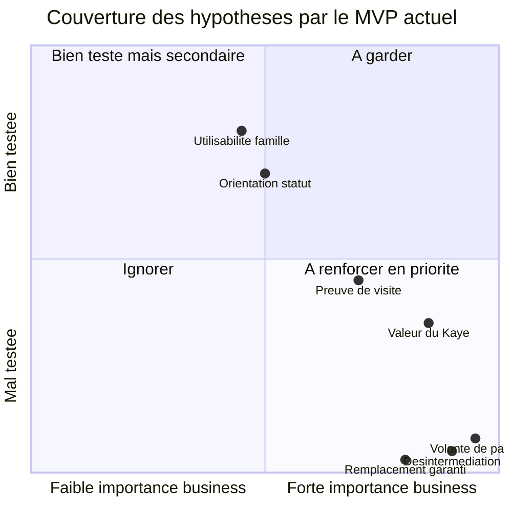
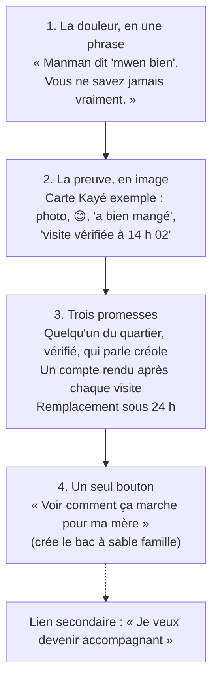
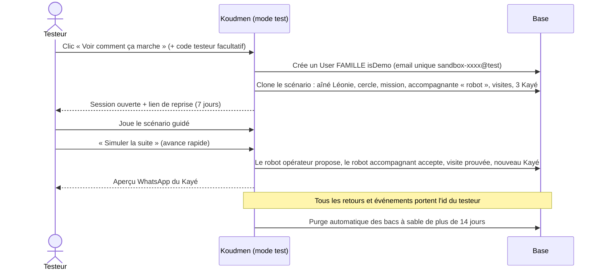
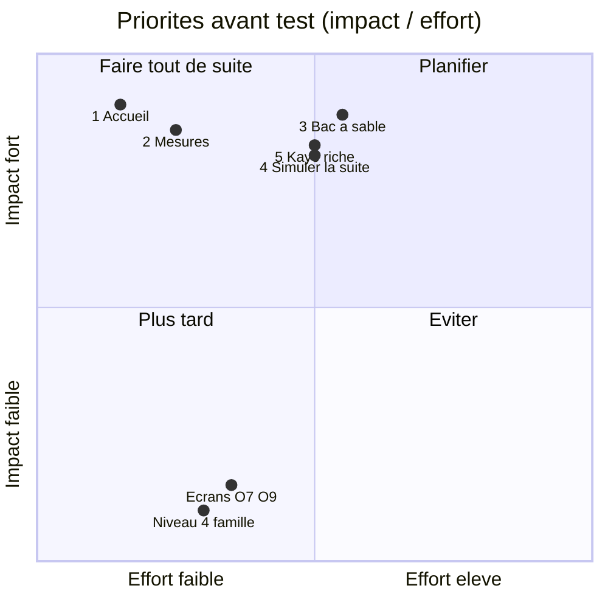
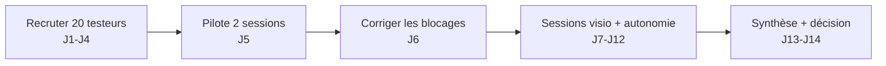

# Revue produit S1 — Spécification du MVP de test

> **Rôle :** critique produit (`.claude/agents/critique-produit.md`).
> **Objet :** [`docs/tech/specification-mvp.md`](../tech/specification-mvp.md) et [`docs/tech/lots.md`](../tech/lots.md), plus la page d'accueil déjà codée (`plateforme/src/app/(public)/page.tsx`).
> **Références :** personas (`docs/02` § 6), modèle économique (`docs/03`), vision (`docs/04`), lancement (`docs/06`), red team (`docs/07`).
> **Question du fondateur :** « Je veux mettre ce MVP entre les mains de vrais testeurs, vite, pour apprendre. Est-ce prêt ? »

---

## 0. Verdict en 6 lignes

1. **GO conditionnel.** Le socle technique est propre et les règles (statut → niveau, anti-requalification, RGPD) sont solides.
2. **Mais le MVP est conçu comme un back-office complet, pas comme un instrument d'apprentissage.** Il prouve que le flux fonctionne. Il ne mesure presque rien.
3. **Il teste bien l'utilisabilité et la compréhension.** Il ne teste **pas** la volonté de payer, ni la désintermédiation, ni le recrutement réel (données fictives, paiement simulé).
4. **Le cœur émotionnel est trop faible** : le Kayé n'a ni photo, ni mot vocal, ni aperçu WhatsApp. Le remplacement garanti (valeur n°1, `docs/03` § 1.3) est absent.
5. **Les comptes de démo partagés vont casser le test** : les testeurs vont se marcher dessus, et vous ne pourrez pas relier un retour à un testeur.
6. **Avant la mise en ligne testeurs, faites les 5 priorités du § 8.** Effort estimé : 1 sprint court.

---

## 1. Le MVP teste-t-il les bonnes hypothèses ?

Le MVP utilise des données fictives et un paiement simulé. Il ne peut donc donner qu'un **signal déclaratif** sur l'argent et la fuite. Les preuves réelles viennent du concierge terrain (`docs/06` § 5.3, E1 à E7 ; `docs/07` § 3, H2 à H5).

| Hypothèse | Source | Couverture actuelle | Pourquoi | Ce qu'il faut ajouter |
|---|---|---|---|---|
| **H-Payer** : la diaspora paie pour la tranquillité | `docs/07` H2, H5 ; `docs/06` E1 | ❌ Nulle | Un clic sur une formule simulée ne coûte rien. Ce n'est pas un signal. | Porte factice « Réserver une vraie visite découverte (49 €) » + question de prix (§ 9.3). |
| **H-Kayé** : le Kayé rassure assez pour payer | `docs/04` #1 | 🟡 Partielle | Le Kayé est un formulaire texte. Il manque la photo, le mot vocal et le canal WhatsApp, qui sont le produit selon `docs/04` et `docs/06` § 2.3. | Kayé « riche » fictif + aperçu WhatsApp + question « rassurance » juste après la lecture. |
| **H-Preuve** : la preuve de visite crée la confiance | `docs/00` § 2 | 🟡 Partielle | La preuve est visible côté accompagnant (check-in). Côté famille, ce sont des icônes et un score 0-3. La famille ne « sent » pas la preuve. | Un « reçu de visite » lisible : « Josiane est arrivée à 14 h 02. Position vérifiée. Code du domicile correct. » |
| **H-Recrutement** : on recrute des accompagnants fiables | `docs/07` H4 ; `docs/06` E2 | 🟡 Partielle | L'orientation en 5 questions teste la **compréhension** du statut et du tarif. Le recrutement réel se fait sur le terrain. | Mesurer : abandon par question, tarif saisi, « Vous inscririez-vous pour de vrai ? ». |
| **H-Fuite** : la famille reste après le bon match | `docs/07` H3 ; `docs/06` E7 | ❌ Nulle | Aucun écran ne met la famille face au choix « continuer en direct ». | Scénario 3 (§ 9.2) + question 5 (§ 9.3). Preuve réelle : cohorte concierge. |
| **H-Remplacement** : le remplacement garanti est la valeur n°1 | `docs/03` § 1.3 #3 | ❌ Absente | Aucun écran, aucun état de mission « absence ». | Un événement scénarisé « Josiane est malade → Nadège la remplace samedi ». |

**ATTENTION :** `docs/06` § 0 dit « Valider à la main, puis coder ». Le MVP existe déjà. Ce n'est pas grave, si vous l'utilisez comme **support d'entretien et de démonstration**, en parallèle du concierge. Ne lisez pas « 40 testeurs ont cliqué Sérénité » comme une preuve de demande.

---

## 2. À garder

| Élément | Justification |
|---|---|
| **Le flux cœur** demande → proposition → visite prouvée → Kayé (§ 0 de la spec) | C'est exactement la promesse vendue par `docs/06` § 6.4. Il raconte une histoire complète. |
| **Le plan Lakou gratuit** (0 €) | C'est le « single-player mode » de `docs/06` § 1.4 : l'aimant à familles diaspora. |
| **Le cercle Lakou + invitation par lien** (F4, F10) | La fratrie dispersée est le vrai acheteur (Nadia + son frère à Lyon). Tester « est-ce que j'invite mon frère ? » est très utile. |
| **Le signal « à surveiller »** mis en avant dans le fil Kayé (F8) | C'est le moment où la famille passe de « rassurée » à « je peux agir ». Fort pour la valeur perçue. |
| **L'orientation statut en 5 questions** (A2) | Elle teste une vraie inconnue : un accompagnant comprend-il son statut et accepte-t-il le salariat CESU ? |
| **Le tarif libre, le refus sans pénalité, l'absence de note** (P2) | Non négociable juridiquement (`docs/01`). C'est aussi un argument de recrutement à tester. |
| **Le bouton « Donner mon avis »** partout (P5) | Bon réflexe. À enrichir (§ 5). |
| **Le bandeau « données fictives »** (P1) | Indispensable. Il protège contre la saisie de vraies données de santé. |

## 3. À simplifier

| Élément | Problème | Proposition |
|---|---|---|
| **Page d'accueil** | Elle décrit le système (cercle, check-in, code du domicile) au lieu de la douleur et du résultat. Voir § 4. | Refondre au-dessus de la ligne de flottaison. |
| **Niveau 4 « Aide renforcée »** côté famille (F2, F6) | Le pilote n'en fait pas (`docs/06` § 6.1 : « toilette → SAAD »). Il ajoute un cas complexe (diplôme) sans valeur de test. | Garder la règle dans le code. Côté famille, remplacer le choix 4 par un message : « Pour la toilette, nous vous orientons vers un SAAD ». |
| **Choix du niveau 1-4** par la famille | Nadia ne pense pas en « niveaux ». Elle pense « quelqu'un pour passer voir Manman ». | Demander le besoin en mots simples (« compagnie », « courses », « rendez-vous »). Déduire le niveau côté serveur. |
| **Formule (F9)** | Trois prix qui ne correspondent à aucune grille des études (voir encadré). Un clic gratuit ne mesure rien. | Une seule grille, alignée sur `docs/03` § 3.2. Remplacer le « choix » par une question de prix + une porte factice. |
| **Preuve côté famille (F7)** | Icônes et score 0-3 : technique. | Reçu de visite en phrases (voir § 1, H-Preuve). |
| **Confirmation de l'aîné par un bouton famille** (F7) | La famille « prouve » elle-même la visite : le testeur ne comprend plus à quoi sert la preuve. | En mode testeur, jouer la confirmation automatiquement (« Léonie a tapé 1 au téléphone à 16 h 10 »). Garder le bouton pour l'opérateur. |
| **Espace opérateur** (Lot C, 9 écrans) | Le testeur n'est jamais opérateur. Le fondateur l'est. | Garder O1, O5, O8. Réduire O2-O3 au minimum. Reporter O7 et O9 (ou les livrer en lecture brute). |

> **ATTENTION — grilles de prix incohérentes.**
> - Code (`src/lib/plans.ts`) : Lakou 0 €, Veyé 39 €, Sérénité « à partir de 149 € ».
> - `docs/03` § 3.2 : Veille 39 €, Veille+ 89 €, Veille Intégrale 189 €.
> - `docs/06` § 2.1 : Kontak 9-19 €, Présence 199 €, Présence+ 379 €.
> - Le nom « Veyé » entre aussi en conflit avec « Veyé Siklòn » (mode cyclone). Un terme = un sens.
> Choisissez **une** grille avant le test. Sinon, les réponses sur le prix sont inexploitables. [À VÉRIFIER] décision fondateur.

## 4. La page d'accueil vend-elle la tranquillité ?

**Non, pas encore.** Elle est propre et accessible. Mais elle parle le langage de l'équipe, pas celui de Nadia.

| Constat | Effet sur le testeur |
|---|---|
| Titre : « Le réseau de confiance qui veille sur nos aînés, ici et là-bas » | Beau, mais abstrait. Nadia ne se reconnaît pas en 3 secondes. |
| Premiers boutons : « Créer un compte » / « Se connecter » | On demande un engagement avant de montrer la valeur. |
| Section démo avec **trois rôles**, dont « Opérateur » | Le testeur doit choisir qui il est. Le rôle opérateur brouille le message. |
| « Comment ça marche » en 4 étapes du point de vue du système | Mots internes non expliqués : « cercle Lakou », « check-in », « code du domicile », « Kayé ». |
| Aucun **exemple de Kayé** | Le produit n'est jamais montré. Or, selon `docs/06` § 2.3, « le compte rendu EST le produit ». |
| Remplacement garanti, vérification, créole : absents ou cachés | Les trois arguments du pitch diaspora (`docs/06` § 6.4) manquent. |

**Proposition de structure (au-dessus de la ligne de flottaison, sur mobile) :**

- Reprenez le texte du pitch `docs/06` § 6.4. Il est déjà écrit et parle la langue de Nadia.
- Retirez le bouton « Opérateur » de la page publique. Gardez-le derrière une URL connue du fondateur.
- **Test des 30 secondes :** montrez la page 30 secondes, cachez-la, puis demandez « Que fait Koudmen pour vous ? ». Objectif : 7 testeurs sur 10 citent « nouvelles / preuve de visite » **et** « quelqu'un sur place ».

## 5. Le mode démo à comptes partagés : pas adapté

### 5.1 Les risques

| Risque | Exemple concret |
|---|---|
| **Collisions** | Le testeur A accepte la proposition d'Ernest. Le testeur B ne la voit plus. Il croit à un bug. |
| **État imprévisible** | Le testeur 12 arrive sur un fil Kayé rempli par les 11 premiers, avec des notes absurdes. |
| **Retours non attribuables** | `Feedback.userId` pointe vers « Sandrine (démo) » pour tout le monde. Vous ne savez pas qui dit quoi, ni dans quel scénario. |
| **Fuite de données entre testeurs** | Un testeur tape le vrai prénom de sa mère malgré le bandeau. Tous les autres testeurs le voient. **ATTENTION :** risque RGPD. |
| **Remise à zéro destructive** | `pnpm db:seed` fait un `TRUNCATE` de toutes les tables : il efface aussi les retours testeurs et les traces d'usage. |
| **Parcours bloqué** | Un testeur « famille » seul crée une demande, puis attend un opérateur et un accompagnant qui n'existent pas. Le Kayé n'arrive jamais. |

### 5.2 Proposition : un bac à sable par testeur, généré à la volée

**Règles de conception :**

1. **Un testeur = un monde.** Le serveur clone un « gabarit de scénario » pour chaque nouvel essai. Le schéma actuel suffit : l'accès passe déjà par `LakouMember` et `Mission` (`canAccessAine`). Aucune migration n'est nécessaire pour la version minimale. [À VÉRIFIER] avec l'architecte.
2. **Des rôles « robots » pour les autres côtés.** L'opérateur et l'accompagnant du bac à sable sont des comptes clones, propres au testeur. Un bouton **« Simuler la suite »** fait avancer le scénario d'une étape (proposition → acceptation → visite → Kayé). Le testeur n'attend jamais.
3. **Un code testeur** (`?t=NADIA-07`) dans le lien d'invitation. Il est stocké dans les métadonnées d'audit et relie chaque retour à un profil (diaspora, local, accompagnant).
4. **Un lien de reprise** (lien magique) plutôt qu'un mot de passe. Le testeur revient le lendemain sans recréer de compte.
5. **Purge par ancienneté**, jamais par `TRUNCATE` global. Les retours et les événements sont conservés.
6. **Garder les comptes partagés** seulement pour les démos en direct du fondateur (salon, rendez-vous prescripteur).

**Impact sur les lots :** la création du bac à sable touche `src/server/auth/**` et le seed. Ce sont des fichiers du socle et du Lot C. L'orchestrateur doit attribuer ce travail (proposition : architecte, avec réutilisation des fonctions du seed).

## 6. À supprimer (pour le test utilisateur)

| Élément | Raison |
|---|---|
| Bouton « Essayer en tant qu'Opérateur » sur la page publique | Le testeur n'est pas opérateur. Il brouille la proposition de valeur. |
| Choix du niveau 4 dans le formulaire famille | Hors pilote. Il remplace une vraie demande par une orientation SAAD. |
| Journal d'audit (O9) et Outbox (O7) comme **écrans à finir** avant le test | Utiles au fondateur, invisibles pour le testeur. Une liste brute suffit. |
| Suspension / réactivation d'accompagnant (cycle SUSPENDU) pour le premier test | Pas de vrai accompagnant actif dans le test. À garder dans le backlog. |
| Cycle « REFUSE → EN_ATTENTE » côté accompagnant | Cas rare. Il n'apprend rien au fondateur au stade du test. |

## 7. Manquant

### 7.1 Ce qui manque pour comprendre en 30 secondes

| Manque | Pour qui | Justification |
|---|---|---|
| **Un Kayé exemple riche sur la page d'accueil** (photo fictive, humeur, 3 lignes, mot vocal simulé) | Nadia (P1) | « Le compte rendu EST le produit » (`docs/06` § 2.3). |
| **Un aperçu « Ce que vous recevez sur WhatsApp »** dans l'espace famille | Nadia (P1) | `docs/04` #1 : le Kayé arrive par WhatsApp, pas dans une nouvelle app. Aujourd'hui, seul l'opérateur voit les messages (O7). |
| **Photo et mot vocal dans le Kayé** (même simulés, sans stockage réel) | Famille + accompagnant | C'est ce qui fait sourire Murielle à 6 h 45 (`docs/04` § 5.1). Le texte seul ne crée pas d'émotion. |
| **Remplacement garanti scénarisé** | Famille | Valeur n°1 (`docs/03` § 1.3 #3). Sans lui, la preuve de la différence avec le CESU direct manque. |
| **Le revenu net estimé de l'accompagnant** dans le profil (A3) | Accompagnant (P4) | `docs/07` R6 : « calculer et afficher le revenu net horaire réel ». Fort argument de recrutement. |
| **Un « interlocuteur unique »** (coordinatrice nommée, photo, WhatsApp fictif) | Nadia (P1), Marie-Josée (P2) | `docs/02` P1 : elle achète « un interlocuteur unique ». |

### 7.2 Ce qui manque pour que le fondateur apprenne

| Manque | Effet |
|---|---|
| **Scénarios guidés dans l'app** (bandeau « Mission 1 sur 3 : lisez le dernier Kayé de Léonie ») | Les testeurs à distance savent quoi faire. Vous comparez des parcours identiques. |
| **Micro-questions au bon moment** (1 clic, 1 question) | Après le 1er Kayé lu : « Ce compte rendu vous rassurerait-il ? 1-5 ». Après la preuve : « Avez-vous compris comment la visite est vérifiée ? Oui / Non ». Après les formules : « À partir de quel prix est-ce trop cher ? ». |
| **Mesures d'usage tracées par testeur** | Étapes franchies, temps par étape, abandons. Sans schéma nouveau : utiliser `logAudit` avec une action `test.event` et le code testeur en métadonnées. [À VÉRIFIER] architecte. |
| **Porte factice d'engagement réel** | Bouton « Je veux ça pour mon parent : réservez-moi une vraie visite découverte » → recueil d'un contact **du testeur** (pas de l'aîné), avec consentement. C'est le meilleur signal disponible de volonté de payer. [À VÉRIFIER] critique-juridique : base légale et mention. |
| **Un tableau de bord testeurs** (O8 enrichi) | Retours groupés par segment et par scénario, pas seulement par page. |

## 8. Top 5 des priorités avant la mise en ligne testeurs

Classées par rapport **impact / effort**.

| # | Priorité | Impact | Effort | Hypothèse servie |
|---|---|---|---|---|
| 1 | **Refondre le haut de la page d'accueil** : douleur + Kayé exemple + 3 promesses + 1 seul bouton ; retirer « Opérateur » ; une seule grille de prix | Fort | Faible (1-2 j) | Compréhension 30 s, H-Kayé |
| 2 | **Mesurer** : code testeur, événements `test.event`, 4 micro-questions, porte factice « vraie visite découverte » | Fort | Faible (2 j) | H-Payer, H-Kayé, H-Preuve |
| 3 | **Bac à sable par testeur** cloné à la volée, lien de reprise, purge par ancienneté | Fort | Moyen (3-4 j) | Validité de tout le test |
| 4 | **« Simuler la suite » + 3 scénarios guidés** dans l'app (robots opérateur et accompagnant) | Fort | Moyen (3 j) | Parcours complet sans attente |
| 5 | **Kayé riche + aperçu WhatsApp + reçu de visite en phrases + événement « remplacement »** | Fort | Moyen (3 j) | H-Kayé, H-Preuve, H-Remplacement |

**Conseil d'orchestration :** les priorités 3 et 4 touchent le socle. Donnez-les à l'architecte. Réduisez le Lot C à O1, O5, O8 et aux tests e2e. Le Lot A prend les priorités 1 et 5 (côté famille). Le Lot B prend le Kayé riche (côté accompagnant) et le revenu net estimé.

---

## 9. Protocole de test utilisateurs (2 semaines)

### 9.1 Qui recruter

| Segment | Nombre | Profil | Où les trouver (`docs/06`) |
|---|---|---|---|
| **Diaspora payeuse** (persona Nadia) | 8 | 35-60 ans, en Hexagone, un parent de 70 ans ou plus seul en Martinique | Associations antillaises, CSE AP-HP / RATP, groupes Facebook, entourage |
| **Aidant local** (persona Marie-Josée) | 4 | En Martinique, s'occupe d'un parent, fratrie en Hexagone | Pharmacies, plateformes de répit, paroisses |
| **Accompagnants potentiels** (personas Ghislaine, Kévin, Sandrine) | 6 | 2 retraités, 2 étudiants, 2 en reconversion | France Travail, université, bouche-à-oreille |
| **Prescripteurs** (facultatif) | 2 | 1 IDEL, 1 pharmacien | Réseau du fondateur |

- 5 à 8 personnes par segment suffisent pour trouver l'essentiel des blocages d'utilisabilité.
- Faites **au moins 6 sessions en visio, avec partage d'écran**, et le reste en autonomie.
- Incluez **2 à 3 aînés** hors app : montrez-leur la carte « code du domicile » et jouez l'appel « tapez 1 ». Ils sont absents du MVP, mais ils décident d'ouvrir la porte. [À VÉRIFIER] acceptabilité.

### 9.2 Trois scénarios guidés

> **S1c (5 octobre 2026) : protocole aligné sur l'application.** Les scénarios ci-dessous suivent les 3 scénarios réels du panneau « Votre test ». Les écarts relevés par la revue S1b-ux (M17) sont corrigés dans le protocole, pas dans l'application :
> - Ernest habite dans **une des communes choisies par la testeuse** (le robot le crée là), pas forcément au Lamentin.
> - Le remplacement de Josiane et l'offre « en direct, en CESU » n'existent pas dans l'application : ils passent dans l'entretien (question 5, « Fuite »).
> - Le revenu net estimé est maintenant affiché (profil et propositions).

Chaque testeur entre par « Tester Koudmen » avec son code, puis **choisit lui-même** son rôle (aucun rôle n'est coché par défaut).

**Scénario 1 — « Des nouvelles de Léonie » (rôle Famille, 10 min)**
> « Votre mère, Léonie, 81 ans, vit seule à Fort-de-France. Vous habitez à Créteil. Votre frère Frédéric est déjà dans le cercle. »
1. Regardez la page d'accueil pendant 30 secondes. Dites ce que fait Koudmen et combien cela coûte.
2. Lisez le dernier Kayé de Léonie. Trouvez le signal « à surveiller ».
3. Vérifiez que la dernière visite a bien eu lieu. Expliquez comment vous le savez (reçu de visite, page Visites).
4. Invitez un autre proche dans le cercle Lakou (par exemple votre sœur, à Lyon).

**Scénario 2 — « Trouver un accompagnant » (rôle Famille, 8 min)**
1. Touchez « Simuler la suite » : Koudmen propose des profils.
2. Choisissez une personne. Dites pourquoi.
3. Touchez deux fois « Simuler la suite » : la personne accepte, puis fait la visite.
4. Lisez le Kayé de cette visite.

**Scénario 3 — « Un imprévu et le prix » (rôle Famille, 8 min)**
1. Une visite est « À vérifier ». Dites ce que vous comprenez et ce que vous feriez.
2. Regardez les formules. Dites laquelle vous prendriez, et à quel prix total par mois.
3. Dites si vous voulez une vraie visite découverte à 49 €.

**Scénario accompagnant — « Je deviens accompagnant » (rôle Accompagnant, 15 min, 3 parties du panneau)**
> « Vous êtes retraitée à Schœlcher. Vous voulez un complément de revenu et vous sentir utile. »
1. Répondez aux 5 questions sur votre statut. Expliquez votre statut avec vos mots.
2. Fixez votre tarif horaire, vos communes et vos créneaux. Dites si le **revenu net estimé** vous convient.
3. Cochez vos documents et demandez la vérification.
4. Touchez « Simuler la suite » : l'équipe valide, puis une famille vous choisit. Acceptez la mission pour Ernest.
5. Ouvrez la visite. Enregistrez votre arrivée (position simulée + code du domicile affiché sur la page). Écrivez le Kayé en moins de 2 minutes.

À la fin de chaque scénario, l'application demande l'avis du testeur (une note + une question ouverte).

### 9.3 Cinq questions à poser (après les scénarios)

1. **Compréhension :** « En une phrase, que fait Koudmen pour vous ? » (à poser aussi après 30 s sur la page d'accueil).
2. **Douleur actuelle :** « Racontez la dernière fois que vous vous êtes inquiété(e) pour votre parent. Qu'avez-vous fait ? » (faits passés, pas d'opinions).
3. **Valeur du Kayé et de la preuve :** « Qu'est-ce qui vous rassure dans ce compte rendu ? Qu'est-ce qui manque pour que vous arrêtiez de vous inquiéter ? »
4. **Prix :** « À partir de quel prix mensuel est-ce trop cher ? Et à quel prix est-ce une bonne affaire ? » Puis : « Voulez-vous que l'on organise une vraie visite découverte à 49 € ? » (noter oui / non / plus tard).
5. **Fuite :** « Si vous aviez le numéro de l'accompagnante, que perdriez-vous en passant en direct ? »

Variante accompagnants pour les questions 4 et 5 : « Quel revenu net par heure vous ferait dire oui ? » et « Qu'est-ce qui vous ferait rester sur Koudmen plutôt que de travailler en direct pour une famille ? ».

### 9.4 Métriques

| Métrique | Mesure | Seuil « bon signal » [À VÉRIFIER] |
|---|---|---|
| Compréhension en 30 s | % qui citent « nouvelles / preuve » **et** « quelqu'un sur place » | ≥ 70 % |
| Réussite des scénarios | % de tâches finies sans aide | ≥ 80 % |
| Rassurance du Kayé | Note moyenne de la micro-question (1-5) | ≥ 4 |
| Compréhension de la preuve | % qui expliquent correctement la vérification | ≥ 70 % |
| **Engagement réel** | % de testeurs diaspora qui laissent un contact pour une vraie visite découverte | ≥ 30 % |
| Prix acceptable | Médiane du prix « bonne affaire » (diaspora) | ≥ 39 €/mois |
| Résistance à la fuite (déclarative) | % qui disent rester, avec une raison concrète (remplacement, preuve, crédit d'impôt) | ≥ 60 % |
| Orientation accompagnant | % qui finissent les 5 questions et reformulent leur statut | ≥ 70 % |
| Temps d'écriture du Kayé | Médiane | ≤ 2 min |
| Invitation Lakou | % de familles qui invitent au moins 1 proche | ≥ 40 % |

**Règle de lecture :** un seuil déclaratif atteint autorise à continuer le concierge. Il ne remplace pas les critères go/no-go réels de `docs/06` § 5.3 (E1, E5, E7).

---

## 10. Questions ouvertes pour le fondateur

1. Quelle grille de prix montrez-vous aux testeurs : « Veille » (`docs/03`) ou « Présence » (`docs/06`) ?
2. Acceptez-vous de recueillir le contact réel d'un testeur (porte factice) ? Il faut l'avis de critique-juridique.
3. Le concierge terrain (Tally + WhatsApp) tourne-t-il déjà en parallèle ? Sans lui, aucune hypothèse d'argent ni de fuite ne sera tranchée.
