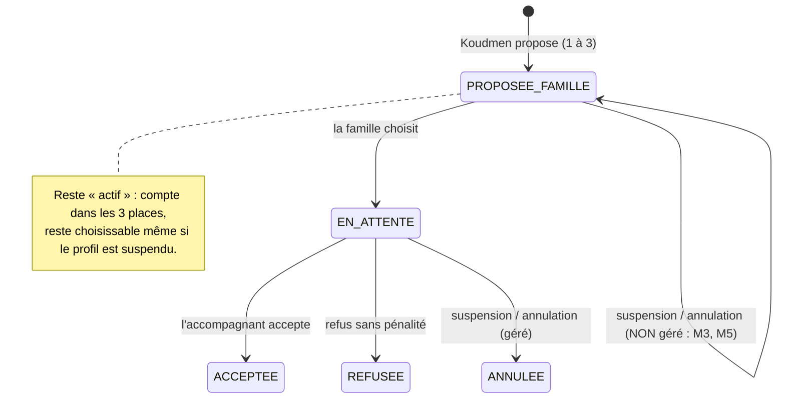

# Revue de code — S1b + lots A, B, C

- **Périmètre :** `plateforme/` de `c751490` (socle S0) à `09b4080`. Accent sur `src/server/**` et les Server Actions.
- **Références :** `docs/tech/specification-mvp.md`, ADR 0001 à 0003, `docs/revues/S1-arbitrage.md` (D1 à D15).
- **Réviseur :** réviseur de code senior (agent). Date : 2026-10-04.

## 1. Ce que j'ai exécuté

| Commande | Résultat |
|---|---|
| `pnpm test` | 20 fichiers, 228 tests OK, 8 ignorés (tests sur base) |
| `KOUDMEN_DB_TESTS=1 pnpm vitest run` | 22 fichiers, **236 tests OK**. Le journal montre un **deadlock PostgreSQL (40P01)** dans le test « deux acceptations simultanées » (voir m1) |
| `tsc --noEmit`, `pnpm lint` | Aucune erreur |
| Sondes jetables (hors dépôt, données de bac à sable purgées ensuite) | D10 contourné : **confirmé**. Robot bloqué pour un proche aidant : **confirmé** (3 demandes orphelines en 5 clics). Double clic « Accepter » sur la même proposition : bien géré (`CONFLIT`). Course sur `chooseProfile` : non reproduite en 1 essai (théorique) |

Je n'ai pas lancé `pnpm db:seed`. Je n'ai modifié aucun fichier de code.

## 2. Points solides

- **Cloisonnement (ADR 0003) : bon.** Toutes les lectures de `operateur/queries.ts` portent le filtre du monde réel. Les actions opérateur vérifient le monde avant d'écrire. `proposeProfile` refuse une demande ou un profil d'un autre monde. Les invitations Lakou et les notifications portent le monde. Je n'ai trouvé **aucune requête transverse sans filtre** (sauf les exceptions voulues D15 : avis, mesure).
- **D1 :** `requireRole("OPERATEUR")` refuse un compte démo ou de bac à sable. Pas de démo « Opérateur ». Connexion par mot de passe refusée aux comptes de bac à sable.
- **Acceptation (A5) :** une transaction, verrous optimistes (`updateMany ... where status`), double clic bien géré.
- **Un seul Kayé :** contrainte unique + traduction de `P2002` en `CONFLIT`. Testé sur base réelle.
- **Lien de reprise :** 32 octets aléatoires, empreinte SHA-256 en base, `no-referrer`. Route de purge : secret comparé en temps constant.
- **Purge :** l'ordre des suppressions respecte les clés étrangères. Le test sur base purge des mondes complets (avec mission, visites, Kayé).

## 3. Constats

### Résumé

| Gravité | Nombre |
|---|---|
| BLOQUANT | 0 |
| MAJEUR | 6 |
| MINEUR | 8 |

### Tableau

| # | Gravité | Fichier:ligne | Problème | Scénario d'échec | Correction proposée |
|---|---|---|---|---|---|
| M1 | **MAJEUR** | `src/server/accompagnant/service.ts:118` (+ `:220-246`, `:302`) ; `src/server/sandbox/robots.ts:274` | **D10 contourné.** La réorientation garde l'ancien tarif. Le plancher salarié est contrôlé **seulement** dans `saveProfile`. `submitForReview`, la validation opérateur et `acceptProposal` ne le recontrôlent pas. Le robot garde aussi un tarif existant. | Un accompagnant fait l'orientation « auto-entrepreneur », fixe 9,00 €/h (permis), refait l'orientation → `SALARIE_FAMILLE_CESU`. Le tarif reste à 9,00 € (**vérifié sur base** : `status=SALARIE_FAMILLE_CESU, rate=900`). Il demande la vérification, l'opérateur valide, la mission copie 9,00 €/h, sous le SMIC. | Dans `saveOrientation` : si le nouveau statut est salarié et le tarif < `PLANCHER_SALARIE_CENTS`, mettre `hourlyRateCents = null` (le profil redevient incomplet). Ajouter la règle du plancher à `missingProfileItems` (donc à `submitForReview`) et à `acceptProposal`. Même règle dans le robot (`Math.max(rate, PLANCHER)`). |
| M2 | **MAJEUR** | `src/server/rules/matching.ts:60` ; `src/server/sandbox/robots.ts:404-455` | **D7 sans chemin de réussite.** Aucun code ne remplit `linkedAineId` (ni orientation, ni profil, ni opérateur). Un proche aidant APA n'est donc **jamais** proposable, même pour sa propre famille. Dans le bac à sable, le robot crée la demande **avant** d'appeler `proposeProfile`, hors transaction. | Un testeur « Accompagnant » répond « Enfant ou parent » à Q5 → `PROCHE_AIDANT_APA`. Après validation, chaque clic sur « Simuler la suite » affiche « Le robot est bloqué : … LIEN_FAMILIAL » et crée **une nouvelle demande orpheline** (**vérifié** : `BLOQUE,BLOQUE,BLOQUE`, 3 demandes). Le scénario guidé est une impasse. | Robot : si le testeur est proche aidant, créer l'aîné Ernest **puis** poser `linkedAineId = ernest.id` (c'est « son parent » dans la fiction), le tout dans une transaction avec la demande et la proposition. Réel : ajouter un champ « aîné de ma famille » (choix opérateur, audité) ou documenter que D7 est hors MVP. |
| M3 | **MAJEUR** | `src/server/operateur/actions.ts:93-109` ; `src/server/matching/service.ts:127-148` | **Suspension et refus ignorent le statut D6 `PROPOSEE_FAMILLE`.** Seules les propositions `EN_ATTENTE` sont annulées. `chooseProfile` ne vérifie pas que le profil est encore `VALIDE`. Le recomptage (`:105`) ignore `PROPOSEE_FAMILLE`. | L'opérateur propose A et B (PROPOSEE_FAMILLE). La famille choisit A (EN_ATTENTE). L'opérateur suspend A : A → ANNULEE, demande → **OUVERTE**, mais B reste PROPOSEE_FAMILLE. La famille clique « Choisir B » : refus « Cette demande n'attend plus de choix » (statut ≠ PROPOSEE). B occupe encore une place sur 3. **Autre cas :** l'opérateur suspend B (non choisi) : B reste visible et choisissable ; la famille le choisit ; B reçoit `PROPOSITION_MISSION` mais ne peut pas accepter (profil non validé) → la demande reste bloquée en EN_ATTENTE. | Annuler `EN_ATTENTE` **et** `PROPOSEE_FAMILLE`. Recompter les deux statuts actifs avant de rouvrir la demande. Dans `chooseProfile`, refuser un profil dont `validation !== "VALIDE"`. Extraire une fonction partagée `releaseCaregiverProposals(tx, caregiverId)`. |
| M4 | **MAJEUR** | `src/server/accompagnant/service.ts:82-93` ; `src/server/access.ts:17-21` ; `src/server/operateur/actions.ts:93` | **Un accompagnant suspendu garde ses missions.** Ni la suspension ni `loadOwnedVisit` ne regardent `validation`. `canAccessAine` reste vrai (mission ACTIVE). | L'opérateur suspend Josiane pour un signalement grave (motif obligatoire, P2). Le lendemain, Josiane ouvre sa visite prévue, fait le check-in chez l'aîné, publie un Kayé ; le cercle reçoit `VISITE_COMMENCEE`. La suspension n'a aucun effet sur le terrain. | Dans `assertCanAddProof` et `createKaye` : refuser si `caregiver.validation !== "VALIDE"`. À la suspension : passer les missions en `SUSPENDUE` (ou au moins annuler les visites futures) et notifier le cercle Lakou. [À VÉRIFIER] décision produit sur le sort des missions. |
| M5 | **MAJEUR** | `src/server/famille/actions.ts:251-258` | **Annulation d'une demande non atomique et incomplète.** Le statut est lu hors transaction, puis `update` sans condition. Les propositions `PROPOSEE_FAMILLE` restent actives. L'accompagnant choisi n'est pas prévenu. | (1) La famille clique « Annuler » au moment où l'accompagnant accepte : l'acceptation est validée entre la lecture et l'écriture → demande **ANNULEE** avec une mission ACTIVE et 4 semaines de visites. (2) Ordre des verrous inverse de `acceptProposal` (demande puis propositions, contre propositions puis demande) → risque de deadlock et page d'erreur. (3) Les profils PROPOSEE_FAMILLE restent en base sur une demande annulée. | Dans la transaction : `updateMany({ where: { id, status: { in: ["OUVERTE","PROPOSEE"] } } })` et échouer si `count !== 1`. Annuler `EN_ATTENTE` et `PROPOSEE_FAMILLE`. Notifier l'accompagnant choisi (message neutre). Verrouiller toujours la demande en premier (voir m1). |
| M6 | **MAJEUR** | `src/server/sandbox/purge.ts:13-14` ; `src/server/sandbox/actions.ts:112-135` ; `src/app/(public)/confidentialite/page.tsx:59` | **Contact réel conservé sans limite.** La politique promet « jusqu'au retrait de votre accord, et au plus 6 mois ». Aucun code n'efface les `DiscoveryRequest`. Aucun moyen de retirer l'accord (pas d'action, pas de statut). | Un testeur laisse son téléphone le 4 octobre. En avril, la donnée est toujours en base et visible dans « Mesure du test ». La promesse RGPD de la page Confidentialité est fausse. | Ajouter à la purge nocturne : `discoveryRequest.deleteMany({ createdAt < now - 6 mois })`. Ajouter une action opérateur « Effacer ce contact » (auditée) pour un retrait d'accord. Même logique pour avis et événements (« fin du test + 1 mois »), au moins un script `ops:`. |
| m1 | MINEUR | `src/server/matching/service.ts:90-97`, `:142-148` ; `src/server/accompagnant/service.ts:285-294` ; `src/server/accompagnant/actions.ts:168-171` | **Concurrence D6 et erreurs non traduites.** « Compter puis écrire » en READ COMMITTED : le maximum de 3 profils et la règle « un seul profil choisi » ne sont pas garantis. `acceptProposal` verrouille la proposition **avant** la demande : deux acceptations de deux propositions différentes se bloquent (deadlock **observé** dans le test sur base). `toFailure` relance toute erreur Prisma → page d'erreur. | Deux membres du cercle choisissent chacun un profil à la même seconde : deux propositions EN_ATTENTE, deux accompagnants notifiés. Si les deux acceptent, l'un reçoit une page d'erreur 500 au lieu de « Cette demande n'est plus disponible ». | Verrouiller la demande d'abord (`SELECT … FOR UPDATE` via `$queryRaw`, ou `careRequest.update` en premier dans chaque transaction). Index unique partiel `MissionProposal(requestId) WHERE status = 'EN_ATTENTE'`. Traduire `P2034` et `40P01` en `CONFLIT`. |
| m2 | MINEUR | `src/server/sandbox/actions.ts:67-75` ; `src/server/sandbox/robots.ts:221-232`, `:441-455` | **« Simuler la suite » n'est pas protégé contre deux appels simultanés.** `recrue-${n}` dépend d'un `count` : deux appels donnent le même e-mail → `P2002` non traduit → page d'erreur. Le robot « famille » crée demande, proposition et choix en 3 écritures séparées. | Double clic (ou deux onglets) à l'étape « une famille vous choisit » : deux demandes, deux propositions EN_ATTENTE pour le même aîné ; le testeur peut accepter les deux → deux missions. | Verrou par bac à sable (`UPDATE sandbox SET simulationCount = simulationCount + 1 … RETURNING` en tête de transaction, ou verrou consultatif `pg_advisory_xact_lock`). Slug unique (`recrue-${cuid}`). Une transaction par étape. |
| m3 | MINEUR | `src/server/accompagnant/service.ts:452` | **RM-08 « une seule position ».** Seule une position **valide** bloque un nouvel essai. Une position invalide peut être renvoyée sans limite. | L'accompagnant est à 2 km. Il renvoie sa position 20 fois en se rapprochant. Koudmen lit 20 positions : c'est du suivi, contraire à RM-08. | Refuser un 2ᵉ facteur GPS dès qu'un facteur GPS existe (valide ou non), ou limiter à 2 essais, journalisés. |
| m4 | MINEUR | `src/server/accompagnant/service.ts:421-434`, `:466-486`, `:514-515` ; `src/server/visits/service.ts:37-60` | `markCheckIn` et `recordProof` sont deux écritures séparées. `refreshVisitStatus` lit puis écrit sans verrou. | Une erreur réseau après `markCheckIn` : `checkInAt` posé, aucune preuve, `VISITE_COMMENCEE` envoyé. Deux preuves simultanées (code + confirmation famille) : deux messages `VISITE_VALIDEE`. | Une transaction pour « check-in + preuve + statut ». Notification seulement si `updateMany({ where: { id, status: ancien } })` change une ligne. |
| m5 | MINEUR | `src/server/auth/guards.ts:86-91` | D1 ne coupe pas les sessions démo déjà ouvertes. `requireRole` ne recontrôle pas `isDemo` contre `DEMO_MODE`. | Le fondateur passe `DEMO_MODE=false` avant d'ouvrir le test. Un visiteur connecté hier au compte démo partagé garde l'accès 7 jours (durée du cookie). | Dans `requireUser` : refuser `isDemo && !isDemoMode()` (déconnexion + redirection). |
| m6 | MINEUR | `src/app/api/evenements/route.ts:22-24` | Les vues anonymes de `/` et `/tester` sont acceptées sans limite. | Un script envoie 100 000 POST : le tableau « Mesure du test » (pages vues, entonnoir) devient faux. | Limite simple (en-tête `Origin` attendu, et/ou 1 vue par IP et par minute), ou ne compter les vues anonymes que côté serveur au rendu de la page. |
| m7 | MINEUR | `src/server/sandbox/events.ts:66` ; `src/server/famille/actions.ts:269-289` | L'événement `profile.chosen` est déclaré mais jamais émis. L'étape clé D6 manque dans la mesure D15. | Le fondateur lit l'écran O10 : aucune donnée « la famille choisit », l'entonnoir D6 n'est pas mesurable. | `trackEvent(user, "profile.chosen")` dans `chooseProfileAction` après le choix (bac à sable seulement). |
| m8 | MINEUR | `src/server/matching/` ; `src/server/famille/actions.test.ts` ; `src/server/operateur/actions.test.ts` | **Tests manquants** sur les règles les plus fragiles. `matching/service.ts` n'a aucun test propre. | Les défauts M1, M2, M3, M5 passent la CI sans alerte. | Ajouter : max 3 profils et « un seul choisi » (base réelle, en parallèle) ; suspension avec PROPOSEE_FAMILLE ; annulation avec PROPOSEE_FAMILLE et course avec l'acceptation ; D10 après réorientation ; robot accompagnant proche aidant ; purge des `DiscoveryRequest`. |

## 4. Schéma : où le flux D6 se casse (M3, M5)

## 5. Priorités de correction

1. **M3 + M5** : une seule fonction qui libère les propositions actives (`PROPOSEE_FAMILLE` + `EN_ATTENTE`), utilisée par la suspension, le refus et l'annulation. Verrou de la demande en premier (règle aussi m1).
2. **M1** : plancher D10 recontrôlé à chaque transition (réorientation, demande de vérification, acceptation).
3. **M4** : une suspension bloque le check-in et le Kayé.
4. **M2** : chemin D7 pour le robot (et décision produit pour le monde réel).
5. **M6** : purge des contacts « visite découverte » à 6 mois et retrait d'accord.

## 6. Verdict

**APPROUVÉ AVEC RÉSERVES.**

- Le cloisonnement des bacs à sable, le D1 et le parcours principal des robots sont corrects et testés sur base réelle. Les testeurs peuvent commencer.
- Les 6 MAJEUR touchent des règles métier (D6, D7, D10, P2) et une promesse RGPD. Ils doivent être corrigés **avant** toute donnée du monde réel (pilote) et, pour M2 et M6, avant d'inviter un volume de testeurs.
