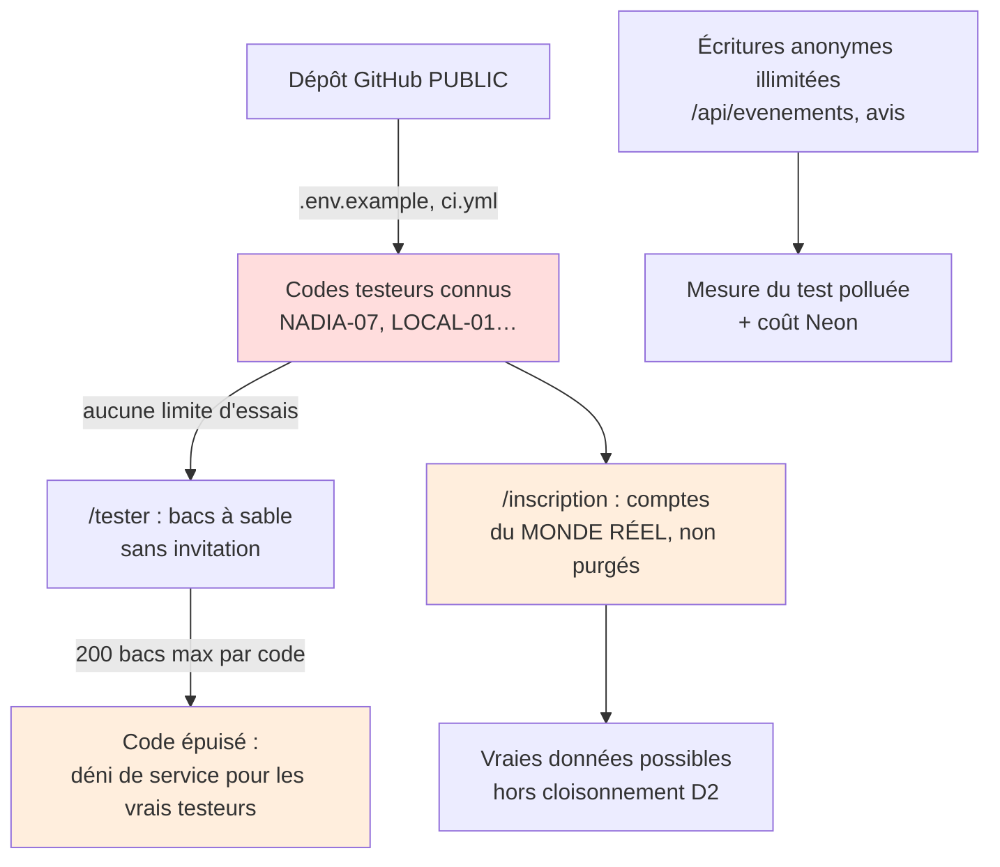
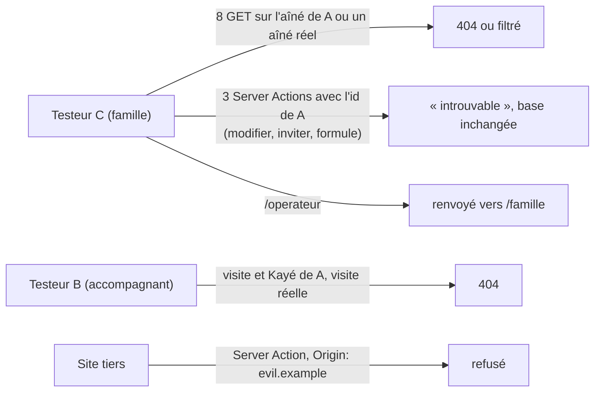

# Revue S1b : sécurité et RGPD avant la mise en ligne des testeurs

> **Rôle :** RSSI et DPO.
> **Objet :** MVP `plateforme/` (Next.js 15.5.27, Prisma, Vercel + Neon), état du dépôt au commit `09b4080`.
> **Références :** `docs/tech/specification-mvp.md` § 10 et § 14, ADR 0001 à 0003, `docs/revues/S1-juridique.md`, `docs/revues/S1-arbitrage.md`, `.env.example`, `next.config.ts`, `src/middleware.ts`.
> **Date :** 2026-10-04.
> **Méthode :** lecture du code, plus des **tests réels** sur un build de production (`next start`, port 3302, `NODE_ENV=production`, `DEMO_MODE=false`), avec Playwright (Chromium) et `curl`. Aucun fichier de code modifié. Aucun `pnpm db:seed`.

---

## 0. Verdict

| Étape | Verdict | Condition |
|---|---|---|
| **Mise en ligne pour les testeurs** | **NO-GO en l'état. GO dès que les 3 BLOQUANTS sont levés** | B1 à B3 sont surtout de la configuration (1 à 2 heures). Traitez aussi les MAJEURS « avant testeurs » M1 à M5 dans le même sprint |
| **Pilote réel** | **NO-GO** | Lever les MAJEURS « avant pilote » (M6, M7, P1 à P5) et les BLOQUANTS juridiques P1 à P5 de `S1-juridique.md` |

Le cloisonnement entre bacs à sable **tient** : 17 essais réels d'accès croisé ont échoué (voir § 4). Les failles principales ne sont pas dans le cloisonnement. Elles sont dans **l'accès au test** (codes publics), dans **la configuration de production** et dans **l'absence de limite de débit**.

---

## 1. BLOQUANTS avant la mise en ligne des testeurs

| # | Gravité | Vulnérabilité | Exploitation (testée) | Correction |
|---|---|---|---|---|
| **B1** | **BLOQUANT** | **Codes testeurs publics et devinables, sans limite d'essais.** Le dépôt `abbo-benhamid/Jarvis` est **public** (vérifié : `visibility: public`). Les codes `NADIA-07, DIASPORA-01, LOCAL-01, ACCOMP-01` sont dans `.env.example` (l. 25) ; `E2E-TEST, NADIA-07` dans `.github/workflows/ci.yml` (l. 41). Le format `MOT-NN` se devine. `startSandboxAction` et `registerAction` n'ont aucune limite d'essais | Test réel : 8 essais de dictionnaire → `LOCAL-01` ouvre un bac à sable. 48 essais de suite → aucun blocage. Conséquences : le contrôle D3 (accès sur invitation) ne protège plus rien ; tout le monde peut ouvrir un compte du monde réel par `/inscription` (voir M1) ; un attaquant peut créer 200 bacs à sable par code (`MAX_SANDBOXES_PER_CODE`) et **bloquer le code** pour les vrais testeurs | 1. En production, `TESTER_INVITE_CODES` = codes **aléatoires**, jamais ceux de l'exemple. Format conseillé : `NADIA-7K4Q-9XWM` (≥ 8 caractères aléatoires, `openssl rand -base64 6`). 2. Remplacez les codes de `.env.example` par `CODE-A-REMPLACER`. 3. Ajoutez une règle de limite de débit Vercel Firewall sur `POST /tester`, `POST /inscription`, `POST /connexion` (ex. 10 requêtes / minute / IP) [À VÉRIFIER : offre Vercel du projet]. 4. Un code par testeur : la limite de 200 bacs devient 5 |
| **B2** | **BLOQUANT** | **Identité et documents RGPD incomplets** (rappel T2, T3 de `S1-juridique.md`, décision D4). Le code est prêt, mais les valeurs manquent : `EDITEUR_*` et `DIRECTEUR_PUBLICATION` vides → « [à compléter] » ; date de fin du test « [à compléter] » dans `/confidentialite` et `/cgu-test` (art. 10) ; l'hébergeur Neon n'a ni raison sociale ni adresse dans `/mentions-legales` (l. 38) | Avec de vrais emails et de vrais contacts (offre « visite découverte »), un testeur ne peut ni identifier le responsable du traitement ni exercer ses droits (art. 13 RGPD). Le contact pour l'effacement est « [à compléter] » | 1. Renseignez les 4 variables d'identité sur Vercel. 2. Fixez la date de fin du test dans les deux pages. 3. Complétez Neon (Neon Inc., adresse). 4. Acceptez les DPA de Vercel et de Neon. 5. Ouvrez un registre des traitements d'une page (test produit, contacts « visite découverte ») |
| **B3** | **BLOQUANT** | **Valeurs d'exemple acceptées en production.** `getSessionSecret()` vérifie seulement la longueur (≥ 32). Le texte d'exemple `remplacez-moi-par-une-valeur-aleatoire-de-48-caracteres` fait 55 caractères : **il passe**. Même chose pour `CRON_SECRET` (≥ 16). Le secret d'exemple est public (dépôt public) | Si le fondateur copie `.env.example` sur Vercel, un attaquant signe un JWT HS256 valide pour n'importe quel `sub`. Avec l'id d'un compte (cuid), il prend ce compte, opérateur compris. `requireRole` relit le rôle en base : le rôle forgé ne suffit pas, mais l'id suffit | Liste de contrôle **avant** le premier testeur : `SESSION_SECRET` et `CRON_SECRET` générés par `openssl rand -base64 48` ; `DEMO_MODE=false` ; `NEXT_PUBLIC_TEST_MODE=true` ; codes de B1. Correction de code conseillée : refuser au démarrage toute valeur qui contient `remplacez-moi` ou `choisissez` |

---

## 2. MAJEURS

| # | Gravité | Quand | Vulnérabilité | Exploitation (testée ou lue) | Correction |
|---|---|---|---|---|---|
| **M1** | MAJEUR | Avant testeurs | **`/inscription` crée des comptes du monde réel, hors bac à sable.** Le lien est sur `/connexion` et dans les invitations. Ces comptes : email et nom réels, aucun `sandboxId`, **jamais purgés**, visibles par l'opérateur réel. Un accompagnant inscrit ainsi peut recevoir, après une proposition de l'opérateur, l'aîné (prénom, commune, indication d'adresse) d'une famille inscrite ainsi | Lu dans `registerAction` (aucun `sandboxId`) et `purge.ts` (purge par bac à sable seulement). Avec B1, n'importe qui crée ces comptes. Contredit D2 (« un monde par testeur ») et la politique (« fin du test + 1 mois ») | Si `DEMO_MODE != "true"`, fermez `/inscription` (redirection vers `/tester`) et retirez le lien de `/connexion`. Sinon, exigez un code d'inscription distinct et ajoutez ces comptes à la purge de fin de test |
| **M2** | MAJEUR | Avant testeurs | **Région des fonctions Vercel non fixée.** `vercel.json` n'a pas de clé `regions` ; aucun `preferredRegion`. Par défaut, Vercel exécute les fonctions à `iad1` (Washington, États-Unis) [À VÉRIFIER dans le tableau de bord du projet] | Les emails, contacts, avis et sessions sont traités aux États-Unis, puis envoyés à Neon (UE). L'ADR 0001 dit « Vercel (région UE) » : c'est faux en l'état. La politique de confidentialité ne le dit pas | Ajoutez `"regions": ["fra1"]` (proche de Neon `eu-central-1`) ou `["cdg1"]` dans `vercel.json`. Écrivez dans `/confidentialite` : « l'application tourne en UE ; Vercel Inc. reste une société américaine (DPF) » |
| **M3** | MAJEUR | Avant testeurs | **La déconnexion garde le cookie de reprise.** `logoutAction` supprime seulement `koudmen_session`. `koudmen_bac_a_sable` (30 jours) reste. `/tester` affiche alors « Reprendre mon test » | Test réel : après « Se déconnecter », cookies restants = `["koudmen_bac_a_sable"]` ; `/tester` propose la reprise. Sur un appareil partagé (famille, médiathèque), la personne suivante rouvre le bac à sable du testeur, voit son prénom et son lien de reprise | `logoutAction` supprime aussi `RESUME_COOKIE`. Ajoutez sur `/tester` un bouton « Oublier ce test sur cet appareil » |
| **M4** | MAJEUR | Avant testeurs | **Écritures anonymes illimitées.** `POST /api/evenements` (sans compte), `submitFeedbackAction` (sans compte), création de bac à sable (avec un code) : aucune limite | Test réel : 300 événements anonymes en 3,7 s (≈ 80/s depuis un seul poste) ; 100 avis anonymes sur 100 acceptés. Effets : base Neon remplie (coût, quota), **mesure du test faussée** (D15), opérateur noyé | Limite de débit Vercel Firewall sur `/api/evenements` et sur les Server Actions publiques. Côté code : plafond par IP en base ou en mémoire, avis anonymes ≤ 5 par heure, ignorer `page.view` en double dans la même seconde |
| **M5** | MAJEUR | Avant testeurs (règle WAF) / pilote (2FA) | **Aucune limite d'essais à la connexion. Pas de 2FA opérateur.** Le compte opérateur voit les contacts réels « visite découverte », tous les avis et le monde réel | Test réel : 50 essais de mot de passe, 0 blocage, 0 ralentissement, aucun journal d'échec. Atténuation constatée : `ops:create-operator` génère 24 caractères aléatoires et bcrypt 12 tours, donc la force brute en ligne reste lente. Le risque monte si un mot de passe choisi (`OPERATOR_PASSWORD`, 12 caractères min.) est utilisé | Avant testeurs : règle WAF sur `POST /connexion` ; mot de passe opérateur généré, jamais choisi ; un seul opérateur. Avant pilote : 2FA (TOTP) opérateur, verrouillage progressif, audit `auth.login_failed` |
| **M6** | MAJEUR | Avant pilote (procédure manuelle avant testeurs) | **Durées de conservation non appliquées.** Contacts « visite découverte » : la politique promet « au plus 6 mois », aucun job ne les efface ; `purgeSandboxIds` les garde exprès. Avis, événements, micro-réponses, comptes `/inscription`, journal d'audit du monde réel : aucune purge. Aucun écran pour effacer un contact ou noter un retrait d'accord | Lu dans `purge.ts` et la route cron. Un testeur qui retire son accord dépend d'une requête SQL manuelle | Avant testeurs : écrivez la procédure manuelle (qui, quelle requête, délai d'un mois) et une date de purge globale au calendrier. Avant pilote : le cron efface `DiscoveryRequest` > 6 mois et tout le reste à la date de fin ; bouton opérateur « Supprimer ce contact » audité |
| **M7** | MAJEUR | Avant pilote | **Session JWT non révocable** (ADR 0002 § 3). Durée 7 jours, opérateur compris | Test réel : jeton copié, déconnexion, puis `GET /famille` avec l'ancien jeton → **200**. Un jeton volé reste valide 7 jours. Seule parade : changer `SESSION_SECRET` (déconnecte tout le monde) | Version de session en base (`User.sessionVersion` vérifiée par `getCurrentUser`), incrémentée à la déconnexion et au changement de mot de passe. Session opérateur courte (8 à 12 h) |

---

## 3. MINEURS

| # | Gravité | Quand | Vulnérabilité | Exploitation | Correction |
|---|---|---|---|---|---|
| m1 | MINEUR | Avant pilote | **Énumération des emails** | Test réel : connexion en 8 ms pour un email inconnu, 350 ms pour un email connu (bcrypt seulement si le compte existe). `/inscription` répond « Email déjà utilisé » (code testeur requis) | Comparaison bcrypt factice si le compte n'existe pas. Message neutre à l'inscription |
| m2 | MINEUR | Avant pilote | **CSP avec `script-src 'unsafe-inline'`** (pas de nonce) | Aucun XSS trouvé (§ 4), mais la CSP n'arrête pas un futur XSS | CSP à nonce par le middleware Next.js |
| m3 | MINEUR | Avant pilote | **Lien de reprise** : jeton dans le **chemin** de l'URL (journaux Vercel), jamais renouvelé, non révocable, réutilisable 30 jours. Connexion forcée possible : un attaquant envoie SON lien de reprise ; la victime entre dans le bac à sable de l'attaquant | Test réel : le même lien rouvre la session à chaque appel (307 + nouveau cookie). Le jeton est bien aléatoire (32 octets) et stocké en SHA-256 | Bouton « Générer un nouveau lien » qui remplace l'empreinte ; page de confirmation avant de rouvrir (« Vous allez reprendre le test de … ») |
| m4 | MINEUR | Avant testeurs (texte) | **Politique incomplète sur des points précis.** `Feedback.userAgent` est collecté et non déclaré. `UsageEvent.userId` existe alors que le commentaire dit « aucune donnée personnelle ». Un code nominatif (`NADIA-07`) rend la mesure **pseudonyme**, pas anonyme | Lu dans `feedback.ts`, `events.ts`, `.env.example` l. 23-24 | Ajoutez « navigateur (user-agent) » à la ligne « Avis ». Écrivez « pseudonyme » ; préférez des codes non nominatifs (`T-7K4Q`) |
| m5 | MINEUR | Avant pilote | **Journalisation incomplète** | Pas d'audit des échecs de connexion, ni de la lecture des contacts réels (`/operateur/test`), ni de l'IP. L'export CSV est bien audité | Ajoutez `auth.login_failed` (sans mot de passe) et `discovery.viewed` |
| m6 | MINEUR | Avant testeurs | **Dépendances** : `pnpm audit --prod` → 5 alertes (3 hautes) : `postcss` ≤ 8.5.22 via `next`, `deepmerge-ts` < 8 via `prisma` | Outils de build seulement, pas de chemin d'exploitation à l'exécution trouvé | Mettez à jour `next` et `prisma` dès qu'un correctif existe ; `pnpm.overrides` pour `postcss` |
| m7 | MINEUR | Avant testeurs | **Historique git** : anciens mots de passe `demo-koudmen-2026` et `e2e-koudmen-2026`, secrets CI factices. **Aucun secret de production**, `.env` jamais commité (vérifié sur les 27 commits, toutes branches) | Le dépôt est public : ces valeurs sont connues | Ne réutilisez jamais ces valeurs. Activez le « secret scanning » GitHub. Envisagez un dépôt privé |
| m8 | MINEUR | Avant pilote | **Invitations Lakou** : tout membre du cercle (pas seulement le payeur) crée des invitations et lit les jetons actifs (`getInvitations`) | Un cousin invité peut faire entrer d'autres personnes dans le cercle | Invitation réservée au payeur, ou validée par lui ; ne pas renvoyer `token` aux non-payeurs |

### Points pour le pilote (hors test fictif)

| # | Gravité | Sujet | Correction |
|---|---|---|---|
| P1 | MAJEUR | `canAccessAine` donne l'accès à l'accompagnant **pour toujours** après une mission `TERMINEE` | Accès limité à la mission active + 30 jours |
| P2 | MAJEUR | Le **code domicile est fixe**. Un accompagnant qui l'a reçu une fois valide le facteur (b) sans venir. Les 5 essais max. par visite sont bien en place | Code à usage unique par visite, ou code tournant |
| P3 | BLOQUANT (pilote) | Kayé, `alertNote`, besoins : données de santé possibles sur Vercel + Neon (non HDS) | Rappel P4 de `S1-juridique.md` : HDS, AIPD, DPO |
| P4 | MAJEUR | Cloisonnement seulement applicatif (filtres Prisma) | RLS PostgreSQL (ADR 0003 § 3) |
| P5 | MAJEUR | Pas de réinitialisation de mot de passe ni de droit d'accès en libre-service | Écran « Mes données » (export, suppression) |

---

## 4. Ce qui est conforme (tests réels réussis)

| Contrôle | Résultat |
|---|---|
| IDOR en lecture, entre bacs à sable et vers le monde réel (11 URL : fiche, cercle, modification, formule, Kayé, visites, demande, visite et Kayé accompagnant) | **Aucune fuite.** 404, ou filtre sur les aînés du cercle (`?aine=` ignoré s'il n'est pas dans le cercle) |
| IDOR sur les Server Actions (requête légitime capturée puis rejouée avec l'id de l'aîné d'un autre bac à sable) | `updateAine`, `inviteLakou`, `changePlan` → « Nous ne trouvons pas cet élément dans votre cercle Lakou. » Base inchangée |
| Actions accompagnant | Propriété vérifiée par `ownedVisitWhere` / `ownedProposalWhere` (lecture du code) ; GET des visites d'un autre monde → 404 |
| Espace opérateur (`isRealOperator`) | Compte de bac à sable → renvoyé vers son espace. Requêtes opérateur filtrées sur `sandboxId = null`. Compte robot : mot de passe inutilisable et connexion refusée |
| Mode démo (`DEMO_MODE=false`) | Aucun bouton démo ; compte démo refusé même avec le bon mot de passe |
| Route cron | Sans en-tête : 401 ; mauvais secret : 401 ; `POST` : 405 ; comparaison `timingSafeEqual` |
| CSRF | Server Action rejouée avec `Origin: https://evil.example` → refusée (erreur 500 de Next.js) |
| XSS | Avis `<script>…` : affiché échappé chez l'opérateur, aucun dialogue, aucun `` injecté. Aucun `dangerouslySetInnerHTML` dans `src/` |
| Export CSV | `=HYPERLINK(…)`, `=1+1`, espace ou tabulation devant (supprimés par `trim`) → préfixe `'`. Saut de ligne : reste dans la cellule entre guillemets. Export audité, `Cache-Control: no-store` |
| En-têtes | CSP, `X-Frame-Options: DENY`, `nosniff`, `Referrer-Policy`, `Permissions-Policy`, HSTS, `X-Robots-Tag: noindex` ; `robots.txt` : `Disallow: /` ; `no-referrer` sur le lien de reprise |
| Cookies | `koudmen_session` et `koudmen_bac_a_sable` : `HttpOnly`, `Secure`, `SameSite=Lax` |
| Redirection ouverte | `next=//…`, `/\…`, `/<tab>/…`, `/<LF>/…` : aucune sortie vers un autre domaine |
| Secrets | `.env` ignoré et jamais commité ; jeton de reprise stocké en SHA-256 ; aucun secret ni contact dans l'audit |

---

## 5. RGPD : synthèse DPO

| Traitement | Données réelles | Base légale | Durée affichée | Durée appliquée | Écart |
|---|---|---|---|---|---|
| Bac à sable | prénom choisi, code testeur | intérêt légitime [À VÉRIFIER AVEC UN AVOCAT] | 30 jours | **30 jours (cron)** | Aucun |
| Comptes `/inscription` | nom, email, mot de passe haché | intérêt légitime | fin du test + 1 mois [date à compléter] | **aucune** | M1, M6 |
| Avis | note, message, page, code, **user-agent** | intérêt légitime | fin + 1 mois | **aucune** | m4, M6 |
| Mesure d'usage | pages, étapes, `userId`, code | intérêt légitime | fin + 1 mois | **aucune** | m4, M6 |
| Visite découverte | prénom, email ou téléphone | **consentement** (texte exact et date gardés : conforme) | ≤ 6 mois | **aucune** | M6 |
| Hébergement | tout | DPA art. 28 | — | région US par défaut | M2, B2 |

Consentement de l'aîné : non applicable au test (aînés fictifs). Données de santé : interdites par les CGU et rappelées sur la page ; aucun champ médical. Le risque reste le texte libre (voir P3).

---

## 6. Trace des tests

- Bacs à sable créés dans la base **locale** pendant la revue : environ 10 (codes `NADIA-07` et `LOCAL-01`), plus 107 avis de test et environ 300 événements anonymes. La purge à 30 jours les effacera. Les avis et les événements restent (comportement prévu).
- Scripts de test : dans le répertoire de travail de l'agent (hors dépôt).

---

## 7. Résumé

**Décompte :** 3 BLOQUANTS · 7 MAJEURS · 8 MINEURS, plus 5 points pour le pilote (dont 1 BLOQUANT pilote déjà connu, HDS).

**Les 5 points les plus importants :**

1. **B1 : codes testeurs publics et devinables, sans limite d'essais.** Le dépôt est public. `LOCAL-01` trouvé en 8 essais. Le contrôle D3 ne protège plus rien.
2. **B3 : valeurs d'exemple acceptées en production.** Le `SESSION_SECRET` d'exemple passe le contrôle de longueur. Il permettrait de forger des sessions.
3. **B2 : identité de l'éditeur, contact RGPD, date de fin, DPA.** Ils manquent alors que de vrais contacts seront recueillis.
4. **M1 : `/inscription` ouvre des comptes du monde réel.** Ces comptes ne sont jamais purgés et sortent du cloisonnement D2.
5. **M2 + M4 : région Vercel US par défaut, écritures anonymes illimitées.** Il y a un transfert hors UE non déclaré. La mesure du test peut être faussée.

**Verdict final : NO-GO en l'état. GO pour les testeurs dès que B1 à B3 sont levés (surtout de la configuration). Traitez M1 à M5 dans le même sprint.** Le cloisonnement entre bacs à sable a résisté à tous les essais réels.
