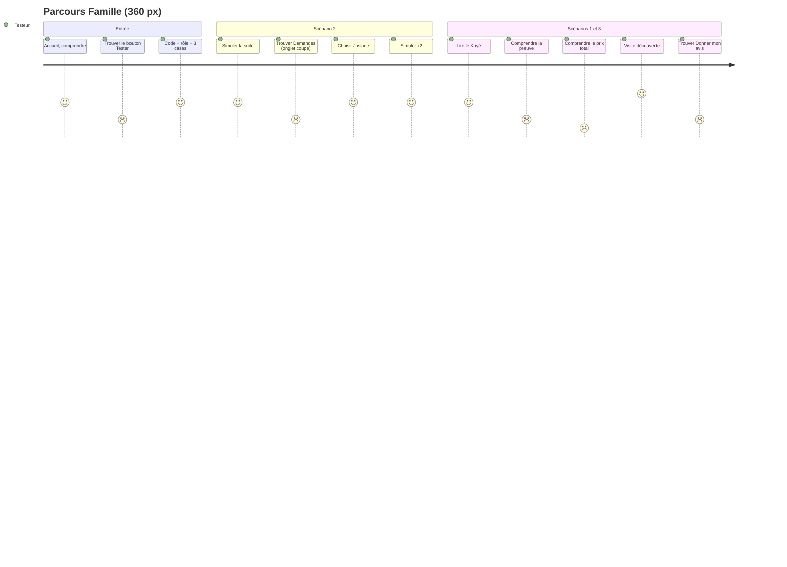
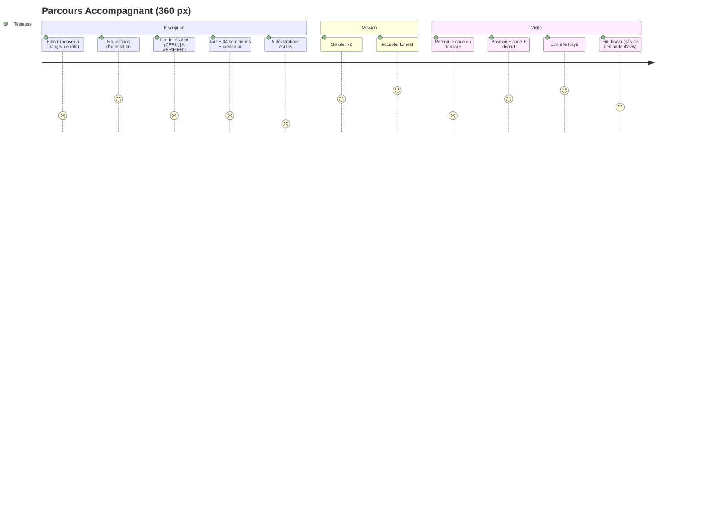
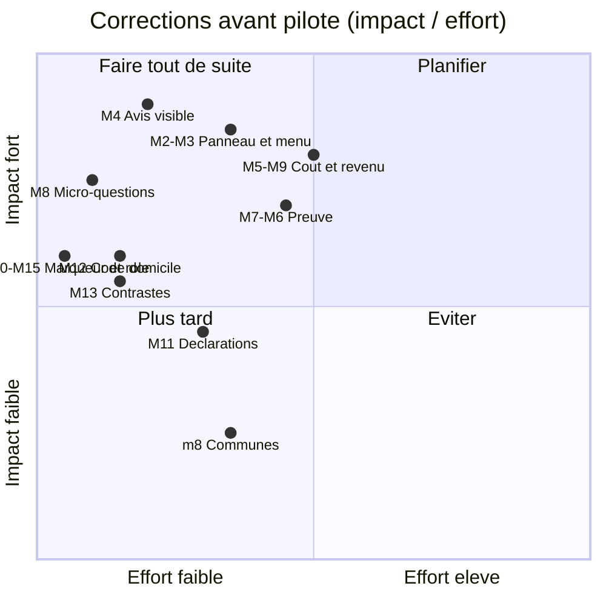

# Revue UX et accessibilité S1b — Parcours testeur réel

> **Rôle :** expert accessibilité et UX (publics seniors, faible littératie numérique).
> **Objet :** le MVP `plateforme/` (build local, port 3303), parcours testeur complet en rôle **Famille** et en rôle **Accompagnant**.
> **Références :** [`docs/tech/specification-mvp.md`](../tech/specification-mvp.md) § 14, [`docs/revues/S1-produit.md`](S1-produit.md) § 7 à § 9 (protocole de test).
> **Date :** 5 octobre 2026.
> **Méthode :** navigation réelle avec Playwright (Chromium), 4 configurations : 360 px et 390 px, thème clair et thème sombre. Audit **axe-core 4.13** (WCAG 2.0/2.1/2.2 A et AA + bonnes pratiques) sur chaque écran. Mesures à la main : contraste des jetons de couleur, taille des cibles, ordre du clavier, texte à 150 % et 200 %, largeur 320 px, réseau lent (400 kb/s, 400 ms).
> **Captures :** `/tmp/claude-0/-home-user-Jarvis/c58b0422-bce4-55e5-a168-05a20f9d1a6b/scratchpad/shots-ux/` (`00-*` accueil, `F*` famille, `A*` accompagnant, `G*` cercle et formule, `K*` clavier, `Z*` zoom, `V*` premier écran). Chaque capture a un `.txt` (texte de la page) et un `axe-*.json`.

---

## 0. Verdict

**GO sous conditions.** Les deux parcours vont jusqu'au bout, dans les 4 configurations, sans erreur. Il n'y a **aucun blocage dur**. Mais **17 points majeurs** vont fausser le test ou ralentir les testeurs. Corrigez au moins les **8 premiers du § 6** avant la session pilote.

| Gravité | Nombre | Sens |
|---|---|---|
| 🔴 Bloquant | **0** | Le testeur ne peut pas finir. |
| 🟠 Majeur | **17** | Le testeur hésite, se trompe, ou la mesure est faussée. |
| 🟡 Mineur | **18** | Gêne, finition, conformité partielle. |
| 🔵 Suggestion | **6** | Amélioration utile, pas nécessaire au test. |

Ce qui marche bien :

- Aucun défilement horizontal à 320, 360 et 390 px (texte à 100 %).
- Le thème sombre est propre : axe ne trouve **aucun** défaut de contraste en sombre.
- Tous les champs ont un libellé. Les messages du bouton « Simuler la suite » sont annoncés (`role="status"`, `aria-live`). Lien d'évitement, `lang="fr"`, un titre de page par écran.
- Les erreurs sont utiles : « Votre tarif est sous le minimum légal… Augmentez votre tarif. », « Le code n'est pas correct. Il vous reste 4 essais. ». Le formulaire garde les réponses après une erreur.
- Réseau lent (3G rural simulé) : **130 Ko**, premier affichage en **1,4 s**, page chargée en **3,5 s**. Très bon.
- Les boutons principaux font 44 px ou plus. Le formulaire du Kayé (humeur, appétit, activités) est rapide au pouce.
- Le ton est juste : « Manman dit « mwen bien » », « Léonie m'a raconté le carnaval de 1962 », rappel « En cas d'urgence, appelez le 15 ».

---

## 1. Le test des 30 secondes

**Question :** un testeur comprend-il la proposition de valeur en 30 secondes ?

**Réponse : oui pour le « quoi », non pour le « combien » et la « preuve ».**

Sur un écran de 360 × 640 px (Android moyen de gamme), le testeur voit seulement le bandeau de test, le titre et cette phrase (`V-accueil-360x640.png`) :

> « Koudmen envoie quelqu'un du quartier, et vous dit ce qui s'est vraiment passé. »

Cette phrase contient les deux idées du critère S1-produit § 9.4 : **« quelqu'un sur place »** et **« nouvelles »**. Un enfant de la diaspora antillaise reconnaît « Manman » et « mwen bien ». Le seuil de 70 % est atteignable. [À VÉRIFIER] en session.

Ce qui manque dans les 30 premières secondes :

| Manque | Effet |
|---|---|
| Pas de bouton « Tester Koudmen » en haut. Il est à **2 308 px**, soit **3,6 écrans** plus bas. | Le testeur qui arrive par l'accueil doit défiler longtemps. |
| Pas de prix, même « à partir de ». | Le testeur ne sait pas si c'est 10 € ou 300 €. Il ne peut pas juger la valeur. |
| La preuve de visite apparaît seulement dans l'exemple de Kayé, plus bas. | « Preuve » sera rarement citée au test des 30 secondes. |
| Le bandeau jaune « Version de test… » prend 96 px, soit 15 % de l'écran. | Il est nécessaire (juridique), mais il pousse le message vers le bas. |

**Dans l'application**, c'est plus grave : le premier écran après l'entrée est le panneau « Votre test · 0/10 étapes », avec « Simuler la suite », les robots et une liste de 10 étapes. La fiche de Léonie commence à **~1 000 px**. La première impression est « un jeu avec des robots », pas « des nouvelles de Léonie ».

```mermaid
flowchart LR
  A["Accueil<br/>message clair ✅"] -->|"défiler 3,6 écrans 🟠"| B["Tester Koudmen<br/>code + rôle"]
  B -->|"rôle Famille présélectionné 🟠"| C["Espace testeur"]
  C -->|"panneau = tout le 1er écran 🟠"| D["Contenu réel<br/>(Léonie, Kayé)"]
  D --> E["Simuler / choisir / lire"]
  E -->|"micro-question AVANT le contenu 🟠"| F["Kayé, preuve, formules"]
  F -->|"prix total flou 🟠"| G["Visite découverte ✅"]
  G -->|"bouton avis = icône seule 🟠"| H["Donner mon avis"]
```

---

## 2. Où le testeur bloque-t-il ? (parcours réels)

### 2.1 Rôle Famille (DIASPORA-01, 18 écrans par configuration)

Points de friction observés :

1. **L'onglet « Demandes » est coupé** (« Deman… ») et « Formule » est invisible à 360 px. La navigation défile à l'horizontale sans signe visible (`F04`).
2. **Deux cartes identiques** « Léonie J. — Accompagnant trouvé — Josiane L. a accepté » après le choix (`F09`). Le testeur ne sait pas laquelle est la sienne.
3. **La micro-question « Ce Kayé vous rassure-t-il ? » est au-dessus du Kayé** (`F10`). Le testeur répond avant d'avoir lu. Idem sur Visites : « Comprenez-vous comment Koudmen prouve… ? » est au-dessus de l'explication, qui est repliée (`F12`).
4. **La famille peut appuyer sur « L'aîné a confirmé (appel simulé) »** (`F12`), et la page du cercle dit « Les membres du cercle… peuvent confirmer une visite » (`G02`). Le testeur peut conclure : « c'est moi qui valide la visite ». Cela affaiblit l'hypothèse H-Preuve.
5. **Prix total introuvable** (`F13`). « Sérénité dès 149 €/mois — 1 visite par semaine », puis « Les heures d'accompagnement se paient à part, à l'accompagnant ». Le testeur ne sait pas ce qu'il paie au total (abonnement + salaire + cotisations − crédit d'impôt).
6. **Le bouton « Donner mon avis » est une icône seule** (bulle jaune) sur mobile. Le texte est caché (`sr-only`). Il n'y a pas d'invitation à donner son avis à la fin.

### 2.2 Rôle Accompagnant (ACCOMP-01, 29 écrans par configuration)

Points de friction observés :

1. **Rôle « Famille » coché par défaut** sur `/tester`. Une accompagnante qui va vite joue le mauvais rôle.
2. **Résultat d'orientation : « [À VÉRIFIER] » s'affiche au testeur** (`A07`). Marqueur interne visible.
3. **Pas de revenu net** (`A08`). Le protocole demande « Dites si le revenu net affiché vous convient » : l'étape est impossible. L'aide parle de « salaire horaire brut », « SMIC 2026 », « convention IDCC 3239, à confirmer ».
4. **34 communes à cocher**, en liste plate de ~2 200 px (`A08`). Pas de regroupement Nord / Centre / Sud.
5. **5 déclarations écrites obligatoires**, chacune avec son bouton « J'ai fourni » (`A11`). C'est 10 actions avant « Demander la vérification ». Les 5 champs ont le même libellé « Votre déclaration ».
6. **Le code du domicile apparaît une seule fois**, dans le message du panneau après « Simuler la suite » (« Ernest vous donne le code du domicile : FRZ9HF »). Si la testeuse ouvre « Visites » par le menu ou recharge la page, le code disparaît. Elle peut finir avec la position seule (1 preuve sur 3), mais la visite reste « à vérifier ».
7. Fin du parcours : « Le parcours est terminé : bravo ! ». **Aucune demande d'avis.**

---

## 3. Accessibilité WCAG 2.2 AA

### 3.1 Résultat axe-core (toutes configurations)

| Règle axe | Impact | Où | Nombre |
|---|---|---|---|
| `color-contrast` | sérieux | Badge vert « Accompagnant trouvé », « Validée », « Profil validé » : #3a8a3f sur #e1f0e1 = **3,63:1** (14 px normal, il faut 4,5:1). Thème clair seulement. | 1 à 6 par page, 9 écrans |
| `definition-list` + `dlitem` | sérieux | `/famille` : `<dl>` contient des `div > div` ; `dt`/`dd` hors `dl` (bloc « Prochaine visite / Dernier Kayé »). | 5 nœuds |
| `region` | modéré | Pied de page `.text-center` hors repère (`footer`). | toutes les pages |

Aucun défaut axe en thème sombre (hors `region` et `dl`).

### 3.2 Contrôles à la main

| Critère | Mesure | Statut |
|---|---|---|
| 1.4.11 Contraste non textuel — **anneau de focus** | Jaune #e0a21b sur fond #f3f6f5 = **2,06:1** ; sur blanc = 2,25:1 ; sur #dcefeb = 1,88:1. Il faut 3:1. | ❌ |
| 1.4.11 — **bordure des champs** | #cfdcd9 sur blanc = **1,41:1** (thème sombre : 1,43:1). Les zones de saisie sont presque invisibles pour une vue faible. | ❌ |
| 1.4.4 / 1.4.10 — texte agrandi | Texte à 150 % : l'en-tête public (logo + « Se connecter ») ne passe pas à la ligne → page de **452 px** pour 360 px. À 200 % : 593 px. Réglage « grande police » courant chez les seniors Android. | ❌ |
| 1.4.10 Redistribution à 320 px | Pas de défilement horizontal (`/`, `/tester`). | ✅ |
| 2.5.8 Taille de cible (24 px) | Liens de la liste des scénarios : **16 px de haut**, 4 px d'écart. Ce ne sont pas des liens dans une phrase : l'exception ne s'applique pas. | ❌ |
| 2.5.8 — cases à cocher | Cases de 20 px, mais dans des étiquettes de 44 px ou plus. | ✅ |
| 2.4.11 Focus non masqué | Le bouton flottant (56 px) cache le bas droit de l'écran : titres h1 (« Demandes d'accompagnement », « Le cahier des visit… »), bouton « Refaire l'orientation », texte « Pas de diagnostic, pas de médicament ». | 🟡 partiel |
| 2.4.3 Ordre du focus | Clavier sur `/tester` : lien d'évitement → logo → Se connecter → code → rôle → prénom → cases → bouton → liens → avis. Logique. | ✅ |
| 1.3.1 / 2.4.6 Titres | Le panneau de test est un **h2 avant le h1** de chaque page. Le lecteur d'écran lit la liste des 10 étapes avant le contenu. | 🟡 |
| 1.3.3 Caractéristiques sensorielles | « Vérifiez les champs en rouge. » | 🟡 |
| 4.1.3 Messages d'état | « Simuler la suite », micro-questions, enregistrement : `role="status"`. | ✅ |
| 3.3.1 / 3.3.3 Erreurs | Messages précis, proches du champ, avec correction. | ✅ |
| 1.4.3 thème sombre | axe : aucun défaut. | ✅ |

---

## 4. Textes : STE et compréhension par un non-initié

### 4.1 Les termes du produit

| Terme | Où il apparaît d'abord | Expliqué ? | Compris par un non-initié ? |
|---|---|---|---|
| **Kayé** | Accueil (« Kayé de Léonie ») | Seulement sur la page Kayé : « Le cahier des visites ». | 🟡 La diaspora devine (« cahier »). Les autres non. Ajoutez « (le cahier de visite) » au premier usage. |
| **Cercle Lakou** | Espace famille (« Cercle Lakou (2) ») | Non, sauf sur la page du cercle. | ❌ « Lakou » = la cour familiale. Le mot est connu aux Antilles, mais ici il désigne **deux choses** : le cercle des proches **et** la formule gratuite « Lakou ». Contraire à la règle STE « un terme = un sens ». |
| **Preuve 2/3** | Accueil : « Deux preuves sur trois : la position…, le code…, son appel ». | ✅ Bien expliqué à l'accueil. | 🟡 Dans l'app, « Preuves : 0 sur 3 (2 suffisent) » est clair. Mais la famille peut « confirmer pour l'aîné » (voir § 2.1 point 4). |
| **Bac à sable** | En-tête, panneau, page `/tester` | « un petit monde fictif, pour vous seul » | 🟡 Métaphore d'informaticien. Préférez « Votre test » ou « Monde de test ». |
| **Simuler la suite** | Panneau | « fait jouer les robots » | 🟡 Compris après un essai. « Faire avancer l'histoire » est plus parlant. |
| **Kozé, Sérénité** | Formules | Non | ❌ « Kozé » (causer) n'est pas relié à « appel hebdomadaire ». |
| **Niveau 1 — Lien … Niveau 3 — Présence et autonomie** | Fiche, demandes, orientation | En partie | 🟡 Utile pour l'équipe, abstrait pour la famille. |
| **CESU, SAAD, SAP, B3, PSC1, IDCC 3239, SMIC** | Orientation, profil, vérifications, demandes | SAAD seulement | ❌ Jargon administratif. Une phrase de 8 mots par sigle suffit. |
| **Check-in, check-out** | Visite accompagnant | Non | 🟡 Anglicisme. « Arrivée » / « Départ ». |

### 4.2 Finitions de langue

- « Ernest B.. » (deux points), « Humeur de Ernest », « Le cercle Lakou de Ernest » → « d'Ernest ».
- « 1 octobre 2026 » → « 1er octobre ».
- « Salarié de la famille (CESU) » affiché pour une femme (Josiane, Ghislaine) → accord du genre ou formule neutre.
- Formes « choisi(e) », « visite(s) planifiée(s) », « intéressé(e) » : difficiles à lire. Écrivez le nombre réel (« 4 visites planifiées »).
- « Cliquez encore » sur téléphone → « Touchez encore ». L'app dit déjà « touchez » ailleurs.
- Titre d'accueil : le guillemet « » » passe seul en début de ligne à 360 px. Utilisez des espaces insécables.
- Deux messages différents pour un code faux : « Code inconnu. Vérifiez le code reçu… » et « Ce code testeur n'est pas valide. ».

### 4.3 Culture et ton

- ✅ Ton respectueux des aînés. Créole bien dosé (« Manman », « mwen bien »). Lieux crédibles (Savane, Terres-Sainville, galerie, dominos).
- ✅ « Ce n'est pas une alerte médicale… appelez le 15 » : rassurant et responsable.
- 🟡 Pas de bouton **« Partager sur WhatsApp »** pour inviter un proche. Pour la diaspora, c'est le canal naturel (S1-produit § 7.1).
- 🟡 Le protocole parle d'**Ernest au Lamentin** ; l'app dit **Fort-de-France**.

---

## 5. Tableau complet des constats

Légende des écrans : `F` = famille, `A` = accompagnant, `G` = cercle/formule. Les captures existent en `-360-clair`, `-360-sombre`, `-390-clair`, `-390-sombre`.

### 5.1 🟠 Majeur (17)

| # | Écran | Problème | Correction |
|---|---|---|---|
| M1 | Accueil public (`00-accueil-*`, `V-accueil-360x640`) | Le bouton « Tester Koudmen » est à 2 308 px (3,6 écrans). Aucun bouton au premier écran. | Ajoutez le bouton juste sous la phrase d'accroche, et dans l'en-tête à la place de « Se connecter » sur mobile. |
| M2 | Toutes les pages connectées (`F04`, `A01`) | Le panneau de test occupe tout le premier écran (300 à 1 000 px). Le contenu réel est caché. Le panneau est un h2 avant le h1. | Panneau réduit à **une barre d'une ligne** : « Étape 3/10 : choisissez un profil → [Simuler la suite] ». Liste complète dans un bouton « Voir les 3 scénarios ». Placez le h1 avant. |
| M3 | Navigation (`F04`, `A01`) | Onglets coupés : Famille « Deman… », « Formule » invisible ; Accompagnant « Profil », « Vérifications », « Mon statut » invisibles. Aucun indice de défilement. | Passez la navigation sur 2 lignes (`flex-wrap`) ou en barre du bas à 4 entrées + « Plus ». |
| M4 | Bouton « Donner mon avis » (toutes pages) | Icône seule sur mobile. Il cache du contenu (titres, boutons). Aucune invitation à donner son avis en fin de parcours. | Texte visible « Mon avis » dans le bouton. Le placer dans le flux à la fin des pages, ou réduire le bouton. À 10/10 ou 9/9 : écran « Merci ! 3 questions » qui ouvre le formulaire. |
| M5 | Formules (`F13`, `G03`) | Prix total impossible à calculer. « Sérénité 149 € — 1 visite par semaine » contredit « les heures se paient à part ». Noms « Kozé » et « Sérénité » non expliqués. « Lakou » = cercle et formule. | Un exemple chiffré par formule : « Exemple : 4 visites de 2 h par mois = 149 € + 120 € de salaire, soit ~195 € après crédit d'impôt » [À VÉRIFIER] chiffres. Renommer la formule gratuite (« Cercle », « Gratuit »). |
| M6 | Kayé famille (`F10`) | Le Kayé ne montre pas la preuve de la visite. Sur l'accueil, l'exemple dit « Visite vérifiée. Josiane est arrivée à 14 h 02. Position vérifiée. Code du domicile correct. » Le lien entre nouvelles et preuve est perdu. | Ajoutez le « reçu de visite » en tête de chaque Kayé, comme sur l'accueil. |
| M7 | Visites famille (`F12`), cercle (`G02`) | La famille appuie sur « L'aîné a confirmé (appel simulé) ». Le cercle « peut confirmer une visite ». Le testeur croit qu'il valide lui-même. | Faire jouer l'appel par le robot (« Simuler la suite ») ou écrire « Jouer le rôle de Léonie : elle tape 1 au téléphone ». Retirer « peuvent confirmer une visite » ou l'expliquer. |
| M8 | Kayé (`F10`), Visites (`F12`) | Micro-questions placées **avant** le contenu (et avant l'explication repliée). Réponses biaisées (H-Kayé, H-Preuve). | Placer la question **sous** le Kayé lu / sous l'explication, ou l'afficher après 10 s ou après défilement. |
| M9 | Profil accompagnant (`A08`) | Pas de revenu net estimé. Étape 2 du protocole impossible. Aide jargonneuse (IDCC 3239, SMIC, « à confirmer »). | Afficher en direct : « Pour 14 € brut/h : environ 11 € net/h. 4 visites d'1 h = ~44 € net par mois. » [À VÉRIFIER] taux. Phrase simple : « Minimum légal : 12,02 € brut de l'heure. » |
| M10 | Résultat d'orientation (`A07`) | « [À VÉRIFIER] » visible par la testeuse. | Retirer le marqueur de `server/rules/orientation.ts` (texte affiché) et le garder en commentaire. Vérifier aussi `request-form.tsx` (même marqueur dans un texte affiché). |
| M11 | Vérifications (`A11`, `A12`) | 5 textes à écrire + 5 boutons avant « Demander la vérification ». 5 champs avec le même libellé « Votre déclaration ». | En test : 5 cases à cocher « J'ai ce document » + un seul bouton. Libellé unique par champ : « Votre déclaration — pièce d'identité ». |
| M12 | Visite accompagnant (`A18`, `A20`) | Le code du domicile n'existe que dans le message éphémère du panneau. Perdu après navigation ou rechargement. | En mode test, afficher sur la page de la visite : « Code affiché chez Ernest (test) : FRZ9HF ». |
| M13 | Global (CSS) | Anneau de focus jaune à 2,06:1 ; bordures de champs à 1,41:1 ; badge vert à 3,63:1 (axe sérieux, 9 écrans). | Focus : double anneau (jaune + liseré `--fg`) ou couleur ≥ 3:1. Bordure des champs : `--line` plus foncé pour les contrôles (≥ 3:1, ex. #7d918e). Badge vert : texte #2d6e31 ou plus foncé. |
| M14 | En-tête public (`Z-360-x2_*`) | Texte à 150 % : défilement horizontal (452 px). Gêne les seniors qui agrandissent la police d'Android. | `flex-wrap` sur l'en-tête public ; « Se connecter » passe sous le logo. |
| M15 | `/tester` (`K-focus-4`) | Rôle « Famille » coché par défaut. Une accompagnante pressée joue le mauvais parcours. | Aucun rôle coché par défaut, ou rôle déduit du code (ACCOMP-xx → Accompagnant). |
| M16 | Tout le parcours | Jargon non expliqué : Bac à sable, Kayé, cercle Lakou, Niveaux, CESU, SAAD, SAP, B3, PSC1, check-in. | Explication de 8 mots au premier usage (voir § 4.1). Un mini-glossaire dans le panneau de test. |
| M17 | Protocole vs app | Écarts : Ernest au Lamentin (protocole) / Fort-de-France (app) ; scénario 3 du protocole (remplacement de Josiane, proposition « en direct ») absent de l'app ; « revenu net affiché » absent. | Aligner `S1-produit` § 9.2 sur les 3 scénarios réels de l'app, ou ajouter les écrans manquants. Briefer l'animateur. |

### 5.2 🟡 Mineur (18)

| # | Écran | Problème | Correction |
|---|---|---|---|
| m1 | Panneau de test | Liens des étapes : 16 px de haut, 4 px d'écart (2.5.8). | `min-h-11` ou `py-2` sur chaque lien. |
| m2 | `/famille` | `<dl>` mal formé (axe sérieux). | `dt`/`dd` dans des `div` enfants directs du `dl`. |
| m3 | Toutes | Pied de page hors repère (axe `region`). | Mettre le texte dans `<footer>`. |
| m4 | Demandes (`F07`) | Message du panneau périmé après le choix (« Koudmen vous propose 3 profils… »). | Effacer le message après une action hors panneau. |
| m5 | Demandes (`F09`) | Deux cartes « Accompagnant trouvé » identiques. | Distinguer : « Demande de Nadia (août) » / « Demande de Frédéric (aujourd'hui) ». |
| m6 | Demandes (`F06`) | « Envoyée par Frédéric » : le testeur ne sait pas qui est Frédéric. | « Frédéric, votre frère (robot) ». |
| m7 | Textes | « Ernest B.. », « de Ernest », « 1 octobre », « Salarié » au masculin, « (e) », « (s) », « Cliquez ». | Voir § 4.2. |
| m8 | Profil (`A08`) | 34 communes en liste plate (~2 200 px). | Regrouper Nord / Centre / Sud, replié ; ou champ de recherche. |
| m9 | Orientation (`A02`–`A06`) | « Question suivante » grisé sans explication. | Garder le bouton actif et dire « Choisissez une réponse ». |
| m10 | Profil (`A08`) | Le texte indicatif « 15 » dans le tarif ressemble à une valeur saisie. | Retirer le placeholder ; mettre l'exemple dans l'aide. |
| m11 | Formulaires | « Vérifiez les champs en rouge » (couleur seule). | « Corrigez les 2 champs signalés ci-dessous. » + lien vers le 1er. |
| m12 | `/tester` (`F03`) | « diaspora 01 » (espace) refusé ; deux messages différents. | Normaliser espace → tiret ; un seul message. |
| m13 | Cercle (`G02`) | Pas de partage WhatsApp de l'invitation. | Bouton « Envoyer par WhatsApp » (`https://wa.me/?text=`). |
| m14 | Formules (`G03`) | « Choisir Kozé » active la formule en un toucher. | Écran de confirmation : « Vous choisissez Kozé, 39 €/mois (simulé). Confirmer ? » |
| m15 | Avis (`F18`) | « Page concernée : /famille » (chemin technique). « Votre note » : note de quoi ? | « Page : Accueil famille ». « Votre note pour cette page ». |
| m16 | Panneau | Étape « Trouvez la visite À vérifier » cochée par simple visite de la page Visites (même règle que l'étape « preuve »). | Cocher l'étape à l'ouverture de la visite « à vérifier ». |
| m17 | Panneau (`F04`) | Lien de reprise = `http://localhost:3000/...` (APP_URL du `.env` local ≠ port réel). | Vérifier `APP_URL` en production. [À VÉRIFIER] Sinon, la reprise sur un autre appareil est cassée. |
| m18 | Visite accompagnant (`A20`) | « Simuler ma position au domicile » : bouton sans bordure, peu visible. « Se connecter » dans l'en-tête public attire les testeurs vers un mot de passe. | Bouton secondaire avec bordure. Sur mobile, remplacer « Se connecter » par « Tester ». |

### 5.3 🔵 Suggestions (6)

| # | Suggestion |
|---|---|
| S1 | Accueil : ajouter une ligne « À partir de 39 €/mois. Sans engagement. » [À VÉRIFIER] prix retenus. |
| S2 | Panneau : afficher **l'étape suivante** en gros (« Maintenant : lisez le Kayé de Léonie »), pas seulement la liste. |
| S3 | Écran de fin de test (10/10, 9/9) : « Merci ! » + 3 questions du § 9.3 + bouton avis. |
| S4 | Kayé riche (photo fictive, mot vocal simulé) et aperçu WhatsApp (S1-produit § 7.1) : c'est l'émotion qui vend. |
| S5 | Proposer un mode « texte plus grand » dans l'app (bouton A+) pour les aidantes en Martinique. |
| S6 | Profils proposés : une photo fictive ou un avatar, et une phrase « Ce que Josiane aime faire ». Le choix d'une personne est émotionnel. |

---

## 6. Les 8 corrections à faire avant le pilote

Classées par rapport impact / effort. Toutes sont du texte, du CSS ou de la mise en page.

| Ordre | Constat | Effort |
|---|---|---|
| 1 | **M4** Bouton « Mon avis » visible + demande d'avis en fin de parcours | 2 h |
| 2 | **M2 + M3** Panneau d'une ligne + navigation sur 2 lignes | 4 h |
| 3 | **M8** Micro-questions sous le contenu | 1 h |
| 4 | **M10 + M15** Retirer « [À VÉRIFIER] » ; aucun rôle par défaut | 30 min |
| 5 | **M12** Code du domicile visible sur la page de visite (mode test) | 1 h |
| 6 | **M13** Contrastes : focus, bordures de champs, badge vert | 1 h |
| 7 | **M5 + M9** Exemple de coût total (famille) et revenu net (accompagnant) | 4 h + validation chiffres [À VÉRIFIER] |
| 8 | **M7 + M6** Preuve : reçu dans le Kayé ; appel joué par le robot | 3 h |

---

## 7. Verdict final

**GO sous conditions pour les testeurs.**

- **Accessibilité :** non conforme WCAG 2.2 AA en l'état, sur 5 critères (1.4.3 badge vert, 1.4.11 focus et bordures, 1.4.4/1.4.10 en-tête à 150 %, 2.5.8 liens des étapes, 1.3.1 liste `dl`). Les corrections sont petites (CSS surtout). Le thème sombre et le clavier sont bons.
- **Compréhension :** la promesse « quelqu'un du quartier + des nouvelles » passe en 30 secondes. Le **prix** et la **preuve** ne passent pas encore.
- **Parcours :** les deux rôles se terminent sans aide, mais 4 points vont coûter des minutes et des abandons : menu coupé, panneau envahissant, 5 déclarations, code du domicile éphémère.
- **Mesure :** 2 points faussent les résultats : micro-questions avant le contenu, bouton d'avis peu visible. Corrigez-les **avant** la première session, sinon les chiffres de H-Kayé et H-Preuve ne seront pas fiables.

Note : cette revue a créé environ 20 bacs à sable de test dans la base locale (codes ACCOMP-01, DIASPORA-01, LOCAL-01). Aucune donnée de démo n'a été modifiée. `pnpm ops:purge-sandboxes` peut les effacer.
