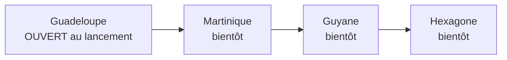

# T1 — Lancement en Guadeloupe d'abord : décisions de l'orchestrateur

> Demande du fondateur (2026-10-09) : commencer en **Guadeloupe**. Martinique, Guyane et Hexagone viennent plus tard.

## Décisions

| # | Sujet | Décision |
|---|---|---|
| T1 | Modèle | Le territoire devient une **donnée**, plus un texte en dur. Énum `Territoire` : `GUADELOUPE`, `MARTINIQUE`, `GUYANE`, `HEXAGONE`. Un seul fichier de configuration par territoire : nom, fuseau IANA, indicatifs téléphone, liste des communes avec leur centre, état `OUVERT` ou `BIENTOT`, organismes locaux (DEETS, CGSS, ARS) |
| T2 | Ouverture | Au lancement, seul `GUADELOUPE` est `OUVERT`. Les autres territoires affichent « Bientôt » et une **liste d'attente** (e-mail + territoire + consentement) |
| T3 | Rattachement | L'aîné, la demande, la mission et le profil accompagnant portent un territoire. Les propositions de profils restent **dans le même territoire**. Une famille de la diaspora (Hexagone) peut créer un compte pour un aîné d'un territoire ouvert |
| T4 | Fuseau | Fin du « UTC − 4 » en dur. Chaque calcul d'heure utilise le fuseau IANA du territoire (`America/Guadeloupe`, `America/Martinique`, `America/Cayenne`, `Europe/Paris`). Affichage : « 14 h 30, heure de Guadeloupe » + heure du lecteur si différente |
| T5 | Téléphone | Guadeloupe : `+590 690` et `+590 691` (mobiles), `+590 590` (fixes). Martinique `+596 696/697`, Guyane `+594 694`, Hexagone `+33 6/7`. Famille : tous les territoires. Accompagnant : numéro libre, mais missions seulement dans un territoire ouvert |
| T6 | Communes | Guadeloupe : les **32 communes** du département (sans Saint-Martin ni Saint-Barthélemy, collectivités distinctes) [À VÉRIFIER liste et centres]. Les 34 communes de Martinique restent dans la configuration |
| T7 | Carte et adresse | Carte centrée sur la Guadeloupe. L'API Adresse couvre la Guadeloupe [À VÉRIFIER] |
| T8 | Données existantes | Migration : les lignes existantes passent en `MARTINIQUE` (données d'essai). Les données de démonstration du mode essai passent en Guadeloupe |
| T9 | Textes | « Koudmen ouvre en Guadeloupe ». Plus de « Martinique » en dur dans l'interface : le nom vient du territoire. Le vocabulaire (Koudmen, Lakou, Kayé) reste : il existe dans les créoles des deux îles [À VÉRIFIER avec des locuteurs guadeloupéens] |
| T10 | Juridique et marché | Déclaration SAP auprès de la DEETS Guadeloupe, CGSS Guadeloupe, ARS Guadeloupe, département de la Guadeloupe (APA). Les études `docs/` sont mises à jour avec les chiffres de la Guadeloupe [À VÉRIFIER] |

## Répartition

| Agent | Périmètre |
|---|---|
| G1 `dev-backend` | `plateforme/` : T1-T8 (schéma, migration, config, fuseaux, téléphone, communes, matching, liste d'attente, textes web, carte) |
| G2 `dev-frontend` | `mobile/` : territoires, fuseaux, téléphone, communes, textes de l'app |
| G3 `critique-produit` | `docs/` et `site/` : synthèse stratégique et études pour la Guadeloupe, chiffres sourcés, organismes |
