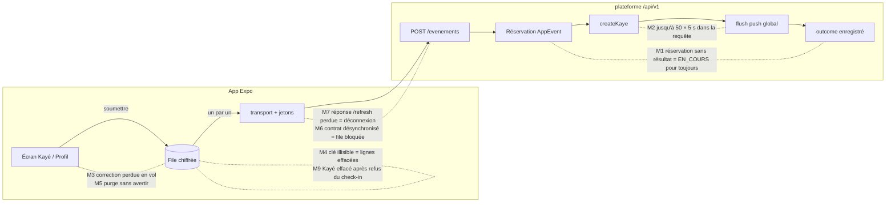

# Revue de code — V1 conso (API v1, app Expo, hors ligne, push)

- **Périmètre :** commits de `2849094` (« docs(adr): 0008 approche web et mobile ») à `8c3ceee`.
  - `plateforme/` : `src/contracts/v1/**`, `src/app/api/v1/**`, `src/server/auth/token*.ts`, `src/server/visits/app-*.ts`, `src/server/notifications/push/**`, les 3 migrations `a1_refresh_token`, `a2_evenements_app`, `n1_appareils_push`, et les branchements dans `outbox.ts`, `accompagnant/service.ts`, `matching/service.ts`, `visits/proof.ts`.
  - `mobile/` : `src/api`, `src/session`, `src/offline`, `src/native`, `src/push`, `app/**`, `scripts/sync-contracts.mjs`.
  - Design web W1-W4 : lu seulement pour les régressions de logique. Aucune trouvée.
- **Références :** ADR 0008, `docs/tech/api-v1.md`, `mobile/README.md`.
- **Réviseur :** réviseur de code senior (agent). Date : 2026-10-05.

## 1. Ce que j'ai exécuté

| Commande | Résultat |
|---|---|
| `pnpm install --frozen-lockfile && pnpm prisma generate && pnpm test` | 40 fichiers, **394 tests OK**, 47 ignorés (tests sur base) |
| `KOUDMEN_DB_TESTS=1 pnpm vitest run` | 48 fichiers, **441 tests OK** |
| `npm ci && npx tsc --noEmit` (mobile) | Aucune erreur |
| `npm run -s test:hors-ligne` | **29 tests OK** |
| `npm run -s test:push` | **9 tests OK** |
| `node scripts/sync-contracts.mjs --check` | OK : les contrats de l'app sont identiques à ceux de la plateforme |

Je n'ai pas lancé `pnpm db:seed`. Je n'ai modifié aucun fichier de code. Je n'ai pas lancé les e2e Playwright (serveur et navigateur).

## 2. Points solides

- **Jetons (A1) : bonne base.** Clés HKDF séparées par usage (`acces`, `code`), `typ` vérifié, PKCE S256 comparé en temps constant, jeton de renouvellement opaque (256 bits) stocké en empreinte seulement. Rotation atomique (`updateMany where usedAt = null`), détection de rejeu qui révoque la famille, code de connexion à usage unique tranché par la contrainte unique `authCodeId`. Lien à `User.sessionVersion` : la déconnexion web coupe l'app.
- **Idempotence (A2) :** clé unique `(userId, clientEventId)`, réservation avant traitement, refus métier mémorisé (un renvoi ne consomme pas un nouvel essai de code).
- **Push après commit (N1) :** `enqueuePush` écrit dans l'Outbox **dans** la transaction métier ; l'envoi part **après** le commit. Les textes push respectent R9 (prénom de l'aîné seulement).
- **File mobile (M3) :** envoi un par un, ordre gardé, SOS prioritaire, attente progressive avec aléa, purge qui invalide les envois en vol (`generation`), file d'un autre compte effacée avant envoi. Tests unitaires riches et lisibles.
- **Renouvellement mobile sérialisé :** une seule promesse `enCours` partagée ; le nouveau jeton est écrit avant tout autre appel.
- **RGPD :** listes fermées (`.strict()`) sur toutes les réponses, contenu chiffré AES-GCM au repos, refus gardés sans le contenu du Kayé.

## 3. Constats

### Résumé

| Gravité | Nombre |
|---|---|
| BLOQUANT | 0 |
| MAJEUR | 9 |
| MINEUR | 13 |

### Schéma : où se trouvent les MAJEUR

### Tableau

| # | Gravité | Fichier:ligne | Problème | Scénario d'échec | Correction proposée |
|---|---|---|---|---|---|
| M1 | MAJEUR | `plateforme/src/server/visits/app-service.ts:104-127`, `:147-150` ; `mobile/src/offline/file.ts:137-140` | La réservation `AppEvent` (outcome `null`) n'a **aucune expiration**. Si le processus s'arrête entre la réservation et l'enregistrement du résultat, chaque renvoi reçoit `DOUBLON / EN_COURS`. L'app classe `EN_COURS` en erreur réseau et réessaie. La purge à 30 jours n'est pas branchée. | 1. L'app envoie un `KAYE_PUBLICATION`. 2. `createKaye` valide, puis le flush push (M2) dépasse le délai de la fonction serverless : le processus est tué avant `appEvent.update`. 3. Chaque renvoi : `EN_COURS`. 4. La file est bloquée en tête **pour toujours** : les check-ins et Kayés suivants ne partent jamais (« 3 envois en attente » permanent). | Ajouter `claimedAt` (ou utiliser `receivedAt`) : une réservation sans résultat de plus de N minutes (ex. 2 min) est reprise (supprimée puis retraitée ; les services métier refusent déjà les doublons réels). Côté app : après K réponses `EN_COURS` (ex. 10), passer la ligne en refus affichable au lieu de bloquer la file. Test sur base : réservation orpheline puis renvoi. |
| M2 | MAJEUR | `plateforme/src/server/accompagnant/service.ts:637`, `plateforme/src/server/matching/service.ts:198`, `plateforme/src/server/notifications/push/service.ts:176-230`, `push/expo.ts:18` | `flushPendingPushSafe()` est attendu **dans la requête métier** et vide l'Outbox **de tous les comptes** (50 messages). Chaque message appelle Expo avec un délai de 5 s. | Expo est lent ou en panne. 50 push sont en attente (plusieurs Kayés publiés). Un accompagnant publie un Kayé : `POST /evenements` attend jusqu'à 50 × 5 s = 250 s. L'app abandonne à 20 s (`DELAI_RESEAU_MS`), réessaie, reçoit `EN_COURS` ; la fonction serverless peut être tuée (voir M1). Même attente côté famille sur « Choisir ce profil ». | Ne pas attendre le flush global dans la requête : `after()` / `waitUntil` de Next.js, ou flush limité aux `id` des messages créés par la transaction (`opts.ids`), ou une route cron dédiée. Garder `flushPendingPushSafe` hors de la fenêtre de réservation d'`AppEvent`. |
| M3 | MAJEUR | `mobile/src/offline/file.ts:396-401` avec `:303`, `:309-316` | Remplacement d'un Kayé « jamais parti » (`tentatives === 0`) **pendant qu'il est en vol**. `tentatives` n'augmente qu'après une erreur réseau ; une ligne en cours d'envoi a donc encore `tentatives === 0`. Le transport envoie l'ancien objet ; à la réponse `ACCEPTE`, la ligne (avec le nouveau texte) est supprimée. | 1. Hors ligne : check-in en file, puis Kayé publié → `EN_ATTENTE`, le formulaire reste ouvert (« Votre texte reste ici »). 2. Le réseau revient ; la file envoie le check-in, puis le Kayé (en vol). 3. L'accompagnant corrige une faute et appuie sur « Envoyer » : `ajouter` remplace le texte dans la même ligne. 4. Le serveur accepte l'ancien texte ; la ligne est supprimée ; l'écran affiche « Kayé envoyé ». **La correction est perdue sans message.** Même chose pour un brouillon. | Marquer la ligne `enVol` (ou incrémenter `tentatives` **avant** l'appel au transport). Si la ligne est en vol, appliquer la branche « déjà essayé » (nouvel identifiant, même `seq`). Ajouter un test : remplacement pendant un transport en attente. |
| M4 | MAJEUR | `mobile/src/offline/chiffre.ts:25-34` (`listerLignes`), `mobile/src/offline/plateforme.native.ts:110-124` | Toute erreur de `dechiffrer` **supprime** la ligne de la file. Or `dechiffrer` échoue aussi quand la **lecture de la clé** échoue (Keychain/Keystore indisponible, erreur passagère de `SecureStore`). Pire : si `getItemAsync` renvoie `null` par erreur, une **nouvelle clé** est créée et écrase l'ancienne. | Android : le Keystore lève une erreur passagère au démarrage (cas connu après une mise à jour système ou un changement de verrouillage). `lireCle` rejette → chaque ligne est jugée « illisible » → la file entière (Kayés écrits hors ligne, check-ins) est **effacée**. | Séparer « clé indisponible » (erreur : ne rien supprimer, réessayer plus tard) et « données illisibles avec une clé lue » (supprimer). Ne jamais générer une clé neuve s'il reste des lignes chiffrées : signaler l'état. Test : `lireCle` qui rejette une fois. |
| M5 | MAJEUR | `mobile/app/(onglets)/profil.tsx:76-78`, `mobile/src/session/SessionProvider.tsx:59-64`, `mobile/src/api/http.ts:200-214` | « Me déconnecter » purge la file (`horsLigne.purger()`) **sans avertir** quand des envois attendent. | En fin de journée, sans réseau, l'accompagnant a 2 Kayés en attente. Il appuie sur « Me déconnecter ». Les 2 Kayés sont effacés de l'appareil ; la famille ne les reçoit jamais ; personne ne le sait. | Avant la purge : si `etat().enAttente > 0`, afficher une confirmation (« 2 envois ne sont pas partis. Ils seront effacés. ») avec « Envoyer d'abord » / « Effacer quand même ». Garder la purge (RGPD) après le choix explicite. |
| M6 | MAJEUR | `.github/workflows/ci.yml:3-8` ; `mobile/src/offline/file.ts:84` ; `mobile/src/api/http.ts:102-106`, `:224` | 1. La CI ne tourne que sur `plateforme/**` : `sync-contracts --check`, `tsc` et les tests mobiles ne sont **jamais** lancés en CI. 2. `REPONSE_INVALIDE` est classée **transitoire** dans la file. Une réponse hors contrat (schémas `.strict()`) bloque donc la tête de file pour toujours. | Un développeur ajoute une valeur à `statutVisiteSchema` (plateforme) sans relancer la synchro (api-v1 § 9.7 le demande « à la main »). CI verte. L'app reçoit `statut: "ANNULEE"` dans la réponse de `/evenements` : l'événement est **traité** côté serveur, l'app voit `REPONSE_INVALIDE`, réessaie, reçoit `DOUBLON` avec le même contenu, échoue encore, sans fin. | Ajouter un job CI `mobile` (déclenché aussi sur `plateforme/src/contracts/**`) : `sync-contracts --check`, `tsc --noEmit`, `test:hors-ligne`, `test:push`. Dans la file, compter `REPONSE_INVALIDE` à part : après K essais, refus affichable (« Mettez l'app à jour »). |
| M7 | MAJEUR | `plateforme/src/server/auth/token-service.ts:209` ; `mobile/src/api/http.ts:128-151` | Aucune fenêtre de grâce sur la rotation : la **perte de la réponse** de `/auth/refresh` (délai de 20 s, coupure, app tuée avant l'écriture dans `SecureStore`) fait rejouer l'ancien jeton → famille révoquée → `JETON_REUTILISE` → déconnexion. Connu (api-v1 § 8, `[À VÉRIFIER]`), mais la cible est justement un réseau faible. | Réseau 3G instable en zone rurale. Le serveur tourne le jeton ; la réponse se perd. Au prochain appel, l'app rejoue l'ancien jeton. L'accompagnant est déconnecté au milieu d'une visite et doit retaper son mot de passe ; la file attend. Cas fréquent sur le terrain : support et frustration. | Fenêtre de grâce courte : si le jeton présenté est `usedAt` depuis moins de 30 s **et** que son enfant n'a jamais été utilisé, émettre un nouveau couple pour cet enfant au lieu de révoquer. Garder la révocation pour tout autre rejeu. Test sur base dédié. À trancher avant le terrain. |
| M8 | MAJEUR | `plateforme/src/server/visits/app-service.ts:191`, `:251-255` ; migration `a2_evenements_app` | `KayeDraft.content` contient des **données de santé** (humeur, note, « à surveiller »). Il n'existe **aucune** purge. Le brouillon est effacé seulement si le Kayé est publié **par l'app**. | 1. Brouillon synchronisé, puis Kayé publié depuis le **web** (`createKaye` du lot B) : le brouillon reste en base pour toujours. 2. Brouillon jamais publié (visite annulée) : il reste pour toujours. Contraire à la minimisation (ADR 0008 § 4.2). | Effacer le brouillon dans `createKaye` (dans sa transaction), pour le web comme pour l'app. Ajouter une purge des brouillons dont la visite est terminée depuis plus de N jours, branchée sur la purge nocturne. |
| M9 | MAJEUR | `mobile/src/offline/file.ts:319-327` | Un refus définitif efface le contenu de la ligne. Un Kayé **dépendant** d'un événement refusé avant lui (check-in) est refusé à son tour, et son texte est perdu. | Hors ligne : l'accompagnant tape un code faux au check-in, puis écrit un Kayé complet. Au retour du réseau : check-in refusé (code faux), puis Kayé refusé (« Faites d'abord le check-in »). Le texte du Kayé est effacé ; le bandeau dit seulement « Envoi refusé ». Il faut tout réécrire, de mémoire. | Pour `KAYE_PUBLICATION` / `KAYE_BROUILLON` refusés avec un motif récupérable (`INVALIDE`, `INTERDIT`), garder le contenu (chiffré) et le remettre dans le formulaire (`kayeEnAttente`) jusqu'à ce que l'accompagnant le publie ou l'efface. Ou suspendre les événements d'une visite dont le check-in vient d'être refusé. |
| m1 | MINEUR | `plateforme/src/server/notifications/push/service.ts:189-192`, `:222-225` | Le message est marqué `ENVOYE` **avant** l'envoi ; une erreur réseau Expo le passe en `ECHEC`, sans nouvel essai. | Expo répond 503 pendant 1 minute : tous les push de cette minute sont perdus. Le journal de l'opérateur montre « Envoyé » pendant l'envoi. | Statut intermédiaire `EN_COURS`, puis échec temporaire avec compteur et nouvel essai (cron). `ECHEC` définitif seulement pour `DeviceNotRegistered` ou après N essais. |
| m2 | MINEUR | `plateforme/src/server/matching/service.ts:198` ; `src/server/sandbox/robots.ts:481` | Dans une transaction externe, le push reste `EN_ATTENTE` « jusqu'au prochain envoi ». Aucun cron ne vide l'Outbox. | Le robot du bac à sable choisit un profil : le push à l'accompagnant part seulement quand **un autre** Kayé est publié, peut-être des heures plus tard. | Route cron de flush (protégée par `CRON_SECRET`), ou flush après le commit de la transaction appelante. |
| m3 | MINEUR | `plateforme/src/server/visits/app-service.ts:121`, `:131-132` ; `src/server/accompagnant/rules.ts:248` | Tout événement à l'horloge suspecte qui porte une `visiteId` marque la visite (SOS, brouillon, événement **refusé**). Or `A_VERIFIER` refuse ensuite tout nouveau facteur. | Téléphone remis à 2000 après une batterie vide. L'accompagnant envoie un SOS depuis la fiche, avant le check-in. La visite passe `A_VERIFIER`. Ensuite, le check-in avec le **bon** code est refusé. | Marquer seulement les événements qui produisent une preuve acceptée (`CHECK_IN`, `CHECK_OUT` acceptés). Pour les autres, garder `clockSkew` dans `AppEvent` sans changer la visite. |
| m4 | MINEUR | `plateforme/src/server/visits/app-service.ts:179`, `:247` | Le brouillon le plus récent est choisi avec l'heure **brute** de l'appareil (pas bornée à l'heure du serveur). | Téléphone A en avance de 10 h : son brouillon a une heure « future ». Les brouillons suivants (téléphone B à l'heure) reçoivent `ACCEPTE` + « Un brouillon plus récent est déjà enregistré » et ne sont jamais gardés. | Borner `occurredAt` avec `effectiveEventTime`, ou départager avec `receivedAt`. |
| m5 | MINEUR | `plateforme/src/server/visits/app-service.ts:123-126` | Une erreur **après** une action validée (`kayeDraft.deleteMany`, `visitState`, `appEvent.update`) efface la réservation. Le renvoi rejoue l'action, qui répond `CONFLIT`. | Panne base brève juste après `createKaye` : 500, renvoi, « Envoi refusé. Le Kayé de cette visite existe déjà. » alors que le Kayé est bien publié. L'accompagnant croit à un échec. | Pour un `CONFLIT` « déjà fait » sur `KAYE_PUBLICATION` / `CHECK_OUT` du même auteur, répondre `ACCEPTE` (idempotence métier), ou enregistrer le résultat dans la même transaction que l'action. |
| m6 | MINEUR | `mobile/src/api/http.ts:86-93` | Le minuteur de 20 s est annulé **avant** la lecture du corps (`res.json()`). Une réponse dont le corps cale n'a plus de délai. | Réseau mobile qui coupe au milieu du corps : `transport` ne finit jamais, `passe()` reste en cours, `envoiEnCours` reste vrai. La file est gelée jusqu'au redémarrage de l'app. | Annuler le minuteur **après** la lecture du corps (le `signal` couvre aussi le flux du corps). |
| m7 | MINEUR | `mobile/src/session/SessionProvider.tsx:34-42`, `:44-47` ; `mobile/src/api/http.ts:140-143`, `:279-281` | Au démarrage, `JETON_REUTILISE` déclenche `signalerPerte(message)`, puis `restaurer()` renvoie `null` et `reprendre` écrit `message: null`. | L'accompagnant voit l'écran de connexion **sans** l'explication « Votre connexion a été fermée par sécurité ». | Dans `reprendre`, ne pas écraser un état `deconnecte` qui porte déjà un message ; ou faire lever l'erreur par `restaurer` au lieu de renvoyer `null`. |
| m8 | MINEUR | `mobile/src/offline/file.ts:391-394` ; `mobile/app/visite/[id].tsx:125-150` | `CHECK_IN` n'est pas regroupé dans la file (seuls `CHECK_OUT` et `SOS` le sont). | Hors ligne, l'accompagnant appuie 3 fois sur « Je suis arrivé » avec un code mal tapé (chaque appui répond « gardé »). Au retour du réseau, 3 essais de code sont consommés : blocage « trop d'essais ». | Regrouper les `CHECK_IN` en attente d'une même visite (garder le dernier code et la dernière position), ou masquer le bouton tant qu'un check-in est en file. |
| m9 | MINEUR | `mobile/app/propositions.tsx:140-142` ; `plateforme/src/app/api/v1/propositions/[id]/accepter/route.ts` | « Accepter » n'est pas idempotent. | Réponse perdue (délai de 20 s), nouvel appui : `CONFLIT` « plus en attente ». L'écran dit que la proposition n'est plus disponible alors que la mission est créée. | Sur `CONFLIT`, relire les propositions et les visites ; ou répondre `200` si la proposition est déjà acceptée **par ce même accompagnant**. |
| m10 | MINEUR | `mobile/src/offline/file.ts:211-221`, `:227-246` | 1. Un échec d'écriture est ignoré, mais l'écran dit « gardé sur ce téléphone ». 2. Un échec de `listerLignes` est mémorisé (`chargement`) : la file repart vide et `seq` repart à 1. | Disque plein : le Kayé n'est qu'en mémoire ; l'app est tuée ; le Kayé est perdu alors que l'écran a promis le contraire. | Si `persister` échoue, lever une erreur claire (« Pas de place sur le téléphone ») ; si le chargement échoue, ne pas mémoriser la promesse et réessayer. |
| m11 | MINEUR | `plateforme/src/server/auth/token-service.ts:293`, `visits/app-service.ts:308`, `notifications/push/service.ts:127` | `purgeRefreshTokens`, `purgeAppEvents`, `purgePushDevices` existent mais ne sont pas branchées (« À brancher »). | Les tables grandissent sans fin ; les durées de conservation annoncées (7 j, 30 j) ne sont pas tenues. | Les appeler depuis une route cron nocturne (comme `api/cron/purge-bacs-a-sable`), avec un test. |
| m12 | MINEUR | `plateforme/prisma/schema.prisma` (`OutboxMessage` : index `createdAt` et `sandboxId` seulement) | La requête du flush (`channel = PUSH AND status = EN_ATTENTE ORDER BY createdAt`) n'a pas d'index adapté ; elle tourne à **chaque** Kayé publié. | L'Outbox garde tous les messages simulés : après quelques mois, chaque publication parcourt toute la table. | Index `@@index([channel, status, createdAt])`. |
| m13 | MINEUR | `plateforme/src/server/visits/app-rules.ts:337-340` | L'heure de l'appareil (jusqu'à 12 h en arrière) décide de la fenêtre de check-in. | L'accompagnant manque la visite de 9 h. À 18 h, il recule l'horloge du téléphone à 9 h 05, passe au domicile, fait le check-in GPS : la visite paraît faite à l'heure. | À trancher (anti-fraude contre hors ligne réel) : marquer « à vérifier » si `receivedAt - occurredAt` dépasse la durée de la visite alors que l'app a parlé au serveur entre-temps, ou exiger le code du domicile pour un check-in reçu en retard. `[À VÉRIFIER]` avec le produit. |

## 4. Remarques sans gravité (pas de changement exigé)

- `rotateRefreshToken` prolonge `expiresAt` à chaque rotation : la connexion ne finit jamais tant que l'app sert. Conforme si c'est voulu ; à écrire dans api-v1 § 4.
- `registerDevice` réattribue un jeton Expo connu au compte connecté. Correct pour un téléphone partagé ; le journal le trace (`reattribue`).
- Abonnements côté app : `surSessionPerdue`, `abonner`, `ecouterToucher` et la surveillance réseau renvoient chacun leur désabonnement, et il est appelé. Je n'ai pas trouvé de fuite.

## 5. Verdict

**APPROUVÉ AVEC RÉSERVES.**

- Les tests passent tous (plateforme 441, mobile 38) et le socle est solide : jetons, contrats, chiffrement au repos.
- Mais la promesse du lot M3 (« rien n'est perdu hors ligne ») a 5 trous concrets : **M1, M3, M4, M5, M9**. Corrigez-les **avant** tout essai sur le terrain avec de vrais accompagnants.
- Corrigez **M2** et **M6** avant la mise en production (Expo réel, contrats modifiés par deux équipes).
- **M7** et **M8** demandent une décision (fenêtre de grâce de rotation, conservation des brouillons de santé) avant le terrain.
