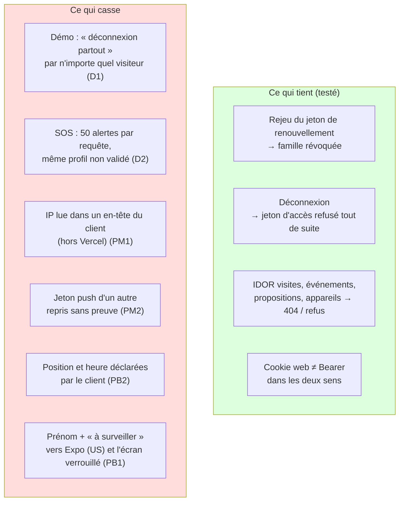
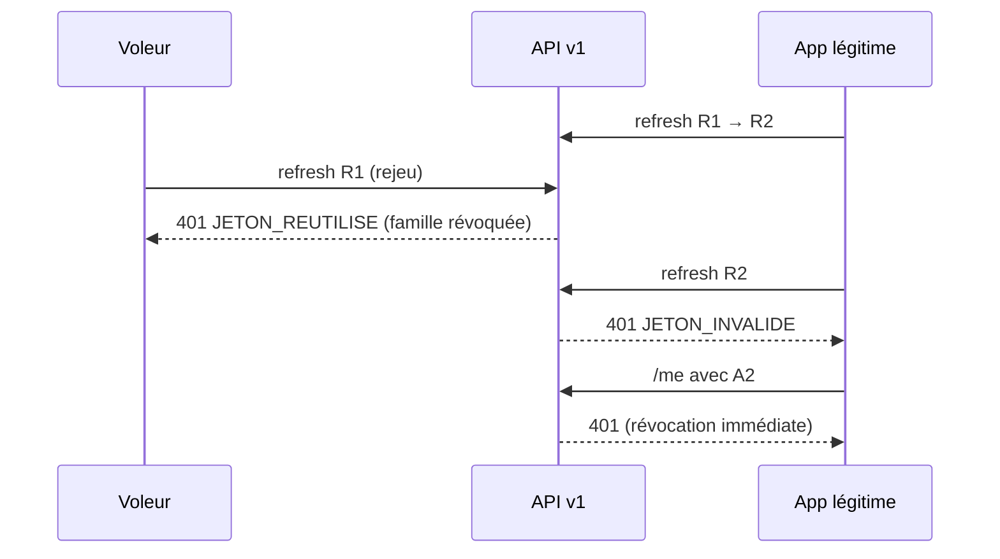

# Revue V1 (version conso) : sécurité et RGPD

> **Rôle :** RSSI et DPO.
> **Objet :** API mobile `/api/v1` (lots A1, A2, N1), app Expo `mobile/` (lots M2, M3, N1), push (`plateforme/src/server/notifications/push/**`), PWA (manifeste) et écrans web refaits (lot W4). État du dépôt au commit `8c3ceee`.
> **Références :** ADR 0005, 0007, 0008 ; `docs/tech/api-v1.md` ; `docs/tech/integrations/push.md` ; `mobile/README.md` ; `docs/revues/S1b-securite.md` (points déjà traités, non répétés ici).
> **Date :** 2026-10-05.
> **Méthode :** lecture du code, plus des **tests réels** sur un build de production local (`next start`, port 3802, `DEMO_MODE=true`, base PostgreSQL locale déjà remplie). Environ 400 requêtes `curl`. Aucun fichier de code modifié. Aucun `pnpm db:seed`.

---

## 0. Verdict

| Étape | Verdict | Condition |
|---|---|---|
| **Mise en ligne de la démo** (Vercel, données fictives, `ADAPTER_PUSH=console`) | **GO sous conditions. Aucun BLOQUANT** | Corriger D1 et D2 (abus du compte de démo partagé) dans le sprint. Si l'app Expo est montrée aux testeurs : corriger aussi D3 (mentions légales dans l'app) |
| **Pilote réel** (Clever Cloud HDS, push `expo`) | **NO-GO** | Lever les 2 BLOQUANTS pilote (PB1, PB2) et les MAJEURS « avant pilote » (PM1 à PM5) |

Le socle d'authentification de l'API **tient** : rotation, détection de rejeu, révocation immédiate, PKCE, séparation cookie / Bearer. Aucun IDOR trouvé (15 essais). Les failles sont ailleurs :

- **abus d'un compte partagé** (démo) ;
- **confiance excessive dans ce que le client déclare** (IP, position, heure, jeton push) ;
- **données qui sortent de l'UE** dans le titre des push.

---

## 1. BLOQUANTS avant le pilote réel

Aucun BLOQUANT pour la démo (données fictives, push en mode `console`).

| # | Gravité | Vulnérabilité | Exploitation | Correction |
|---|---|---|---|---|
| **PB1** | **BLOQUANT (pilote)** | **Le push transfère hors UE une information liée à la santé d'une personne vulnérable.** Titres : « Nouveau Kayé pour {prénom} » et « À lire : visite chez {prénom} » + « L'accompagnant a noté un point à surveiller ». Le texte passe par Expo (650 Industries, États-Unis), puis Apple ou Google. Il s'affiche sur l'écran verrouillé. Prénom + « point à surveiller » + service d'accompagnement d'aîné = donnée qui révèle un état de santé probable (art. 9 RGPD, considérant 35) [À VÉRIFIER AVEC LE DPO / AVOCAT]. `push.md` § 4 laisse la décision ouverte | Lu dans `push/templates.ts`. Test réel (adaptateur `console`) : `[push:console] … Nouveau Kayé pour Ginette …` ; le prénom est aussi écrit dans le **journal du serveur** | 1. `ALERTE_A_SURVEILLER` : titre **sans prénom et sans « surveiller »** (ex. « Koudmen : nouveau message »). 2. `KAYE_PUBLIE` : « Nouveau Kayé » sans prénom, ou prénom en option choisie par la famille (consentement). 3. DPA Expo signé, transfert déclaré (DPF ou clauses types), Expo dans le registre et dans `/confidentialite`. 4. Journal `console` : retirer le titre (garder l'écran visé). 5. Pas de passage `ADAPTER_PUSH=expo` avant ces 4 points |
| **PB2** | **BLOQUANT (pilote)** | **La preuve de présence est déclarative par l'API.** La position du check-in est un simple nombre envoyé par le client (`position.latitude/longitude`). L'heure (`survenuA`) est celle de l'appareil, acceptée jusqu'à **12 h dans le passé** sans alerte. Le code du domicile est **fixe** (rappel S1b P2). Donc 2 facteurs sur 3 se rejouent sans venir : un accompagnant qui est venu une fois connaît le code et la position | Lu dans `app-service.ts` (`checkIn`), `app-rules.ts` (`effectiveEventTime`) et `evenementCheckInSchema`. Scénario : visite 9 h – 11 h ; à 20 h, depuis chez lui, l'accompagnant envoie `CHECK_IN` avec `survenuA = 09:05`, le code noté la fois d'avant et les coordonnées du domicile → visite `VALIDEE`. La famille croit que son parent a été vu. Facturation et sécurité de l'aîné touchées. [À VÉRIFIER] : si le balayage des visites dépassées (`sweepOverdueVisits`) a déjà tourné, la visite est `A_VERIFIER` et refuse la preuve ; il tourne seulement à la lecture des listes | 1. Code à usage unique par visite ou QR signé tournant (spec § 10.2 point 5, déjà prévu). 2. Écart `recuA − survenuA` > 30 min sur un `CHECK_IN` : visite `A_VERIFIER` (le hors-ligne reste possible, mais vérifié). 3. Position : refuser la précision 0 m ou des coordonnées identiques au mètre près d'une visite à l'autre ; signaler une position simulée (Android `mocked`) [À VÉRIFIER : champ exposé par `expo-location`]. 4. Le facteur « confirmation de l'aîné » devient obligatoire tant que 1 et 2 ne sont pas livrés |

---

## 2. MAJEURS

| # | Gravité | Quand | Vulnérabilité | Exploitation (testée ou lue) | Correction |
|---|---|---|---|---|---|
| **D1** | MAJEUR | **Avant démo** | **N'importe quel visiteur déconnecte tous les autres du compte de démo.** `POST /auth/logout {partout:true}` incrémente `User.sessionVersion`. Le compte de démo est partagé | **Test réel :** visiteur A (IP 1) et visiteur B (IP 2) connectés en démo. A envoie `partout:true` → `204`. B : `/me` passe de `200` à `401`. `sessionVersion` 0 → 1. Le cookie web de démo est aussi refusé (`307 /connexion`). Répétable sans limite utile (120/min) : démo inutilisable pendant une présentation | Refuser `partout` (et la déconnexion web « partout ») pour un compte `isDemo` : révoquer seulement la famille du jeton. Même règle pour toute action qui touche `sessionVersion` d'un compte démo |
| **D2** | MAJEUR | **Avant démo** (débit), avant pilote (alerte réelle) | **Inondation de SOS.** Un lot accepte 50 SOS, chacun avec un `clientEventId` neuf. Le SOS passe aussi pour un profil **non validé** (voulu, sécurité). Aucune limite par compte. Le compte de démo est dans le « monde réel » (`sandboxId = null`) : les SOS vont aux **vrais opérateurs** | **Test réel :** compte `EN_ATTENTE` (Steeve), 1 requête de 50 SOS en 0,58 s → **+50 messages** `SOS_ACCOMPAGNANT` dans la boîte d'envoi de l'opérateur réel. Plafond théorique : 6 000 alertes/min par IP, sans plafond avec PM1. Effet : un vrai SOS se noie dans le bruit | 1. Au plus 1 alerte SOS par compte et par 5 min ; les suivantes : `ACCEPTE` sans nouvelle alerte. 2. Au plus 3 SOS par lot. 3. Compte démo : SOS simulé (consigne affichée, aucune alerte opérateur). 4. Audit `sos.suppressed` pour garder la trace |
| **D3** | MAJEUR | Avant démo **si l'app est montrée** ; avant pilote sinon | **L'app Expo n'a aucune information légale.** Pas de mention « pas un service d'aide à domicile autorisé » (arbitrage S1 : sur TOUS les écrans), pas de lien vers la politique de confidentialité ni les mentions légales. `/confidentialite` ne parle ni de l'app, ni du push, ni d'Expo, ni des données gardées sur le téléphone (cache et file chiffrés, jetons) | `grep` dans `mobile/app` et `mobile/src` : seule mention « Version de test » dans `profil.tsx`. `/confidentialite` : sections Vercel, Neon, GPS web seulement. Les stores exigent aussi un lien de politique de confidentialité | 1. Bandeau court sur l'écran de connexion et dans « Profil » + liens vers `/confidentialite` et `/mentions-legales`. 2. Section « Application mobile » dans `/confidentialite` : jetons (30 j), cache chiffré, file hors ligne, push (Expo, Apple, Google), caméra (aucune photo), position (une lecture) |
| **PM1** | MAJEUR | Avant pilote | **Les limites de débit se contournent par un en-tête hors Vercel.** `clientIpFrom` lit d'abord `x-vercel-forwarded-for`, puis `x-real-ip`, puis la **première** valeur de `x-forwarded-for`. Sur Clever Cloud (ADR 0007, production HDS), ces en-têtes viennent du client | **Test réel** (sans proxy) : `/auth/code` avec IP fixe → `429` au 21e essai ; avec `x-forwarded-for` ou `x-vercel-forwarded-for` tournant → **23 sur 23 passent**. Atténuation constatée : `login:compte` (10 / 15 min par e-mail) tient même avec IP tournante. Sans effet sur Vercel (démo) [À VÉRIFIER : Vercel écrase bien ces en-têtes] | Choisir l'en-tête selon `HOSTING_PROVIDER` : sur Clever Cloud, la **dernière** valeur de `X-Forwarded-For` (posée par leur proxy) [À VÉRIFIER : doc Clever Cloud], jamais `x-vercel-*`. Ajouter des compteurs **par compte** sur `/evenements`, `/appareils`, `/auth/refresh` |
| **PM2** | MAJEUR | Avant pilote | **Un jeton push connu change de compte sans preuve.** `registerDevice` fait un `upsert` sur le jeton : « Un jeton déjà connu passe au compte connecté » | **Test réel :** la famille démo enregistre `ExponentPushToken[revueV1victime…]`. Kévin (autre compte) envoie le même jeton → `200`, **même `id` renvoyé**, la ligne passe à Kévin (audit `reattribue: true`). La famille ne reçoit plus l'alerte « à surveiller » ; le téléphone de la famille reçoit les push de Kévin. Prérequis : connaître le jeton (téléphone partagé, journal, capture) | 1. Ne pas réattribuer : si le jeton appartient à un autre compte **actif**, révoquer l'ancienne ligne et en créer une nouvelle (nouvel `id`), et ne jamais renvoyer l'`id` d'une autre ligne. 2. Mieux : l'app envoie aussi un identifiant d'installation gardé en SecureStore ; la réattribution exige le même identifiant. 3. Activer la « sécurité renforcée des push » Expo (voir PM3) |
| **PM3** | MAJEUR | Avant pilote | **`EXPO_ACCESS_TOKEN` facultatif.** Sans la « sécurité renforcée » du projet Expo, toute personne qui connaît un jeton Expo envoie un push arbitraire **sous le nom et l'icône Koudmen** | Lu dans `push/expo.ts` et `push.md` § 2. Risque : hameçonnage de familles d'aînés (« Votre compte est bloqué, appelez le … »). Les données jointes sont bien validées par l'app (`routeDepuisDonnees`, Zod) : pas d'ouverture d'écran arbitraire | Sécurité renforcée **obligatoire** ; `config-check.ts` refuse `ADAPTER_PUSH=expo` sans `EXPO_ACCESS_TOKEN` en production |
| **PM4** | MAJEUR | Avant pilote | **Purges non branchées.** `purgeRefreshTokens`, `purgeAppEvents`, `purgePushDevices` existent mais ne sont appelées nulle part. `KayeDraft` (humeur, appétit, note : données de santé possibles) n'est effacé qu'à la publication : un brouillon jamais publié reste **sans limite** | `grep` : aucun appel hors tests. Test réel : 57 `AppEvent` créés pendant la revue, sans purge prévue. `/evenements` accepte 6 000 événements/min par IP (50 × 120) : croissance de base sans borne | Brancher les trois purges sur la purge nocturne. Ajouter : brouillon effacé 7 jours après la fin de la visite. Écrire ces durées dans `/confidentialite` |
| **PM5** | MAJEUR | Avant pilote | **Rejeu détecté, mais base locale gardée.** `api-v1.md` § 1 : `JETON_REUTILISE` → « Effacer les jetons **et** la base locale ». L'app efface seulement les jetons (`effacer()` dans `renouveler` et `restaurer`). Le cache (prénom, adresse approximative, consignes) et la file (Kayé, code, position) restent, chiffrés, avec la clé toujours dans SecureStore | Lu dans `mobile/src/api/http.ts` (`renouveler`, `restaurer`) et `SessionProvider.tsx` (`surSessionPerdue` change seulement l'état). La purge n'a lieu qu'à la déconnexion volontaire ou à la connexion d'un **autre** compte | Sur `JETON_REUTILISE` et `ACCES_REFUSE` : `horsLigne.purger()` (cache, file, clé). Sur `JETON_INVALIDE` : garder la file (Kayé non envoyé) mais purger après 7 jours sans reconnexion |

---

## 3. MINEURS

| # | Gravité | Quand | Vulnérabilité | Exploitation | Correction |
|---|---|---|---|---|---|
| m1 | MINEUR | Avant pilote | **`AppEvent.visitId` non vérifié.** Un SOS (ou un refus) garde l'id de visite envoyé, même d'un autre accompagnant ou inexistant | **Test réel :** SOS de Kévin avec la visite de la victime → `ACCEPTE`, non lié (correct), mais `AppEvent.visitId = cmuugn7t6…` et `inexistante123` en base | Écrire `visitId` seulement après le contrôle `ownedVisitWhere` (sinon `null`) |
| m2 | MINEUR | Avant pilote | **Déconnexion hors réseau : le push continue.** `retirer()` efface l'id local de l'appareil même si `DELETE /appareils` échoue ; la connexion serveur reste ouverte jusqu'à 30 jours ; le serveur continue d'envoyer | Lu dans `push/push.ts` et `http.ts` (`deconnecter`). Un téléphone rendu ou prêté reçoit encore « Nouvelle proposition » | Garder une file « à révoquer » (id appareil + jeton de renouvellement) et la rejouer au retour du réseau |
| m3 | MINEUR | Avant pilote | **Retrait d'appareil non journalisé** ; réattribution journalisée seulement chez le nouveau compte | Lu dans `unregisterDevice` | Audit `push.device.removed` ; audit chez l'ancien propriétaire en cas de réattribution |
| m4 | MINEUR | Avant pilote | **Données du téléphone :** pas d'`android.allowBackup: false`, pas de masquage dans le sélecteur d'apps (FLAG_SECURE / écran flou iOS), pas de verrou d'app. Métadonnées de la file en clair dans SQLite (`type`, `visite_id`) | Lu dans `app.json` et `plateforme.native.ts`. Le contenu reste chiffré (AES-256-GCM, clé `THIS_DEVICE_ONLY`) | `allowBackup: false` (ou règles d'exclusion), écran masqué en arrière-plan, verrou biométrique facultatif. SQLCipher au lot E1 (déjà prévu) |
| m5 | MINEUR | Avant pilote | **HTTPS non imposé à la construction.** `API_URL` par défaut `http://localhost:3000`. Pas d'épinglage de certificat | Lu dans `mobile/src/api/config.ts`. Atténuation : ATS (iOS) et Android bloquent HTTP en build de production par défaut | Échec du build si `EXPO_PUBLIC_API_URL` n'est pas `https://` hors `__DEV__`. Épinglage : à évaluer (coût de rotation) |
| m6 | MINEUR | Avant pilote | **`consignes` (texte libre de la famille) envoyé à l'app et gardé dans le cache.** Exemple réel de la démo : « Elle se fatigue vite l'après-midi ». Donnée de santé possible (rappel S1b P3) | Test réel : `GET /visites` | Aide à la saisie côté famille (« pas d'information médicale ») ; durée du cache limitée au jour |
| m7 | MINEUR | Avant pilote | **Pas de durée absolue de connexion** (une app active reste connectée sans fin) | Documenté (`api-v1.md` § 8) | Durée absolue 90 jours, puis nouvelle saisie du mot de passe |
| m8 | MINEUR | Avant démo | **Identifiant mal encodé → page HTML 400 de Next.js**, hors format d'erreur unique | **Test réel :** `GET /api/v1/visites/%E0` → HTML 400 ; `DELETE /appareils/%E0` → 400 | Sans risque. Lire l'id depuis `params` de Next au lieu de `decodeURIComponent` sur le chemin |
| m9 | MINEUR | Avant démo | **`lastLoginAt` mis à jour à l'émission du code**, avant l'échange PKCE | Lu dans `requestAuthCode` | Mettre à jour dans `exchangeAuthCode` |

---

## 4. Ce qui est conforme (tests réels réussis)

| Contrôle | Résultat |
|---|---|
| **Rotation et rejeu** du jeton de renouvellement | Rejeu de R1 → `401 JETON_REUTILISE` ; R2 puis A1 et A2 → `401`. Préfixe `kr1_`, empreinte SHA-256 seulement en base |
| **Jeton d'accès après déconnexion** | `/auth/logout` → `204` ; `/me` → `401` tout de suite ; refresh → `401` |
| **PKCE et code** | Mauvais vérificateur → `400` ; code rejoué → `400` **et** la connexion ouverte par ce code est révoquée (`401`) ; code utilisé comme Bearer → `401` ; JWT `alg: none` → `401` |
| **Cookie web ↔ Bearer** | Cookie web en Bearer ou en cookie sur `/api/v1/me` → `401`. Bearer sur `/accompagnant` → `307 /connexion`. Jeton d'accès posé en cookie → `307`. Clés HKDF distinctes |
| **IDOR** (compte Kévin contre la démo et un bac à sable) | `GET /visites/:id` ×2 → `404`. `CHECK_IN` code, `CHECK_IN` position, `CHECK_OUT`, `KAYE_BROUILLON`, `KAYE_PUBLICATION` → `REFUSE INTROUVABLE`, base inchangée. SOS sur visite d'autrui : non lié. Propositions d'autrui `accepter` / `refuser` → `404`. `DELETE /appareils/:id` d'autrui → `204`, ligne intacte |
| **Rôles** | Famille sur `/visites` et `/evenements` → `403`. Opérateur refusé sur l'API (lu) |
| **Injection et contrats** | `visiteId` `x' OR '1'='1` → `400`. Position sur un SOS → `400`. `__proto__` → `400`. Corps 17 Ko → `413`. `jours=999` → `400`. Jeton push non Expo → `400`. Prisma paramétré, aucune requête brute |
| **CORS** | Aucun en-tête `Access-Control-*`, même avec `Origin: https://evil.example` : un site tiers ne lit rien |
| **En-têtes** | `Cache-Control: no-store` sur l'API ; pages privées `private, no-store` ; CSP, HSTS, `X-Frame-Options: DENY` |
| **Énumération** | Connexion : e-mail inconnu 0,11 s, connu 0,11 s, même message. `429` compté par e-mail, connu ou non |
| **Limites de débit** | `login:ip` → `429` au 21e essai ; `login:compte` tient avec IP tournante ; `/auth/refresh` → `429` après 120 essais |
| **Limite d'appareils** | 12 enregistrements → 10 actifs |
| **App : jetons** | Renouvellement dans `expo-secure-store`, `AFTER_FIRST_UNLOCK_THIS_DEVICE_ONLY` ; jeton d'accès en mémoire ; web en mémoire seulement ; aucun `AsyncStorage`, aucun `localStorage` |
| **App : hors ligne** | AES-256-GCM (`expo-crypto`), clé aléatoire dans SecureStore ; donnée illisible supprimée ; déconnexion → lignes, WAL et clé effacés ; autre compte → purge avant ouverture |
| **App : journaux et URL** | `console.warn` seulement en `__DEV__`, sans jeton ni contenu ; ids encodés (`encodeURIComponent`) ; aucun secret dans l'URL |
| **App : liens profonds et push** | `routeDepuisDonnees` valide `{ecran, visiteId}` par Zod (regex de l'id) ; `lien` jamais utilisé ; l'écran relit la visite par l'API (propriété contrôlée). QR : préfixe et regex stricts. Seul `Linking.openURL` : `tel:` 15 / 112 |
| **App : permissions** | Position « au premier plan » seulement ; localisation en arrière-plan et micro **bloqués** dans `app.json` |
| **Web refait (W4)** | Bandeau « pas un service d'aide à domicile autorisé » présent sur 5 écrans accompagnant ; liens `/mentions-legales` et `/confidentialite` présents ; barre basse `sticky` (le pied reste lisible). Aucune régression |
| **PWA** | Manifeste sans donnée personnelle ; **aucun service worker** (rien de privé en cache) |
| **R9 (hors prénom)** | Push sans humeur, appétit, note, nom d'accompagnant ni commune ; variables hors `{aine}` ignorées (lu, `push.test.ts`) |

---

## 5. RGPD : synthèse DPO

| Traitement (V1) | Données | Où | Durée prévue | Durée appliquée | Écart |
|---|---|---|---|---|---|
| Connexions de l'app (`RefreshToken`) | empreinte, compte, dates | Base | 7 j après expiration ou révocation | **aucune** (purge non branchée) | PM4 |
| Événements de l'app (`AppEvent`) | type, visite, heures, résultat | Base | 30 j | **aucune** | PM4, m1 |
| Brouillon de Kayé (`KayeDraft`) | humeur, appétit, note | Base | jusqu'à la publication | **sans limite** si jamais publié | PM4 |
| Appareils push (`PushDevice`) | jeton Expo, plateforme | Base | 30 j après révocation | **aucune** | PM4 |
| Push | prénom de l'aîné, « à surveiller » | **Expo (US), Apple, Google**, écran verrouillé | — | — | **PB1** |
| Cache et file sur le téléphone | visites, consignes, Kayé, code, position | Téléphone (chiffré) | jusqu'à la déconnexion | gardé après un rejeu détecté | PM5, m4 |
| Position du check-in | 1 lecture, avec accord | Base (Lot B) | Lot B | Lot B | conforme (aucun suivi) |

- **Information des personnes :** `/confidentialite` ne couvre pas l'app (D3).
- **Consentement de l'aîné :** non traité par la V1. Le push et le Kayé le concernent : à couvrir dans l'AIPD du pilote (rappel S1b P3, HDS).
- **Sous-traitant nouveau :** Expo (650 Industries). DPA et transfert à documenter avant `ADAPTER_PUSH=expo` (PB1).

---

## 6. Trace des tests

- Serveur : build de production du worktree, port 3802, `DEMO_MODE=true`, base locale.
- **Effets de bord dans la base locale :**
  - compte `accompagnant@demo.koudmen.test` : `sessionVersion` 0 → 1 (test D1) ;
  - 52 messages `SOS_ACCOMPAGNANT` simulés (test D2) ;
  - 57 `AppEvent`, environ 15 `PushDevice` de test (`ExponentPushToken[revueV1…]`), compteurs de limite de débit.
- Un cookie web de test a été signé localement avec le `SESSION_SECRET` du `.env` local (même effet qu'une connexion web) ; le script a été supprimé.
- Aucun fichier du dépôt modifié en dehors de cette revue.

---

## 7. Résumé

**Décompte :** 0 BLOQUANT démo · **2 BLOQUANTS pilote** · **8 MAJEURS** (3 avant démo, 5 avant pilote) · **9 MINEURS**.

**Les 5 points les plus importants :**

1. **PB2 : preuve de présence déclarative.** Position et heure viennent du client (12 h de recul permis), le code est fixe. Un accompagnant valide une visite sans venir.
2. **PB1 : prénom + « point à surveiller » vers Expo (US) et l'écran verrouillé.** Titre générique, DPA Expo et décision DPO avant le mode `expo`.
3. **D2 : inondation de SOS.** 50 alertes par requête, même pour un profil non validé, vers les opérateurs réels depuis le compte de démo.
4. **D1 : la démo partagée se coupe par un seul visiteur** (`partout: true`). Testé : tous les autres visiteurs, web et app, sont déconnectés.
5. **PM1 + PM2 : confiance dans les en-têtes et les jetons du client.** IP falsifiable hors Vercel (limites de débit contournées) ; jeton push repris par un autre compte (la famille ne reçoit plus les alertes).

**Verdict final :** **GO pour la démo** (aucun BLOQUANT ; corriger D1 et D2 dans le sprint, D3 si l'app est montrée). **NO-GO pour le pilote réel** tant que PB1, PB2 et PM1 à PM5 ne sont pas levés. Le socle d'authentification et le cloisonnement entre comptes ont résisté à tous les essais réels.
