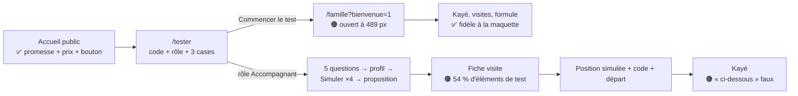

# Revue UX et accessibilité V1 — Version conso (nouveau design)

> **Rôle :** expert accessibilité et UX (publics seniors, faible littératie numérique).
> **Objet :** la V1 refaite avec le design validé par le fondateur.
> 1. Le site web `plateforme/` : accueil public, mode test, espace famille, espace accompagnant.
> 2. L'app accompagnant Expo `mobile/`, testée par son export web (mode `simule`, plus une API factice pour la coupure réseau).
>
> **Références :** [`site/maquette-conso.html`](../../site/maquette-conso.html) (validée « nickel »), [`docs/design/direction-artistique.md`](../design/direction-artistique.md) (DA), revue précédente [`S1b-ux.md`](S1b-ux.md).
> **Date :** 5 octobre 2026.
> **Méthode :** navigation réelle avec Playwright (Chromium 1194). Web : 6 configurations (360, 390 et 1280 px × clair et sombre), 21 écrans par configuration. App : 4 configurations (360 et 390 px × clair et sombre), 17 écrans, plus SOS et coupure réseau réelle (`context.setOffline`). Audit **axe-core 4.13** (WCAG 2.0 / 2.1 / 2.2 A et AA + bonnes pratiques) sur chaque écran. Mesures scriptées : cibles < 44 px, texte < 15 px, défilement horizontal, ordre du clavier, focus après erreur, réseau lent (400 kb/s, 400 ms).
> **Captures :** `/tmp/claude-0/-home-user-Jarvis/c58b0422-bce4-55e5-a168-05a20f9d1a6b/scratchpad/shots-v1-ux/` (`web-p*` public, `web-f*` famille, `web-a*` accompagnant web, `app-*` app ; suffixe `-ecran` = premier écran, `-page` = page entière).
> **Pas de code modifié. Pas de `db:seed`.**

---

## 0. Verdict

**GO sous conditions.** Le nouveau design est réussi : l'accueil public, le Kayé, le reçu de visite et l'app sont fidèles à la maquette, en clair et en sombre. axe ne trouve **presque rien** sur le web. Les deux parcours web et le parcours app vont jusqu'au bout dans toutes les configurations.

Mais **3 points cassent la première impression** que le fondateur veut tester :

1. Après « Commencer le test », la page s'ouvre **déjà défilée de 489 px** : le testeur ne voit ni « Bonjou, Nadia », ni le panneau du test.
2. Le **mode test gêne encore** : jusqu'à **54 % du premier écran** sur la fiche visite accompagnant.
3. Dans l'app, le **pied d'action du Kayé est transparent** : « Garder en brouillon » se superpose au champ de texte.

Corrigez les **9 majeurs** avant la session pilote. Les 4 premiers du § 6 sont rapides (une ligne de défilement, du CSS, des textes).

| Gravité | Nombre | Sens |
|---|---|---|
| 🔴 Bloquant | **0** | Le testeur ne peut pas finir. |
| 🟠 Majeur | **9** | Le testeur hésite, se trompe, ou la mesure est faussée. |
| 🟡 Mineur | **16** | Gêne, finition, conformité partielle. |
| 🔵 Suggestion | **5** | Amélioration utile, pas nécessaire au test. |

### Ce qui marche bien

- **Fidélité à la maquette** : accueil public (titre Fraunces « De loin, *sachez* qu'elle va bien. », filet madras, illustration au trait, carte Kayé en verre dépoli), Kayé détail et reçu (ticket, encoches, verdict `feuille-soft`), fiche visite de l'app (carte « Mer Caraïbe », anneau madras, puces « Dominos », « Son jardin »). `web-p01-accueil-1280-dark-ecran.png`, `web-f03-kaye-detail-360-dark-page.png`, `app-05-fiche-390-light-page.png`.
- **Thème sombre propre** partout : noir vert doux, pas de noir pur, aucun défaut de contraste axe en sombre.
- **axe web** : 1 seule règle en défaut sur 126 analyses (radio de 20 px à 360 px, orientation). Aucun défaut de contraste, de libellé ou de titre.
- **Focus visible** conforme à la DA : contour 3 px + halo, sur chaque élément testé au clavier. Lien d'évitement en premier.
- **Aucun défilement horizontal** à 360 px, web et app.
- **Le test des 30 secondes passe sur l'accueil public** (voir § 1). C'était le point faible de S1b.
- **SOS** : clair, confirmation avant envoi, boutons **15 SAMU** et **112 Urgences** toujours visibles, message juste sans réseau (« l'alerte n'est pas partie… appelez le 15 ou le 112 »).
- **Hors ligne** : bandeau « Hors ligne · 1 envoi en attente », texte gardé, envoi au retour du réseau.
- **Ton** : « Bonjou, Josiane », « Bon travay », « Mèsi anpil ! », « Refuser est toujours possible, sans pénalité ». Respectueux et chaleureux.

---

## 1. Le test des 30 secondes

| Écran | Le testeur comprend en 30 s ? | Pourquoi |
|---|---|---|
| Accueil public (390 px) | ✅ **Oui** | Promesse, prix (« Libre 0 €, Kozé 39 €, Sérénité dès 149 € ») et bouton « Tester Koudmen » au pouce, dans le **premier écran**. `web-p01-accueil-390-light-ecran.png` |
| Accueil public (1280 px) | ✅ Oui | Bouton dans le héros, prix sous le bouton. |
| Accueil famille (après l'entrée) | 🟠 **Non** | La page s'ouvre défilée (M1). Le testeur arrive sur « 1 visite à vérifier » sans contexte. `web-f01-accueil-390-light-ecran.png` |
| Accueil famille (rechargé) | 🟡 Moyen | Le titre « Bonjou, Nadia » commence à **339 px** sur 800 (42 %). La carte d'état « Un point à surveiller » est sous la ligne de flottaison. |
| Fiche visite accompagnant (web) | 🟠 **Non** | 54 % de l'écran = éléments de test (M2). `web-a08-fiche-visite-390-light-ecran.png` |
| App : visites, fiche | ✅ Oui | « Bonjou, Josiane · 2 visites », carte de la visite, gros bouton « Ouvrir la visite ». Très proche de la maquette d. `app-04-visites-390-light.png` |

---

## 2. Le mode test gêne-t-il encore ?

**Réponse : moins qu'en S1b, mais encore trop sur mobile.**

Le panneau « Votre test » est bien plus compact (une ligne + « Simuler la suite » + « Détails » replié). Mais les éléments de test **s'empilent** :

| Élément de test (390 px, fiche visite accompagnant) | Hauteur |
|---|---|
| Bandeau « Version de test… » (2 lignes) | 44 px |
| En-tête : logo, puis une **2ᵉ ligne** « Mode test » + « Se déconnecter » | ~130 px |
| Panneau « Test 6/9 · Maintenant… » + « Simuler la suite » + « Détails » | ~250 px |
| Invite « Scénario terminé : Ma première mission · Répondre (1 minute) » | ~80 px |
| **Total avant « Chez Ernest »** | **~430 px sur 800 (54 %)** |

Plus bas, dans la même fiche : carte « Code affiché chez Ernest (test) », alerte « Mode test : vous pouvez enregistrer votre arrivée avant l'heure prévue », bloc « Mode test : … Simulez la position ». Soit **6 éléments de test** sur un seul écran de travail. Les questions rapides (« Vous inscririez-vous pour de vrai ? », « À partir de quel prix… trop cher ? ») sont aussi **au milieu du contenu**.

Voir M2 pour la correction.

---

## 3. Constats

Format : **ID · écran · problème · correction.** Les captures sont dans le dossier indiqué en tête.

### 🟠 Majeurs

| ID | Écran | Problème | Correction |
|---|---|---|---|
| **M1** | `/famille?bienvenue=1`, `/accompagnant?bienvenue=1` (toutes largeurs) | Après « Commencer le test », la page s'ouvre **défilée de 489 px** (`scrollY = 489`, focus sur `body`). Le titre « Bonjou », le logo et le panneau du test sont **au-dessus de l'écran**. Le défilement de la page `/tester` (bouton en bas) est gardé après la redirection. Au rechargement, `scrollY = 0` : le défaut vient de la redirection. `web-f01-accueil-390-light-ecran.png`, `web-f01-accueil-1280-light-ecran.png` | Après la redirection de bienvenue : `window.scrollTo(0, 0)` puis focus sur le `h1` (`tabIndex={-1}`). Ajouter un test e2e : `scrollY === 0` après l'entrée. |
| **M2** | Tous les écrans connectés, surtout la fiche visite accompagnant | Le mode test occupe **jusqu'à 54 %** du premier écran (§ 2). L'en-tête passe sur 2 lignes à 390 px à cause de la pastille « Mode test ». L'invite « Scénario terminé… Répondre (1 minute) » ne dit pas **à quoi** on répond. `web-a08-fiche-visite-390-light-ecran.png` | 1. Retirer la pastille « Mode test » de l'en-tête (le bandeau et le panneau le disent déjà) : en-tête sur 1 ligne. 2. Panneau sur **1 ligne** sous 430 px : barre + « 6/9 » + bouton icône ▶ « Simuler la suite » (avec `aria-label`) + « Détails ». 3. Mettre « Scénario terminé » et les questions rapides **dans** « Détails » ou en fin de page. 4. Fusionner les 3 blocs « Mode test » de la fiche visite en **un seul** bloc repliable « Aide pour le test ». Cible : moins de 120 px avant le titre. |
| **M3** | App · Kayé (`ecran-kaye-formulaire`), 360 et 390 px, clair et sombre, en ligne et hors ligne | Le **pied d'action n'a pas de fond**. Le bouton désactivé (opacité 0,45) laisse voir les puces dessous. Le lien « Garder en brouillon » **se superpose** au libellé « Une note pour la famille » et au champ : texte illisible. `app-10-kaye-form-390-light.png`, `app-10-kaye-form-360-dark.png`, `app-19-hors-ligne-kaye-390-light.png` | Appliquer la DA § 10 : fond `bg` plein + dégradé de 32 px vers le haut derrière le pied d'action. Réserver **120 px** (plus la hauteur du lien) en bas du défilement. Bouton désactivé : fond opaque `surface-2`, pas d'opacité globale. |
| **M4** | Web famille (visites, Kayé), web accompagnant (fiche), app (fiche) | **Un terme = plusieurs sens** pour les 3 preuves. Position : « Position au domicile » (reçu, fiche web) / « Position à l'arrivée » (liste des visites web, app). Appel : « Appel de confirmation » (reçu) / « Confirmation de l'aîné » (visites web) / « Appel à Ernest » (fiche web) / « Confirmation de Léonie » (app). État d'une preuve absente d'une visite **passée** : « pas encore », « non validé », « Pas encore reçue ». Compteur : web « 0 sur 3 » ; app « Preuve 0/2 » **à côté de** « Preuve d'arrivée · 2 sur 3 » (deux chiffres contraires sur la même ligne). `web-f04-visites-390-light-page.png`, `web-f03-kaye-detail-390-light-page.png`, `app-09-arrivee-390-light.png` | Un lexique unique (dans `lib/labels`, repris par `mobile/`) : **Position à l'arrivée**, **Code du domicile**, **Appel de confirmation**. États : « Obtenue » / « À faire » / « Non obtenue » (visite finie). Un seul compteur : « 1 preuve sur 3 · il en faut 2 ». |
| **M5** | Kayé : web accompagnant et app | Le **même formulaire** diffère. Ordre de l'humeur inversé : web « Très bas → Très bien », app « Très bien → Très bas ». Appétit : « Non observé » (web) / « Pas vu » (app). Bouton : « Envoyer le Kayé » / « Envoyer à la famille ». Erreurs : le web laisse appuyer et explique ; l'app grise le bouton. Une accompagnante qui utilise les deux se trompe d'humeur. `web-a12-kaye-form-360-dark-ecran.png`, `app-10-kaye-form-390-light.png` | Choisir un ordre (conseil : du mieux au moins bien, comme l'app) et le même vocabulaire des deux côtés. Un seul libellé de bouton : « Envoyer le Kayé ». |
| **M6** | Web famille · fiche de l'aîné ; app · fiche visite | **Modèle mental incohérent pour le code du domicile.** La famille lit : « Écrivez ce code en grand sur une feuille… l'accompagnant saisit ce code » (code `V7EAS8`). L'app propose d'abord **« Scanner le QR code »**, avec un code d'un autre format (`KDM482`). La famille n'a jamais de QR à afficher. `web-f06-fiche-aine-390-light-page.png`, `app-06-scan-explication-390-light.png` | Soit le web propose « Imprimer la feuille du domicile » (code en grand **et** QR), soit l'app met « Saisir le code » en premier et le scan en second. Aligner le format du code. [À VÉRIFIER] décision produit. |
| **M7** | Tous les formulaires web (`FormMessage`) : `/tester`, Kayé, profil… | Le résumé d'erreur dit « Corrigez les 5 champs signalés **ci-dessous** », mais il est **sous** les champs, juste au-dessus du bouton. Le focus reste sur `body` : le lecteur d'écran annonce l'alerte, mais l'utilisateur doit remonter seul. `web-p03-tester-erreurs-390-light-ecran.png`, `web-a13-kaye-erreurs-390-light-page.png` | Texte : « Corrigez les 5 champs signalés **plus haut** » (`components/ui/form-message.tsx`). Mieux : résumé **en haut** du formulaire, un lien par champ, et focus sur le premier champ en erreur (WCAG 3.3.1, bonne pratique 3.3.3). |
| **M8** | App · connexion, fiche (« Valider mon arrivée »), Kayé | Les boutons principaux sont **désactivés** tant que le formulaire est incomplet (`disabled`, `tabIndex = -1`, opacité 0,45). Au clavier et au lecteur d'écran, le bouton **n'existe pas**. Sur « Me connecter » et « Envoyer à la famille », rien ne dit pourquoi il est gris. Le texte blanc sur mer pâle est peu lisible pour un œil âgé. `app-01-connexion-390-light.png`, `app-05-fiche-390-light-page.png` | Garder le bouton **actif**. Au toucher, afficher l'erreur près du champ (comme le web : « Choisissez l'humeur. »). Si le bouton reste gris : `aria-disabled` sans `tabIndex = -1`, et une phrase sous le bouton (déjà fait pour l'arrivée, à faire pour la connexion et le Kayé). |
| **M9** | Web famille · Demandes (`/famille/demandes`) | **Textes contradictoires et jargon.** « Employeur : L'aîné lui-même — Léonie J. » puis « Vous êtes l'employeur : vous choisissez ». « Demande de Frédéric » alors que la testeuse est Nadia (aucune explication). « Payé par la famille, avec le CESU », « Niveau 1 — Lien » sans aide sur cette page. `web-f08-demandes-390-light-page.png` | Une seule phrase juste, par exemple : « Léonie est l'employeur. Vous choisissez avec elle. » [À VÉRIFIER] avec la revue juridique. Expliquer Frédéric : « Frédéric (un proche, personnage du test) a fait cette demande. » Ajouter le bouton « ? » (déjà utilisé ailleurs) sur CESU et Niveau. |

### 🟡 Mineurs

| ID | Écran | Problème | Correction |
|---|---|---|---|
| m1 | Tous les écrans web connectés | Le sélecteur **Clair / Sombre apparaît 2 fois** (fin de page et pied de page). | Le garder une fois (pied de page). |
| m2 | App · Visites | Faute : « **2 nouvelle propositions** ». | « 2 nouvelles propositions » (accord selon le nombre). |
| m3 | App · fiche ; web · propositions | Écriture inclusive mélangée : « Je suis arrivé·e » (point médian, lu « arrivé point e ») et « choisi(e) », « payé(e) ». Difficile en faible littératie et au lecteur d'écran. | Tournures neutres : « Mon arrivée » ; « Une famille veut vos visites ». |
| m4 | Web et app | Texte **sous 16 px**, contraire à la DA (« jamais < 16 px ») : messages d'erreur 14 px (« Choisissez l'humeur. »), libellés d'humeur 13 px, bandeau test 13 px, « SOS » 14 px, onglets de l'app 12,5 px, jours « VEN » 12 px, « Preuve 0/2 » 14 px. | Erreurs et libellés d'humeur à 15–16 px. Les jours et onglets peuvent rester (légendes), pas les erreurs. |
| m5 | Web | Cibles **sous 44 px** (DA) : boutons « ? » des mots utiles 24 × 24, pagination du Kayé 41 × 44, lien « Maintenant : … » du panneau 18 px de haut à 390 px, radios de l'orientation 20 px à 360 px (axe `target-size`). | Bouton « ? » : zone 44 × 44 (le dessin peut rester à 24). Lien du panneau : `min-h-11`. |
| m6 | Web accompagnant · Propositions | Jargon interne : « Proposition du robot Koudmen **(bac à sable)** ». | « Proposition de l'équipe Koudmen (personnage du test). » |
| m7 | App et web · Kayé, 360 et 390 px | Le libellé **« Correct »** touche ou dépasse le bord de sa puce. | Réduire le remplissage horizontal, ou passer sur 2 lignes comme « Très bien ». |
| m8 | App · Kayé, 360 px | Titre « Comment va Léonie aujourd'hui » avec un **« ? » seul** sur la dernière ligne. | Espace fine insécable (U+202F) avant « ? » (règle DA § 4). |
| m9 | Web famille · fiche, visites | « Fiche de l'aîné », « Confirmation de l'aîné » pour Léonie (une femme). « Donné par Léonie J. (personnage fictif) (l'aîné lui-même) » : deux parenthèses. | Utiliser le prénom : « Fiche de Léonie », « Appel de confirmation ». « Donné par Léonie elle-même (personnage fictif). » |
| m10 | Web famille · accueil | **Message doublé** : carte « 1 point à surveiller ces 30 derniers jours » puis carte d'état « Un point *à surveiller.* ». | Garder la carte d'état seule. La ligne « 1 visite à vérifier » peut rester. |
| m11 | Web famille · accueil | Écarts avec la maquette b : pas de **ligne créole** sous l'état (« *Sa ka maché* »), chiffres différents (humeur 3/5, proches, demande, au lieu de visites, preuves, ponctualité), onglets « Visites, Demandes, Formule » au lieu de « Lakou, Agenda, Compte ». | Ajouter la ligne créole en `soleil-ink`. Garder les onglets actuels si c'est un choix produit [À VÉRIFIER], et le noter dans la DA. |
| m12 | App · fiche visite (après l'arrivée) | axe `scrollable-region-focusable` (sérieux) : la zone qui défile n'est pas atteignable au clavier. axe `region` sur tous les écrans : pas de repères (`main`, `nav`) dans l'export web. | `role="main"` sur l'écran, `role="navigation"` sur la barre d'onglets, `tabIndex={0}` sur la zone qui défile. Effet sur téléphone natif probablement faible [À VÉRIFIER] avec TalkBack et VoiceOver. |
| m13 | App · Kayé hors ligne | Le message « Pas de réseau. Le Kayé est gardé sur ce téléphone… » est **sous la ligne de flottaison**. Seul le bandeau du haut change. | Afficher le message près du bouton (dans le pied d'action) ou en haut de l'écran. |
| m14 | Web public · `/tester` | Impasse : « Pas de code ? … Écrivez à l'équipe (voir les mentions légales). » Le visiteur doit chercher une adresse. | Donner l'adresse, ou un bouton « Demander un code ». |
| m15 | Web public · accueil, mobile | Le pied d'action collant (« Gratuit · 10 minutes · Tester Koudmen ») cache la légende « Kayé de Léonie · exemple fictif » de l'illustration au premier écran. | Remonter la légende de 40 px, ou placer l'illustration après le paragraphe du prix. |
| m16 | Web public · réseau lent | Accueil : **342 Ko**, premier affichage 2,1 s, chargement complet **7,5 s** en 3G lente (S1b : 130 Ko, 3,5 s). Les polices pèsent ~150 Ko (Fraunces à axe optique). Les pages connectées restent légères (30 Ko). | Sous-ensemble latin de Fraunces, axe `opsz` réduit. Viser moins de 200 Ko. |

### 🔵 Suggestions

| ID | Sujet | Proposition |
|---|---|---|
| s1 | Web 1280 px, famille | La colonne de 440 px suit la DA, mais la **barre d'onglets mobile** en bas d'un écran de bureau surprend. Mettre les onglets en haut à partir de 1024 px. |
| s2 | App · Profil | L'adresse e-mail est coupée (« accompagnant@demo.koudmen.te… »). Passer sur 2 lignes. |
| s3 | App · export web | 1,4 Mo et ~29 s en 3G lente. Sans effet sur l'app native, mais gênant si l'export web sert de démo. |
| s4 | Panneau de test | Remplacer « Simuler la suite » par un verbe concret selon l'étape : « Faire répondre l'équipe Koudmen », « Faire accepter Josiane ». |
| s5 | Web famille · formule | « Offre en test, non commercialisée » apparaît 2 fois sur le même écran. Une fois par bloc de prix suffit. |

---

## 4. Cohérence web / app

| Sujet | Web | App | Verdict |
|---|---|---|---|
| Couleurs, polices, rayons, madras | Jetons DA | Mêmes jetons | ✅ Cohérent |
| Carte de la visite (carte, anneau, puces) | Fiche visite web | Fiche visite app | ✅ Même dessin |
| Nom des preuves | 3 variantes | 1 variante, différente | 🟠 M4 |
| Compteur de preuves | « 0 sur 3 » | « Preuve 0/2 » + « 2 sur 3 » | 🟠 M4 |
| Formulaire Kayé | Très bas → Très bien, « Non observé » | Très bien → Très bas, « Pas vu » | 🟠 M5 |
| Code du domicile | Feuille écrite, `V7EAS8` | QR d'abord, `KDM482` | 🟠 M6 |
| Bouton d'un formulaire incomplet | Actif + erreurs | Désactivé, hors du clavier | 🟠 M8 |
| Navigation | Accueil, Propositions, Visites, Profil | Visites, Kayé, Profil | 🟡 Acceptable (usages différents), à documenter |
| Écriture inclusive | « choisi(e) » | « arrivé·e » | 🟡 m3 |

---

## 5. Conformité WCAG 2.2 AA (synthèse)

| Critère | Web | App (export web) |
|---|---|---|
| 1.4.3 Contraste | ✅ Aucun défaut (clair et sombre) | ✅ Aucun défaut axe ; bouton désactivé peu lisible (exempté, voir M8) |
| 1.4.10 Redistribution (360 px) | ✅ Pas de défilement horizontal | ✅ ; chevauchement du pied d'action (M3) |
| 2.1.1 Clavier | ✅ | 🟠 Boutons désactivés hors tabulation (M8), zone de défilement (m12) |
| 2.4.1 Contourner des blocs | ✅ Lien « Aller au contenu » | 🟡 Pas de repères (m12) |
| 2.4.3 Ordre du focus | 🟠 Focus perdu après l'entrée (M1) et après une erreur (M7) | ✅ |
| 2.4.7 / 2.4.11 Focus visible, non masqué | ✅ Contour 3 px + halo | ✅ |
| 2.5.8 Taille des cibles (24 px) | ✅ sauf radios de 20 px à 360 px (m5) | ✅ |
| 3.3.1 / 3.3.3 Erreurs | 🟡 Texte faux « ci-dessous » (M7) | 🟡 Pas de message (M8) |
| 4.1.2 Nom, rôle, valeur | ✅ Boutons icônes nommés (« Fermer »…) | ✅ « SOS : alerter l'équipe Koudmen » |

---

## 6. Ordre de correction conseillé

1. **M1** défilement après l'entrée (1 ligne + 1 test e2e).
2. **M3** fond du pied d'action de l'app (CSS).
3. **M7** « ci-dessous » → « plus haut » (1 texte), puis focus sur le premier champ.
4. **M4 + M5** lexique unique des preuves et du Kayé (textes).
5. **M2** allègement du mode test (en-tête 1 ligne, panneau 1 ligne, invites dans « Détails »).
6. **M8** boutons actifs dans l'app.
7. **M9** textes de la page Demandes.
8. **M6** décision QR ou feuille (produit).
9. Mineurs m2, m4, m6, m7, m8 (textes et tailles, rapides).

---

## 7. Captures à montrer au fondateur

| Capture | Ce qu'elle montre |
|---|---|
| `web-p01-accueil-1280-dark-ecran.png` | ✅ La maquette est tenue : accueil public en sombre, bureau. |
| `web-f03-kaye-detail-360-dark-page.png` | ✅ Kayé et reçu de visite, fidèles, à 360 px en sombre. |
| `web-a08-fiche-visite-390-light-ecran.png` | 🟠 Le mode test prend la moitié du premier écran (M2). |
| `app-10-kaye-form-390-light.png` | 🟠 Pied d'action transparent, « Garder en brouillon » sur le champ (M3). |

Chemin complet : `/tmp/claude-0/-home-user-Jarvis/c58b0422-bce4-55e5-a168-05a20f9d1a6b/scratchpad/shots-v1-ux/`.
