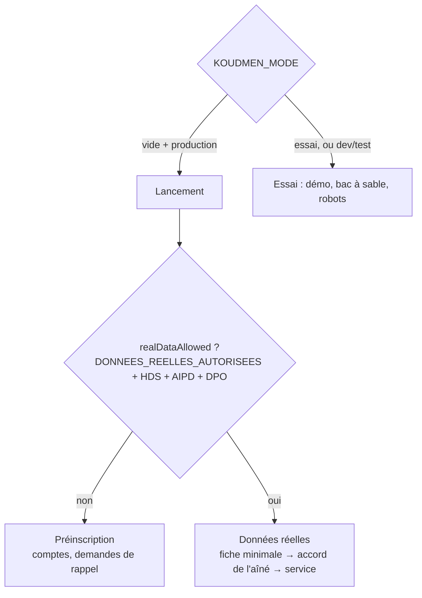

# L1-A — Comptes et mode lancement : notes de l'agent A

> Lot L1-A (`docs/revues/L1-arbitrage-lancement.md` : L1 à L4, L11, L12, § 2.1 ; § 5 : R1, R2, R5, R6, R8).
> Branche : `worktree-agent-addd62f5cf618def7`, fusionnée avec L1-B et L1-C (`claude/accompagnement-vie-marketplace-ufydih`, 97824cd).

## 1. Ce qui est fait

| # | Sujet | Où | Comment |
|---|---|---|---|
| L1 | Mode unique | `src/server/config-check.ts` (`siteMode`, `isLaunchMode`, `launchRedirect`), `src/server/launch.ts` | `KOUDMEN_MODE` gagne ; sinon lancement si `VERCEL_ENV=production` ou `NODE_ENV=production` |
| L1 | Démo fermée | `middleware.ts`, pages (`requireTrialMode()` → 404), `sandbox/actions.ts`, `guards.ts`, `token-service.ts` | `/tester*` → `/inscription`, `/cgu-test` → `/cgu`, `/famille/visite-decouverte` → `/famille/formule`, `/operateur/test` → `/operateur`. `isDemoMode()` toujours faux en lancement. Comptes de bac à sable refusés (web et API). « Simuler ma position » coupé |
| L1 | Interface | accueil, en-tête public, connexion, pied de page, nav opérateur | « Créer un compte », « Mot de passe oublié ? », pas de bouton démo, pas de « Mesure du test » |
| L2 | Inscription ouverte | `/inscription`, `server/auth/registration.ts`, `validation.ts` | Famille et accompagnant ; pas de connexion automatique ; même page si l'e-mail existe |
| L2 | Profil en validation | `components/account/account-status.tsx` | Bandeaux « Confirmez votre adresse e-mail » (renvoi du lien) et « Profil en cours de validation » (délai 7 jours) |
| L3 | MailPort | `server/mail/` (port, console, brevo, templates) | `brevo` si `BREVO_API_KEY`, sinon `console` (jamais de lien dans les journaux en production) |
| L3 | Jetons | `server/auth/account-tokens.ts`, modèle `AccountToken` | 256 bits, empreinte SHA-256, 24 h / 1 h, usage unique atomique, `timingSafeEqual` |
| L3 | Pages | `/verifier-email`, `/mot-de-passe-oublie`, `/mot-de-passe/nouveau`, `/inscription/envoye` | Le lien est consommé par un bouton (POST) : un robot de messagerie ne le consomme pas. `referrer: no-referrer` |
| L3 | Validation manuelle | `/operateur/comptes`, `operatorVerifyEmail()` | Case « J'ai appelé la personne » obligatoire, audit `auth.email_verified_manual { methode: APPEL }` |
| § 2.1 | API v1 | `api/v1/auth/inscription`, `api/v1/auth/mot-de-passe-oublie`, `api/v1/me` | Contrats `.strict()` dans `contracts/v1/inscription.ts` ; `/me` : `emailVerifie`, `profilValide`, `preinscription` |
| L4 / R8 | Offre | `server/offre/`, `/famille/formule`, `/operateur/activations`, `lib/plans.ts` | Formule payante = **demande de rappel** (`PlanActivationRequest`), aucun paiement réel ni simulé en lancement. Prix sur deux lignes, « non éligible au crédit d'impôt ». Sérénité sans volume de visites ni remplacement |
| R1 | Préinscription | `realDataAllowed()`, `assertRealDataAllowed()`, `PreinscriptionNotice` | Pas de fiche aîné ni de Kayé web ; message « Koudmen ouvre bientôt. Nous vous contactons dès l'ouverture. » ; config-check refuse `true` sans `HEBERGEUR_HDS`, `AIPD_DATE`, `DPO_CONTACT` |
| R2 | Pages juridiques | `/confidentialite` (réécrite), `/cgu`, `/conditions-accompagnants`, mentions légales | Brouillons **[À VÉRIFIER AVEC UN AVOCAT]**. Champs éditeur vides → production refusée |
| R5 | Accord de l'aîné | `Aine.accordEtat` …, `/operateur/aines`, `server/operateur/accord.ts` | Lancement : fiche minimale (prénom, commune, téléphone) `EN_ATTENTE_ACCORD`. Le conseiller lit la notice FALC, enregistre date/heure (heure de Martinique), langue, qui répond, `situationJuridique`, « jugement vu le ». Demandes bloquées sans `ACCORD_RECUEILLI` |
| R6 | Vérifications | `accompagnant/service.ts`, `operateur/actions.ts`, `rules/status-levels.ts` | B3 : aucun texte, « vu le » (`VerificationItem.seenOn`) ; `orientationAnswers` effacées à la validation ; date de naissance (18 ans min.), niveau 3 fermé sous 21 ans ; inscription accompagnant gratuite (test) |
| L11 | Base | migration `20261007190000_l1a_comptes_lancement`, `server/launch-retention.ts`, `prisma/seed.ts`, `/api/sante` | Index (`User(emailVerifiedAt, createdAt)`, `Aine(accordEtat, createdAt)`, jetons, demandes). Seed refusé en lancement. Purges : tous les bacs à sable en lancement, jetons, comptes non confirmés > 7 jours (J29), demandes de rappel > 3 mois (J35). Doc sauvegarde Neon dans `docs/deploiement-vercel.md` |
| Fusion | L1-B | `src/server/visits/launch-guards.ts` | `realDataAllowedLocal()` = `realDataAllowedFrom()` ; accord = `accordEtat === ACCORD_RECUEILLI` (repli `consentGiven` pour un ancien appelant). `/me.preinscription` suit la même règle |

## 2. Variables d'environnement (voir `plateforme/.env.example`)

| Variable | Rôle |
|---|---|
| `KOUDMEN_MODE` | `lancement` \| `essai`. Vide : lancement en production |
| `DONNEES_REELLES_AUTORISEES` | `true` ouvre les données réelles des aînés (sinon préinscription) |
| `HEBERGEUR_HDS`, `AIPD_DATE`, `DPO_CONTACT` | Obligatoires si `DONNEES_REELLES_AUTORISEES=true`. `DPO_CONTACT` s'affiche dans `/confidentialite` |
| `BREVO_API_KEY` | Envoi réel des e-mails. Absente : avertissement dans `/api/sante`, pas de 503 |
| `MAIL_FROM` | Expéditeur (`Nom <adresse>`) ; valeur invalide refusée en production |
| `MAIL_CAPTURE_FILE` | Local et CI seulement : e-mails écrits en JSON (e2e) |
| `EDITEUR_NOM`, `EDITEUR_ADRESSE`, `EDITEUR_EMAIL`, `DIRECTEUR_PUBLICATION` | Désormais **obligatoires** en production stricte (R2) |

## 3. Tests (dernier passage, après fusion L1-B / L1-C)

- Lint : 0 erreur. Typecheck : 0 erreur.
- Unitaires + base (`KOUDMEN_DB_TESTS=1`, base dédiée `koudmen_l1a`) : **64 fichiers, 603 tests, tous verts**.
- E2E (Chromium `/opt/pw-browsers`, `RATE_LIMIT_DISABLED=true`, `E2E_PORT=3270`) : **41 tests verts** — projet `chromium` (mode essai, suites existantes + L1-B) et projet `lancement` (serveur dédié `KOUDMEN_MODE=lancement`, 5 tests).
- Nouveaux tests : `config-check.test.ts` (mode, R1, R2, MAIL_FROM), `password-policy.test.ts`, `validation.test.ts`, `actions.test.ts` (inscription, mot de passe oublié), `registration.db.test.ts`, `api/v1/auth/inscription/routes.test.ts`, `contracts.test.ts`, `offre/activation.db.test.ts`, `famille/actions.test.ts` (paiement en lancement, préinscription, accord), `operateur/accord.db.test.ts`, `operateur/rules.test.ts` (B3, âge), `operateur/actions.test.ts` (orientation effacée), `launch-retention.db.test.ts`, `e2e/lancement.spec.ts`.

## 4. Limites et points ouverts

- **[À VÉRIFIER AVEC UN AVOCAT]** : `/confidentialite`, `/cgu`, `/conditions-accompagnants` (bases légales, durées « fin de l'accord + 1 an », transferts DPF, médiation). Rescrit fiscal sur l'abonnement « non éligible au crédit d'impôt ».
- **Comptes existants** : la migration marque l'e-mail de tous les comptes d'avant L1 comme confirmé (`REPRISE_L1`) et tous les aînés d'avant L1 comme `ACCORD_RECUEILLI` (données d'exemple). [À VÉRIFIER] si une base contient de vrais aînés, les repasser à `EN_ATTENTE_ACCORD`.
- **Pas de connexion automatique après l'inscription** (aucune fuite d'existence de compte) : la personne se connecte avec son mot de passe. La connexion n'exige PAS l'e-mail confirmé (L2 : « se connecter tout de suite ») ; [À VÉRIFIER] faut-il bloquer certaines actions avant la confirmation ?
- **Validation de l'accompagnant** : elle n'exige pas encore l'e-mail confirmé. [À VÉRIFIER] avec l'orchestrateur.
- **Réexamen d'un refus** (J28) : décrit dans les conditions (écrire à l'équipe) ; pas de bouton dédié.
- **Retrait de l'accord de l'aîné** : l'état passe `ACCORD_RETIRE` et bloque les nouvelles demandes ; le gel des visites déjà prévues sous 24 h et l'effacement sous 30 jours (J5) restent à coder.
- **Purge des comptes jamais confirmés** : seulement sans aîné, sans demande, sans mission. Pas encore de rappel à 24 mois / effacement à 36 mois des comptes inactifs (J29), ni d'effacement des candidatures refusées à 6 mois.
- **Kayé par l'app** (`src/server/visits/app-service.ts`, périmètre B) : la garde R1 passe par l'accord et l'absence de fiche en préinscription ; pas d'appel direct à `realDataAllowed()` dans ce fichier. [À VÉRIFIER] avec B.
- **Liste de mots de passe courants** : ~100 entrées locales (français, créole, Martinique). [À VÉRIFIER] étendre (ex. 10 000 entrées) ou vérifier par k-anonymat (Have I Been Pwned).
- **bcrypt** lit les 72 premiers octets : un mot de passe de 200 caractères est accepté (aligné sur l'app), mais seuls 72 octets comptent.
- **Brevo** : DPA à signer, domaine expéditeur à vérifier (SPF, DKIM) ; `MAIL_FROM` par défaut `ne-pas-repondre@koudmen.fr` [À VÉRIFIER] domaine.
- **Comptes démo restants en lancement** : refusés à la connexion et comptés dans `/api/sante` ; pas d'effacement automatique (recommandation : base Neon neuve pour le lancement).
- **Heure de l'appel** (accord) : saisie à l'heure de la Martinique (UTC−4, sans heure d'été).
- **E2E** : le serveur principal tourne en `KOUDMEN_MODE=essai` ; le serveur de lancement sur le port suivant. Choisir un `E2E_PORT` libre (les autres agents utilisent 3100/3717).

## 5. Écarts avec l'app mobile (`mobile/src/contrats-l1/index.ts`)

| Champ | App (L1-C) | Serveur (L1-A) | Effet |
|---|---|---|---|
| `motDePasse` max | 200 | 200 (aligné) | aucun |
| `prenom` max | 60 | 80 | aucun (serveur plus large) |
| `commune` | `min(1).max(40)` | `^[A-Z_]+$`, 2 à 60, puis liste des 34 communes | une commune inconnue → 422 |
| `telephone` | 10 chiffres au moins | 6 à 20 caractères | aucun (serveur plus large) |
| `accepteInfos` | absent | facultatif | aucun |
| `/me.preinscription` | facultatif | présent, toujours | aucun |
