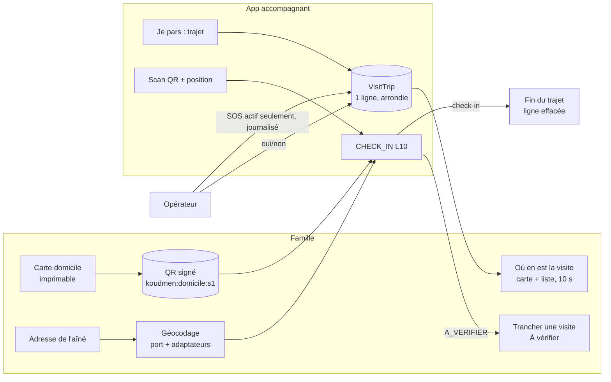

# Lot L1-B — notes (présence : QR signé, check-in, adresse, trajet, cartes)

- **Agent :** B (`dev-integrations`). Branche de travail : worktree `agent-a2899acedc3fa50bd`.
- **Décisions appliquées :** L6 à L10, puis R1, R3, R4, R5, R7 (`docs/revues/L1-arbitrage-lancement.md` § 5).
- **Références :** [`api-v1.md` § 11](api-v1.md#11-lot-l1-b--qr-signé-check-in-contrôlé-trajet-en-direct), [`integrations/geocodage.md`](integrations/geocodage.md), [`integrations/cartes.md`](integrations/cartes.md).

## 1. Vue d'ensemble



## 2. Fichiers

| Sujet | Fichiers |
|---|---|
| Schéma, migration | `prisma/schema.prisma`, `prisma/migrations/20261007180000_l1b_presence_trajet/` |
| Clés (pur, Edge) | `src/server/presence/config.ts` (+ une ligne dans `config-check.ts`) |
| Garde-fous du lancement (interface locale R1/R5) | `src/server/visits/launch-guards.ts` |
| QR signé | `src/server/presence/qr-token.ts`, `home-card.ts`, `actions.ts`, `src/components/presence/home-card*.tsx` |
| Check-in L10 | `src/server/visits/proof.ts`, `src/server/accompagnant/service.ts` (`checkInWithQr`), `src/server/visits/app-service.ts` |
| Décision famille (R7) | `src/server/presence/review.ts`, `src/components/presence/visit-review-form.tsx` |
| Adresse | `src/server/presence/address.ts`, `address-crypto.ts`, `src/server/geocodage/**` |
| Trajet | `src/contracts/v1/trajet.ts`, `src/server/presence/trajet*.ts`, `src/app/api/v1/visites/[id]/{trajet,position}/`, `src/app/api/famille/visites/[id]/trajet/` |
| Cartes | `src/components/presence/trip-map*.tsx`, `trip-live.tsx`, pages `famille/visites/[visiteId]/trajet`, `operateur/visites/[visiteId]/sos` |
| Tests | `presence.test.ts`, `trajet.test.ts`, `presence.db.test.ts`, `geocodage.test.ts`, `trajet.routes.test.ts`, `e2e/presence.spec.ts` |

## 3. Variables d'environnement (ajoutées à `.env.example`)

| Variable | Rôle | Production stricte |
|---|---|---|
| `QR_SIGNING_KEY` | Graine Ed25519 (32 octets base64) ou PKCS#8 PEM | Obligatoire ; exemple et clé de dev refusés |
| `ADDRESS_ENC_KEY` | Clé AES-256-GCM (32 octets base64) | Obligatoire ; différente de `QR_SIGNING_KEY` |
| `ADAPTER_GEOCODAGE` | `api-adresse` (défaut) ou `simule` | — |
| `DONNEES_REELLES_AUTORISEES` | Lue par `launch-guards.ts` (R1) | `true` pour ouvrir adresse, carte, trajet |

Changer `QR_SIGNING_KEY` invalide toutes les cartes imprimées. Perdre `ADDRESS_ENC_KEY` rend les adresses illisibles.

## 4. Choix et écarts par rapport au § 2.2 / 2.3 initial

| Point | Choix | Raison |
|---|---|---|
| Charge du QR | `{ c, v }` (id aléatoire de carte, version), pas `aineId` | R7 |
| Régénération | Nouvel id de carte, version + 1, **nouveau code de secours** | Une carte perdue porte aussi le code |
| Intervalle des positions | 30 s, avec 2 s de tolérance réseau (28 s) | R4 ; évite des 429 à 29,9 s |
| Durée du trajet | 60 min | R4 |
| `GET /api/operateur/trajets` | **Non livré** | R3 |
| Vue famille | Employeur (payeur) + personne désignée, pas tout le cercle | R4 |
| État famille hors trajet | `PREVUE` + heure prévue (même pendant le départ masqué) | R4 : jamais « non partagé » |
| Position simulée au trajet | 204, jamais gardée | Pas de faux point sur la carte |
| Arrivée < 150 m | Désactivée si le domicile est approximatif | Le centre de commune n'est pas le domicile |
| Résultat du check-in | `controle: { statut, raison }` | Aligné sur l'app (`mobile/src/contrats-l1`) |
| Réponse DEMARRER | `domicile` arrondi (3 décimales) | Demande de l'app (carte d'itinéraire) |
| Rayon GPS | 150 m + min(précision, 50 m) ; précision > 150 m refusée | L10 « précision prise en compte » [À VÉRIFIER] terrain |
| Domicile approximatif | La position n'est pas comparée → « À vérifier » | Honnêteté de la preuve |
| Opérateur « appel simulé » | Action désactivée (variable `KOUDMEN_OPERATEUR_CONFIRME=true` pour revenir) | R7 |

## 5. Écarts restants avec l'app (agent C)

- L'app tolère `preuves.qr` ; le serveur n'envoie que `controle` (l'app lit `controle` en premier : compatible).
- L'app exige `position.simulee` (booléen) ; le serveur l'accepte facultatif : compatible.
- L'app limite `qr` à 2000 caractères et exige le préfixe `s1` ; le serveur accepte aussi le jeton seul : compatible.
- `Visite` (GET /visites) ne porte pas l'adresse : l'app n'a l'adresse que par `domicile` (coordonnées) au démarrage du trajet. [À VÉRIFIER] avec l'orchestrateur : ajouter l'adresse en clair le jour de la visite (lecture journalisée) dans `GET /visites/:id`.

## 6. Points ouverts

1. **Fusion avec l'agent A** : remplacer `realDataAllowedLocal()` par `realDataAllowed()` et `aineConsentRecorded()` par l'état `EN_ATTENTE_ACCORD` (R5). Les deux migrations touchent `Aine` : vérifier l'ordre (`20261007120000_l1a…` puis `20261007180000_l1b…`).
2. `config-check.ts` (agent A) : une ligne ajoutée (`presenceConfigProblems`) ; `config-check.test.ts` : deux clés ajoutées à `prodEnv()`.
3. [À VÉRIFIER] critique juridique : trajet (subordination, directive 2024/2831, CNIL) ; l'écran d'information et l'accord actif avant le premier partage sont côté app (agent C).
4. [À VÉRIFIER] OpenFreeMap (conditions, pas de SLA) ; API Adresse (migration IGN, qualité en Martinique).
5. [À VÉRIFIER] Constantes terrain : 150 m, tolérance 50 m, 30 km/h et détour × 1,4 pour les minutes estimées.
6. Durée réelle des sauvegardes (R4) : les sauvegardes Neon peuvent garder une position jusqu'à la fin de leur fenêtre de restauration. À écrire avec l'agent A (L11).
7. `sweepOverdueVisits` et `displayVisitStatus` (famille) ne lisent pas `lateCheckInAt` dans toutes les sélections : le statut en base reste juste (refreshVisitStatus), l'affichage recalculé peut différer jusqu'au rechargement.
8. Le mode simulé de l'app est dans `mobile/**` (agent C) : rien à changer côté serveur.

## 7. Tester

```bash
cd plateforme
pnpm lint && pnpm typecheck && pnpm vitest run
KOUDMEN_DB_TESTS=1 pnpm vitest run db.test
pnpm build:local && RATE_LIMIT_DISABLED=true E2E_PORT=3717 pnpm e2e
```

Résultats au dernier commit : 470 tests unitaires (74 ignorés sans base), 74 tests base, 36 e2e (suite complète).
Remarque : avec le `.env` copié de `.env.example`, `RATE_LIMIT_DISABLED="false"` est lu par Playwright ; il faut `RATE_LIMIT_DISABLED=true` en ligne de commande pour les e2e.
