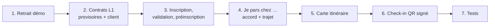

# L1-C — App mobile accompagnant : notes de l'agent C

> Lot L1 (passage en mode lancement), périmètre agent C : `mobile/**` seulement.
> Référence : `docs/revues/L1-arbitrage-lancement.md` (L5-L7, L9-L10, § 2.1-§ 2.3), plus les décisions de l'orchestrateur
> après la critique juridique (message du 2026-10-07).
> Branche de travail : worktree de l'agent C. Rien n'est poussé.

## 1. Ce qui est fait

| Étape | Commit | Contenu |
|---|---|---|
| 1 | `5d18aa1` | Plus de bouton ni d'identifiants de démonstration. `connecterDemo` supprimé. Mode simulé sans texte « démo ». `react-native-maps` 1.27.2 (version du SDK 57) |
| 2 | `efe069b` | `mobile/src/contrats-l1/` (provisoires). Client HTTP et simulé : inscription, mot de passe oublié, `/me` L1, trajet, position, CHECK_IN avec `qr` |
| 3 | `e057c69` | Écrans : créer un compte, mot de passe oublié, « Vérifiez votre e-mail », « Profil en cours de validation », « Koudmen ouvre bientôt », rappel e-mail |
| 4 | `d53416e` | Accord avant le premier partage, gestionnaire de trajet, bandeau persistant, arrêts automatiques, Profil (retirer l'accord) |
| 5 | `9972ee9` | Carte `react-native-maps` + plan schématique de repli + « Ouvrir dans Plans / Google Maps » |
| 6 | `09e403d` | QR `s1` envoyé dans `qr`, position avec `simulee`, résultat VALIDE / À vérifier / refusé, code de secours |
| 7 | `0215c3f` | Tests unitaires et e2e L1, retouches |

## 2. Décisions de l'orchestrateur appliquées (critique juridique)

| Sujet | Avant (arbitrage L1) | Appliqué dans l'app |
|---|---|---|
| Accord trajet | Consentement à chaque départ | Écran d'information + « J'accepte » avant le **premier** partage. Accord mémorisé par compte (`expo-secure-store`, web : mémoire), révocable dans Profil. Refuser n'a aucun effet sur les missions |
| Fréquence | 10-15 s | **30 s** au plus (`INTERVALLE_POSITION_TRAJET_S`) |
| Précision | Position brute | Envoyée **arrondie à 3 décimales** (~100 m), `precisionMetres ≥ 100`. La lecture précise reste en mémoire (carte de l'accompagnant, arrêt à 150 m) puis est oubliée |
| Fin | Check-in, arrêt, 90 min | Check-in, « Arrêter », **60 min**, **< 150 m** d'un domicile précis, app en arrière-plan, 409 du serveur, déconnexion |
| Qui voit | Famille + opérateur | Texte : « La famille qui vous emploie, et la personne choisie par l'aîné. Personne d'autre. » (l'opérateur ne voit pas la carte) |
| Permission | — | « Pendant l'utilisation » seulement ; jamais « Toujours » (`app.json` bloque toujours `ACCESS_BACKGROUND_LOCATION`) |
| Inscription | Cases CGU + confidentialité | `dateNaissance` (≥ 18 ans), case **CGU** seule, confidentialité = **lien**. « L'inscription est gratuite. » |
| Préinscription | — | `GET /me` `preinscription: true` → écran « Koudmen ouvre bientôt en Martinique. Votre compte est prêt. Nous vous contactons pour la suite. » Aucune visite chargée |
| Check-in | — | Résultat affiché. Ni coordonnées ni jeton gardés dans l'écran après l'envoi |

## 3. Contrats provisoires (à remplacer)

Les contrats serveur des agents A et B n'existaient pas pendant le travail. L'app utilise `mobile/src/contrats-l1/index.ts`
(hors de `src/contracts/`, jamais écrasé). `npm run sync:contracts` affiche une **note L1** tant que le serveur ne les publie pas.

| Contrat | Forme retenue par l'app | [À VÉRIFIER] avec |
|---|---|---|
| `POST /auth/inscription` | `{ role, prenom, nom, email, telephone, dateNaissance (AAAA-MM-JJ), motDePasse, commune, accepteCgu: true }` → `201 { etat }` | Agent A |
| `POST /auth/mot-de-passe-oublie` | `{ email }` → `202` | Agent A |
| `GET /me` | + `emailVerifie?`, `profilValide?`, **`preinscription?`** (nom du champ inventé), `demo`/`bacASable` facultatifs | Agent A + orchestrateur |
| `POST /visites/{id}/trajet` | `{ action }` → `{ trajet: { etat, expireA }, domicile? }`. **`domicile` n'est pas dans le § 2.2** : sans lui, centre de la commune « approximatif » | Agent B |
| `POST /visites/{id}/position` | `{ latitude, longitude, precisionMetres, survenuA, simulee }` → `204`, `409`, `429` | Agent B |
| CHECK_IN | `qr?`, `codeDomicile?`, `position?: { latitude, longitude, precisionMetres?, consentement: true, simulee }`. `consentement` gardé pour compatibilité | Agent B |
| Résultat du contrôle | Lu dans `controle` **ou** `preuves.qr` : `{ statut: VALIDE \| A_VERIFIER \| REFUSE, raison }`. Jeton refusé : motif `INVALIDE` ou `INTERDIT` | Agent B |

Les schémas de **réponse** sont tolérants (un champ en plus ne casse pas l'app). Un serveur d'avant L1 reste accepté (compte « actif »).

## 4. Expo Go

- Tout marche dans Expo Go : `expo-location` (`watchPositionAsync` au premier plan), `expo-camera`, `expo-secure-store`, `react-native-maps` (inclus dans Expo Go).
- `react-native-maps` n'existe pas sur le web : `CarteTrajet.tsx` (web) montre le plan schématique ; `CarteTrajet.native.tsx` charge la carte.
- Repli de la carte : pas de `onMapReady` en 10 s, ou erreur du module → plan schématique + « Ouvrir dans … ». Cas attendu : build Android **sans clé Google Maps** (L7).
- Installation : le réseau Expo est bloqué dans le bac de travail ; `EXPO_OFFLINE=1 npx expo install react-native-maps` a pris la version de `bundledNativeModules.json` (1.27.2).

## 5. Tests

| Suite | Résultat |
|---|---|
| `npx tsc --noEmit` | OK |
| `npm run test:l1` (nouveau) | 16 / 16 |
| `npm run test:hors-ligne` | 39 / 39 |
| `npm run test:push` | 9 / 9 |
| `npm run test:natif` | 6 / 6 |
| `npm run e2e:natif` (export simulé) | 8 / 8 |
| `npm run e2e:simule` (dont `l1.spec.ts` : 9) | 31 / 31 |
| `npm run e2e:hors-ligne` (API factice) | 3 / 3 |
| e2e « serveur réel » | **Non lancé** : demande `plateforme/` avec les routes L1 des agents A et B |

Tests modifiés : `fiche-native.spec.ts` (le jeton `s1` est maintenant accepté) et `v1c.spec.ts` (texte de la carte domicile).

Lint : le projet n'a pas de configuration ESLint. `npx expo lint` en installe une (non gardée). Les nouveaux fichiers L1 passent ;
il reste des erreurs **anciennes** de `react-hooks` v7 (`Mouvement.tsx`, `SessionProvider.tsx`, refs dans les fiches).

## 6. Points ouverts

1. **Contrats serveur** : brancher l'app sur les contrats des agents A et B, puis supprimer `src/contrats-l1/` (§ 3).
2. **Préinscription** : nom et forme du signal serveur à fixer (`/me.preinscription` supposé).
3. **Domicile pour la carte de l'accompagnant** : le § 2.2 ne le donne pas à l'app. Proposition : `domicile` dans la réponse de `POST /trajet` (position arrondie si besoin).
4. **Lien CGU** : l'app ouvre `${WEB_URL}/cgu`. Le site a seulement `/cgu-test` aujourd'hui [À VÉRIFIER] avec l'agent A.
5. **Contact équipe** : `contact@koudmen.fr` par défaut (`EXPO_PUBLIC_EMAIL_CONTACT`) [À VÉRIFIER] domaine.
6. **iOS** : `watchPositionAsync` ne respecte pas `timeInterval` ; le gestionnaire limite l'envoi à 30 s. À vérifier sur téléphone (batterie).
7. **Arrière-plan** : le partage s'arrête dès que l'app passe en arrière-plan (écran verrouillé compris). C'est voulu (premier plan seulement), mais l'accompagnant doit garder l'app ouverte en voiture. Message clair affiché ; à valider en test terrain.
8. **Check-in hors ligne** : un CHECK_IN sans réseau reste dans la file chiffrée (lot M3) jusqu'à l'envoi, avec la position. Il est effacé dès l'envoi. Rien d'autre n'est gardé.
9. **Textes ≥ 16 px** : les nouveaux écrans utilisent 16 px et plus. La variante `small` du thème (15 px) reste utilisée par les anciens écrans.
10. **Invites système** : dans Expo Go, les textes de permission sont ceux d'Expo Go. Les textes Koudmen de `app.json` (mis à jour pour le trajet) apparaissent au premier build EAS.
11. **Critique juridique L6** (subordination, directive 2024/2831, CNIL) : l'app applique les garde-fous demandés ; la validation reste [À VÉRIFIER] avocat / DPO.
