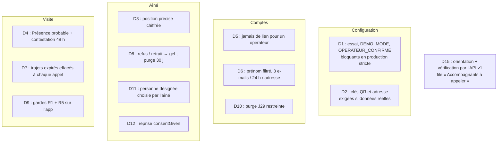

# L1d — F1 (serveur) : notes

> Agent F1 `dev-backend`. Décisions : [`L1-arbitrage-revues.md`](../revues/L1-arbitrage-revues.md) D1 à D12, D15 (serveur), mineurs serveur.
> Base de test : `koudmen_l1d_f1`. Rien de poussé. Fusion de `claude/accompagnement-vie-marketplace-ufydih` (F2, F3) faite et réconciliée.

## 1. Vue d'ensemble

## 2. Ce qui est fait

| # | Où | Comment |
|---|---|---|
| D1 | `config-check.ts` | `productionConfigProblems()` : `KOUDMEN_MODE=essai`, `DEMO_MODE=true`, `KOUDMEN_OPERATEUR_CONFIRME=true` → page 503 en production stricte. L'avertissement « mode essai » reste seulement pour `NODE_ENV=production` non strict (e2e) |
| D2 | `presence/config.ts` | `presenceKeysRequired()` = lancement + `realDataAllowed()` + (production stricte ou `NODE_ENV=production`). Clé absente : problème seulement dans ce cas. Clé présente : exemple, forme, clé de développement, entropie (16 octets différents au moins) contrôlés. `resolveQrKey/AddressKey` : jamais de repli sur la clé de développement dans ce cas. `productionConfigProblems()` contrôle les clés aussi hors production stricte (Preview, Clever Cloud) |
| D3 | `presence/address.ts`, `address-crypto.ts` | `Aine.homeGeoEnc` (AES-256-GCM, préfixe `g1`, AAD distincte de l'adresse). En clair : centre de la commune. `homePoint()` déchiffre en mémoire (check-in, arrivée du trajet, vue famille, SOS). Reprise : la purge de nuit chiffre les positions géocodées avant L1d (`encryptLegacyHomeLocations`) |
| D4 | `visits/proof.ts`, `visits/service.ts`, `presence/review.ts` | Lancement : 2 preuves sans `CONFIRMATION_AINE` → `PRESENCE_PROBABLE`. `Visit.contestedAt` : la famille employeur conteste (`SIGNALER`) 48 h après le check-in → `A_VERIFIER`, opérateurs prévenus. `CONFIRMER` → `VALIDEE`. Notification `VISITE_PRESENCE_PROBABLE`. Mode essai : règle d'avant |
| D5 | `auth/registration.ts` | Branche « e-mail connu » : rien pour un opérateur ; limite `mdp-oublie:compte` aussi. `resetPassword()` refuse l'opérateur (aussi dans la transaction) |
| D6 | `contracts/v1/inscription.ts`, `auth/validation.ts`, `rate-limit-rules.ts` | Prénom et nom : `^[\p{L}\p{M}][\p{L}\p{M} '’-]*$`, 40 caractères. Règle `email:destinataire` 3 / 24 h, tous chemins (inscription, compte existant, oubli, renvoi). L'alerte « mot de passe changé » n'est pas limitée |
| D7 | `presence/trajet.ts`, `/confidentialite` | `purgeExpiredTrips()` en tête de chaque lecture ou écriture de trajet. Texte : « Effacée à l'arrivée, au plus tard la nuit suivante » ; accord unique et retirable |
| D8 | `operateur/accord.ts`, `launch-retention.ts` | `freezeAine()` (refus, retrait) : propositions annulées, demandes closes, missions suspendues, visites à venir effacées, carte révoquée (`homeCardId` null, version + 1), nouveau code, trajets et brouillons effacés, personne désignée effacée. Purge de nuit : refusée, en attente > 30 j, retirée > 30 j (audit `aine.purged_without_accord`, sans nom) |
| D9 | `visits/app-service.ts`, `accompagnant/service.ts` | `processAppEvents` : préinscription → `REFUSE` motif `PREINSCRIPTION`, rien n'est gardé. `assertAineDataOpen()` dans check-in (QR, code, position), brouillon et Kayé → motif `ACCORD_MANQUANT`. `GET /visites` filtré, `GET /visites/:id` → 404 |
| D10 | `launch-retention.ts` | `purgeUnverifiedAccounts()` : rien sans `BREVO_API_KEY` ; jamais accompagnant `EN_ATTENTE`/`VALIDE`, proche aidant rattaché, demande de rappel |
| D11 | `operateur/accord.ts`, `comptes-actions.ts` | `accordSchema.personneDesignee` (`EMPLOYEUR` ou id d'un membre ; payeur = défaut) ; `tripViewerChosenAt`, `tripViewerRecordedById`. `recordTripViewerChoiceAction` pour un nouvel appel. `setTripViewerAction` (famille) et `TripViewerForm` supprimés |
| D12 | migration `20261008090000_l1d_corrections_revues` | `ACCORD_RECUEILLI` gardé seulement si `consentGiven = true` (ou accord d'un conseiller). Personnes désignées du monde réel remises au défaut |
| D14 (serveur) | `operateur/accord.ts` | Réponse `RAPPELER` : état inchangé, `accordRappelAt`, audit `aine.accord_rappel`. `qui`, `langue`, situation non exigés pour `RAPPELER` |
| D15 | `contracts/v1/accompagnant.ts`, `server/accompagnant/verification-app.ts`, `api/v1/accompagnant/*`, `operateur/files-lancement.ts` | Voir [`api-v1.md` § 13](api-v1.md#13-lot-l1d--orientation-et-vérification-de-laccompagnant-dans-lapp-d15-changements-l1d). File opérateur : `caregiverCallReason` (DEMANDE_ENVOYEE, PROFIL_A_FINIR, SANS_SUITE) |
| m2 | `registration.ts` | `P2002` → branche « e-mail connu », 201, jamais 500 |
| m3 | `trajet.ts` | Position : ligne effacée entre-temps → 409 ; profil, mission et accord contrôlés à chaque position (sinon trajet arrêté, 403) |
| m4 | `famille/actions.ts`, `operateur/actions.ts` | `confirmVisitAction` et `confirmElderAction` refusés en lancement |
| m6 | `contracts/v1/trajet.ts` | Commentaire `domicile` corrigé |
| Brevo | `mail/brevo.ts`, `mail/index.ts`, `/api/sante` | Journaux sans adresse (même masquée), sans lien ni clé. `sendMail` : audit `mail.failed` (modèle, adaptateur, raison). `/api/sante` : bloc `email` (`repond`, `cleAcceptee`, via `GET /v3/account`, 5 s) et avertissement si la clé est refusée |

## 3. Fusion F2 / F3 (réconciliation)

| Point | Résultat |
|---|---|
| `accord-l1d.ts`, `accord-l1d-actions.ts` (stubs F2) | Supprimés. Le formulaire F2 appelle `recordAccordAction` ; mêmes champs (`resultat`, `qui`, `situationJuridique`, `personneDesignee`), messages F2 gardés. `listAinesForAccord()` renvoie `lastRappel`. Le test F2 `accord-l1d.db.test.ts` tourne sur `accord.ts` |
| `files-lancement.ts` | Filtre provisoire remplacé par `caregiverCallReason` ; chaque ligne porte `raison` |
| Migrations | `20261008090000_l1d_corrections_revues` (F1) puis `20261008150000_l1d_f2_rappel` (F2). Base neuve et base existante : OK, « No difference detected » |
| « Présence probable » côté famille | Visites : formulaire confirmer / signaler avec la date limite (48 h) ; Kayé : texte du verdict. Badge et libellé |
| Conflit | `/confidentialite` : texte trajet D7 + marques retirées par F2 |
| App (F3) | Copie des contrats synchronisée (`sync-contracts`) ; minimum de typage dans `mobile/src/api/messages.ts` et `mobile/src/visites/regles.ts` |

## 4. À brancher ou à reprendre (F2, F3)

- **F2** : la page `/operateur/accompagnants/a-appeler` peut afficher `c.raison` avec `CALL_REASON_LABELS` (texte actuel calculé dans la page, compatible). Son en-tête dit encore « Profil incomplet depuis plus de 48 h » : un profil avec l'orientation faite entre dans la file tout de suite (PROFIL_A_FINIR).
- **F2** : `recordTripViewerChoiceAction(aineId, appelLe, personneDesignee, confirm="on")` n'a pas d'écran (changer la personne désignée lors d'un nouvel appel).
- **F3** : importer `contracts/accompagnant.ts` à la place de `src/compte/contratAccompagnant.ts` ; gérer les motifs `PREINSCRIPTION` et `ACCORD_MANQUANT` (vider l'événement de la file, ne pas garder le brouillon) ; afficher `PRESENCE_PROBABLE` ailleurs que dans `libelleStatut` si besoin.

## 5. Tests

| Suite | Résultat |
|---|---|
| `pnpm lint`, `pnpm typecheck` | 0 erreur |
| Unitaires + base (`KOUDMEN_DB_TESTS=1`, base neuve `koudmen_l1d_f1`) | 69 fichiers, **646 tests verts** (603 au départ) |
| Dérive schéma / migrations | Aucune |
| E2E web (`pnpm build:local`, `E2E_PORT=3870`, `RATE_LIMIT_DISABLED=true`, Chromium `/opt/pw-browsers`) | **42 / 42** (projets `chromium` et `lancement`) |
| App : `tsc --noEmit`, `test:l1`, `test:hors-ligne` | 0 erreur, 22 et 39 verts |

Tests ajoutés (revues) : code M1 (préinscription : brouillon, Kayé, check-in, GET), M2 (retrait : QR, code, trajet, Kayé ; gel en base), M3 (trajet expiré effacé sans appel), M4 (opérateur : aucun jeton, reset refusé), M5 (purge J29 : validé, en attente, rattaché, rappel, sans e-mail) ; sécurité S1 (D1), M3-M7 (D2 clés, D3 chiffrement, D4 présence probable, D5/D6 e-mails, D7, D8 purge) ; m2, m3, m4 ; D15 (routes, base) ; Brevo (requête, erreurs sans donnée personnelle, santé).

## 6. Points ouverts

- [À VÉRIFIER] D4 : la confirmation de la **famille employeur** (R7) compte encore comme facteur `CONFIRMATION_AINE` et donne `VALIDEE`. L'arbitrage dit « confirmation de l'aîné » ; l'appel « tapez 1 » réel (Twilio, backlog P1 bis) reste à faire avant `DONNEES_REELLES_AUTORISEES=true`.
- [À VÉRIFIER] D4 en mode essai : règle d'avant (2 preuves = VALIDEE), pour la démo et les e2e.
- [À VÉRIFIER] D8 : effacement de la fiche **retirée** après 30 jours (Kayé et historique compris). Durée à valider par le DPO (J5).
- [À VÉRIFIER] D12 : la reprise suit `consentGiven` (décision). Une fiche réelle créée en mode essai (accord déclaré par la famille) garde `ACCORD_RECUEILLI` : base Neon neuve recommandée.
- [À VÉRIFIER] D7 : durée des copies de sauvegarde (fenêtre Neon, `pg_dump`) absente de `/confidentialite`.
- `/api/sante` reste public ; le bloc `email` dit seulement si Brevo répond (pas de donnée du compte). Sécurité m1 (réponse publique réduite) : backlog.
- Brevo : domaine expéditeur (SPF, DKIM) non vérifiable par l'API sans droits supplémentaires ; un expéditeur non vérifié donne un échec HTTP visible dans l'audit `mail.failed`.
- D15 : l'app ne peut pas remplir communes, disponibilités, tarif ni déclarer les pièces (site seulement, listés dans `manque`).
