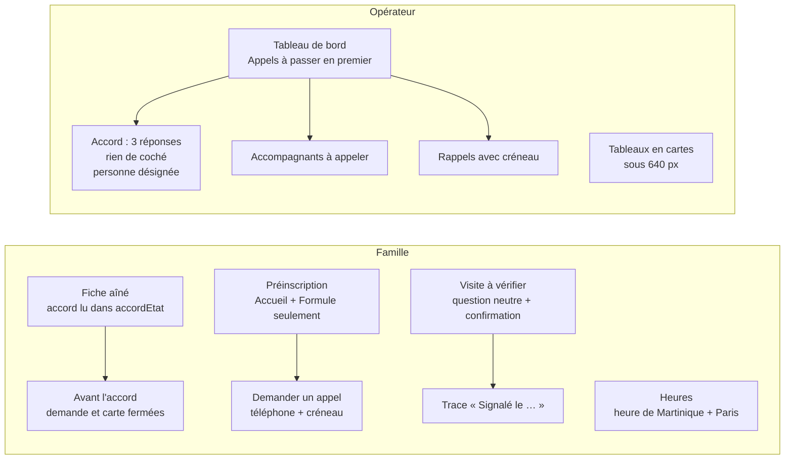

# L1d — F2 (interface web) : notes

> Agent F2 `dev-frontend` (web). Périmètre : D14, D16, D15 côté opérateur ([`L1-arbitrage-revues.md`](../revues/L1-arbitrage-revues.md)).
> Base de test : `koudmen_l1d_f2`. Branche du worktree, 7 commits, rien de poussé.

## 1. Ce qui change

| Décision | Point UX | Correction |
|---|---|---|
| D14 | B1 | Fiche : « Accord d'Odette : en attente de l'appel ». Refus, retrait, accord : texte vrai, jamais de nom vide. |
| D14 | B2 | Formulaire opérateur : aucune réponse cochée. Oui / Non / « Il veut en parler à quelqu'un : rappeler plus tard ». « Qui a répondu » et mesure de protection obligatoires. Écran « Vous enregistrez : Odette dit OUI. » |
| D14, D11 | — | Champ « Personne désignée par l'aîné pour voir le trajet », défaut l'employeur. La famille lit ce choix (lecture seule) ; elle ne le change plus. |
| D16 | M1 | Plus de « simulé », « testeurs », « démonstration », « données d'exemple » en lancement. |
| D16 | M2 | `[À VÉRIFIER]` retirés de l'écran (`/confidentialite`, `/mentions-legales`), gardés en commentaires. `/cgu` et `/conditions-accompagnants` : aucune marque visible. |
| D16 | M3 | Préinscription : barre du bas réduite ; Kayé, Visites, Demandes : « Cette page s'ouvre au lancement ». Libre : « Elle s'ouvre au lancement ». |
| D16 | M4 | « Demander un appel » : numéro obligatoire (prérempli), créneau « 8 h – 11 h en Martinique (14 h – 17 h à Paris) », possible sans formule (« poser une question »). L'accueil dit « Demande d'appel envoyée le … ». |
| D16 | M5 | Avant l'accord : raccourcis fermés avec la raison ; `/famille/demandes/nouvelle` ne montre plus de formulaire refusé d'avance. |
| D16 | M6 | Besoins facultatifs à la modification (lancement). |
| D16 | M7 | « La visite de Josiane a-t-elle eu lieu chez Léonie ? », « 0 preuve sur 3. Il en faut 2. », Confirmer / Annuler, trace « Problème signalé le … ». |
| D16 | M8 | MapLibre en français (`locale`), boutons 44 px, plus d'`aria-hidden` sur des éléments focalisables, marqueurs sans attendre les tuiles, « Carte indisponible » après 8 s. |
| D16 | M9, m7 | `ZonedTime` : « 9 h – 11 h, heure de Martinique (15 h – 17 h à Paris) » selon le fuseau du lecteur. Format unique « 9 h 30 ». |
| D16, D15 | M10 | Tableau de bord : « Appels à passer » en premier (aînés à appeler, familles à rappeler, e-mails à confirmer, accompagnants à appeler). |
| D15 | B3 | Nouvelle page `/operateur/accompagnants/a-appeler`. |
| D16 | M11 | `DataTable` : une carte par ligne sous 640 px. Case 24 px dans une zone de 44 px. Sans téléphone : « Écrire à la personne ». |
| D16 | M13 | Un seul sélecteur Clair / Sombre (pied de page). La barre reste « sticky » : en fin de page, le pied est visible. |
| D16 | M14 | Bandeau accompagnant : « Prochaine étape : 5 questions, puis vérification, ici ou dans l'application Koudmen. » |
| Mineurs | m1, m2, m4, m5, m6, m13, m14, m15, m16 | Indices 15 px, barre 13,5 px ; « ? » zone 44 px ; « Adresse e-mail » ; indice retiré ; élisions ; texte sans jargon ; lien carte domicile ; bouton désactivé + `role="status"` ; pas d'appel « tapez 1 » annoncé. |

## 2. À réconcilier avec F1 (fusion)

Fonctions serveur minimales écrites par F2, marquées `// L1d: à brancher sur F1` :

| Fichier F2 | Rôle | À la fusion |
|---|---|---|
| `plateforme/src/server/operateur/accord-l1d.ts` | `accordL1dSchema`, `recordElderAccordL1d` (délègue à `recordElderAccord`, puis `tripViewerId` ; `RAPPELER` = ligne d'audit `aine.accord_rappel`), `listAinesForAccordL1d` | Remplacer par la fonction de F1 si elle couvre les 3 réponses + la personne désignée. Garder les noms de champs du formulaire : `resultat` (ACCORD, REFUS, RAPPELER, RETRAIT), `qui`, `situationJuridique`, `personneDesignee` (`EMPLOYEUR` ou id du membre). |
| `plateforme/src/server/operateur/accord-l1d-actions.ts` | `recordAccordL1dAction` | Brancher sur l'action F1. |
| `plateforme/src/server/operateur/files-lancement.ts` | `launchQueueCounts`, `listCaregiversToCall` (EN_ATTENTE, ou BROUILLON > 48 h) | Remplacer le filtre par le statut serveur de F1 (demande de vérification dans l'app). |

Autres points :

- `TripViewerForm` (`components/presence/trip-viewer-form.tsx`) n'est plus utilisé (D11 : l'aîné choisit). F1 peut retirer l'action `setTripViewer` côté famille.
- F2 a touché des textes dans `server/operateur/actions.ts`, `server/famille/actions.ts`, `server/famille/schemas.ts` (besoins facultatifs), `server/auth/validation.ts` (messages e-mail), `server/offre/activation.ts` et `server/offre/actions.ts` (rappel). Conflits possibles, tous petits.
- Migration F2 : `20261008150000_l1d_f2_rappel` (`PlanActivationRequest.plan` facultatif, `phone`, `creneau`). Vérifier l'ordre avec les migrations de F1.
- « Présence probable » (statut F1, D4) : pas encore affiché côté famille. [À VÉRIFIER] libellé et badge à ajouter dès que l'énum existe.
- M14 : texte du bandeau web à aligner mot pour mot avec l'écran de l'app (F3).

## 3. Contrôles

| Contrôle | Résultat |
|---|---|
| `pnpm lint` | OK |
| `pnpm typecheck` (`tsc --noEmit`) | OK |
| `pnpm test` | 51 fichiers, 517 tests OK (base : `KOUDMEN_DB_TESTS=1` sur offre, opérateur, famille, auth : OK) |
| Nouveaux tests | `src/lib/rappel.test.ts` (heure de Paris été / hiver, « 9 h 30 ») ; `src/server/operateur/accord-l1d.db.test.ts` |
| e2e (`lancement`, `operateur`, `presence`, `smoke`, `parcours-complet`, `bac-a-sable`, `design-system`, `api-v1*`) | 42 / 42 OK, port 3721, `RATE_LIMIT_DISABLED=true` |

Le test unitaire a trouvé un vrai bogue : `parisOffset` lisait « 14 h » (format français) comme un nombre. Corrigé avec `formatToParts`.

## 4. Captures (390 px, scratchpad, hors dépôt)

`avant-*.png` et `apres-*.png` : accueil et Kayé en préinscription, formule (demande d'appel), fiche sans accord, tableau de bord, accord opérateur, comptes, rappels, visites (À vérifier), confidentialité, accompagnants à appeler.

## 5. Reste (backlog)

- m14 : notice en créole martiniquais, validée par un locuteur [À VÉRIFIER].
- m12 : raison simple « trop loin du domicile » dès le check-in côté famille.
- Audit axe complet des nouveaux écrans (non relancé dans ce lot).
