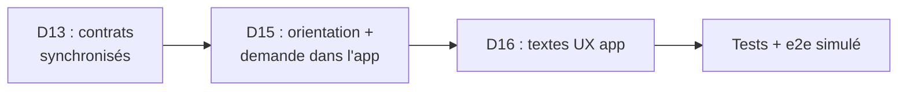
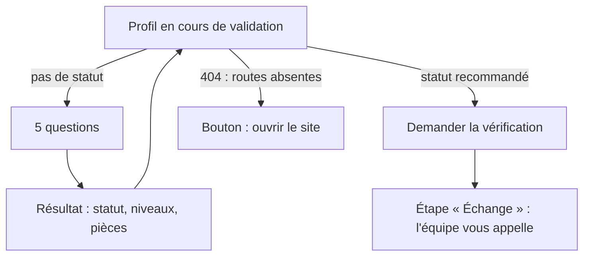

# L1d — F3 : app mobile accompagnant (notes)

> Sprint L1d, agent F3, périmètre `mobile/**`. Référence : `docs/revues/L1-arbitrage-revues.md` (D13, D15 côté app, D16 textes app),
> `docs/revues/L1-code.md` (BLOQUANT B1, m7), `docs/revues/L1-ux.md` (B3, M12, M14, m7 à m11). Rien n'est poussé.

## 1. Ce qui est fait

| Étape | Commit | Contenu |
|---|---|---|
| D13 | `b11208d` | `npm run sync:contracts` : `--check` passe (9 fichiers). `src/contrats-l1/` supprimé. Tous les schémas viennent de `src/contracts/`. `src/api/l1.ts` garde seulement les ajouts de l'app (constantes, `ageEnAnnees`, `lireControle`) |
| D15 | `01f1029` | Écran « Mon statut en 5 questions » (`app/orientation.tsx`). « Profil en cours de validation » : étapes faites / à faire, bouton « Demander la vérification ». Client HTTP + mode simulé |
| D16 | `ab51d7d` | M12, m7, m8, m9, m10, m11, heure de Martinique (voir § 4) |
| Tests | dernier commit | e2e D15, notes |

## 2. D13 — écarts de noms traités

| Avant (`contrats-l1`) | Maintenant (`src/contracts`) |
|---|---|
| `reponseMoiL1Schema` (tolérant) | `reponseMoiSchema` (strict, `demo`, `bacASable`, `emailVerifie`, `profilValide`, `preinscription` obligatoires) |
| `demandeEvenementsL1Schema`, `ResultatEvenementL1` | `demandeEvenementsSchema`, `ResultatEvenement` (`qr`, `controle` inclus) |
| `controle` ou `preuves.qr` | `controle` seulement |
| `demandePositionTrajetSchema` | `demandePositionSchema` |
| `StatutControle` | `StatutPreuveCheckIn` |
| `DUREE_MAX_TRAJET_MIN`, `INTERVALLE_POSITION_TRAJET_S` | `TRAJET_DUREE_MAX_MIN`, `TRAJET_INTERVALLE_POSITION_S` (ré-exportés sous l'ancien nom par `l1.ts`) |
| `DomicileTrajet` | `NonNullable<ReponseTrajet['domicile']>` |

L'app garde une règle plus stricte que le serveur pour le téléphone (10 chiffres, contre 6) : c'est un contrôle d'écran, le contrat reste celui du serveur.

## 3. D15 — orientation et vérification dans l'app

- Questions, réponses, statuts, libellés : **copie** des textes du site (`orientation-wizard.tsx`, `orientation-result.tsx`, `lib/labels.ts`).
  Rien n'est coché au départ.
- « L'équipe vous appelle » apparaît **seulement** après l'envoi de la demande (test unitaire + e2e).
- Préinscription (M14) : un profil à valider suit le même parcours, avec l'encadré « Koudmen ouvre bientôt en Martinique ».
  « Koudmen ouvre bientôt » seul = profil validé en préinscription.

### Contrat utilisé (en attente du contrat F1) [À VÉRIFIER avec F1]

Fichier : `mobile/src/compte/contratAccompagnant.ts`. À supprimer dès que `plateforme/src/contracts/v1/` publie les schémas.

| Route | Corps envoyé | Réponse lue (tolérante) |
|---|---|---|
| `GET /api/v1/accompagnant/verification` | — | `{ validation, orientation?, manque?, raison? }` |
| `POST /api/v1/accompagnant/orientation` | `{ activity, paid, existingStatus, situations, familyLink }` (clés de `orientationSchema` du site) | résultat en français (`issue, statut, explication, avertissements, pieces, niveaux`) **ou** forme du site (`outcome, status, explanation, warnings, requiredVerifications, allowedLevels`), nu ou dans `{ orientation }` / `{ resultat }` |
| `POST /api/v1/accompagnant/verification` | `{}` | état ci-dessus, ou 204 (l'app relit alors le GET) |

Points à trancher avec F1 :
1. Noms des clés (anglais du site ou français des contrats v1).
2. `manque` : si le serveur exige encore communes, disponibilités, tarif et déclarations, l'app affiche la liste et renvoie au site (`/accompagnant/profil`). Pour éviter une impasse, D15 suppose que l'équipe complète ces points pendant l'appel.
3. Erreurs attendues : `409 CONFLIT` (demande déjà envoyée), `422 ACTION_IMPOSSIBLE` (orientation non recommandée, profil validé).
4. Serveur sans ces routes (404) : l'app propose le site, sans impasse.

## 4. D16 — textes UX de l'app

| Point | Correction |
|---|---|
| M12 | Pendant un trajet de cette visite : « Une seule lecture, maintenant. La lecture d'arrivée remplace le partage du trajet, qui s'arrête. » Hors trajet : texte actuel |
| m9 | « Vous êtes presque chez Léonie. Le partage s'arrête tout seul. » |
| m8 | `aria-label` « Scanner le QR de la carte domicile » |
| m10 | Avec `controle`, un seul encadré (le détail par preuve est caché) |
| m7 + D16 heures | Un seul format « 9 h 30 » (pastille « à 9 h 30 »). Heures et jours **à l'heure de Martinique** (UTC−4 fixe, sans `Intl`). Fiche : « 10 h – 12 h, heure de Martinique » + « (… chez vous) » si le téléphone est sur un autre fuseau |
| m11 | Étapes : `role="list"` / `listitem`. Date de naissance : `autocomplete="bday"` sur le web. Zone défilante focusable au clavier (web) |
| Restes de test | « pas encore disponible dans cette version de l'app » → « pas disponible sur cet appareil » |

## 5. Tests

| Suite | Résultat |
|---|---|
| `npx tsc --noEmit` | OK |
| `node scripts/sync-contracts.mjs --check` | OK (9 fichiers) |
| `npm run test:l1` (+ `orientation.spec.ts`, heures, message d'arrivée) | 22 / 22 (aussi avec `TZ=Europe/Paris`) |
| `npm run test:hors-ligne` | 39 / 39 |
| `npm run test:push` | 9 / 9 |
| `npm run test:natif` | 6 / 6 |
| `npm run e2e:simule` (nouvel export, dont D15) | 32 / 32 |
| `npm run e2e:natif` | 8 / 8 |
| `npm run e2e:hors-ligne` (nouvel export) | 3 / 3 |
| e2e serveur réel | Non lancé (routes F1 pas encore dans cette branche) |

Exports faits avec `EXPO_OFFLINE=1`, Chromium de `/opt/pw-browsers`.

## 6. Points ouverts

1. Brancher l'app sur le contrat F1 (§ 3), puis supprimer `contratAccompagnant.ts`.
2. Texte commun site / app pour M14 : à aligner avec F2 (texte app : « Koudmen ouvre bientôt en Martinique. Préparez votre profil maintenant : vos premières visites arrivent après l'ouverture. »).
3. `orienterLocalement` (mode simulé) est une copie de la règle serveur : à garder alignée, ou à remplacer par le contrat quand F1 l'exporte.
