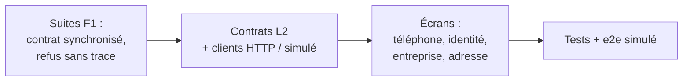
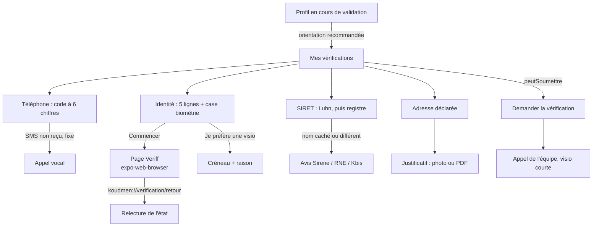

# L2 — I-app : vérification de l'accompagnant dans l'app (notes)

> Agent I-app, périmètre `mobile/**`. Références : [`L2-verification-identite.md`](L2-verification-identite.md) (§ 6, § 8.3, § 8.5),
> [ADR 0009](adr/0009-verification-identite.md), [`L1d-F1-notes.md`](L1d-F1-notes.md) § 4, [`api-v1.md`](api-v1.md) § 14.
> Contrats : commit serveur `cea1554` (agent I-serveur). Rien n'est poussé.

## 1. Ce qui est fait

| Étape | Commit | Contenu |
|---|---|---|
| 1. Suites de F1 | `deb829d` | `src/compte/contratAccompagnant.ts` supprimé ; `src/contracts/accompagnant.ts` seul (réponses en français). Écran « Profil en cours de validation » : toutes les `etapes` du serveur, bouton selon `peutDemander`. File hors ligne : `PREINSCRIPTION`, `ACCORD_MANQUANT` |
| 2-3. Contrats et clients | `c55b30e` | Copie des contrats serveur L2 ; 10 méthodes dans `KoudmenApi` (HTTP + simulé) ; module pur `src/compte/verifications.ts` |
| 4. Écrans | `84cc0dc` | `app/dossier/{telephone,identite,identite-simulee,entreprise,adresse}.tsx`, `app/verification/retour.tsx`, carte « Mes vérifications » |
| 5. Tests | `bcab6f3` | `e2e/simule/l2.spec.ts` (3 parcours), tests unitaires, permissions photo |

## 2. Parcours dans l'app

| Écran | Points clés |
|---|---|
| Mes vérifications | Une ligne-bouton par élément (≥ 64 px), état en mot + couleur, message neutre du serveur. B3 et références : « pendant la visio ». Bouton principal « Continuer : … » vers le prochain élément obligatoire (`actionSuivante`) |
| Téléphone | `textContentType="oneTimeCode"`, `autoComplete="sms-otp"` (web : `one-time-code`), `inputMode="numeric"`. Code collé avec du texte nettoyé (« Votre code : 123 456 »). Renvoi après `renvoiPossibleA` (compte à rebours annoncé). « Recevoir un appel » si fixe ou `appelPossible` |
| Identité | 5 lignes du § 7.3. Case de consentement biométrique (sinon visio). `WebBrowser.openAuthSessionAsync(url, retour)`, puis GET /verifications. Aucune photo dans l'app. Essais restants (`sessionsIdentiteRestantes`) ; à 0 : visio proposée |
| Entreprise | SIRET : 14 chiffres, clé de Luhn, SIREN reconnu. Document seulement si `documentRequis` / `TELEVERSER_DOCUMENT_ENTREPRISE` ; l'avis Sirene et le RNE sont présentés comme gratuits |
| Adresse | Adresse déclarée, puis justificatif. `expo-image-picker` (photo JPEG qualité 0,7, EXIF non demandé) ou `expo-document-picker` (PDF, JPEG, PNG). Aperçu nom + taille, puis « Envoyer ». État « En revue par l'équipe » |
| Partout | Encadré « Pourquoi Koudmen le demande », « Koudmen garde », « Koudmen ne garde pas ». Jamais « échec » : un refus du prestataire s'affiche « Relu par l'équipe » |

## 3. Suites de F1

| Point F1 § 4 | Fait |
|---|---|
| Importer `contracts/accompagnant.ts` | Oui. Plus de lecture tolérante (formes anglaises, enveloppes) : hors contrat = `REPONSE_INVALIDE` |
| `etapes`, `peutDemander` | L'écran montre **toutes** les étapes du serveur, dans son ordre, avec ses libellés. Une seule étape « en cours ». Le bouton suit `peutDemander` (D15) ou `peutSoumettre` (L2) |
| `PREINSCRIPTION`, `ACCORD_MANQUANT` | `REFUS_SANS_TRACE` (`src/offline/file.ts`) : la ligne sort du stockage, aucun contenu gardé, message affiché une fois (mémoire), fiche et liste des visites gardées effacées (`cache.oublierVisite`). Formulaire Kayé vidé |

## 4. Écarts et points à trancher

1. **Contrats copiés depuis la branche serveur.** `src/contracts/*` = copie exacte du commit `cea1554` (vérifiée fichier par fichier). Dans ce worktree, `plateforme/` n'a pas encore ce commit : `npm run sync:contracts -- --check` échoue tant que les branches ne sont pas réunies. Après la fusion : relancer `--check` (doit passer sans changement).
2. **Envoi de la demande [À VÉRIFIER avec I-serveur].** Avec un dossier L2 (GET /verifications répond et a des éléments), l'app envoie `POST /verifications/soumettre` et suit `peutSoumettre`. Sans les routes L2 (404) : `POST /accompagnant/verification` et `peutDemander` (D15). À confirmer : les deux routes mènent au même état `EN_ATTENTE`.
3. **Retour du parcours d'identité dans Expo Go [À VÉRIFIER sur appareil].** Le serveur fixe `retour = koudmen://verification/retour`. iOS ferme la session sur ce schéma ; Android dans Expo Go ne connaît pas `koudmen://` : la personne ferme l'onglet, l'app relit l'état quand même (aucune donnée dans le lien). Un build de développement règle ce point.
4. **Mode simulé de l'app** : la page du prestataire est remplacée par l'écran `/dossier/identite-simulee` (4 cas, comme `/verification/simulee` du site). Avec un serveur `ADAPTER_IDENTITY=simule`, l'app ouvre la vraie page simulée du site.
5. **HEIC** : le serveur refuse HEIC. La photo de l'app est compressée (JPEG) ; un fichier HEIC choisi par « Choisir un fichier » est refusé avec un message clair.
6. **Taille** : 5 Mo (contrat), alors que l'étude dit 10 Mo. [À VÉRIFIER] limite de corps de l'hébergeur (Vercel 4,5 Mo).
7. `motifRecours` existe dans le client mais n'a pas d'écran (refus avec recours) : à faire avec l'écran « Refus / recours ».
8. Lecture automatique du SMS sur Android (SMS Retriever) : non faite, elle demande un module natif. `autoComplete="sms-otp"` couvre le clavier Google.

## 5. Tests

| Suite | Résultat |
|---|---|
| `npx tsc --noEmit` | OK |
| `npm run test:l1` (+ `verifications.spec.ts`, orientation réécrite) | 30 / 30 |
| `npm run test:hors-ligne` (+ refus sans trace × 2) | 41 / 41 |
| `npm run test:push` | 9 / 9 |
| `npm run test:natif` | 6 / 6 |
| `npm run e2e:simule` (nouvel export, dont 3 parcours L2) | 35 / 35 |
| `npm run e2e:natif` | 8 / 8 |
| `npm run e2e:hors-ligne` (nouvel export) | 3 / 3 |
| `npx expo lint` | Non lancé : pas de configuration ESLint dans `mobile/` |
| e2e serveur réel | Non lancé (routes L2 du serveur pas encore livrées) |

Exports faits avec `EXPO_OFFLINE=1`, Chromium de `/opt/pw-browsers`. Modules installés par `EXPO_OFFLINE=1 npx expo install` (l'API Expo n'est pas joignable : versions prises dans `bundledNativeModules.json`) : `expo-web-browser ~57.0.3`, `expo-document-picker ~57.0.3`, `expo-image-picker ~57.0.20`. Les trois sont dans Expo Go.
