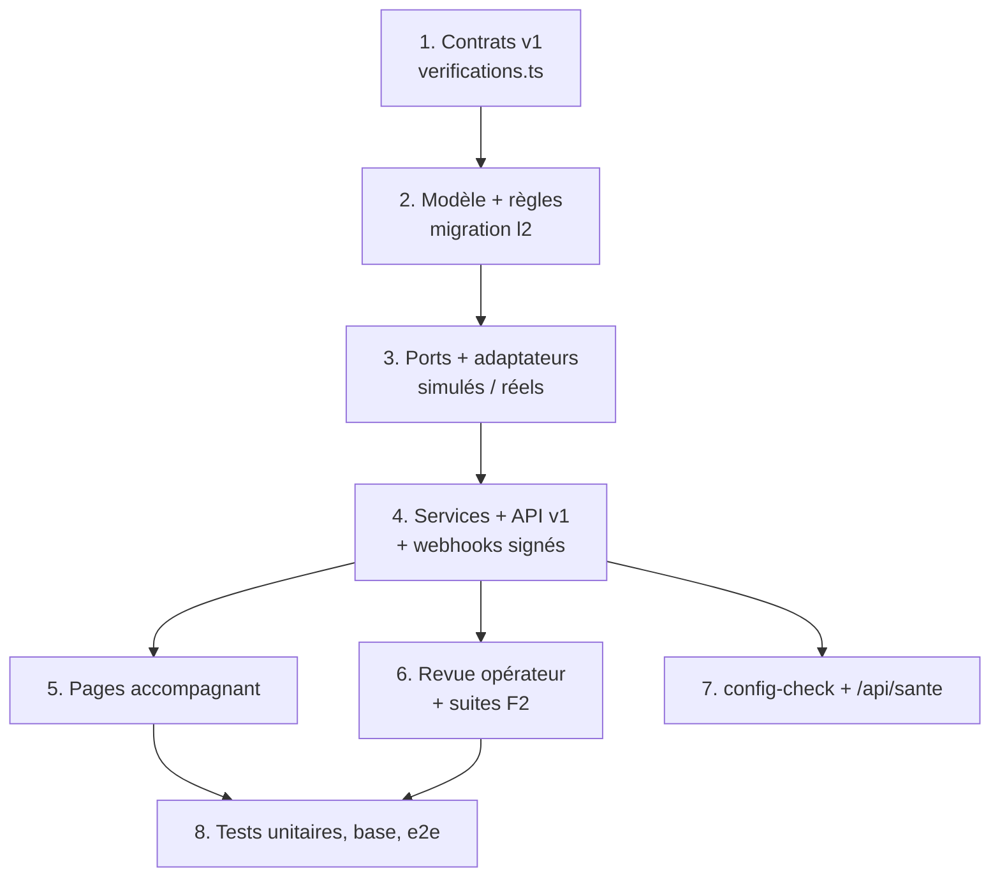

# L2 — I (serveur, site, opérateur) : vérification de l'accompagnant — notes

> Agent I-serveur. Décision : [ADR 0009](adr/0009-verification-identite.md). Étude : [`L2-verification-identite.md`](L2-verification-identite.md).
> Base de test : `koudmen_l2`. Branche du worktree, rien de poussé. L'app (agent A) suit les contrats publiés au commit `cea1554`.

## 1. Ce qui est fait

| # | Demande | Où | Résultat |
|---|---|---|---|
| 1 | `SmsOtpPort` | `ports/verification.ts`, `adapters/otp`, `verifications/service.ts` (`sendPhoneCode`, `confirmPhoneCode`), `verifications/phone.ts` | Code de 6 chiffres tiré par Koudmen, empreinte HMAC, 10 min, 5 essais ; 60 s entre deux envois, 3/h et 5/jour par numéro, 10/jour par IP et par compte ; plafond `SMS_DAILY_BUDGET_CENTS` (503 + alerte dans la file opérateur) ; préfixes Antilles, Guyane, Réunion, Mayotte, Hexagone ; ligne fixe = appel vocal seulement ; appel après 2 SMS ; un numéro = un compte (`phoneHash` unique). Brevo SMS et Twilio voix prêts, activés par variables |
| 2 | `IdentityVerificationPort` | `adapters/identity/{simule,veriff,stripe}.ts`, `api/webhooks/identite/[fournisseur]` | Session hébergée ; consentement biométrique explicite (journalisé) ; webhook signé (HMAC Veriff, `Stripe-Signature`, HMAC simulé + horodatage) ; idempotence `WebhookEvent` ; résultat seulement (4 derniers caractères + empreinte du numéro) ; refus du prestataire → `A_REVOIR` ; 3 sessions puis visio ; suppression chez le prestataire à J+30 (purge nocturne) |
| 3 | `CompanyRegistryPort` | `adapters/registry`, `checkCompany` | Recherche d'entreprises (sans clé) ; INSEE (`INSEE_API_KEY`) avec repli ; actif, nom (comparé au nom vérifié, sinon au nom déclaré), APE en alerte, siège = adresse → adresse vérifiée ; document seulement si doute (`COMPANY_DOC_REQUIRED=toujours` possible) ; un SIRET = un compte |
| 4 | `DocumentStoragePort` | `adapters/documents`, `verifications/{crypto,files}.ts` | PDF/JPEG/PNG, 5 Mo, type réel (octets magiques), EXIF/textes PNG retirés ; AES-256-GCM par enveloppe (clé par fichier, `DOCUMENT_ENC_KEY`) ; adaptateur `base-chiffree` ; effacement 30 j après la décision (purge nocturne) ; accès opérateur avec motif → `DocumentAccessLog` + audit |
| 5 | Revue opérateur | `/operateur/verifications`, `/operateur/verifications/[itemId]`, `verifications/review.ts` | File triée par ancienneté ; fiche avec résultats, motif d'accès, aperçu filigrané, liste de cases de l'étude § 4.4 ; complément (motif fermé, dossier → `A_COMPLETER`) ; refus proposé puis confirmé par un **autre** opérateur ; recours traité par un opérateur autre que ceux du refus |
| 6 | États du dossier | `verifications/rules.ts`, `operateur/actions.ts`, `accompagnant/verification-app.ts` | `A_COMPLETER` ↔ `EN_ATTENTE`, `VALIDE` ↔ `EXPIRE` (B3 : 1 an). Validation bloquée tant qu'un élément obligatoire du statut n'est pas `VALIDE` (`blockersFor`). `GET /accompagnant/verification` : étapes `TELEPHONE`, `IDENTITE`, `ENTREPRISE`, `ADRESSE`, `manque`, `peutDemander` |
| 7 | API v1 + contrats | `contracts/v1/verifications.ts`, `api/v1/accompagnant/{verifications,documents}/**`, [`api-v1.md` § 14](api-v1.md) | 10 routes, `.strict()`, 10 codes d'erreur. Pages web : `/accompagnant/verifications` (Mon dossier), `/telephone`, `/identite`, `/entreprise`, `/adresse`, `/verification/simulee` (essai) |
| 8 | Suites F2 | `operateur/accompagnants/a-appeler`, `operateur/aines/trip-viewer-choice-form.tsx` | `raison` affichée (`CALL_REASON_LABELS`), en-tête corrigé ; écran « Changer la personne désignée (nouvel appel) » |
| 9 | config-check | `verifications/config.ts`, `config-check.ts`, `/api/sante` | Avertissements (service réel sans clé, service simulé fermé en lancement). Bloquant seulement avec les données réelles ouvertes et une `DOCUMENT_ENC_KEY` fausse. `/api/sante` → bloc `verifications` |
| 10 | Docs | [`deploiement-vercel.md` § 4 quater](../deploiement-vercel.md), [`integrations/verification.md`](integrations/verification.md), `.env.example` | Variables et ordre de passage au réel |

## 2. Règle « simulé par défaut »

| Mode | Service simulé | Conséquence |
|---|---|---|
| Essai (dev, e2e) | Ouvert | Code `000000`, page d'identité simulée, SIRET de test, documents avec la clé de développement |
| Lancement | **Fermé** (jamais de `VALIDE` par un simulé) | 503 `SERVICE_INDISPONIBLE` ; repli humain : l'opérateur valide le téléphone après un appel, l'identité et l'adresse en visio (listes de cases `MANUAL_CHECKLIST`) |

## 3. Réponses à l'orchestrateur (fusion avec l'app)

1. **Deux routes de demande** : `POST /accompagnant/verification` et `POST /verifications/soumettre` appellent le même `submitForReview`. Même `EN_ATTENTE` ; mise à jour conditionnelle (`BROUILLON`/`REFUSE` seulement) : pas de doublon, second envoi = 409. `peutDemander` et `peutSoumettre` viennent du même calcul (`submissionProblems`). L'ancienne route ne « délègue » pas par HTTP : les deux sont des façades du même service.
2. **HEIC/HEIF** : refusé (415), 5 Mo gardés. Raisons : l'opérateur relit dans un navigateur (Chrome n'affiche pas le HEIC) et le serveur n'a pas d'outil de conversion (pas de `sharp`/`libheif`) ; Vercel limite le corps à 4,5 Mo [À VÉRIFIER], 10 Mo ne passerait pas. L'app convertit en JPEG (déjà fait côté A).
3. **Recours** : `POST /api/v1/accompagnant/verifications/recours` existe (`{ motifRecours }` → 201). Le site a le formulaire sur « Mes vérifications ».

## 4. Écarts avec l'étude (tous notés dans `api-v1.md` § 14.2)

- Format d'erreur `{ erreur: … }` ; `ELEMENTS_MANQUANTS` (liste dans le message) ; `CODE_EXPIRE`.
- Visio : pas d'agenda ; `{ creneau, raison }` → l'équipe rappelle. Consentement biométrique dans le corps de la session.
- Route en plus : `POST /verifications/adresse`.
- Plafond SMS : refus + alerte (pas de file d'envoi différé).
- Opérateur : Server Actions + `GET /operateur/documents/{id}/apercu` (pas de `/api/v1/operateur`).
- `PhoneChallenge` dédié (pas `AuthToken`, qui n'existe pas ; `AccountToken` sert aux e-mails).
- Webhooks traités dans la requête (pas de worker). Veriff : pas d'horodatage d'envoi, rejeu bloqué par l'idempotence.
- Taille 5 Mo (étude : 10 Mo), sans HEIC.
- Refus du **profil** aussi à deux opérateurs (étude § 6.5), avec un motif fermé (`motifCode`) en plus du texte envoyé.

## 5. Tests

| Suite | Résultat |
|---|---|
| `pnpm lint`, `tsc --noEmit` | 0 erreur |
| Unitaires + base (`KOUDMEN_DB_TESTS=1`, base `koudmen_l2`) | 75 fichiers, **715 tests** verts (646 au départ) |
| Contrats des adaptateurs réels (réponses enregistrées, sans réseau) | 18 tests : Brevo, Twilio, Veriff, Stripe, Recherche d'entreprises, INSEE, simulés |
| E2E (`pnpm build:local`, `E2E_PORT=3961`, `RATE_LIMIT_DISABLED=true`, Chromium `/opt/pw-browsers`) | **45 / 45** (`chromium` + `lancement`) dont `verification-l2.spec.ts` (parcours complet) et le test L2 du lancement |

## 6. Points ouverts

- [À VÉRIFIER] Noms d'en-têtes et schémas exacts : Veriff (`X-HMAC-SIGNATURE`, `reasonCode`, suppression), INSEE (`X-INSEE-Api-Key-Integration`), Brevo SMS (numéro sans « + »). Rejouer les tests contractuels contre les bacs à sable dès l'ouverture des comptes.
- [À VÉRIFIER] 2FA (TOTP) opérateur : prévue par l'étude, absente du code. Le filigrane est un calque de la page (pas incrusté dans le fichier) ; le PDF s'ouvre dans un onglet (la visionneuse permet un téléchargement).
- [À VÉRIFIER] Antivirus des fichiers (ClamAV) et nettoyage des métadonnées PDF : non faits.
- [À VÉRIFIER] Clés HMAC dérivées de `SESSION_SECRET` : changer ce secret casse la recherche des numéros déjà vérifiés. Créer `VERIFICATION_HMAC_KEY` avant les données réelles.
- `User.phone` reste en clair (existant) ; l'étude prévoit `phoneEnc`.
- Nom de l'entreprise comparé au nom **déclaré** si l'identité n'est pas encore vérifiée (noté dans la fiche) ; pas de nouveau contrôle automatique après la vérification d'identité.
- Relances (J+3, J+10), clôture à 90 jours, contrôle mensuel du SIRET, lecture 2D-Doc (V1.2) : non faits.
- Un changement de nom ne relance pas encore l'élément Identité.
- AIPD, registre, DPA Veriff (lot I9) avant toute donnée réelle.
