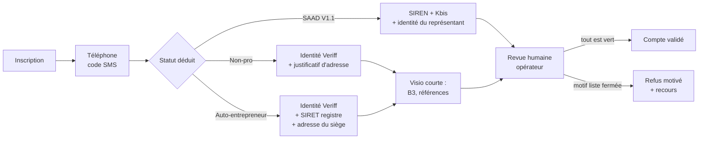
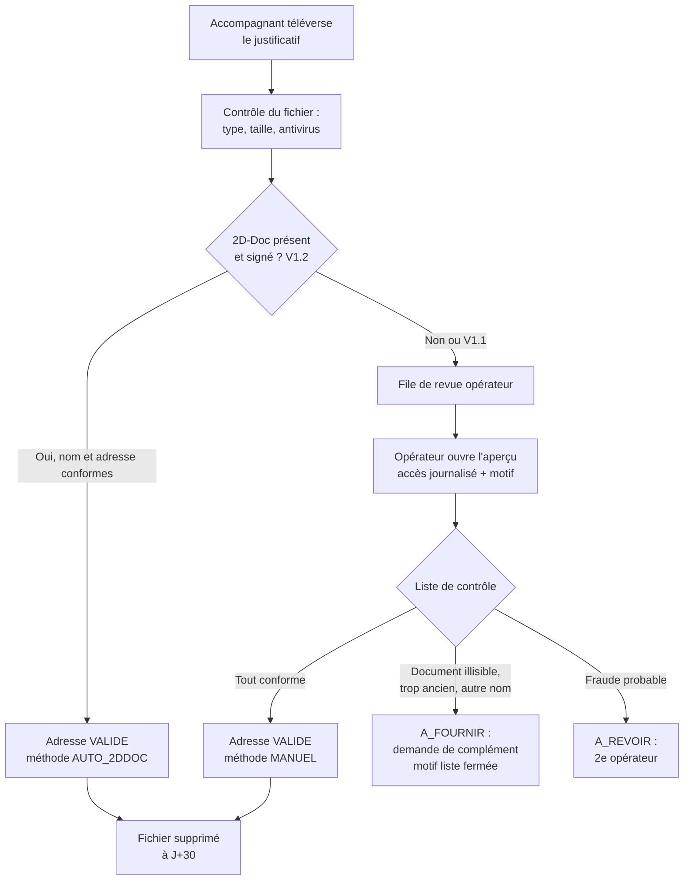
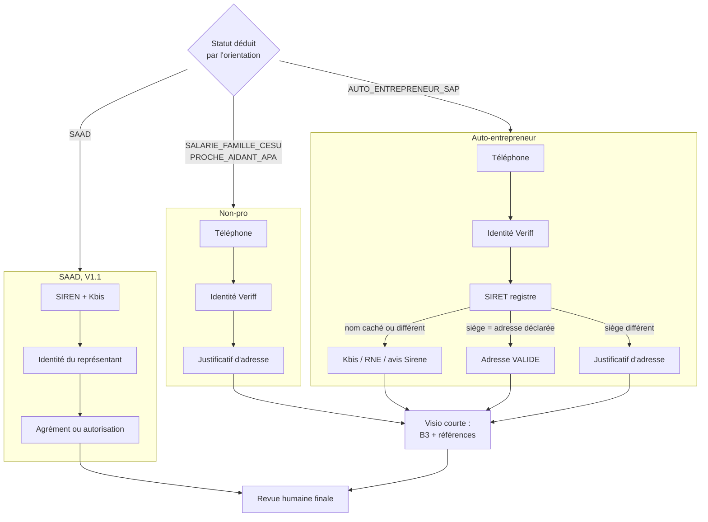
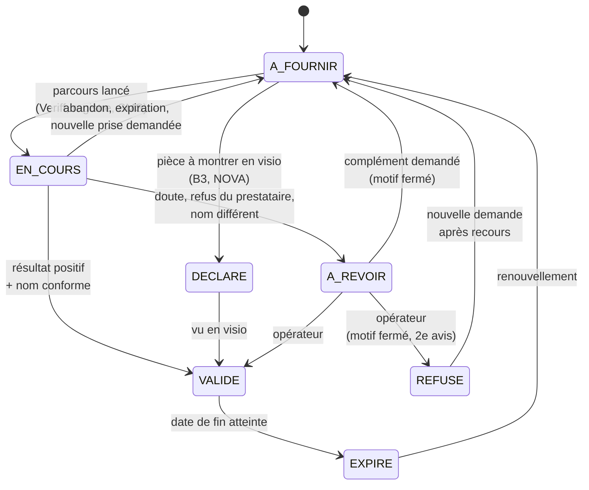
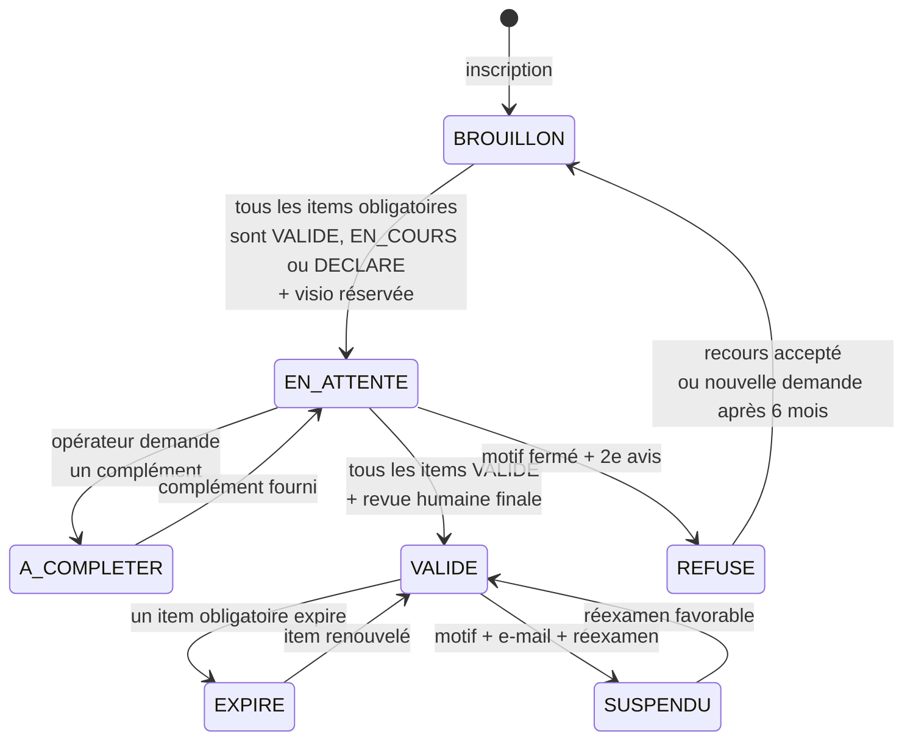
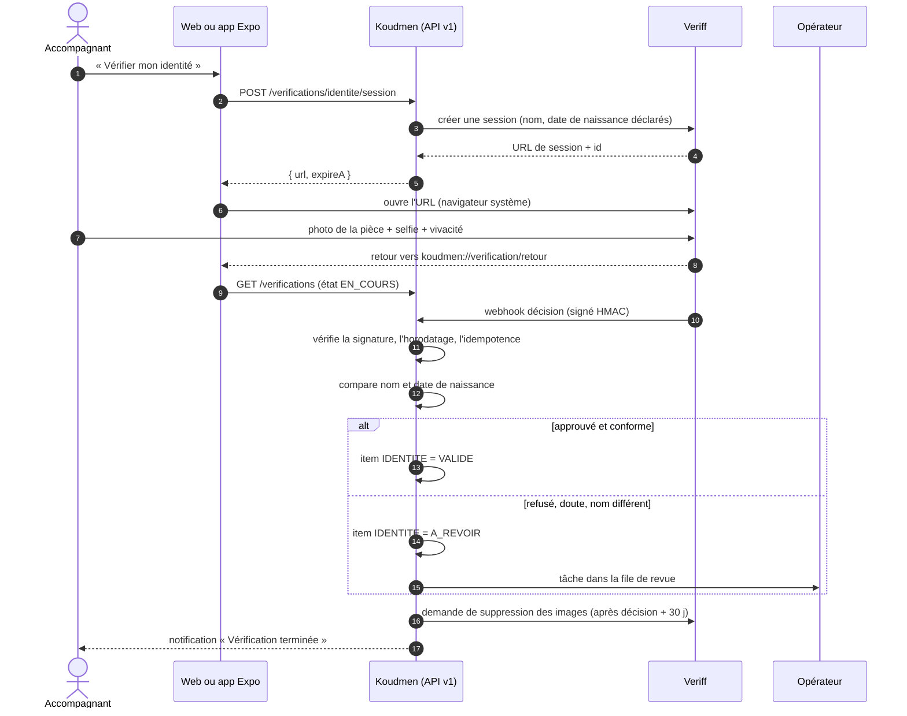
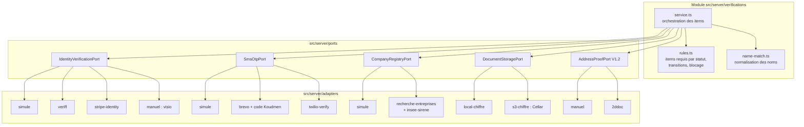
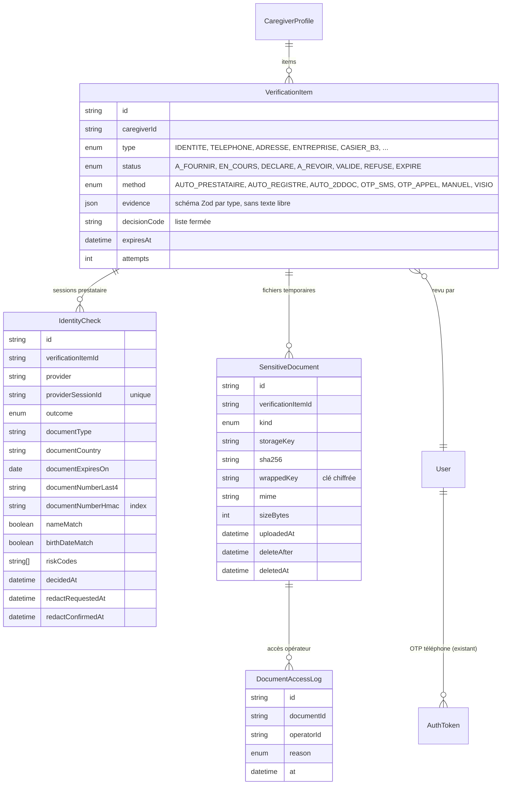
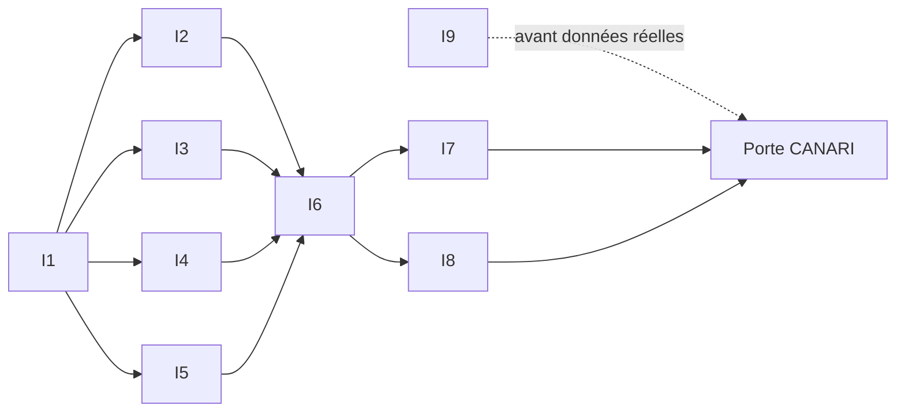

# L2 — Vérification de l'accompagnant avant validation du compte

- **Statut :** étude et conception (2026-10-08). Pas de code dans ce lot.
- **Auteur :** architecte principal.
- **Décision liée :** ADR 0009 (`docs/tech/adr/0009-verification-identite.md`).
- **Sources :** `docs/08-particuliers-multi-statuts.md` § 3.4 et § 4 ; `docs/tech/specification-v1-conso.md` § 6, § 15, § 17, § 18 ; `docs/revues/L1-arbitrage-lancement.md` (L2, R6) ; `docs/revues/L1-juridique.md` (J1, J6, J29) ; ADR 0004, 0005, 0007, 0008 ; `plateforme/prisma/schema.prisma` (`VerificationItem`, `CaregiverProfile`) ; `plateforme/src/server/accompagnant/service.ts`.
- **Convention :** `[À VÉRIFIER]` marque une information non confirmée (prix, conditions d'accès, détail d'API). Les prix sont **indicatifs**, relevés en octobre 2026.

---

## 0. Résumé pour le fondateur

1. **Identité : Veriff**, en parcours web hébergé. Société de l'UE, inscription en ligne sans négociation, environ 0,75 à 1,30 € par contrôle, minimum environ 45 €/mois. Le parcours web marche dans Expo Go.
2. **Repli technique : Stripe Identity.** Pas de minimum, environ 1,25 à 1,50 € par contrôle. Le compte Stripe existe déjà pour les abonnements (ADR 0004). On l'active par une variable, sans nouveau code métier.
3. **Repli humain : la visio opérateur** (méthode actuelle de la V1). Pour une personne sans smartphone, avec une pièce rare, ou après un échec du prestataire.
4. **Évolution possible : IDnow (certifié PVID ANSSI).** Seulement si un texte, un financeur ou l'avocat l'exige. Aucune loi ne nous impose PVID aujourd'hui [À VÉRIFIER avec l'avocat, porte G4].
5. **SIREN / SIRET : automatique et gratuit** (API Recherche d'entreprises + API Sirene INSEE). Le Kbis téléversé devient un **document de secours** : on le demande seulement si le registre ne suffit pas.
6. **Justificatif d'adresse : pas de service public automatique** pour une entreprise privée. On fait une **revue manuelle** par l'opérateur en V1.1, puis une **lecture automatique du 2D-Doc** (code signé sur les avis d'impôt et certaines factures) en V1.2.
7. **Téléphone : code par SMS via Brevo**, code généré par Koudmen. Repli : **appel vocal** (Twilio, déjà prévu ADR 0005) pour une ligne fixe ou un SMS non reçu.
8. **Coût estimé :** environ **50 €/mois** pour 100 accompagnants, environ **250 à 400 €/mois** pour 1 000 accompagnants (§ 9).
9. **Écart avec la demande :** l'auto-entrepreneur fait **aussi** le contrôle d'identité et le B3. Raison : il entre chez un aîné, comme les autres (`docs/08` § 4.2). Le Kbis seul ne prouve pas qui vient à la porte.



---

## 1. Ce qui change par rapport à la V1

| Point | V1 actuelle (`specification-v1-conso.md` § 6) | L2 (cette étude) |
|---|---|---|
| Identité | Visio de 20 min, l'opérateur compare le visage | **Prestataire automatique** (document + selfie + vivacité). La visio devient le repli |
| Téléphone | OTP SMS prévu (§ 4) | Inchangé, détaillé ici : anti-fraude, préfixes, appel vocal |
| Adresse | Non vérifiée | **Justificatif** : revue manuelle, puis 2D-Doc |
| SIRET | API Sirene, automatique | Inchangé + contrôle du nom, du code APE, de l'adresse du siège |
| Kbis | Non demandé | Demandé **seulement si doute** (configurable) |
| B3 | Montré en visio, jamais stocké | **Inchangé** (art. 10 RGPD). La visio dure moins longtemps |
| Fichiers stockés | Aucun | Kbis, extrait RNE, justificatif d'adresse : **chiffrés, 30 jours max après la décision** |

> **ATTENTION** — La règle « jamais de copie de la pièce d'identité ni du B3 » reste vraie. Le prestataire garde les images. Koudmen garde **le résultat**.

---

## 2. Identité : comparatif des prestataires

### 2.1 Ce que veut dire « service légal »

- **PVID** (Prestataire de Vérification d'Identité à Distance) est un **référentiel de l'ANSSI** (2021). Il rend une vérification à distance équivalente à un face-à-face. Il exige une vidéo, de l'automatique et une revue humaine.
- PVID est **obligatoire** dans certains cas : entrée en relation bancaire à distance (LCB-FT), signature électronique qualifiée. Il n'est **pas obligatoire** pour une plateforme comme Koudmen [À VÉRIFIER avec l'avocat].
- Pour Koudmen, un service est « légal » s'il respecte le RGPD (contrat de sous-traitance, art. 28), traite la biométrie avec une base valable (art. 9) et héberge les données dans l'UE ou avec des garanties de transfert.
- **Conclusion :** on choisit un prestataire **conforme au RGPD et hébergé dans l'UE**. On garde PVID comme **option** si une exigence apparaît.

### 2.2 Tableau comparatif

| Critère | **Veriff** | **Stripe Identity** | **IDnow** (dont IDCheck.io) | **Ubble** (Checkout.com) | **Onfido** (Entrust) | **Docaposte** (AR24 / Identité Numérique La Poste) | **Mitek** | **France Identité / FranceConnect+** |
|---|---|---|---|---|---|---|---|---|
| Société | Estonie (UE) | États-Unis (contrat UE : Irlande) | Allemagne ; IDCheck.io à Rennes | Royaume-Uni (Ubble : Paris) | Royaume-Uni / États-Unis | France (groupe La Poste) | États-Unis | État français |
| Certification PVID ANSSI | Non [À VÉRIFIER] | Non | **Oui** (août 2023, niveau substantiel) | **Oui** (mai 2023, offre « VideoCertified ») | Non [À VÉRIFIER] | **Oui** (AR24, niveau substantiel) | Non | Sans objet (identité d'État, niveau élevé) |
| RGPD et hébergement | UE [À VÉRIFIER région exacte et sous-traitants cloud] | DPA + DPF ; données traitées aux États-Unis possibles ; biométrie gardée **1 an** par Stripe | UE (France / Allemagne) [À VÉRIFIER] | UE (France) [À VÉRIFIER] | UE possible [À VÉRIFIER] | France | États-Unis / UE [À VÉRIFIER] | France |
| Web (navigateur) | **Oui** : lien hébergé + SDK web (InContext) | **Oui** : lien hébergé ou fenêtre modale | Oui (parcours web) | Oui (iframe ou redirection) | Oui (SDK web) | Oui | SDK surtout mobile | Oui (bouton OpenID Connect) |
| Expo | SDK React Native = **build de développement** (pas Expo Go) | SDK React Native = build de développement [À VÉRIFIER] | SDK natif = build de développement | Pas de SDK RN connu ; web | SDK RN = build de développement | Web | SDK natif | Web (redirection) |
| Expo Go | **Oui, par le lien web** (`expo-web-browser`) | **Oui, par le lien web** | Oui, par le lien web | Oui, par le lien web | Oui, par le lien web | Oui, par le lien web | Non | Oui, par le lien web |
| Prix indicatif | 0,80 $ (Essential), 1,39 $ (Plus) ; minimum **49 $/mois** ou 99 $/mois | **1,25 à 1,50 €** par contrôle réussi ; 50 premiers gratuits ; **pas de minimum** | Sur devis ; **2 à 4 €** selon les concurrents [À VÉRIFIER] | Sur devis ; volume **≥ 2 000/mois** cité [À VÉRIFIER] | Sur devis ; **2 à 3 $** estimé [À VÉRIFIER] | Sur devis [À VÉRIFIER] | Sur devis | Gratuit pour le service ; accès **réservé** |
| Délai de mise en place | **1 à 3 jours** (inscription en ligne, essai 15 jours) | **1 jour** (compte Stripe existant) | 4 à 10 semaines (démo, contrat, intégration) [À VÉRIFIER] | 4 à 10 semaines [À VÉRIFIER] | 4 à 8 semaines [À VÉRIFIER] | 6 à 12 semaines [À VÉRIFIER] | Long | Habilitation DataPass + qualification ; **éligibilité douteuse** |
| Contrat | Conditions en ligne + DPA | Conditions Stripe + DPA (déjà signés pour ADR 0004) | Contrat entreprise | Contrat entreprise | Contrat entreprise | Contrat entreprise | Contrat entreprise | Convention avec la DINUM |
| Verdict | **Principal** | **Repli technique** | **Option PVID** si exigée | Écarté (volume minimum) | Écarté (devis, pas d'avantage) | Écarté pour l'instant (lourd) | Écarté | **Plus tard** (voir § 2.4) |

Sources : pages tarifs Veriff et Stripe, communiqués PVID d'IDnow (2023), de Checkout.com (2023) et de Docaposte, documentation Dotfile (offres Ubble), FAQ Stripe Identity (conservation de la biométrie). Les chiffres de concurrents (Didit, comparateurs) sont **peu fiables**.

### 2.3 Pourquoi Veriff en principal

1. **Société de l'UE.** Cela suit la ligne de l'ADR 0007 (souveraineté, pas de CLOUD Act direct). Stripe est une société américaine.
2. **Inscription en ligne.** Le fondateur peut ouvrir le compte seul, sans cycle de vente. IDnow, Ubble et Onfido exigent un contrat négocié.
3. **Coût bas à petit volume.** Le minimum mensuel (environ 45 €) reste acceptable.
4. **Parcours web hébergé.** Il marche sur le web Next.js et dans Expo Go (`expo-web-browser`). Le SDK natif reste possible plus tard, avec un build EAS.
5. **Décisions riches.** Veriff renvoie `approved`, `declined`, `resubmission_requested`, `review`, `expired`, `abandoned` [À VÉRIFIER libellés exacts]. On peut les traduire dans nos états sans perte.

**Points à vérifier avant signature :**
- l'offre **Essential** comprend-elle le selfie avec **vivacité** (liveness) ? Sinon, prendre **Plus** [À VÉRIFIER] ;
- la **région d'hébergement** et la liste des sous-traitants (cloud) [À VÉRIFIER] ;
- la **durée de conservation** réglable des images et l'API de suppression [À VÉRIFIER] ;
- la reconnaissance des **titres de séjour** et des pièces des pays voisins (Haïti, Sainte-Lucie, Dominique) [À VÉRIFIER].

### 2.4 France Identité et FranceConnect+

- FranceConnect+ accepte deux fournisseurs : **France Identité** et **L'Identité Numérique La Poste**. Niveau de garantie élevé, donnée d'État.
- **Frein 1 :** depuis 2018, l'accès privé est réservé aux acteurs avec une **obligation légale** de vérifier l'identité. Koudmen n'en a pas, a priori [À VÉRIFIER auprès de la DINUM].
- **Frein 2 :** l'usager doit avoir la nouvelle carte d'identité et faire **certifier son identité en mairie**. Peu d'accompagnants l'ont fait aujourd'hui [À VÉRIFIER pour la Martinique].
- **Piste V1.2 :** l'application France Identité peut produire un **justificatif d'identité** signé, à usage unique [À VÉRIFIER format et méthode de contrôle]. Si un contrôle automatique existe, on l'ajoute comme **troisième voie**, gratuite.

---

## 3. SIREN, SIRET et Kbis

### 3.1 Sources

| Source | Accès | Coût | Ce qu'elle donne | Usage Koudmen |
|---|---|---|---|---|
| **API Recherche d'entreprises** (`recherche-entreprises.api.gouv.fr`) | Ouverte, **sans clé** | Gratuit | Nom, état actif ou cessé, code NAF/APE, adresse du siège, dirigeants (sociétés) | **Premier contrôle**, au moment de la saisie |
| **API Sirene** (INSEE, `portail-api.insee.fr`) | Compte + clé, gratuit | Gratuit | Données officielles SIREN/SIRET, `etatAdministratif`, `activitePrincipale`, `statutDiffusion`, historique | **Source qui fait foi** ; contrôle mensuel (déjà prévu, `CompanyRegistryPort`) |
| **API RNE** (INPI, `data.inpi.fr`) | Compte gratuit [À VÉRIFIER conditions] | Gratuit | Registre national des entreprises : bénéficiaires, représentants, actes | Optionnel : représentant légal d'un SAAD (V1.1) |
| **API Entreprise** (DINUM) | **Réservée** aux administrations et à leurs délégataires | — | Kbis, attestations fiscales et sociales | **Non utilisable** par Koudmen [À VÉRIFIER] |
| **Infogreffe** | Payant | ~3 € par Kbis [À VÉRIFIER] | Extrait Kbis officiel | **Inutile** : le registre suffit, et le pro peut téléverser son Kbis |
| **Liste des organismes SAP déclarés** (données ouvertes, NOVA) | Ouverte [À VÉRIFIER fraîcheur et format] | Gratuit | SIREN des organismes déclarés SAP | V1.2 : contrôle automatique de la déclaration NOVA |

### 3.2 Contrôles automatiques

1. **Format.** SIRET de 14 chiffres, clé de Luhn valide. Sinon : erreur à la saisie.
2. **Existence et état.** `etatAdministratif = A` (actif). Cessé → item `A_REVOIR`, message clair à la personne.
3. **Nom.** Pour un auto-entrepreneur (personne physique), on compare `nom` + `prénoms` du registre avec le nom **vérifié par Veriff**. On normalise : majuscules, sans accent, tirets et espaces unifiés, nom d'usage accepté.
4. **Diffusion partielle.** Si `statutDiffusion = P`, le nom est caché. Le contrôle du nom devient impossible → on demande un **document** (§ 3.3).
5. **Code APE.** Codes attendus pour les services à la personne : `88.10A` (aide à domicile), `88.10B` [À VÉRIFIER], `81.21Z` (nettoyage courant), `96.09Z` (autres services personnels) [À VÉRIFIER liste]. Un autre code donne une **alerte** pour l'opérateur, **pas un refus** : le code APE ne limite pas l'activité ; la déclaration NOVA compte plus. Prévoir le passage à la **NAF 2025** [À VÉRIFIER date d'entrée en vigueur].
6. **Adresse du siège.** Pour un auto-entrepreneur, le siège est souvent son domicile. Si l'adresse du siège correspond à l'adresse déclarée (même code postal + même voie après normalisation), l'item **Adresse** passe `VALIDE` sans justificatif.
7. **Unicité.** Un SIRET ne sert qu'à **un** compte accompagnant actif.

### 3.3 Le Kbis téléversé

- **Le Kbis n'existe pas pour beaucoup d'auto-entrepreneurs.** Le Kbis concerne les inscrits au RCS. Un micro-entrepreneur en services à la personne n'y est souvent pas [À VÉRIFIER selon l'activité].
- On accepte donc **un** de ces documents, de moins de 3 mois :
  - extrait **Kbis** (sociétés, commerçants) ;
  - extrait **RNE** (gratuit, Annuaire des entreprises ou INPI) ;
  - **avis de situation au répertoire Sirene** (gratuit, INSEE).
- **Quand le demander :** variable `COMPANY_DOC_REQUIRED` = `si_doute` (défaut) ou `toujours`.
  - `si_doute` : on le demande si le nom est caché, si le nom diffère, ou si le registre ne répond pas.
  - `toujours` : choix du fondateur possible. Coût : plus de fichiers à garder et à relire.
- **Recommandation :** `si_doute`. Le registre fait foi. Un fichier en plus n'ajoute pas de preuve, mais il ajoute un risque (minimisation, art. 5.1.c RGPD).
- L'opérateur relit le document dans l'écran de revue. On garde le **résultat** (« extrait RNE du JJ/MM, nom conforme »). Le fichier part **30 jours** après la décision.

---

## 4. Justificatif d'adresse

### 4.1 Existe-t-il un service automatique fiable ?

| Piste | Constat | Verdict |
|---|---|---|
| **API Particulier** (DGFiP, CAF, etc.) | Réservée aux administrations | **Non** |
| **SVAIR** (vérification d'un avis d'impôt) | Service web gratuit ; saisie du numéro fiscal et de la référence d'avis. Pas d'API ouverte connue [À VÉRIFIER] | **Manuel** seulement. Et il faudrait demander le numéro fiscal : **trop intrusif** |
| **2D-Doc** (ANTS / France Titres) | Code-barres **signé** sur les avis d'impôt (depuis 2022) et sur certains justificatifs de fournisseurs d'énergie (EDF). Spécification publique, signature vérifiable avec la liste de confiance (TSL) | **Oui, en V1.2.** Vérifie l'authenticité, le nom, l'adresse et la date. Lecture par nous, gratuite |
| **EDF Martinique (EDF SEI)** | Présence du 2D-Doc sur les factures de Martinique **non confirmée** [À VÉRIFIER] | À tester avec de vraies factures |
| **Option « justificatif de domicile » des prestataires (Veriff, Onfido)** | Lecture OCR du document ; **pas** de preuve d'authenticité | Faible valeur ; coût en plus. **Non** |

**Conclusion :** aucun service public automatique n'est ouvert à Koudmen. On fait une **revue manuelle** en V1.1. On ajoute la **lecture du 2D-Doc** en V1.2 : si le code est présent, signé et conforme, l'item passe `VALIDE` sans opérateur.

### 4.2 Faut-il vraiment un justificatif d'adresse ?

- **Finalité à écrire dans l'AIPD :** joindre l'accompagnant en cas d'incident ; vérifier la cohérence de l'identité ; remplir la déclaration CESU de l'employeur (la famille a besoin de l'adresse du salarié).
- La famille voit **la commune**, jamais l'adresse.
- Si l'avocat juge la finalité faible, on garde seulement « adresse déclarée » sans justificatif. Le code le permet : `ADDRESS_PROOF_REQUIRED=true|false` [À VÉRIFIER avec l'avocat, porte G4].

### 4.3 Documents acceptés (moins de 3 mois, au nom de la personne)

- facture d'électricité, d'eau, de gaz, d'internet ou de téléphone fixe ;
- avis d'impôt (le dernier) ou avis de non-imposition ;
- quittance de loyer d'un bailleur professionnel, ou attestation d'assurance habitation ;
- **hébergé chez un tiers :** attestation d'hébergement signée + pièce d'identité de l'hébergeant **montrée en visio** (jamais téléversée) + justificatif de l'hébergeant.

### 4.4 Revue manuelle par l'opérateur



**Liste de contrôle de l'opérateur (cases, pas de texte libre) :**
1. Le nom correspond au nom vérifié par Veriff.
2. L'adresse correspond à l'adresse déclarée.
3. Le document a moins de 3 mois (ou est le dernier avis d'impôt).
4. Le document est d'un type accepté.
5. Aucun signe de retouche visible (polices, alignement, montants).

**Motifs fermés de complément :** `ILLISIBLE`, `TROP_ANCIEN`, `NOM_DIFFERENT`, `ADRESSE_DIFFERENTE`, `TYPE_NON_ACCEPTE`, `PAGE_MANQUANTE`.

**Délai de service :** 2 jours ouvrés. Charge estimée : **3 min** par dossier.

---

## 5. Téléphone

### 5.1 Numéros des Antilles et de la diaspora

- Les numéros de Martinique ont l'indicatif **+596**. Les **mobiles** commencent par **0696** ou **0697**, soit `+596 696…` et `+596 697…` en format international. Les **fixes** commencent par **0596** et ne reçoivent pas de SMS.
- « +696 » et « +697 » ne sont **pas** des indicatifs de pays. On normalise toujours en E.164 (bibliothèque `libphonenumber-js`).

| Territoire | Préfixes mobiles acceptés (E.164) | Fixes |
|---|---|---|
| Martinique | `+596696`, `+596697` | `+596596` → appel vocal |
| Guadeloupe | `+590690`, `+590691` | `+590590` → appel vocal |
| Guyane | `+594694` [À VÉRIFIER `+594695`] | `+594594` → appel vocal |
| Réunion / Mayotte | `+262692`, `+262693`, `+262639` | appel vocal |
| France hexagonale (diaspora) | `+336`, `+337` | `+331` à `+335`, `+339` → appel vocal |

Liste tenue dans une configuration (`PHONE_ALLOWED_PREFIXES`). Tout autre pays est **refusé** en V1.1 (réduit la fraude au SMS surtaxé).

### 5.2 Comparatif

| Critère | **Brevo SMS** (compte du fondateur) | **Twilio Verify** | **Vonage Verify** |
|---|---|---|---|
| Qui génère le code | **Koudmen** | Twilio | Vonage |
| Prix | Crédits prépayés. France : ~0,04 à 0,05 € [À VÉRIFIER]. **Martinique : ~0,08 à 0,15 €** [À VÉRIFIER dans le calculateur Brevo] | 0,05 $ par vérification réussie **+** le prix du SMS (Martinique ~0,19 $) | Sur la grille Vonage [À VÉRIFIER] |
| Couverture Martinique | Opérateurs Orange Caraïbe, Digicel, SFR Caraïbe [À VÉRIFIER en test réel] | Oui | Oui [À VÉRIFIER] |
| Expéditeur « Koudmen » | Alphanumérique [À VÉRIFIER acceptation par les opérateurs des Antilles] | Géré par Twilio | Géré par Vonage |
| Anti-fraude intégrée | Non : à notre charge | Oui (Fraud Guard) | Oui |
| Appel vocal | Non | Oui (canal `call`) | Oui |
| Données | France, DPA déjà prévu (spec § 15.2) | États-Unis / UE, DPF | UE / États-Unis |
| Verdict | **Principal** | **Repli** (SMS non reçu, ligne fixe) | Écarté (un fournisseur de plus) |

**Pourquoi Brevo :** le compte existe ; Brevo envoie déjà les e-mails (L3) ; les données restent en France ; le coût est le plus bas. Le code est simple à générer nous-mêmes (`AuthToken` existe déjà pour l'OTP, spec § 17).

### 5.3 Règles du code et anti-fraude

1. Code de **6 chiffres**, aléatoire cryptographique. On garde **l'empreinte HMAC**, jamais le code.
2. Validité **10 minutes**. **5 essais** au plus, puis le code est annulé.
3. **Délai de 60 s** entre deux envois. **3 envois par heure** et **5 par jour** par numéro. **10 par jour** par adresse IP.
4. **Préfixes autorisés seulement** (§ 5.1). Aucun numéro surtaxé, aucun numéro hors liste.
5. **Plafond de dépense** : `SMS_DAILY_BUDGET_CENTS`. Au-dessus, les envois passent en file et l'opérateur reçoit une alerte. Protège contre la fraude au trafic SMS (« SMS pumping »).
6. **Un numéro = un compte** accompagnant actif. Empreinte HMAC du numéro en E.164 pour la recherche (comme `CanaryAllowlistEntry`).
7. Texte du SMS (modèle `CODE_VERIFICATION`, spec § 14) : « Votre code Koudmen : {{code}}. Il expire dans 10 minutes. Ne le donnez à personne. »
8. **Pas de SMS reçu après 2 envois** → bouton « Recevoir un appel ». Twilio lit le code en français, deux fois.
9. Nouveau numéro = **nouvelle vérification**. L'ancien numéro reste actif jusqu'à la confirmation du nouveau.

> **ATTENTION** — Sans plafond de dépense, un robot peut envoyer des milliers de SMS vers des numéros surtaxés. La perte peut dépasser 1 000 € en une nuit.

---

## 6. Le flux complet

### 6.1 Ce que chaque statut doit fournir

| Vérification | Salarié de la famille (CESU) | Proche aidant APA | Auto-entrepreneur SAP | SAAD (compte organisation, V1.1) | Bénévole (V1.1) |
|---|---|---|---|---|---|
| Téléphone (SMS) | **Oui** | **Oui** | **Oui** | **Oui** (représentant) | **Oui** |
| Identité (Veriff) | **Oui** | **Oui** | **Oui** | **Oui** (représentant) | Par l'association |
| Adresse | **Justificatif** | **Justificatif** | **Siège Sirene**, sinon justificatif | Siège Sirene | Non |
| SIREN / SIRET (registre) | — | — | **Oui** | **Oui** | — |
| Kbis / extrait RNE / avis Sirene | — | — | **Si doute** | **Oui** (Kbis) | — |
| Déclaration NOVA | — | — | Oui (visio, puis données ouvertes V1.2) | Oui (autorisation ou déclaration) | — |
| Casier B3 (visio, sans copie) | **Oui** | Oui [À VÉRIFIER : aidant de son propre parent] | **Oui** | Par le SAAD, pour chaque intervenant (contrat) | Par l'association |
| Références, formation, PSC1, RC pro | Selon le niveau (spec § 6.2) | Selon le niveau | Selon le niveau | Contrat SAAD | — |



### 6.2 États d'un item de vérification

On garde `VerificationItem`. On ajoute des états (ADR 0009).



> **ATTENTION** — Une machine ne refuse **jamais** seule. Un refus du prestataire donne `A_REVOIR`, pas `REFUSE`. Raison : l'art. 22 RGPD interdit une décision automatique seule avec un effet important ; la règle « revue humaine » de Koudmen va dans le même sens.

### 6.3 États du dossier (compte accompagnant)

On garde `CaregiverValidation`. On ajoute **un** état : `A_COMPLETER`.



### 6.4 Ce qui bloque la validation

1. Le bouton « Valider le profil » de l'opérateur reste **désactivé** tant qu'un item obligatoire n'est pas `VALIDE`. Le serveur refait le contrôle (règle dans `src/server/rules/`, pas seulement dans l'écran).
2. Le nom vérifié par Veriff devient le **nom de référence**. L'accompagnant ne peut plus le changer seul. Un changement de nom relance l'item Identité.
3. Âge : 18 ans minimum, 21 ans pour le niveau 3 (R6). La date de naissance vient de **Veriff** ; un écart avec la date déclarée met l'item `A_REVOIR`.
4. Avant la validation, l'accompagnant peut se connecter, compléter son profil, suivre la formation. Il ne reçoit **aucune** proposition (L2, « Profil en cours de validation »).

### 6.5 Recours

- Chaque refus a un **motif de la liste fermée** + un e-mail clair + le lien de recours.
- **Deux opérateurs** décident d'un refus (le second confirme). En phase pilote, le fondateur est le second.
- L'accompagnant peut demander un **réexamen** sous 30 jours. Un autre opérateur le fait sous 7 jours.
- Après un refus confirmé, une nouvelle demande est possible après **6 mois** (sauf motif de sécurité grave).
- Le refus n'a **aucun** effet sur un compte famille de la même personne.

**Motifs fermés de refus :** `IDENTITE_NON_CONFIRMEE`, `DOCUMENT_FRAUDULEUX`, `MINEUR`, `AGE_INSUFFISANT_NIVEAU`, `B3_NON_CONFORME`, `ENTREPRISE_CESSEE`, `STATUT_INCOMPATIBLE`, `DOSSIER_INCOMPLET_90J`, `COMPTE_EN_DOUBLE`.

### 6.6 Relances et expiration

| Événement | Action | Canal |
|---|---|---|
| Dossier `BROUILLON` incomplet | Relance à J+3 et J+10 | E-mail, puis SMS |
| Complément demandé (`A_COMPLETER`) | Relance à J+3 et J+7 | E-mail + SMS |
| Dossier `BROUILLON` sans action pendant 90 jours | Fichiers supprimés ; dossier fermé (`DOSSIER_INCOMPLET_90J`) ; e-mail | E-mail |
| Casier B3 (validité 1 an) | Relance à J-30 et J-7 ; à l'échéance, `EXPIRE` | E-mail + SMS |
| RC pro, Kbis/RNE (contrôle annuel), NOVA | Relance à J-30 et J-7 | E-mail + SMS |
| SIRET | Contrôle **mensuel** automatique ; cessé → `A_REVOIR` (pas de coupure automatique) | Opérateur |
| Identité | Valable pour la relation. Nouvelle vérification si changement de nom ou doute | — |
| Justificatif d'adresse | Valable pour la relation. Nouveau justificatif si l'accompagnant déclare un déménagement | — |
| Pièce d'identité expirée | Information seulement. **Titre de séjour expiré** : alerte opérateur [À VÉRIFIER avocat : obligation de l'employeur, pas de Koudmen] | Opérateur |

À l'état `EXPIRE`, l'accompagnant ne reçoit plus de **nouvelles** propositions. Les accords en cours restent décidés par la famille (spec § 6.2, D5). Ce n'est **pas** une sanction : c'est un fait vérifié qui a pris fin.

### 6.7 Parcours de bout en bout (séquence identité)



---

## 7. RGPD et sécurité

### 7.1 Ce que Koudmen garde et ne garde pas

| Donnée | Koudmen garde ? | Où | Durée |
|---|---|---|---|
| Image de la pièce d'identité, selfie, vidéo | **Non.** Chez Veriff seulement | Veriff (UE) | Suppression demandée **30 jours** après la décision |
| Gabarit biométrique (visage) | **Non** | Veriff | Selon contrat Veriff, au plus court [À VÉRIFIER] |
| Résultat : décision, type de pièce, pays, date de fin de la pièce, `nomConforme`, `dateNaissanceConforme`, codes de risque (liste fermée) | **Oui** | Base Koudmen (HDS) | Relation + 5 ans (spec § 15.3) |
| 4 derniers caractères du numéro de la pièce | **Oui** (aide l'opérateur en visio) | Base | Relation + 5 ans |
| Empreinte HMAC (numéro de pièce + pays) | **Oui**, pour refuser un **compte en double** | Base | Relation + 5 ans [À VÉRIFIER dans l'AIPD] |
| Nom et date de naissance vérifiés | **Oui** (déjà dans le profil) | Base | Vie du compte |
| Référence de session Veriff | **Oui** | Base | Relation + 5 ans |
| Kbis, extrait RNE, avis Sirene, justificatif d'adresse | **Oui, temporairement** | Stockage objet chiffré (§ 7.2) | **30 jours après la décision**, puis suppression |
| Résultat de ces contrôles (« extrait RNE du JJ/MM, nom conforme ») | **Oui** | Base | Relation + 5 ans |
| Casier B3 | **Non** (ni copie, ni texte libre) | — | « B3 vu le … » seulement (R6, J6) |
| Numéro de téléphone | **Oui**, chiffré (`phoneEnc`) + empreinte HMAC | Base | Vie du compte |
| Code SMS | **Non**. Empreinte HMAC seulement | Base (`AuthToken`) | 10 minutes |

### 7.2 Stockage des fichiers téléversés (`DocumentStoragePort`)

1. **Où :** stockage objet S3 de l'hébergeur HDS (Clever Cloud Cellar) en production [À VÉRIFIER que Cellar est dans le périmètre HDS] ; dossier local chiffré en `demo` et `staging`.
2. **Chiffrement par enveloppe :** une clé AES-256-GCM **par fichier**. Cette clé est chiffrée par une clé maîtresse (`DOCUMENT_MASTER_KEY`, rotation annuelle). Le stockage ne voit que du chiffré.
3. **Aucune URL publique.** Pas d'URL signée donnée au navigateur. Le serveur déchiffre et envoie le fichier en flux, avec `Cache-Control: no-store`.
4. **Accès opérateur :** rôle `OPERATEUR` + 2FA (spec § 4) + **motif obligatoire** (liste fermée : `REVUE_DOSSIER`, `RECOURS`, `CONTROLE_QUALITE`). Chaque ouverture écrit une ligne `DocumentAccessLog` et un `AuditLog`.
5. **Aperçu protégé :** filigrane « Koudmen – vérification – {date} – {opérateur} ». Pas de bouton de téléchargement.
6. **Contrôle à l'arrivée :** PDF, JPEG, PNG, HEIC ; 10 Mo au plus ; type réel vérifié (octets magiques) ; métadonnées EXIF supprimées ; analyse antivirus [À VÉRIFIER outil : ClamAV dans le worker].
7. **Suppression :** une tâche quotidienne (`JobQueuePort`) supprime les fichiers dont `deleteAfter` est passé. Elle garde la ligne `SensitiveDocument` avec `deletedAt` (preuve de suppression).
8. **Sauvegardes :** les sauvegardes de la base ne contiennent pas les fichiers. Les sauvegardes du stockage objet ont une rétention de 30 jours au plus.

### 7.3 Base légale et information

| Traitement | Base légale (proposition) | Note |
|---|---|---|
| Vérification de l'identité et de l'adresse | **Intérêt légitime** (sécurité de personnes âgées vulnérables) + mesures précontractuelles (art. 6.1.f et 6.1.b) | [À VÉRIFIER avocat] |
| Biométrie chez Veriff (comparaison du visage) | **Consentement explicite** (art. 9.2.a), avec **alternative sans biométrie** : la visio opérateur | Le refus de la biométrie ne bloque pas l'inscription : il mène à la visio |
| SIREN, SIRET, Kbis | Mesures précontractuelles + intérêt légitime | Données publiques en partie |
| Téléphone | Contrat (contact, alertes, mode dégradé) | — |
| B3 | Aucune conservation ; consultation seulement | Art. 10 RGPD (J6) |

**Information de la personne :** un écran avant le parcours Veriff dit, en 5 lignes :
1. qui vérifie (Veriff, pour Koudmen) ;
2. ce qui est collecté (photo de la pièce, selfie, courte vidéo) ;
3. ce que Koudmen garde (le résultat, pas les images) ;
4. combien de temps (images supprimées au plus tard 30 jours après la décision) ;
5. l'alternative : « Je préfère une visio avec l'équipe Koudmen ».

Lien vers la politique de confidentialité, section « Vérifications ».

### 7.4 AIPD et registre

- L'**AIPD** existante (porte G2, J1) doit couvrir ce traitement : biométrie (même chez un sous-traitant), personnes en situation de dépendance économique, contrôle avant accès à un revenu. **Obligatoire** avant toute donnée réelle.
- **Registre :** ajouter les traitements « Vérification de l'accompagnant » et « Vérification du téléphone ».
- **Sous-traitants** (spec § 15.2) : ajouter **Veriff** (et **Stripe Identity** si le repli est activé). DPA signé avant usage.

### 7.5 Lien avec le B3

- Le B3 reste une **consultation en visio**, sans copie et sans texte libre. Veriff ne le traite pas.
- La visio garde donc sa place, mais elle devient **courte** (environ 10 min) : B3, références, NOVA, documents en doute.
- Pendant la visio, l'opérateur peut ouvrir la session Veriff **dans la console Veriff** pour comparer le visage. Rien n'est copié chez Koudmen. L'accès est journalisé par Veriff [À VÉRIFIER] et par un `AuditLog` côté Koudmen (« console Veriff ouverte pour le dossier X »).
- Dès que l'**attestation d'honorabilité** officielle est accessible (spec § 6.2) [À VÉRIFIER], elle remplace le B3 et la visio peut devenir facultative.

### 7.6 Règles anti-requalification

- La vérification est une **condition d'accès** fondée sur la sécurité des aînés. Elle ne contrôle **pas** le travail.
- Elle ne note pas, ne classe pas et ne sanctionne pas. Les badges décrivent des faits (`docs/08` § 3.4).
- Toute désactivation passe par une **revue humaine motivée** (§ 6.5).
- Aucune géolocalisation : l'adresse est vérifiée par document, jamais par position.

---

## 8. Architecture technique

### 8.1 Ports et adaptateurs



**Interfaces (TypeScript, à titre de contrat) :**

```ts
// src/server/ports/identity-verification.ts
export interface IdentityVerificationPort {
  readonly provider: "simule" | "manuel" | "veriff" | "stripe" | "idnow";
  createSession(input: {
    verificationItemId: string;
    declaredGivenNames: string;
    declaredFamilyName: string;
    declaredBirthDate: string; // AAAA-MM-JJ
    returnUrl: string;          // web ou koudmen://verification/retour
    locale: "fr";
  }): Promise<{ providerSessionId: string; url: string; expiresAt: Date }>;
  /** Vérifie la signature et traduit l'événement. Ne touche pas la base. */
  parseWebhook(rawBody: string, headers: Headers): Promise<IdentityDecisionEvent>;
  /** Demande la suppression des images et de la biométrie chez le prestataire. */
  redact(providerSessionId: string): Promise<void>;
}

export type IdentityDecisionEvent = {
  providerEventId: string;        // idempotence (table WebhookEvent)
  providerSessionId: string;
  outcome: "APPROUVE" | "REFUSE_PRESTATAIRE" | "A_REPRENDRE" | "EN_REVUE" | "ABANDONNE";
  documentType?: "CNI" | "PASSEPORT" | "TITRE_SEJOUR" | "PERMIS" | "AUTRE";
  documentCountry?: string;       // ISO 3166-1 alpha-2
  documentExpiresOn?: string;
  documentNumberLast4?: string;
  documentNumberHmac?: string;    // calculé dans l'adaptateur, le numéro complet n'en sort pas
  verifiedGivenNames?: string;
  verifiedFamilyName?: string;
  verifiedBirthDate?: string;
  riskCodes: string[];            // liste fermée, traduite par l'adaptateur
};

// src/server/ports/sms-otp.ts
export interface SmsOtpPort {
  send(input: { phoneE164: string; channel: "SMS" | "APPEL"; purpose: "VERIFIER_TELEPHONE" }):
    Promise<{ challengeId: string; resendAvailableAt: Date }>;
  check(input: { challengeId: string; code: string }):
    Promise<"OK" | "CODE_FAUX" | "EXPIRE" | "TROP_D_ESSAIS">;
}

// src/server/ports/company-registry.ts
export interface CompanyRegistryPort {
  lookupSiret(siret: string): Promise<{
    found: boolean;
    active: boolean;
    siren: string;
    legalForm: string;            // catégorie juridique
    nafCode: string;
    diffusion: "O" | "P";         // P = nom caché
    personName?: { givenNames: string; familyName: string }; // entreprise individuelle
    companyName?: string;
    seatAddress?: { line: string; postalCode: string; city: string };
    checkedAt: Date;
    source: "recherche-entreprises" | "insee" | "simule";
  }>;
}

// src/server/ports/document-storage.ts
export interface DocumentStoragePort {
  put(input: { ownerUserId: string; kind: SensitiveDocumentKind; bytes: Uint8Array; mime: string }):
    Promise<{ documentId: string; sha256: string }>;
  /** Exige un opérateur et un motif. Écrit DocumentAccessLog. */
  openForReview(input: { documentId: string; operatorId: string; reason: AccessReason }):
    Promise<ReadableStream<Uint8Array>>;
  delete(documentId: string): Promise<void>;
}
```

**Variables d'environnement (suite de spec § 18.1) :**

| Port | Variable | Valeurs | Simulé fait quoi |
|---|---|---|---|
| `IdentityVerificationPort` | `ADAPTER_IDENTITY` | `simule` \| `manuel` \| `veriff` \| `stripe` \| `idnow` | Page `/verification/simulee` avec 4 boutons : approuvé, refusé, à reprendre, nom différent. Elle envoie un webhook **signé** avec une clé de test |
| `SmsOtpPort` | `ADAPTER_OTP` | `simule` \| `brevo` \| `twilio` | Code fixe `000000` en `demo` ; code affiché dans l'aperçu opérateur en `staging` |
| `CompanyRegistryPort` | `ADAPTER_SIRENE` | `simule` \| `insee` | SIRET de test : actif, cessé, nom caché, nom différent |
| `DocumentStoragePort` | `ADAPTER_DOCUMENTS` | `local-chiffre` \| `s3-chiffre` | Dossier local chiffré |
| `AddressProofPort` | `ADAPTER_ADDRESS_PROOF` | `manuel` \| `2ddoc` | Toujours `manuel` en V1.1 |

Règles :
1. En `production`, `config-check.ts` refuse `simule` (comme les autres ports).
2. Le **repli automatique** Veriff → Stripe n'existe pas. Le passage se fait par la variable `ADAPTER_IDENTITY`, décidé par un humain. Raison : deux sous-traitants biométriques actifs doublent l'AIPD.
3. Le repli **humain** (`manuel`) est toujours disponible par dossier : bouton « Je préfère une visio » ou décision de l'opérateur.
4. **Expo Go :** l'adaptateur `simule` ouvre une page web de Koudmen. L'app utilise `WebBrowser.openAuthSessionAsync(url, "koudmen://verification/retour")`. Le même code marche avec Veriff. Aucun module natif n'est requis.

### 8.2 Webhooks signés

| Route | Fournisseur | Signature | Règles |
|---|---|---|---|
| `POST /api/webhooks/identite/veriff` | Veriff | HMAC-SHA256 du corps brut avec la clé partagée, en-tête `X-HMAC-SIGNATURE` [À VÉRIFIER nom exact] | Comparaison à temps constant ; refus si absente |
| `POST /api/webhooks/identite/stripe` | Stripe Identity | `Stripe-Signature` (bibliothèque Stripe), tolérance 5 min | Événements `identity.verification_session.verified`, `.requires_input`, `.canceled` |
| `POST /api/webhooks/identite/simule` | Koudmen (demo, staging) | HMAC avec `SIMULATED_WEBHOOK_SECRET` | Route **absente** en production (404) |
| `POST /api/webhooks/sms/brevo` | Brevo (statut de remise) | Jeton secret dans l'URL + liste d'IP [À VÉRIFIER méthode Brevo] | Met à jour `DeliveryAttempt` |

Règles communes (spec § 16) : corps brut lu avant tout parsage ; horodatage de moins de 5 minutes ; idempotence par `WebhookEvent.providerEventId` (unique) ; traitement dans le worker ; réponse 200 rapide ; rejouable. **Jamais** d'image ni de donnée biométrique dans le journal.

**Traduction des décisions :**

| Veriff | Stripe Identity | `outcome` Koudmen | État de l'item |
|---|---|---|---|
| `approved` | `verified` | `APPROUVE` | `VALIDE` si nom et date de naissance conformes, sinon `A_REVOIR` |
| `declined` | — | `REFUSE_PRESTATAIRE` | `A_REVOIR` (jamais `REFUSE` direct) |
| `resubmission_requested` | `requires_input` | `A_REPRENDRE` | `A_FOURNIR` + message « Reprenez la photo » |
| `review` | `processing` | `EN_REVUE` | `EN_COURS` |
| `expired`, `abandoned` | `canceled` | `ABANDONNE` | `A_FOURNIR` |

Après **3 sessions** sans succès, l'app propose la **visio** (repli humain) au lieu d'une quatrième session payante.

### 8.3 Contrats API v1

Format : JSON, Zod dans `plateforme/src/contracts/v1/verifications.ts`. Erreurs `{ error: { code, message } }`. Le web appelle les **mêmes services** par Server Actions (ADR 0008).

**Côté accompagnant**

| Méthode | Route | Entrée | Sortie |
|---|---|---|---|
| GET | `/api/v1/accompagnant/verifications` | — | `{ dossier: { etat, motif? }, items: [{ id, type, etat, methode, expireLe?, actionSuivante, motifComplement? }] }` |
| POST | `/api/v1/accompagnant/verifications/telephone/code` | `{ telephone, canal: "SMS" \| "APPEL" }` | `202 { challengeId, renvoiPossibleA }` ; `429 TROP_DE_DEMANDES` ; `422 PREFIXE_NON_ACCEPTE` |
| POST | `/api/v1/accompagnant/verifications/telephone/confirmer` | `{ challengeId, code }` | `200 { etat: "VALIDE" }` ; `422 CODE_FAUX` \| `EXPIRE` \| `TROP_D_ESSAIS` |
| POST | `/api/v1/accompagnant/verifications/identite/session` | `{ plateforme: "web" \| "app" }` | `201 { url, expireA }` ; `409 DEJA_VALIDE` ; `429 TROP_DE_TENTATIVES` (3) |
| POST | `/api/v1/accompagnant/verifications/identite/visio` | `{ creneau }` | `201 { rendezVous }` (repli humain) |
| POST | `/api/v1/accompagnant/verifications/entreprise` | `{ siret }` | `200 { etat, actif, nomConforme, adresseSiegeConforme, documentRequis: boolean }` |
| POST | `/api/v1/accompagnant/documents` | `multipart` : `type` (`KBIS` \| `EXTRAIT_RNE` \| `AVIS_SIRENE` \| `JUSTIFICATIF_DOMICILE` \| `ATTESTATION_HEBERGEMENT`), `fichier` | `201 { documentId, etatItem: "EN_COURS" }` ; `413 FICHIER_TROP_GROS` ; `415 TYPE_NON_ACCEPTE` |
| POST | `/api/v1/accompagnant/verifications/soumettre` | — | `200 { dossier: { etat: "EN_ATTENTE" } }` ; `422 ITEMS_MANQUANTS { items }` |
| POST | `/api/v1/accompagnant/verifications/recours` | `{ motifRecours }` (liste fermée) | `201 { recoursId }` |

**Côté opérateur (web seulement)**

| Méthode | Route | Entrée | Sortie |
|---|---|---|---|
| GET | `/api/v1/operateur/verifications` | `?etat=A_REVOIR\|EN_ATTENTE&type=` | Liste paginée, sans donnée de santé |
| GET | `/api/v1/operateur/documents/{id}/apercu` | `?motif=REVUE_DOSSIER` | Flux du fichier, filigrane, `no-store` ; journalisé |
| POST | `/api/v1/operateur/verifications/{itemId}/decision` | `{ decision: "VALIDE" \| "COMPLEMENT" \| "REFUSE", motif, cases?: string[] }` | `200` ; `REFUSE` → attend la confirmation d'un 2e opérateur |
| POST | `/api/v1/operateur/accompagnants/{id}/validation` | `{ decision: "VALIDE" \| "REFUSE", motif? }` | `200` ; `422 ITEMS_NON_VALIDES` |

### 8.4 Modèle de données



**Changements sur le schéma actuel (`plateforme/prisma/schema.prisma`) :**
- `VerificationType` : ajouter `TELEPHONE`, `ADRESSE`, `ENTREPRISE`. `STATUT_PRO` reste pour NOVA.
- `VerificationStatus` : ajouter `EN_COURS`, `A_REVOIR`, `EXPIRE`. `DECLARE` reste (B3, NOVA en visio).
- `VerificationItem` : ajouter `method`, `evidence` (Json validé), `decisionCode`, `expiresAt`, `attempts`. `reviewNote` (texte libre) devient **interdit** pour les nouveaux items : on utilise `decisionCode`.
- `CaregiverValidation` : ajouter `A_COMPLETER` (et `EXPIRE` si pas encore fait, spec § 6.3).
- `CaregiverProfile` : `verifiedGivenNames`, `verifiedFamilyName` (nom de référence), `identityVerifiedAt`.
- Nouveaux modèles : `IdentityCheck`, `SensitiveDocument`, `DocumentAccessLog`.
- `WebhookEvent`, `AuthToken`, `AuditLog`, `OutboxMessage` : **réutilisés**.

### 8.5 Écrans

**Accompagnant (web `(accompagnant)` et app Expo)**

| Écran | Contenu | Note |
|---|---|---|
| « Mon dossier » | Liste des items avec état, couleur neutre, action suivante. Barre de progression | Texte neutre, jamais « échec » |
| Téléphone | Saisie, puis code à 6 chiffres. Bouton « Recevoir un appel » après 2 envois | `textContentType="oneTimeCode"` (iOS), lecture auto du SMS Android [À VÉRIFIER `expo-sms-retriever` ou saisie] |
| Identité — avant | Les 5 lignes d'information (§ 7.3). Deux boutons : « Commencer » et « Je préfère une visio » | Consentement biométrique explicite (case) |
| Identité — retour | « Vérification en cours. Nous vous prévenons. » | Rafraîchit l'état |
| Entreprise | Saisie du SIRET, résultat immédiat. Si doute : demande du document | Explique le choix « Kbis / extrait RNE / avis Sirene » avec liens gratuits |
| Adresse | Adresse déclarée + téléversement (appareil photo ou fichier) | Conseils de photo ; recadrage |
| Visio | Choix d'un créneau | Inchangé (spec § 6) |
| Complément demandé | Motif en langage simple + bouton d'action | — |
| Refus / recours | Motif, droits, bouton « Demander un réexamen » | — |

**Opérateur (web `(operateur)` seulement)**

| Écran | Contenu |
|---|---|
| File de revue | Items `A_REVOIR` et dossiers `EN_ATTENTE`, triés par ancienneté. Délai cible affiché |
| Fiche dossier | Items, résultats, codes de risque, lien « Ouvrir dans la console Veriff » (journalisé) |
| Aperçu de document | Choix du motif d'accès, aperçu filigrané, liste de contrôle à cases, décision avec motif fermé |
| Second avis | Refus en attente de confirmation |
| Journal d'accès | Qui a ouvert quel document, quand, pourquoi |

---

## 9. Coûts

### 9.1 Hypothèses

- **100 accompagnants actifs :** environ **25 candidats par mois** en régime normal (arrivées + candidats non retenus). Mois de lancement : **100** candidats.
- **1 000 accompagnants actifs :** environ **200 candidats par mois**.
- **1,3 session d'identité** par candidat (nouvelles prises de photo).
- **1,5 SMS** par vérification de téléphone ; prix SMS Martinique pris à **0,10 €** [À VÉRIFIER].
- 60 % des candidats fournissent un justificatif d'adresse (les autres : siège Sirene ou abandon).
- 1 € ≈ 1,08 $ [À VÉRIFIER].

### 9.2 Estimation mensuelle

| Poste | 100 accompagnants (régime normal) | Mois de lancement (100 candidats) | 1 000 accompagnants |
|---|---|---|---|
| Veriff Essential (0,80 $) | 33 × 0,74 € = 24 € → **minimum 45 €** | 130 × 0,74 € = **96 €** | 260 × 0,74 € = **192 €** |
| Veriff Plus (si la vivacité l'exige, 1,39 $) | **minimum 92 €** | 130 × 1,29 € = **167 €** | 260 × 1,29 € = **335 €** |
| *Comparaison : Stripe Identity (~1,25 à 1,50 €)* | *41 à 50 €* | *163 à 195 €* | *325 à 390 €* |
| *Comparaison : IDnow PVID (~2 à 4 €, devis)* | *66 à 132 € + minimum* | *260 à 520 €* | *520 à 1 040 €* |
| SMS Brevo | 25 × 1,5 × 0,10 = **4 €** | **15 €** | **30 €** |
| Appels vocaux de repli (Twilio, ~10 %) | **< 2 €** | **< 5 €** | **~10 €** |
| API Sirene, Recherche d'entreprises | **0 €** | **0 €** | **0 €** |
| Stockage chiffré (Cellar) | **< 1 €** | **< 1 €** | **< 2 €** |
| **Total (Veriff Essential)** | **≈ 50 €/mois** | **≈ 115 €** | **≈ 235 €/mois** |
| **Total (Veriff Plus)** | **≈ 100 €/mois** | **≈ 190 €** | **≈ 380 €/mois** |
| Temps opérateur (adresse 3 min + doutes) | ~1 h 30/mois | ~5 h | ~10 h/mois → la lecture 2D-Doc (V1.2) devient rentable |

**À retenir :** environ **50 à 100 €/mois** à 100 accompagnants ; environ **235 à 380 €/mois** à 1 000 accompagnants. Soit **moins de 2 € par candidat**.

---

## 10. Comptes à ouvrir par le fondateur

| # | Compte | Pour quoi | Coût d'entrée | Qui signe | Quand |
|---|---|---|---|---|---|
| 1 | **Veriff** (veriff.com, essai 15 jours) | Identité, principal | Essai gratuit, puis ~45 €/mois minimum | Fondateur + DPA | Avant le lot I2 (§ 11) |
| 2 | **Stripe** — activer **Identity** dans le compte existant | Repli identité | 50 premières vérifications gratuites | Déjà fait (ADR 0004) ; accepter les conditions Identity | Avant `CANARI` |
| 3 | **Brevo** — acheter des **crédits SMS** et déclarer l'expéditeur « Koudmen » | Code SMS | ~20 € de crédits pour commencer | Compte existant | Avant le lot I3 |
| 4 | **Twilio** (déjà prévu ADR 0005) | Appel vocal de repli | ~20 $ de crédit | Fondateur + DPA | Avec ADR 0005 |
| 5 | **INSEE — portail API** (portail-api.insee.fr) | API Sirene, clé gratuite | 0 € | Fondateur | Avant le lot I4 |
| 6 | **INPI — data.inpi.fr** (facultatif) | Représentant légal d'un SAAD (V1.1) | 0 € | Fondateur | V1.1 |
| 7 | **Clever Cloud — Cellar** (dans le contrat HDS, ADR 0007) | Stockage chiffré des fichiers | Inclus / faible | Fondateur | Avec la porte G1 |
| 8 | **IDnow** — demande de devis seulement | Option PVID si exigée | 0 € (devis) | — | Si l'avocat ou un financeur l'exige |

**Aucun compte** n'est requis pour l'API Recherche d'entreprises. **Pas** de compte Infogreffe, Vonage, Onfido ni Ubble.

---

## 11. Découpage en tâches

Chaque lot dure 0,5 à 2 j-agent [À VÉRIFIER]. Chaque lot possède ses fichiers (ADR 0008 § 4.7).

| Lot | Agent | Possède | Contenu | Critère de fin |
|---|---|---|---|---|
| **I1 — Modèle et règles** | `dev-backend` | `prisma/migrations/<nouvelle>_l2_verif`, `src/server/verifications/rules.ts`, `name-match.ts` | Enum, modèles § 8.4 ; items requis par statut ; transitions ; normalisation des noms | Tests Vitest : chaque statut, chaque transition, refus jamais automatique, noms avec accents et tirets |
| **I2 — Identité** | `dev-integrations` | `src/server/ports/identity-verification.ts`, `src/server/adapters/identity/**`, `src/app/api/webhooks/identite/**`, `src/app/(public)/verification/simulee/**` | Adaptateurs `simule`, `veriff`, `stripe` ; webhooks signés ; suppression à J+30 | Test e2e avec `simule` (4 cas) ; test de contrat manuel contre le bac à sable Veriff |
| **I3 — Téléphone** | `dev-backend` #2 | `src/server/ports/sms-otp.ts`, `src/server/adapters/otp/**` | Code, limites, préfixes, plafond de dépense, appel vocal | Tests : limites, préfixe refusé, 5 essais, plafond atteint |
| **I4 — Entreprise** | `dev-integrations` #2 | `src/server/adapters/registry/**` | Recherche d'entreprises + Sirene ; contrôle mensuel | Tests avec réponses enregistrées : actif, cessé, nom caché, nom différent, siège conforme |
| **I5 — Documents** | `dev-backend` | `src/server/ports/document-storage.ts`, `src/server/adapters/documents/**`, tâche de purge | Chiffrement par enveloppe, contrôle des fichiers, aperçu filigrané, journal d'accès, purge | Tests : fichier illisible sans clé, purge à J+30, accès sans motif refusé |
| **I6 — API v1** | `dev-backend` | `src/contracts/v1/verifications.ts`, `src/app/api/v1/accompagnant/verifications/**`, `.../operateur/verifications/**` | Routes § 8.3 | Tests de contrat Zod ; e2e API sur la base de démo |
| **I7 — Écrans web** | `dev-frontend` | `src/app/(accompagnant)/dossier/**`, `src/app/(operateur)/verifications/**` | Écrans § 8.5 | Playwright 390 px et 1280 px ; accessibilité AA |
| **I8 — Écrans app** | `dev-mobile` | `mobile/app/dossier/**` | Mon dossier, téléphone, identité par `expo-web-browser`, téléversement | Export web + Playwright ; essai dans Expo Go avec `simule` |
| **I9 — Juridique et RGPD** | `juriste` | `docs/` (AIPD, registre, politique) | Textes § 7.3, AIPD, registre, DPA Veriff | Relu par l'avocat (porte G4) |



---

## 12. Questions ouvertes

1. **Avocat (G4) :** PVID est-il exigé pour notre cas ? Base légale (intérêt légitime ou consentement) ? Justificatif d'adresse nécessaire ? Empreinte du numéro de pièce acceptable ?
2. **Veriff :** l'offre Essential inclut-elle la vivacité ? Région d'hébergement ? Durée de conservation réglable ? Pièces caribéennes reconnues ?
3. **Brevo :** prix exact d'un SMS vers `+596696` ; expéditeur alphanumérique accepté par Orange Caraïbe, Digicel, SFR Caraïbe ?
4. **EDF SEI Martinique :** les factures portent-elles un 2D-Doc ?
5. **France Identité :** le justificatif d'identité de l'application peut-il être vérifié par un acteur privé, et comment ?
6. **Proche aidant APA :** faut-il le B3 pour s'occuper de son propre parent ?
