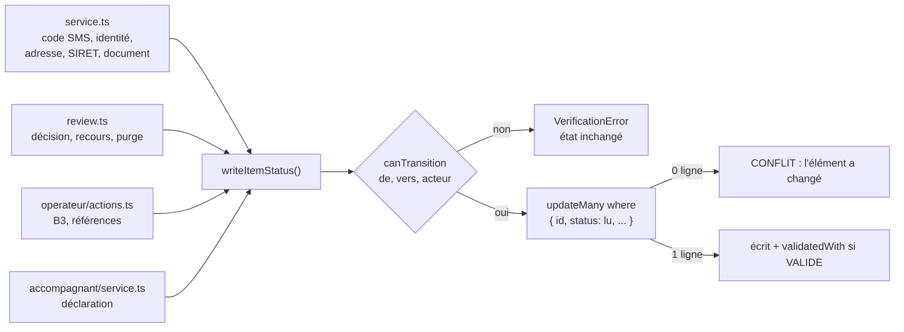
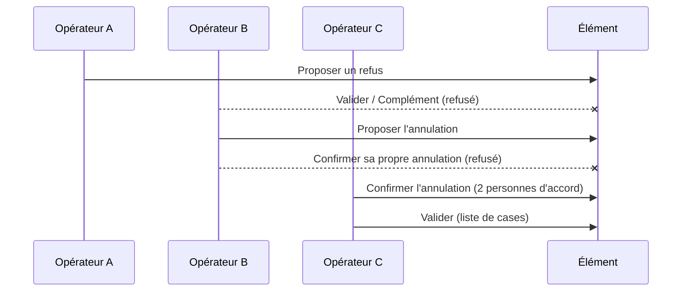

# L2b — corrections de la revue sécurité L2 (vérification de l'accompagnant) : notes

> Sprint L2b. Référence qui fait foi : [`docs/revues/L2-securite.md`](../revues/L2-securite.md).
> Base de test dédiée : `koudmen_l2b`. Migration : `20261010090000_l2b_corrections_securite`. Rien n'est poussé.

## 1. Résultat

| Constat | État | Où | Test permanent |
|---|---|---|---|
| **B1** refus à deux opérateurs annulé par l'accompagnant | Corrigé | `verifications/transition.ts` (`writeItemStatus`), `rules.ts` (`canTransition`, `lockedForCaregiver`), `service.ts`, `review.ts`, `operateur/actions.ts`, `accompagnant/service.ts` | S6, « B1 adresse », « B1 recours à deux », `transition.guard.test.ts` |
| **M1** un opérateur seul passe outre un refus proposé | Corrigé | `review.ts` (`decideItem`, `cancelDossierRefusal`, `blockersFor`) | S2, « M1 dossier » |
| **M2** webhook tardif écrase une décision humaine | Corrigé | `service.ts` (`processIdentityWebhook`) | S1, « M2 session ancienne / revue humaine » |
| **M3** rejeu Veriff après 90 jours | Corrigé | `VerificationItem.appliedDecisionIds` + M2 | S4 |
| **M4** biométrie jamais effacée chez le prestataire | Corrigé | `review.ts` (`redactionDueAt`, purge), table `ProviderRedaction` + déclencheur PostgreSQL, `/api/sante`, file opérateur | S5, S3, « prestataire muet », « compte supprimé » |
| **M5** justificatif jamais décidé jamais effacé | Corrigé | `SensitiveDocument.deleteAfter` NOT NULL (dépôt + 90 j), adaptateur, purge | S3 |
| **M6** clé HMAC facultative, repli public | Corrigé | `crypto.ts` (`hmacKeys`, `hmacLookup`, `h<version>:`), `config.ts`, `config-check.ts` | `crypto-files.test.ts`, `config-check.test.ts` |
| **M7** validation simulée valable en lancement | Corrigé | `VerificationItem.validatedWith`, `countsAsValidated`, `resetSimulatedValidations` | « M7 » × 2, `rules.test.ts` |
| m1 énumération d'un numéro / SIRET | Corrigé | `TAKEN_MESSAGES`, `recordConflict`, file opérateur « Conflits » | `service.db.test.ts` |
| m2 plafond SMS global | Corrigé | plafond par compte `SMS_ACCOUNT_DAILY_BUDGET_CENTS` (60), alerte à 50 % | « m2 » |
| m4 accès aux documents | Corrigé en partie | document ouvert seulement s'il est à relire ou pour un recours ouvert ; refus journalisé ; fiche journalisée | « m4 » |
| m6 copie du justificatif dans le cache de l'app | Corrigé | `mobile/src/compte/choixFichier.ts` (`oublierFichier`), `EnvoiDocument.tsx`, `copieEnCache` | `verifications.spec.ts` (app) |
| m10 profil suspendu confirme un code | Corrigé | `confirmPhoneCode` | « m10 » |
| m11 confirmation de refus non conditionnelle | Corrigé | `writeItemStatus` avec `where: { refusalProposedById }` | S2 |
| m12 recours sans notification | Corrigé | modèles `RECOURS_DECIDE`, `VERIFICATION_REFUSEE`, `RECOURS_A_TRAITER` (opérateurs) | « B1 recours à deux » |
| m3, m5, m7, m8, m9, m13, reste de m4 | Backlog | [`backlog-pilote.md`](../revues/backlog-pilote.md) § « Ajouts L2 » (P18 à P30) | — |

## 2. B1 : une seule fonction écrit l'état

Règles de `canTransition` (étude § 6.2, durcies) :

| Depuis | Qui peut changer l'état |
|---|---|
| `A_REVOIR` (revue humaine) | Un opérateur seulement. Ni code SMS, ni registre, ni prestataire |
| `REFUSE` (refus à deux) | Un SECOND opérateur seulement : recours accepté par deux opérateurs (`decideAppeal`) |
| Vers `REFUSE` | Un SECOND opérateur seulement |
| Vers `VALIDE` | Jamais l'accompagnant seul ; `validatedWith` obligatoire |

Garde permanente : `transition.guard.test.ts` lit le code. Un nouveau `verificationItem.update(...)` hors de `transition.ts` fait échouer les tests. Exceptions justifiées : `upsert` de création (orientation), robots du bac à sable.

## 3. M1 : refus proposé = deux opérateurs pour tout

Même règle pour le refus du DOSSIER (`cancelDossierRefusal`) et pour un recours ACCEPTÉ. « Valider le profil » est bloqué tant qu'un refus est proposé (élément ou dossier, `blockersFor`).

## 4. M2, M3, M4 : décisions du prestataire

Une décision s'applique seulement si les 4 conditions sont vraies. Sinon : `IGNORE:<raison>`, trace dans `IdentityCheck.lateOutcomes` ou dans la session, ligne `identity.decision_ignoree`.

| Condition | Raison si fausse |
|---|---|
| Identifiant de décision absent de `VerificationItem.appliedDecisionIds` | `DEJA_APPLIQUEE` (anti-rejeu durable, M3) |
| Session pas encore décidée (`outcome` vide ou `EN_REVUE`) | `SESSION_DEJA_DECIDEE` |
| Dernière session de l'élément | `SESSION_ANCIENNE` |
| Élément `EN_COURS` | `DECISION_HUMAINE` |

Suppression chez le prestataire (M4) :

- Date due : `max(décision, expiration de la session, création + 7 j) + 30 j`, même sans décision. `decidedAt` n'est jamais remis à nul.
- Compte supprimé (toute cause, cascade comprise) : un déclencheur PostgreSQL `BEFORE DELETE ON "IdentityCheck"` crée une ligne `ProviderRedaction` (hors cascade). La purge nocturne la traite.
- Échec : `redactAttempts` + 1, `redactLastError` (code court), ligne `identity.redact_failed`. Réessai chaque nuit. À 3 échecs : alerte dans la file opérateur et dans `/api/sante` (`verifications.suppressionsPrestataireEnEchec` + avertissement).

## 5. M6 : clé HMAC

| Situation | Clé |
|---|---|
| Essai, adaptateurs simulés (développement, tests, e2e) | Clé de développement publique, empreintes `h0:` |
| Lancement, production stricte, ou un adaptateur réel actif (`ADAPTER_OTP`, `ADAPTER_OTP_APPEL`, `ADAPTER_IDENTITY`, `ADAPTER_DOCUMENTS`) | `VERIFICATION_HMAC_KEY` exigée. Absente : erreur (jamais de repli sur `SESSION_SECRET`) |
| Adaptateur réel actif, ou données réelles ouvertes | Problème BLOQUANT de config-check (page 503), aussi en préversion |
| Lancement en préinscription, simulé | Avertissement (l'opérateur ne valide pas un numéro sans la clé) |

Rotation : `VERIFICATION_HMAC_KEY_VERSION` (préfixe `h<n>:`), `VERIFICATION_HMAC_KEY_PREVIOUS` (+ version). `hmacLookup` cherche avec les deux clés (doublon de numéro, code SMS). Le registre (`ADAPTER_SIRENE`) n'exige pas la clé : il ne crée pas d'empreinte.

> **ATTENTION** — Les empreintes écrites AVANT L2b (hex sans préfixe, clé dérivée de `SESSION_SECRET`) ne sont plus retrouvées. Aucune donnée réelle n'existait (données réelles fermées). Une base d'essai garde des lignes orphelines sans effet.

## 6. M7 : adaptateur de chaque validation

- `VerificationItem.validatedWith` : `simule`, `brevo`, `twilio`, `veriff`, `stripe`, `recherche-entreprises`, `insee`, `operateur`. Écrit par `writeItemStatus` pour chaque `VALIDE`, effacé pour tout autre état. Aussi dans `evidence.adaptateur`.
- Migration : adaptateur repris quand il est connu (`evidence.prestataire`, `evidence.source`, revue opérateur). Code SMS d'avant L2b : inconnu.
- En lancement : `countsAsValidated` refuse `simule` et inconnu (`blockersFor`). `resetSimulatedValidations` remet l'élément `A_FOURNIR` (motif `VALIDATION_ESSAI`), journalise, et passe un dossier `VALIDE` à `EXPIRE` (plus de nouvelles propositions). Appelé par la purge nocturne et à l'ouverture du dossier (`getDossier`).

## 7. Écarts et décisions

1. **Recours accepté à deux opérateurs** (consigne B1). La revue disait « un autre opérateur » ; l'acceptation rouvre des éléments refusés à deux, donc deux opérateurs (hors ceux du refus). « Refus maintenu » : un seul.
2. **Annulation d'un refus proposé** : même le proposeur ne retire pas seul sa proposition (consigne M1 : « aucun opérateur seul »).
3. **Complément demandé pendant un refus proposé** : refusé (il effaçait la proposition : annulation déguisée).
4. **Éléments hors L2 (B3, références)** : « Refuser » sur la fiche PROPOSE (élément `A_REVOIR`) ; un second opérateur confirme avec « Refuser ». Pas encore d'écran d'annulation (backlog P25).
5. **Code d'erreur** : numéro ou SIRET déjà pris → `ACTION_IMPOSSIBLE` + message neutre (le code `NUMERO_DEJA_UTILISE` disait déjà la réponse). Le code reste dans le contrat pour un ancien serveur.
6. **Document après 90 jours sans décision** : fichier effacé ; l'élément `EN_COURS` revient `A_FOURNIR` (`DOSSIER_INCOMPLET_90J`). La fermeture du dossier n'est pas codée (P27).
7. **Accès aux documents** : seulement un document à relire (élément `EN_COURS` ou `A_REVOIR`, pas encore décidé) ou un recours ouvert (motif `RECOURS`). Un contrôle qualité sur un document décidé est refusé et journalisé.
8. **App** : `expo-file-system` ajouté (`~57.0.7`, version de `bundledNativeModules.json`, présent dans Expo Go). La copie en cache est effacée après l'envoi, au remplacement et à la fermeture de l'écran ; jamais un fichier hors du cache de l'app. Après un échec d'envoi, la copie reste le temps de réessayer.

## 8. Tests

| Suite | Résultat |
|---|---|
| `pnpm lint`, `pnpm typecheck` | 0 erreur |
| Unitaires (sans base) | 61 fichiers, 603 tests verts (137 ignorés : base) |
| Unitaires + base (`KOUDMEN_DB_TESTS=1`, base `koudmen_l2b`) | 77 fichiers, 738 / 740. Les 2 échecs sont dans `accompagnant/service.db.test.ts` (« 8 visites ») : test lié à l'heure, sans lien avec L2b (jeudi après 14 h en Martinique, le créneau du jour est passé : 7 visites). [À VÉRIFIER] le rendre indépendant de l'heure |
| Scénarios d'attaque (`securite-l2b.db.test.ts`) | 17 / 17 (S1 à S6 + B1, M1, M4, M7, m2, m4, m10) |
| E2E (`pnpm build:local`, `E2E_PORT=3971`, `RATE_LIMIT_DISABLED=true`, Chromium `/opt/pw-browsers`) | 45 / 45 (`chromium` + `lancement`) |
| App : `npx tsc --noEmit` ; `npm run test:l1` | OK ; 31 / 31 |

## 9. Points ouverts

- [À VÉRIFIER] Veriff : en-tête d'horodatage signé (P26). La défense actuelle (M2 + identifiant gardé) suffit au rejeu.
- [À VÉRIFIER fondateur] `VALIDE` à deux opérateurs après un code de risque (P30).
- [À VÉRIFIER DPO] Retrait du consentement biométrique → suppression anticipée (P29). AIPD : durées de conservation (biométrie 30 j après la date due ; justificatif 90 j sans décision).
- Avant les données réelles : P18 (PDF, antivirus), P19 (2FA opérateur), P21 (version de la clé des documents).
