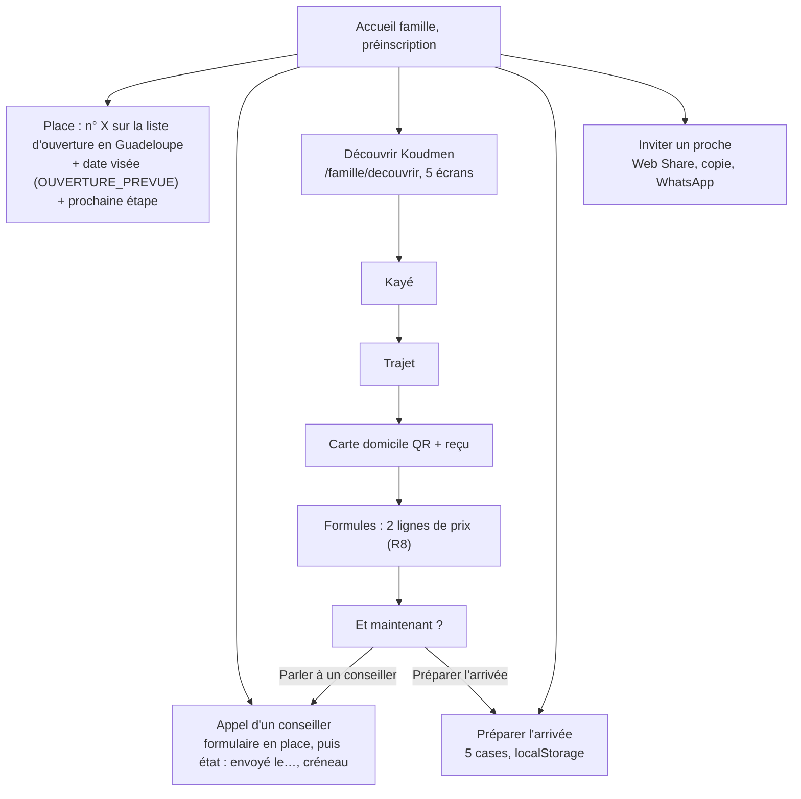

# P1 : espace famille et espace accompagnant en préinscription

## Constat

En préinscription (`realDataAllowed()` faux), l'accueil famille montrait un seul message : « Koudmen ouvre bientôt… Demandez un appel ».
Le fondateur trouvait l'espace vide.

## Règle tenue (R1)

- Rien n'est enregistré sur le parent : pas de fiche aîné, pas de santé, pas d'adresse.
- La liste « Préparer l'arrivée » reste dans le navigateur (`localStorage`, avec `try/catch`). Le serveur ne la reçoit jamais.
- « Inviter un proche » partage un lien. Koudmen ne demande pas l'e-mail du proche.
- La visite guidée utilise des exemples statiques écrits dans la page. Elle ne lit rien en base et ne fait aucun appel au serveur.
- Le mode données réelles ne change pas.

## Parcours famille

## Parcours accompagnant

- Accueil : place dans la file de validation (`n° X`), ou « Pas encore dans la file », ou « Profil validé ».
- « Votre parcours » : les étapes de `getVerificationState().etapes` (mêmes étapes que l'app). L'étape en cours est un lien.
- « Découvrir le métier » (`/accompagnant/decouvrir`, 4 écrans) : journée d'exemple, rôle (ce que l'on fait, ce que l'on ne fait pas),
  revenus calculés par `netIncomeEstimate` avec le statut et le tarif du profil, puis la suite.
- En préinscription, le bloc « Pas de visite prévue » et l'ancien bloc « Pour recevoir des missions » sont masqués (doublon).

## Calculs

| Calcul | Règle | Fichier |
|---|---|---|
| Rang famille | 1 + comptes `FAMILLE` réels (ni démo, ni bac à sable) créés avant, puis départage par `id` | `src/server/preinscription/queries.ts` |
| Rang accompagnant | dossiers `EN_ATTENTE` réels, triés par la dernière demande (`caregiver.submitted`), sinon `updatedAt` | idem |
| Date d'ouverture | `OUVERTURE_PREVUE` = `AAAA-MM` ou `AAAA-MM-JJ`. Absente, invalide ou passée : « bientôt » | `src/lib/preinscription.ts` |

On ne montre qu'un nombre. Aucune autre donnée de la file n'est lue pour l'affichage.

## Fichiers

- Pur : `plateforme/src/lib/preinscription.ts` (+ `.test.ts`).
- Serveur : `plateforme/src/server/preinscription/queries.ts` (+ `.db.test.ts`) ; `src/server/offre/rappel.ts` (créneau de la dernière demande).
- Composants : `src/components/ui/guided-tour.tsx`, `src/components/famille/preinscription-home.tsx`, `prepare-checklist.tsx`, `invite-share.tsx`,
  `src/components/accompagnant/preinscription-panel.tsx` ; `callback-request.tsx` (option `emphasis`).
- Pages : `src/app/(famille)/famille/decouvrir/page.tsx`, `src/app/(accompagnant)/accompagnant/decouvrir/page.tsx` ; accueils modifiés.
- Configuration : `OUVERTURE_PREVUE` dans `.env.example` ; `playwright.config.ts` la fixe à `2027-03` pour le serveur de lancement.

## Choix et incertitudes

- Carte du trajet de la visite guidée : la carte DESSINÉE de l'app (`VisitMap`), pas MapLibre. Raison : aucune tuile externe, rien à charger,
  rendu identique hors ligne. La vraie carte reste sur la page de trajet.
- QR de l'exemple : contenu `koudmen:exemple`, ne mène à aucun domicile.
- Le rang famille compte aussi les comptes dont l'e-mail n'est pas confirmé. Après la purge J29, le rang peut baisser (jamais monter). [À VÉRIFIER] avec le produit.
- Revenus accompagnant : mêmes taux que le profil (`NET_SHARE_BY_STATUS`, déjà [À VÉRIFIER] dans le code). Aucune marque visible du public.
- Liste « Préparer l'arrivée » : textes à relire avec un conseiller (ton, ordre). [À VÉRIFIER]
- `/famille/decouvrir` et `/accompagnant/decouvrir` restent accessibles en mode données réelles, mais aucun lien n'y mène hors préinscription.

## Tests

- Unitaires : `src/lib/preinscription.test.ts` (12 tests : rang, départage, date, stockage abîmé).
- Base (opt-in `KOUDMEN_DB_TESTS=1`) : `src/server/preinscription/queries.db.test.ts` (rang famille, démo exclue ; file de validation par date de demande).
- e2e (projet `lancement`) : 2 nouveaux tests « P1 » ; le test R1 / L4 suit le nouveau texte. Suite `lancement` : 9/9.
- `pnpm lint`, `tsc --noEmit`, `pnpm test` : verts.

## Captures (390 px)

Dossier scratchpad de la session, `p1/` : accueil famille clair/sombre, liste cochée, formulaire d'appel, appel envoyé, 5 écrans de la
visite guidée, accueil accompagnant, 4 écrans « Découvrir le métier ».
