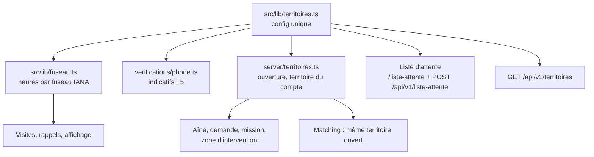

# T1-G1 — Lancement en Guadeloupe : notes de l'agent backend (`plateforme/`)

> Décisions : `docs/revues/T1-arbitrage-guadeloupe.md` (T1 à T10). Contrats : `docs/tech/api-v1.md` § 15.
> Branche de travail : worktree G1. Rien n'est poussé.

## 1. Fichiers principaux

| Sujet | Fichiers |
|---|---|
| Configuration | `src/lib/territoires.ts` (4 territoires, 32 communes de Guadeloupe, 34 de Martinique, organismes), `src/lib/communes.ts` (compatibilité) |
| Fuseaux | `src/lib/fuseau.ts`, `src/server/accompagnant/schedule.ts`, `src/components/ui/zoned-time.tsx`, `src/lib/format.ts`, `src/components/famille/format.ts`, `src/lib/rappel.ts`, `src/server/presence/address.ts` (jour de visite), `src/server/operateur/accord.ts` (heure d'appel) |
| Schéma | `prisma/schema.prisma`, `prisma/migrations/20261011090000_t1_territoires/` |
| Règles serveur | `src/server/territoires.ts`, `src/server/famille/actions.ts`, `src/server/accompagnant/service.ts`, `src/server/rules/matching.ts`, `src/server/operateur/queries.ts`, `src/server/auth/registration.ts` |
| Téléphone | `src/server/verifications/phone.ts`, `src/server/auth/validation.ts`, `.env.example` (`PHONE_ALLOWED_PREFIXES`) |
| Liste d'attente | `src/server/waitlist.ts`, `src/server/waitlist-actions.ts`, `src/app/(public)/liste-attente/`, `src/app/api/v1/liste-attente/route.ts`, purge dans `src/server/launch-retention.ts` |
| API publique | `src/app/api/v1/territoires/route.ts` |
| Textes web | pied de page, accueil (encart « Bientôt »), inscription, mentions légales (organismes), CGU, vérification L2 |
| Données d'essai | `prisma/seed.ts`, `src/server/sandbox/world.ts`, `src/server/sandbox/robots.ts`, `e2e/fixtures.ts` |

## 2. Décisions d'implémentation

| # | Décision | Pourquoi |
|---|---|---|
| D1 | Codes de commune **uniques sur tous les territoires**. Codes de Martinique inchangés. Homonymes de Guadeloupe : `LAMENTIN_GP`, `SAINTE_ANNE_GP` | Un code suffit pour trouver la commune et son territoire ; les lignes existantes restent valides |
| D2 | Colonnes `territoire` avec défaut `GUADELOUPE` ; la migration pose d'abord `MARTINIQUE` sur les lignes existantes (T8) | Le code pose toujours la valeur ; le défaut évite de casser les écritures oubliées |
| D3 | `CaregiverProfile.territoire` est mis à jour quand l'accompagnant enregistre ses communes (un seul territoire, ouvert) | Zone d'intervention = un territoire |
| D4 | Matching : motifs `TERRITOIRE` (autre territoire) et `TERRITOIRE_FERME` ; la file opérateur filtre déjà par territoire | T3 |
| D5 | Acceptation d'une mission refusée si le territoire de l'aîné ≠ celui de l'accompagnant, ou s'il n'est pas ouvert | Garde-fou serveur, même si une proposition ancienne existe |
| D6 | `zonedToUtc` : heure inexistante → décalée vers l'avant ; heure double → la première | Comportement prévisible au changement d'heure (Hexagone) |
| D7 | Équipe Koudmen (rappels, visios, heure d'appel) = territoire de lancement (`TERRITOIRE_EQUIPE`) | Les conseillers sont en Guadeloupe |
| D8 | Téléphone : préfixes dérivés de la configuration (16 préfixes). La Réunion et Mayotte sont **refusées** (T5 : 4 territoires). `0262…` n'est jamais pris pour un fixe de l'Hexagone | Fraude au SMS ; cohérence T5 |
| D9 | Liste d'attente : e-mail en clair (nécessaire pour prévenir), unique par territoire, texte et version du consentement, purge 12 mois. Réponse identique dans tous les cas ; seule la limite par IP répond 429 | RGPD, aucune fuite d'existence |
| D10 | Géocodage : contrôle du code postal du **territoire de la commune** (971 / 972), filtre des homonymes ; sinon repli au centre de la commune | T7 |
| D11 | `GET /me` : territoire lu dans le même `select` que le compte (pas de requête en plus) | Performance |

## 3. Champs ajoutés aux contrats v1 (liste finale, pour `sync:contracts`)

| Fichier du contrat | Ajout |
|---|---|
| `territoires.ts` (**nouveau**) | `TERRITOIRES`, `territoireSchema`, `etatTerritoireSchema`, `codeCommuneSchema`, `communeTerritoireSchema`, `territoireInfoSchema`, `reponseTerritoiresSchema`, `demandeListeAttenteSchema`, `reponseListeAttenteSchema`, `LISTE_ATTENTE_CONSENTEMENT_TEXTE`, `LISTE_ATTENTE_CONSENTEMENT_VERSION`, `LISTE_ATTENTE_CONSERVATION_MOIS` |
| `index.ts` | `export * from "./territoires"` |
| `inscription.ts` | `demandeInscriptionSchema.territoire?` ; `commune` utilise `codeCommuneSchema` (même règle `^[A-Z_]+$`) |
| `moi.ts` | `reponseMoiSchema.territoire` (nullable) |
| `visits.ts` | `visiteSchema.fuseau` ; `aineVisiteSchema.territoire` |
| `visits-propositions.ts` | `propositionSchema.fuseau` ; `propositionSchema.aine.territoire` |
| `trajet.ts` | `reponseTrajetFamilleSchema.territoire?` (vue web de la famille, facultatif) |
| `verifications.ts`, `erreurs.ts` | commentaires seulement |

Routes nouvelles (publiques) : `GET /api/v1/territoires`, `POST /api/v1/liste-attente`. Page web : `/liste-attente?territoire=MARTINIQUE|GUYANE|HEXAGONE`.

## 4. Tests

| Niveau | Contenu |
|---|---|
| Unitaires | fuseaux (Guadeloupe, Guyane, Paris été/hiver, heure inexistante et double), planification (Guyane, passage à l'heure d'hiver), rappels, téléphone T5, inscription par territoire, matching (`TERRITOIRE`, `TERRITOIRE_FERME`), acceptation de mission hors territoire, demande pour un aîné de Martinique, routes `territoires` et `liste-attente`, géocodage (homonymes) |
| Base (`KOUDMEN_DB_TESTS=1`) | liste d'attente (doublon, territoire ouvert, limites IP et e-mail, purge), matching sur base réelle limité au territoire |
| e2e | `e2e/territoires.spec.ts` (encart, page préremplie, consentement, API) ; suites existantes recalées en Guadeloupe |

Résultat (base dédiée `koudmen_t1`) : lint OK, typecheck OK, **770 tests unitaires et base OK** (82 fichiers), **48 e2e OK** (essai + lancement, `RATE_LIMIT_DISABLED=true`, port 3460).

## 5. Limites et points `[À VÉRIFIER]`

- Centres et codes postaux des 32 communes de Guadeloupe : approximatifs (± 1 km) [À VÉRIFIER avec le COG et La Poste].
- API Adresse en Guadeloupe : non testée en réel (réseau sortant fermé ici) [À VÉRIFIER : couverture, adresses sans numéro].
- Guyane : `+594 695` (nouvelle tranche mobile) non acceptée ; organisme SAP « DGCOPOP » [À VÉRIFIER].
- Organismes de Guadeloupe dans les mentions légales [À VÉRIFIER avec un juriste].
- Carte (MapLibre) : centrée sur le domicile de l'aîné, donc en Guadeloupe ; `centre` et `emprise` sont dans la configuration pour un usage futur (carte sans domicile).
- Réponses v1 en `.strict()` : une ancienne app sans `fuseau`/`territoire` refuse les nouvelles réponses. L'app G2 est alignée ; synchroniser les contrats à la fusion.
- Lignes existantes passées en `MARTINIQUE` : leurs aînés ne peuvent plus recevoir de demande ni de mission (territoire « Bientôt »). Données d'essai seulement.
- Pas de lien « Retirer mon accord » automatique pour la liste d'attente : retrait par e-mail à l'équipe (texte du consentement).
