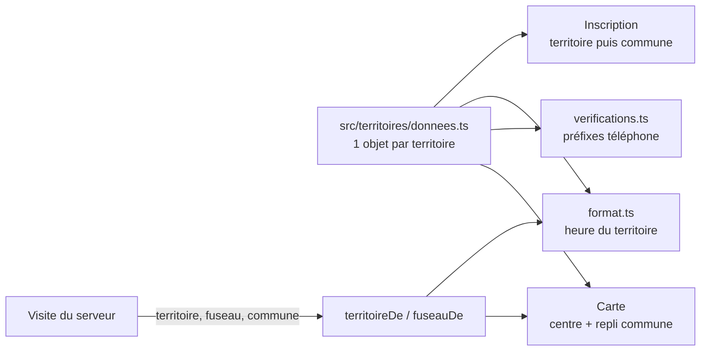
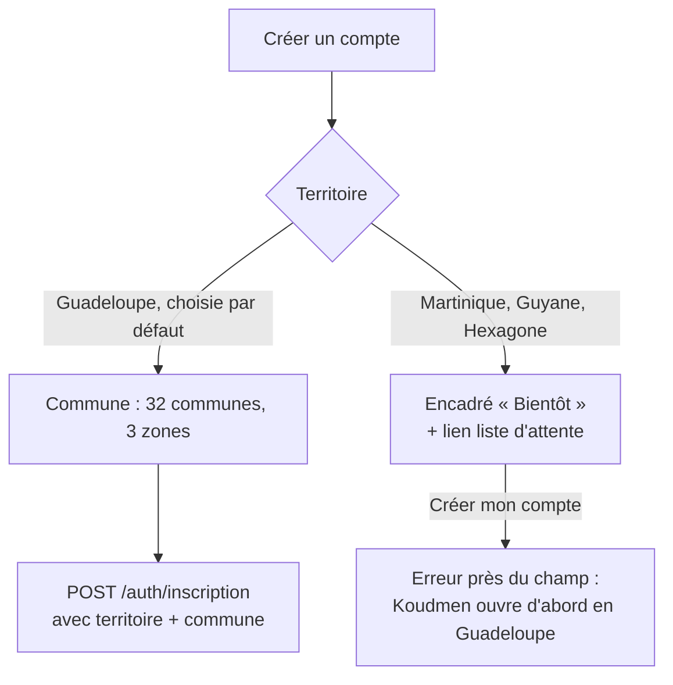

# T1 — G2 (app accompagnant) : Guadeloupe d'abord, territoire en donnée

> Agent G2 `dev-frontend`, périmètre `mobile/**`. Décisions : `docs/revues/T1-arbitrage-guadeloupe.md` (fait foi).
> Date : 2026-10-09.

## 1. Ce qui change

| Sujet | Avant | Après |
|---|---|---|
| Territoire | « Martinique » en dur (6 textes) | `src/territoires/` : nom, fuseau IANA, indicatifs, communes, état `OUVERT`/`BIENTOT`, centre de carte |
| Ouverture | — | Guadeloupe `OUVERT` ; Martinique, Guyane, Hexagone `BIENTOT` |
| Communes | 34 de Martinique | 32 de Guadeloupe en 3 zones, codes de G1 (+ les 34 de Martinique gardées) |
| Heures | décalage fixe UTC−4, « heure de Martinique » | fuseau IANA de la visite, « heure de Guadeloupe », « heure de Guyane », « heure de Paris » ; heure du téléphone ajoutée si différente |
| Téléphone | exemple 0696 | préfixes depuis la configuration ; exemple du territoire (0690 12 34 56) |
| Carte | centre Martinique | centre du territoire de la visite (Guadeloupe par défaut) |
| Mode simulé | Léonie à Fort-de-France | Léonie à Pointe-à-Pitre (Carénage), autres aînés aux Abymes, Sainte-Anne, Gosier, Baie-Mahault ; code `LKW7Q3` inchangé |

## 2. Inscription

- Changer de territoire vide la commune : la commune doit appartenir au territoire choisi.
- Lien « M'inscrire sur la liste d'attente » : `WEB_URL/liste-attente?territoire=<CODE>`. [À VÉRIFIER] voir E6.

## 3. Heures (`src/lib/format.ts`)

- Toutes les fonctions prennent un fuseau IANA facultatif (défaut `America/Guadeloupe`).
- Pas d'`Intl` pour les 4 fuseaux du projet (Expo Go, moteur JS variable) :
  - Antilles et Guyane : décalage fixe.
  - `Europe/Paris` : règle UE (dernier dimanche de mars et d'octobre, 1 h UTC).
  - Autre fuseau : `Intl` si disponible, sinon UTC−4.
- Un test compare le calcul à `Intl` de Node sur 5 instants × 4 fuseaux (changements d'heure compris).
- `plageAvecFuseau(debut, fin, fuseau)` : « 9 h 30 – 11 h 30, heure de Guadeloupe (15 h 30 – 17 h 30 chez vous) ».

## 4. Écarts avec le serveur (à réconcilier)

En fin de lot, G1 a publié `plateforme/src/contracts/v1/territoires.ts` sur sa branche (`worktree-agent-af780e4f9bbc2b435`, pas encore fusionnée). Je l'ai **lu** sans le copier (périmètre `mobile/**`). L'app suit une **forme provisoire** (`src/territoires/types.ts`) aux **mêmes noms de champs**.

| # | Champ (contrat G1) | Où | Comportement actuel de l'app | Action à la réconciliation |
|---|---|---|---|---|
| E1 | `territoire` (facultatif, OUVERT seulement) | `POST /auth/inscription` | **Envoyé** (`demandeInscriptionTerritoireSchema` = contrat L1 + `territoire`) | Compatible. Après la synchro, remplacer par `demandeInscriptionSchema` du contrat |
| E2 | `aine.territoire`, `visite.fuseau` | `GET /visites`, `/visites/:id` | **Lus s'ils existent** (`territoireDe`, `fuseauDe`). Sinon : commune → territoire (ouverts d'abord), sinon Guadeloupe | `npm run sync:contracts` OBLIGATOIRE : les contrats `.strict()` de l'app rejettent une réponse avec un champ inconnu |
| E3 | `fuseau` racine, `aine.territoire` | propositions | Même règle que E2 | idem |
| E4 | `territoire` (nullable) | `GET /me` | Lu s'il existe (`territoireCompte`), sinon Guadeloupe | idem |
| E5 | Codes de commune | `lib/territoires.ts` | **Alignés** sur G1 : 32 codes (`LAMENTIN_GP`, `SAINTE_ANNE_GP`…), mêmes centres, mêmes 3 zones (Grande-Terre, Basse-Terre, Îles du Sud) | Plus tard : lire `GET /api/v1/territoires` au lieu de la copie locale |
| E6 | Liste d'attente | `POST /api/v1/liste-attente` | L'app ouvre `WEB_URL/liste-attente?territoire=<CODE>` ; **aucune page web** n'existe encore chez G1 | Soit une page web, soit un formulaire dans l'app (e-mail + case de consentement `LISTE_ATTENTE_CONSENTEMENT_TEXTE`) |
| E7 | Données de démo du site | `prisma/seed.ts` | App : Léonie J., Carénage, Pointe-à-Pitre, `16.236, -61.529` | Aligner sur le seed de G1 (T8) |
| E8 | Centre de carte | `centre { lat, lng, zoom }` | App : `carte { latitude, longitude, delta }` (delta pour react-native-maps) ; mêmes centres | Conversion zoom → delta si l'app lit le serveur |

Le mode simulé n'ajoute PAS `territoire`/`fuseau` aux visites : le cache hors ligne relit les visites avec le contrat `.strict()` actuel et les rejetterait. À ajouter après la synchro.

## 5. Tests (2026-10-09)

| Suite | Résultat |
|---|---|
| `tsc --noEmit` | OK |
| `test:l1` (dont `territoires.spec.ts`, heures Guyane / Hexagone, comparaison à `Intl`) | 36 / 36 |
| `test:hors-ligne` | 41 / 41 |
| `test:push` | 9 / 9 |
| `test:natif` | 6 / 6 |
| `e2e:simule` (nouvel export `EXPO_OFFLINE=1`) | 37 / 37 (dont 2 nouveaux : heure de Guadeloupe ; téléphone en `Europe/Paris`) |
| `e2e:natif` | 8 / 8 |
| `e2e:hors-ligne` (nouvel export) | 3 / 3 |
| Lint | pas de configuration ESLint dans `mobile/` |

## 6. Incertitudes

- [À VÉRIFIER] Liste et centres des 32 communes (± 1 km), repris de G1.
- [À VÉRIFIER] Coordonnées du domicile simulé (quartier du Carénage).
- [À VÉRIFIER] Route ou écran de la liste d'attente (E6).
- [À VÉRIFIER] « heure de Paris » pour l'Hexagone (même libellé que G1).
- La Réunion et Mayotte (+262) restent acceptées pour le téléphone (comme le serveur L2). À confirmer avec G1.
