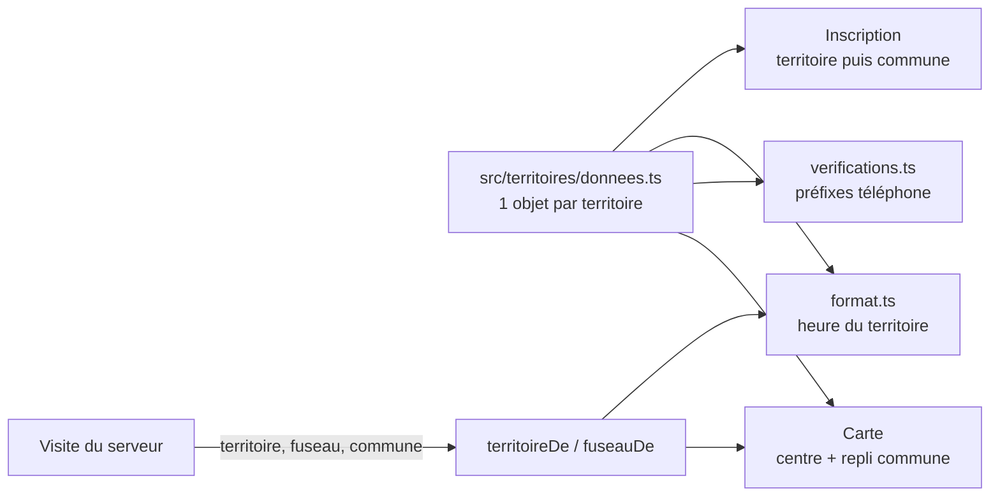
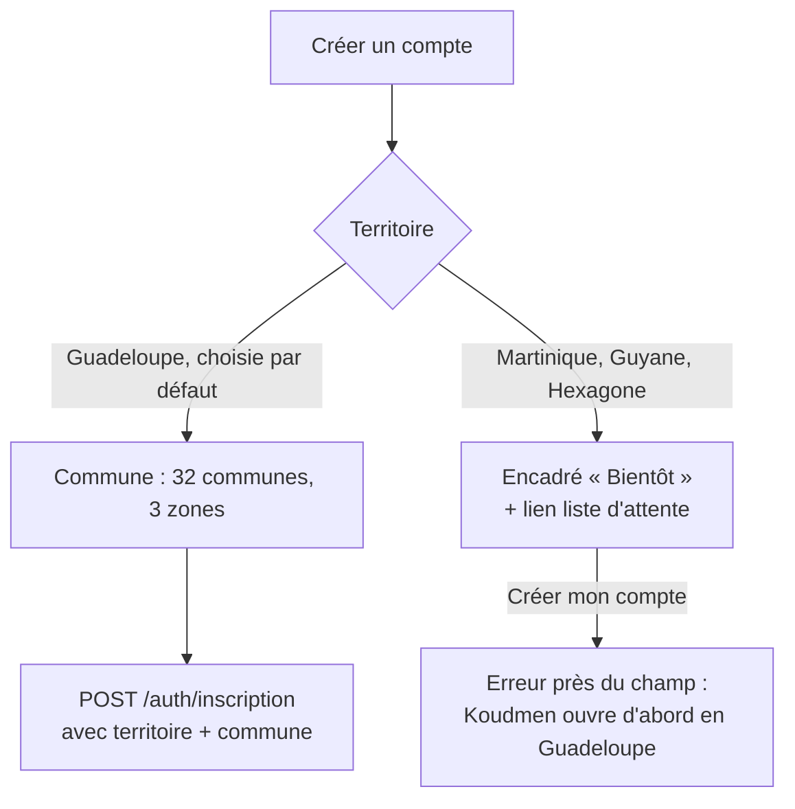

# T1 — G2 (app accompagnant) : Guadeloupe d'abord, territoire en donnée

> Agent G2 `dev-frontend`, périmètre `mobile/**`. Décisions : `docs/revues/T1-arbitrage-guadeloupe.md` (fait foi).
> Date : 2026-10-09.

## 1. Ce qui change

| Sujet | Avant | Après |
|---|---|---|
| Territoire | « Martinique » en dur (6 textes) | `src/territoires/` : nom, fuseau IANA, indicatifs, communes, état `OUVERT`/`BIENTOT`, centre de carte |
| Ouverture | — | Guadeloupe `OUVERT` ; Martinique, Guyane, Hexagone `BIENTOT` |
| Communes | 34 de Martinique | 32 de Guadeloupe en 3 zones, codes de G1 (+ les 34 de Martinique gardées) |
| Heures | décalage fixe UTC−4, « heure de Martinique » | fuseau IANA de la visite, « heure de Guadeloupe », « heure de Guyane », « heure de Paris » ; heure du téléphone ajoutée si différente |
| Téléphone | exemple 0696, +262 accepté | préfixes depuis la configuration (+262 refusé, comme le serveur) ; exemple du territoire (0690 12 34 56) |
| Carte | centre Martinique | centre du territoire de la visite (Guadeloupe par défaut) |
| Mode simulé | Léonie à Fort-de-France | Léonie à Pointe-à-Pitre (Carénage), autres aînés aux Abymes, Sainte-Anne, Gosier, Baie-Mahault ; code `LKW7Q3` inchangé |

## 2. Inscription

- Changer de territoire vide la commune : la commune doit appartenir au territoire choisi.
- Lien « M'inscrire sur la liste d'attente » : `WEB_URL/liste-attente?territoire=<CODE>`. [À VÉRIFIER] voir E6.

## 3. Heures (`src/lib/format.ts`)

- Toutes les fonctions prennent un fuseau IANA facultatif (défaut `America/Guadeloupe`).
- Pas d'`Intl` pour les 4 fuseaux du projet (Expo Go, moteur JS variable) :
  - Antilles et Guyane : décalage fixe.
  - `Europe/Paris` : règle UE (dernier dimanche de mars et d'octobre, 1 h UTC).
  - Autre fuseau : `Intl` si disponible, sinon UTC−4.
- Un test compare le calcul à `Intl` de Node sur 5 instants × 4 fuseaux (changements d'heure compris).
- `plageAvecFuseau(debut, fin, fuseau)` : « 9 h 30 – 11 h 30, heure de Guadeloupe (15 h 30 – 17 h 30 chez vous) ».

## 4. Réconciliation avec G1 (contrats synchronisés)

Branche `claude/accompagnement-vie-marketplace-ufydih` fusionnée, puis `node scripts/sync-contracts.mjs` (12 contrats, dont `territoires.ts`). `sync-contracts --check` : à jour.

| # | Champ (contrat G1) | Où | Dans l'app |
|---|---|---|---|
| E1 | `territoire` (facultatif, OUVERT seulement) | `POST /auth/inscription` | Toujours envoyé (`demandeInscriptionTerritoireSchema` = contrat + `territoire` obligatoire) |
| E2 | `fuseau`, `aine.territoire` | visites | Lus en PREMIER par `fuseauDe` / `territoireDe` ; la configuration locale sert seulement de repli |
| E3 | `fuseau`, `aine.territoire` | propositions | Idem |
| E4 | `territoire` (nullable) | `GET /me` | `territoireCompte` ; `null` → Guadeloupe |
| E5 | Codes de commune | `lib/territoires.ts` | Alignés (32 codes, mêmes centres, mêmes 3 zones) |
| E6 | Liste d'attente | `POST /api/v1/liste-attente` | L'app ouvre `WEB_URL/liste-attente?territoire=<CODE>`. [À VÉRIFIER] page web ou formulaire dans l'app |
| E7 | Téléphone +262 | serveur : REFUSÉ | Retiré des préfixes de l'app ; `0262…`/`0692…` reconnus pour être refusés |
| E8 | Centre de carte | `centre { lat, lng, zoom }` | App : `carte { latitude, longitude, delta }` (react-native-maps), mêmes centres |

- `src/territoires/types.ts` prend `territoireSchema`, `CodeTerritoire`, `EtatTerritoire` du contrat.
- Mode simulé : `me.territoire`, `visite.fuseau`, `aine.territoire`, `proposition.fuseau` remplis (Guadeloupe).
- Fixtures mises à jour : `cache.spec.ts`, `horsligne.spec.ts`, `api-factice.mjs` (Léonie B., Sainte-Anne).

## 5. Tests (après la réconciliation)

| Suite | Résultat |
|---|---|
| `tsc --noEmit` | OK |
| `sync-contracts --check` | à jour |
| `test:l1` | 36 / 36 |
| `test:hors-ligne` | 41 / 41 |
| `test:push` | 9 / 9 |
| `test:natif` | 6 / 6 |
| `e2e:simule` (nouvel export `EXPO_OFFLINE=1`) | 37 / 37 |
| `e2e:natif` | 8 / 8 |
| `e2e:hors-ligne` (nouvel export) | 3 / 3 |
| Lint | pas de configuration ESLint dans `mobile/` |

## 6. Incertitudes

- [À VÉRIFIER] Liste et centres des 32 communes (± 1 km), repris de G1.
- [À VÉRIFIER] Coordonnées du domicile simulé (quartier du Carénage).
- [À VÉRIFIER] Route ou écran de la liste d'attente (E6).
- [À VÉRIFIER] « heure de Paris » pour l'Hexagone (même libellé que G1).
- La Réunion et Mayotte (+262) restent acceptées pour le téléphone (comme le serveur L2). À confirmer avec G1.
