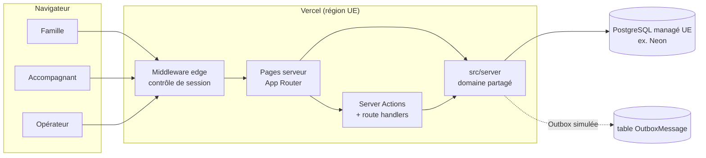
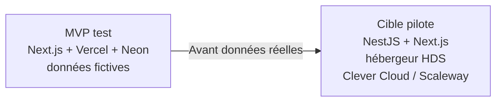

# ADR 0001 — MVP de test : une application Next.js full-stack

- **Statut :** accepté (Sprint S0, 2026-10-04)
- **Décideurs :** fondateur (décision imposée), architecte
- **Remplace en partie :** `docs/05` § 2.2 (monolithe NestJS) **pour la phase de test seulement**

## 1. Contexte

- Le fondateur veut un MVP **déployé sur le web**, utilisable par des testeurs réels (familles, accompagnants).
- Pendant les tests, Koudmen utilise **uniquement des données fictives**. Aucune donnée de santé réelle.
- `docs/05` fixe la cible : NestJS en monolithe modulaire, hébergement certifié HDS, app mobile Expo.
- Cette cible demande plusieurs semaines de mise en place (API séparée, auth OIDC, HDS, app mobile).
- Trois constructeurs vont travailler **en parallèle** sur le MVP.

## 2. Décision

Pour le MVP de test, Koudmen utilise **une seule application Next.js full-stack**.

| Sujet | Choix MVP |
|---|---|
| Framework | Next.js 15.5 (App Router), React 19, TypeScript strict |
| Écritures | Server Actions (formulaires) ; route handlers si un appel HTTP est nécessaire |
| Données | PostgreSQL 16 + Prisma 6 ; schéma complet dès S0 |
| Validation | Zod (côté serveur, obligatoire) |
| Session | Cookie httpOnly signé (JWT HS256, `jose`) — voir ADR 0002 |
| Mots de passe | `bcryptjs` (10 tours) |
| Style | Tailwind CSS 4, design tokens CSS (clair + sombre) |
| Tests | Vitest (unitaires), Playwright (e2e, Chromium) |
| Gestionnaire | pnpm 10 |
| Hébergement test | Vercel (application) + Postgres managé en région UE (ex. Neon `eu-central-1`) |
| Notifications | Table Outbox, **aucun envoi réel** |
| Paiement | **Simulé** (table `SimulatedPayment`) |

## 3. Pourquoi

1. **Vitesse.** Un seul dépôt, un seul déploiement, pas d'API à versionner.
2. **Déploiement simple.** `git push` → Vercel. Les testeurs ont une URL en quelques minutes.
3. **Travail en parallèle.** Le schéma Prisma et le domaine `src/server/` sont figés en S0. Chaque lot possède ses dossiers.
4. **Réversible.** Le domaine (`src/server/rules`, `src/server/visits/proof.ts`) est en TypeScript pur. Il se déplace tel quel dans des modules NestJS.

## 4. Conséquences

### Positives
- Un MVP testable en quelques sprints.
- Les règles métier critiques (statut → niveau, preuve 2 sur 3, orientation) sont testées une fois, réutilisables.

### Négatives et limites (acceptées pour le test)
- **ATTENTION : pas d'hébergement HDS.** Vercel et Neon ne sont pas certifiés HDS. Seules des données fictives sont autorisées. Un bandeau le rappelle sur chaque page.
- Pas d'app mobile hors ligne. L'accompagnant utilise le web mobile.
- Pas de vraie voix, pas de vrai WhatsApp/SMS, pas de vrai paiement.
- Pas de limitation de débit (rate-limit) sur la connexion [À VÉRIFIER avant ouverture large].

## 5. Conditions de sortie (avant le vrai pilote)

Avant **toute donnée réelle**, Koudmen bascule vers la cible de `docs/05` :

1. Hébergement **certifié HDS** (application et base).
2. Back-end NestJS modulaire : reprise de `src/server/` en modules.
3. Auth renforcée (OIDC, 2FA opérateur, rate-limit).
4. Vrais connecteurs : WhatsApp Business, SMS, voix, paiement (Stripe Connect / CESU+).
5. Analyse d'impact (AIPD) RGPD validée.

## 6. Options écartées

| Option | Raison |
|---|---|
| NestJS + Next.js dès S0 | Trop long pour un test avec données fictives |
| Supabase / Firebase | Société US, pas d'HDS, rejeté par `docs/05` ; migration plus difficile |
| No-code (phase 0 de `docs/05`) | Ne prouve pas le parcours produit complet ni la preuve de visite |
