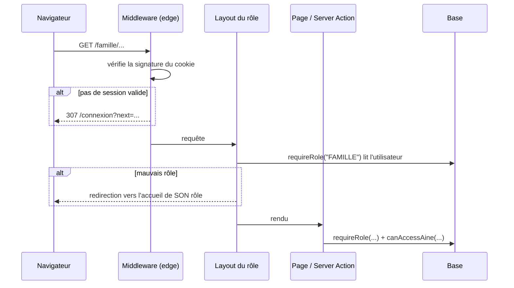

# ADR 0002 — Authentification et session du MVP

- **Statut :** accepté (Sprint S0, 2026-10-04)
- **Contexte :** ADR 0001 (Next.js full-stack, données fictives)

## 1. Décision

- Connexion par **email + mot de passe**. Hash `bcryptjs` (10 tours).
- Session **sans état** : un JWT HS256 signé avec `SESSION_SECRET` (32 caractères min.), dans un cookie `koudmen_session`.
- Cookie : `httpOnly`, `SameSite=Lax`, `Secure` en production, durée 7 jours.
- **Mode démo** : si `DEMO_MODE=true`, un bouton connecte à un compte seedé (`isDemo = true`). Chaque connexion démo est journalisée.
- L'aîné **n'a pas de compte** (profil géré par la famille).
- Le rôle OPERATEUR se crée seulement par le seed (pas d'inscription publique).

## 2. Les trois barrières

1. **Middleware** : refuse un visiteur sans session valide sur `/famille`, `/accompagnant`, `/operateur`.
2. **Layout du rôle** : `requireRole(ROLE)`.
3. **Chaque page, Server Action et route handler** : `requireRole(...)` **puis** contrôle d'accès à la ressource (`canAccessAine`, propriétaire de la visite, etc.).

> ATTENTION : une Server Action est un point d'entrée HTTP public. Le layout ne la protège pas. Appelle toujours `requireRole()` en première ligne.

## 3. Conséquences

- Pas de table de sessions : une déconnexion supprime le cookie, mais un jeton volé reste valide jusqu'à expiration. Acceptable avec des données fictives.
- `getCurrentUser()` relit l'utilisateur en base à chaque requête : un compte supprimé perd l'accès tout de suite.
- Messages d'erreur de connexion identiques (pas d'énumération des comptes).
- Redirection après connexion limitée aux chemins internes (`safeNextPath`).

## 4. À faire avant le pilote réel

- Limitation de débit sur `/connexion` et `/inscription`.
- Réinitialisation du mot de passe par email.
- 2FA pour les opérateurs.
- Version de session en base (révocation immédiate).
