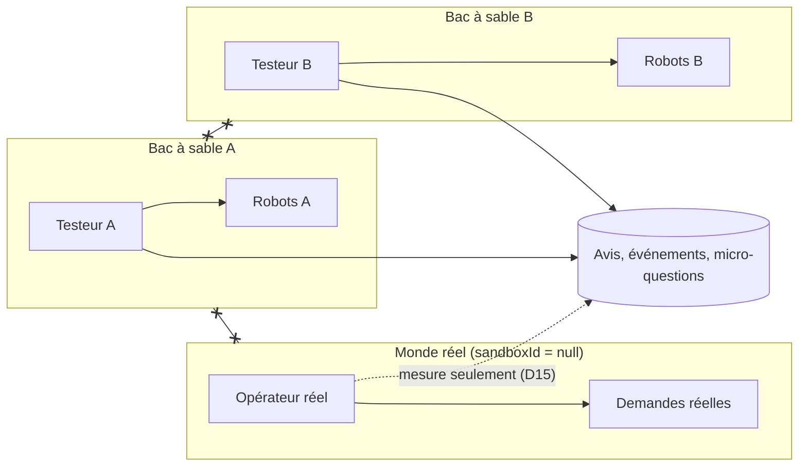

# ADR 0003 — Un bac à sable par testeur (cloisonnement par `sandboxId`)

- **Statut :** accepté (Sprint S1b, 2026-10-04)
- **Contexte :** `revues/S1-produit.md` § 5, `revues/S1-juridique.md` T1 et T8, décisions D1, D2, D3, D14, D15 de `revues/S1-arbitrage.md`.
- **Remplace :** le mode « comptes démo partagés » pour les testeurs (gardé seulement pour les démos en direct du fondateur).

## 1. Problème

Avec des comptes démo partagés, les testeurs se marchent dessus, un retour n'est pas attribuable, et une vraie donnée saisie par un testeur devient visible par tous. Le compte démo « Opérateur » public exposait les données réelles des testeurs (T1, BLOQUANT).

## 2. Décision

1. **Un monde par testeur.** Un « monde » = un bac à sable (`Sandbox`) ou le monde réel (`sandboxId = null`).
2. **Colonne `sandboxId`** sur `User`, `Aine` et `OutboxMessage`. Tout le reste (demande, proposition, mission, visite, Kayé, invitation) pend à un aîné ou à un compte : son monde se déduit.
3. **Cloisonnement explicite** dans `src/server/scope.ts` :
   - `REAL_WORLD = null` ; `sameScope(a, b)` ;
   - l'espace opérateur filtre **toutes** ses requêtes sur le monde réel (`user: { sandboxId: null }`, `aine: { sandboxId: null }`, `sandboxId: null` pour la boîte d'envoi, acteur réel pour l'audit) ;
   - le service partagé `src/server/matching/service.ts` refuse une demande ou un profil d'un autre monde (« introuvable ») ;
   - une invitation Lakou ne s'ouvre que dans son monde.
4. **Robots.** Chaque bac à sable a un opérateur, une famille et des accompagnants « robots ». Ils ne se connectent jamais (mot de passe inconnu, connexion par mot de passe refusée aux comptes de bac à sable). Ils agissent par « Simuler la suite » avec les **vrais services** (D14).
5. **Accès.** Entrée sur code d'invitation testeur (`TESTER_INVITE_CODES`, D3) + acceptation des CGU de test (D4). Lien de reprise : jeton aléatoire de 32 octets, empreinte SHA-256 en base, jeton aussi gardé dans un cookie httpOnly de 30 jours.
6. **Espace opérateur** réservé aux vrais opérateurs : `requireRole("OPERATEUR")` refuse un compte démo ou de bac à sable. Les opérateurs se créent par `pnpm ops:create-operator`.
7. **Purge** des bacs à sable de plus de 30 jours : `/api/cron/purge-bacs-a-sable` (Vercel Cron, `CRON_SECRET`) et `pnpm ops:purge-sandboxes`. Les avis, événements d'usage et réponses restent, rattachés au seul code testeur.
8. **Exception voulue au cloisonnement :** la mesure du test (D15 : avis, événements, micro-questions, offre factice) est regroupée dans l'écran opérateur « Mesure du test ».

## 3. Alternatives écartées

| Option | Pourquoi non |
|---|---|
| Une base par testeur | Coût et complexité (migrations, connexions). |
| Cloisonnement par `isDemo` seulement | Ne sépare pas deux testeurs entre eux. |
| `sandboxId` sur toutes les tables | Plus de colonnes à maintenir. Le monde se déduit déjà de l'aîné ou du compte. |
| Row Level Security PostgreSQL | Plus robuste, mais demande une connexion par rôle ; prévu si le nombre d'écrans transverses grandit. [À VÉRIFIER] |

## 4. Conséquences

- Toute nouvelle requête **transverse** (qui ne part pas du compte connecté) doit porter un filtre de monde. Le test d'intégration `src/server/sandbox/sandbox.db.test.ts` et l'e2e `bac-a-sable.spec.ts` le vérifient.
- Les requêtes « par propriétaire » (cercle Lakou, profil de l'accompagnant) sont cloisonnées par construction.
- Le seed ne tourne que si `DEMO_MODE=true` ; il efface toute la base (jamais en production réelle).
