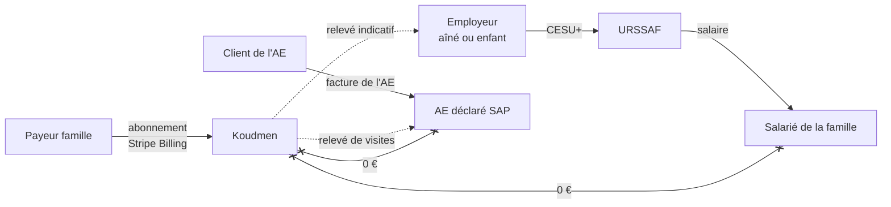
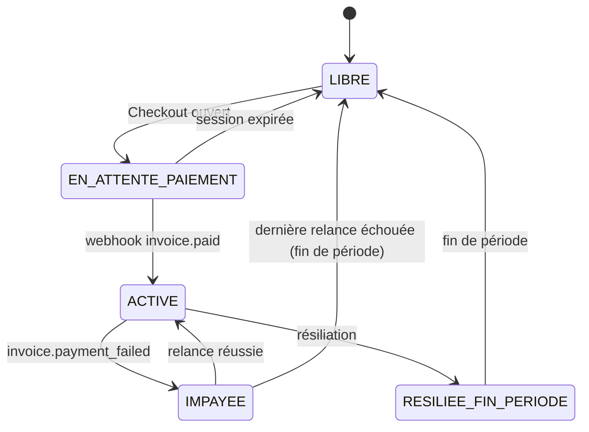

# ADR 0004 — Paiements : abonnement famille par Stripe Billing, heures payées hors plateforme

- **Statut :** proposé (2026-10-05). À valider par le fondateur. Les points juridiques passent par l'avocat (porte G4).
- **Décideurs :** fondateur (orchestrateur), architecte.
- **Remplace :** `docs/05` § 4 (« Stripe Connect au MVP, commission par `application_fee` »), et ADR 0001 § 5 point 4 (« Stripe Connect / CESU+ »).
- **Sources :** `docs/00` § 3, `docs/01` § 1.2 et § 3.3, `docs/05` § 1.1 et § 4, `docs/08`, `docs/revues/S1-juridique.md` (P1, P5, P12), `S1-arbitrage.md` (D10, D12), `S1b-arbitrage.md` (A2, A3), spécification V1 § 7.

## 1. Contexte

- Le fondateur veut de **vrais paiements** en V1.
- Deux flux d'argent existent :
  1. **L'abonnement** de la famille à Koudmen (Kozé, Sérénité). Il paie des **services numériques**.
  2. **Les heures** de visite. La famille les paie à l'accompagnant (salarié de la famille ou auto-entrepreneur, AE).
- Règle non négociable : **0 € prélevé sur l'accompagnant** (art. L5321-3 C. trav., `docs/00` § 3).
- Règles anti-requalification (directive UE 2024/2831) : tarif libre fixé par l'accompagnant, refus sans pénalité, pas de contrôle du travail.
- `docs/05` § 4 proposait Stripe Connect avec une commission. La revue juridique S1 (P1, P5) a rendu ce schéma risqué.

## 2. Décision

### 2.1 Abonnement famille : Stripe Billing

- **Stripe Billing** + **Stripe Checkout** (page hébergée) + **portail client Stripe**.
- Un abonnement par aîné. Un seul payeur par aîné en V1.
- Carte bancaire en V1. Prélèvement SEPA en option (V1.1).
- Factures émises par Stripe au nom de Koudmen.
- Mention fixe : « Abonnement à des services numériques. Non éligible au crédit d'impôt pour l'emploi d'un salarié à domicile. » [À VÉRIFIER par rescrit]

### 2.2 Heures : hors plateforme (tranché)

**Koudmen n'encaisse pas l'argent des heures en V1.** Stripe Connect n'est **pas** utilisé.

| Accompagnant | Comment la famille paie les heures | Rôle de Koudmen |
|---|---|---|
| Salarié de la famille (voie B, cœur du pilote) | **CESU+** sur cesu.urssaf.fr. L'URSSAF prélève l'employeur et paie le salarié. Avance immédiate du crédit d'impôt dans CESU+ | Relevé d'heures **indicatif**. La famille déclare elle-même |
| AE déclaré SAP (voie A, niveau 2) | Facture de l'AE. Virement, CESU préfinancé, ou logiciel habilité de l'AE (avance immédiate) | Relevé de visites pour aider l'AE à faire **sa** facture |
| Proche aidant APA, bénévole | Hors champ des paiements Koudmen | Aucun |

## 3. Justification juridique

Chaque point ci-dessous est une analyse d'architecte. Il n'est pas une consultation juridique. **[À VÉRIFIER AVEC L'AVOCAT, porte G4]**

| # | Risque si Koudmen encaisse les heures (Stripe Connect) | Texte | Effet |
|---|---|---|---|
| J1 | **Acte de gestion de mandataire.** Encaisser le salaire pour le compte d'un employeur particulier, puis le reverser, c'est gérer l'emploi pour lui | Art. L7232-1 et s. C. trav. (agrément DEETS pour le mandataire auprès d'un public fragile) ; revue S1 P5 | Agrément obligatoire. Sans agrément : exercice illégal |
| J2 | **Service de paiement.** Encaisser pour reverser à un tiers est un service de paiement | Art. L314-1 C. mon. fin. ; DSP2 | Stripe, établissement agréé, porte ce risque. **Il ne porte pas J1** |
| J3 | **Commission sur l'accompagnant.** Stripe Connect sert surtout à retenir `application_fee` | Art. L5321-3 C. trav. (aucune rétribution exigée d'une personne qui cherche un emploi) | Interdit pour le salarié. Contraire à R7 pour l'AE |
| J4 | **Indice de subordination.** Retenir l'argent jusqu'à la validation de la visite, puis le libérer, c'est contrôler l'exécution du travail | Directive UE 2024/2831 (présomption de salariat, faits de contrôle) ; `docs/01` § 3.3 | Risque de requalification de l'AE en salarié de Koudmen |
| J5 | **Double circuit avec l'avance immédiate.** L'URSSAF verse 100 % à l'AE par son logiciel habilité | API Tiers de prestation | Deux rails, risque de double paiement |
| J6 | **Exposition politique.** Les amendements contre l'avance immédiate « plateforme + micro-entrepreneur » visent ce schéma | `docs/05` § 4.4 | Le modèle ne doit pas en dépendre |
| J7 | **Obligations déclaratives** plus lourdes : KYC de chaque accompagnant, LCB-FT, DAC7, précompte URSSAF 2027 | Directive DAC7 ; LFSS (précompte) | DAC7 et précompte peuvent s'appliquer **même** hors flux [À VÉRIFIER AVOCAT, spec § 19 Q1] |

Conclusion : hors plateforme, Koudmen reste un **outil de mise en relation et de preuve**. Il ne gère pas l'emploi. Il ne tient pas l'argent. Il ne prélève rien sur l'accompagnant.

## 4. Pourquoi Stripe pour l'abonnement

| Critère | **Stripe Billing** | Mollie (Pays-Bas) | GoCardless (SEPA) | Paddle (revendeur) |
|---|---|---|---|---|
| Abonnements, relances, portail client | **Complet** | Oui, plus simple | SEPA seulement | Oui |
| 3-D Secure, page hébergée (PCI SAQ A) | Oui | Oui | Sans objet | Oui |
| Factures conformes, Stripe Tax | Oui | Partiel | Non | Paddle facture à sa place (revendeur) |
| Frais carte EEE | 1,5 % + 0,25 € [VÉRIFIÉ `docs/05`] + Billing ~0,7 % [À VÉRIFIER] | ~1,8 % + 0,25 € [À VÉRIFIER] | ~1 % plafonné [À VÉRIFIER] | ~5 % + 0,50 $ [À VÉRIFIER] |
| Écosystème et documentation | **Très large** | Moyen | Moyen | Moyen |
| Évolution vers Connect (V2, si l'avocat valide) | **Même compte** | Mollie Connect | Non | Non |
| Verdict | **Choisi** | Alternative UE | Option SEPA V1.1 | Rejeté (Koudmen perd la relation de facturation) |

Exemple de coût : Sérénité à 149 € → frais ≈ 0,25 + 2,24 + 1,04 ≈ **3,50 € par mois** [À VÉRIFIER].

## 5. Règles de mise en œuvre

1. `PaymentPort` (abonnement) : implémentations `simule` (défaut) et `stripe`.
2. `HoursPaymentPort` : **une seule** implémentation, `hors_plateforme`. Elle produit le relevé, rien d'autre.
3. Webhooks Stripe : signature vérifiée, table `WebhookEvent` (idempotence), traitement dans le worker.
4. Événements suivis : `checkout.session.completed`, `customer.subscription.created|updated|deleted`, `invoice.paid`, `invoice.payment_failed`.
5. Les **droits** d'une formule (`PLAN_ENTITLEMENTS`) changent seulement après un webhook vérifié. Jamais sur le retour du navigateur.
6. Les alertes de sécurité partent **toujours**, même si l'abonnement est impayé.
7. Résiliation en 3 clics (art. L215-1-1 C. conso). Rétractation 14 jours (art. L221-18 C. conso) avec remboursement au prorata.
8. Clés : `staging` = clés de **test**. `production` = clés **réelles** dès `CANARI`. En `CANARI`, l'équipe paie avec ses cartes, puis un opérateur rembourse (audit). Aucun objet test et réel dans la même base.
9. Aucun champ « IBAN de l'accompagnant », « commission » ou « compte Connect » dans le schéma V1.

## 6. Quand revoir cette décision

On ouvre un ADR « Stripe Connect » **seulement si** une de ces conditions est vraie, **et** après un avis écrit de l'avocat :

| Déclencheur | Montage possible |
|---|---|
| Un **SAAD partenaire autorisé** vend le forfait tout compris | Le SAAD facture. Connect vers le SAAD (B2B), pas vers une personne |
| Koudmen obtient l'**agrément mandataire** | Encaissement pour compte, avec mandat signé de l'employeur |
| Habilitation **API Tiers de prestation** URSSAF | Avance immédiate intégrée, AE prestataire |

Même dans ces cas : **aucun prélèvement sur l'accompagnant**. Des frais de service, s'ils existent, sont payés par la famille.

## 7. Conséquences

### Positives
- Pas d'agrément mandataire requis pour le paiement en V1.
- Pas de KYC des accompagnants. Inscription plus simple.
- Pas de rétention d'argent, donc pas d'indice de contrôle du travail.
- PCI SAQ A : Koudmen ne voit jamais un numéro de carte.

### Négatives (acceptées)
- Koudmen ne **voit pas** si les heures sont payées. Un litige de salaire reste entre l'employeur et le salarié.
- Moins de revenus possibles (pas de commission). Le modèle repose sur l'abonnement (`docs/03`).
- La famille fait deux démarches (abonnement + CESU+). L'écran Formules l'explique avec l'exemple de coût total (A3).
