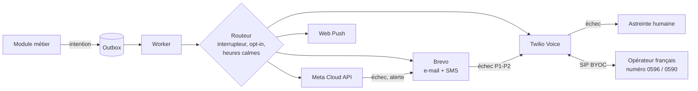
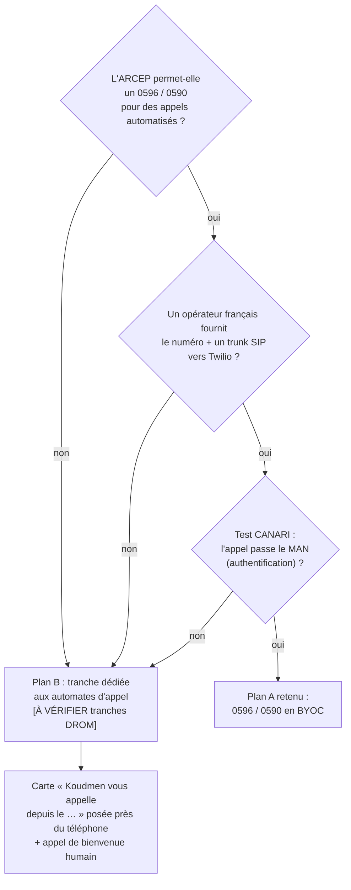

# ADR 0005 — Notifications et voix : WhatsApp Cloud API, SMS, e-mail, appel vocal « tapez 1 »

- **Statut :** proposé (2026-10-05). À valider par le fondateur.
- **Décideurs :** fondateur (orchestrateur), architecte.
- **Remplace :** ADR 0001 § 2 (« Notifications : Outbox, aucun envoi réel ») pour les environnements `staging` et `production`.
- **Sources :** `docs/05` § 3 (canaux), § 7.5 (cyclones) ; spécification V1 § 8 et § 9.

## 1. Contexte

- Le fondateur veut de **vraies notifications** et de **vrais appels** à l'aîné.
- Trois publics, trois canaux (`docs/05` § 1) :
  - la **famille** : WhatsApp, e-mail, push web ;
  - l'**aîné** : la **voix** sur son fixe ou son mobile simple ;
  - l'**accompagnant** : push web, puis SMS de secours.
- **Mode dégradé** obligatoire : sans données mobiles, le SMS et l'appel vocal passent encore.
- L'aîné décroche plus volontiers un **numéro local** (0596 en Martinique, 0590 en Guadeloupe). La peur des arnaques est forte.
- Règle R9 : **aucune donnée de santé** dans un message.

## 2. Décision

| Canal | Fournisseur V1 | Rôle |
|---|---|---|
| WhatsApp | **Meta WhatsApp Business Cloud API, en direct** (sans BSP) | Canal principal de la famille |
| E-mail | **Brevo** (France) | Comptes, paiements, décisions sur l'accompagnant (support durable) |
| SMS | **Brevo SMS** (France) ; **Twilio** en secours | OTP, repli, alertes P1-P2 |
| Voix (IVR) | **Twilio Programmable Voice** | Appel « tapez 1 », Kozé, consentement, ligne entrante |
| Numéro affiché | **Plan A :** 0596 / 0590 d'un opérateur français relié en SIP à Twilio (BYOC). **Plan B :** tranche ARCEP dédiée ou numéro 09 | Confiance de l'aîné |
| Push web | **Web Push (VAPID)**, sans fournisseur | Accompagnant et famille (PWA) |

Tout passe par la **passerelle de conversation** (spec § 8.1) : le métier émet une intention, l'Outbox l'enregistre dans la même transaction, le worker envoie, le routeur applique l'interrupteur de lancement.

## 3. Comparaison des fournisseurs

Tous les prix sont des **ordres de grandeur**. **[À VÉRIFIER sur devis et grille du jour]** avant tout engagement.

### 3.1 WhatsApp

| Critère | **Meta Cloud API direct** | 360dialog (BSP, Allemagne) | Twilio (BSP) | Brevo (campagnes WhatsApp) |
|---|---|---|---|---|
| Surcoût par message | **0** | Abonnement ~50 €/mois/numéro [À VÉRIFIER] | ~0,005 $ par message [À VÉRIFIER] | Surcoût, orienté marketing |
| Modèles utilitaires et authentification | Oui | Oui | Oui | Partiel |
| Webhook direct (statuts, réponses) | **Oui** | Oui | Oui | Limité |
| Support humain | Faible | **Bon** | Bon | Bon |
| Prix Meta, modèle utilitaire hors fenêtre de 24 h, +33 | ~0,05 $ [VÉRIFIÉ `docs/05` § 3.2] | Idem | Idem | Idem |
| Prix pour +596 / +590 | Grille de la France ou « autre » ? [À VÉRIFIER, spec § 19 Q7] | Idem | Idem | Idem |
| Verdict | **Choisi** | Repli si le support Meta bloque | Non | Non |

Points clés :
- Les messages utilitaires **dans** la fenêtre de 24 h ouverte par l'utilisateur sont **gratuits** (`docs/05` § 3.2). Le bouton « OK » sert à ouvrir cette fenêtre.
- Aucun modèle **marketing** en V1.
- Un numéro WhatsApp de l'API **ne peut pas** servir en même temps dans l'application WhatsApp Business. Il faut un numéro dédié.
- Tant que l'entreprise n'est pas vérifiée par Meta, l'envoi est plafonné (environ 250 destinataires par 24 h) [À VÉRIFIER].

### 3.2 SMS

| Critère | **Brevo SMS** | OVHcloud SMS | Twilio | Vonage | Opérateur local (Orange Caraïbe, SFR Caraïbe, Digicel) |
|---|---|---|---|---|---|
| Siège | **France** | **France** | États-Unis | Suède / États-Unis | DROM |
| SMS vers +33 6 | ~0,045 – 0,07 € | ~0,06 – 0,08 € | ~0,08 $ | ~0,07 – 0,09 € | Sur devis |
| SMS vers +596 696 / +590 690 | Inconnu | Inconnu | ~0,10 – 0,20 $ | Inconnu | Sur devis, souvent le meilleur taux de remise [À VÉRIFIER] |
| Émetteur « Koudmen » (alphanumérique) | Oui | Oui | Oui, peut être réécrit en DROM | Oui | Oui |
| API + webhook de remise | Oui | Oui | **Très bon** | Oui | Rarement une API moderne |
| Même outil que l'e-mail | **Oui** | Non | Non | Non | Non |
| Verdict | **Choisi** | Alternative | **Secours** (même compte que la voix) | Non | À étudier en V1.1 si la remise Brevo est mauvaise |

ATTENTION : un SMS « remis » en Hexagone ne prouve rien pour les DROM. **Test de remise réel vers 0696 et 0690 en `CANARI`**, sur les 3 opérateurs mobiles. Si le taux de remise est inférieur à 98 %, l'adaptateur `twilio` devient le premier choix pour ces indicatifs [À VÉRIFIER seuil].

### 3.3 Voix programmable (IVR « tapez 1 »)

| Critère | **Twilio Voice** | Vonage Voice API | Telnyx | Plivo | jambonz (open source) + trunk SIP | OVHcloud VoIP |
|---|---|---|---|---|---|---|
| Appel sortant par API | **Oui** | Oui | Oui | Oui | Oui (auto-hébergé) | Non [À VÉRIFIER] |
| DTMF (`<Gather>` ou équivalent) | **Très mûr** | Oui (NCCO `input`) | Oui (TeXML) | Oui | Oui | SVI configurable seulement |
| Détection de répondeur (AMD) | Oui | Oui | Oui | Oui | Module | Non |
| BYOC (numéro d'un autre opérateur via SIP) | **Oui** (BYOC Trunks) | Oui | Oui | Oui | **Natif** | Fournit le numéro et le trunk |
| Numéro 0596 / 0590 natif | Non confirmé | Non confirmé | Non confirmé | Non confirmé | Via l'opérateur | Numéros géographiques DOM [À VÉRIFIER] |
| Données | États-Unis (DPF), région UE partielle | UE / États-Unis | États-Unis, présence UE | États-Unis | **Hébergé chez nous (HDS)** | **France** |
| Appel vers la Martinique | ~0,05 – 0,30 $/min | ~0,05 – 0,30 €/min | Souvent moins cher [À VÉRIFIER] | Moins cher [À VÉRIFIER] | Prix du trunk | Prix du trunk |
| Effort pour une équipe de 2 | **Faible** | Faible | Faible | Faible | **Élevé** (ops VoIP) | Sans objet |
| Verdict | **Choisi V1** | Alternative (adaptateur `vonage`) | Alternative si coût | Non | **Cible V2** (souveraineté) | **Fournisseur du numéro** (Plan A) |

Pourquoi Twilio malgré le siège américain :
1. L'IVR est **critique** (preuve de visite). La maturité compte plus que le prix en V1.
2. Les données transmises sont **minimales** : numéro de l'aîné, touche tapée. Aucun nom, aucun Kayé dans l'appel.
3. Le `VoicePort` permet de passer à Vonage ou jambonz sans toucher au métier.

### 3.4 Numéro local 0596 / 0590 et cadre ARCEP

- ATTENTION : l'ARCEP a créé des **tranches dédiées aux systèmes automatisés d'appel** (décision 2022-1583) [À VÉRIFIER : application aux appels de service, tranches des DROM].
- ATTENTION : le **MAN** (mécanisme d'authentification des numéros) coupe un appel dont le numéro français n'est pas authentifié par l'opérateur d'origine. Un appel Twilio international qui affiche un 0596 peut être bloqué. Le BYOC passe par l'opérateur français, qui authentifie [À VÉRIFIER].
- Le même numéro reçoit les appels **entrants** de l'aîné (ligne vers l'astreinte).
- Commande du numéro : **après** la réponse de l'opérateur et de l'avocat (plan, compte F7).

## 4. Règles de mise en œuvre

1. Chaque canal a un adaptateur **simulé** par défaut (`ADAPTER_* = simule`). L'équipe avance sans clés.
2. Webhooks : signature vérifiée (`X-Hub-Signature-256` pour Meta, `X-Twilio-Signature`, secret Brevo), idempotence par identifiant du fournisseur.
3. Appels de l'aîné : 8 h – 20 h **heure de l'aîné** ; 3 essais au plus ; pas de message sur un répondeur.
4. Messages vocaux **pré-enregistrés** par des voix locales (français, créole martiniquais, créole guadeloupéen). Pas de synthèse vocale en V1.
5. SMS en alphabet GSM-7 (160 caractères). Le module remplace les lettres qui forcent l'UCS-2.
6. Les modèles WhatsApp sont versionnés dans le code (`whatsappTemplateName`, langue) et soumis à Meta avant usage.
7. Heures calmes 21 h – 8 h **dans le fuseau du destinataire**, sauf incidents P1-P2.
8. En `CANARI`, le routeur bloque tout destinataire hors liste blanche.

## 5. Coûts mensuels estimés (cible M12 : 2 000 visites, 300 aînés)

| Poste | Hypothèse | Coût [À VÉRIFIER] |
|---|---|---|
| Voix : confirmations | 2 000 × 1,3 appel × 0,05 – 0,30 $ | 130 – 780 $ |
| Voix : Kozé | 300 aînés × 4,3 appels × 0,05 – 0,30 $ | 65 – 390 $ |
| Numéros locaux + trunk | 2 numéros (MQ, GP) | 10 – 40 € |
| WhatsApp | Majorité dans la fenêtre gratuite | 20 – 80 $ |
| SMS | 1 500 SMS (OTP, repli) × 0,05 – 0,20 € | 75 – 300 € |
| E-mail Brevo | < 20 000 e-mails | 0 – 25 € |
| **Total** | | **~300 à 1 600 € par mois** |

## 6. Conséquences

### Positives
- L'aîné reste **acteur** : il confirme sa visite lui-même.
- Repli complet sans données mobiles (SMS + voix), base du futur mode cyclone.
- Fournisseurs remplaçables grâce aux ports.

### Négatives (acceptées)
- Twilio est un sous-traitant américain (DPF + clauses types). Les données transmises restent minimales. Cible V2 : jambonz hébergé en HDS.
- Le numéro local n'est **pas garanti**. Le plan B demande plus d'information de l'aîné.
- Quatre fournisseurs à suivre (Meta, Brevo, Twilio, opérateur du numéro).

## 7. Options écartées

| Option | Raison |
|---|---|
| BSP WhatsApp dès la V1 | Surcoût sans gain fonctionnel |
| SMS seulement, pas de WhatsApp | Coût plus élevé, pas de lien riche, pas de bouton « OK » |
| Synthèse vocale (TTS) | Voix étrangère, pas de créole fiable, données envoyées à un tiers |
| Reconnaissance vocale (ASR) « dites oui » | Créole non couvert (`docs/05` § 5.3). DTMF plus fiable |
| Appel manuel par un opérateur après chaque visite | Ne passe pas à l'échelle. Gardé pour le consentement |
