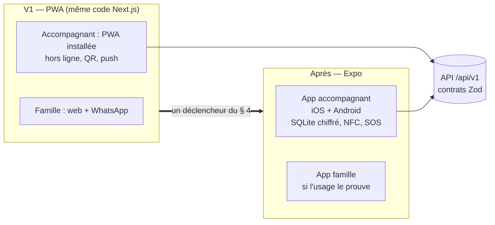

# ADR 0006 — Web mobile installable (PWA) d'abord, puis app Expo / React Native

- **Statut :** **remplacé par l'ADR 0008** (2026-10-05). L'app Expo accompagnant démarre maintenant ; la PWA devient légère (pas de file hors ligne web). Voir `0008-approche-web-et-mobile.md`.
- **Décideurs :** fondateur (décision 5 : « web mobile installable puis app iOS/Android »), architecte.
- **Précise :** `docs/05` § 3.5 (« app accompagnant obligatoire », « pas d'app famille au MVP »).
- **Sources :** spécification V1 § 10 et § 11, ADR 0001.

## 1. Contexte

- `docs/05` demande une app accompagnant **hors ligne** (check-in, Kayé, SOS).
- Le MVP de test est une application **web** Next.js. Elle marche déjà sur un téléphone.
- Le fondateur veut : **web mobile installable d'abord**, puis une app iOS et Android.
- L'équipe est petite. Deux bases de code d'interface en même temps ralentissent tout.
- Les capacités web ont progressé : push web sur iOS 16.4+ (après installation), service worker, IndexedDB, caméra.

## 2. Décision

1. **V1 : PWA** (Progressive Web App) sur le même code Next.js.
   - Installable (manifeste, icônes, `display: standalone`).
   - Push web (VAPID).
   - Hors ligne pour l'accompagnant : visites des 7 prochains jours, check-in, preuve par QR code, check-out, brouillon de Kayé. File d'événements synchronisée.
   - Service worker avec **Serwist** (successeur de `next-pwa`).
2. **Après la PWA : app Expo / React Native**, d'abord pour l'**accompagnant**. L'app famille vient seulement si l'usage le prouve.
3. **Dès la V1**, on prépare Expo sans coût : API `/api/v1` versionnée, domaine pur partageable, `PushPort` qui accepte un jeton Expo, authentification par jeton prête.

## 3. Pourquoi la PWA d'abord

| Critère | **PWA** | Expo dès la V1 | Capacitor (web dans une coque native) |
|---|---|---|---|
| Base de code | **Une seule** | Deux (web + mobile) | Une, mais coque native à maintenir |
| Délai pour la première version | **Semaines** | Mois | Semaines |
| Comptes Apple / Google | **Inutiles** | Obligatoires (D-U-N-S, revue) | Obligatoires |
| Mise à jour | **Immédiate** | OTA (EAS Update) + revue des stores | Revue des stores |
| Push iOS | Oui, **seulement après installation** (16.4+) | Oui, fiable | Oui |
| Hors ligne | Bon (IndexedDB) ; pas de Background Sync sur iOS | **Très bon** (SQLite) | Bon |
| NFC | Android Chrome seulement | **Oui** | Oui (plugin) |
| Arrière-plan (minuteur, SOS) | Faible | **Bon** | Bon |
| Verdict | **V1** | **Après la PWA** | Écarté : on paierait le coût des stores sans gagner en qualité |

## 4. Quand passer à Expo

On démarre l'app Expo dès qu'**un** déclencheur est vrai (spec § 11.1) :

| Déclencheur | Mesure |
|---|---|
| Push iOS insuffisant | Moins de 60 % des accompagnants iOS ont installé la PWA [À VÉRIFIER seuil] |
| Hors ligne insuffisant | Plus de 5 % des visites en `A_VERIFIER` à cause d'une synchronisation tardive |
| Besoin du NFC | Décision de passer aux tags NFC |
| Fiabilité en arrière-plan | SOS et minuteur de visite exigent une app native |
| Exigence d'un partenaire | CTM, mutuelle ou SAAD demande une app des stores |
| **Décision du fondateur** | Le fondateur veut l'app pour le pilote (décision 5) |

Le plan (`plan-v1.md`) prévoit les sprints Expo **après** le passage en `CANARI`. Le fondateur crée les comptes Apple et Google **tôt**, car leurs délais sont longs (D-U-N-S).

## 5. Règles pour la PWA

1. Le cache hors ligne garde **le minimum** : prénom de l'aîné, commune, horaires, consignes d'accès. Jamais le Kayé passé, jamais un téléphone. Effacé à la déconnexion.
2. Chaque événement hors ligne a un `clientEventId` (UUID). Le serveur ignore un doublon.
3. Le serveur garde l'heure de l'appareil et l'heure de réception. Un écart de plus de 12 h passe la visite en `A_VERIFIER` [À VÉRIFIER seuil].
4. L'invite d'installation apparaît **après** une action réussie, jamais à l'arrivée. Sur iOS, un écran montre les 3 gestes.
5. La notification push suit R9 : titre générique + lien.
6. En `demo`, le service worker ne met en cache **aucune** réponse d'API. Il garde seulement les fichiers statiques. Deux testeurs sur un même appareil ne voient donc pas les données de l'autre.

## 6. Règles pour Expo (plus tard)

1. Monorepo pnpm : `apps/web`, `apps/mobile`, `packages/domain`, `packages/api-client`.
2. Expo Router, base locale chiffrée (SQLCipher), mise à jour OTA par EAS Update.
3. Les services Expo (EAS Build, Expo Push) sont aux États-Unis : **aucune donnée personnelle** dans les builds et les notifications.
4. Authentification : jeton d'accès de 15 min + jeton de renouvellement de 30 jours, avec rotation.

## 7. Conséquences

### Positives
- Une seule base de code pour la V1. Livraison plus rapide.
- Aucun compte des stores bloquant pour le lancement.
- L'API `/api/v1` sert déjà la PWA hors ligne : le travail n'est pas perdu pour Expo.

### Négatives (acceptées)
- Push iOS seulement après installation. Il faut **accompagner** l'installation (formation de l'accompagnant).
- Pas de synchronisation en arrière-plan sur iOS : la file part à la réouverture.
- Pas de NFC sur iPhone. La preuve par QR code le remplace.
