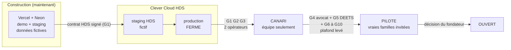
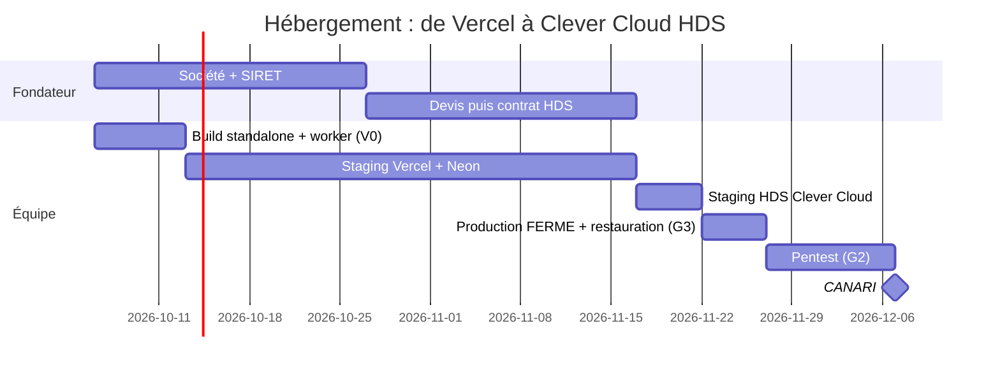

# ADR 0007 — Hébergement : Vercel + Neon pour construire, Clever Cloud HDS avant toute donnée réelle

- **Statut :** proposé (2026-10-05). À valider par le fondateur.
- **Décideurs :** fondateur (orchestrateur), architecte.
- **Remplace :** ADR 0001 § 5 points 1 et 2 (« NestJS avant le pilote »). **Confirme :** `docs/05` § 2.3 (hébergeur certifié HDS).
- **Sources :** `docs/05` § 2.3, § 7 ; revue S1 juridique P4 ; spécification V1 § 3 et § 12.

## 1. Contexte

- Le MVP de test tourne sur **Vercel + Neon** (ADR 0001). Ces services **ne sont pas certifiés HDS**.
- Le Kayé et les incidents contiennent des **données de santé** (art. 9 RGPD). Leur hébergement pour notre compte exige un hébergeur **certifié HDS** (art. L1111-8 CSP, `docs/05` § 2.3).
- Le fondateur veut construire la V1 **maintenant**, en parallèle de la validation juridique.
- L'ouverture aux vraies familles vient **seulement après** : avis de l'avocat, réponse de la DEETS, hébergement HDS.

## 2. Décision

1. **Pendant la construction** : `demo` et `staging` restent sur **Vercel + Neon**, avec des **données fictives seulement**.
2. **Avant toute donnée réelle** : `production` (et un `staging` HDS) sur **Clever Cloud**, offre **HDS**, région Paris.
3. **Monolithe modulaire** : une application Next.js (`standalone`) + un **worker** (pg-boss) dans le même dépôt. Pas de NestJS en V1, pas de micro-service.
4. **Trois verrous** empêchent une donnée réelle hors HDS :
   - **Verrou 1 — code** : `config-check.ts` refuse `KOUDMEN_ENV=production` si `VERCEL` existe ou si `HOSTING_PROVIDER` ≠ `clever-cloud-hds`.
   - **Verrou 2 — interrupteur de lancement** : `production` démarre en `FERME`. La porte G1 (contrat HDS signé) est requise pour `CANARI`.
   - **Verrou 3 — plafond** : `LAUNCH_MAX_STATE` (variable du serveur) plafonne l'état. Il reste à `CANARI` tant que l'avocat et la DEETS n'ont pas répondu.

## 3. Pourquoi Clever Cloud

| Critère | **Clever Cloud** | Scaleway | OVHcloud | Outscale | AWS / Azure / GCP (régions FR) |
|---|---|---|---|---|---|
| Certification HDS | **Oui** (6 activités, 2024) [VÉRIFIÉ `docs/05`] | Oui | Oui | Oui + SecNumCloud | Oui |
| Modèle | **PaaS** (`git push`) | IaaS + quelques services managés | IaaS | IaaS | IaaS / PaaS |
| PostgreSQL managé éligible HDS | **Oui** [VÉRIFIÉ `docs/05`] | Oui | Oui | À monter soi-même | Oui |
| Effort d'exploitation pour 2 personnes | **Faible** | Moyen | Élevé | Élevé | Moyen |
| Société | France | France | France | France | États-Unis (CLOUD Act) |
| Prix HDS | Sur devis [À VÉRIFIER] | Public, plus bas | Bas | Élevé | Variable |
| Verdict | **Choisi** | Alternative complète (et IA en V2) | Option si SecNumCloud exigé | Surdimensionné | Rejeté (souveraineté) |

Neon et Vercel ne proposent **pas** d'HDS. Ils restent pour la démo, avec des données fictives (DPA signé).

## 4. Quand migrer

La migration se fait **tôt**, **sans donnée réelle**. Il n'y a rien à migrer : la base de démo **ne part jamais** en production.

| Étape | Quand | Qui | Preuve |
|---|---|---|---|
| Demande de devis HDS Clever Cloud | **Semaine 1** (dès la société créée) | Fondateur | Devis |
| Build `standalone` + worker double mode | Sprint V0 | Architecte | CI verte |
| `staging` HDS (fictif) | Dès le compte Clever Cloud ouvert | dev-integrations | URL staging, e2e verts |
| Contrat HDS signé (annexe HDS + DPA) | Avant `CANARI` | Fondateur | **Porte G1** |
| `production` créée en `FERME` | Après G1 | Architecte | `launch.state_changed` absent |
| Restauration de sauvegarde testée | Avant `CANARI` | ingenieur-qualite | **Porte G3** |
| Pentest externe | Avant `CANARI` | Prestataire PASSI | **Porte G2** |
| Passage en `CANARI` | Après G1 + G2 + G3 | 2 opérateurs | Audit |

Dates indicatives [À VÉRIFIER : délai de la société et du contrat HDS].

## 5. Comment migrer

1. Ajouter `output: "standalone"` dans `next.config.ts`. Garder le build Vercel (`scripts/vercel-build.mjs`) pour la démo.
2. Créer le point d'entrée du worker : `pnpm worker` (processus permanent, pg-boss).
3. Sur Vercel, le même code de tâches tourne par une route `/api/cron/worker-tick` appelée chaque minute (`JOB_RUNNER=cron-tick`).
4. Sur Clever Cloud : une application Node « web » (2 instances), une application Node « worker » (1 instance), un PostgreSQL HDS, un stockage objet (Cellar si couvert par l'HDS, sinon Scaleway HDS) [À VÉRIFIER].
5. Migrations : `prisma migrate deploy` au démarrage, avec un verrou consultatif PostgreSQL.
6. Secrets : variables chiffrées de Clever Cloud. Clés de chiffrement des champs versionnées. Aucun secret dans le dépôt.
7. Sauvegardes quotidiennes chiffrées, 30 jours, copie dans une 2e région HDS [À VÉRIFIER offre].
8. Domaines : `demo.koudmen.fr` (Vercel), `staging.koudmen.fr` et `app.koudmen.fr` (Clever Cloud) [À VÉRIFIER domaine].
9. Comptes opérateurs recréés à la main en production (`pnpm ops:create-operator`), avec TOTP.

## 6. L'interrupteur de lancement (rappel)

Détail : spécification V1 § 3.3. Résumé :

| État | Qui entre | Porte requise | Plafond `LAUNCH_MAX_STATE` |
|---|---|---|---|
| `FERME` | Opérateurs | — | Valeur par défaut |
| `CANARI` | Équipe (liste blanche) | G1 HDS, G2 pentest, G3 restauration | `CANARI` pendant l'attente juridique |
| `PILOTE` | Familles invitées | G4 avocat, G5 DEETS, G6 RGPD, G7 documents, G8 médiateur + RC, G9 prix loyaux, G10 astreinte | Levé par le fondateur, après les feux verts |
| `OUVERT` | Tous | Décision du fondateur | `OUVERT` |

DANGER : ne lève **jamais** le plafond `LAUNCH_MAX_STATE` au-dessus de `CANARI` avant l'avis écrit de l'avocat et la réponse de la DEETS. Une vraie famille sans cadre juridique validé expose l'aîné et Koudmen.

## 7. Conséquences

### Positives
- L'équipe construit vite sur Vercel, sans attendre le contrat HDS.
- La pile HDS est **répétée** sur `staging` avant toute donnée réelle.
- Trois verrous indépendants : code, interrupteur, plafond.

### Négatives (acceptées)
- Deux hébergeurs à suivre pendant la construction.
- Le worker a deux déclencheurs (cron à la minute sur Vercel, processus permanent sur Clever Cloud). Le code de traitement reste unique.
- Coût HDS dès le staging HDS : ~300 à 1 200 € par mois [À VÉRIFIER devis].

## 8. Quand revoir

- Plus de 5 développeurs, ou API mobile devenue le canal principal : réévaluer un back-end séparé (NestJS).
- Un client exige SecNumCloud : étudier OVHcloud ou Outscale.
- Coût d'infrastructure supérieur à 3 k€ par mois (`docs/05` § 2.1).
