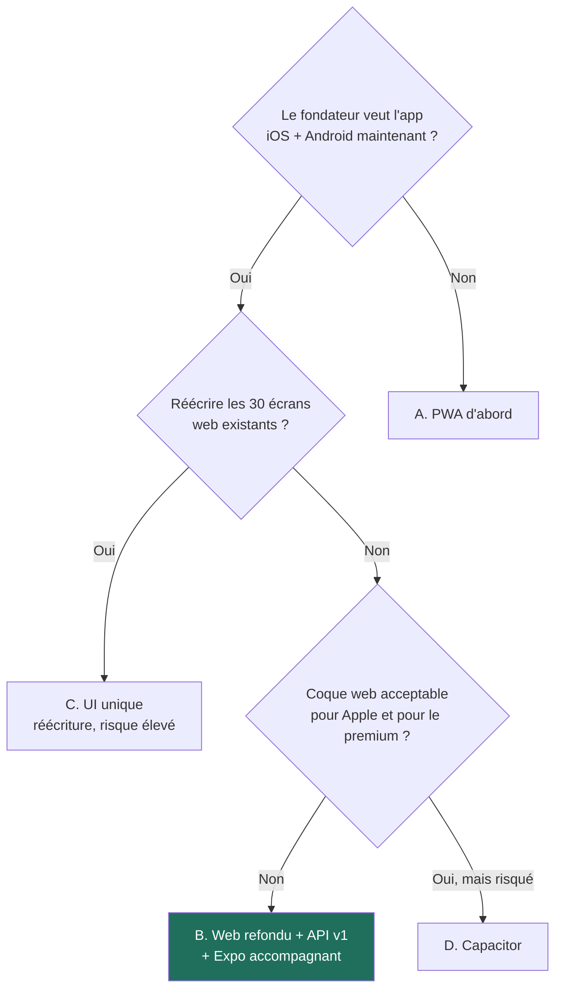
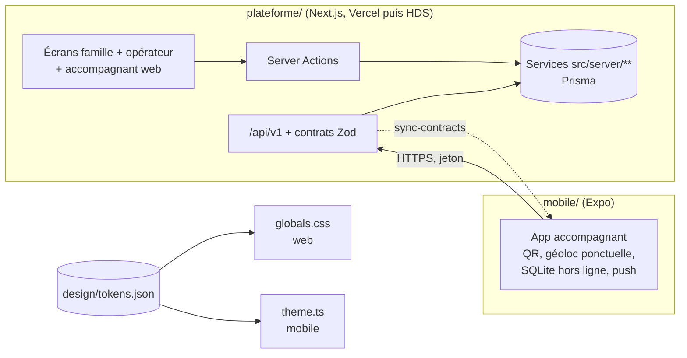
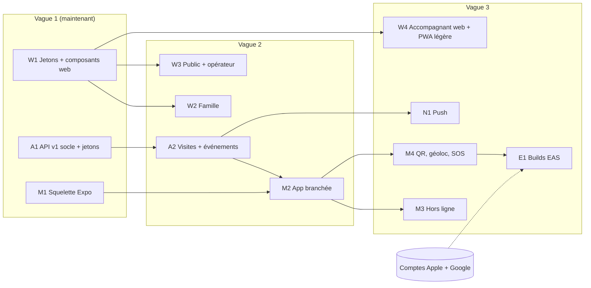

# ADR 0008 — Web refondu pour la famille, app Expo native pour l'accompagnant, en parallèle dès maintenant

- **Statut :** proposé (2026-10-05). À valider par le fondateur.
- **Décideurs :** fondateur (orchestrateur), architecte.
- **Remplace :** ADR 0006 (« PWA d'abord, puis Expo »).
- **Sources :** `docs/tech/plan-v1.md` (sprints D, V2 lot P, E1 à E3), `docs/tech/specification-v1-conso.md` § 10 et § 11, `docs/design/direction-artistique.md`, `site/maquette-conso.html`, ADR 0001, ADR 0007.

## 1. Contexte

- Le MVP est une application **Next.js full-stack** (`plateforme/`) : ~30 écrans, Prisma/Postgres, **Server Actions**, déployée sur Vercel. Il n'existe **pas encore** de route `/api/v1`.
- Le fondateur a validé un nouveau design. Il veut **maintenant** l'interface web **et** une app iOS + Android.
- Les comptes réels (Stripe, Twilio, Meta, Apple, Google) viennent plus tard.
- L'équipe : des agents IA en parallèle. Ils sont souvent coupés par les limites d'usage. Il faut des **lots courts**, des **fichiers séparés** et des **commits fréquents**.
- La sandbox n'a **pas de simulateur** iOS ni Android. On peut :
  - construire Expo pour le **web** (`expo export -p web`) et le tester avec **Playwright** ;
  - produire des builds **EAS** plus tard (comptes requis).
- Besoins natifs connus : notifications push, géolocalisation **ponctuelle** (au check-in seulement), scan QR (NFC plus tard), **hors ligne** pour l'accompagnant.

## 2. Options comparées

| Critère | **A.** Web + PWA, Expo plus tard | **B.** Web refondu + API v1 + Expo en parallèle | **C.** Une seule UI (Expo + react-native-web, ou Solito/Tamagui) | **D.** Web + coque Capacitor |
|---|---|---|---|---|
| Vite beau et testable sur téléphone | **Très vite** (navigateur) | Vite (web tout de suite ; Expo Go / web export pour l'app) | Lent : on réécrit 30 écrans d'abord | Vite |
| Qualité perçue (premium) | Bonne sur le web ; app « site » sur iOS | **Très bonne** : natif où ça compte | Moyenne sur le web (rendu RN-web, SEO faible) | Moyenne : sensation de site |
| Maintenance à 1 an | Simple, mais l'app native reste à faire | Deux UI, mais **un seul domaine + un seul contrat API** | Une UI, mais pile rare et fragile (Next + RN-web) | Coque + plugins à suivre |
| Stores (Apple 4.2 « minimum functionality » [À VÉRIFIER libellé exact]) | Rien à publier | **Sûr** : app native réelle | Sûr | **Risque de refus** si l'app n'apporte rien de plus que le site |
| Réutilisation de l'existant | **Totale** | Totale côté web ; serveur réutilisé par l'API | **Faible** : réécriture de l'interface | Totale |
| Push, géoloc ponctuelle, QR, hors ligne | Push iOS seulement après installation ; pas de NFC iOS ; pas d'arrière-plan | **Tout** (Expo Notifications, expo-location, expo-camera, SQLite) | Tout | La plupart, par plugins |
| Coût [À VÉRIFIER] | ~10 j-agent (PWA) **+ 25 j-agent** (Expo ensuite) | **~30 j-agent** au total, sans travail jeté | ~45 j-agent | ~12 j-agent + reprises après refus |
| Risque | Travail PWA hors ligne **jeté** quand Expo arrive | Coordination de deux UI | Réécriture, régressions, SSR et SEO | Refus Apple, qualité |

## 3. Décision

**Option B, avec un périmètre limité.**

1. **Web (Next.js, `plateforme/`)** : on applique le nouveau design à **tous** les écrans. La **famille** et l'**opérateur** restent sur le web.
   - PWA **légère** seulement : manifeste, icônes, invite d'installation. **Pas** de file hors ligne web.
2. **App Expo (`mobile/`)** : une app native **« Koudmen »**, d'abord pour l'**accompagnant**.
   - Expo Router, SDK Expo stable du moment [À VÉRIFIER version].
   - Visites, check-in avec QR et géolocalisation **ponctuelle**, check-out, brouillon de Kayé, SOS, push, **hors ligne** (SQLite).
   - Un espace **famille** dans la même app vient plus tard (groupe de routes `(famille)`), si l'usage le prouve.
3. **Contrat unique** : routes `/api/v1` dans `plateforme/`, schémas **Zod** dans `plateforme/src/contracts/v1/**`.
   - Les Server Actions du web **restent**. L'API v1 appelle les **mêmes services** dans `src/server/**`.
   - L'app copie les contrats par un script (`mobile/scripts/sync-contracts.mjs`) dans `mobile/src/contracts/` (fichiers générés, en lecture seule). Une vérification en CI refuse un écart.
4. **Jetons de design uniques** : `design/tokens.json` à la racine du dépôt. Un script produit les variables CSS (web) et le thème TypeScript (mobile).
5. **Pas de migration en monorepo maintenant.** `plateforme/` ne bouge pas (Vercel garde son dossier racine). On reconsidère pnpm workspaces quand le partage dépasse les contrats et les jetons.
6. **Tests sans simulateur** : l'app est testée en **export web** + Playwright (390 px). Les tests natifs (caméra, push, NFC) se font plus tard sur des builds EAS **internes**, sur de vrais téléphones.

## 4. Règles

1. **Anti-requalification** (directive UE 2024/2831), identiques sur web et app :
   - pas de géolocalisation **continue** : une seule lecture au check-in et au check-out, avec l'accord de l'accompagnant ; jamais en arrière-plan ;
   - refus d'une mission sans pénalité ; tarif fixé par l'accompagnant ; avis non sanctionnants.
2. **RGPD** : la base locale de l'app garde **le minimum** (prénom de l'aîné, commune, horaires, consignes d'accès). Jamais le Kayé passé, jamais un téléphone. Base **chiffrée** [À VÉRIFIER : SQLCipher via `expo-sqlite` ou clé dans `expo-secure-store`]. Effacement à la déconnexion.
3. **Services Expo aux États-Unis** (EAS Build, Expo Push) : **aucune** donnée personnelle dans les builds ni dans le texte des notifications (titre générique + lien, R9).
4. **Hors ligne** : chaque événement a un `clientEventId` (UUID). Le serveur ignore un doublon. Le serveur garde l'heure de l'appareil et l'heure de réception (écart > 12 h → `A_VERIFIER`).
5. **Authentification de l'app** : jeton d'accès 15 min + jeton de renouvellement 30 jours, avec rotation, stocké dans `expo-secure-store`. Le web garde le cookie de session (ADR 0002).
6. **Mode dégradé** inchangé : SMS et appel vocal si l'accompagnant n'a pas de données mobiles.
7. **Propriété des fichiers** : un lot ne modifie **que** ses fichiers (§ 6). Un commit au moins toutes les 30 à 45 min de travail.

## 5. Conséquences

### Positives
- Le fondateur voit **tout de suite** un web beau (famille) et une app réelle (accompagnant).
- Aucun travail jeté : on **ne construit pas** la file hors ligne PWA (le lot P de `plan-v1.md` est réduit).
- Publication stores **sûre** : l'app utilise caméra, push, hors ligne et géolocalisation ponctuelle.
- Le domaine et les règles restent **à un seul endroit** (`src/server/**`).

### Négatives (acceptées)
- Deux interfaces à tenir (web et mobile) pour l'accompagnant. Mitigation : l'espace accompagnant web devient **secondaire** (consultation, profil, tarifs).
- Aucun test natif réel avant les comptes Apple et Google. Le risque reste sur la caméra, le push et le stockage chiffré.
- La copie des contrats est un mécanisme simple mais manuel. On passe à un paquet partagé si elle devient pénible.

### À mettre à jour
- `plan-v1.md` : sprint D et lots M remplacent le lot P (PWA lourde) et avancent E1 à E3 avant `CANARI`.
- `docs/tech/lots.md` : ajouter les propriétaires du § 6.

## 6. Découpage en lots courts

Chaque lot dure **0,5 à 2 j-agent** [À VÉRIFIER]. Chaque lot a un **propriétaire de fichiers** exclusif et un **critère de fin** testable dans la sandbox.

### Vague 1 — à lancer maintenant (en parallèle)

| Lot | Agent | Possède (seul à modifier) | Contenu | Critère de fin |
|---|---|---|---|---|
| **W1 — Jetons et composants web** | `dev-frontend` #1 | `design/tokens.json`, `design/scripts/**`, `plateforme/src/app/globals.css`, `plateforme/src/components/ui/**`, `plateforme/src/app/layout.tsx` (polices) | Jetons § 3.1, polices § 4, composants § 10 : `Button`, `Card`, `StatusCard`, `KayeCard`, `VisitReceipt`, `ProofBadge`, `Avatar`, `BottomNav`, `ActionDock`, `EmptyState`, `PlanRadio`. Thème clair/sombre. | `pnpm typecheck`, `lint`, `test` et `build:local` passent. Page `/tester/design` (démo des composants) en capture Playwright 390 px, clair et sombre. Écrans existants toujours fonctionnels (e2e verts). |
| **A1 — API v1 : socle et authentification par jeton** | `dev-backend` | `plateforme/src/contracts/v1/**`, `plateforme/src/app/api/v1/**`, `plateforme/src/server/auth/token*.ts`, `plateforme/prisma/migrations/<nouvelle>` (table `RefreshToken` seulement) | Contrats Zod + routes : `POST /auth/code`, `POST /auth/token`, `POST /auth/refresh`, `POST /auth/logout`, `GET /me`. Erreurs au format unique. Limite de débit (règles existantes). | Tests Vitest des contrats + test e2e API sur le seed de démo (connexion accompagnant → `GET /me` → rotation → déconnexion). Aucune donnée de santé dans `/me`. |
| **M1 — Squelette Expo** | `dev-mobile` | `mobile/**` (sauf `mobile/src/contracts/**`, généré) | Projet Expo + Expo Router, TypeScript strict. Thème issu de `design/tokens.json` (lecture seule). Onglets accompagnant (Visites, Kayé, Profil) avec données **simulées**. Écran de connexion (maquette). `mobile/e2e/` Playwright sur l'export web. | `npx expo export -p web` réussit. Playwright 390 px : connexion simulée → liste de visites → fiche visite. `tsc --noEmit` passe. README `mobile/` : lancer avec Expo Go. |

### Vague 2 — dès que W1 et A1 sont fusionnés

| Lot | Agent | Possède | Contenu | Critère de fin |
|---|---|---|---|---|
| **W2 — Écrans famille** | `dev-frontend` #1 | `plateforme/src/app/(famille)/**` (présentation), `plateforme/src/components/famille/**` | Refonte contre `site/maquette-conso.html` | e2e famille verts ; captures 390 px clair/sombre comparées à la maquette |
| **W3 — Écrans publics, compte, opérateur** | `dev-frontend` #2 | `plateforme/src/app/(public)/**`, `(operateur)/**`, `invitation/**`, `proche-aidant/**`, `tester/**` (présentation), `components/{operateur,legal,feedback,sandbox,layout}/**` | Refonte | e2e verts ; captures 390 px et 1280 px |
| **A2 — API v1 : visites et événements** | `dev-backend` | `contracts/v1/visits*`, `api/v1/visites/**`, `api/v1/evenements/**` | `GET /visites?jours=7`, `POST /evenements` (lot idempotent par `clientEventId` : check-in avec QR + position ponctuelle facultative, check-out, brouillon de Kayé, SOS) | Tests : doublon ignoré, écart d'horloge > 12 h → `A_VERIFIER`, refus sans pénalité |
| **M2 — App : connexion et visites réelles** | `dev-mobile` | `mobile/app/**`, `mobile/src/api/**`, `mobile/scripts/sync-contracts.mjs` | Branche l'app sur A1/A2 (demo Vercel) ; jetons dans `expo-secure-store` | Playwright sur l'export web contre la base de démo locale |

### Vague 3 — fonctions natives et finitions

| Lot | Agent | Possède | Contenu | Critère de fin |
|---|---|---|---|---|
| **M3 — Hors ligne** | `dev-mobile` | `mobile/src/offline/**` | SQLite chiffrée, file d'événements, synchronisation à la réouverture et au retour du réseau | Tests unitaires de la file (doublons, ordre, purge à la déconnexion) |
| **M4 — QR, géoloc ponctuelle, SOS** | `dev-mobile` #2 | `mobile/src/native/**`, `mobile/app/visite/**` | `expo-camera` (QR), `expo-location` (une lecture, permission « pendant l'utilisation »), bouton SOS | Tests avec adaptateurs simulés ; essai réel au premier build EAS |
| **N1 — Push** | `dev-integrations` | `plateforme/src/server/notifications/push/**`, `mobile/src/push/**` | `PushPort` : adaptateur Expo (jeton) + adaptateur « console » sans clé | Notification visible dans les journaux en `demo` ; texte générique (R9) |
| **W4 — Accompagnant web + PWA légère** | `dev-frontend` #2 | `plateforme/src/app/(accompagnant)/**`, `components/accompagnant/**`, `src/app/manifest.ts`, `public/icons/**` | Refonte ; manifeste ; invite d'installation après une action réussie | Lighthouse « installable » ; e2e verts |
| **E1 — Builds EAS internes** | `dev-mobile` | `mobile/eas.json`, `mobile/app.config.ts` | Builds de test (TestFlight, piste interne Google Play) | Bloqué par les comptes Apple et Google (`plan-v1.md` § 5.3, A1 à A3) |

### Règles de parallélisme

1. Vague 1 : **aucun fichier commun** entre W1, A1 et M1. M1 lit `design/tokens.json` mais ne l'écrit pas.
2. Si W1 n'a pas encore créé `design/tokens.json`, M1 utilise un thème provisoire dans `mobile/src/theme/` et le remplace ensuite.
3. Un lot coupé reprend depuis son **dernier commit** et la case à cocher de son README de lot (`docs/tech/lots.md`).
4. Pendant W2 à W4, la règle de **gel des écrans** de `plan-v1.md` § 3 (sprint D) s'applique.
