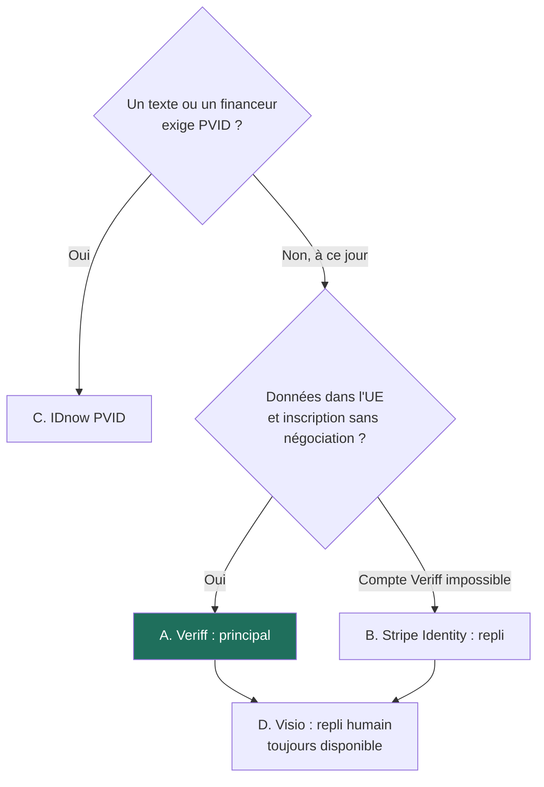
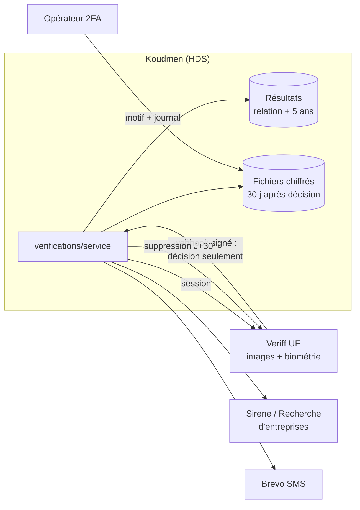

# ADR 0009 — Vérification de l'accompagnant : Veriff pour l'identité, registre public pour l'entreprise, Brevo pour le téléphone, revue humaine pour le reste

- **Statut :** proposé (2026-10-08). À valider par le fondateur.
- **Décideurs :** fondateur (orchestrateur), architecte.
- **Modifie :** `docs/tech/specification-v1-conso.md` § 6.1 (« V1 : vérification humaine en visio ») et § 18.1 (adaptateurs). **Confirme :** la règle « jamais de copie de la pièce d'identité ni du B3 ».
- **Étude complète :** `docs/tech/L2-verification-identite.md`.
- **Sources :** `docs/08` § 3.4 et § 4 ; revues L1 (L2, R6, J1, J6, J29) ; ADR 0004, 0005, 0007, 0008.

## 1. Contexte

- L'inscription accompagnant est ouverte (L1, décision L2). L'opérateur valide le compte à la main, avec le flux `VerificationItem`.
- La V1 vérifie l'identité par **visio** de 20 minutes. Cette méthode ne passe pas à l'échelle : 1 000 accompagnants = environ 70 h de visio par mois.
- Le fondateur veut un **vrai système** avant la validation définitive :
  - pro : Kbis et SIREN ;
  - non-pro : pièce d'identité, justificatif d'adresse, téléphone ;
  - identité vérifiée **automatiquement** par un service reconnu ;
  - adresse automatique si possible, sinon revue par la plateforme ;
  - téléphone vérifié automatiquement.
- Contraintes : RGPD (art. 9 biométrie, art. 10 condamnations, art. 22 décision automatique), HDS en production (ADR 0007), Expo Go pour tester l'app (ADR 0008), petite équipe, petit budget.

## 2. Options comparées (identité)

| Critère | **A. Veriff** | **B. Stripe Identity** | **C. IDnow (PVID)** | **D. Visio seule (V1)** | **E. France Identité / FranceConnect+** |
|---|---|---|---|---|---|
| Automatique | Oui | Oui | Oui | Non | Oui |
| Certifié PVID ANSSI | Non | Non | **Oui** | Non | Identité d'État |
| Société / données | **UE** | États-Unis (DPA, DPF) | UE | Koudmen | État |
| Mise en place | **1 à 3 jours**, en ligne | **1 jour** (compte existant) | 4 à 10 semaines, contrat | Déjà là | Accès **réservé** [À VÉRIFIER] |
| Prix par contrôle | ~0,75 à 1,30 € + minimum ~45 €/mois | ~1,25 à 1,50 €, sans minimum | ~2 à 4 € [À VÉRIFIER] | ~20 min d'opérateur | Gratuit |
| Expo Go | Oui (lien web) | Oui (lien web) | Oui (lien web) | Oui | Oui (redirection) |
| Couverture des accompagnants | Large | Large | Large | Totale | **Faible** (nouvelle CNI + mairie) |

## 3. Décision

1. **Identité : Veriff**, parcours **web hébergé**, ouvert par `expo-web-browser` dans l'app. Pas de SDK natif en V1.1.
2. **Repli technique : Stripe Identity**, activé par `ADAPTER_IDENTITY=stripe`, sur décision humaine. Pas de bascule automatique.
3. **Repli humain : la visio opérateur** reste disponible pour chaque dossier (« Je préfère une visio »). Elle est aussi l'alternative pour une personne qui refuse la biométrie.
4. **Option PVID : IDnow**, seulement si l'avocat (porte G4) ou un financeur l'exige.
5. **Entreprise :** API Recherche d'entreprises (sans clé) + API Sirene INSEE (clé gratuite). Contrôles : actif, nom, code APE (alerte seulement), adresse du siège. Le **Kbis, l'extrait RNE ou l'avis de situation Sirene** est demandé **seulement si doute** (`COMPANY_DOC_REQUIRED=si_doute`).
6. **Adresse :** revue **manuelle** par l'opérateur en V1.1 ; lecture automatique du **2D-Doc** en V1.2. Pour un auto-entrepreneur, l'adresse du **siège Sirene** suffit si elle est conforme.
7. **Téléphone :** code à 6 chiffres **généré par Koudmen**, envoyé par **Brevo SMS**. Repli : **appel vocal** Twilio. Préfixes autorisés, plafond de dépense quotidien.
8. **L'auto-entrepreneur fait aussi** le contrôle d'identité et le B3. Écart volontaire avec la demande (« pro : Kbis et SIREN ») : il entre chez un aîné.
9. **Aucun refus automatique.** Un refus du prestataire met l'item `A_REVOIR`. Un refus final exige **deux opérateurs** et un motif de liste fermée.
10. **Minimisation :** Koudmen garde le **résultat**, jamais l'image de la pièce, le selfie ni la biométrie. Les fichiers téléversés (Kbis, justificatif) sont **chiffrés** et **supprimés 30 jours** après la décision.

## 4. Règles

1. **Ports :** `IdentityVerificationPort`, `SmsOtpPort`, `CompanyRegistryPort`, `DocumentStoragePort` (+ `AddressProofPort` en V1.2). Chaque port a un adaptateur **simulé** (défaut, Expo Go, tests). `config-check.ts` refuse `simule` en production.
2. **Webhooks :** signature vérifiée sur le corps brut, horodatage < 5 min, idempotence (`WebhookEvent`), traitement dans le worker. Route simulée absente en production.
3. **Données :** pas de texte libre dans les décisions (`decisionCode`, liste fermée). Le B3 reste « vu le … ». Le nom vérifié devient le nom de référence.
4. **Fichiers :** clé AES-256-GCM par fichier, clé maîtresse hors base, aucune URL publique, aperçu filigrané, accès opérateur avec 2FA + motif + `DocumentAccessLog`.
5. **Anti-requalification :** la vérification est une condition d'accès pour la sécurité des aînés. Elle ne note pas, ne classe pas, ne sanctionne pas. Une expiration bloque les **nouvelles** propositions, pas les accords en cours.
6. **Mode dégradé :** sans données mobiles, le code arrive par SMS ou par appel vocal ; l'identité peut se faire sur un ordinateur ou en visio.

## 5. Conséquences

### Positives
- La visio passe de 20 à environ **10 minutes** (B3, références, documents en doute).
- Le coût reste bas : **≈ 50 à 100 €/mois** à 100 accompagnants, **≈ 235 à 380 €/mois** à 1 000 (étude § 9).
- Le fondateur ouvre les comptes seul, sans cycle de vente.
- Le changement de prestataire touche **un adaptateur**, pas le domaine.

### Négatives (acceptées)
- Veriff n'est **pas certifié PVID**. Si une exigence apparaît, il faut un contrat IDnow (4 à 10 semaines).
- Un nouveau sous-traitant traite de la **biométrie** : l'AIPD et le registre doivent l'intégrer avant toute donnée réelle (porte G2).
- La revue des justificatifs d'adresse demande du temps opérateur (~10 h/mois à 1 000 accompagnants) jusqu'au 2D-Doc.
- Le SDK natif (meilleure capture photo) attend un build EAS.

### À mettre à jour
- `specification-v1-conso.md` § 6.1, § 6.2, § 6.3 (états), § 15.2 (sous-traitants : Veriff), § 15.3 (fichiers 30 jours), § 17 (modèles), § 18.1 (adaptateurs).
- `plateforme/prisma/schema.prisma` : enum et modèles (étude § 8.4), par le lot I1.
- AIPD et registre des traitements (lot I9).

## 6. Découpage

Lots I1 à I9 : étude § 11. Ordre : I1 → (I2, I3, I4, I5 en parallèle) → I6 → (I7, I8). I9 avant toute donnée réelle.

## 7. À vérifier avant la mise en œuvre

- [ ] Veriff : vivacité dans l'offre Essential, région d'hébergement, conservation réglable, API de suppression, nom de l'en-tête de signature.
- [ ] Brevo : prix réel d'un SMS vers `+596696` et `+596697` ; expéditeur « Koudmen » accepté aux Antilles.
- [ ] Clever Cloud : Cellar dans le périmètre HDS.
- [ ] Avocat (G4) : PVID non requis ; base légale ; justificatif d'adresse nécessaire ; empreinte du numéro de pièce.
- [ ] Liste des codes APE des services à la personne et passage à la NAF 2025.
