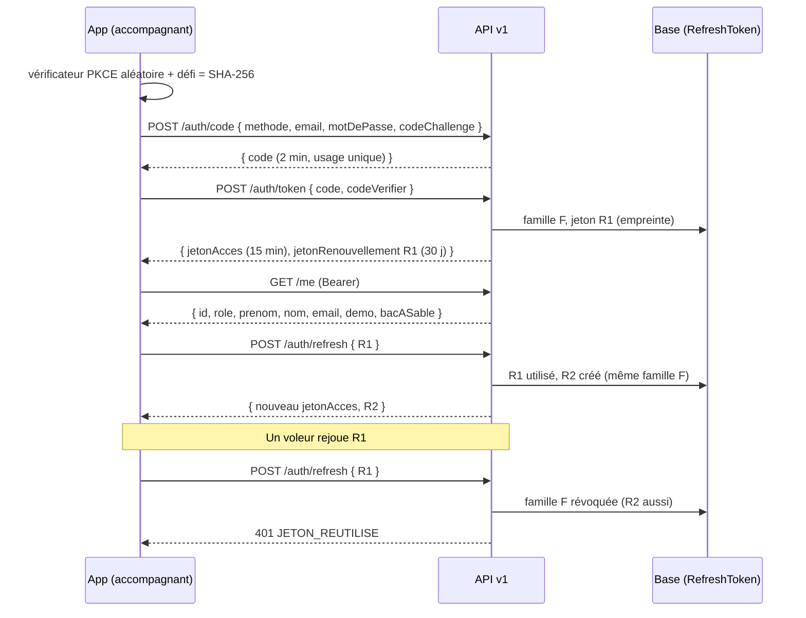
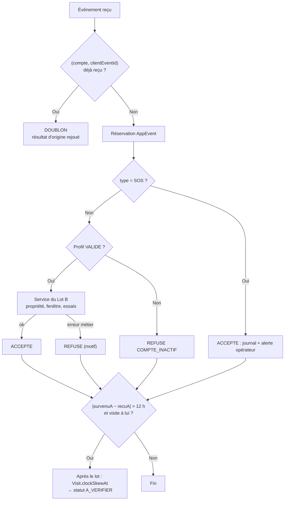
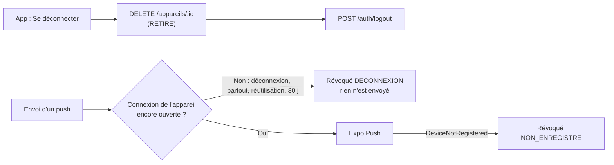

# API v1 — référence (lots A1, A2 et N1)

- **Statut :** livré. A1 (ADR 0008) : socle et authentification par jeton (§ 1 à 8). A2 : visites, événements, propositions (§ 9). N1 : appareils et notifications push (§ 10).
- **Code :** `plateforme/src/app/api/v1/**`, contrats `plateforme/src/contracts/v1/**`, services `plateforme/src/server/auth/token*.ts` (A1) et `plateforme/src/server/visits/app-*.ts` (A2).
- **Public :** app Expo accompagnant (`mobile/`). Le web garde le cookie de session (ADR 0002).

## 1. Règles communes

1. Corps et réponses en **JSON**. Corps de 16 Ko au plus (sinon `413`).
2. Chaque réponse porte `Cache-Control: no-store`.
3. Les **contrats Zod** de `src/contracts/v1/` font foi. Ils n'importent que `zod`. L'app les copie tels quels (`mobile/scripts/sync-contracts.mjs`, sans les fichiers `*.test.ts`).
4. Un champ inconnu dans un corps est **refusé** (`.strict()`).
5. Les routes protégées demandent `Authorization: Bearer <jetonAcces>`.

### Format d'erreur unique

```json
{ "erreur": { "code": "JETON_REUTILISE", "message": "Votre connexion a été fermée par sécurité. Connectez-vous de nouveau." } }
```

L'app décide sur le `code`. Le `message` est en français simple et peut s'afficher tel quel.

| Code | HTTP | Quand | Action de l'app |
|---|---|---|---|
| `REQUETE_INVALIDE` | 400 | JSON invalide, champ manquant ou refusé | Corriger la requête |
| `CODE_INVALIDE` | 400 | Code de connexion expiré, déjà utilisé, ou PKCE faux | Recommencer la connexion |
| `IDENTIFIANTS_INVALIDES` | 401 | E-mail ou mot de passe faux (même message si le compte n'existe pas) | Afficher le message |
| `NON_AUTHENTIFIE` | 401 | Jeton d'accès absent, expiré ou révoqué | Appeler `/auth/refresh` une fois |
| `JETON_INVALIDE` | 401 | Jeton de renouvellement inconnu, expiré ou révoqué | Effacer les jetons, écran de connexion |
| `JETON_REUTILISE` | 401 | Jeton de renouvellement déjà utilisé : connexion révoquée | Effacer les jetons **et** la base locale, écran de connexion |
| `ACCES_REFUSE` | 403 | Opérateur, compte démo hors démo, compte de bac à sable ; compte famille sur une route accompagnant (A2) | Afficher le message |
| `INTROUVABLE` | 404 | Route inconnue, compte démo absent ; visite ou proposition inconnue **ou d'un autre accompagnant** (A2) | — |
| `CONFLIT` | 409 | (A2) Proposition plus en attente, demande déjà pourvue | Recharger la liste |
| `REQUETE_TROP_GROSSE` | 413 | Corps > 16 Ko | — |
| `ACTION_IMPOSSIBLE` | 422 | (A2) Requête valide, action impossible : profil non validé, tarif manquant, niveau non permis | Afficher le message |
| `TROP_DE_REQUETES` | 429 | Limite de débit dépassée (en-tête `Retry-After`) | Attendre |
| `ERREUR_INTERNE` | 500 | Erreur serveur (aucun détail) | Réessayer plus tard |

## 2. Flux de connexion



## 3. Routes

| Méthode | Route | Auth | Corps | Réponse |
|---|---|---|---|---|
| POST | `/api/v1/auth/code` | — | `{ methode: "mot_de_passe", email, motDePasse, codeChallenge }` ou `{ methode: "demo", role: "ACCOMPAGNANT" \| "FAMILLE", codeChallenge }` | `200 { code, expireDans }` |
| POST | `/api/v1/auth/token` | — | `{ code, codeVerifier }` | `200 { typeJeton: "Bearer", jetonAcces, expireDans, jetonRenouvellement, renouvellementExpireDans }` |
| POST | `/api/v1/auth/refresh` | — | `{ jetonRenouvellement }` | `200` même forme que `/auth/token` |
| POST | `/api/v1/auth/logout` | Bearer et/ou corps | `{ jetonRenouvellement?, partout? }` | `204` (idempotent) |
| GET | `/api/v1/me` | Bearer | — | `200 { id, role, prenom, nom, email, demo, bacASable }` |

Notes :
- `methode: "demo"` marche seulement si `DEMO_MODE=true`. Jamais pour un opérateur.
- `codeChallenge` : SHA-256 du `codeVerifier`, en base64url (43 caractères). Méthode S256 seulement.
- `partout: true` : ferme **toutes** les connexions du compte (app et web), par `User.sessionVersion`.

## 4. Jetons

| Jeton | Forme | Durée | Stockage serveur | Stockage app |
|---|---|---|---|---|
| Code de connexion | JWT HS256 (`typ: code+jwt`), lié au défi PKCE | 2 min | Rien (usage unique contrôlé par `RefreshToken.authCodeId`) | Mémoire |
| Jeton d'accès | JWT HS256 (`typ: at+jwt`), `sub`, `role`, `sv`, `fid` | 15 min | Rien | Mémoire |
| Jeton de renouvellement | `kr1_` + 256 bits aléatoires | 30 j, renouvelée à chaque rotation | **Empreinte SHA-256** | `expo-secure-store` |

Règles de sécurité :
1. **Clés dérivées** de `SESSION_SECRET` (HKDF-SHA256), une par usage. Un cookie web n'est jamais un jeton d'accès. Aucune nouvelle variable d'environnement.
2. **Rotation** à chaque `/auth/refresh`. Le marquage « utilisé » est atomique : deux renouvellements simultanés → un seul gagne, la famille est révoquée.
3. **Réutilisation** d'un jeton déjà utilisé → toute la famille est révoquée (`revokedReason = REUTILISATION`) et journalisée (`auth.api.refresh_reuse`).
4. **Code rejoué** → la connexion ouverte par ce code est révoquée (`CODE_REUTILISE`).
5. **Lien avec `User.sessionVersion`** : la déconnexion web (M7) coupe aussi l'app.
6. **Jeton d'accès** : à chaque requête, le serveur relit le compte (version de session, démo, rôle) et vérifie que la famille n'est pas révoquée. La déconnexion coupe donc l'accès tout de suite.
7. **Refus** : opérateur (TOTP obligatoire, web seulement) ; compte démo si `DEMO_MODE` n'est pas `true` (D1) ; compte de bac à sable par mot de passe (D2).

## 5. Limites de débit (règles existantes, `src/server/rate-limit-rules.ts`)

| Route | Règle | Sujet (empreinte) |
|---|---|---|
| `/auth/code` (mot de passe) | `login:ip` + `login:compte` | IP + e-mail — **mêmes compteurs que la connexion web** |
| `/auth/code` (démo) | `login:ip` | IP |
| `/auth/token` | `login:ip` | `api-v1-token:<IP>` (compteur séparé) |
| `/auth/refresh` | `evenement:ip` (120/min) | `api-v1-refresh:<IP>` (large : CGNAT des opérateurs mobiles) |
| `/auth/logout` | `evenement:ip` | `api-v1-logout:<IP>` |
| `/me` | `evenement:ip` | `api-v1-me:<IP>` |

## 6. RGPD et journal

- `/me` renvoie une **liste fermée** (`reponseMoiSchema.strict()`). Aucune donnée de santé, aucun téléphone, aucun aîné.
- Journal d'audit : `auth.api.login`, `auth.api.demo_login`, `auth.api.login_failed`, `auth.api.login_rate_limited`, `auth.api.token`, `auth.api.code_reuse`, `auth.api.refresh_reuse`, `auth.api.logout`. Sans e-mail, sans jeton.
- `RefreshToken` est effacé avec le compte (`ON DELETE CASCADE`), donc aussi par la purge des bacs à sable.
- `purgeRefreshTokens()` efface les jetons expirés ou révoqués depuis 7 jours. **À brancher** sur la purge nocturne.

## 7. Tester

```bash
cd plateforme
pnpm vitest run src/contracts src/server/auth/token.test.ts src/app/api/v1       # unitaires
KOUDMEN_DB_TESTS=1 pnpm vitest run src/server/auth/token-service.db.test.ts      # base réelle
pnpm build:local && E2E_PORT=3712 pnpm e2e e2e/api-v1.spec.ts                    # e2e API (seed de démo)
```

À la main (serveur local, mode démo) :

```bash
V=$(openssl rand -base64 48 | tr '+/' '-_' | tr -d '=' | cut -c1-64)
C=$(printf %s "$V" | openssl dgst -sha256 -binary | base64 | tr '+/' '-_' | tr -d '=')
CODE=$(curl -s localhost:3000/api/v1/auth/code -H 'content-type: application/json' \
  -d "{\"methode\":\"demo\",\"role\":\"ACCOMPAGNANT\",\"codeChallenge\":\"$C\"}" | jq -r .code)
curl -s localhost:3000/api/v1/auth/token -H 'content-type: application/json' \
  -d "{\"code\":\"$CODE\",\"codeVerifier\":\"$V\"}" | jq .
```

## 8. Limites connues

- [À VÉRIFIER] Pas de délai de grâce sur la rotation : si l'app perd la réponse de `/auth/refresh` (réseau coupé), le rejeu révoque la connexion. L'app doit sérialiser les renouvellements. Un délai de grâce (ex. 30 s, même réponse) est possible plus tard.
- Pas de durée **absolue** de famille : une app active reste connectée tant qu'elle renouvelle dans les 30 jours.
- Pas de nom d'appareil ni d'alerte « Nouvelle connexion » (lot K).
- Les testeurs de bac à sable n'ont pas encore d'entrée dans l'app (il faudra un code issu du lien de reprise).
- Limites de débit : règles réutilisées. Des règles dédiées (`api:*`) demandent une modification de `rate-limit-rules.ts` (hors lot A1).
- Une méthode HTTP non prévue sur une route connue répond `405` sans corps (comportement Next.js).

## 9. Lot A2 — visites, événements, propositions

Toutes ces routes demandent un jeton d'accès **et** le rôle `ACCOMPAGNANT` (sinon `401` ou `403`).
Contrats : `src/contracts/v1/visits.ts` et `src/contracts/v1/visits-propositions.ts`.
Services : `src/server/visits/app-service.ts` (réutilise le Lot B : `accompagnant/service.ts`, `ownedVisitWhere`, `visits/service.ts`).

### 9.1 Routes

| Méthode | Route | Corps | Réponse |
|---|---|---|---|
| GET | `/api/v1/visites?jours=7` | — (`jours` : 1 à 14, 7 par défaut) | `200 { genereA, jours, visites: Visite[] }` |
| GET | `/api/v1/visites/:id` | — | `200 Visite + { brouillonKaye }` ; `404` si inconnue **ou d'un autre accompagnant** |
| POST | `/api/v1/evenements` | `{ evenements: Evenement[] }` (1 à 50, traités dans l'ordre) | `200 { recuA, resultats: Resultat[] }` (un par événement) |
| GET | `/api/v1/propositions` | — | `200 { propositions: Proposition[] }` (en attente) |
| POST | `/api/v1/propositions/:id/accepter` | vide ou `{}` | `200 { statut: "ACCEPTEE", missionId, visitesCreees }` ; `409`, `422`, `404` |
| POST | `/api/v1/propositions/:id/refuser` | vide ou `{ note? }` (500 car.) | `200 { statut: "REFUSEE", sansPenalite: true }` ; `409`, `404` |

`Visite` (liste **fermée**) : `id`, `debut`, `fin`, `statut` (`PREVUE`, `EN_COURS`, `VALIDEE`, `A_VERIFIER`),
`aine { prenom, initialeNom, commune, communeLibelle, adresseApproximative, interets }`,
`demande { niveau, frequence, dureeMinutes, consignes }` (demande de la famille),
`preuve { score, seuil: 2, facteursValides, checkInA, checkOutA, horlogeSuspecte }`, `kayePublie`,
`actions { checkIn, checkOut, kaye }` (calculées par le serveur).

### 9.2 Événements (file hors ligne de l'app)

| `type` | Champs en plus de `clientEventId` (UUID) et `survenuA` (ISO avec fuseau) | Effet (service du Lot B) |
|---|---|---|
| `CHECK_IN` | `visiteId`, `codeDomicile?`, `position?` `{ latitude, longitude, precisionMetres?, consentement: true }` — au moins un des deux | `checkInWithCode` puis `checkInWithGps`. Résultat par facteur dans `preuves` |
| `CHECK_OUT` | `visiteId` (**aucune position**) | `checkOut` |
| `KAYE_BROUILLON` | `visiteId`, `kaye` (champs facultatifs) | Brouillon gardé côté serveur ; le plus récent (`survenuA`) gagne |
| `KAYE_PUBLICATION` | `visiteId`, `kaye { humeur, appetit, activites, note?, aSurveiller, noteSurveillance? }` | `createKaye` ; le brouillon est effacé |
| `SOS` | `visiteId?` (**aucune position**) | Journal `sos.triggered` + message `SOS_ACCOMPAGNANT` aux opérateurs du même monde ; `consigne` « 15 / 112 » |



Règles :
1. **Idempotence** : un `clientEventId` est traité **une fois par compte** (table `AppEvent`, clé unique). Un doublon, dans le même lot ou plus tard, renvoie `statut: "DOUBLON"` et `statutOrigine` (`ACCEPTE`, `REFUSE` ou `EN_COURS`). Un refus métier est aussi gardé : un renvoi ne consomme pas un nouvel essai de code. Une erreur `500` efface la réservation : le renvoi retraite l'événement.
2. **Horloge** : le serveur garde `survenuA` (appareil) et `recuA`. Écart > **12 h** (dans un sens ou dans l'autre) → `horlogeSuspecte: true`, `Visit.clockSkewAt` posé, la visite passe `A_VERIFIER` **après** le lot. Elle reste `A_VERIFIER` tant que l'aîné n'a pas confirmé (`deriveVisitStatus`). Avec une horloge suspecte, l'action utilise l'heure du serveur ; sinon l'heure de l'appareil (jamais dans le futur).
3. **Profil inactif** (suspendu, refusé, non validé) : chaque événement est refusé `COMPTE_INACTIF`, **sauf le SOS** (sécurité avant tout).
4. **Pas de suivi GPS** : une position est acceptée **seulement** au `CHECK_IN`, avec `consentement: true`. Le contrat refuse une position ailleurs. Le Lot B limite à 2 lectures par visite.
5. **Motifs de refus** : `INTROUVABLE` (visite inconnue ou d'un autre accompagnant), `COMPTE_INACTIF`, `INTERDIT`, `CONFLIT`, `INVALIDE`. Le `message` s'affiche tel quel.

### 9.3 Propositions : refus sans pénalité

- `refuser` appelle `declineProposal` (RM-05) : **aucun** effet sur le profil (pas de compteur, pas de baisse de visibilité). La note n'est jamais transmise à la famille ; la famille reçoit un message anonyme.
- `refuser` reste possible pour un profil suspendu. `accepter` exige un profil validé (sinon `422`).

### 9.4 RGPD et journal

- `Visite` ne contient **jamais** : code du domicile, téléphone, besoins, position du domicile, texte d'un Kayé publié (`kayePublie` seulement).
- `AppEvent` ne contient **aucune** donnée personnelle (ni code, ni position, ni texte) : type, visite, heures, résultat. `purgeAppEvents()` efface les événements de plus de 30 jours. **À brancher** sur la purge nocturne.
- `KayeDraft` : brouillon effacé à la publication, avec la visite (cascade) et avec le compte.
- Journal : `visit.checkin`, `visit.code.failed`, `visit.gps.attempt`, `visit.proof.recorded`, `visit.checkout`, `journal.created` (Lot B), plus `visit.clock_skew` et `sos.triggered` (A2). Aucun texte, aucun code, aucune position.

### 9.5 Limites de débit

| Route | Règle | Sujet |
|---|---|---|
| `/visites`, `/visites/:id` | `evenement:ip` | `api-v1-visites:<IP>` |
| `/evenements` | `evenement:ip` | `api-v1-evenements:<IP>` |
| `/propositions/**` | `evenement:ip` | `api-v1-propositions:<IP>` |

### 9.6 Tester

```bash
cd plateforme
pnpm vitest run src/contracts src/server/visits src/app/api/v1                        # unitaires
KOUDMEN_DB_TESTS=1 pnpm vitest run src/server/visits/app-service.db.test.ts            # base réelle
pnpm build:local && E2E_PORT=3713 pnpm e2e e2e/api-v1-visites.spec.ts                 # e2e API (seed de démo)
```

### 9.7 Limites connues (A2)

- [À VÉRIFIER] `aine.interets` est toujours vide : le schéma n'a pas encore de champ « centres d'intérêt ». À ajouter côté famille (formulaire aîné), puis à remplir ici.
- Le QR « jeton signé du domicile » (spec § 10.2, point 5) n'existe pas encore : `codeDomicile` accepte le code lisible à 6 caractères.
- SOS : pas encore d'incident P1 ni d'appel d'astreinte (lot VX). L'alerte part dans la boîte d'envoi simulée des opérateurs.
- Une visite à l'horloge suspecte refuse ensuite un nouveau facteur (statut `A_VERIFIER`). La famille ou l'opérateur confirme par l'appel « tapez 1 ».
- Les contrats ont changé (`erreurs.ts` : `CONFLIT`, `ACTION_IMPOSSIBLE`) : relancer `mobile/scripts/sync-contracts.mjs` (lot M2).

## 10. Lot N1 — appareils et notifications push

Contrat : `src/contracts/v1/appareils.ts`. Service : `src/server/notifications/push/**`. Détail de l'intégration : [`integrations/push.md`](integrations/push.md).

### 10.1 Routes

Ces routes demandent un jeton d'accès. Tout rôle accepté par l'API (accompagnant, famille).

| Méthode | Route | Corps | Réponse |
|---|---|---|---|
| POST | `/api/v1/appareils` | `{ jeton: "ExponentPushToken[…]", plateforme: "IOS" \| "ANDROID" }` | `200 { id, enregistreA }` ; `400` si le jeton n'a pas la forme Expo |
| DELETE | `/api/v1/appareils/:id` | — | `204` toujours (idempotent ; un appareil inconnu ou d'un autre compte n'est pas touché) |

Règles :
1. L'app appelle `POST /appareils` à **chaque ouverture** (le jeton Expo peut changer). Même jeton → même ligne (`lastSeenAt` mis à jour).
2. Un jeton déjà connu sur **un autre compte** passe au compte connecté (même téléphone, autre personne).
3. L'appareil est lié à la **connexion** du jeton d'accès (`RefreshToken.familyId`).
4. 10 appareils actifs au plus par compte : au-delà, les plus anciens sont révoqués (`TROP_APPAREILS`).

### 10.2 Révocation



L'app retire l'appareil avant la déconnexion. Si elle ne peut pas (réseau coupé), le serveur révoque l'appareil au prochain envoi. Un appareil dont la connexion est fermée ne reçoit **jamais** de push.

### 10.3 Push envoyés (R9 : texte générique)

| Événement | Destinataire | Titre | Écran (`data.ecran`) |
|---|---|---|---|
| La famille choisit un profil (`PROPOSITION_MISSION`) | Accompagnant | « Nouvelle proposition » | `propositions` |
| Kayé publié (`KAYE_PUBLIE`) | Cercle Lakou | « Nouveau Kayé pour {prénom de l'aîné} » | `kaye` + `visiteId` |
| Kayé « à surveiller » (`ALERTE_A_SURVEILLER`) | Cercle Lakou | « À lire : visite chez {prénom de l'aîné} » | `visite` + `visiteId` |

- Jamais : humeur, appétit, note, motif, nom de l'accompagnant, commune.
- Le push s'ajoute au canal par défaut (WhatsApp ou e-mail). Il ne le remplace pas.
- `data` suit `donneesPushSchema` (`{ ecran, visiteId?, lien }`). L'app ignore des données hors contrat.

### 10.4 RGPD et journal

- `PushDevice` : jeton, plateforme, compte, connexion, dates. Effacé avec le compte (cascade). `purgePushDevices()` efface les appareils révoqués depuis 30 jours. **À brancher** sur la purge nocturne.
- Journal d'audit : `push.device.registered` (nouvel appareil, ou changement de compte ou de connexion). Jamais le jeton.
- Journal du serveur : jeton masqué (4 derniers caractères).

### 10.5 Limites de débit

| Route | Règle | Sujet |
|---|---|---|
| `/appareils`, `/appareils/:id` | `evenement:ip` | `api-v1-appareils:<IP>` |

### 10.6 Tester

```bash
cd plateforme
pnpm vitest run src/server/notifications src/app/api/v1/appareils                     # unitaires + contrat des adaptateurs
KOUDMEN_DB_TESTS=1 pnpm vitest run src/server/notifications/push/service.db.test.ts      # base réelle
pnpm build:local && E2E_PORT=3714 pnpm e2e e2e/api-v1-push.spec.ts                       # e2e API (seed de démo)
```

Le journal du serveur montre alors :

```
[push:console] ANDROID …5e70 | Nouveau Kayé pour Ginette | Ouvrez Koudmen pour le lire. | ecran=kaye:cm…
```
