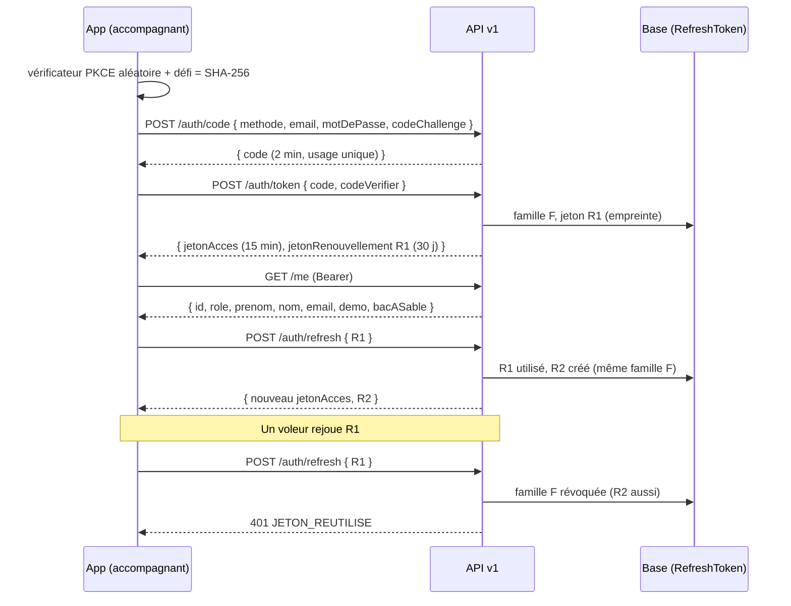

# API v1 — référence (lot A1 : socle et authentification par jeton)

- **Statut :** livré (lot A1, ADR 0008). Routes métier : lot A2.
- **Code :** `plateforme/src/app/api/v1/**`, contrats `plateforme/src/contracts/v1/**`, service `plateforme/src/server/auth/token*.ts`.
- **Public :** app Expo accompagnant (`mobile/`). Le web garde le cookie de session (ADR 0002).

## 1. Règles communes

1. Corps et réponses en **JSON**. Corps de 16 Ko au plus (sinon `413`).
2. Chaque réponse porte `Cache-Control: no-store`.
3. Les **contrats Zod** de `src/contracts/v1/` font foi. Ils n'importent que `zod`. L'app les copie tels quels (`mobile/scripts/sync-contracts.mjs`, sans les fichiers `*.test.ts`).
4. Un champ inconnu dans un corps est **refusé** (`.strict()`).
5. Les routes protégées demandent `Authorization: Bearer <jetonAcces>`.

### Format d'erreur unique

```json
{ "erreur": { "code": "JETON_REUTILISE", "message": "Votre connexion a été fermée par sécurité. Connectez-vous de nouveau." } }
```

L'app décide sur le `code`. Le `message` est en français simple et peut s'afficher tel quel.

| Code | HTTP | Quand | Action de l'app |
|---|---|---|---|
| `REQUETE_INVALIDE` | 400 | JSON invalide, champ manquant ou refusé | Corriger la requête |
| `CODE_INVALIDE` | 400 | Code de connexion expiré, déjà utilisé, ou PKCE faux | Recommencer la connexion |
| `IDENTIFIANTS_INVALIDES` | 401 | E-mail ou mot de passe faux (même message si le compte n'existe pas) | Afficher le message |
| `NON_AUTHENTIFIE` | 401 | Jeton d'accès absent, expiré ou révoqué | Appeler `/auth/refresh` une fois |
| `JETON_INVALIDE` | 401 | Jeton de renouvellement inconnu, expiré ou révoqué | Effacer les jetons, écran de connexion |
| `JETON_REUTILISE` | 401 | Jeton de renouvellement déjà utilisé : connexion révoquée | Effacer les jetons **et** la base locale, écran de connexion |
| `ACCES_REFUSE` | 403 | Opérateur, compte démo hors démo, compte de bac à sable | Afficher le message |
| `INTROUVABLE` | 404 | Route inconnue, compte démo absent | — |
| `REQUETE_TROP_GROSSE` | 413 | Corps > 16 Ko | — |
| `TROP_DE_REQUETES` | 429 | Limite de débit dépassée (en-tête `Retry-After`) | Attendre |
| `ERREUR_INTERNE` | 500 | Erreur serveur (aucun détail) | Réessayer plus tard |

## 2. Flux de connexion



## 3. Routes

| Méthode | Route | Auth | Corps | Réponse |
|---|---|---|---|---|
| POST | `/api/v1/auth/code` | — | `{ methode: "mot_de_passe", email, motDePasse, codeChallenge }` ou `{ methode: "demo", role: "ACCOMPAGNANT" \| "FAMILLE", codeChallenge }` | `200 { code, expireDans }` |
| POST | `/api/v1/auth/token` | — | `{ code, codeVerifier }` | `200 { typeJeton: "Bearer", jetonAcces, expireDans, jetonRenouvellement, renouvellementExpireDans }` |
| POST | `/api/v1/auth/refresh` | — | `{ jetonRenouvellement }` | `200` même forme que `/auth/token` |
| POST | `/api/v1/auth/logout` | Bearer et/ou corps | `{ jetonRenouvellement?, partout? }` | `204` (idempotent) |
| GET | `/api/v1/me` | Bearer | — | `200 { id, role, prenom, nom, email, demo, bacASable }` |

Notes :
- `methode: "demo"` marche seulement si `DEMO_MODE=true`. Jamais pour un opérateur.
- `codeChallenge` : SHA-256 du `codeVerifier`, en base64url (43 caractères). Méthode S256 seulement.
- `partout: true` : ferme **toutes** les connexions du compte (app et web), par `User.sessionVersion`.

## 4. Jetons

| Jeton | Forme | Durée | Stockage serveur | Stockage app |
|---|---|---|---|---|
| Code de connexion | JWT HS256 (`typ: code+jwt`), lié au défi PKCE | 2 min | Rien (usage unique contrôlé par `RefreshToken.authCodeId`) | Mémoire |
| Jeton d'accès | JWT HS256 (`typ: at+jwt`), `sub`, `role`, `sv`, `fid` | 15 min | Rien | Mémoire |
| Jeton de renouvellement | `kr1_` + 256 bits aléatoires | 30 j, renouvelée à chaque rotation | **Empreinte SHA-256** | `expo-secure-store` |

Règles de sécurité :
1. **Clés dérivées** de `SESSION_SECRET` (HKDF-SHA256), une par usage. Un cookie web n'est jamais un jeton d'accès. Aucune nouvelle variable d'environnement.
2. **Rotation** à chaque `/auth/refresh`. Le marquage « utilisé » est atomique : deux renouvellements simultanés → un seul gagne, la famille est révoquée.
3. **Réutilisation** d'un jeton déjà utilisé → toute la famille est révoquée (`revokedReason = REUTILISATION`) et journalisée (`auth.api.refresh_reuse`).
4. **Code rejoué** → la connexion ouverte par ce code est révoquée (`CODE_REUTILISE`).
5. **Lien avec `User.sessionVersion`** : la déconnexion web (M7) coupe aussi l'app.
6. **Jeton d'accès** : à chaque requête, le serveur relit le compte (version de session, démo, rôle) et vérifie que la famille n'est pas révoquée. La déconnexion coupe donc l'accès tout de suite.
7. **Refus** : opérateur (TOTP obligatoire, web seulement) ; compte démo si `DEMO_MODE` n'est pas `true` (D1) ; compte de bac à sable par mot de passe (D2).

## 5. Limites de débit (règles existantes, `src/server/rate-limit-rules.ts`)

| Route | Règle | Sujet (empreinte) |
|---|---|---|
| `/auth/code` (mot de passe) | `login:ip` + `login:compte` | IP + e-mail — **mêmes compteurs que la connexion web** |
| `/auth/code` (démo) | `login:ip` | IP |
| `/auth/token` | `login:ip` | `api-v1-token:<IP>` (compteur séparé) |
| `/auth/refresh` | `evenement:ip` (120/min) | `api-v1-refresh:<IP>` (large : CGNAT des opérateurs mobiles) |
| `/auth/logout` | `evenement:ip` | `api-v1-logout:<IP>` |
| `/me` | `evenement:ip` | `api-v1-me:<IP>` |

## 6. RGPD et journal

- `/me` renvoie une **liste fermée** (`reponseMoiSchema.strict()`). Aucune donnée de santé, aucun téléphone, aucun aîné.
- Journal d'audit : `auth.api.login`, `auth.api.demo_login`, `auth.api.login_failed`, `auth.api.login_rate_limited`, `auth.api.token`, `auth.api.code_reuse`, `auth.api.refresh_reuse`, `auth.api.logout`. Sans e-mail, sans jeton.
- `RefreshToken` est effacé avec le compte (`ON DELETE CASCADE`), donc aussi par la purge des bacs à sable.
- `purgeRefreshTokens()` efface les jetons expirés ou révoqués depuis 7 jours. **À brancher** sur la purge nocturne.

## 7. Tester

```bash
cd plateforme
pnpm vitest run src/contracts src/server/auth/token.test.ts src/app/api/v1       # unitaires
KOUDMEN_DB_TESTS=1 pnpm vitest run src/server/auth/token-service.db.test.ts      # base réelle
pnpm build:local && E2E_PORT=3712 pnpm e2e e2e/api-v1.spec.ts                    # e2e API (seed de démo)
```

À la main (serveur local, mode démo) :

```bash
V=$(openssl rand -base64 48 | tr '+/' '-_' | tr -d '=' | cut -c1-64)
C=$(printf %s "$V" | openssl dgst -sha256 -binary | base64 | tr '+/' '-_' | tr -d '=')
CODE=$(curl -s localhost:3000/api/v1/auth/code -H 'content-type: application/json' \
  -d "{\"methode\":\"demo\",\"role\":\"ACCOMPAGNANT\",\"codeChallenge\":\"$C\"}" | jq -r .code)
curl -s localhost:3000/api/v1/auth/token -H 'content-type: application/json' \
  -d "{\"code\":\"$CODE\",\"codeVerifier\":\"$V\"}" | jq .
```

## 8. Limites connues

- [À VÉRIFIER] Pas de délai de grâce sur la rotation : si l'app perd la réponse de `/auth/refresh` (réseau coupé), le rejeu révoque la connexion. L'app doit sérialiser les renouvellements. Un délai de grâce (ex. 30 s, même réponse) est possible plus tard.
- Pas de durée **absolue** de famille : une app active reste connectée tant qu'elle renouvelle dans les 30 jours.
- Pas de nom d'appareil ni d'alerte « Nouvelle connexion » (lot K).
- Les testeurs de bac à sable n'ont pas encore d'entrée dans l'app (il faudra un code issu du lien de reprise).
- Limites de débit : règles réutilisées. Des règles dédiées (`api:*`) demandent une modification de `rate-limit-rules.ts` (hors lot A1).
- Une méthode HTTP non prévue sur une route connue répond `405` sans corps (comportement Next.js).
