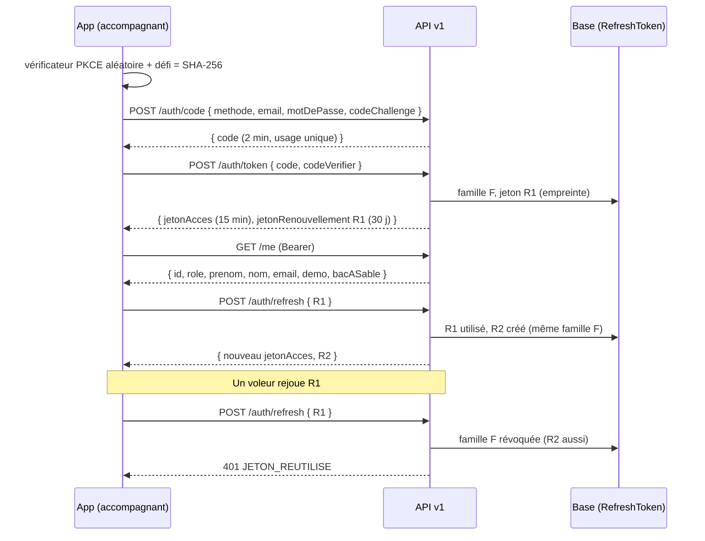
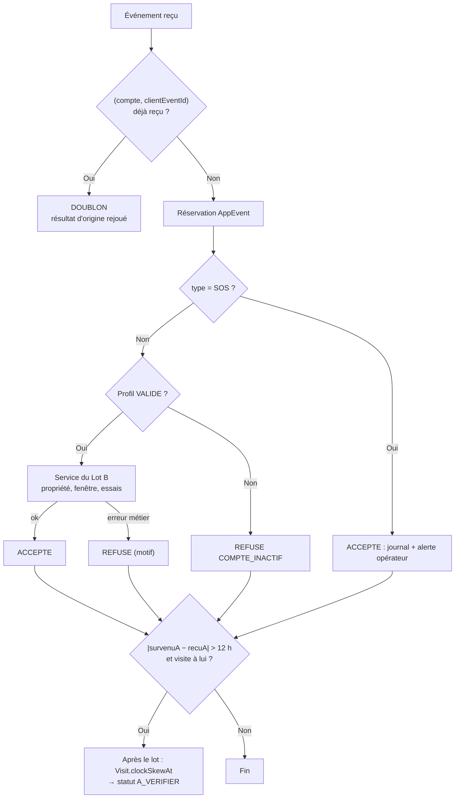
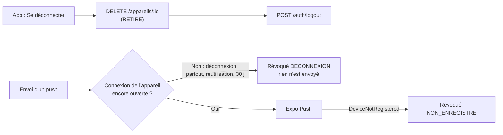
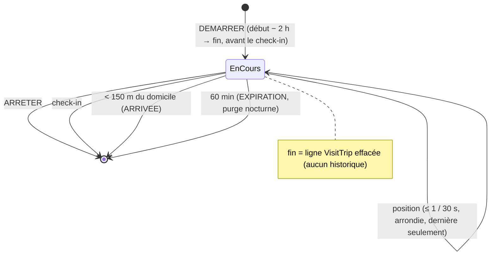
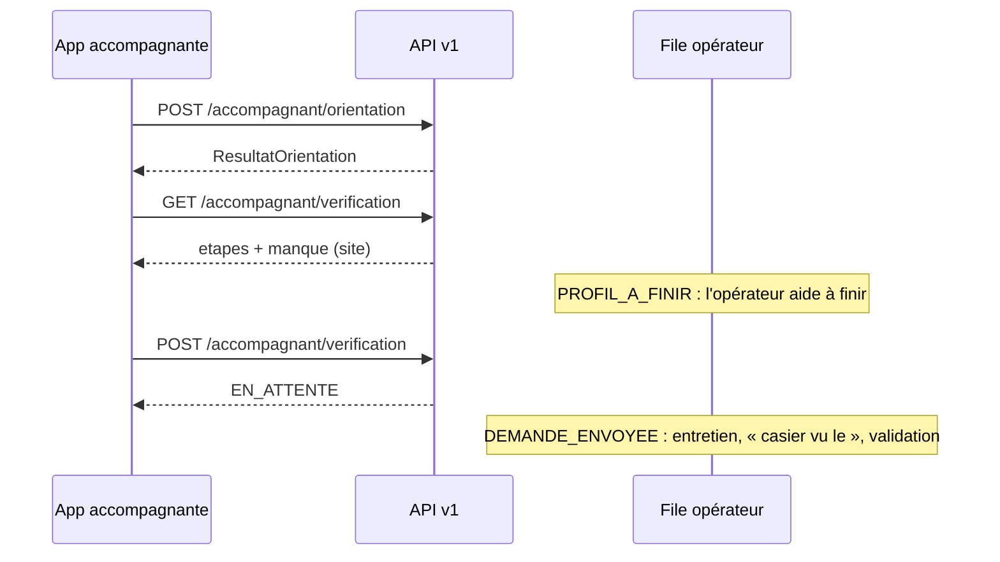

# API v1 — référence (lots A1, A2, N1 et L1-B)

- **Statut :** livré. A1 (ADR 0008) : socle et authentification par jeton (§ 1 à 8). A2 : visites, événements, propositions (§ 9). N1 : appareils et notifications push (§ 10). L1-B : QR signé, check-in contrôlé, trajet en direct (§ 11).
- **Code :** `plateforme/src/app/api/v1/**`, contrats `plateforme/src/contracts/v1/**`, services `plateforme/src/server/auth/token*.ts` (A1) et `plateforme/src/server/visits/app-*.ts` (A2).
- **Public :** app Expo accompagnant (`mobile/`). Le web garde le cookie de session (ADR 0002).

## 1. Règles communes

1. Corps et réponses en **JSON**. Corps de 16 Ko au plus (sinon `413`).
2. Chaque réponse porte `Cache-Control: no-store`.
3. Les **contrats Zod** de `src/contracts/v1/` font foi. Ils n'importent que `zod`. L'app les copie tels quels (`mobile/scripts/sync-contracts.mjs`, sans les fichiers `*.test.ts`).
4. Un champ inconnu dans un corps est **refusé** (`.strict()`).
5. Les routes protégées demandent `Authorization: Bearer <jetonAcces>`.

### Format d'erreur unique

```json
{ "erreur": { "code": "JETON_REUTILISE", "message": "Votre connexion a été fermée par sécurité. Connectez-vous de nouveau." } }
```

L'app décide sur le `code`. Le `message` est en français simple et peut s'afficher tel quel.

| Code | HTTP | Quand | Action de l'app |
|---|---|---|---|
| `REQUETE_INVALIDE` | 400 | JSON invalide, champ manquant ou refusé | Corriger la requête |
| `CODE_INVALIDE` | 400 | Code de connexion expiré, déjà utilisé, ou PKCE faux | Recommencer la connexion |
| `IDENTIFIANTS_INVALIDES` | 401 | E-mail ou mot de passe faux (même message si le compte n'existe pas) | Afficher le message |
| `NON_AUTHENTIFIE` | 401 | Jeton d'accès absent, expiré ou révoqué | Appeler `/auth/refresh` une fois |
| `JETON_INVALIDE` | 401 | Jeton de renouvellement inconnu, expiré ou révoqué | Effacer les jetons, écran de connexion |
| `JETON_REUTILISE` | 401 | Jeton de renouvellement déjà utilisé : connexion révoquée | Effacer les jetons **et** la base locale, écran de connexion |
| `ACCES_REFUSE` | 403 | Opérateur, compte démo hors démo, compte de bac à sable ; compte famille sur une route accompagnant (A2) | Afficher le message |
| `INTROUVABLE` | 404 | Route inconnue, compte démo absent ; visite ou proposition inconnue **ou d'un autre accompagnant** (A2) | — |
| `CONFLIT` | 409 | (A2) Proposition plus en attente, demande déjà pourvue | Recharger la liste |
| `REQUETE_TROP_GROSSE` | 413 | Corps > 16 Ko | — |
| `ACTION_IMPOSSIBLE` | 422 | (A2) Requête valide, action impossible : profil non validé, tarif manquant, niveau non permis | Afficher le message |
| `TROP_DE_REQUETES` | 429 | Limite de débit dépassée (en-tête `Retry-After`) | Attendre |
| `ERREUR_INTERNE` | 500 | Erreur serveur (aucun détail) | Réessayer plus tard |

## 2. Flux de connexion



## 3. Routes

| Méthode | Route | Auth | Corps | Réponse |
|---|---|---|---|---|
| POST | `/api/v1/auth/code` | — | `{ methode: "mot_de_passe", email, motDePasse, codeChallenge }` ou `{ methode: "demo", role: "ACCOMPAGNANT" \| "FAMILLE", codeChallenge }` | `200 { code, expireDans }` |
| POST | `/api/v1/auth/token` | — | `{ code, codeVerifier }` | `200 { typeJeton: "Bearer", jetonAcces, expireDans, jetonRenouvellement, renouvellementExpireDans }` |
| POST | `/api/v1/auth/refresh` | — | `{ jetonRenouvellement }` | `200` même forme que `/auth/token` |
| POST | `/api/v1/auth/logout` | Bearer et/ou corps | `{ jetonRenouvellement?, partout? }` | `204` (idempotent) |
| GET | `/api/v1/me` | Bearer | — | `200 { id, role, prenom, nom, email, demo, bacASable, emailVerifie, profilValide, preinscription }` |
| POST | `/api/v1/auth/inscription` | — | voir § 12 | `201 { etat: "VERIFICATION_EMAIL_ENVOYEE" }` |
| POST | `/api/v1/auth/mot-de-passe-oublie` | — | `{ email }` | `202 {}` toujours |

Notes :
- `methode: "demo"` marche seulement si `DEMO_MODE=true` ET en mode essai (L1 : en lancement, `403 ACCES_REFUSE`). Jamais pour un opérateur.
- `codeChallenge` : SHA-256 du `codeVerifier`, en base64url (43 caractères). Méthode S256 seulement.
- `partout: true` : ferme **toutes** les connexions du compte (app et web), par `User.sessionVersion`.

## 4. Jetons

| Jeton | Forme | Durée | Stockage serveur | Stockage app |
|---|---|---|---|---|
| Code de connexion | JWT HS256 (`typ: code+jwt`), lié au défi PKCE | 2 min | Rien (usage unique contrôlé par `RefreshToken.authCodeId`) | Mémoire |
| Jeton d'accès | JWT HS256 (`typ: at+jwt`), `sub`, `role`, `sv`, `fid` | 15 min | Rien | Mémoire |
| Jeton de renouvellement | `kr1_` + 256 bits aléatoires | 30 j, renouvelée à chaque rotation | **Empreinte SHA-256** | `expo-secure-store` |

Règles de sécurité :
1. **Clés dérivées** de `SESSION_SECRET` (HKDF-SHA256), une par usage. Un cookie web n'est jamais un jeton d'accès. Aucune nouvelle variable d'environnement.
2. **Rotation** à chaque `/auth/refresh`. Le marquage « utilisé » est atomique : deux renouvellements simultanés → un seul gagne, la famille est révoquée.
3. **Réutilisation** d'un jeton déjà utilisé → toute la famille est révoquée (`revokedReason = REUTILISATION`) et journalisée (`auth.api.refresh_reuse`).
4. **Code rejoué** → la connexion ouverte par ce code est révoquée (`CODE_REUTILISE`).
5. **Lien avec `User.sessionVersion`** : la déconnexion web (M7) coupe aussi l'app.
6. **Jeton d'accès** : à chaque requête, le serveur relit le compte (version de session, démo, rôle) et vérifie que la famille n'est pas révoquée. La déconnexion coupe donc l'accès tout de suite.
7. **Refus** : opérateur (TOTP obligatoire, web seulement) ; compte démo si `DEMO_MODE` n'est pas `true` (D1) ; compte de bac à sable par mot de passe (D2).

## 5. Limites de débit (règles existantes, `src/server/rate-limit-rules.ts`)

| Route | Règle | Sujet (empreinte) |
|---|---|---|
| `/auth/code` (mot de passe) | `login:ip` + `login:compte` | IP + e-mail — **mêmes compteurs que la connexion web** |
| `/auth/code` (démo) | `login:ip` | IP |
| `/auth/token` | `login:ip` | `api-v1-token:<IP>` (compteur séparé) |
| `/auth/refresh` | `evenement:ip` (120/min) | `api-v1-refresh:<IP>` (large : CGNAT des opérateurs mobiles) |
| `/auth/logout` | `evenement:ip` | `api-v1-logout:<IP>` |
| `/me` | `evenement:ip` | `api-v1-me:<IP>` |

## 6. RGPD et journal

- `/me` renvoie une **liste fermée** (`reponseMoiSchema.strict()`). Aucune donnée de santé, aucun téléphone, aucun aîné.
- Journal d'audit : `auth.api.login`, `auth.api.demo_login`, `auth.api.login_failed`, `auth.api.login_rate_limited`, `auth.api.token`, `auth.api.code_reuse`, `auth.api.refresh_reuse`, `auth.api.logout`. Sans e-mail, sans jeton.
- `RefreshToken` est effacé avec le compte (`ON DELETE CASCADE`), donc aussi par la purge des bacs à sable.
- `purgeRefreshTokens()` efface les jetons expirés ou révoqués depuis 7 jours. **À brancher** sur la purge nocturne.

## 7. Tester

```bash
cd plateforme
pnpm vitest run src/contracts src/server/auth/token.test.ts src/app/api/v1       # unitaires
KOUDMEN_DB_TESTS=1 pnpm vitest run src/server/auth/token-service.db.test.ts      # base réelle
pnpm build:local && E2E_PORT=3712 pnpm e2e e2e/api-v1.spec.ts                    # e2e API (seed de démo)
```

À la main (serveur local, mode démo) :

```bash
V=$(openssl rand -base64 48 | tr '+/' '-_' | tr -d '=' | cut -c1-64)
C=$(printf %s "$V" | openssl dgst -sha256 -binary | base64 | tr '+/' '-_' | tr -d '=')
CODE=$(curl -s localhost:3000/api/v1/auth/code -H 'content-type: application/json' \
  -d "{\"methode\":\"demo\",\"role\":\"ACCOMPAGNANT\",\"codeChallenge\":\"$C\"}" | jq -r .code)
curl -s localhost:3000/api/v1/auth/token -H 'content-type: application/json' \
  -d "{\"code\":\"$CODE\",\"codeVerifier\":\"$V\"}" | jq .
```

## 8. Limites connues

- [À VÉRIFIER] Pas de délai de grâce sur la rotation : si l'app perd la réponse de `/auth/refresh` (réseau coupé), le rejeu révoque la connexion. L'app doit sérialiser les renouvellements. Un délai de grâce (ex. 30 s, même réponse) est possible plus tard.
- Pas de durée **absolue** de famille : une app active reste connectée tant qu'elle renouvelle dans les 30 jours.
- Pas de nom d'appareil ni d'alerte « Nouvelle connexion » (lot K).
- Les testeurs de bac à sable n'ont pas encore d'entrée dans l'app (il faudra un code issu du lien de reprise).
- Limites de débit : règles réutilisées. Des règles dédiées (`api:*`) demandent une modification de `rate-limit-rules.ts` (hors lot A1).
- Une méthode HTTP non prévue sur une route connue répond `405` sans corps (comportement Next.js).

## 9. Lot A2 — visites, événements, propositions

Toutes ces routes demandent un jeton d'accès **et** le rôle `ACCOMPAGNANT` (sinon `401` ou `403`).
Contrats : `src/contracts/v1/visits.ts` et `src/contracts/v1/visits-propositions.ts`.
Services : `src/server/visits/app-service.ts` (réutilise le Lot B : `accompagnant/service.ts`, `ownedVisitWhere`, `visits/service.ts`).

### 9.1 Routes

| Méthode | Route | Corps | Réponse |
|---|---|---|---|
| GET | `/api/v1/visites?jours=7` | — (`jours` : 1 à 14, 7 par défaut) | `200 { genereA, jours, visites: Visite[] }` |
| GET | `/api/v1/visites/:id` | — | `200 Visite + { brouillonKaye }` ; `404` si inconnue **ou d'un autre accompagnant** |
| POST | `/api/v1/evenements` | `{ evenements: Evenement[] }` (1 à 50, traités dans l'ordre) | `200 { recuA, resultats: Resultat[] }` (un par événement) |
| GET | `/api/v1/propositions` | — | `200 { propositions: Proposition[] }` (en attente) |
| POST | `/api/v1/propositions/:id/accepter` | vide ou `{}` | `200 { statut: "ACCEPTEE", missionId, visitesCreees }` ; `409`, `422`, `404` |
| POST | `/api/v1/propositions/:id/refuser` | vide ou `{ note? }` (500 car.) | `200 { statut: "REFUSEE", sansPenalite: true }` ; `409`, `404` |

`Visite` (liste **fermée**) : `id`, `debut`, `fin`, `statut` (`PREVUE`, `EN_COURS`, `VALIDEE`, `A_VERIFIER`),
`aine { prenom, initialeNom, commune, communeLibelle, adresseApproximative, interets }`,
`demande { niveau, frequence, dureeMinutes, consignes }` (demande de la famille),
`preuve { score, seuil: 2, facteursValides, checkInA, checkOutA, horlogeSuspecte }`, `kayePublie`,
`actions { checkIn, checkOut, kaye }` (calculées par le serveur).

### 9.2 Événements (file hors ligne de l'app)

| `type` | Champs en plus de `clientEventId` (UUID) et `survenuA` (ISO avec fuseau) | Effet (service du Lot B) |
|---|---|---|
| `CHECK_IN` | `visiteId`, `codeDomicile?`, `position?` `{ latitude, longitude, precisionMetres?, consentement: true }` — au moins un des deux | `checkInWithCode` puis `checkInWithGps`. Résultat par facteur dans `preuves` |
| `CHECK_OUT` | `visiteId` (**aucune position**) | `checkOut` |
| `KAYE_BROUILLON` | `visiteId`, `kaye` (champs facultatifs) | Brouillon gardé côté serveur ; le plus récent (`survenuA`) gagne |
| `KAYE_PUBLICATION` | `visiteId`, `kaye { humeur, appetit, activites, note?, aSurveiller, noteSurveillance? }` | `createKaye` ; le brouillon est effacé |
| `SOS` | `visiteId?` (**aucune position**) | Journal `sos.triggered` + message `SOS_ACCOMPAGNANT` aux opérateurs du même monde ; `consigne` « 15 / 112 » |



Règles :
1. **Idempotence** : un `clientEventId` est traité **une fois par compte** (table `AppEvent`, clé unique). Un doublon, dans le même lot ou plus tard, renvoie `statut: "DOUBLON"` et `statutOrigine` (`ACCEPTE`, `REFUSE` ou `EN_COURS`). Un refus métier est aussi gardé : un renvoi ne consomme pas un nouvel essai de code. Une erreur `500` efface la réservation : le renvoi retraite l'événement.
2. **Horloge** : le serveur garde `survenuA` (appareil) et `recuA`. Écart > **12 h** (dans un sens ou dans l'autre) → `horlogeSuspecte: true`, `Visit.clockSkewAt` posé, la visite passe `A_VERIFIER` **après** le lot. Elle reste `A_VERIFIER` tant que l'aîné n'a pas confirmé (`deriveVisitStatus`). Avec une horloge suspecte, l'action utilise l'heure du serveur ; sinon l'heure de l'appareil (jamais dans le futur).
3. **Profil inactif** (suspendu, refusé, non validé) : chaque événement est refusé `COMPTE_INACTIF`, **sauf le SOS** (sécurité avant tout).
4. **Pas de suivi GPS** : une position est acceptée **seulement** au `CHECK_IN`, avec `consentement: true`. Le contrat refuse une position ailleurs. Le Lot B limite à 2 lectures par visite.
5. **Motifs de refus** : `INTROUVABLE` (visite inconnue ou d'un autre accompagnant), `COMPTE_INACTIF`, `INTERDIT`, `CONFLIT`, `INVALIDE`. Le `message` s'affiche tel quel.

### 9.3 Propositions : refus sans pénalité

- `refuser` appelle `declineProposal` (RM-05) : **aucun** effet sur le profil (pas de compteur, pas de baisse de visibilité). La note n'est jamais transmise à la famille ; la famille reçoit un message anonyme.
- `refuser` reste possible pour un profil suspendu. `accepter` exige un profil validé (sinon `422`).

### 9.4 RGPD et journal

- `Visite` ne contient **jamais** : code du domicile, téléphone, besoins, position du domicile, texte d'un Kayé publié (`kayePublie` seulement).
- `AppEvent` ne contient **aucune** donnée personnelle (ni code, ni position, ni texte) : type, visite, heures, résultat. `purgeAppEvents()` efface les événements de plus de 30 jours. **À brancher** sur la purge nocturne.
- `KayeDraft` : brouillon effacé à la publication, avec la visite (cascade) et avec le compte.
- Journal : `visit.checkin`, `visit.code.failed`, `visit.gps.attempt`, `visit.proof.recorded`, `visit.checkout`, `journal.created` (Lot B), plus `visit.clock_skew` et `sos.triggered` (A2). Aucun texte, aucun code, aucune position.

### 9.5 Limites de débit

| Route | Règle | Sujet |
|---|---|---|
| `/visites`, `/visites/:id` | `evenement:ip` | `api-v1-visites:<IP>` |
| `/evenements` | `evenement:ip` | `api-v1-evenements:<IP>` |
| `/propositions/**` | `evenement:ip` | `api-v1-propositions:<IP>` |

### 9.6 Tester

```bash
cd plateforme
pnpm vitest run src/contracts src/server/visits src/app/api/v1                        # unitaires
KOUDMEN_DB_TESTS=1 pnpm vitest run src/server/visits/app-service.db.test.ts            # base réelle
pnpm build:local && E2E_PORT=3713 pnpm e2e e2e/api-v1-visites.spec.ts                 # e2e API (seed de démo)
```

### 9.7 Limites connues (A2)

- [À VÉRIFIER] `aine.interets` est toujours vide : le schéma n'a pas encore de champ « centres d'intérêt ». À ajouter côté famille (formulaire aîné), puis à remplir ici.
- Le QR « jeton signé du domicile » existe depuis le lot L1-B (§ 11.1, champ `qr`). `codeDomicile` reste la saisie de secours.
- SOS : pas encore d'incident P1 ni d'appel d'astreinte (lot VX). L'alerte part dans la boîte d'envoi simulée des opérateurs.
- Une visite à l'horloge suspecte refuse ensuite un nouveau facteur (statut `A_VERIFIER`). La famille ou l'opérateur confirme par l'appel « tapez 1 ».
- Les contrats ont changé (`erreurs.ts` : `CONFLIT`, `ACTION_IMPOSSIBLE`) : relancer `mobile/scripts/sync-contracts.mjs` (lot M2).

## 10. Lot N1 — appareils et notifications push

Contrat : `src/contracts/v1/appareils.ts`. Service : `src/server/notifications/push/**`. Détail de l'intégration : [`integrations/push.md`](integrations/push.md).

### 10.1 Routes

Ces routes demandent un jeton d'accès. Tout rôle accepté par l'API (accompagnant, famille).

| Méthode | Route | Corps | Réponse |
|---|---|---|---|
| POST | `/api/v1/appareils` | `{ jeton: "ExponentPushToken[…]", plateforme: "IOS" \| "ANDROID" }` | `200 { id, enregistreA }` ; `400` si le jeton n'a pas la forme Expo |
| DELETE | `/api/v1/appareils/:id` | — | `204` toujours (idempotent ; un appareil inconnu ou d'un autre compte n'est pas touché) |

Règles :
1. L'app appelle `POST /appareils` à **chaque ouverture** (le jeton Expo peut changer). Même jeton → même ligne (`lastSeenAt` mis à jour).
2. Un jeton déjà connu sur **un autre compte** passe au compte connecté (même téléphone, autre personne).
3. L'appareil est lié à la **connexion** du jeton d'accès (`RefreshToken.familyId`).
4. 10 appareils actifs au plus par compte : au-delà, les plus anciens sont révoqués (`TROP_APPAREILS`).

### 10.2 Révocation



L'app retire l'appareil avant la déconnexion. Si elle ne peut pas (réseau coupé), le serveur révoque l'appareil au prochain envoi. Un appareil dont la connexion est fermée ne reçoit **jamais** de push.

### 10.3 Push envoyés (R9 : texte générique)

| Événement | Destinataire | Titre | Écran (`data.ecran`) |
|---|---|---|---|
| La famille choisit un profil (`PROPOSITION_MISSION`) | Accompagnant | « Koudmen · Nouvelle proposition » | `propositions` |
| Kayé publié (`KAYE_PUBLIE`) | Cercle Lakou | « Koudmen · Nouvelles de votre proche » | `kaye` + `visiteId` |
| Kayé « à surveiller » (`ALERTE_A_SURVEILLER`) | Cercle Lakou | « Koudmen · Nouvelles de votre proche » | `visite` + `visiteId` |

- Jamais : prénom de l'aîné, « à surveiller », humeur, appétit, note, motif, nom de l'accompagnant, commune (V1c, X2).
- Le push s'ajoute au canal par défaut (WhatsApp ou e-mail). Il ne le remplace pas.
- `data` suit `donneesPushSchema` (`{ ecran, visiteId?, lien }`). L'app ignore des données hors contrat.

### 10.4 RGPD et journal

- `PushDevice` : jeton, plateforme, compte, connexion, dates. Effacé avec le compte (cascade). `purgePushDevices()` efface les appareils révoqués depuis 30 jours. **À brancher** sur la purge nocturne.
- Journal d'audit : `push.device.registered` (nouvel appareil, ou changement de compte ou de connexion). Jamais le jeton.
- Journal du serveur : jeton masqué (4 derniers caractères).

### 10.5 Limites de débit

| Route | Règle | Sujet |
|---|---|---|
| `/appareils`, `/appareils/:id` | `evenement:ip` | `api-v1-appareils:<IP>` |

### 10.6 Tester

```bash
cd plateforme
pnpm vitest run src/server/notifications src/app/api/v1/appareils                     # unitaires + contrat des adaptateurs
KOUDMEN_DB_TESTS=1 pnpm vitest run src/server/notifications/push/service.db.test.ts      # base réelle
pnpm build:local && E2E_PORT=3714 pnpm e2e e2e/api-v1-push.spec.ts                       # e2e API (seed de démo)
```

Le journal du serveur montre alors :

```
[push:console] ANDROID …5e70 | ecran=kaye:cm…
```

## 11. Lot L1-B — QR signé, check-in contrôlé, trajet en direct

Décisions : L6 à L10, puis R1, R3, R4, R5, R7 (`docs/revues/L1-arbitrage-lancement.md` § 5). Notes : [`L1-B-notes.md`](L1-B-notes.md).
Contrats : `src/contracts/v1/visits.ts` (check-in) et `src/contracts/v1/trajet.ts`. Services : `src/server/presence/**`.

### 11.1 Check-in par QR signé (§ 2.3, L10) — `POST /api/v1/evenements`, `type: "CHECK_IN"`

Champs en plus (tous facultatifs, au moins un de `qr`, `codeDomicile`, `position`) :

| Champ | Forme | Effet |
|---|---|---|
| `qr` | `koudmen:domicile:s1:<jeton>` (ou le jeton seul), 2000 car. au plus | Prioritaire sur `codeDomicile`. Jeton JWS EdDSA `{ c: id aléatoire de carte, v: version }`. Jamais gardé ni journalisé |
| `codeDomicile` | 6 caractères | Saisie de secours (même facteur « code du domicile ») |
| `position.simulee` | booléen | `true` (`mocked` Android) → position refusée, preuve « À vérifier » |

Résultat : en plus de `preuves`, le champ **`controle: { statut: "VALIDE" | "A_VERIFIER" | "REFUSE", raison }`** (même forme que l'app L1-C).

```mermaid
flowchart TD
  E[CHECK_IN] --> W{Fenêtre<br/>début − 2 h → fin + 2 h ?}
  W -->|non| RF[REFUSE]
  W -->|oui| Q{QR ou code}
  Q -->|jeton faux, révoqué,<br/>autre domicile, code faux| X{Position<br/>enregistrée ?}
  X -->|non| RF
  X -->|oui| AV
  Q -->|valable| P{Position}
  P -->|absente, simulée, > 150 m + min(précision, 50),<br/>précision > 150 m, domicile approximatif| AV[A_VERIFIER]
  P -->|valide| L{Reçu > 30 min<br/>après survenuA ?}
  L -->|oui| AV
  L -->|non| V[VALIDE]
  AV --> F[La famille employeur<br/>confirme ou signale]
```

Règles :
1. **R7** : `VisitProof` ne garde **aucune** coordonnée brute ni précision. Seulement le résultat et la distance arrondie à la dizaine de mètres.
2. QR refusé = un essai de code (`visit.code.failed`, `metadata.method = "QR"`) : 5 essais au plus par visite.
3. Retard > 30 min (P1/P8) : `Visit.lateCheckInAt` ; la visite reste « À vérifier » tant que la famille employeur n'a pas confirmé.
4. Un check-in pose la fin du trajet en direct (la dernière position est effacée).
5. « À vérifier » est tranché par la **famille employeur** (payeur du profil) dans `/famille/visites` : « Oui, la visite a eu lieu » (facteur confirmation) ou « Non, je signale un problème » (`VISITE_SIGNALEE` aux opérateurs). L'opérateur ne tranche plus (R7).

### 11.2 Trajet en direct (§ 2.2, L6, R4)

| Méthode | Route | Auth | Corps | Réponse |
|---|---|---|---|---|
| POST | `/api/v1/visites/{id}/trajet` | Bearer accompagnant | `{ action: "DEMARRER" \| "ARRETER" }` | `200 { trajet: { etat: "EN_COURS" \| "ARRETE", expireA \| null }, domicile? }` |
| POST | `/api/v1/visites/{id}/position` | Bearer accompagnant | `{ latitude, longitude, precisionMetres, survenuA, simulee? }` | `204` ; `409 CONFLIT` sans trajet ; `429` (+ `Retry-After: 30`) |
| GET | `/api/famille/visites/{id}/trajet` | cookie famille (employeur ou personne désignée) | — | `200 { etat, heurePrevue, accompagnant: { prenom }, position?, domicile, distanceMetres?, minutesEstimees? }` ; `404` sinon |

- `domicile` (DEMARRER) : `{ latitude, longitude, approximatif }` arrondi à 3 décimales, pour la carte d'itinéraire de l'app.
- `etat` famille : `EN_ROUTE`, `PREVUE` (hors trajet **ou départ masqué** : l'heure prévue seulement, jamais « non partagé »), `COMMENCEE`, `TERMINEE`.
- **Retiré (R3)** : `GET /api/operateur/trajets`. L'opérateur voit « Trajet partagé : oui / non » ; la position seulement pendant un SOS actif (60 min), page `/operateur/visites/{id}/sos`, accès journalisé `trip.position.viewed_sos`.



Règles :
1. Une ligne `VisitTrip` par visite, **sans historique**. Fin = ligne effacée.
2. Coordonnées arrondies à 3 décimales (~110 m) **avant** l'écriture. Précision renvoyée ≥ 110 m.
3. Départ masqué : rien n'est montré à moins de 500 m du point de départ (gardé dans la ligne, effacé avec elle).
4. Position simulée (`simulee: true`) ou plus vieille que 5 min : reçue (204), jamais gardée.
5. Vue : l'employeur (payeur) et la **personne désignée** (`Aine.tripViewerId`, choisie par le payeur sur la fiche de l'aîné). Pas le reste du cercle.
6. Le partage n'entre **jamais** dans le matching ni le tri des profils (test `trajet.test.ts`).
7. Journal : `trip.started`, `trip.stopped { reason }`, `trip.position.viewed_sos`. **Aucune coordonnée.**
8. Refusé si `presenceRefusal()` : préinscription (`realDataAllowedFrom()` faux : lancement sans `DONNEES_REELLES_AUTORISEES=true` + `HEBERGEUR_HDS` + `AIPD_DATE` + `DPO_CONTACT`), ou accord de l’aîné pas `ACCORD_RECUEILLI` (fusion L1-A).

### 11.3 Limites de débit

| Route | Règle | Sujet |
|---|---|---|
| `/visites/{id}/trajet` | `evenement:ip` | `api-v1-trajet:<IP>` |
| `/visites/{id}/position` | `evenement:ip` + 1 / 30 s / visite (en base, atomique) | `api-v1-position:<IP>` |

### 11.4 Tester

```bash
cd plateforme
pnpm vitest run src/server/presence src/server/geocodage src/app/api/v1/visites            # unitaires + contrats
KOUDMEN_DB_TESTS=1 pnpm vitest run src/server/presence/presence.db.test.ts                # base réelle
pnpm build:local && RATE_LIMIT_DISABLED=true E2E_PORT=3717 pnpm e2e e2e/presence.spec.ts  # e2e
```

## 12. Lot L1-A — inscription, mot de passe oublié, état du compte

Contrats : `src/contracts/v1/inscription.ts` (`.strict()`), `src/contracts/v1/moi.ts`.

### 12.1 `POST /api/v1/auth/inscription` (accompagnant seulement ; une famille s'inscrit sur le site)

```json
{ "role": "ACCOMPAGNANT", "prenom": "Rose", "nom": "Lafleur", "email": "rose@exemple.fr",
  "telephone": "+596 696 12 34 56", "motDePasse": "…10 à 200 caractères…", "commune": "FORT_DE_FRANCE",
  "dateNaissance": "1990-04-02", "accepteCgu": true, "accepteInfos": false }
```

| Réponse | Quand |
|---|---|
| `201 { etat: "VERIFICATION_EMAIL_ENVOYEE" }` | Compte créé, **ou** e-mail déjà connu (même réponse ; l'e-mail reçu dit « vous avez déjà un compte ») |
| `400 REQUETE_INVALIDE` | Champ manquant ou en plus (ex. `accepteConfidentialite` : la confidentialité est un **lien**, pas une case — R6) |
| `422 ACTION_IMPOSSIBLE` | Mot de passe trop courant, moins de 18 ans, commune inconnue. Message affichable |
| `429 TROP_DE_REQUETES` | Plus de 5 inscriptions par heure et par IP (`inscription:ip`) |

L'inscription est **gratuite** pour l'accompagnant (R6, J27) : aucun abonnement ni paiement n'est créé. Le compte peut se connecter tout de suite ; `profilValide` reste `false` jusqu'à la validation de l'opérateur.

### 12.2 `POST /api/v1/auth/mot-de-passe-oublie`

`{ email }` → `202 {}` **toujours** (compte inconnu, opérateur, limite atteinte : même réponse). Limites : 3 par heure et par e-mail (`mdp-oublie:compte`), 20 par heure et par IP. Le lien (1 h, usage unique) ouvre `/mot-de-passe/nouveau` sur le site. Le nouveau mot de passe ferme **toutes** les sessions (`sessionVersion` + 1, jetons de l'app révoqués).

### 12.3 `GET /api/v1/me` (champs ajoutés)

| Champ | Sens |
|---|---|
| `emailVerifie` | Adresse confirmée (lien reçu, ou opérateur après un appel) |
| `profilValide` | Accompagnant : validation `VALIDE`. Famille, opérateur : `true`. Faux → « Profil en cours de validation » |
| `preinscription` | `!realDataAllowed()` : mode lancement sans données réelles autorisées. Même règle que les gardes de L1-B (`presenceRefusal`) |

### 12.4 Jetons envoyés par e-mail

| Usage | Préfixe | Durée | Stockage |
|---|---|---|---|
| Vérification de l'e-mail | `kv1_` | 24 h, usage unique | Empreinte SHA-256 (`AccountToken.tokenHash`) |
| Mot de passe oublié | `kp1_` | 1 h, usage unique | Empreinte SHA-256 |

Un nouveau jeton annule les anciens du même usage. Consommation atomique, puis comparaison des empreintes à temps constant. Journal : `auth.register`, `auth.register_existing`, `auth.email_verified`, `auth.email_verified_manual`, `auth.password_reset_requested`, `auth.password_reset` — sans e-mail, sans jeton.

### 12.5 Tester

```bash
pnpm vitest run src/app/api/v1/auth src/contracts                                  # routes et contrats
KOUDMEN_DB_TESTS=1 pnpm vitest run src/server/auth/registration.db.test.ts          # base réelle
pnpm build:local && RATE_LIMIT_DISABLED=true E2E_PORT=3270 pnpm e2e --project=lancement   # serveur en mode lancement
```

## 13. Lot L1d — orientation et vérification de l'accompagnant dans l'app (D15), changements L1d

> Contrat : `plateforme/src/contracts/v1/accompagnant.ts` (`.strict()`, copié dans l'app par `sync-contracts`).
> Service : `plateforme/src/server/accompagnant/verification-app.ts` (mêmes règles que le site : `saveOrientation`, `submitForReview`).

### 13.1 Routes (jeton d'accès, rôle ACCOMPAGNANT)

| Route | Corps | Réponse | Erreurs |
|---|---|---|---|
| `GET /api/v1/accompagnant/verification` | — | 200 `EtatVerification` | 401, 403, 429 |
| `POST /api/v1/accompagnant/orientation` | `DemandeOrientation` | 200 `ResultatOrientation` | 400, 401, 403, 422 (profil validé ou suspendu), 429 |
| `POST /api/v1/accompagnant/verification` | `{}` | 200 `EtatVerification` (`validation: EN_ATTENTE`) | 400, 401, 403, 409 (déjà envoyée), 422 (orientation non faite, profil incomplet : le message liste ce qui manque), 429 |

`DemandeOrientation` reprend les clés du site et de l'app : `activity` (LIEN, COUPS_DE_MAIN, PRESENCE, AIDE_RENFORCEE), `paid`, `existingStatus` (AUCUN, AUTO_ENTREPRENEUR_SAP, SALARIE_SAAD), `situations` (7 valeurs, doublons ignorés), `familyLink` (AUCUN, ENFANT_OU_PARENT, CONJOINT).

`ResultatOrientation` : `issue` (RECOMMANDE, REFUSE, LISTE_ATTENTE, ORIENTATION_EXTERNE), `statut` (ou null), `explication`, `avertissements`, `pieces`, `niveaux`.

`EtatVerification` :

| Champ | Sens |
|---|---|
| `validation` | BROUILLON, EN_ATTENTE, VALIDE, REFUSE, SUSPENDU |
| `orientation` | Résultat enregistré (null avant l'orientation). Après la validation, les réponses brutes sont effacées (R6) : statut seul |
| `etapes` | ORIENTATION, PROFIL, PIECES, DEMANDE, APPEL_EQUIPE, avec `faite` et `surLeSite` |
| `manque` | Éléments que seul le site remplit (communes, disponibilités, tarif, association, SIRET, déclaration des pièces). Vide avant l'orientation |
| `raison` | Raison d'un refus ou d'une suspension |
| `peutDemander` | Orientation RECOMMANDE, rien ne manque, demande pas encore envoyée |



File opérateur « Accompagnants à appeler » (`server/operateur/files-lancement.ts`, `caregiverCallReason`) : `DEMANDE_ENVOYEE` (EN_ATTENTE), `PROFIL_A_FINIR` (orientation faite, BROUILLON), `SANS_SUITE` (inscrit depuis plus de 48 h sans orientation).

**Écarts avec `mobile/src/compte/contratAccompagnant.ts` (provisoire de F3)** : le serveur répond en français seulement (l'app accepte aussi l'anglais) ; `EtatVerification` porte en plus `etapes` et `peutDemander` (l'app les ignore tant qu'elle n'importe pas le contrat serveur) ; `manque` est une liste de chaînes (l'app accepte aussi `{ label }`).

### 13.2 Autres changements de contrat L1d

| Contrat | Changement | Décision |
|---|---|---|
| `inscription.ts` | `prenom`, `nom` : lettres, espaces, tirets, apostrophes ; 40 caractères ; pas d'URL | D6 |
| `visits.ts` | `statutVisite` + `PRESENCE_PROBABLE` (QR ou code + position, sans la confirmation de l'aîné ; contestation 48 h par la famille employeur) | D4 |
| `visits.ts` | `motifRefus` + `PREINSCRIPTION` (données réelles fermées : rien n'est gardé, pas même en brouillon) et `ACCORD_MANQUANT` (accord absent, refusé ou retiré) | D8, D9 |
| `trajet.ts` | Commentaire : `domicile` toujours présent dans la réponse à DEMARRER | m6 |
| `POST /visites/:id/position` | 409 CONFLIT (plus 429) si le trajet a été effacé entre-temps (check-in, ARRETER, expiration) ; 403 INTERDIT si la mission, le profil ou l'accord ne permet plus le trajet | m3 |
| `GET /visites`, `GET /visites/:id` | Visites masquées en préinscription et sans accord de l'aîné (404 pour `/:id`) | D9 |
| `POST /auth/inscription` | E-mail connu d'un opérateur : même 201, aucun e-mail ; course (double appui) : 201, jamais 500 | D5, m2 |
