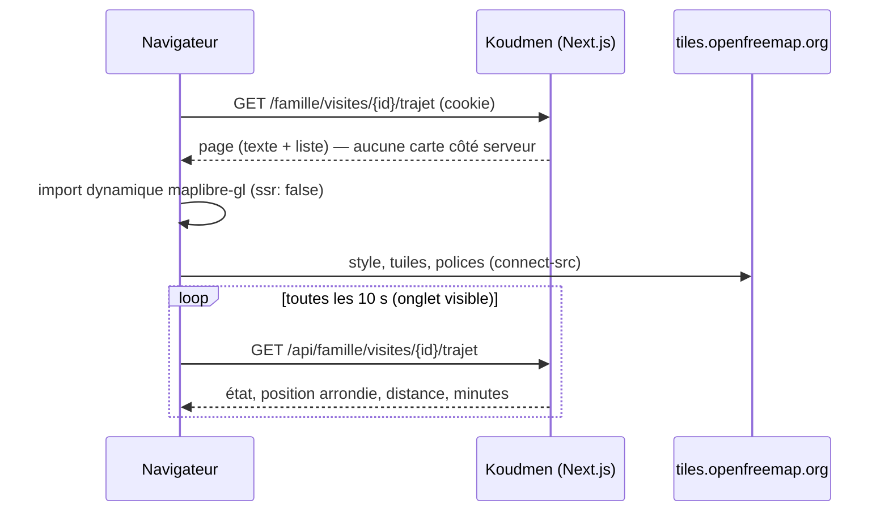

# Intégration — cartes web (lot L1-B, décision L7)

- **Statut :** livré. MapLibre GL JS 5 + tuiles OpenFreeMap (style `positron`), **sans clé**.
- **Pages :** `/famille/visites/{id}/trajet` (« Où en est la visite »), `/operateur/visites/{id}/sos` (position pendant un SOS seulement, R3).
- **Notes du lot :** [`../L1-B-notes.md`](../L1-B-notes.md).

## 1. Chargement

## 2. Règles

| Règle | Mise en œuvre |
|---|---|
| Chargée côté client seulement | `next/dynamic` avec `ssr: false` (`trip-map-client.tsx`) |
| Texte alternatif | La carte est `aria-hidden` ; la liste « Détails du trajet » sous la carte dit tout ; phrase principale en `aria-live="polite"` |
| Mouvement réduit | `prefers-reduced-motion: reduce` → `fitBounds` sans animation |
| Sans WebGL ou sans réseau | Message de remplacement ; la liste textuelle reste |
| CSP | `connect-src 'self' https://tiles.openfreemap.org`, `worker-src 'self' blob:`, `child-src blob:` (`next.config.ts`) |
| Données | Jamais de position brute : 3 décimales (~110 m), précision affichée ≥ 110 m |

## 3. Points ouverts

- [À VÉRIFIER] Conditions d'usage d'OpenFreeMap (service gratuit, sans SLA). Repli possible : tuiles auto-hébergées (PMTiles) ou un fournisseur avec contrat.
- [À VÉRIFIER] Style sombre : `positron` est clair dans les deux thèmes.
- L'app mobile utilise `react-native-maps` (agent C), pas ce composant.
