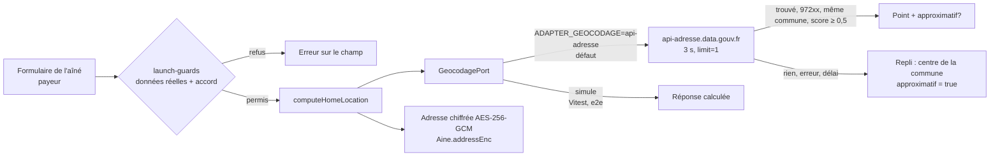

# Intégration — géocodage de l'adresse de l'aîné (lot L1-B)

- **Statut :** livré. Adaptateur `api-adresse` (production, sans clé) et `simule` (tests, e2e).
- **Décisions :** L8 (adresse réelle), R7 (adresse chiffrée, lue par l'accompagnant le jour de la visite, lectures journalisées), R1/R5 (refus sans données réelles autorisées ou sans accord).
- **Notes du lot :** [`../L1-B-notes.md`](../L1-B-notes.md).

## 1. Architecture

| Élément | Fichier |
|---|---|
| Port `GeocodagePort` | `plateforme/src/server/geocodage/port.ts` |
| Adaptateur `api-adresse` | `…/geocodage/api-adresse.ts` |
| Adaptateur `simule` | `…/geocodage/simule.ts` |
| Choix par l'environnement | `…/geocodage/index.ts` |
| Service (chiffrement, repli, lecture journalisée) | `plateforme/src/server/presence/address.ts` |
| Tests contractuels | `…/geocodage/geocodage.test.ts` |

## 2. Variables

| Variable | Valeurs | Défaut |
|---|---|---|
| `ADAPTER_GEOCODAGE` | `api-adresse`, `simule` | `api-adresse` (`simule` sous Vitest ; Playwright le pose) |
| `GEOCODAGE_URL` | URL du service de recherche | `https://api-adresse.data.gouv.fr/search/` |
| `ADDRESS_ENC_KEY` | 32 octets en base64 (`openssl rand -base64 32`) | clé de développement publique hors production stricte ; **obligatoire** en production |

## 3. Règles

1. Un seul résultat demandé (`limit=1`), requête « adresse, commune ».
2. Accepté seulement si : score ≥ 0,5, code postal `972…`, même commune (noms normalisés).
3. `type = housenumber` → point exact (`locationApproximate = false`). Rue, lieu-dit → `approximatif`.
4. Délai 3 s. Erreur ou délai → `null` → centre de la commune, `approximatif`.
5. L'adresse n'est **jamais** écrite dans un journal (serveur ou audit).
6. Domicile approximatif → la position du check-in n'est **pas** comparée (preuve « À vérifier ») et l'arrêt automatique du trajet à 150 m est coupé.

## 4. Points ouverts

- [À VÉRIFIER] Migration annoncée de l'API Adresse vers `data.geopf.fr/geocodage` (IGN). Changer `GEOCODAGE_URL` suffit si le format GeoJSON reste le même.
- [À VÉRIFIER] Qualité de la Base Adresse Nationale en Martinique (lieux-dits, quartiers sans numéro).
- [À VÉRIFIER] Rotation de `ADDRESS_ENC_KEY` : aujourd'hui une seule clé (préfixe `a1:`). Une rotation demande un script de rechiffrement.
