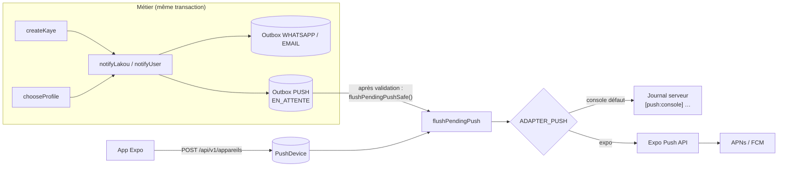
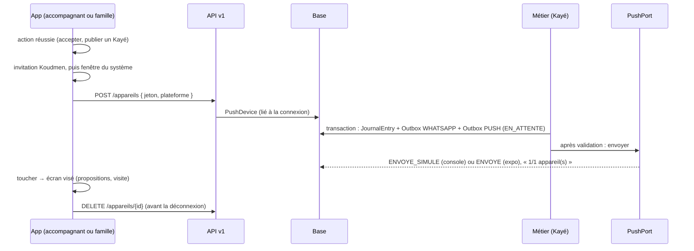

# Intégration — notifications push (lot N1)

- **Statut :** livré en mode `console` (aucun envoi réel). Mode `expo` prêt, à activer après le lot E1 (projet EAS).
- **Décisions :** ADR 0005 (notifications), ADR 0008 (lot N1, vague 3), spécification V1 § 8 et règle **R9**.
- **Routes :** [`api-v1.md` § 10](../api-v1.md#10-lot-n1--appareils-et-notifications-push).

## 1. Architecture (port et adaptateurs)

| Élément | Fichier |
|---|---|
| Port `PushPort` | `plateforme/src/server/notifications/push/port.ts` |
| Adaptateur `console` (sans clé) | `…/push/console.ts` |
| Adaptateur `expo` | `…/push/expo.ts` |
| Choix par l'environnement | `…/push/adaptateur.ts` |
| Textes génériques (R9) | `…/push/templates.ts` |
| Appareils, Outbox, envoi | `…/push/service.ts` |
| Branchement | `plateforme/src/server/outbox.ts` (`notifyUser`), `accompagnant/service.ts` (`createKaye`), `matching/service.ts` (`chooseProfile`) |
| App | `mobile/src/push/**` |

## 2. Configuration

| Variable | Valeurs | Défaut | Où |
|---|---|---|---|
| `ADAPTER_PUSH` | `console` \| `expo` | `console` (aussi si absente ou inconnue) | Serveur |
| `EXPO_ACCESS_TOKEN` | jeton d'accès Expo | vide | Serveur, seulement si la « sécurité renforcée des push » est active sur le projet Expo |
| `extra.eas.projectId` | UUID du projet EAS | absent | `mobile/app.config.ts` (lot E1) |

Aucune clé dans le dépôt. `EXPO_ACCESS_TOKEN` va dans les secrets de l'hébergeur.

## 3. Cycle d'un push

Règles :
1. Le push est écrit **dans la transaction** du métier. Il part **après** la validation. Un Kayé annulé n'envoie rien.
2. Une panne du push ne casse **jamais** l'action (`flushPendingPushSafe`).
3. Chaque message est réservé par une mise à jour conditionnelle : deux envois simultanés n'envoient pas deux fois.
4. `chooseProfile` dans une transaction externe (robots du bac à sable) : le message reste `EN_ATTENTE` et part au prochain envoi.

## 4. Textes (R9)

| Modèle | Titre | Corps |
|---|---|---|
| `PROPOSITION_MISSION` | Koudmen · Nouvelle proposition | Une famille vous propose un accompagnement. Vous êtes libre de répondre oui ou non. |
| `KAYE_PUBLIE` | Koudmen · Nouvelles de votre proche | Un nouveau Kayé est arrivé. Ouvrez Koudmen pour le lire. |
| `ALERTE_A_SURVEILLER` | Koudmen · Nouvelles de votre proche | Un message de l'accompagnant vous attend. Ouvrez Koudmen. Urgence : appelez le 15 ou le 112. |

- V1c (arbitrage X2) : **aucune variable** n'est recopiée dans un push (ni prénom, ni « à surveiller »). Test : `push.test.ts`.
- Journal `console` : plateforme, jeton masqué et écran visé seulement (ni titre ni texte).
- Production stricte : `ADAPTER_PUSH=expo` refusé sans `PUSH_DPO_VALIDE=true` et sans `EXPO_ACCESS_TOKEN` (`config-check.ts`).

## 5. App mobile

| Moment | Comportement |
|---|---|
| Premier lancement | **Rien** n'est demandé |
| Après « Accepter » une proposition ou « Publier le Kayé » | Invitation Koudmen (« Plus tard » / « Activer »), une fois par appareil. Puis la fenêtre du système si « Activer » |
| Refus du système | Jamais redemandé (l'utilisateur peut l'activer dans les réglages du téléphone) |
| Chaque ouverture, session active | Jeton renvoyé (`POST /appareils`) si la permission existe |
| Toucher d'une notification | `propositions` → `/propositions` ; `visite` ou `kaye` → `/visite/{id}` ; données hors contrat → rien |
| Déconnexion | `DELETE /appareils/{id}`, puis `/auth/logout` |
| Web | Push indisponible ; `expo-notifications` absent du paquet web |

Limites connues :
- [À VÉRIFIER] Expo Go (SDK 53 et plus) ne reçoit pas de push distant sur Android. Il faut un build de développement (lot E1).
- Sans `extra.eas.projectId`, aucun jeton n'est demandé (avertissement en développement seulement).
- Le plugin `expo-notifications` (icône, couleur Android) et `google-services.json` (FCM) sont à ajouter au lot E1 (`app.config.ts`, `eas.json`).

## 6. Tests

| Niveau | Fichier | Ce qui est vérifié |
|---|---|---|
| Contrat du port | `plateforme/src/server/notifications/push/push.test.ts` | Les adaptateurs `console`, `expo` (Expo simulé) et `expo` (réseau coupé) passent le même contrat : un résultat par message, dans l'ordre, sans erreur levée |
| Adaptateur Expo | idem | Corps, en-tête `Authorization` facultatif, `DeviceNotRegistered`, HTTP 500, lots de 100 |
| R9 | idem | Aucun texte push ne recopie humeur, nom, commune, niveau |
| Routes | `plateforme/src/app/api/v1/appareils/routes.test.ts` | Auth, jeton Expo obligatoire, champ inconnu refusé, retrait idempotent |
| Base réelle | `…/push/service.db.test.ts` | Push en plus du WhatsApp, déconnexion → révocation, `DeviceNotRegistered`, changement de compte |
| e2e API | `plateforme/e2e/api-v1-push.spec.ts` | Appareil famille → Kayé « à surveiller » → 2 push `ENVOYE_SIMULE` → retrait |
| App | `mobile/src/push/__tests__/push.spec.ts` (`npm run test:push`) | Moment de la demande, retrait, écran ouvert au toucher |

## 7. Passer en envoi réel

1. Lot E1 : projet EAS, `extra.eas.projectId`, identifiants APNs et FCM dans EAS.
2. DPA Expo signé ; décision DPO sur le prénom dans le titre (§ 4).
3. `ADAPTER_PUSH=expo` sur `staging`, puis `production`.
4. [À VÉRIFIER] Lire les reçus Expo (`/getReceipts`, 15 min plus tard) dans un travail planifié : erreurs APNs/FCM tardives.
5. Brancher `purgePushDevices()` sur la purge nocturne.
